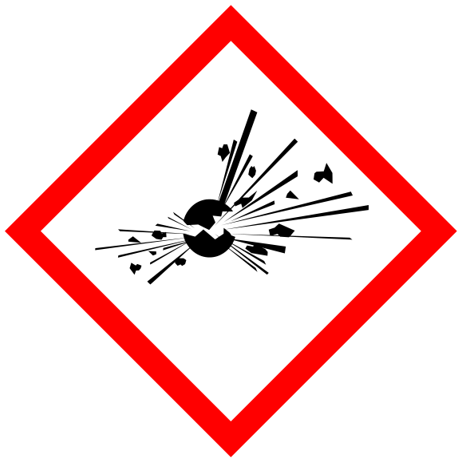

#flashcards/academic/GHS_hazard_pictograms #academic/chemistry

# GHS hazard pictograms

## pictograms

%%
```Python
# 08e5b0a3-f78a-46af-bf50-eb9b12f7fa1e generate data
from pytextgen import gen, read
from pytextgen.config import CONFIG
from pytextgen.gen import Tag, TextCode
from pytextgen.util import Result, Results
cl, cr = CONFIG.cloze_token
data = (
	('GHS01: [explosive](explosive.md)', '', '',),
	('GHS02: [flammable](flammability.md)', '', '',),
	('GHS03: [oxidizing](oxidizing%20agent.md)', '', '',),
	('GHS04: [compressed gas](compressed%20fluid.md)', '', '',),
	('GHS05: [corrosive](corrosive%20substance.md)', '', '',),
	('GHS06: [toxic](toxicity.md)', '', '',),
	('GHS07: harmful', '', '',),
	('GHS08: [health hazard](health%20hazard.md)', '', '',),
	('GHS09: [environmental hazard](environmental%20hazard.md)', '', '',),
)
return Results(
	Result(
		location=__env__.cwf_section('b9a823'),
		text=gen.cloze_text(
			TextCode.compile(gen.rows_to_table(
				data,
				names=('name & pictogram', 'description',),
				values=lambda datum: (
					TextCode.escape(f'{cl}{datum[0]}{cr}<br/>{cl}{datum[1].format(datum[0],)}{cr}'),
					TextCode.escape(f'{cl}{datum[2]}{cr}' if datum[2] else ''),
				),
			)),
			states=await read.read_flashcard_states(__env__.cwf_section('b9a823')),
		),
	),
	Result(
		location=__env__.cwf_section('dee23a'),
		text=gen.memorize_linked_seq(
			gen.seq_to_code(
				map(lambda datum: TextCode.escape(datum[0]), data),
				prefix=f'{{{Tag.MEMORIZE}:_(start)_}}',
				suffix=f'{{{Tag.MEMORIZE}:_(end)_}}',
			),
			hinted=False,
			states=await read.read_flashcard_states(__env__.cwf_section('dee23a')),
		),
	),
)
```
%%

<!--08e5b0a3-f78a-46af-bf50-eb9b12f7fa1e generate section="b9a823"--><!-- The following content is generated at 2023-03-14T16:08:57.065471+08:00. Any edits will be overridden! -->

> name & pictogram | description
> -|-
> {{GHS01: [explosive](explosive.md)}}<br/>{{](../attachments/GHS-pictogram-explos.svg)}} |
> {{GHS02: [flammable](flammability.md)}}<br/>{{](../attachments/GHS-pictogram-flamme.svg)}} |
> {{GHS03: [oxidizing](oxidizing%20agent.md)}}<br/>{{](../attachments/GHS-pictogram-rondflam.svg)}} |
> {{GHS04: [compressed gas](compressed%20fluid.md)}}<br/>{{](../attachments/GHS-pictogram-bottle.svg)}} |
> {{GHS05: [corrosive](corrosive%20substance.md)}}<br/>{{](../attachments/GHS-pictogram-acid.svg)}} |
> {{GHS06: [toxic](toxicity.md)}}<br/>{{](../attachments/GHS-pictogram-skull.svg)}} |
> {{GHS07: harmful}}<br/>{{}} |
> {{GHS08: [health hazard](health%20hazard.md)}}<br/>{{](../attachments/GHS-pictogram-silhouette.svg)}} |
> {{GHS09: [environmental hazard](environmental%20hazard.md)}}<br/>{{](../attachments/GHS-pictogram-pollu.svg)}} |

<!--/08e5b0a3-f78a-46af-bf50-eb9b12f7fa1e-->

<!--08e5b0a3-f78a-46af-bf50-eb9b12f7fa1e generate section="dee23a"--><!-- The following content is generated at 2023-03-14T16:08:57.076503+08:00. Any edits will be overridden! -->

1. _(start)_→:::←GHS01: [explosive](explosive.md)
2. GHS01: [explosive](explosive.md)→:::←GHS02: [flammable](flammability.md)
3. GHS02: [flammable](flammability.md)→:::←GHS03: [oxidizing](oxidizing%20agent.md)
4. GHS03: [oxidizing](oxidizing%20agent.md)→:::←GHS04: [compressed gas](compressed%20fluid.md)
5. GHS04: [compressed gas](compressed%20fluid.md)→:::←GHS05: [corrosive](corrosive%20substance.md)
6. GHS05: [corrosive](corrosive%20substance.md)→:::←GHS06: [toxic](toxicity.md)
7. GHS06: [toxic](toxicity.md)→:::←GHS07: harmful
8. GHS07: harmful→:::←GHS08: [health hazard](health%20hazard.md)
9. GHS08: [health hazard](health%20hazard.md)→:::←GHS09: [environmental hazard](environmental%20hazard.md)
10. GHS09: [environmental hazard](environmental%20hazard.md)→:::←_(end)_

<!--/08e5b0a3-f78a-46af-bf50-eb9b12f7fa1e-->
