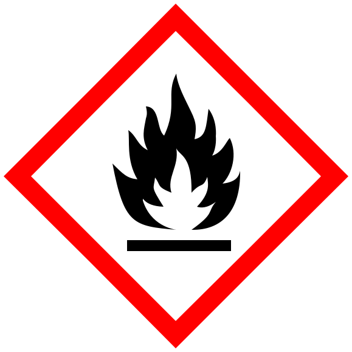

#academic/chemistry #flashcards/academic/Gg/GHS_hazard_pictograms

%%
```Python
# 08e5b0a3-f78a-46af-bf50-eb9b12f7fa1e generate module
# import ../../utility.py.md
```
%%

# GHS hazard pictograms

## pictograms

%%
```Python
# 08e5b0a3-f78a-46af-bf50-eb9b12f7fa1e generate data
e = __env__
return await memorize_table(
	e.cwf_sects('b9a823', 'dee23a'),
	('name & pictogram', 'description',),
	(
		('GHS01: [explosive](explosive.md)', '', '',),
		('GHS02: [flammable](flammability.md)', '', '',),
		('GHS03: [oxidizing](oxidizing%20agent.md)', '', '',),
		('GHS04: [compressed gas](compressed%20fluid.md)', '', '',),
		('GHS05: [corrosive](corrosive%20substance.md)', '', '',),
		('GHS06: [toxic](toxicity.md)', '', '',),
		('GHS07: harmful', '', '',),
		('GHS08: [health hazard](health%20hazard.md)', '', '',),
		('GHS09: [environmental hazard](environmental%20hazard.md)', '', '',),
	),
	lambda datum: (
		f'{cloze(datum[0])}<br/>{cloze(datum[1].format(datum[0]))}',
		cloze(datum[2]),
	),
)
```
%%

<!--08e5b0a3-f78a-46af-bf50-eb9b12f7fa1e generate section="b9a823"--><!-- The following content is generated at 2023-03-20T16:20:30.844432+08:00. Any edits will be overridden! -->

> | name & pictogram | description |
> |-|-|
> | {{GHS01: [explosive](explosive.md)}}<br/>{{](../attachments/GHS-pictogram-explos.svg)}} |  |
> | {{GHS02: [flammable](flammability.md)}}<br/>{{](../attachments/GHS-pictogram-flamme.svg)}} |  |
> | {{GHS03: [oxidizing](oxidizing%20agent.md)}}<br/>{{](../attachments/GHS-pictogram-rondflam.svg)}} |  |
> | {{GHS04: [compressed gas](compressed%20fluid.md)}}<br/>{{](../attachments/GHS-pictogram-bottle.svg)}} |  |
> | {{GHS05: [corrosive](corrosive%20substance.md)}}<br/>{{](../attachments/GHS-pictogram-acid.svg)}} |  |
> | {{GHS06: [toxic](toxicity.md)}}<br/>{{](../attachments/GHS-pictogram-skull.svg)}} |  |
> | {{GHS07: harmful}}<br/>{{}} |  |
> | {{GHS08: [health hazard](health%20hazard.md)}}<br/>{{](../attachments/GHS-pictogram-silhouette.svg)}} |  |
> | {{GHS09: [environmental hazard](environmental%20hazard.md)}}<br/>{{](../attachments/GHS-pictogram-pollu.svg)}} |  | <!--SR:!2023-04-21,16,290!2023-05-27,42,290!2023-04-22,17,290!2023-04-22,17,290!2023-06-18,60,310!2023-04-21,16,290!2023-04-21,16,290!2023-06-17,59,310!2023-04-21,16,290!2023-06-03,45,290!2023-04-21,16,290!2023-06-22,63,310!2023-06-04,45,290!2023-05-30,42,290!2023-06-20,61,310!2023-04-22,17,290!2023-04-21,16,290!2023-04-27,16,270-->

<!--/08e5b0a3-f78a-46af-bf50-eb9b12f7fa1e-->

<!--08e5b0a3-f78a-46af-bf50-eb9b12f7fa1e generate section="dee23a"--><!-- The following content is generated at 2023-03-15T19:16:17.252430+08:00. Any edits will be overridden! -->

1. _(begin)_→:::←GHS01: [explosive](explosive.md) <!--SR:!2023-06-15,57,310!2023-06-23,64,310-->
2. GHS01: [explosive](explosive.md)→:::←GHS02: [flammable](flammability.md) <!--SR:!2023-04-26,9,250!2023-06-16,58,310-->
3. GHS02: [flammable](flammability.md)→:::←GHS03: [oxidizing](oxidizing%20agent.md) <!--SR:!2023-06-14,56,310!2023-06-13,56,310-->
4. GHS03: [oxidizing](oxidizing%20agent.md)→:::←GHS04: [compressed gas](compressed%20fluid.md) <!--SR:!2023-05-21,34,270!2023-05-23,36,270-->
5. GHS04: [compressed gas](compressed%20fluid.md)→:::←GHS05: [corrosive](corrosive%20substance.md) <!--SR:!2023-04-22,7,250!2023-04-22,17,290-->
6. GHS05: [corrosive](corrosive%20substance.md)→:::←GHS06: [toxic](toxicity.md) <!--SR:!2023-05-26,39,270!2023-05-22,35,270-->
7. GHS06: [toxic](toxicity.md)→:::←GHS07: harmful <!--SR:!2023-06-07,51,290!2023-04-22,17,290-->
8. GHS07: harmful→:::←GHS08: [health hazard](health%20hazard.md) <!--SR:!2023-06-21,62,310!2023-05-25,38,270-->
9. GHS08: [health hazard](health%20hazard.md)→:::←GHS09: [environmental hazard](environmental%20hazard.md) <!--SR:!2023-06-23,64,310!2023-06-02,46,290-->
10. GHS09: [environmental hazard](environmental%20hazard.md)→:::←_(end)_ <!--SR:!2023-04-22,17,290!2023-04-21,16,290-->

<!--/08e5b0a3-f78a-46af-bf50-eb9b12f7fa1e-->
