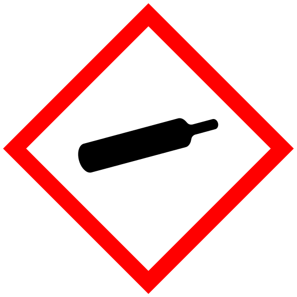

#flashcards/academic/GHS_hazard_pictograms #academic/chemistry

# GHS hazard pictograms

## pictograms

%%
```Python
# 08e5b0a3-f78a-46af-bf50-eb9b12f7fa1e generate data
from pytextgen import gen, read
from pytextgen.config import CONFIG
from pytextgen.gen import Tag, TextCode
from pytextgen.util import Result, Results
cl, cr = CONFIG.cloze_token
data = (
	('GHS01: explosive', '',),
	('GHS02: flammable', '',),
	('GHS03: oxidizing', '',),
	('GHS04: compressed gas', '',),
	('GHS05: corrosive', '',),
	('GHS06: toxic', '',),
	('GHS07: harmful', '',),
	('GHS08: health hazard', '',),
	('GHS09: environmental hazard', '',),
)
return Results(
	Result(
		location=__env__.cwf_section('b9a823'),
		text=gen.cloze_text(
			TextCode.compile(gen.rows_to_table(
				data,
				names=('name', 'pictogram',),
				values=lambda datum: (
					TextCode.escape(f'{cl}{datum[0]}{cr}'),
					TextCode.escape(f'{cl}{datum[1] % datum[0]}{cr}'),
				),
			)),
			states=await read.read_flashcard_states(__env__.cwf_section('b9a823')),
		),
	),
	Result(
		location=__env__.cwf_section('dee23a'),
		text=gen.memorize_linked_seq(
			gen.seq_to_code(
				map(lambda datum: TextCode.escape(datum[0]), data),
				prefix=f'{{{Tag.MEMORIZE}:_(start)_}}',
				suffix=f'{{{Tag.MEMORIZE}:_(end)_}}',
			),
			hinted=False,
			states=await read.read_flashcard_states(__env__.cwf_section('dee23a')),
		),
	),
)
```
%%

<!--08e5b0a3-f78a-46af-bf50-eb9b12f7fa1e generate section="b9a823"--><!-- The following content is generated at 2023-03-13T23:45:09.742134+08:00. Any edits will be overridden! -->

> name | pictogram
> -|-
> {{GHS01: explosive}} | {{}}
> {{GHS02: flammable}} | {{}}
> {{GHS03: oxidizing}} | {{}}
> {{GHS04: compressed gas}} | {{}}
> {{GHS05: corrosive}} | {{}}
> {{GHS06: toxic}} | {{}}
> {{GHS07: harmful}} | {{}}
> {{GHS08: health hazard}} | {{}}
> {{GHS09: environmental hazard}} | {{}}

<!--/08e5b0a3-f78a-46af-bf50-eb9b12f7fa1e-->

<!--08e5b0a3-f78a-46af-bf50-eb9b12f7fa1e generate section="dee23a"--><!-- The following content is generated at 2023-03-13T23:45:09.753664+08:00. Any edits will be overridden! -->

1. _(start)_→:::←GHS01: explosive
2. GHS01: explosive→:::←GHS02: flammable
3. GHS02: flammable→:::←GHS03: oxidizing
4. GHS03: oxidizing→:::←GHS04: compressed gas
5. GHS04: compressed gas→:::←GHS05: corrosive
6. GHS05: corrosive→:::←GHS06: toxic
7. GHS06: toxic→:::←GHS07: harmful
8. GHS07: harmful→:::←GHS08: health hazard
9. GHS08: health hazard→:::←GHS09: environmental hazard
10. GHS09: environmental hazard→:::←_(end)_

<!--/08e5b0a3-f78a-46af-bf50-eb9b12f7fa1e-->
