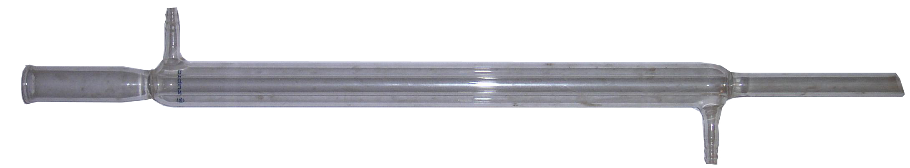
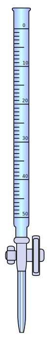
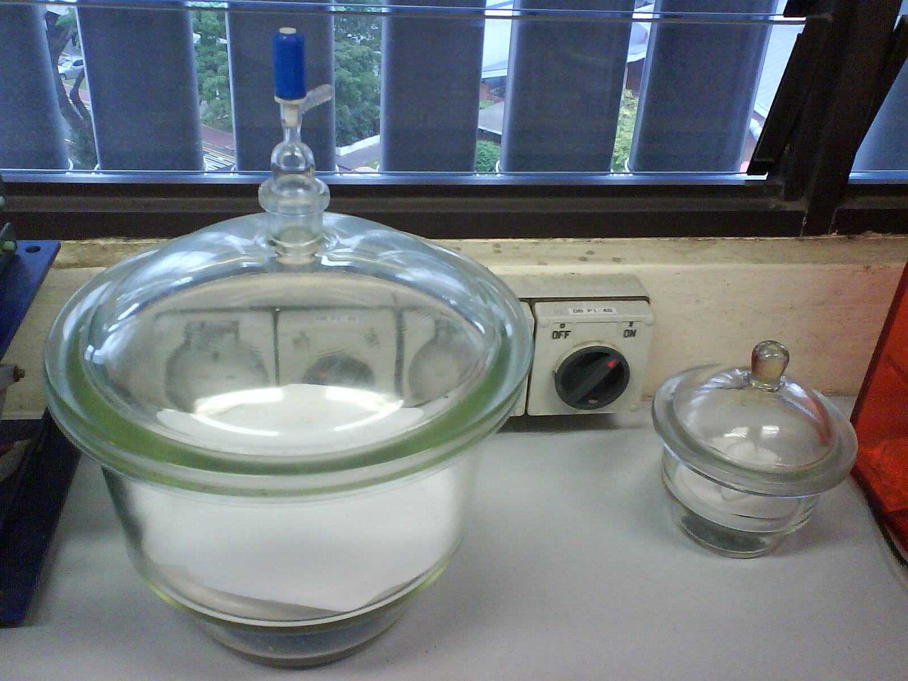
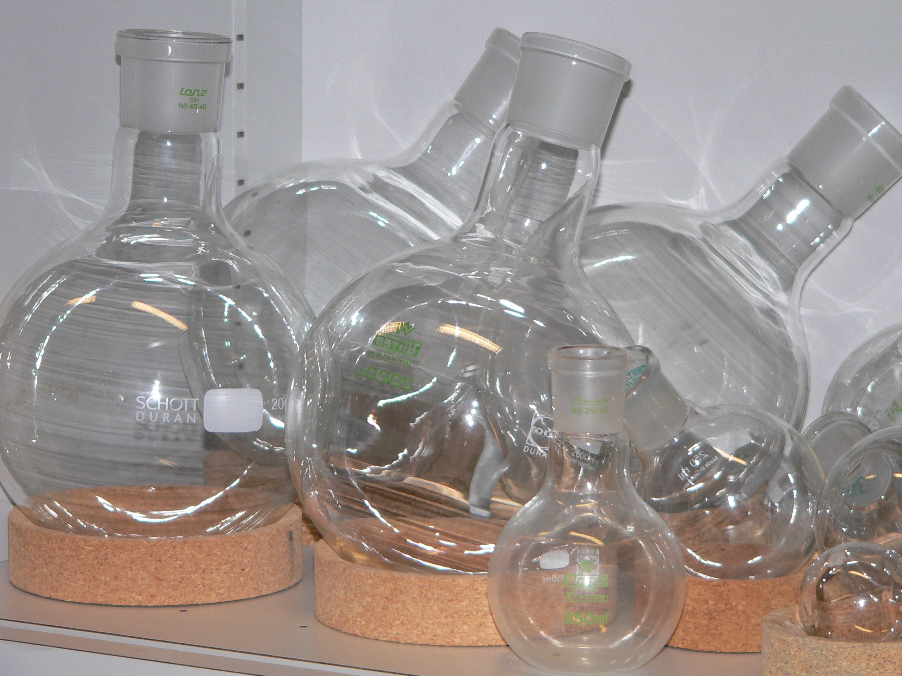
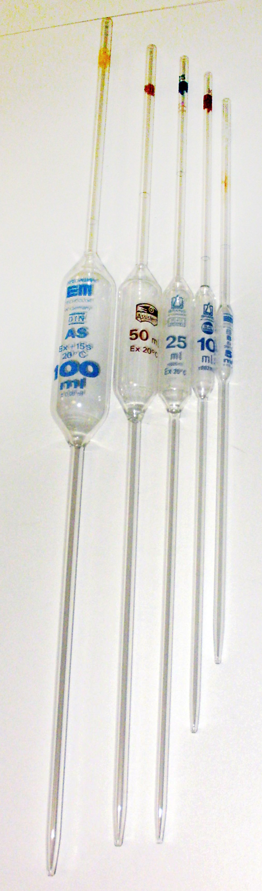

#academic/biology #academic/chemistry #academic/physics #flashcards/academic/Ll/laboratory_equipment

%%
```Python
# 08e5b0a3-f78a-46af-bf50-eb9b12f7fa1e generate module
# import ../../utility.py.md
```
%%

# laboratory equipment

## examples

%%
```Python
# 08e5b0a3-f78a-46af-bf50-eb9b12f7fa1e generate data
from pytextgen.gen import markdown_sanitizer
e = __env__
rinse_water = 'Rinse the equipment with [distilled water](distilled%20water.md) before use.'
rinse_water_soln = 'Rinse the equipment with [distilled water](distilled%20water.md) and then the [solution](solution.md) to be delievered.'
return await memorize_table(
	(e.cwf_section('fadd2e'), e.cwf_section('b81237'),),
	('name & image', 'description',),
	(
		('[Bunsen burner](Bunsen%20burner.md)', '', '',),
		('[Liebig condenser](Liebig%20condenser.md)', '', '',),
		('[beaker](beaker.md)', '', '',),
		('[burette](burette.md)', '', rinse_water_soln,),
		('[burette clamp](burette%20clamp.md)', '.jpg)', '',),
		('[clamp](clamp.md)', '', '',),
		('[conical flask/Erlenmeyer flask/titration flask](Erlenmeyer%20flask.md)', '', rinse_water,),
		('[crucible](crucible.md)', '', '',),
		('[crucible tongs](crucible%20tongs.md)', '', '',),
		('[desiccator](desiccator.md)', '', '',),
		('[(eye) dropper/Pasteur pipette](eye%20dropper.md)', '', '',),
		('dropping bottle', '', 'literally bottle with dropper',),
		('[electronic balance](weighing%20scale.md)', '', '',),
		('[evaporating dish](evaporating%20dish.md)', '', '',),
		('[filter funnel](filter%20funnel.md)', '', '',),
		('[flat-bottom(ed) flask](flat-bottom%20flask.md)', '', '',),
		('[gas jar/pneumatic trough](pneumatic%20trough.md)', '', '',),
		('[glass stirring rod/glass rod/stir(ring) rod](glass%20rod.md)', '', '',),
		('[graduated pipette](graduated%20pipette.md)', '', rinse_water_soln,),
		('[heat-resistant mat/heatproof mat](heatproof%20mat.md)', '', '',),
		('[measuring cylinder/graduated cylinder/mixing cylinder](graduated%20cylinder.md)', '', '',),
		('[mortar and pestle](mortar%20and%20pestle.md)', '', '',),
		('[pipeclay triangle](pipeclay%20triangle.md)', '', '',),
		('[reagent bottle](reagent%20bottle.md)', '', '',),
		('[round-bottom(ed) flask](round-bottom%20flask.md)', '', '',),
		('[rubber bulb](rubber%20bulb.md)', '', '',),
		('[rubber stopper/rubber bung/rubber cork](rubber%20stopper.md)', '', '',),
		('[safety spectacles/safety glasses/goggles](goggles.md)', '', '',),
		('[spatula](spatula.md)', '', '',),
		('[stand/retort stand/ring stand/support stand](retort%20stand.md)', '', '',),
		('[test tube](test%20tube.md), boiling tube', '', 'boiling tube: scaled-up to avoid [bumping](bumping%20(chemistry).md)',),
		('[test tube brush](test%20tube%20brush.md)', '', '',),
		('[test tube holder](test%20tube%20holder.md)', '', '',),
		('[test tube rack](test%20tube%20rack.md)', '', '',),
		('[thermometer](thermometer.md)', '', '',),
		('[tripod](tripod.md)', '', '',),
		('[volumetric flask](volumetric%20flask.md)', '', rinse_water,),
		('[volumetric pipette/bulb pipette/belly pipette](volumetric%20pipette.md)', '', rinse_water_soln,),
		('[wash bottle](wash%20bottle.md)', '', '',),
		('[watch glass](watch%20glass.md)', '', '',),
		('[weighing bottle](weighing%20bottle.md)', '', '',),
		('[wire gauze](wire%20gauze.md)', '', '',),
	),
	lambda datum: (
		f'{cloze(datum[0])}<br/>{cloze(datum[1].format(markdown_sanitizer(datum[0])))}',
		cloze(datum[2]),
	),
)
```
%%

<!--08e5b0a3-f78a-46af-bf50-eb9b12f7fa1e generate section="fadd2e"--><!-- The following content is generated at 2023-03-23T16:01:43.577264+08:00. Any edits will be overridden! -->

> | name & image | description |
> |-|-|
> | {{[Bunsen burner](Bunsen%20burner.md)}}<br/>{{}} |  |
> | {{[Liebig condenser](Liebig%20condenser.md)}}<br/>{{}} |  |
> | {{[beaker](beaker.md)}}<br/>{{}} |  |
> | {{[burette](burette.md)}}<br/>{{}} | {{Rinse the equipment with [distilled water](distilled%20water.md) and then the [solution](solution.md) to be delievered.}} |
> | {{[burette clamp](burette%20clamp.md)}}<br/>{{.jpg)}} |  |
> | {{[clamp](clamp.md)}}<br/>{{}} |  |
> | {{[conical flask/Erlenmeyer flask/titration flask](Erlenmeyer%20flask.md)}}<br/>{{}} | {{Rinse the equipment with [distilled water](distilled%20water.md) before use.}} |
> | {{[crucible](crucible.md)}}<br/>{{}} |  |
> | {{[crucible tongs](crucible%20tongs.md)}}<br/>{{}} |  |
> | {{[desiccator](desiccator.md)}}<br/>{{}} |  |
> | {{[(eye) dropper/Pasteur pipette](eye%20dropper.md)}}<br/>{{}} |  |
> | {{dropping bottle}}<br/>{{}} | {{literally bottle with dropper}} |
> | {{[electronic balance](weighing%20scale.md)}}<br/>{{}} |  |
> | {{[evaporating dish](evaporating%20dish.md)}}<br/>{{}} |  |
> | {{[filter funnel](filter%20funnel.md)}}<br/>{{}} |  |
> | {{[flat-bottom(ed) flask](flat-bottom%20flask.md)}}<br/>{{}} |  |
> | {{[gas jar/pneumatic trough](pneumatic%20trough.md)}}<br/>{{}} |  |
> | {{[glass stirring rod/glass rod/stir(ring) rod](glass%20rod.md)}}<br/>{{}} |  |
> | {{[graduated pipette](graduated%20pipette.md)}}<br/>{{}} | {{Rinse the equipment with [distilled water](distilled%20water.md) and then the [solution](solution.md) to be delievered.}} |
> | {{[heat-resistant mat/heatproof mat](heatproof%20mat.md)}}<br/>{{}} |  |
> | {{[measuring cylinder/graduated cylinder/mixing cylinder](graduated%20cylinder.md)}}<br/>{{}} |  |
> | {{[mortar and pestle](mortar%20and%20pestle.md)}}<br/>{{}} |  |
> | {{[pipeclay triangle](pipeclay%20triangle.md)}}<br/>{{}} |  |
> | {{[reagent bottle](reagent%20bottle.md)}}<br/>{{}} |  |
> | {{[round-bottom(ed) flask](round-bottom%20flask.md)}}<br/>{{}} |  |
> | {{[rubber bulb](rubber%20bulb.md)}}<br/>{{}} |  |
> | {{[rubber stopper/rubber bung/rubber cork](rubber%20stopper.md)}}<br/>{{}} |  |
> | {{[safety spectacles/safety glasses/goggles](goggles.md)}}<br/>{{}} |  |
> | {{[spatula](spatula.md)}}<br/>{{}} |  |
> | {{[stand/retort stand/ring stand/support stand](retort%20stand.md)}}<br/>{{}} |  |
> | {{[test tube](test%20tube.md), boiling tube}}<br/>{{}} | {{boiling tube: scaled-up to avoid [bumping](bumping%20(chemistry).md)}} |
> | {{[test tube brush](test%20tube%20brush.md)}}<br/>{{}} |  |
> | {{[test tube holder](test%20tube%20holder.md)}}<br/>{{}} |  |
> | {{[test tube rack](test%20tube%20rack.md)}}<br/>{{}} |  |
> | {{[thermometer](thermometer.md)}}<br/>{{}} |  |
> | {{[tripod](tripod.md)}}<br/>{{}} |  |
> | {{[volumetric flask](volumetric%20flask.md)}}<br/>{{}} | {{Rinse the equipment with [distilled water](distilled%20water.md) before use.}} |
> | {{[volumetric pipette/bulb pipette/belly pipette](volumetric%20pipette.md)}}<br/>{{}} | {{Rinse the equipment with [distilled water](distilled%20water.md) and then the [solution](solution.md) to be delievered.}} |
> | {{[wash bottle](wash%20bottle.md)}}<br/>{{}} |  |
> | {{[watch glass](watch%20glass.md)}}<br/>{{}} |  |
> | {{[weighing bottle](weighing%20bottle.md)}}<br/>{{}} |  |
> | {{[wire gauze](wire%20gauze.md)}}<br/>{{}} |  | <!--SR:!2023-04-06,4,270!2023-04-06,4,270!2023-04-06,4,270!2023-04-06,4,270!2023-04-06,4,270!2023-04-06,4,270!2023-04-05,3,250!2023-04-05,3,250!2023-04-06,4,270!2023-04-06,4,270!2023-04-05,3,250!2023-04-06,4,270!2023-04-06,4,270!2023-04-06,4,270!2023-04-06,4,270!2023-04-06,4,270!2023-04-06,4,270!2023-04-06,4,270!2023-04-06,4,270!2023-04-06,4,270!2023-04-06,4,270!2023-04-06,4,270!2023-04-06,4,270!2023-04-06,4,270!2023-04-06,4,270!2023-04-06,4,270!2023-04-06,4,270!2023-04-06,4,270!2023-04-06,4,270!2023-04-06,4,270!2023-04-06,4,270!2023-04-06,4,270!2023-04-06,4,270!2023-04-06,4,270!2023-04-06,4,270!2023-04-05,3,250!2023-04-05,3,250!2023-04-05,3,250!2023-04-06,4,270!2023-04-05,3,250!2023-04-06,4,270!2023-04-06,4,270!2023-04-06,4,270!2023-04-06,4,270!2023-04-06,4,270!2023-04-06,4,270!2023-04-06,4,270!2023-04-06,4,270!2023-04-06,4,270!2023-04-06,4,270!2023-04-06,4,270!2023-04-06,4,270!2023-04-06,4,270!2023-04-06,4,270!2023-04-05,3,250!2023-04-06,4,270!2023-04-06,4,270!2023-04-06,4,270!2023-04-06,4,270!2023-04-06,4,270!2023-04-06,4,270!2023-04-06,4,270!2023-04-06,4,270!2023-04-06,4,270!2023-04-06,4,270!2023-04-06,4,270!2023-04-06,4,270!2023-04-06,4,270!2023-04-06,4,270!2023-04-06,4,270!2023-04-06,4,270!2023-04-06,4,270!2023-04-06,4,270!2023-04-06,4,270!2023-04-06,4,270!2023-04-06,4,270!2023-04-06,4,270!2023-04-03,1,230!2023-04-06,4,270!2023-04-06,4,270!2023-04-05,3,250!2023-04-05,3,250!2023-04-06,4,270!2023-04-06,4,270!2023-04-06,4,270!2023-04-06,4,270!2023-04-06,4,270!2023-04-06,4,270!2023-04-06,4,270!2023-04-06,4,270!2023-04-06,4,270-->

<!--/08e5b0a3-f78a-46af-bf50-eb9b12f7fa1e-->

<!--08e5b0a3-f78a-46af-bf50-eb9b12f7fa1e generate section="b81237"--><!-- The following content is generated at 2023-03-23T16:01:43.594725+08:00. Any edits will be overridden! -->

1. _(begin)_→:::←[Bunsen burner](Bunsen%20burner.md) <!--SR:!2023-04-05,3,250!2023-04-06,4,270-->
2. [Bunsen burner](Bunsen%20burner.md)→:::←[Liebig condenser](Liebig%20condenser.md) <!--SR:!2023-04-06,4,270!2023-04-06,4,270-->
3. [Liebig condenser](Liebig%20condenser.md)→:::←[beaker](beaker.md) <!--SR:!2023-04-05,3,250!2023-04-06,4,270-->
4. [beaker](beaker.md)→:::←[burette](burette.md) <!--SR:!2023-04-06,4,270!2023-04-06,4,270-->
5. [burette](burette.md)→:::←[burette clamp](burette%20clamp.md) <!--SR:!2023-04-06,4,270!2023-04-06,4,270-->
6. [burette clamp](burette%20clamp.md)→:::←[clamp](clamp.md) <!--SR:!2023-04-06,4,270!2023-04-06,4,270-->
7. [clamp](clamp.md)→:::←[conical flask/Erlenmeyer flask/titration flask](Erlenmeyer%20flask.md) <!--SR:!2023-04-05,3,250!2023-04-05,3,250-->
8. [conical flask/Erlenmeyer flask/titration flask](Erlenmeyer%20flask.md)→:::←[crucible](crucible.md) <!--SR:!2023-04-05,3,250!2023-04-05,3,250-->
9. [crucible](crucible.md)→:::←[crucible tongs](crucible%20tongs.md) <!--SR:!2023-04-06,4,270!2023-04-06,4,270-->
10. [crucible tongs](crucible%20tongs.md)→:::←[desiccator](desiccator.md) <!--SR:!2023-04-06,4,270!2023-04-06,4,270-->
11. [desiccator](desiccator.md)→:::←[(eye) dropper/Pasteur pipette](eye%20dropper.md) <!--SR:!2023-04-05,3,250!2023-04-06,4,270-->
12. [(eye) dropper/Pasteur pipette](eye%20dropper.md)→:::←dropping bottle <!--SR:!2023-04-05,3,250!2023-04-06,4,270-->
13. dropping bottle→:::←[electronic balance](weighing%20scale.md) <!--SR:!2023-04-06,4,270!2023-04-06,4,270-->
14. [electronic balance](weighing%20scale.md)→:::←[evaporating dish](evaporating%20dish.md) <!--SR:!2023-04-05,3,250!2023-04-06,4,270-->
15. [evaporating dish](evaporating%20dish.md)→:::←[filter funnel](filter%20funnel.md) <!--SR:!2023-04-05,3,250!2023-04-05,3,250-->
16. [filter funnel](filter%20funnel.md)→:::←[flat-bottom(ed) flask](flat-bottom%20flask.md) <!--SR:!2023-04-05,3,250!2023-04-06,4,270-->
17. [flat-bottom(ed) flask](flat-bottom%20flask.md)→:::←[gas jar/pneumatic trough](pneumatic%20trough.md) <!--SR:!2023-04-05,3,250!2023-04-05,3,250-->
18. [gas jar/pneumatic trough](pneumatic%20trough.md)→:::←[glass stirring rod/glass rod/stir(ring) rod](glass%20rod.md) <!--SR:!2023-04-05,3,250!2023-04-05,3,250-->
19. [glass stirring rod/glass rod/stir(ring) rod](glass%20rod.md)→:::←[graduated pipette](graduated%20pipette.md) <!--SR:!2023-04-05,3,250!2023-04-06,4,270-->
20. [graduated pipette](graduated%20pipette.md)→:::←[heat-resistant mat/heatproof mat](heatproof%20mat.md) <!--SR:!2023-04-05,3,250!2023-04-05,3,250-->
21. [heat-resistant mat/heatproof mat](heatproof%20mat.md)→:::←[measuring cylinder/graduated cylinder/mixing cylinder](graduated%20cylinder.md) <!--SR:!2023-04-05,3,250!2023-04-05,3,250-->
22. [measuring cylinder/graduated cylinder/mixing cylinder](graduated%20cylinder.md)→:::←[mortar and pestle](mortar%20and%20pestle.md) <!--SR:!2023-04-05,3,250!2023-04-05,3,250-->
23. [mortar and pestle](mortar%20and%20pestle.md)→:::←[pipeclay triangle](pipeclay%20triangle.md) <!--SR:!2023-04-05,3,250!2023-04-05,3,250-->
24. [pipeclay triangle](pipeclay%20triangle.md)→:::←[reagent bottle](reagent%20bottle.md) <!--SR:!2023-04-05,3,250!2023-04-05,3,250-->
25. [reagent bottle](reagent%20bottle.md)→:::←[round-bottom(ed) flask](round-bottom%20flask.md) <!--SR:!2023-04-05,3,250!2023-04-05,3,250-->
26. [round-bottom(ed) flask](round-bottom%20flask.md)→:::←[rubber bulb](rubber%20bulb.md) <!--SR:!2023-04-05,3,250!2023-04-05,3,250-->
27. [rubber bulb](rubber%20bulb.md)→:::←[rubber stopper/rubber bung/rubber cork](rubber%20stopper.md) <!--SR:!2023-04-05,3,250!2023-04-05,3,250-->
28. [rubber stopper/rubber bung/rubber cork](rubber%20stopper.md)→:::←[safety spectacles/safety glasses/goggles](goggles.md) <!--SR:!2023-04-05,3,250!2023-04-05,3,250-->
29. [safety spectacles/safety glasses/goggles](goggles.md)→:::←[spatula](spatula.md) <!--SR:!2023-04-05,3,250!2023-04-05,3,250-->
30. [spatula](spatula.md)→:::←[stand/retort stand/ring stand/support stand](retort%20stand.md) <!--SR:!2023-04-05,3,250!2023-04-05,3,250-->
31. [stand/retort stand/ring stand/support stand](retort%20stand.md)→:::←[test tube](test%20tube.md), boiling tube <!--SR:!2023-04-05,3,250!2023-04-05,3,250-->
32. [test tube](test%20tube.md), boiling tube→:::←[test tube brush](test%20tube%20brush.md) <!--SR:!2023-04-06,4,270!2023-04-06,4,270-->
33. [test tube brush](test%20tube%20brush.md)→:::←[test tube holder](test%20tube%20holder.md) <!--SR:!2023-04-06,4,270!2023-04-06,4,270-->
34. [test tube holder](test%20tube%20holder.md)→:::←[test tube rack](test%20tube%20rack.md) <!--SR:!2023-04-05,3,250!2023-04-06,4,270-->
35. [test tube rack](test%20tube%20rack.md)→:::←[thermometer](thermometer.md) <!--SR:!2023-04-05,3,250!2023-04-05,3,250-->
36. [thermometer](thermometer.md)→:::←[tripod](tripod.md) <!--SR:!2023-04-05,3,250!2023-04-05,3,250-->
37. [tripod](tripod.md)→:::←[volumetric flask](volumetric%20flask.md) <!--SR:!2023-04-05,3,250!2023-04-06,4,270-->
38. [volumetric flask](volumetric%20flask.md)→:::←[volumetric pipette/bulb pipette/belly pipette](volumetric%20pipette.md) <!--SR:!2023-04-05,3,250!2023-04-05,3,250-->
39. [volumetric pipette/bulb pipette/belly pipette](volumetric%20pipette.md)→:::←[wash bottle](wash%20bottle.md) <!--SR:!2023-04-05,3,250!2023-04-05,3,250-->
40. [wash bottle](wash%20bottle.md)→:::←[watch glass](watch%20glass.md) <!--SR:!2023-04-05,3,250!2023-04-06,4,270-->
41. [watch glass](watch%20glass.md)→:::←[weighing bottle](weighing%20bottle.md) <!--SR:!2023-04-06,4,270!2023-04-05,3,250-->
42. [weighing bottle](weighing%20bottle.md)→:::←[wire gauze](wire%20gauze.md) <!--SR:!2023-04-05,3,250!2023-04-06,4,270-->
43. [wire gauze](wire%20gauze.md)→:::←_(end)_ <!--SR:!2023-04-06,4,270!2023-04-06,4,270-->

<!--/08e5b0a3-f78a-46af-bf50-eb9b12f7fa1e-->
