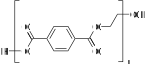
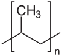
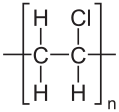

---
aliases:
  - plastic
  - plastics
---

#academic/chemistry #flashcards/academic/Pp/plastic

%%
```Python
# 08e5b0a3-f78a-46af-bf50-eb9b12f7fa1e generate module
# import ../../utility.py.md
```
%%

# plastic

__Plastics__ are {{[synthetic](synthetic%20polymers.md) or semi-synthetic [materials](material.md) consisting of [polymers](polymer.md)}}. <!--SR:!2023-05-28,34,261-->

## types

%%
```Python
# 08e5b0a3-f78a-46af-bf50-eb9b12f7fa1e generate data
e = __env__
return await memorize_table(
	e.cwf_sects('9403', '234a'),
	('name', '[chemical formula](chemical%20formula.md)', '[property(s)](property.md)', 'use(s)',),
	(
		('[high-density polyethylene](high-density%20polyethylene.md) (HDPE)', '', 'higher [melting point](melting%20point.md) than LDPE, low [density](density.md), [rigid](stiffness.md)', '[bottles](bottle.md), [boxes](boxes.md), [buckets](bucket.md)'),
		('[low-density polyethylene](low-density%20polyethylene.md) (LDPE)', '', 'flexible, low [density](density.md), [thermoplastic](thermoplastic.md)', 'flexible cold water pipes, food wrapping films, [plastic bags](plastic%20bag.md)',),
		('[polyethylene terephthalate](polyethylene%20terephthalate.md) (PET)', '', 'high chemical resistance, high [water](water.md) resistance, low [density](density.md), smooth, [strong](strength%20of%20materials.md), [tough](toughness.md)', '[bottles](bottle.md), [clothing](clothing.md), [fibers](fiber.md), lightweight sails',),
		('[polymethyl methacrylate](poly(methyl%20methacrylate).md) (PMMA), Perspex', '', '[hard](hardness.md), [rigid](rigidity.md), [tough](toughness.md), [transparent](transparency%20and%20translucency.md)', '[airplane](airplane.md) windows, [goggles](goggles.md), [plastic optical fibers](plastic%20optical%20fiber.md)',),
		('[polypropylene](polypropylene.md) (PP)', '', 'high chemical resistance, high [melting point](melting%20point.md), low [density](density.md)', '[fibers](fiber.md), [food containers](food%20storage%20container.md), [ropes](rope.md)',),
		('[polystyrene](polystyrene.md) (PS)', '', 'expanded: very low [density](density.md), [rigid](stiffness.md), non-[toxic](toxicity.md), poor [thermal conductivity](thermal%20conductivity.md), [shock](shock%20(mechanics).md)-absorbing; solid: [brittle](brittleness.md), [hard](hardness.md), [transparent](transparency%20and%20translucency.md)', 'expanded: [construction](construction.md), [disposable](disposable%20product.md) [cutlery](cutlery.md), [packaging](packaging%20and%20labeling.md); solid: [optical disc packaging](optical%20disc%20packaging.md), [transparent](transparency%20and%20translucency.md) [containers](container.md)'),
		('[polyvinyl chloride](polyvinyl%20chloride.md) (PVC)', '', '[brittle](brittleness.md), good [electrical conductivity](electrical%20conductivity.md), [poisonous](poison.md), [rigid](stiffness.md) but can become flexible, [waterproof](waterproof.md)', '[electrical cable](electrical%20cable.md) insulation, pipes, [waterproof](waterproof.md) [clothes](textile.md)',),
	),
	lambda datum: map(cloze, datum),
)
```
%%

<!--08e5b0a3-f78a-46af-bf50-eb9b12f7fa1e generate section="9403"--><!-- The following content is generated at 2023-04-08T00:36:52.536120+08:00. Any edits will be overridden! -->

> | name | [chemical formula](chemical%20formula.md) | [property(s)](property.md) | use(s) |
> |-|-|-|-|
> | {{[high-density polyethylene](high-density%20polyethylene.md) (HDPE)}} | {{}} | {{higher [melting point](melting%20point.md) than LDPE, low [density](density.md), [rigid](stiffness.md)}} | {{[bottles](bottle.md), [boxes](boxes.md), [buckets](bucket.md)}} |
> | {{[low-density polyethylene](low-density%20polyethylene.md) (LDPE)}} | {{}} | {{flexible, low [density](density.md), [thermoplastic](thermoplastic.md)}} | {{flexible cold water pipes, food wrapping films, [plastic bags](plastic%20bag.md)}} |
> | {{[polyethylene terephthalate](polyethylene%20terephthalate.md) (PET)}} | {{}} | {{high chemical resistance, high [water](water.md) resistance, low [density](density.md), smooth, [strong](strength%20of%20materials.md), [tough](toughness.md)}} | {{[bottles](bottle.md), [clothing](clothing.md), [fibers](fiber.md), lightweight sails}} |
> | {{[polymethyl methacrylate](poly(methyl%20methacrylate).md) (PMMA), Perspex}} | {{}} | {{[hard](hardness.md), [rigid](rigidity.md), [tough](toughness.md), [transparent](transparency%20and%20translucency.md)}} | {{[airplane](airplane.md) windows, [goggles](goggles.md), [plastic optical fibers](plastic%20optical%20fiber.md)}} |
> | {{[polypropylene](polypropylene.md) (PP)}} | {{}} | {{high chemical resistance, high [melting point](melting%20point.md), low [density](density.md)}} | {{[fibers](fiber.md), [food containers](food%20storage%20container.md), [ropes](rope.md)}} |
> | {{[polystyrene](polystyrene.md) (PS)}} | {{}} | {{expanded: very low [density](density.md), [rigid](stiffness.md), non-[toxic](toxicity.md), poor [thermal conductivity](thermal%20conductivity.md), [shock](shock%20(mechanics).md)-absorbing; solid: [brittle](brittleness.md), [hard](hardness.md), [transparent](transparency%20and%20translucency.md)}} | {{expanded: [construction](construction.md), [disposable](disposable%20product.md) [cutlery](cutlery.md), [packaging](packaging%20and%20labeling.md); solid: [optical disc packaging](optical%20disc%20packaging.md), [transparent](transparency%20and%20translucency.md) [containers](container.md)}} |
> | {{[polyvinyl chloride](polyvinyl%20chloride.md) (PVC)}} | {{}} | {{[brittle](brittleness.md), good [electrical conductivity](electrical%20conductivity.md), [poisonous](poison.md), [rigid](stiffness.md) but can become flexible, [waterproof](waterproof.md)}} | {{[electrical cable](electrical%20cable.md) insulation, pipes, [waterproof](waterproof.md) [clothes](textile.md)}} | <!--SR:!2023-07-01,68,310!2023-07-01,68,310!2023-05-22,29,234!2023-07-23,70,254!2023-07-06,73,314!2023-07-03,70,314!2023-06-04,19,214!2023-06-01,18,210!2023-05-22,37,294!2023-05-27,29,234!2023-06-25,40,210!2023-05-25,5,170!2023-06-17,54,294!2023-06-14,25,210!2023-06-13,40,241!2023-05-27,33,241!2023-06-22,58,301!2023-07-10,76,321!2023-05-24,13,190!2023-05-25,11,190!2023-06-19,55,301!2023-06-21,57,301!2023-05-29,22,241!2023-06-20,44,241!2023-07-21,81,329!2023-07-20,80,329!2023-06-02,19,190!2023-05-29,20,229-->

<!--/08e5b0a3-f78a-46af-bf50-eb9b12f7fa1e-->

<!--08e5b0a3-f78a-46af-bf50-eb9b12f7fa1e generate section="234a"--><!-- The following content is generated at 2023-04-08T00:36:52.523492+08:00. Any edits will be overridden! -->

1. _(begin)_→:::←[high-density polyethylene](high-density%20polyethylene.md) (HDPE) <!--SR:!2023-07-06,73,314!2023-07-09,75,321-->
2. [high-density polyethylene](high-density%20polyethylene.md) (HDPE)→:::←[low-density polyethylene](low-density%20polyethylene.md) (LDPE) <!--SR:!2023-07-05,72,314!2023-07-08,74,321-->
3. [low-density polyethylene](low-density%20polyethylene.md) (LDPE)→:::←[polyethylene terephthalate](polyethylene%20terephthalate.md) (PET) <!--SR:!2023-05-21,14,234!2023-07-04,71,314-->
4. [polyethylene terephthalate](polyethylene%20terephthalate.md) (PET)→:::←[polymethyl methacrylate](poly(methyl%20methacrylate).md) (PMMA), Perspex <!--SR:!2023-06-07,42,289!2023-07-12,53,269-->
5. [polymethyl methacrylate](poly(methyl%20methacrylate).md) (PMMA), Perspex→:::←[polypropylene](polypropylene.md) (PP) <!--SR:!2023-05-28,14,254!2023-09-03,110,294-->
6. [polypropylene](polypropylene.md) (PP)→:::←[polystyrene](polystyrene.md) (PS) <!--SR:!2023-08-22,94,274!2023-06-17,43,294-->
7. [polystyrene](polystyrene.md) (PS)→:::←[polyvinyl chloride](polyvinyl%20chloride.md) (PVC) <!--SR:!2023-07-02,69,314!2023-06-20,56,301-->
8. [polyvinyl chloride](polyvinyl%20chloride.md) (PVC)→:::←_(end)_ <!--SR:!2023-07-02,69,314!2023-07-03,70,314-->

<!--/08e5b0a3-f78a-46af-bf50-eb9b12f7fa1e-->
