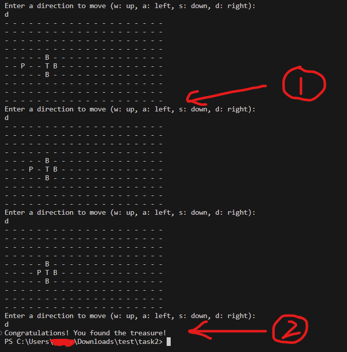

# Task 2 : Treasure hunt

> [!info]- Authors
>
> Li Chi Kin (<ckliam@connect.ust.hk>)

## Task

Your task is to build a simple text-based treasure hunt game. The player must navigate from their starting position to the treasure. The grid will have the following elements:

1. 'P' represents the player's current position
2. 'T' represents the location of the treasure
3. 'B' represents barriers that block the player's path
4. '-' represents an open space where the player can move

Specifically, the assignment requires the following:

1. The user inputs the location of the treasure (TREASURE_ROW, TREASURE_COL) and the exit direction (EXIT_DIRECTION).
2. Initialize the maze with a given number of rows and columns. Fill the entire maze initially with open spaces.
3. Place the treasure in the maze in the preset position.
4. Surround the treasure with north, south, east, and west barriers. One of these barriers should have an exit represented by an open space.
5. The player starts from the top-left corner of the maze (or in the bottom-right corner if the treasure is at the top-left).
6. The player moves in the maze in response to keyboard input: 'w' (up), 'a' (left), 's' (down), 'd' (right). The player cannot move into barriers or outside the maze.
7. The game continues until the player reaches the treasure.

## Assumption

1. The maze can be represented as having a fixed size of 10 rows and 20 columns.
2. Only one exit is created in the barriers surrounding the treasure. The exit is determined by user input.
3. The input of TREASURE_ROW is in range: $0\leq{}n\leq9$
4. The input of TREASURE_COL is in range: $0\leq{}n\leq19$
5. The input of EXIT_DIRECTION is in range: $0\leq{}n\leq3$ and the inputted EXIT_DIRECTION will always create a path for the player to go to the treasure.
6. The treasure and barriers will never occupy the player's initial position.
7. If the player enters anything other than 'w', 'a', 's', 'd', it is considered invalid, and the player is asked for input again.

## Program Output

Some program output reminders:

1. There is no space between the maze and the next prompt. Don't print extra '\n' between them. Please use the functions provided to print the maze.
2. If the player reaches the treasure, only the `Congratulations! ...` line is printed. The maze is not printed once you reach the treasure. The player WON'T go on top of the treasure.

## Example video

These are just examples.

> [2023-09-18 13-36-53.mkv](2023-09-18%2013-36-53.mkv) 4MB 
> Binary

<!-- markdownlint MD028 -->

> [2023-09-18 13-39-20.mkv](2023-09-18%2013-39-20.mkv) 3MB 
> Binary

​---

<https://hkust-robotics-team.gitbook.io/hkust-robotics-team-software-tutorial/tutorial-1-c-and-dev-env-setup/homework/task-2-treasure-hunt>
