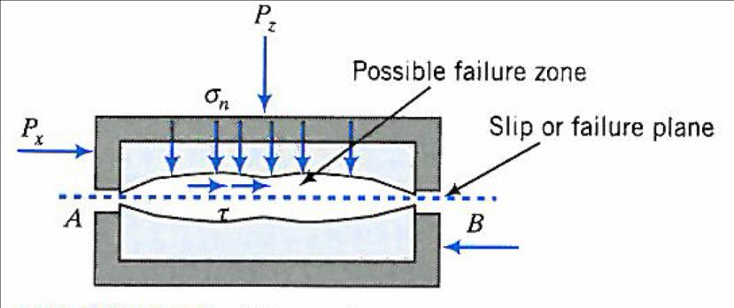

---
aliases:
  - HKUST CIVL 1100 assignment III.1 submission
tags:
  - date/2024/04/28
  - language/in/English
---

# assignment III.1 submission

- HKUST CIVL 1100

CIVL1100 Discovering Civil and Environmental Engineering

<!-- markdownlint-disable-next-line MD036 -->
__Assignment 5: Geotechnical Engineering I__

- __Assigned date__: 22 Apr 2024
- __Due date__: 29 Apr 2024, 23:59 pm

1. __Note 1__. Submit your assignment electronically via CANVAS
2. __Note 2__. Show your homework clearly. When appropriate, illustrate your work with diagrams, and/or figures.

## 5.1

Three direct shear tests were conducted on a dry soil. The effective normal stresses ($\sigma_{nf}'$) and shear stresses ($\tau_f$) at failure in these four tests are as follows (all in kPa): (50, 35); (100, 85); (200, 180); (350, 240).

Assume the soil obeys the Mohr–Coulomb failure criterion:

$$\tau_f = c' + \sigma_{nf}' \tan \phi'$$

### 5.1.a

Plot the test results in $\sigma_{nf}'$–$\tau_f$ space;

> 

### 5.1.b

Hence, determine the effective cohesion, $c'$, and the effective friction angle $\phi'$ of the soil.

_You should use best-fitting method (trend line) with the aid of Microsoft Excel._

> From the [5.1.a](#5.1.a) plot trendline equation in the form of $y = mx + c$, we can infer that:
>
> - $c' = 15.833\text{ kPa}$
> - $\phi' = \arctan 0.681 = 34.2548632 \degree\text{ (cor. to 9 sig. fig.)} = 34.3 \degree\text{ (cor. to 3 sig. fig.)}$

### 5.1.c

What is the difference between effective stress and total stress? How would water in the soil pore affect the shearing behaviour of the soil?

> The difference between effective stress $\sigma'$ and total stress $\sigma$ is that the effective stress also accounts for the internal water pressure $p$ counteracting the externally applied normal force, while total stress is simply the externally applied normal force: $\sigma' = \sigma - p$. So the former is dependent on water pressure while the latter is independent from water pressure.
>
> Water in the soil creates water pressure inside the soil. The water pressure builds up between the frictional surfaces of the soil particles, reducing the normal contact force, and hence the friction between the particles. So the internal friction of the soil is reduced, decreasing its shear strength. So the soil shears more (shear displacement is higher) under the same total stress, and the shear stress at failure is reduced under the same total stress.

## 5.2

Two large diameter bored piles were constructed (D = 2.0 m); one is a straight pile and the other has a bellout with an expanded diameter of 1.5D. Both piles were founded on solid bedrock. Assume an ultimate toe bearing pressure of 15 MPa and neglect the shaft resistance.

### 5.2.a

Calculate the ultimate bearing capacities of these two piles.

> The ultimate bearing capacity of the 1st pile:
>
> $$\begin{aligned}
> & \phantom = \text{required answer} \\
> & = 15 \cdot 10^6 \cdot \left(\frac D 2\right)^2 \pi \\
> & = 15 \cdot 10^6 \cdot \left(\frac 2 2\right)^2 \pi \\
> & = 15\pi \cdot 10^6 \\
> & = 47123889.8\text{ N (cor. to 9 sig. fig.)} \\
> & = 47.1\text{ MN (cor. to 3 sig. fig.)}
> \end{aligned}$$
>
> The ultimate bearing capacity of the 2nd pile:
>
> $$\begin{aligned}
> & \phantom = \text{required answer} \\
> & = 15 \cdot 10^6 \cdot \left(\frac {1.5D} 2\right)^2 \pi \\
> & = 15 \cdot 10^6 \cdot \left(\frac {1.5 \cdot 2} 2\right)^2 \pi \\
> & = 33.75\pi \cdot 10^6 \\
> & = 106028752\text{ N (cor. to 9 sig. fig.)} \\
> & = 106\text{ MN (cor. to 3 sig. fig.)}
> \end{aligned}$$

### 5.2.b

Calculate the allowable capacities of these two piles adopting a factor of safety (FS) = 2.0.

> - allowable capacity of the 1st pile = 47123889.8 / 2.0 = 23561944.9 N = 23.6 MN (cor. to 3 sig. fig.)
> - allowable capacity of the 2nd pile = 106028752 / 2.0 = 53014376 N = 53.0 MN (cor to 3 sig. fig.)
