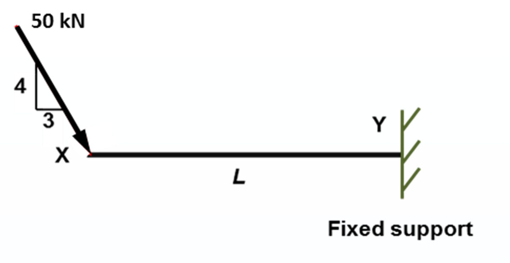

---
aliases:
  - CIVL 1100
  - CIVL 1100 quiz
  - CIVL 1100 quizzes
  - CIVL1100
  - CIVL1100 quiz
  - CIVL1100 quizzes
  - HKUST CIVL 1100
  - HKUST CIVL 1100 quiz
  - HKUST CIVL 1100 quizzes
  - HKUST CIVL1100
  - HKUST CIVL1100 quiz
  - HKUST CIVL1100 quizzes
tags:
  - flashcard/special/academia/HKUST/CIVL_1100/quizzes
  - language/in/English
---

# HKUST CIVL 1100 quizzes

Example quiz questions for preparing exams.

## environmental engineering quiz 1

> __question 1__
>
> Regarding RBRGs in Hong Kong, which of the following statements is INCORRECT?
>
> 1. RBRGs were developed to trace the pre historic origins of pollutants in soil
> 2. RBRGs were developed to have own standards using local relevant soil information
> 3. RBRGs were developed because no local standard existed in the past
> 4. RBRGs were developed for contaminated land management
>
> - solution: {{1}}

<!-- markdownlint MD028 -->

> __question 2__
>
> As per the Risk-Based Remediation Goals (RBRGs) in Hong Kong, the land use scenario having the most stringent remediation standards for contaminants is:
>
> 1. Rural residential
> 2. Industrial
> 3. Urban residential
> 4. Public parks
>
> - solution: {{3}}

<!-- markdownlint MD028 -->

> __question 3__
>
> Which of the following cement hydration products is the most important component for entrapping metal pollutants in soil using solidification/stabilization technology?
>
> 1. C2S (dicalcium silicates)
> 2. C3H (calcium silicate hydrate)
> 3. C3S (tricalcium silicates)
> 4. C3A (tricalcium aluminate)
>
> - solution: {{2}}

<!-- markdownlint MD028 -->

> __question 4__
>
> Regarding municipal solid waste (MSW) composition in Hong Kong, which of the following statements is INCORRECT?
>
> 1. Industrial waste is classified as MSW
> 2. Construction waste is classified as MSW
> 3. Commercial waste is classified as MSW
> 4. Food waste is classified as MSW
>
> - solution: {{2}}

<!-- markdownlint MD028 -->

> __question 5__
>
> Which of the following statements regarding food waste is CORRECT?
>
> 1. In developed countries, the percent of food waste is very little in MSW composition.
> 2. Biological treatment of food waste (such as anaerobic digestion) is an effective treatment method to turn it into energy and also mitigate the burden of landfills
> 3. Food waste has higher energy content because of its rich organic content
> 4. Food waste is the most preferable energy source for incineration because it is environmental friendly
>
> - solution: {{2}}

<!-- markdownlint MD028 -->

> __question 6__
>
> Which of the following statements is CORRECT?
>
> 1. Activated carbon is used to adsorb soot, smoke, and particulates
> 2. Bag house is used to remove metals and dioxins
> 3. Lime scrubber is used to neutralize acid gases (NOx, SOx, HCl)
> 4. Selective catalytic reactor is used to convert nitrogen to nitrogen oxides
>
> - solution: {{3}}

## environmental engineering quiz 2

> __question 1__
>
> Which of the following is not (or will not be) the source of drinking water in Hong Kong?
>
> 1. Local catchment of rain water
> 2. Dongjiang river
> 3. Groundwater
> 4. Desalination from sea water
>
> - solution: {{3}}

<!-- markdownlint MD028 -->

> __question 2__
>
> What is the purpose of adding alum and lime in a typical drinking water treatment plant?
>
> 1. To inactive bacteria
> 2. To adjust pH of water
> 3. To enhance coagulation and flocculation
> 4. To remove odor
>
> - solution: {{3}}

<!-- markdownlint MD028 -->

> __question 3__
>
> Which of the following statements is CORRECT for UV disinfection system?
>
> 1. Produces DBPs
> 2. Inexpensive compare to chlorination
> 3. Bacteria get inactive permanently
> 4. Bacteria may re-grow
>
> - solution: {{4}}

<!-- markdownlint MD028 -->

> __question 4__
>
> There are various treatment levels for wastewater. What treatment process must be included in the "secondary wastewater treatment"?
>
> 1. Biological treatment
> 2. Bar screen
> 3. Filtration
> 4. Chemical enhanced sedimentation
>
> - solution: {{1}}

<!-- markdownlint MD028 -->

> __question 5__
>
> Why should Biochemical Oxygen Demand (BOD) be controlled in wastewater discharges in Hong Kong?
>
> 1. High concentration of BOD reduces the light penetration into water body and interferes with photosynthesis of aquatic plants
> 2. High concentration of BOD causes the depletion of dissolved oxygen and thus leads to the death of aquatic life
> 3. High concentration of BOD increases the solubility and toxicity of metals in water body
> 4. High concentration of BOD leads to the algae bloom
>
> - solution: {{2}}

<!-- markdownlint MD028 -->

> __question 6__
>
> Which of the following order is CORRECT?
>
> 1. COD < BODu < BOD5
> 2. COD < BODu > BOD5
> 3. COD > BODu < BOD5
> 4. COD > BODu > BOD5
>
> - solution: {{4}}

## environmental engineering quiz 3

> __question 1__
>
> Which of the following statement is CORRECT?
>
> 1. When two points sources of 60 dB with the same distance away from the receiver, the combined sound level is 120 dB
> 2. When the distance away from a point source doubles, the sound level drops by 2dB
> 3. When the distance away from a point source reduces by half, the sound level increases by 6 dB
> 4. When the sound pressure increases 100 times, the sound level increases by 10 dB
>
> - solution: {{3}}

<!-- markdownlint MD028 -->

> __question 2__
>
> Which of the following is NOT an engineering solution to protect a residential building from road traffic noise?
>
> 1. Earth bund is installed to provide shielding against the road traffic noise
> 2. Podium decking is used to protect the residential building from road traffic noise
> 3. Commercial block is used as noise tolerant building to protect the residential building from road traffic noise
> 4. Residential building with no balcony is built to reduce the impact of road traffic noise
>
> - solution: {{4}}

<!-- markdownlint MD028 -->

> __question 3__
>
> which of the following is NOT considered as indoor air pollutants?
>
> 1. Asbestos
> 2. Radon
> 3. Nitrogen oxides
> 4. Solvents
>
> - solution: {{3}}

<!-- markdownlint MD028 -->

> __question 4__
>
> Which of the following statements regarding global warming/carbon emission is INCORRECT?
>
> 1. China has the highest in total carbon emission, followed by US and then India
> 2. Some infrared radiation is absorbed and re-emitted to the earth by greenhouse gases causing global warming
> 3. Amount of greenhouse gases is expressed in terms of equivalent amount of carbon
> 4. Global warming is due to the presence of greenhouse gases (GHG)
>
> - solution: {{1}}

<!-- markdownlint MD028 -->

> __question 5__
>
> If the CO2 emission factors or Biodiesel (B100) and Diesel Fuel are 9.46 and 10.15, respectively, then which of the following equivalent emission for B40 is CORRECT in terms of kg CO2/gal?
>
> 1. 9.87 kg CO2/gal
> 2. 9.50 kg CO2/gal
> 3. 9.80 kg CO2/gal
> 4. 10.80 kg CO2/gal
>
> - solution: {{1}}

<!-- markdownlint MD028 -->

> __question 6__
>
> Which is the most dominant source to the local GHG emissions in Hong Kong?
>
> 1. Industry
> 2. Waste
> 3. Buildings
> 4. Transportation
>
> - solution: {{3}}

## geotechnical engineering quiz 1

> __question 1__
>
> Which of the following statement regarding the behaviour of concrete and soil is INCORRECT?
>
> 1. Concrete has better controlled material properties than soil
> 2. Concrete strength does not depend on its self-weight
> 3. Soil can stand up 90 degree, even without any lateral weight
> 4. Soil strength does not depend on its self-weight
>
> - solution: {{4}}

<!-- markdownlint MD028 -->

> __question 2__
>
> Which of the following statements regarding soil Atterberg Limits is INCORRECT?
>
> 1. Plastic limit is normally lower than liquid limit
> 2. Atterberg Limit is a measure of the consistency of a fine-grained soil varies in proportion its moisture content
> 3. A soil is described as "plastic" when  the soil moisture content is higher than the plasticity index
> 4. Soil with moisture content above the liquid limit "feels" like toothpaste
>
> - solution: {{3}}

<!-- markdownlint MD028 -->

> __question 3__
>
> The HKUST student hostel, Hall 6, is supposed by a
>
> 1. shallow foundation on granitic material
> 2. deep foundation on granitic material
> 3. shallow foundation on tuff materials
> 4. deep foundation on tuff materials
>
> - solution: {{3}}

<!-- markdownlint MD028 -->

> __question 4__
>
> A bored pile with a diameter, D, of a 2.5 m is founded also on solid bedrock. The pile has a bellout at the toe with an expanded diameter of 1.5D. Assume an ultimate toe bearing pressure of 20 MPa, a safety factor of 2.0, and neglect the shaft resistance. What is the allowable bearing capacity of the pile?
>
> 1. 49.1 MN
> 2. 441.8 MN
> 3. 220.89 MN
> 4. 110.4 MN
>
> - solution: {{4}}

<!-- markdownlint MD028 -->

> __question 5__
>
> The foundation problems of the Leaning Tower of Pisa is mainly because
>
> 1. The structure is too weak
> 2. The construction quality is poor
> 3. The soil underneath is too soft
> 4. The wind loading is too high
>
> - solution: {{3}}

<!-- markdownlint MD028 -->

## geotechnical engineering quiz 2

> __question 1__
>
> Which of the following is NOT TRUE regarding landslides?
>
> 1. In a rock avalanche, the materials run down a steep hillslope for a long distance
> 2. In a debris flow, a mixture of water and soil flows rapidly up the hillslope
> 3. In a soil slide, a soil mass slides along a slip surface
> 4. In a rock fall, pieces of rock blocks detach from the rock mass and fall down the hill
>
> - solution: {{2}}

<!-- markdownlint MD028 -->

> __question 2__
>
> "A sandy slope of 35 degree could collapse after an intense, prolonged rainfall event, even the soil made of the slope has a friction angle of 40 degree." — Which of the following evaluation about the statement is CORRECT.
>
> 1. It is not possible because there is suction, and hence apparent cohesion, that makes the slope stable.
> 2. It is possible when the groundwater has submerged the entire slope.
> 3. It is possible when the true cohesion of the sand disappears under rainfall
> 4. It is not possible the friction angle is higher than the slope angle.
>
> - solution: {{2}}

<!-- markdownlint MD028 -->

> __question 3__
>
> What kind of tunneling technology has been used in constructing the 5.7 km link tunnel across the navigation channel for the Hong Kong—Zhuhai—Macau Bridge?
>
> 1. Tunnel boring machine
> 2. Open cut and cover
> 3. Drill and blast
> 4. Immersed tube tunnel
>
> - solution: {{4}}

<!-- markdownlint MD028 -->

> __question 4__
>
> Which of the following regarding land reclamation is (are) TRUE? You may choose multiple answers.
>
> 1. Seawall should be constructed before filling the reclamation area
> 2. The seabed must be bedrock
> 3. The seabed mud must always be dredged before placing the fill
> 4. The settlement of a newly reclaimed land can take a long time
>
> - solution: {{1, 4}}

<!-- markdownlint MD028 -->

> __question 5__
>
> A newly reclaimed ground may require ground improvements due to the following reasons EXCEPT:
>
> 1. To increase its bearing capacity
> 2. To make the soil softer
> 3. To eliminate the risk of liquefaction in seismic zones
> 4. To minimize the future settlement
>
> - solution: {{2}}

## week 4 lecture quiz

> 
>
> The cantilever beam is in static equilibrium. The length of the beam is L. Which description is correct?
>
> 1. The beam is unstable.
> 2. The support moment at Y is in clockwise direction.
> 3. The horizontal reaction force at Y is 40 kN in magnitude.
> 4. The vertical reaction force at Y is 30 kN in magnitude
>
> - solution: {{2}} <!--SR:!2024-05-18,4,270-->
