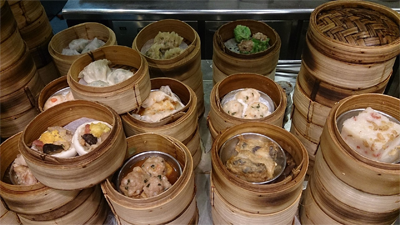
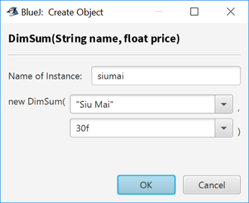
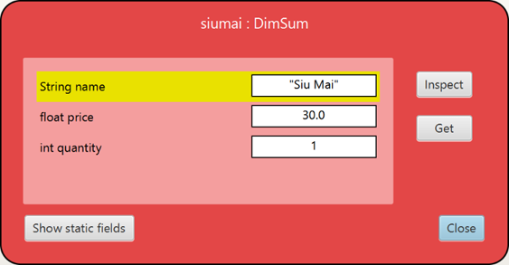

---
aliases:
  - HKUST COMP 1029J exercise for lesson 3
tags:
  - date/2024/01/16
  - language/in/English
---

# exercise for lesson 3

- HKUST COMP 1029J

---

- title: Exercise for Lesson 3
- due: 2024-01-16T23:59:59+08:00
- points: 100
- submitting: a file upload
- file types: java
- available: until 2024-01-16T23:59:59+08:00

---

## __Dim Sum Ordering System__

## Introduction



In this exercise, you will make a dim sum ordering system for the "G/F restaurant". The restaurant only has four different dishes of dim sum, as shown below:

- Barbecued pork bun
- Shrimp dumpling
- Siu mai
- Spring roll

The system shows an ordering menu for people to order dim sum dishes. When they have finished, they can ask for the bill and see the order summary.

To complete the system, you will need to finish three tasks:

1. Complete the __DimSum__ class for storing the information of the dim sum dishes
2. Create the ordering menu
3. Show the bill with the order summary

## Overview

Here is the code of the program:

[DimSum.java](template/DimSum.java)

and [DimSumOrdering.java](template/DimSumOrdering.java)

You will need to put them into the same project for the program to work correctly. The program starts from the main method in the __DimSumOrdering__ class.

The program shows the ordering menu for the dim sum dishes. You can keep on ordering different dim sum dishes from the system. Once the ordering is finished, you can choose to show the bill with the order summary.

You need to finish the three tasks in the starting project. Here is an example output of the finished program.

```console
Welcome to the G/F restaurant!
Please order your dim sum dishes:

1) Barbecued Pork Bun $25.0
2) Shrimp Dumpling $38.0
3) Siu Mai $30.0
4) Spring Roll $25.0

5) Bill and payment

Please enter 1, 2, 3, 4 or 5: 1

Welcome to the G/F restaurant!
Please order your dim sum dishes:

1) Barbecued Pork Bun $25.0
2) Shrimp Dumpling $38.0
3) Siu Mai $30.0
4) Spring Roll $25.0

5) Bill and payment

Please enter 1, 2, 3, 4 or 5:
```

__. . .__ _after ordering a few dim sum dishes_ __. . .__

```console
Please enter 1, 2, 3, 4 or 5: 4

Welcome to the G/F restaurant!
Please order your dim sum dishes:

1) Barbecued Pork Bun $25.0
2) Shrimp Dumpling $38.0
3) Siu Mai $30.0
4) Spring Roll $25.0

5) Bill and payment

Please enter 1, 2, 3, 4 or 5: 5

Qty      Amt      Dish
------------------------------------
1        $25.0    Barbecued Pork Bun
3        $114.0   Shrimp Dumpling
2        $60.0    Siu Mai
1        $25.0    Spring Roll
------------------------------------
Bill Total: $224.0
```

## Task 1. Finishing the DimSum Class

At the moment you can compile both the __DimSum__ class and __DimSumOrdering__ class but you won't find them useful. It is because you will need to fill up most of the content of both classes. In this task, you will complete the __DimSum__ class before working on the __DimSumOrdering__ class in the next task.

First, you need to add the attributes of the __DimSum__ class and then finish the methods by putting appropriate content there.

<!-- markdownlint-disable-next-line MD036 -->
__Adding the Attributes__

There are three attributes we want to add to the class:

- __name__
- __price__
- __quantity__

The __name__ attribute stores the name of the dim sum dish. It will be used when the dim sum is displayed in the ordering program. The __price__ attribute stores the price of one dish of the dim sum. Finally, the __quantity__ attribute is the quantity of the dim sum dishes that has been ordered so far. You need to create the attributes in the appropriate place in the class using appropriate data types. You can assume the __price__ attribute is a float and the __quantity__ attribute is an integer.

After adding the attributes you need to initialize their values in the constructor of the class. Looking at the __DimSum__ class, the constructor has two input parameters called __name__ and __price__. That implies when you create an instance of the __DimSum__ class, you need to provide the name of the dim sum and its price as input parameters. For example, if you want to create the dim sum 'Siu Mai' you will use the following code:

```Java
DimSum siumai = new DimSum("Siu Mai", 30f);
```

The above example creates an instance of the __DimSum__ class and the dimsum object stores the name as __"Siu Mai"__ and its price as 30. For the class, you need to store the input parameters __name__ and __price__ to the __name__ attribute and the __price__ attribute. You may find that you need to use __this.name__ and __this.price__ when you assign the values to the attributes, for example like this:

```Java
this.name = ...;
this.price = ...;
```

After that you also need to initialize the __quantity__ attribute to become 0.

### Finishing getName\(\), getPrice\(\) and getQuantity\(\)

Three methods in the class, __getName\(\)__, __getPrice\(\)__ and __getQuantity\(\)__, have been created so that other code can retrieve the current values of the three attributes respectively. You will need to return the corresponding attribute for each of the methods, rather than a fixed value that is returned by the starting class.

### Finishing order\(\)

The program stores the quantity that each dim sum dish has been ordered so far. When one of the dim sum dishes has been ordered, the program will use the __order__ method to increase the ordered quantity of that dim sum dish. Therefore, the use of __order\(\)__ is to increase the __quantity__ attribute of the class.

### Testing Your Class

Now the __DimSum__ class has been finished. You can test it using the object bench. For example you can create a new instance of __DimSum__ in BlueJ like this:



After creating the object you can inspect the object and you should see this content:


Finally you can test your __order__ method by running it on the siumai object \(right-click and then run _void order\(int quantity\)_ and use 1 as the input\) and then inspecting the object again. Here is what you should get after doing this:



As you can see the quantity of the siumai object has been increased by one.

## Task 2. Creating the Ordering Menu

The program can be started by running the __main__ method from the __DimSumOrdering__ class. After you run it you should see this display:

```console
Welcome to the G/F restaurant!
Please order your dim sum dishes:

5) Bill and payment

Please enter 1, 2, 3, 4 or 5:
```

You can type '5' and then press Enter to stop the program.

Let's first work on the first stage of the program, showing the ordering menu. To do that you need to do the following:

- Printing the menu
- Ordering the dish based on the input

### Printing the Menu

At the moment the menu only shows the choice '5\) Bill and payment'. In this part you need to complete the menu and show the first four choices, i.e. the dim sum dishes.

If you look at the __DimSumOrdering__ class you will find that there is an attribute declared at the top like this:

```Java
// This stores the dim sum dishes in the system
DimSum[] dishes;
```

The attribute is an array of dim sum dishes. You will store the dim sum dishes of the system in this array. You can do that in the constructor of the class. There are four dim sum dishes that you need to assign to the array. Before assigning the dishes to the array, you need to create the array using this line of code:

```Java
dishes = new DimSum[4];
```

Then, for example, you can put 'Siu Mai' as the first dish in the array like this:

```Java
dishes[0] = new DimSum("Siu Mai", 30f);
```

The above code puts a new instance of __DimSum__ as the first item of the array. Since we have four dim sum dishes you will put the other three dishes with appropriate names in the rest of the __dishes__ array. For the exercise, let's set the price of the dim sum dishes to be: Barbecued Pork Bun - \$25, Shrimp Dumpling - \$38, Siu Mai - \$30 and Spring Roll - \$25.

Now, you have the array of the dim sum dishes you can print the first four choices of the menu easily using a loop. Inside the do while loop in the __start__ method you can see the location where the menu is printed. Before printing the fifth choice, i.e. '5\) Bill and payment' you need to print the dim sum dishes as the first four choices in the menu. To do that you can use a for loop like this:

```Java
for (i = 0; i < dishes.length; i++) {
    ... print the text using dishes[i].getName() and dishes[i].getPrice()...
}
```

Your program should produce the following menu after finishing this part of the code:

```console
Welcome to the G/F restaurant!
Please order your dim sum dishes:

1) Barbecued Pork Bun - $25.0
2) Shrimp Dumpling - $38.0
3) Siu Mai - $30.0
4) Spring Roll - $25.0

5) Bill and payment

Please enter 1, 2, 3, 4 or 5:
```

### Ordering the Dishes

After showing the correct menu, you can enter 1, 2, 3 or 4 to start to order the dim sum dishes. In the program, the input is read using this line of code:

```Java
// Read the input
choice = scanner.next();
```

Whatever entered by you has been stored in the __choice__ variable. Depending on the value of the variable you can choose to increase the quantity for one of the dishes. There are many ways to do that. For example, you can use if statements to do that.

In this exercise, let's use the switch statement on the __choice__ variable.

Here is what you need to set up after reading the input:

```Java
switch (choice) {
    case "1":
        ... order the first dish ...
        break;
    case "2":
        ... order the second dish ...
        break;
    case "3":
        ... order the third dish ...
        break;
    case "4":
        ... order the fourth dish ...
        break;
}
```

The above switch statement uses the value of __choice__ to order the corresponding dish. To do that, simply use the __order__ method of that dish with a quantity of 1. However, be careful that the __choice__ input of __"1"__ corresponds to the first dish with an index of 0, i.e. __dishes\[0\]__.

## Task 3. Showing the Bill

After selecting '5' in the menu you need to show the bill and the order summary.

You will do two things in this part. The first thing is to show the order summary.

### Showing the Order Summary

You first display the summary of all orders. This can be done using a for loop to go through the dishes and print one at a time, like this:

```Java
for (i = 0; i < dishes.length; i++) {
    ... print the information of dishes[i] ...
}
```

You need to show the ordered quantity, the subtotal of the dim sum dish and the name of the dish. As you have seen, this is an example display of the summary:

```console
Qty      Amt      Dish
------------------------------------
1        $25.0    Barbecued Pork Bun
3        $114.0   Shrimp Dumpling
2        $60.0    Siu Mai
1        $25.0    Spring Roll
------------------------------------
```

### Counting the Total Amount of the Bill

Finally, you will show the total amount of the bill by adding up all the orders of the dim sum dishes. Again, you can make use of a for loop to do that, like this:

```Java
total = 0;
for (i = 0; i < dishes.length; i++) {
    ... add to the total using dishes[i].getQuantity() and dishes[i].getPrice() ...
}
```

After adding the total amount, you can display the amount appropriate like this:

```console
------------------------------------
Bill Total: $224.0
```

## Testing Your Program

After you finish your program you should make sure that it works by running it a few times using different number of orders for each dim sum dish and then verifying the correctness of the order summary.

## Submission

You need to finish the program in two files called ___DimSum.java___ and ___DimSumOrdering.java___. You can find the files inside the given starting project.

After you have finished your work, upload and submit your file by clicking the "Submit Assignment", and then choosing your file to submit.

## submission

- file: [DimSum.java](submission/DimSum.java)
- file: [DimSumOrdering.java](submission/DimSumOrdering.java)
