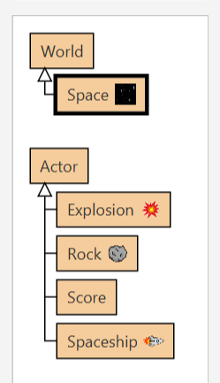
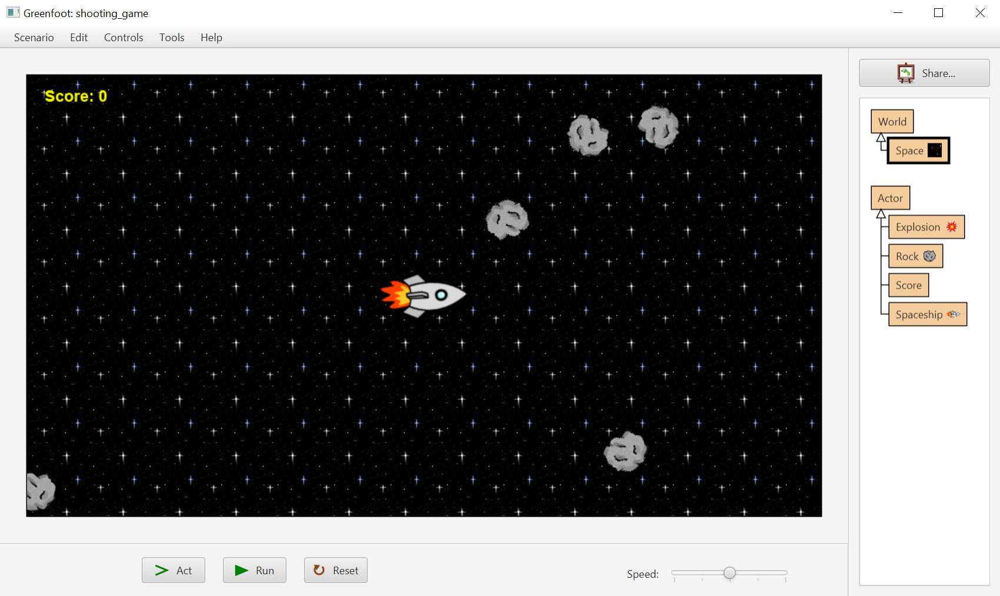
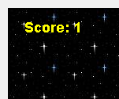

---
aliases:
  - HKUST COMP 1029J exercise for lesson 5
tags:
  - date/2024/01/22
  - language/in/English
---

# exercise for lesson 5

- HKUST COMP 1029J

<!-- list separator -->

- due: 2024-01-28T23:59:59+08:00
- points: 100
- submitting: a file upload
- file types: zip
- available: until 2024-01-28T23:59:59+08:00

## __A Shooting Game__

## Introduction

In this exercise, you will make a shooting game based on the spaceship game we have discussed in the lesson for this week. The game is almost identical to the spaceship game we have made except that the player can now shoot the rocks with a little bullet.

Here is a video showing how the game works:

[shooting\_game.mp4](attachments/shooting_game.mp4.webm) <br/>


You need to finish the game from the given starting scenario. Based on the scenario you need to finish four tasks:

1. Add a moving bullet actor
2. Shoot a bullet when the player presses the spacebar key
3. Destroy a rock when the bullet hits the rock
4. Increase the score when a rock is destroyed

## Overview

You can download the starting scenario here: [shooting\_game.zip](template/shooting_game.zip)

There are a __World__ class and a few __Actor__ classes in the starting scenario as shown below:



The only class that you have not seen in the lesson is the __Score__ class. We will use the __Score__ class later in task 4. If you run the starting scenario you will find that it works exactly the same as the spaceship game we have created in the lesson. You can control the spaceship to move around the game area and the spaceship will be destroyed if a rock hits the spaceship. The only difference is the game area is much bigger in this exercise, as shown below:



Even the code is almost the same!

Let's explain the major features we want you to add before explaining how to do them.

### Shooting a Bullet

Your spaceship can shoot a bullet so that a rock can be destroyed by the bullet when the bullet hits the rock. The bullet comes out from the same position as the spaceship and it travels along the same direction your spaceship is facing.


However, there can only be one bullet in the game. That means after your spaceship shoots one bullet you have to wait for the bullet to go out of the world before you can shoot a bullet again. At any time, there can only be one bullet in the display of the game.

When the bullet hits a rock, i.e. they are very close to each other, the rock is destroyed together with the bullet. After the rock and the bullet are destroyed your spaceship can immediately shoot another bullet again.

### Showing a Score

Your game will keep track of a score. The score initially is zero. When your spaceship destroys a rock the score will be increased by one. The score will be updated and displayed in the top left hand corner of the game.



## Task 1. Adding a Bullet Actor Class

### Adding a Moving Bullet

To shoot a bullet you need to add a bullet image as an __Actor__ class in the scenario. The bullet image is already given in the starting scenario, inside the _images_ folder. The image looks like this:


In your starting scenario you need add a new __Actor__ subclass using the above image. Let's call this class __Bullet__.

After adding the bullet class you will need to make it move. Even though your bullet is supposed to move along the direction of the spaceship, you only need to make it move to the right at this stage. This is similar to what we have done for the __Rock__ class in the lesson. When you move the bullet you need to make it travel faster than the spaceship and the rock, say, using a distance value of 6 when you move the bullet.

After you finish the __Bullet__ class you should be able to manually create new instances of the __Bullet__ class, drag them into the game and see them move to the right of the game by running the scenario.

### Removing the Bullet

Once your bullet moves out of the game area, you need to remove the bullet from the world. During the lesson we have done a similar thing for the rock objects. Therefore, you can use similar code to remove your bullet in this exercise. You have to add the code in the __act__ method of the class. First you use an if statement to check whether the location of the bullet is not within the game area. If the bullet is out of the world you will then need to use the __removeObject__ method to remove it.

## Task 2. Shooting the Bullet from the Spaceship

### Shooting a Bullet When the Spacebar Key Is Pressed

You can shoot a bullet by pressing the spacebar key. In the __act__ method of the spaceship, you see the code to turn the spaceship left \(the left arrow key\), turn right \(the right arrow key\) and move forward \(the up arrow key\). You will add an additional key for controlling the shooting of the bullet. The key you need to use is the spacebar key. For example, the following code checks if the spacebar key, using the text __"space"__, has been pressed:

```Java
if (Greenfoot.isKeyDown("space")) {
    ...shoot the bullet...
}
```

If the spacebar key has been pressed you can shoot the bullet by creating a new instance of the __Bullet__ class and adding it to the world using the __addObject__ method. To do that, you can use the following code:

```Java
Bullet bullet = new Bullet();
getWorld().addObject(bullet, getX(), getY());
```

The above code puts the newly created bullet in the location of the spaceship, as you can see from the use of __getX__ and __getY__ methods in the second line of code. However, there are two problems associated with the above code. First, you can shoot many bullets in a short time by pressing the spacebar key. Second, the bullet will still travel to the right even when your spaceship turns to other direction, like this:


### Checking for the Existing Bullet in the World

To solve the first problem you don't shoot the bullet every time the player presses the spacebar. You only shoot the bullet when there is no bullet currently on the screen. How can you check if there is any bullet on the screen? You can use the __getObjects__ method of the world object to do that. For example, the following if statement checks whether there is any bullet in the world:

```Java
if (getWorld().getObjects(Bullet.class).isEmpty()) {
    ...
}
```

You need to check this condition after the player presses the space bar key but before you shoot the bullet. Similar to the __getObjectsInRange__ method we used in the lesson, the __getObjects__ method returns a list of objects created by the given __Bullet__ class. You then use the __isEmpty__ method on the returned list to check if the list is empty.

If you do this correctly, there is at most one bullet on the screen at any one time. You cannot shoot more than one bullet.

### Turning the Bullet to the Direction of the Spaceship

When you shoot the bullet now the bullet always travels to the right of the game area. This is not what we want in the game. You need to turn the bullet so that it travels in the direction of the spaceship.

There are two helpful methods in this task. The first method is the __getRotation__ method, which allows you to get the current direction of an actor. Another method is the __setRotation__ method, which lets you change the direction of an actor to a specific angle. By using these two methods you can get the direction of the spaceship and then set it to the newly created bullet. You need to do this when you add the bullet to the world.

## Task 3. Destroying the Rocks

When a bullet hits a rock, both the bullet and the rock are destroyed from the world. Recall that we have done a similar task in our game. When the spaceship is very close to the rock, we show the explosion image, remove the spaceship and the game is over. Therefore, you can use similar code to do this task.

You will write the code in the __act__ method of the __Bullet__ class. First, you check whether the bullet is very close to a rock, using this if statement:

```Java
if (!getObjectsInRange(20, Rock.class).isEmpty()) {
    ...
}
```

Notice that the above code uses a distance of 20 because the bullet is very small so the distance should be small. The code searches for any rock very close to the bullet. If a rock is close enough you will destroy the bullet and the rock together. To destroy the bullet you simply use __getWorld\(\).removeObject\(this\)__ to do it. However, it is a bit of trouble to remove the rock. The reason is that you don't know which rock is very close to the bullet in the code.

So you need to get the corresponding rock first. To do that you use the __getObjectsInRange__ method again, together with the __get__ method on the returned list, like this:

```Java
Rock rock = (Rock) getObjectsInRange(20, Rock.class).get(0);
```

The above code means getting the first item from the list returned by __getObjectsInRange__ and putting the item in the __rock__ variable. The variable now contains the rock that is very close to the bullet. You can use the __removeObject__ method to remove it from the world.

Since both the bullet and the rock have been removed you can use the return statement at the end of the if statement like this:

```Java
if (!getObjectsInRange(20, Rock.class).isEmpty()) {
    ...remove the rock and the bullet from the world...

    return;
}
```

The return statement ensures that you don't do anything more when both the rock and the bullet have been destroyed.

## Task 4. Updating the Score

The final task is to update the score of the game. When you run the game the score has already been placed in the top left hand corner. The score is an actor object created from the __Score__ class. If you look into the code of the class, you will see that it draws the score dynamically on the image of the actor. You can also see that you can use the __increase__ method to increase and update the score.

The idea of this task is to increase the score whenever you destroy a rock in the game. In the previous task you remove the bullet and the rock from the world inside the __act__ method of the bullet. In that part of the code you know that you have successfully destroyed a rock using the bullet. Therefore, that is a good place to add your code to increase the score.

To do that, you simply get the score object from the world and then use the __increase__ method on the score. To get the score object, you again make use of the __getObjects__ method from the world object. This time you want to get the score object and thus you need to give the value of __Score.class__ to the method, like this:

```Java
Score score = (Score) getWorld().getObjects(Score.class).get(0);
```

After running the above code the __score__ variable stores the current score object \(there is only one\) in the world. Then you can use the __increase__ method to update the score of the game. You need to do this before the bullet is removed from the world.

## Testing Your Program

After you finish your program you should check each feature of the game carefully. Sometimes it may be useful to lower the probability of the generation of rocks or even stopping the world from generating any rock. However, please make sure you change them back to what they should be, before you submit the work.

## Submission

You need to finish the program in the files inside the given scenario.

After you have finished your work, please put the entire scenario folder in a zip file, upload it and then submit it by clicking the "Submit Assignment", and then choosing your file to submit.

To create a zip file, you can right click on the folder and select compress, which should work in both Windows and Mac machines.

## submission

- file: [shooting_game.zip](submission/shooting_game.zip)
