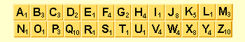
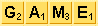

---
aliases:
  - HKUST COMP 1029P exercise for lesson 2
tags:
  - date/2024/01/10
  - language/in/English
---

# exercise for lesson 2

- HKUST COMP 1029P

---

- title: Exercise for Lesson 2
- due: 2024-01-10T23:59:59+08:00
- points: 100
- submitting: a file upload
- file types: py
- available: until 2024-01-10T23:59:59+08:00

---

## __Scrabble Word/Letter Score__

## Introduction

Scrabble is a board game in which each letter in the alphabet has a value, each player has some collection of letters, and the player tries to make words whose total values \(the sum of the values of the letters\) are as large as possible. Below are the letters in a Scrabble game with their scores.



Here are some example words and their total scores:

 = 1\(S\) + 3\(C\) + 1\(R\) + 1\(A\) + 3\(B\) + 3\(B\) + 1\(L\) + 1\(E\) = 14

 = 3\(P\) + 4\(Y\) + 1\(T\) + 4\(H\) + 1\(O\) + 1\(N\) = 14

 = 2\(G\) + 1\(A\) + 3\(M\) + 1\(E\) = 7

You will need to write two Python functions in this exercise. The first function is called letterScore, which is used to find the score of a single letter, and the second function is called scrabbleScore, which is used to find the score of a word.

## Score of a Letter

The first task of the exercise is to write a function called letterScore. The letterScore function looks like this:

```Python
def letterScore(letter):
    # the function content goes here
```

The function takes a string, called letter, as input and returns the score for that letter. Although the input to the function is a string you can assume that it always contains a single letter and is in lower case. The output of the function is a number, which is the score. For example, letterScore\('a'\) should return 1 and letterScore\('z'\) should return 10.

To complete the function you can make use of the following list:

```Python
values = [ ["a", 1], ["b", 3], ["c", 3], ["d", 2], ["e", 1], \
 ["f", 4], ["g", 2], ["h", 4], ["i", 1], ["j", 8], ["k", 5], \
 ["l", 1], ["m", 3], ["n", 1], ["o", 1], ["p", 3], ["q", 10], \
 ["r", 1], ["s", 1], ["t", 1], ["u", 1], ["v", 4], ["w", 4], \
 ["x", 8], ["y", 4], ["z", 10] ]
```

The list contains the scores of all letters, arranged as a list of lists. A simple way to get the score of a particular letter is to go to the correct position of the list and get back the value. For instance, to read the score of the letter 'g' you can use this line of code:

```Python
score = values[6][1]
```

Using the above code, a straightforward way to write the letterScore function is then to use 25 or 26 if, elif, else statements to read the score of one of the 26 letters! For example, like this:

```Python
if letter == "a":
    score = values[0][1]
elif letter == "b":
    score = values[1][1]
...
```

However, it is not very efficient to use so many if statements when you can simply use a for loop instead. Remember that you can use a for loop to look at the content of a list. Therefore, to read the content of the list values, you can use this code:

```Python
for value in values:
    # value contains a [letter, score] pair of one of the letters
```

Inside the for loop you can use one single if statement to check if your current value contains the input letter, i.e.:

```Python
if letter == value[0]:
    ...
```

If the condition is true, which means the value contains the input letter, you can return that score as the return value of your letterScore function.

After that, write a function called scrabbleScore\(letters\) that takes a string as input \(it will be a word\) and returns the total score of all the letters in that string. The scrabbleScore\(\) function uses the letterScore\(\) function.

## Score of a Word

After you have completed the letterScore function you can then use the function to get the total score of a word. The second task of the exercise is to write another function called, scrabbleScore, to get the total score of a word. The scrabbleScore function takes a string as input and returns the total score of all of the letters in that string. In this exercise your scrabbleScore function must use the letterScore function in order to find the total score.

Since you can already get the score of each letter of a word \(how?\) what you need to do now is simply adding up the scores of all letters in a word. However, how can you read each letter of a word and get its score? You can make use of for loop again.

Using a for loop you can go through a string, meaning to read a string letter by letter, just like what you can do with a list! For example, you can do this:

```Python
def reverse(word):
    """ Reverses the order of an input word and return the
    result """

    result = ""
    for letter in word:
        result = letter + result
    return result
```

[reverse.py](attachments/reverse.py)

This function reads an input string and returns a reversed string. Here is an example result of using the function:

```Python
>>> reverse('hello')
'olleh'
```

Looking at the code of the reverse function you can see this line of code:

```Python
for letter in word:
    ...
```

This for loop means looking at each letter in a string, called word here, from left to right. You can use the same idea to look at each letter of a word, get its score and then add the score to the total score of the word. After summing up the scores you can return the total score as the output of the function.

## Example Sequence

Here are some examples of using scrabbleScore\(\):

```Python
>>> scrabbleScore('cat')
5
>>> scrabbleScore('apple')
9
>>> scrabbleScore('python')
14
>>> scrabbleScore('quetzal')
25
>>> scrabbleScore('jonquil')
23
>>> scrabbleScore('syzygy')
25
```

\(The words 'quetzal', 'jonquil', and 'syzygy' are part of the English language, but they are rare. Most native English people won't know them. However, because they contain letters which have a high score, such as 'q' and 'z', they are good words to use when playing scrabble\).

## Starting Code

You may download the code below as your starting code:

[scrabble.py](template/scrabble.py)

To test your letterScore\(\) and scrabbleScore\(\) function, you can open your ___scrabble.py___ file in the IDLE environment. Then execute 'Run Module' by hitting 'F5'. \(In the event that you are using a different environment than IDLE, you can use from scrabble import \* instead, which does the same thing.\) You can then test the individual functions by typing them in the shell. Also, if you run scrabbleScore 6 times in the shell like the example sequence shown above it should show exactly the 6 answers shown there.

## Submission

You need to write the two functions in a file called ___scrabble.py___.

In your scrabble.py, include these:

- the letterScore\(\) function, which takes a single letter and returns the score of the letter
- the scrabbleScore\(\) function, which takes a word and returns the score of the word

After you have finished your work, upload your file and then submit by clicking the "Submit Assignment", and then choosing your file to submit.

## submission

- file: [scrabble.py](submission/scrabble.py)
