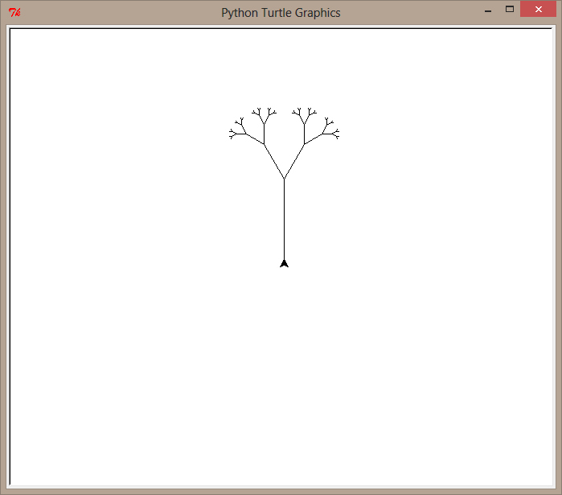
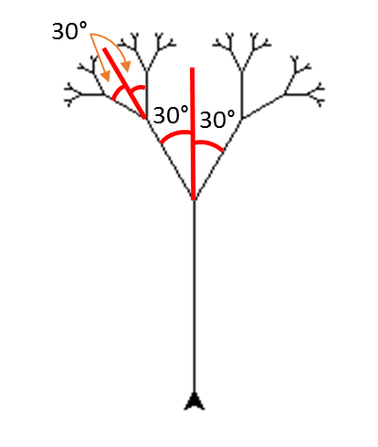
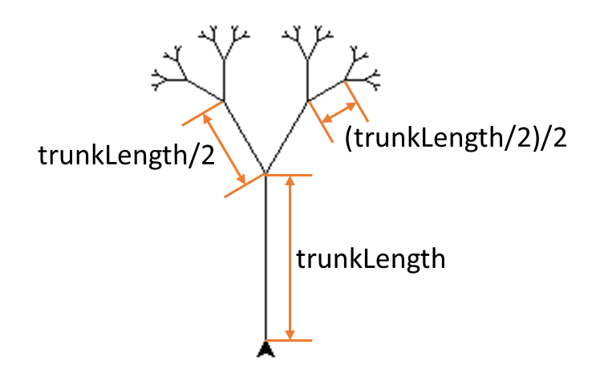
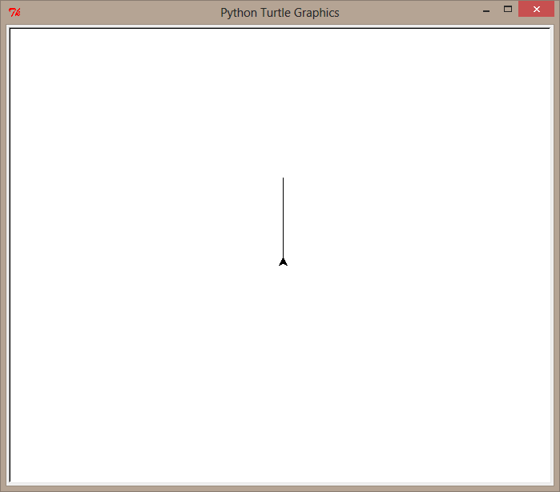
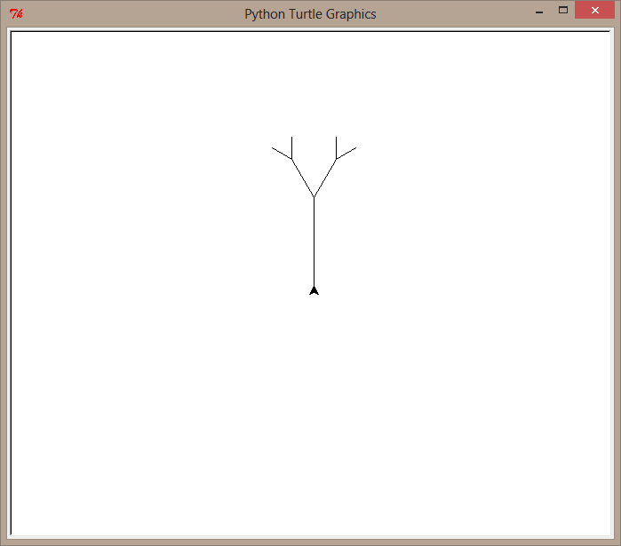
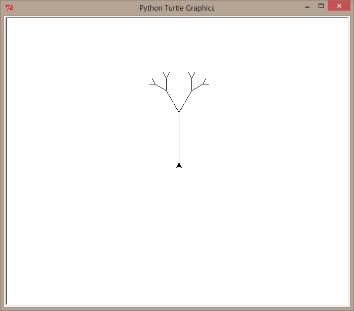

---
aliases:
  - HKUST COMP 1029P exercise for lesson 5
tags:
  - date/2024/01/28
  - language/in/English
---

# exercise for lesson 5

- HKUST COMP 1029P

<!-- list separator -->

- due: 2024-01-28T23:59:59+08:00
- points: 100
- submitting: a file upload
- file types: py
- available: until 2024-01-28T23:59:59+08:00

## __Recursion Tree__

## Introduction

In this exercise, you need to write a function called tree\(\), i.e.:

```Python
def tree(trunkLength, currentDepth, maximumDepth):
    ...
```

This function draws a recursive tree using turtle graphics, as suggested by [Lesson 5.3 - Drawing Trees](lesson%205.3%20-%20drawing%20trees.md).

The following image shows you the kind of display your code can produce when running the function using this:

```Python
tree(100, 0, 5)
```



## Starting Code

You may download the code below as your starting code:

[tree.py](template/tree.py)

## Drawing a Tree Recursively

### Making Your Tree Grow Upwards

The turtle initially always looks at the right hand side. That means it draws line towards the right if you do not turn the turtle.

As trees always grow upwards, you need to ask the turtle to grow the tree up by turning your turtle to look up.

After that, you will use a recursive approach to draw your tree.

### A Recursive Approach

The basic approach is as follows.

- Draw a line with length __trunkLength__
- If the maximum depth has not yet been reached, then:
  - turn left by a particular __angle__, and then recursively call the __tree__ function to draw a tree with half the line length and one depth higher, i.e.:

  ```Python
  tree(trunkLength / 2, currentDepth + 1, maximumDepth)
  ```

  - turn right by __2 \* angle__, and then recursively call the __tree__ function to draw a tree with half the line length and one level lower, i.e.:

  ```Python
  tree(trunkLength / 2, currentDepth + 1, maximumDepth)
  ```

The angle you use is up to you. 30 degrees is probably a good value to use. For example, the tree shown in the images on this page uses an angle of 30 degrees, as shown below:



When drawing the tree from one depth to another the trunk length is halved in the second depth. This is illustrated in the following figure:



Initially the trunk length is the value of the __tree\(\)__ function parameter __trunkLength__. When drawing the tree on the next depth, the trunk length is halved, which becomes __trunkLength/2__. Moving to another depth of the tree reduces the trunk length further, which is half of __trunkLength/2__, i.e. __\(trunkLength/2\)/2__.

There's one thing that you'll need to be careful to do here. It's very important that when the turtle is finished drawing the tree, it returns to where it started and faces the same direction that it originally had. Why is this? If we make sure that every time we call __tree__ it returns to where it started, then we know that when we complete the recursive call that draws the smaller tree, the turtle will be where it started, namely at the base of that smaller tree. Then, you can rotate the turtle appropriately and have it start drawing the second smaller tree. If you aren't careful to return the turtle to where it started, then you won't know where the turtle is located when it's done drawing \(part of\) a tree and you won't know where to place it to draw the next tree.

One thing that is useful to know is, if you draw a line using __forward\(100\)__, you can easily move the turtle back to the starting position by using __backward\(100\)__, i.e. move back using the length of the line you have just drawn. This is useful when you want to move the turtle back to the starting position after drawing a tree.

Notice that the second parameter __currentDepth__ should always be 0 initially because the starting depth is 0 in a recursive function. The function first handles the recursive depth 0 \(which means no recursion\). If the maximum depth of recursion isn't reached yet, the function calls itself twice with __trunkLength__ value being halved, and so on, until it reaches __maximumDepth__.

The given __tree\(\)__ function has been structured in the same way as the above descriptions.

```Python
def tree(trunkLength, currentDepth, maximumDepth):
    """ Draw a tree with turtle graphics recursively. """

    # Draw a trunk
    # Complete this

    if currentDepth < maximumDepth:
        # Turn left for 'angle' degrees
        # Complete this

        # Recursively draw a smaller tree
        # Complete this

        # Turn right for 2 * 'angle' degrees
        # Complete this

        # Recursively draw another smaller tree
        # Complete this

        # Turn left for 'angle' degrees, so that the 
        # turtle faces its original starting direction
        # Complete this

    # Return to the original starting position
    # Complete this
```

You can complete the function by 'filling in the blanks'.

Let's look at some examples of using the __tree\(\)__ function.

Here is the result of running __tree\(100, 0, 0\)__:



Here is the result of running __tree\(100, 0, 2\)__:



Here is the result of running __tree\(100, 0, 3\)__:



## Testing Your Program

You can test your program by simply opening it up in IDLE and then execute 'Run Module' by hitting 'F5'.

You can run __tree\(\)__ using different sets of parameters like the examples shown above. If you do that, you should get the same results.

## Submission

You need to complete the tree program and save it in a file called ___tree.py___.

After you have finished your work, upload your file and then submit by clicking the "Submit Assignment", and then choosing your file to submit.

## submission

- file: [tree.py](submission/tree.py)
