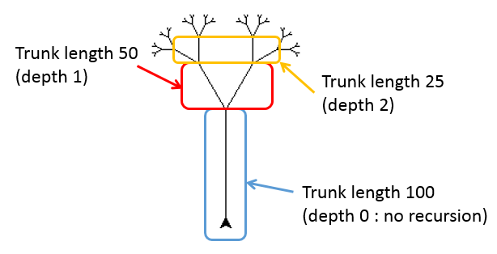

---
aliases:
  - HKUST COMP 1029P lesson 5.3 - drawing trees
tags:
  - language/in/English
---

# lesson 5.3 - drawing trees

- HKUST COMP 1029P

## Drawing Trees

Now, we'll use recursion with turtle graphics to do something more interesting \(and something that would be difficult to do without recursion\). We'll draw "trees"!

Take a look at the tree below:

This tree is said to have a maximum recursive depth of 5. Here's why: There is a trunk of the tree with length 100. It is indicated as depth 0 of the recursive function in the figure below. The number 0 simply means that there isn't any recursion taken place at this stage. Then, at the end of the trunk it divides into two branches. The turtle has rotated left \(30 degrees in this example\) for the left branch and then right \(30 degrees in this example\) for the right branch. Each length is equal to half of the original trunk and is indicated as depth 1. Similarly, the turtle rotated left and right again at the end of the two trunks at depth 1, making another 4 branches of half the size at depth 2, and so on. Until the recursive depth has met the maximum depth of 5.

This tree is "naturally" recursive because it is made of a trunk \(a line\) and then two smaller trees. The smaller trees also have a trunk \(a line\) and then two smaller trees. In other words, the pattern is always the same, so it will be easy to build the tree using a recursive function.

So, you'll soon write a function called tree\(trunkLength, currentDepth, maximumDepth\). The function will draw a tree whose initial trunk length is given by trunkLength.Then:

- If the current depth is 0, we just draw a line at the given trunkLength and we're finished.
- Otherwise, we draw a line of the given trunkLength, then:
  - Turn left by a particular angle \(such as 30 degrees\), and recursively call the tree function to draw a tree with half the trunk length and one depth higher.
  - When that's done, we rotate the turtle to the right and draw a second tree, recursively, just like we did with the first smaller tree.

There's one thing that you'll need to be careful to do here. It's very important that when the turtle is done drawing the tree, it returns to where it started and facing in the same direction that it started.

Why is this? If we make sure that every time we call tree it returns to where it started, then we know that when we complete the recursive call that draws the smaller tree \(shown circled in red above\), the turtle will be where it started, namely at the base of that smaller tree \(which is the right end of the trunk of length 100 highlighted in blue\). Then, you can rotate the turtle appropriately and have it start drawing the second smaller tree. If you aren't careful to return the turtle to where it started, then you won't know where the turtle is located when it's done drawing \(part of\) a tree and you won't know where to place it to draw the next tree.

If all this sounds a bit hard to understand, you may find it becomes a lot clearer when you do the exercise which you will soon see.
