---
aliases:
  - HKUST COMP 1029V exercise for lesson 2
tags:
  - date/2024/01/10
  - language/in/English
---

# exercise for lesson 2

- HKUST COMP 1029V

<!-- list separator -->

- due: 2024-01-10T23:59:59+08:00
- points: 100
- submitting: a file upload
- file types: xlsm
- available: until 2024-01-10T23:59:59+08:00

## __Equation Solver__

## Introduction

In this exercise, you will build a quadratic equation solver inside an Excel worksheet.

You should already know that a quadratic equation takes the following form:

&emsp; _ax_<sup>2</sup> + _bx_ + c = 0

_a_, _b_ and _c_ are coefficients of the equation. To solve for _x_ in the above equation, we will first find the discriminant _D_. The equation to find _D_ is shown below:

&emsp; _D_ = _b_<sup>2</sup> - 4<!-- markdown separator -->_ac_

If _D_ is positive, the equation will have two possible solutions. If _D_ is 0, the equation will have a unique solution. Otherwise, if _D_ is negative, the equation will have no real solution. Finally, the solution\(s\) of the equation can then be calculated using the following formulas:

&emsp; _x_ = \(-_b_ + √<!-- markdown separator -->_D_\) / 2<!-- markdown separator -->_a_ and _x_ = \(-_b_ - √<!-- markdown separator -->_D_\) / 2<!-- markdown separator -->_a_

As you can see, if _D_ is zero, there will only be one single value of _x_.

You need to complete an Excel worksheet in this exercise. This worksheet uses two different approaches to solve a quadratic equation. The first approach solves a quadratic equation using Excel formulas. The second one solves the same equation using VBA code. You can use this simple exercise to get familier with how to use Excel formulas and especially how to start writing VBA code in Excel.

Here are the tasks you have to complete in the exercise:

1. Understanding the Excel Worksheet
2. Solving the Equation Using Excel Formulas
3. Solving the Equation Using VBA Code

## Overview

You can download the starting Excel file here: [___eqsolver.xlsm___](template/eqsolver.xlsm)

Here is an example of what you see after you finish the exercise:

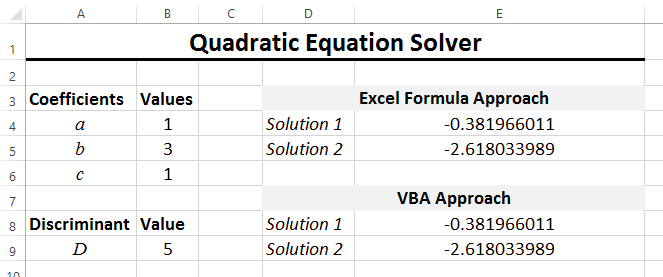

The above picture shows you an equation with two solutions. If the equation has only one solution, the worksheet will look like this:

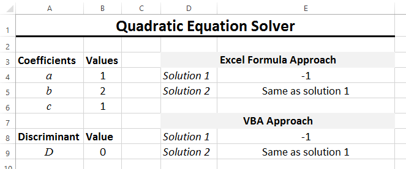

Finally, if there is no solution, the worksheet will show the result like this:

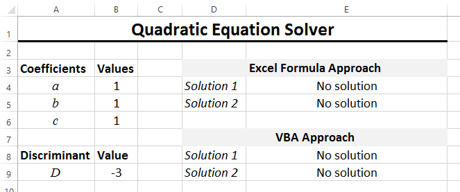

You will finish three tasks so that your Excel file will work like the one from above.

## Task 1. Understanding the Excel Worksheet

You need to understand the structure of the worksheet in the Excel file before you can start working on the formulas and VBA code.

### The Excel Worksheet

Here is the worksheet in the given Excel file.

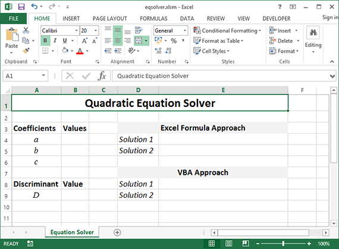

There is only one worksheet in this Excel file. The name of this worksheet is called 'Equation Solver'. It is always nice to change the name of the worksheet to a meaningful name but, in this exercise, we don't really need to use this name in any way in the following tasks.

You can see that there are already some content inside the worksheet. There are some cells acting as the inputs of the quadratic equation and some are outputs for storing the solutions of the equation.

### Cells for Entering the Coefficients

There are three coefficients for a quadratic equation. These three values _a_, _b_ and _c_ can be entered in the worksheet in the following three cells.

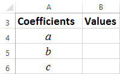

You can refer to these cells by their cell addresses, i.e. B4, B5 and B6. Alternatively, we have already assigned a _cell name_ for each of these cells. To see the name of each cell, you can select the cell and then look for the name in the top-left corner of the worksheet. For example, after you select cell B4, you can see the name of the cell is _CoefficientA_, as shown below.

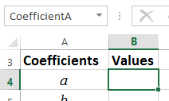

Similarly, the cell for entering the coefficient _b_ is called _CoefficientB_ and the cell for entering the coefficient _c_ is called _CoefficientC_.

Later in the exercise, we will use the names of cells rather than their cell addresses.

### The Discriminant

To find the solution of a quadratic equation you will need to find the value of the discriminant. We will do that in a cell inside the worksheet, as shown below:

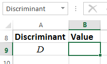

The cell is cell B9 but, again, we will use a name for this cell later in our coding. The name is _Discriminant_, as you can see from the top-left corner of the worksheet.

### Cells for Solving the Equation Using Excel Formulas

Once the discriminant is found we can solve for the solutions easily using the formulas we have mentioned near the start of the page. As there are two approaches in this exercise, we will put the solutions of the Excel formula approach in the following cells:

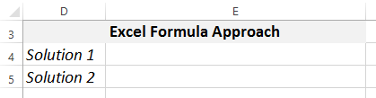

The two cells containing the solutions of the equation are cell E4 and cell E5.

### Cells for Solving the Equation Using VBA Code

For the solutions calculated by the VBA approach, they are stored in cells E8 and E9, as shown below:

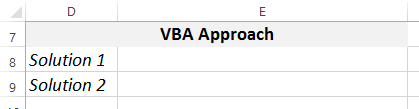

They are named _Solution1_ and _Solution2_ respectively. We will use these names in the VBA code later.

## Task 2. Solving the Equations Using Excel Formulas

Let's try to solve the quadratic equation using Excel formulas.

At the moment, you can enter the coefficients in cell B4, B5 and B6 but you will not see the discriminant or the solutions shown correctly in the worksheet. This is because we will have to fill in the Excel formulas for these cells.

### Entering the Formula for Calculating the Discriminant

The first thing we need to do is to calculate the discriminant. To do that you fill the formula in cell B9. Reminded that the equation to calculate the discriminant is like this:

&emsp; _D_ = _b_<sup>2</sup> - 4<!-- markdown separator -->_ac_

You just need to put this equation as an Excel formula in the cell. The above equation has the coefficients _a_, _b_ and _c_. To refer to them you will use _CoefficientA_, _CoefficientB_ and _CoefficientC_ respectively. Therefore, you can represent the above equation using this formula:

```text
=CoefficientB * CoefficientB - 4 * CoefficientA * CoefficientC
```

You need to put this formula in the appropriate place, i.e. the cell for storing the value of the discriminant. After filling in the formula you can test it out using various different values of the coefficients.

### Entering the Formula for the First Solution

From the previous stage we have the discriminant value calculated in cell B9. Using this value, we can calculate the solutions of the quadratic equation. However, depending on the value of the discriminant, we may have two solutions, one solution and no solution at all. Therefore, we need to use the IF formula to adjust our calculation based on the value of the discriminant.

In cell E4, we will calculate the first solution of the quadratic equation. The idea is like this:

1. If the quadratic equation has two solutions \(D \> 0\), we will put the first solution in this cell
2. If the quadratic equation has only one solution \(D = 0\), we will still put the solution in this cell
3. If the quadratic equation has no solution \(D \< 0\), we will display "No solution" in the cell.

From the above, you can see that we need at least two IF functions, one nested inside another, to fully take care of the three cases. However, if you look closely, you will see that the first two cases are the same. They are saying that when the discriminant is bigger than \(case 1\) or equal to \(case 2\) zero, a solution will be put in cell E4. Therefore, we can construct the IF formula like this:

```text
=IF(Discriminant >= 0,
```

The above formula completes the condition of the IF function. It compares whether the value of the cell _Discriminant_ is bigger than or equal to 0. If the condition is true, we will put the first solution of the quadratic equation in the cell using this equation:

&emsp; _x_ = \(-_b_ + √<!-- markdown separator -->_D_\) / 2<!-- markdown separator -->_a_

The above equation will look like this if we change it to an Excel formula:

```text
(-CoefficientB + SQRT(Discriminant)) / (2 * CoefficientA)
```

You need to be careful of putting the brackets in the correct places. The SQRT function returns the square-root of a number, in this case, the discriminant.

We haven't yet finished the entire IF function. We have handled the true part of the IF function. The remaining thing for you to do is to fill in the false part, which is to display "No solution" in the cell.

### Entering the Formula for the Second Solution

We have showed the first solution of the quadratic equation. Now we will show the second solution, if it exists, of the equation in cell E5.

The way to do this is very similar to what we have done for the first solution. The idea is like this:

1. If the quadratic equation has two solutions \(D \> 0\), we will put the second solution in this cell
2. If the quadratic equation has only one solution \(D = 0\), we will display "Same as solution 1" in the cell
3. If the quadratic equation has no solution \(D \< 0\), we will display "No solution" in the cell.

Again, we have three cases to handle. This time, we will need a nested IF function to handle all three cases because they are not the same. Let's start to write the formula by using an IF function like this:

```text
=IF(Discriminant > 0,
```

The condition we use this time is testing whether the discriminant is bigger than 0. It handles the first case when we have two solutions for the quadratic equation. We can put the second solution in the cell using this equation:

&emsp; _x_ = \(-_b_ - √<!-- markdown separator -->_D_\) / 2<!-- markdown separator -->_a_

This equation is equivalent to the following Excel formula:

```text
(-CoefficientB - SQRT(Discriminant)) / (2 * CoefficientA)
```

If the condition is false, we need to add another IF function inside, like this:

```text
=IF(Discriminant > 0, (-CoefficientB -
 SQRT(Discriminant)) / (2 * CoefficientA), IF(Discriminant = 0,
```

The second IF function is used to handle the second case, when there is only one solution for the quadratic equation. In this IF function, we will display "Same as solution 1" when the condition is true. Otherwise, we will display "No solution".

If you have done this properly, you will have completed the Excel formula approach for solving the quadratic equation. You can try to test your work using the examples we shown at the start of this page.

## Task 3. Solving the Equations Using VBA Code

After using Excel formulas to solve a quadratic equation we will use VBA code to try to do the same thing in this part of the exercise. The logic that we use here is very similar to what we have done in the previous part. After finishing this part of the exercise, you will see that both Excel formulas and VBA code can do similar things, although with some minor differences in the way they work.

### Starting to Run VBA Code Using the Worksheet Change Event

To start running some VBA code, you can either make a macro or write an event handler. In this exercise, we will use an event handler to solve the quadratic equation.

The basic idea is: _if the user changes any coefficient of the quadratic equation, we will run some VBA code to solve the equation_. As soon as the user changes the coefficients, a worksheet event occurs. Your task is to complete this event so that you can solve the equation using VBA code.

First, you need to create the correct event. The event that will be run when any cell in a worksheet is changed is called the Change event. You can create the event handler for the Change event in the following steps:

1. Open the VBA editor by clicking on _View Code_ from the _Developer_ tab \(you need to make sure that you have enabled the _Developer_ tab by customizing the ribbon\) <br/> 
2. Make sure you have selected the _Equation Solver_ worksheet on the left side of the VBA editor <br/> 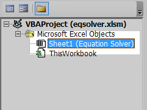
3. Select _Worksheet_ from the first combobox at the top of the editing window <br/> 
4. After selecting _Worksheet_ you can see that a function called Worksheet\_SelectionChange has been automatically created, like this: <br/> 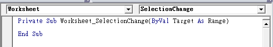
5. However, this is not the event handler function we want, so you have to select _Change_ in the second combobox at the top <br/> 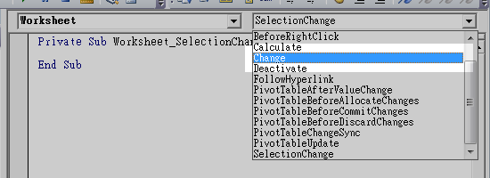
6. After that, you can see the following event handler functions in the VBA editor: <br/> 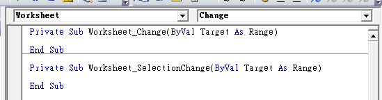 <br> The function Worksheet\_SelectionChange is for handling the event when the user selects different cells on the worksheet. It is not useful for the exercise so we can delete it.

After doing the above steps you now have the event handler shell for the _Change_ event in the VBA editor, like this:

```VBScript
Private Sub Worksheet_Change(ByVal Target As Range)

End Sub
```

This is the _Change_ event handler for the entire worksheet. At the moment, there is nothing inside the _Change_ event handler so nothing will be done when the event occurs. The Target argument is the cell that has been changed by the user \(can be any of the cells in the worksheet\). Therefore, if you want to focus on the content change of a particular cell you will need to check the Target argument. For example, you can check whether Target points to the same cell that you want to handle.

For this exercise, we are interested in the change of the coefficient cells only. Therefore, inside the Worksheet\_Change\(\) function, you need to check if Target is the same as your cells. Recall that your coefficient cells are named _CoefficientA_,_CoefficientB_ and<!-- markdown separator -->_CoefficientC_. To check whether Target is equivalent to these cells, you can use this VBA code:

```VBScript
If Target.Address = Range("CoefficientA").Address Or _
   Target.Address = Range("CoefficientB").Address Or _
   Target.Address = Range("CoefficientC").Address Then
    ...VBA code executed when one of the cells is changed...
End If
```

The underscore \(\_\) at the end of the lines breaks down a long line of code into multiple lines. In the above code, because the If statement is very long, we break the line of code down into three separate lines of code so that the code is easier to read.

In the condition of the If statement, the property Address is the text representation of the cell address, such as 'A1' for cell A1, 'D5' for cell D5, and so on. Therefore, by checking the textual address of Target \(the cell that has been changed\) and the coefficient cells, you can determine whether they refer to the same cell.

In the next part, we will add code inside the above If statement to start solving the equation, starting with the calculation of the discriminant.

### Calculating the Discriminant

Let's calculate the discriminant of the quadratic equation as the first step inside the If statement. Reminded that the equation of the discriminant looks like this:

&emsp; _D_ = _b_<sup>2</sup> - 4<!-- markdown separator -->_ac_

Looking at the above equation, you will need the coefficients in order to calculate the discriminant. You can use, for example, Range\("CoefficientA"\).Value to easily get back the coefficient value from the worksheet. Nevertheless, because you will use the coefficients multiple times in the code, it will be more efficient if you use some variables to store the values first.

For instance, we can make four variables to store the coefficients as well as the discriminant, like this:

```VBScript
Dim A As Double
Dim B As Double
Dim C As Double
Dim D As Double
```

If you like, you can make the variables in one go, like this:

```VBScript
Dim A As Double, B As Double, C As Double, D As Double
```

You can create as many variables as you like in one line if you separate them using commas.

After you have created the variables, you can use them to store the coefficients, read from the worksheet. You can do that using this code:

```VBScript
A = Range("CoefficientA").Value
B = Range("CoefficientB").Value
C = Range("CoefficientC").Value
```

As you can see, you can read things from the worksheet and then store them in your VBA code easily. Now, to finish this part, you need to write the code to calculate and put the value of the discriminant into the variable D. You will need to refer to the equation to do that.

### Solving for the Solutions

As we have discussed before, there are three different cases for the solutions of the quadratic equation depending on the value of the discriminant.

When you write the formula, you need to take care of the three cases in both of the two cells showing the solutions. If you look back to the formula you have written before, you are essentially handling the cases twice \(once in each of the cells\).

Fortunately, you don't need to do that in VBA. You can simply use one If...ElseIf...Else statement to handle the three different cases in VBA, like this:

```VBScript
If D > 0 Then
    ...VBA code to calculate two distinct solutions...
ElseIf D = 0 Then
    ...VBA code to calculate one solution...
Else
    ...VBA code to show "No Solution"...
End If
```

The above If statement handles the three cases separately. You just need to insert the code into the appropriate places to solve the quadratic equation. We will show you how to do that in the first case and you will have to work on the two remaining cases.

For the first case \(D \> 0\), there are two distinct solutions for the quadratic equation. You need to put the first solution in the cell named _Solution1_ and the second solution in the cell named _Solution2_. In order to change the content of a cell, we again make use of, for example, Range\("Solution1"\).Value to change the content of the cell _Solution1_.

Remember the equation to calculate the first solution is:

&emsp; _x_ = \(-_b_ + √<!-- markdown separator -->_D_\) / 2<!-- markdown separator -->_a_

Let's express the above equation using VBA code. To find the square root of a value, you can make use of the Math.Sqr function. Then, to put the first solution into the worksheet, you will use this line of code:

```VBScript
Range("Solution1").Value = (-B + Math.Sqr(D)) / (2 * A)
```

Similarly, the equation for the second solution looks like this:

&emsp; _x_ = \(-_b_ - √<!-- markdown separator -->_D_\) / 2<!-- markdown separator -->_a_

So to put the above value into the worksheet, you will use this line of code:

```VBScript
Range("Solution2").Value = (-B - Math.Sqr(D)) / (2 * A)
```

After you have finished the first case, it should be pretty straightforward to finish the remaining two cases in the If statement.

## Submission

You need to complete the worksheet in the given Excel starting file, [___eqsolver.xlsm___](template/eqsolver.xlsm). This starting file has already been given to you near the start of the page.

After you have finished your work, upload your file and then submit by clicking the "Submit Assignment", and then choosing your file to submit.

## submission

- file: [eqsolver.xlsm](submission/eqsolver.xlsm)
