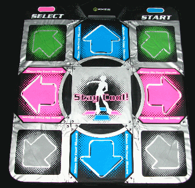
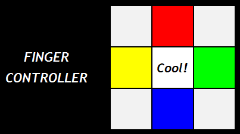
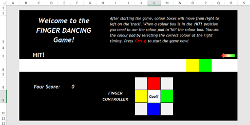
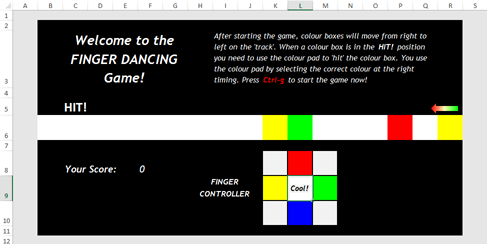
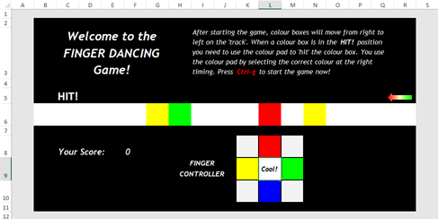
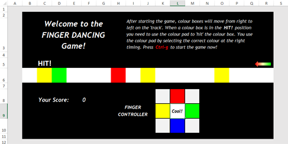
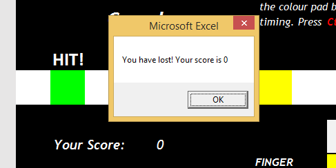
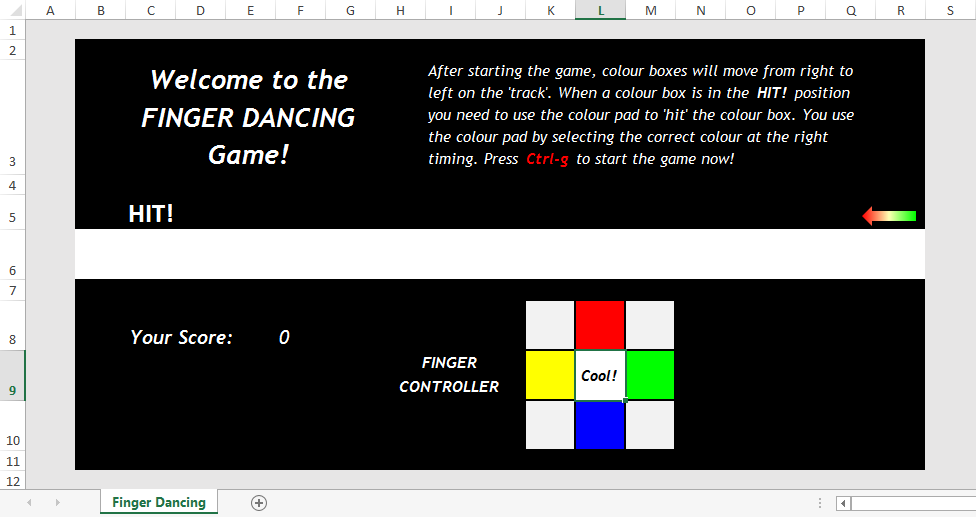
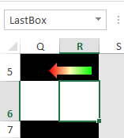
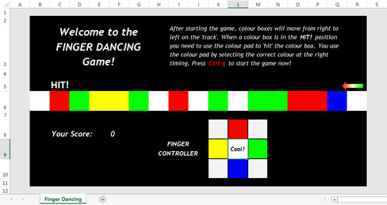

---
aliases:
  - HKUST COMP 1029V exercise for lesson 3
tags:
  - date/2024/01/16
  - language/in/English
---

# exercise for lesson 3

- HKUST COMP 1029V

---

- title: Exercise for Lesson 3
- due: 2024-01-16T23:59:59+08:00
- points: 100
- submitting: a file upload
- file types: xlsm
- available: until 2024-01-16T23:59:59+08:00

---

## __Finger Dancing Game__

## Introduction

In this exercise, you will build a 'finger dancing' game.

The game that you are going to build is based on the dancing games you can find in arcade game centres. In the ones in arcade game centres, you use your feet to perform dancing moves on a controller like this:



Certainly you don't use your feet to play with an Excel file. In this exercise you play the dancing game using the arrow keys to move around a controller in an Excel worksheet, which looks like this:



We call this game the finger dancing game because you essentially control the keys with your fingers \(unless you use your feet to do that!\).

The game works like this. After you start the game, some colour boxes move from right to left along a 'track' in the middle of the worksheet. You can see the colour boxes inside the 'track' in the example below.

<!-- markdownlint-disable-next-line MD036 -->
_At the start of the game_



<!-- markdownlint-disable-next-line MD036 -->
_A short moment later_



<!-- markdownlint-disable-next-line MD036 -->
_A short moment later_



<!-- markdownlint-disable-next-line MD036 -->
_A short moment later_



Once a colour box moves in the __HIT!__ position you need to select the corresponding colour cell in the finger controller, either by using the arrow keys or by clicking your mouse on that colour cell. If you have done that successfully, the box will be destroyed and the score of the game will be added by one. If you mistime when you try to 'hit' the colour box or you let a colour box pass through the __HIT!__ position, the game will be over, like this:



Here is a video showing the game:

[dancing\_game\_demo.mp4](attachments/dancing_game_demo.mp4.webm) <br/>


In the exercise, the 'interface' of the game, i.e. the worksheet, is given to you. You need to complete the game using VBA code.

Here are the tasks you need to complete in this exercise:

1. Understanding the Game Loop
2. Making a New Colour at the End of the Track
3. Moving the Colour Boxes
4. Completing the Game Logic

## Overview

You can download the starting Excel file here: [___dancing\_game.xlsm___](template/dancing_game.xlsm)

After opening the file in Excel, you will see the worksheet _Finger Dancing_.



As you can see most of the game interface has been given to you. If you press _Ctrl-g_, the VBA macro __StartGame\(\)__ will be run. What you will see is that the score of the game will keep on increasing. Certainly we don't want the game to simply keep on increasing the score without any reason so you need to adjust the code inside the macro to finish the game.

## Task 1. Understanding the Game Loop

Let's first understand the game loop. We call it the game loop because the game runs inside a VBA __While__ loop. As we have mentioned before, you can press _Ctrl-g_ to run the macro __StartGame\(\)__. The game loop is located inside this macro.

At this moment, if you run the macro, you will see the score keeps on increasing. This is because we have the following code inside the macro:

```VBScript
Do
    ' Select the middle of the colour pad
    Range("ColourPad").Select

    ' *** This line of code is not needed for the game ***
    Range("Score").Value = Range("Score").Value + 1

    ' Wait for half a second using a loop
    Dim LastTime As Single
    LastTime = Timer
    Do While Timer < LastTime + 0.5
        ' A DoEvents is used so that the Excel program won't crash
        DoEvents
    Loop
Loop While Range("HIT").Interior.ColorIndex = ActiveCell.Interior.ColorIndex
```

The __Do__...__Loop While__ is the loop of the game. This loop runs while the colour of the box under __HIT!__, i.e. __Range\("HIT"\)__, and the colour of the currently selected cell, i.e. __ActiveCell__, are the same. We check the colour of the cells using the __Interior.ColorIndex__ property. Since in the given worksheet the colour of these two cells is both white, if you do not move the currently selected cell, this while loop will run forever. It is an infinite loop! Usually, when you have an infinite loop in any program, the program will stall and you cannot do anything with it.

Fortunately, we insert a little trick inside the loop using this code:

```VBScript
' Wait for half a second using a loop
Dim LastTime As Single
LastTime = Timer
Do While Timer < LastTime + 0.5
    ' A DoEvents is used so that the Excel program won't crash
    DoEvents
Loop
```

The above little loop is used to spend exactly half a second inside the game loop. We won't explain the details of this little loop as it is not in the scope of this exercise. What is important to know is that the command __DoEvents__ tells VBA that we want Excel to still be able to work as normal, even though we are running inside a kind of an infinite loop.

Apart from the above block of code, there are two other lines of code inside the game loop. This line of code:

```VBScript
' Select the middle of the colour pad
Range("ColourPad").Select
```

select the cell _ColourPad_ as the current cell. If you look at the worksheet, the cell _ColourPad_ is the middle box of the finger controller. Because of this line of code, the currently selected cell will always move back to the middle of the controller while the game is running.

Another line of code:

```VBScript
' *** This line of code is not needed for the game ***
Range("Score").Value = Range("Score").Value + 1
```

simply increases the score of the game by one. That is why when you run the game, you see the score keeps on increasing.

In summary, the game loop is a loop which keeps on running until the colour of the __HIT!__ cell and the currently selected cell are different. Inside the loop, the currently selected cell is moved back to the middle of the controller, the score is increased by one and the loop spends half a second without doing anything. Therefore, if you run the game loop now, what you will see is the score increased every half a second. If you want to stop that, you can do so by moving your currently selected cell to any cell which is not white \(different colour to the __HIT!__ cell so that the game loop will stop\).

However, the game that you are going to make does not really add the score for no reason so you can delete this code:

```VBScript
' *** This line of code is not needed for the game ***
Range("Score").Value = Range("Score").Value + 1
```

and then move on to the next part of the exercise.

## Task 2. Making a New Colour at the End of the Track

In the game, it is much more useful to make a new colour box in the track than increasing the score. After you have deleted the line of code which increases the score inside the game loop, you can add a line of code to make a new colour box in the track.

To do that, you need to know which cell is at the end of the track. You can see from the worksheet that cell is cell R6 or the cell named _LastBox_, as shown below.



In this part of the exercise, we will use the cell name in the code. However, you can also do that using the cell address R6.

You don't actually put a box on that cell. What you will do is to simply change the colour of the cell. You can use the __Interior.ColorIndex__ property, which you have seen before, to change the colour of the cell. This property uses numbers to represent different colours. In this exercise, we only need to use a few colours: white, red, green, blue and yellow. They are the colours shown in the finger controller. The numbers representing these colours are 2 \(white\), 3 \(red\), 4 \(green\), 5 \(blue\) and 6 \(yellow\) respectively.

Therefore, if you insert this line of code inside the game loop:

```VBScript
Range("LastBox").Interior.ColorIndex = 3
```

what you will see is the cell at the end of the track will become red after you start the game by pressing _Ctrl-g_. Notice that the red box will not move to the left because you will need to add the code for that later.

### Making Random Colour Boxes

Just adding a red box at the end of the track seems a little bit boring. We will make it more colourful by putting different colours of boxes in the cell.

We have already provided a function to do that. The function is called __GenerateColor\(\)__. To use the function, you can change the previous line of code into this:

```VBscript
Range("LastBox").Interior.ColorIndex = GenerateColor
```

The above line of code changes the colour of the cell into the colour returned by the function. Once you have done this, you should see that the cell at the end of the track will change back to white! This is because, at the moment, the function __GenerateColor\(\)__ always returns 2, i.e. white. You need to change the code so that the function will return a random colour, i.e. one of white, red, green, blue and yellow.

It is not difficult to do that. You can make use of random numbers. To generate random numbers in VBA you use the __Rnd\(\)__ function. The function gives you a random number between 0 and 1 but excluding 1. Since the colour boxes have numbers between 2 and 6. You can easily make a random number within that range using this code:

```VBScript
GenerateColor = Int(Rnd() * 5) + 2
```

Let's see what the above line of code is doing. Since __Rnd\(\)__ gives you a number in \[0, 1\), if you multiply it with 5, you will get \[0, 5\). Changing the number into an integer \(using __Int\(\)__\) will give you an integer in \[0, 4\]. Finally, after adding 2 to the number, the random number will become a number in \[2, 6\], which is what we want here.

If you start the macro a few times, you may find that the code always gives you the same sequence of colour boxes. This is because __Rnd\(\)__ is not truly random the first time you run the function. To get a truly random sequence before you run __Rnd\(\)__ you should use the __Randomize\(\)__ function before the above line of code.

After doing the above, you have achieved putting some random colour boxes on the track. The last thing we have to do in this part is to make white the more dominant colour than the other four colours. Let's look at the following picture:



This will be what you see if you can move the colour boxes from right to left, which you will do in the next task. The problem we have in the above picture is that the game is too difficult! There are simply too many 'colour' \(red, green, blue and yellow\) boxes on the track.

You can make the game easier by making __GenerateColor\(\)__ to give you white more than the other colours. For example, you can make the function to generate white half of the time and share the other half with the remaining four colours. You will have to figure out how to do this when you are working on the next part. The __Rnd\(\)__ function is again very helpful in this situation.

## Task 3. Moving the Colour Boxes

In the previous task, different colour boxes are put at the end of the track. To make the game working you need to start moving them from right to left along the track.

You can see that the track spans the cells B6:R6. Moving the cells from right to left on the track means we are moving the colours of the cells from one cell to another. For example, moving the colour box from cell R6 to cell Q6 means that we change the colour of cell Q6 to the colour of cell R6, which can be done using this code:

```VBScript
Range("Q6").Interior.ColorIndex = Range("R6").Interior.ColorIndex
```

However, you need to change the colour of every cells on the track. It would be nice to do that using a for loop since we have so many cells.

To do this, we have already given you a subroutine called __MoveColor\(\)__ shown below. You will write your code to move the colour boxes in this subroutine and then use the subroutine in the game loop later.

```VBScript
Sub MoveColor()

    ' Task 3: Move the colour boxes here

End Sub
```

In the above line of code, when you refer to a cell, you use __Range\(\)__ by giving it a cell address such as Q6. A cell address is a piece of text and is difficult to use in a for loop when you want to move from cell to cell. Because of this, whenever we use a for loop which involves moving between different cells, we will choose to use __Cells\(\)__ to refer to the cells inside the loop.

In our case, the track is from cell B6 to cell R6. You can start to move the colour from cell B6, then cell C6 up until cell Q6 \(you don't need to do anything with R6 because you have put a colour box in R6 in the previous part of the exercise\). The for loop to move the colour boxes is then:

```VBScript
For Column = 2 to 17
    ...Move colour from Cells(6, Column + 1) to Cells(6, Column)...
Next Column
```

After you finish the subroutine __MoveColor\(\)__, you can then use the subroutine in the game loop in an appropriate location.

## Task 4. Completing the Game Logic

After finishing the previous tasks what you have now is a game which moves some random colour boxes from right to left. The boxes will stop moving when one of the colour boxes reach the __HIT!__ position. The colour boxes stop moving because the game loop stops when the colour of the cell under __HIT!__ is different from the colour of the currently selected cell, i.e. the middle of the controller.

### Player Hitting the Correct Colour Box

To play the game, the player has to move the selected cell to the correct colour under the __HIT!__ position. If he/she has done that, the colour box will be destroyed and the score will be increased by one. You need to add this logic into the code.

We have already indicated the place where you need to add the code in the given file. You should insert the code right above this line of code:

```VBScript
Range("ColourPad").Select
```

The logic is very simple: if the colour of the __HIT!__ cell and the colour of the current selected cell is the same, the player has successfully hit the colour box and the game should destroy the box and add the score by one. This can be done by the following If statement:

```VBScript
If Range("HIT").Interior.ColorIndex = ActiveCell.Interior.ColorIndex And _
   Range("HIT").Interior.ColorIndex <> 2 Then
    ...Destroy the colour box and add the score by one...
End If
```

The first condition in the above If statement is saying that the colour of the __HIT!__ cell, which has been named _HIT_, and the colour of the currently selected cell are the same. The second condition is saying that the __HIT!__ cell is not white because the player does not need to hit the cell if it is white.

Using the above If statement you can now destroy the cell, i.e. changing the colour of the cell to white, and then add the score by one.

If you have successfully finished the above code and you hit the colour boxes at the right timing, you will find that the rest of the colour boxes will continue to move even if one of them reaches the __HIT!__ position. This is because once they reach that position the code removes the colour box from the cell and therefore the game loop will not stop working.

### Showing the Game is Over

The game will destroy the colour box if the player moves the currently selected cell to the correct colour. What if the player does not do that at the right timing? If the player fails to destroy the box, the game loop will stop because the colour of the __HIT!__ cell and the colour of the currently selected cell are different. Therefore, the game is over once the game loop stops.

You need to tell the player that the game is over using a message box, for example:

```VBScript
MsgBox "Uh oh! The game is over!"
```

## Submission

You need to complete the dancing game in the given Excel file, [___dancing\_game.xlsm___](template/dancing_game.xlsm). This file has been given to you near the start of this page.

After you have finished your work, upload your file and then submit by clicking the "Submit Assignment", and then choosing your file to submit.

## submission

- file: [dancing_game.xlsm](submission/dancing_game.xlsm)
