---
aliases:
  - HKUST COMP 1029V exercise for lesson 4
tags:
  - date/2024/01/22
  - language/in/English
---

# exercise for lesson 4

- HKUST COMP 1029V

<!-- list separator -->

- due: 2024-01-22T23:59:59+08:00
- points: 100
- submitting: a file upload
- file types: xlsm
- available: until 2024-01-22T23:59:59+08:00

## __Number Guessing Game__

## Introduction

In this exercise, you will build a number guessing game using Form buttons \(i.e. button Form controls\) and Excel shapes in a worksheet.

The game itself is a very simple game. At the start of the game, the computer thinks of a secret number between 1 and 100. The player then has to guess the number correctly using as few guesses as possible.

An example finished game looks like this:

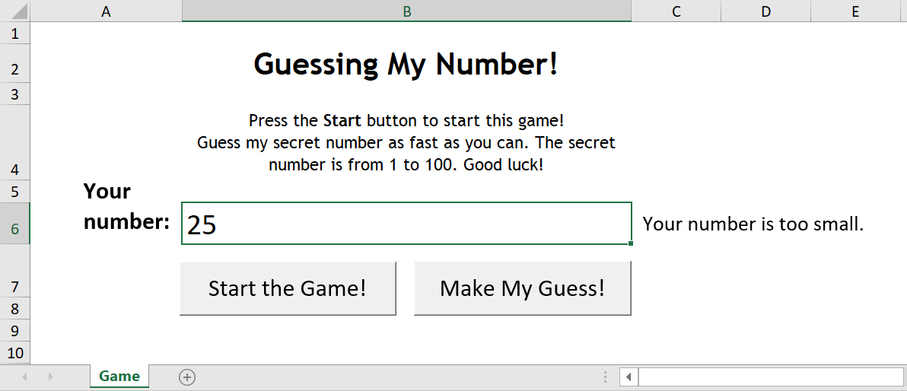

To start the game, the player has to press the 'Start the Game!' button. Once the game has been started, the player can guess the secret number by entering his/her guess in the text box and then press the 'Make My Guess!' button. Everytime the player makes a guess, the computer will give the player some hints. The computer makes suggestion such as "Your number is too small." or "Your number is too big."

Here are two example displays when the secret number is 78.

_When the guess is smaller than the secret number 78..._ <br/> 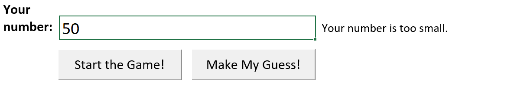

_When the guess is bigger than the secret number 78..._ <br/> 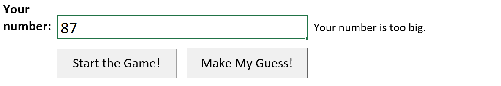

In addition to the hints, the game has to make sure that the number entered by the player is a valid number. If the number is not valid, the game will display a message like these:

_When the guess is not even a valid number..._ <br/> 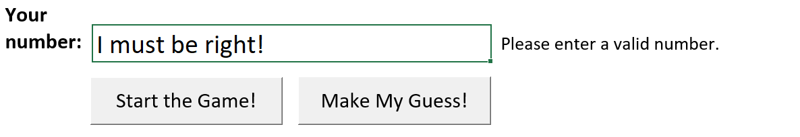

_When the guess is not within the range of 1 and 100..._ <br/> 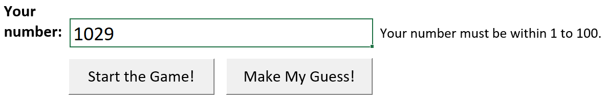

For this exercise, we can assume that the player will only enter an integer whenever he/she enters a number.

If the player guesses the secret number correctly, the game will be over: The game tells the player that he/she has successfully finished by displaying a message like this:

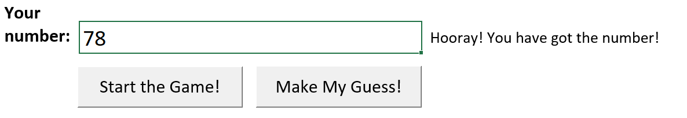

To understand how the game works, you can watch the following example video showing a player playing the game:

[number\_guessing\_game\_demo.mp4](attachments/number_guessing_game_demo.mp4.webm) <br/>


In this exercise, you will practice how to create GUI components in Excel, in particular Form buttons. You need to write some associated VBA code but the code is relatively easy. To complete the exercise, you have to work on the following tasks:

1. Creating the Interface of the Game
2. Starting the Game
3. Checking the Player's Guess

## Overview

You can download the starting Excel file here: ___[number\_guessing\_game.xlsm](template/number_guessing_game.xlsm)___

There is only one worksheet in the file, which looks like this:

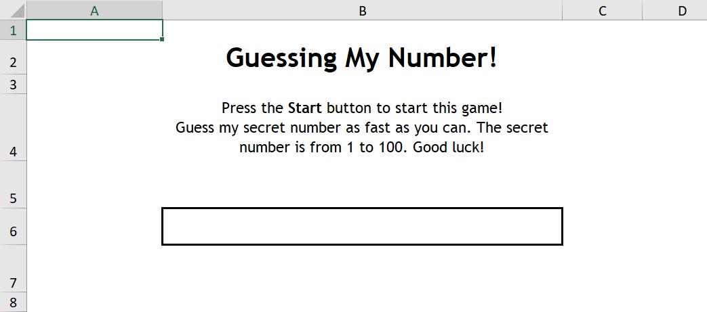

As you can see, all components of the game such as buttons and text displays \(on the left and right of the 'box'\) are not currently given in the worksheet. You need to build the game from scratch by adding these components and writing the associated VBA code.

You will first create the relevant components in the game. In this exercise, we will use Form buttons and Excel shapes as the GUI components in the game. After you have added the components, you will then write the code for the 'Start the Game!' button. At the start of the game, the computer will think of a secret number so that the player can guess what that number is. The final task you need to do is to allow the player to guess the number using a simple cell as input. You will give information about the player's guess via an Excel text shape.

## Task 1. Creating the Interface of the Game

Let's look at the example game interface again:


In this task, you need to create all components that you see from the above display. It includes:

- The 'Start the Game!' Button
- The 'Your number:' Text Shape \(on the left of the text box\)
- The Information Text Shape \(on the right of the text box\)
- The 'Make My Guess!' Button

The buttons are created using Form buttons and the text display using Excel shapes. The steps required to create each of these components are very similar. Once you have created one of them, it will be very easy for you to create the others. However, you need to make sure that you use the correct names for some of these components. It is because you will refer to them using their names when you write the VBA code later in the exercise.

### The Number Input Cell

The only given component in the game is the number input box. Although we said it is a box, it is simply an ordinary cell. The cell is named 'Number', as you can see from the top-left hand corner of the worksheet.

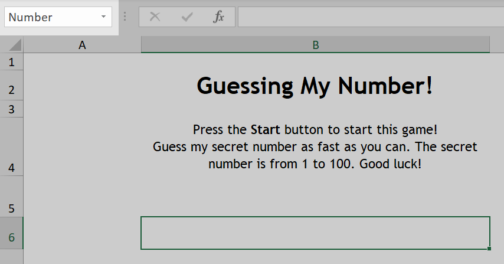

That means you can refer to the content of this cell by __Range\("Number"\).Value__.

### Adding the 'Start the Game!' Button

You need to make a Form button for the 'Start the Game!' button somewhere below the number input cell. You can do that by following these steps:

1. Select the _Developer_ ribbon, click on the _Insert_ button in the _Controls_ area <br/> 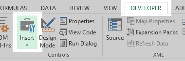
2. Click on the button control icon  in the _Form Controls_ area <br/> 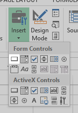
3. Drag and create a button control in the worksheet
4. Create and Use a new macro called _StartGame_ <br/> 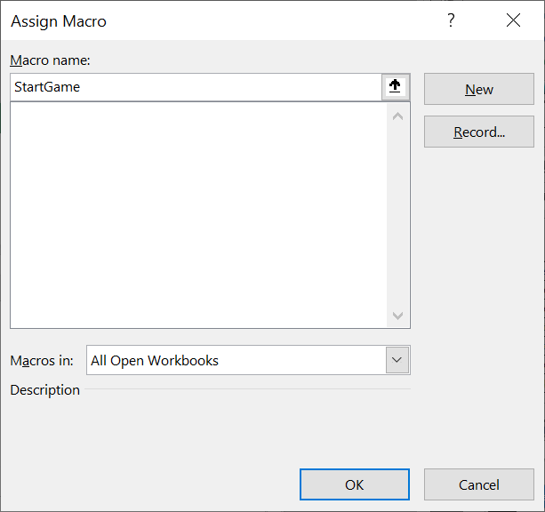

Once you have a new button on the worksheet, you need to change the text of the button to some appropriate text and use an appropriate font by right-clicking on the text and selecting _Format Control_ so that it looks like this:

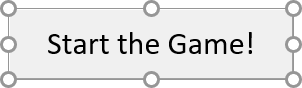

### Adding the 'Your number:' Text Shape

You may think that we will use a Form label to create the text display. However, a Form label is too inflexible as you cannot change its font format. Therefore, in this exercise, we will use an Excel text shape to create the text display instead.

The first text display on the left of the number input cell, 'Your number:', is for decoration purpose only. You can add the text following these steps:

1. Insert an Excel text shape from the _Insert_ tab <br/> 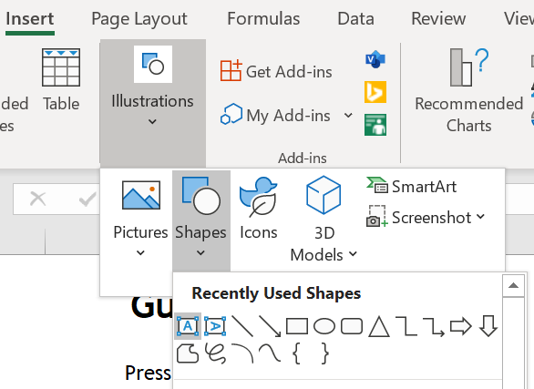
2. Click on the worksheet to create the text shape

You can change the text content of the shape to anything appropriate, like 'Your number:'. You will then have a text display on the left hand side of the number input cell which looks like this:

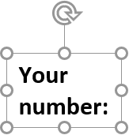

For this text shape, you do not need to change its _Name_ because you will not use the text shape in the code.

### Adding the Information Text Shape

Similar to the text display that you have created above, you will create another one for the 'information' of the player's guess. This text display will be put on the right hand side of the number input cell. After you have created the Excel text shape, you __must__ change the _Name_ of the shape to _Hint_ so that you can change the content of the shape later in the VBA code, i.e.:

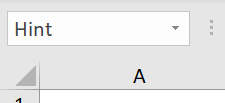

If you like, you can put in some random text in the text shape so that you know how it looks like for now, such as the one shown below:

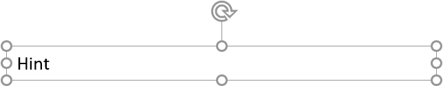

However, the content of the text display will be removed later using VBA code, when the Excel file is opened.

### Adding the 'Make My Guess!' Button

Finally, you need to make another button which the player can use to confirm his/her guess. Similar to the 'Start the Game!' button, you create a Form button in the worksheet. You can change the caption to something appropriate so that you will have a button, for example, like this:

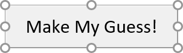

For this button, you can create a new macro called _MakeMyGuess_, like the one shown below:

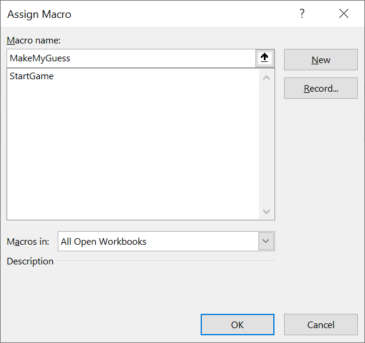

### Setting Up the Components When the Excel File is Opened

At this stage, you should have created the entire interface of the game using the Form buttons and text shapes. You will now write some VBA code to correctly clear the game display before the player starts to play the game.

To do that, you can use the workbook open event, like this:

1. Open the VBA editor
2. On the left hand side of the editor, double-click on _ThisWorkbook_ of the Excel file <br/> 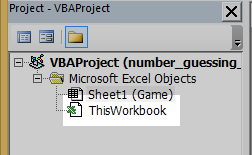
3. Select _Workbook_ in the combo box on the left hand side at the top of the code area <br/> 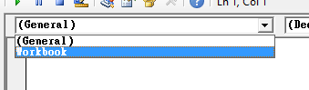
4. The __Workbook\_Open\(\)__ subroutine is automatically generated and you can add code to it <br/> 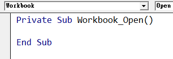

You will clear the game display in the workbook open event.

First, you need to clear the text inside the number input cell at the start. You can do that by clearing the _Value_ property of the cell, like this:

```VBScript
Worksheets("Game").Range("Number").Value = ""
```

Then, you need to clear the information display so that the game can put some useful information there later.

This is a little tricky as the text display is an Excel text shape. To change the text content of an Excel text shape , you need to change the _TextFrame_ of the shape, like this:

```VBScript
Worksheets("Game").Shapes("Hint").TextFrame.Characters.Text = ...new content...
```

The above line of code is very long but it is only a simple property of the Excel shape for changing its text content.

Similar to what you have done for the number input cell, you can put an empty string into the text display using the long line of code shown above.

Finally, you can make sure that the number input cell is selected by writing the appropriate code to do that, i.e. using the _.Select_ method of the number input cell.

If you have successfully written the above code, whenever you open the Excel file, the game interface will look like this:

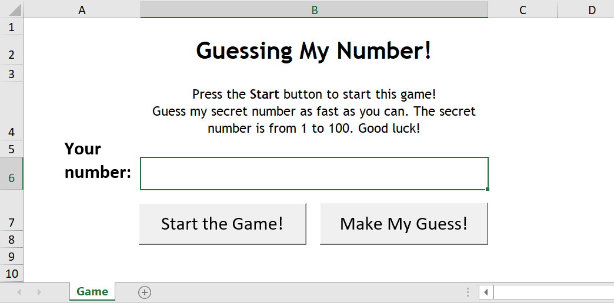

The player can then click on the 'Start the Game!' button to start playing the game.

## Task 2. Starting the Game

Certainly, at this moment, even if the player clicks on the 'Start the Game!' button, the player will not see anything change. That is because you haven't added the code to do that.

The game will run the code to start the game when the player clicks on the 'Start the Game!' button. That means you need to add the code in the _StartGame_ macro that you have created before.

Inside the macro, you need to do two things. First, you need to help the computer to think of a secret number. Then you need to set up the controls so that the player can play the game.

### Making a Secret Number

At the start of the game, the computer needs to think of a secret number. This number will be between 1 and 100 inclusive. You can generate such a number using VBA code easily, using __Randomize\(\)__ and __Rnd\(\)__ that you have used in the previous exercise. You just need to make sure that you have the correct range of random numbers, when you made a random number between 2 and 6 in the previous exercise.

There is a problem though: where should you store the secret number for the game? You can surely store the number in a variable. However, the variable should be a _global variable_ that is not within any function or subroutine. This variable will be refered to by other functions or subroutines later. Therefore, you cannot put the random number in a _local variable_, i.e. a variable created inside the macro.

You can create a global variable by putting the following line __at the very top of the code area, outside of any macro__:

```VBScript
Dim SecretNumber As Integer
```

Let's emphasize again that the above line of code has to be put at the top of the code area, instead of inside any function or subroutine. The variable that the above line of code creates is called __SecretNumber__. You will use this variable to store the random number and you will use this variable throughout the rest of the game.

### Setting Up the Game

Remember that you have cleared the game display in the workbook open events in the first task. Once the player starts the game you will need to do this again because the player may have already played the game once. Here are the things that you need to do:

- Clear the content of the text box
- Clear the content of the information display or put some simple instructions inside

Having finished the workbook event, you should be able to write appropriate code to do the above. Once you have done that, the game interface should look like this after the game has been started:

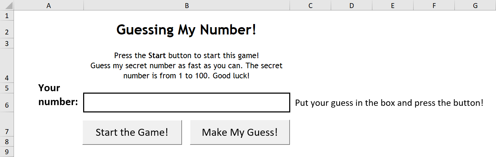

Basically, the player can start to make his/her guesses using the number input cell and the 'Make My Guess!' button.

## Task 3. Checking the Player's Guess

The final task of this exercise is to check the player's guess. The player makes his/her guess by entering the number in the number input cell and then clicking on the 'Make My Guess!' button. Therefore, the VBA code that you will use to check the guess should go inside the _MakeMyGuess_ macro of the 'Make My Guess!' button.

Inside the macro, you need to check the following situations based on the player's input:

1. If the guess is __not__ a valid number
2. If the guess is __not__ inside the range of 1 and 100
3. If the guess is smaller than SecretNumber
4. If the guess is bigger than SecretNumber
5. Otherwise, the guess must be SecretNumber

As you can see, the above situations can be represented in a very big __If...ElseIf...Else__ statement, i.e.

```VBScript
If ...the guess is not a valid number... Then
    Hint = ...some message...
ElseIf ...the guess is not within 1 to 100... Then
    Hint = ...some message...
ElseIf ...the guess is smaller than the secret number... Then
    Hint = ...some message...
ElseIf ...the guess is bigger than the secret number... Then
    Hint = ...some message...
Else ' By now, the guess must be the secret number
    Hint = ...some message...
End If

...Put the Hint into the information display...
```

It is important that you check whether the input is a valid number first. Otherwise, you will get an error if you compare some random text against the secret number.

It is not difficult to finish the above __If__ statement. You just need to filling in appropriate code in appropriate places.

The number entered by the player is inside the number input cell. You can get that value in VBA using __Range\("Number"\).Value__. For the first condition in the __If__ statement, you can consider using the __IsNumeric\(\)__ function to check whether a piece of text, i.e. __Range\("Number"\).Value__, is a number or not. For example, __IsNumeric\("10"\)__ returns __True__ whereas __IsNumeric\("Hello"\)__ returns __False__. The rest of the conditions should be simple numerical comparisons.

When the player correctly guesses the secret number, the game is over. You need to tell the player that he/she has finished the game using the information text display so that the player can start the game again.

You don't need to clear the content of the number input cell or the information text display because the player still needs to know that he/she has finished the game by reading the information content.

## Submission

You need to complete the number guessing game in the given Excel file, ___[number\_guessing\_game.xlsm](template/number_guessing_game.xlsm)___. This file has been given to you near the start of this page.

After you have finished your work, upload your file and then submit by clicking the "Submit Assignment", and then choosing your file to submit.

## submission

- file: [number_guessing_game.xlsm](submission/number_guessing_game.xlsm)
