---
aliases:
  - HKUST COMP 1029V exercise for lesson 5
tags:
  - date/2024/01/28
  - language/in/English
---

# exercise for lesson 5

- HKUST COMP 1029V

---

- title: Exercise for Lesson 5
- due: 2024-01-28T23:59:59+08:00
- points: 100
- submitting: a file upload
- file types: xlsm
- available: until 2024-01-28T23:59:59+08:00

---

## __Excel Calculator__

## Introduction

In this exercise, you will build an Excel calculator inside a worksheet. The calculator is a very simple one so it has a simple layout which looks like this:

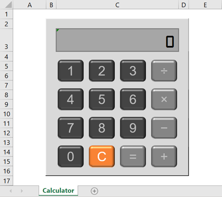

The calculator consists of a cell C3, which is the display of the calculator, and some Excel shapes, which act as the calculator buttons. You can use the calculator just like any simple calculator. For example, you can calculate 1 + 2 by clicking on '1', '+', '2' and finally '=' to get the result. Here are the example displays of the calculator:

_The calculator at the start..._ <br/> 

_After clicking on '1'..._ <br/> 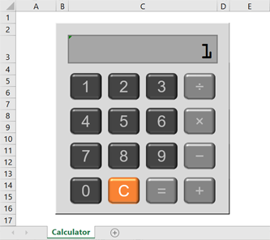

_After clicking on '+' \(the display does not change\)..._ <br/> 

_After clicking on '2'..._ <br/> 

_Finally, clicking on '='..._ <br/> 

The 'C' button clears the screen as well as the memory of the calculator. So after clicking on the 'C' button, you will be back to the starting display of the calculator.

Here is an example video showing how to use the calculator:

[excel\_calculator\_demo.mp4](attachments/excel_calculator_demo.mp4.webm) <br/>


You will be given a starting file containing the calculator. The interface of the calculator has been completed already. However, the code of the calculator is only partially finished so that it does not really work as a calculator at all. You will have to extend the code by exploring how to use the internal memory \(a VBA array\) of the calculator and then use recursion to find the answer of the calculation.

To finish this exercise you have to finish the following tasks:

1. Understanding the Given Calculator
2. Extending the Calculator to Work with Multiple-Digit Numbers
3. Increasing the Size of the Calculator Memory
4. Calculating the Result Using Recursion

## Overview

You can download the starting Excel file here: ___[excel\_calculator.xlsm](template/excel_calculator.xlsm)___

The file contains one worksheet which is called _Calculator_. It looks like this:

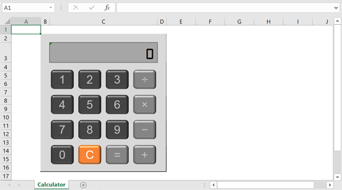

The interface of the Excel calculator has been given in this file. You can click on the buttons to play around with the calculator. However, what you can do right now with the given calculator is to enter single digit numbers into the calculator only. You cannot enter any number bigger than 9 because the new number will simply overwrite the current one on the display. If you click on the 'C' button or the '=' button, both of them will clear the display back to '0'.

You need to be careful when you use the operators in the calculator \(even though you cannot see anything changed on the display\). If you click on a number, an operator, a number and then another operator, VBA will give you a 'Subscript out of range' error like this:

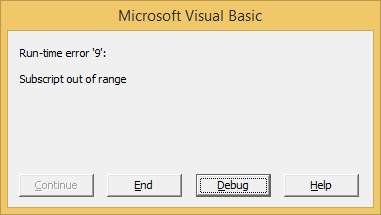

As you can see, the given calculator is not exactly working very well. You will need to finish the code so that it works like what we described at the start of the exercise.

## Task 1. Understanding the Given Calculator

The first task of the exercise is to understand the given Excel file before you add any code to it.

### The Calculator Interface

The calculator in the worksheet consists of a display, which is an ordinary cell, and twelve Excel shapes. The twelve Excel shapes correspond to the ten digits \(from 0 to 9\), the four operators \(addition, subtraction, multiplication and division\), the equal sign and the clear command.

The display of the calculator is a simple cell, cell C3. It shows any number that the user has entered into the calculator. However, it does not show the operators currently being applied, just like a typical calculator that you have used before.

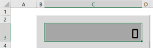

The digit buttons are used for entering numbers in the calculator. At the moment, you can only enter single-digit numbers in the calculator. Later, you will extend it so that it works with multiple-digit numbers. The buttons are named _Digit0_, _Digit1_, _Digit2_, ... and up to _Digit9_.

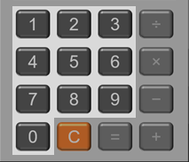

The four operator buttons are used for applying the corresponding operations on the current number. However, note that this calculator can only work with __integers__. That means numbers will be rounded to the nearest integers when performing a division. On the other hand, if you use the calculator to divide any number by zero, the program will crash. We will ignore this problem in this exercise and assume that you will not divide a number with 0.

The names of the operator buttons are _Add_, _Subtract_, _Multiply_ and _Divide_.

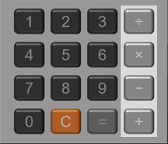

The equal button is used to find the result of the expression entered into the calculator so far. For example, if you have clicked on '1', '+' and '2', clicking on the equal sign button should give you a result of 3 on the display of the calculator.

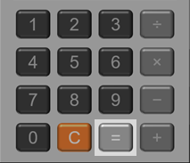

The clear button is used to clear the display as well as the memory of the calculator. Once the button is clicked, the display will be reset to a '0'. The name of this button is _Clear_.

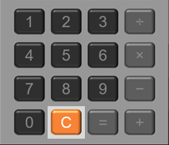

### VBA Code Currently Given in the File

Some VBA code has already been given in the worksheet. It is important that you spend some time to understand what the code is doing, before you add your own code later in the exercise.

___The Memory Array___

All the given VBA code is in _Module1_. You can see the code by opening the VBA editor and double-clicking on _Module1_. At the top of the code area, you can see these two lines of code:

```VBScript
Dim Memory(1 To 3) As String
Dim CurrentPos As Integer
```

The above code creates two variables. The first variable Memory is a VBA array with a size of three. We can visualize the array like this:

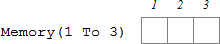

This array is the internal memory of the calculator. Any numbers or operators that the user enters will be stored in this array. The array stores the numbers and operators as strings and therefore you may need to apply proper conversion when you perform numerical calculation later.

The second variable CurrentPos points to a particular location in the memory array. If CurrentPos is 1, that means the currently active slot in the array is the first slot. If CurrentPos is 2, that means the currently active slot is the second slot. Since the memory array is filled from the very first position, CurrentPos also tells you how many slots of the array have been used so far.

At the start of using the calculator, the memory array has a '0' in the first slot, i.e. Memory\(1\) = "0", and CurrentPos is initialized to 1, which can be visualized like this:

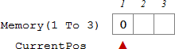

### The Handling of the Excel Shapes

Excel shapes can be associated with macros and act like buttons, very similar to what you do with Form buttons. Certainly, Excel shapes can be made to look more pretty than Form buttons.

You can find the macros of all Excel shapes inside the code area. All macros are running a very similar line of code. For example, here is what you see if you look at the macro of the digit one button:

```VBScript
Private Sub Digit1_Click()
    HandleUserInput "1"
End Sub
```

All of them run the same function called HandleUserInput but with different values of the parameter. The values that they use are simple representations of what the buttons stand for. For example, the digit one sends a parameter of "1" to the function, the digit two sends a "2" to the function and so on. The clear button sends a "Clear" to the function.

The code has been structured like this because you can then use the function HandleUserInput as a central place to handle every operation of the calculator. In the next two tasks of this exercise, you will mostly work on and extend the code inside this function.

## Task 2. Extending the Calculator to Work with Multiple-Digit Numbers

At the moment, the calculator allows the user to enter single-digit numbers only. Any number that the user clicks on will replace the current number shown on the display. You can only see the number 0 to 9 on the display but you will never see, say, '124' on the display.

If you look at HandleUserInput you can find that the function has a very big If statement, like this:

```VBScript
If InputButton = "1" Or _
   InputButton = "2" Or _
   InputButton = "3" Or _
   InputButton = "4" Or _
   InputButton = "5" Or _
   InputButton = "6" Or _
   InputButton = "7" Or _
   InputButton = "8" Or _
   InputButton = "9" Or _
   InputButton = "0" Then
    ...process the digit buttons...
ElseIf InputButton = "+" Or _
       InputButton = "-" Or _
       InputButton = "x" Or _
       InputButton = "/" Then
    ...process the operator buttons...
ElseIf InputButton = "=" Then
    ...find out the result of the calculation inside the memory...
ElseIf InputButton = "Clear" Then
    ...clear the display and memory...
End If
```

This If statement is used to process the different buttons clicked on by the user. It does different things depending on the value of the InputButton parameter when HandleUserInput\(\) is called. In this task, you will extend the code so that the user can input multiple-digit numbers when he/she clicks on the digit buttons successively.

### Adding a Digit to the End of Current Number

Since we are talking about the digit buttons in this task, you will focus on the part of code inside the first condition of the big If statement, where the code processes the digit buttons. The given code inside the If statement is shown below:

```VBScript
If Memory(CurrentPos) = "+" Or _
   Memory(CurrentPos) = "-" Or _
   Memory(CurrentPos) = "x" Or _
   Memory(CurrentPos) = "/" Then
    CurrentPos = CurrentPos + 1
    Memory(CurrentPos) = InputButton
    Display = Memory(CurrentPos)
Else
    Memory(CurrentPos) = InputButton
    Display = Memory(CurrentPos)
End If
```

When the user clicks on the digit buttons, the current memory slot may have a number or an operator. The above code is used to handle either of these cases.

___Case 1. When the current memory slot contains an operator...___

If the current memory slot is an operator, the code will add a new number to the next slot in the memory array. Here is an example:

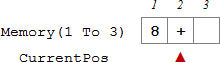

The current slot of the array contains an operator "+". If the user clicks on the digit '2', the code will add the digit to the next slot of the memory array, like this:

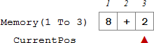

You can see that CurrentPos has been increased by one because a new slot has been used in the array.

___Case 2. When the current memory slot contains a number...___

If the current memory is not an operator, i.e. a number, the above code will __replace__ the current number with the digit clicked on by the user. Here is an example:


The current slot of the array contains the number "8". If the user then clicks on the digit '2', the code will replace the content of the array and put a "2" in the current slot, like this:


In the above example, CurrentPos does not change but the content of the slot has been changed to "2".

In the second case, you can see that the calculator always replaces the current number if the user clicks on a digit button. This is not what a typical calculator works, where any new digit that the user clicks on should be __added at the end of__ the current number. The user should see '82' instead of '2' on the calculator display, i.e. the memory array should look like this:

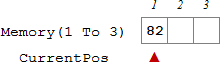

In the array shown above, the new digit '2' has been added at the end of the previous number, which is '8'.

This is the line of code which replaces the number in the current memory location:

```VBScript
Memory(CurrentPos) = InputButton
```

You need to change this line of code so that the newly clicked digit will be added to the end of the current number. After finishing this, you should be able to see '82' if you click on '8' and then '2' consecutively, like this:

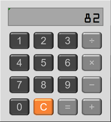

### Restricting the Length of a Number

After finishing the above part, you can now enter a number with many digits. However, if the number is too long, the VBA code may not be able to handle that. Therefore, you need to add a restriction on the number of digits you can add for a number.

In this exercise, let us restrict the length of any number to be smaller than or equal to 8. To do that, you need to modify the code you have done in previous part to include something like this:

```VBScript
If Len(...current number...) = 8 Then
    Beep ' Notify the user that the maximum length has been reached
Else
    ...add the newly clicked digit to the current number...
End If
```

For example, you should not be able to add any more digit to the number shown below:

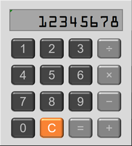

## Task 3. Increasing the Size of the Calculator Memory

At the moment, the calculator allows the user to store only three things in the memory array. This is because the memory array has three slots only. Typically, we use a calculator to combine a lot of operations together. It would be nice if the memory of the calculator is a lot bigger than 3 so that it can store a lot of numbers and operators together.

### Increasing the Size of the Array

The very first step that you need to do obviously is to increase the size of the array. At the top of the file, the array has been created like this:

```VBScript
Dim Memory(1 To 3) As String
```

The above line of code creates three slots for the memory array. To increase its size, you simply increase the upper bound of the array so that it can have many more slots than three. For example, you can change the upper bound of the array to 100 so that you can store as many as one hundred numbers and operators in the calculator.

### Handling the Out-of-memory Situation

You have seen the following code before:

```VBScript
CurrentPos = CurrentPos + 1
Memory(CurrentPos) = InputButton
```

The above code is used when the user clicks on a digit button and an operator is in the current location of the memory array. The code increases the currently active location of the memory slot by one \(i.e. enlarging the memory used by the calculator\) and then puts the newly clicked digit in this 'new' slot of the array. If the size of the array is not big enough, like the small memory array before you made the change, and you keep on adding new things to the calculator, the above code will give you a 'Subscript out of range' error, as shown at the start of this exercise.

In order to prevent the error from happening, you need to modify the above code so that you notify the user that the memory is full and the calculator is not capable of adding new data anymore. This can be achieved by a simple If statement. The If statement looks at the current location of the memory slots used by the calculator. If the location is already at the last slot of the array, you will tell the user that the memory is full using the Beep command, like this:

```VBScript
If CurrentPos = UBound(Memory) Then ' Memory is full
    Beep
Else
    ...use the next slot as usual...
End If
```

Be careful that this is not the only place where the calculator increases the use of memory. You need to look for another place which does this and apply an appropriate If statement there.

## Task 4. Calculating the Result Using Recursion

In this last task of the exercise, you need to use a recursive function to find the result of the calculation inside the memory of the calculator. You have been given the function, CalcTotal\(\), to do this. The function is empty at the moment, which looks like this:

```VBScript
Function CalcTotal(ByVal Pos As Integer) As Long
    CalcTotal = 0
End Function
```

You need to finish the content of this function so that it will __recursively__ calculate the result of what is available inside the calculator's memory array. It should be noted that although you can easily write a loop to calculate the result, this exercise is a good practice to write a simple recursive function to do the same kind of work.

Suppose that the current memory array of the calculator is \(and the size of the array has been adjusted to have 8 slots\):

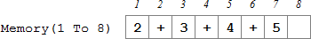

By looking at the content of the array, you know the result will be 14. However, the numbers and operators are stored as strings inside the array so it is not that simple for your code to find out the result.

To do that, we will use the following approach:

1. You will process the content of the array by reading only two slots at any one time, starting from the first position of the array, i.e. 
2. From the first position, the first two slots of the array give you "2" and "+" so you know that you need to add 2 to the rest of the array starting from position 3, i.e. 
3. Then, given this array , you read the first two slots and you know that you need to add 3 to the rest of the array starting from position 5, i.e. 
4. Again, you repeat the process by reading the first two slots, i.e. "4" and "+" and then move on to handle the array starting from position 7, i.e. 
5. This array, , contains only a "5" and therefore you can safely know that the value for this part of the array is 5
6. The result of the array is therefore, 5 \(from step 5\) + 4 \(from step 4\) + 3 \(from step 3\) + 2 \(from step 2\) = 14

This is a recursive process where you process the memory array from a certain location. You read the first two slots of the array from this location and then repeat the same process with the rest of the array. You will stop this process when you have nothing left to read, or when there is only one number left in the array.

Using the logic above, the content of the CalcTotal\(\) function can then be divided into three cases:

1. When Pos is bigger than CurrentPos, i.e. you have nothing left to read, you return 0 as the result
2. When Pos is equal to CurrentPos, i.e. there is only one number left in the array, you return the number as the result
3. You read the two slots from Pos, i.e. Memory\(Pos\) and Memory\(Pos + 1\), and combine the result with the rest of the array in a recursive manner, i.e. CalcTotal\(Pos + 2\)

To put the above in code you will have something which looks like this:

```VBScript
Function CalcTotal(ByVal Pos As Integer) As Long
    If Pos > CurrentPos Then ' Case 1: Nothing left to read
        ...return 0 as the result because there is nothing to do...
    ElseIf Pos = CurrentPos Then ' Case 2: There is only a number left
        ...return the number in the current position...
    Else ' Case 3: Read the next two slots of the array and combine with the rest of the array 
        ...read the current two slots of the array, i.e. a number and an operator...
        ...combine the number with the rest of the array, i.e. CalcTotal(Pos + 2), using the operator...
    End If
End Function
```

You need to finish the above function by filling in the code in appropriate places. One important thing when you write the code is that any number stored in the array has been stored as a string. In order to calculate the result correctly, you need to convert the string to a number first. Because the number that you can use in the calculator is quite big, you should use CLng\(\) to convert the string into a long number, instead of an integer. \(You may still be able to crash the program when the calculation produces a very big result!\)

## Final Note

You may find that the calculator does not work too well in some situations. First, the calculator cannot handle some expressions with a mixture of + and - operators. For example, 5 - 2 + 3 should result in 8. However, your calculator will give an incorrect answer. Then, the calculator does not work with decimals. For example, the answer of 5 / 3 is not correctly handled. Finally, the priority of using the x and / operators is not included in the code. All of the above problems can be rectified with a bit of coding. It is likely the first one is easy to handle and the last two not so. You can think about how to work on them. However, they are not part of the exercise.

## Submission

You need to complete the calculator in the given Excel file, ___[excel\_calculator.xlsm](template/excel_calculator.xlsm)___. This file has been given to you near the start of this page.

After you have finished your work, upload your file and then submit by clicking the "Submit Assignment", and then choosing your file to submit.

## submission

- file: [excel_calculator.xlsm](submission/excel_calculator.xlsm)
