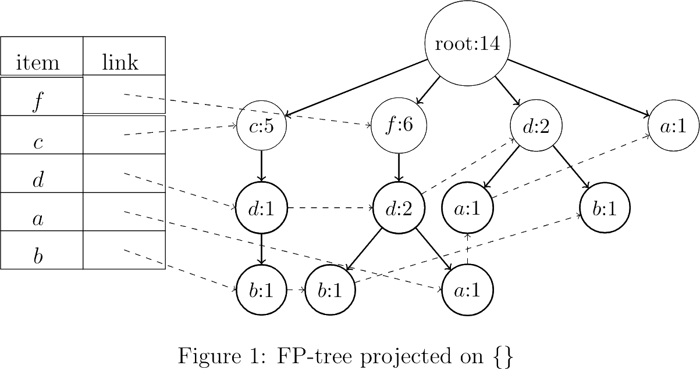
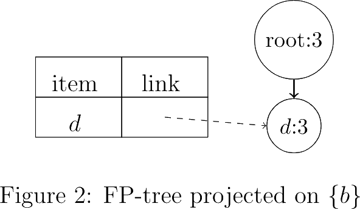
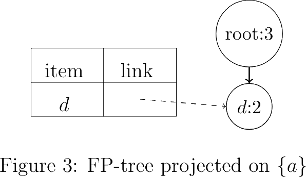
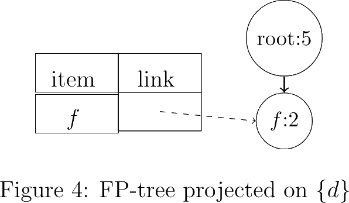
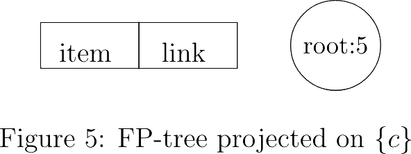
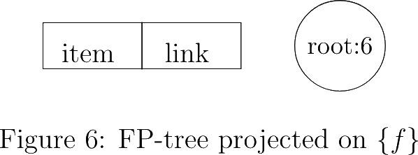
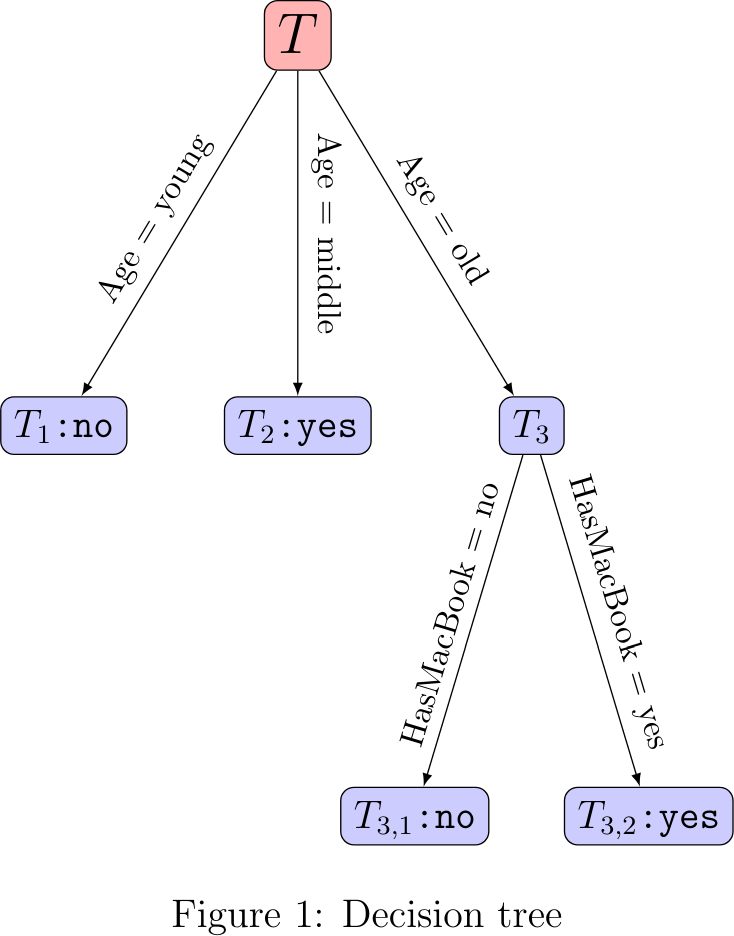

---
aliases:
  - HKUST COMP 1942 homework 1 submission
tags:
  - date/2024/03/19/from
  - date/2024/03/20/to
  - language/in/English
---

# HKUST COMP 1942 homework 1 submission

COMP1942 Exploring and Visualizing Data (Spring Semester 2024) 
Homework 1 
Deadline: 20 March, 2024 9:00am 
(Please hand in during lecture.) 
Full Mark: 100 Marks

__Coupon Instructions:__

1. You can use a coupon to waive any question you want and obtain full marks for this question.
2. You can waive at most one question in each assignment.
3. You can also answer the question you will waive. We will also mark it but will give full marks to this question.
4. The coupon is non-transferrable. That is, the coupon with a unique ID can be used only by the student who obtained it in class.
5. Please staple the coupon to the submitted assignment.
6. Please write down the question no. you want to waive on the coupon.

## Q1

[20 Marks]

### Q1.a

Given the following transactions in a membership-only warehouse club retail store called "Sam's Club" and the support threshold = 2. Assume that the item names are sorted in lexicographic ordering (or alphabetical ordering).

| AngusBeefBurger | CrabRoeNoodle | LimeJuice | MulberryJuice | RoastDuck | ScallopCongee |
|:---------------:|:-------------:|:---------:|:-------------:|:---------:|:-------------:|
| 0               | 1             | 0         | 0             | 1         | 1             |
| 0               | 1             | 0         | 0             | 1         | 1             |
| 1               | 1             | 0         | 0             | 0         | 1             |
| 1               | 1             | 1         | 1             | 0         | 0             |
| 1               | 0             | 1         | 0             | 1         | 0             |
| 1               | 0             | 0         | 0             | 0         | 1             |
| 0               | 0             | 1         | 0             | 1         | 0             |

Follow the steps of the Apriori Algorithm and deduce L1, C2, L2, C3, L3, C4, … until all the large itemsets are discovered. Please show the steps and list all large itemsets. You cannot use XLMiner in this part.

> $$\begin{aligned}
> C_n & \xrightarrow{ \text{count step} } L_n \xrightarrow{ \text{join step} } C_{n + 1}' \xrightarrow{ \text{prune step} } C_{n + 1} \\
> \\
> C_1 & = \{ \set{ \text{AngusBeefBurger} }, \set{ \text{CrabRoeNoodle} }, \set{ \text{LimeJuice} }, \\
> & \phantom{= \{} \set{ \text{MulberryJuice} }, \set{ \text{RoastDuck} }, \set{ \text{ScallopCongee} } \} \\
> L_1 & = \{ \set{ \text{AngusBeefBurger} }, \set{ \text{CrabRoeNoodle} }, \set{ \text{LimeJuice} }, \\
> & \phantom{= \{} \set{ \text{RoastDuck} }, \set{ \text{ScallopCongee} } \} \\
> C_2' & = \{ \set{ \text{AngusBeefBurger}, \text{CrabRoeNoodle} }, \\
> & \phantom{= \{} \set{ \text{AngusBeefBurger}, \text{LimeJuice} }, \\
> & \phantom{= \{} \set{ \text{AngusBeefBurger}, \text{RoastDuck} }, \\
> & \phantom{= \{} \set{ \text{AngusBeefBurger}, \text{ScallopCongee} }, \\
> & \phantom{= \{} \set{ \text{CrabRoeNoodle}, \text{LimeJuice} }, \\
> & \phantom{= \{} \set{ \text{CrabRoeNoodle}, \text{RoastDuck} }, \\
> & \phantom{= \{} \set{ \text{CrabRoeNoodle}, \text{ScallopCongee} }, \\
> & \phantom{= \{} \set{ \text{LimeJuice}, \text{RoastDuck} }, \\
> & \phantom{= \{} \set{ \text{LimeJuice}, \text{ScallopCongee} }, \\
> & \phantom{= \{} \set{ \text{RoastDuck}, \text{ScallopCongee} } \} \\
> C_2 & = \{ \set{ \text{AngusBeefBurger}, \text{CrabRoeNoodle} }, \\
> & \phantom{= \{} \set{ \text{AngusBeefBurger}, \text{LimeJuice} }, \\
> & \phantom{= \{} \set{ \text{AngusBeefBurger}, \text{RoastDuck} }, \\
> & \phantom{= \{} \set{ \text{AngusBeefBurger}, \text{ScallopCongee} }, \\
> & \phantom{= \{} \set{ \text{CrabRoeNoodle}, \text{LimeJuice} }, \\
> & \phantom{= \{} \set{ \text{CrabRoeNoodle}, \text{RoastDuck} }, \\
> & \phantom{= \{} \set{ \text{CrabRoeNoodle}, \text{ScallopCongee} }, \\
> & \phantom{= \{} \set{ \text{LimeJuice}, \text{RoastDuck} }, \\
> & \phantom{= \{} \set{ \text{LimeJuice}, \text{ScallopCongee} }, \\
> & \phantom{= \{} \set{ \text{RoastDuck}, \text{ScallopCongee} } \} \\
> L_2 & = \{ \set{ \text{AngusBeefBurger}, \text{CrabRoeNoodle} }, \\
> & \phantom{= \{} \set{ \text{AngusBeefBurger}, \text{LimeJuice} }, \\
> & \phantom{= \{} \set{ \text{AngusBeefBurger}, \text{ScallopCongee} }, \\
> & \phantom{= \{} \set{ \text{CrabRoeNoodle}, \text{RoastDuck} }, \\
> & \phantom{= \{} \set{ \text{CrabRoeNoodle}, \text{ScallopCongee} }, \\
> & \phantom{= \{} \set{ \text{LimeJuice}, \text{RoastDuck} }, \\
> & \phantom{= \{} \set{ \text{RoastDuck}, \text{ScallopCongee} } \} \\
> C_3' & = \{ \set{ \text{AngusBeefBurger}, \text{CrabRoeNoodle}, \text{LimeJuice} }, \\
> & \phantom{= \{} \set{ \text{AngusBeefBurger}, \text{CrabRoeNoodle}, \text{ScallopCongee} }, \\
> & \phantom{= \{} \set{ \text{AngusBeefBurger}, \text{LimeJuice}, \text{ScallopCongee} }, \\
> & \phantom{= \{} \set{ \text{CrabRoeNoodle}, \text{RoastDuck}, \text{ScallopCongee} } \} \\
> C_3 & = \{ \set{ \text{AngusBeefBurger}, \text{CrabRoeNoodle}, \text{ScallopCongee} }, \\
> & \phantom{= \{} \set{ \text{CrabRoeNoodle}, \text{RoastDuck}, \text{ScallopCongee} } \} \\
> L_3 & = \set{ \set{ \text{CrabRoeNoodle}, \text{RoastDuck}, \text{ScallopCongee} } } \\
> C_4' & = \set{  } \\
> C_4 & = \set{  } \\
> L_4 & = \set{  } \\
> \\
> L & \text{ is the set of all large item sets, and is the union of all }L_*\text{.} \\
> L & = \{ \set{ \text{AngusBeefBurger} }, \set{ \text{CrabRoeNoodle} }, \set{ \text{LimeJuice} }, \\
> & \phantom{= \{} \set{ \text{RoastDuck} }, \set{ \text{ScallopCongee} }, \\
> & \phantom{= \{} \set{ \text{AngusBeefBurger}, \text{CrabRoeNoodle} }, \\
> & \phantom{= \{} \set{ \text{AngusBeefBurger}, \text{LimeJuice} }, \\
> & \phantom{= \{} \set{ \text{AngusBeefBurger}, \text{ScallopCongee} }, \\
> & \phantom{= \{} \set{ \text{CrabRoeNoodle}, \text{RoastDuck} }, \\
> & \phantom{= \{} \set{ \text{CrabRoeNoodle}, \text{ScallopCongee} }, \\
> & \phantom{= \{} \set{ \text{LimeJuice}, \text{RoastDuck} }, \\
> & \phantom{= \{} \set{ \text{RoastDuck}, \text{ScallopCongee} }, \\
> & \phantom{= \{} \set{ \text{CrabRoeNoodle}, \text{RoastDuck}, \text{ScallopCongee} } \} \\
> \end{aligned}$$

### Q1.b

Find all association rules where the support threshold is 2 and the confidence threshold is 90%. Please use XLMiner to find all such association rules. You just need to list all association rules for this part. You do not need to submit any softcopy related to XLMiner.

> $$\begin{aligned}
> \set{ \text{CrabRoeNoodle}, \text{RoastDuck} } & \implies \set{ \text{ScallopCongee} } \\
> \set{ \text{RoastDuck}, \text{ScallopCongee} } & \implies \set{ \text{CrabRoeNoodle} }
> \end{aligned}$$

## Q2

[20 Marks]

### Q2.a

Given the following transactions and the support threshold = 2.

| TID | Items bought |
|:---:|:------------:|
| 1   | b, c, d, p   |
| 2   | f, j, q      |
| 3   | c, i         |
| 4   | a, d         |
| 5   | c, m         |
| 6   | b, d, f      |
| 7   | a, d, f      |
| 8   | a, l         |
| 9   | c, g         |
| 10  | c, k         |
| 11  | f, n, o      |
| 12  | e, f         |
| 13  | f, h         |
| 14  | b, d         |

Follow the steps of the FP-growth algoritm to find all frequent itemsets. Please show the steps and list all frequent itemsets. You cannot use XLMiner in this part.

> __condition: $\set{}$<!-- LaTeX separator -->__
>
> Recursion depth is 0. Condition support is 14. Transactions are:
>
> | item set   | count |
> |------------|-------|
> | b, c, d, p | 1     |
> | f, j, q    | 1     |
> | c, i       | 1     |
> | a, d       | 1     |
> | c, m       | 1     |
> | b, d, f    | 1     |
> | a, d, f    | 1     |
> | a, l       | 1     |
> | c, g       | 1     |
> | c, k       | 1     |
> | f, n, o    | 1     |
> | e, f       | 1     |
> | f, h       | 1     |
> | b, d       | 1     |
>
> Count table is:
>
> | item | count |
> |------|-------|
> | a    | 3     |
> | b    | 3     |
> | c    | 5     |
> | d    | 5     |
> | e    | 1     |
> | f    | 6     |
> | g    | 1     |
> | h    | 1     |
> | i    | 1     |
> | j    | 1     |
> | k    | 1     |
> | l    | 1     |
> | m    | 1     |
> | n    | 1     |
> | o    | 1     |
> | p    | 1     |
> | q    | 1     |
>
> Filter for frequent items and sort by descending count. Header table is:
>
> | item | count |
> |------|-------|
> | f    | 6     |
> | c    | 5     |
> | d    | 5     |
> | a    | 3     |
> | b    | 3     |
>
> Filter the transactions and sort the items in item sets by descending support:
>
> | item set (sorted) | count |
> |-------------------|-------|
> | c, d, b           | 1     |
> | f                 | 4     |
> | c                 | 4     |
> | d, a              | 1     |
> | f, d, b           | 1     |
> | f, d, a           | 1     |
> | a                 | 1     |
> | d, b              | 1     |
>
> Build the FP-tree. FP-tree is:
>
> 
>
> FP-tree is not a chain. Recurse.
>
> __condition: $\set{b}$<!-- LaTeX separator -->__
>
> Recursion depth is 1. Condition support is 3. Transactions are:
>
> | item set | count |
> |----------|-------|
> | c, d     | 1     |
> | f, d     | 1     |
> | d        | 1     |
>
> Count table is:
>
> | item | count |
> |------|-------|
> | c    | 1     |
> | d    | 3     |
> | f    | 1     |
>
> Filter for frequent items and sort by descending count. Header table is:
>
> | item | count |
> |------|-------|
> | d    | 3     |
>
> Filter the transactions and sort the items in item sets by descending support:
>
> | item set (sorted) | count |
> |-------------------|-------|
> | d                 | 3     |
>
> Build the FP-tree. FP-tree is:
>
> 
>
> FP-tree is a chain. Frequent item sets are:
>
> | item set | count |
> |----------|-------|
> | b, d     | 3     |
> | b        | 3     |
>
> __condition: $\set{a}$<!-- LaTeX separator -->__
>
> Recursion depth is 1. Condition support is 3. Transactions are:
>
> | item set | count |
> |----------|-------|
> | d        | 1     |
> | f, d     | 1     |
>
> Count table is:
>
> | item | count |
> |------|-------|
> | d    | 2     |
> | f    | 1     |
>
> Filter for frequent items and sort by descending count. Header table is:
>
> | item | count |
> |------|-------|
> | d    | 2     |
>
> Filter the transactions and sort the items in item sets by descending support:
>
> | item set (sorted) | count |
> |-------------------|-------|
> | d                 | 2     |
> |                   | 1     |
>
> Build the FP-tree. FP-tree is:
>
> 
>
> FP-tree is a chain. Frequent item sets are:
>
> | item set | count |
> |----------|-------|
> | a, d     | 2     |
> | a        | 3     |
>
> __condition: $\set{d}$<!-- LaTeX separator -->__
>
> Recursion depth is 1. Condition support is 5. Transactions are:
>
> | item set | count |
> |----------|-------|
> | c        | 1     |
> |          | 2     |
> | f        | 2     |
>
> Count table is:
>
> | item | count |
> |------|-------|
> | c    | 1     |
> | f    | 2     |
>
> Filter for frequent items and sort by descending count. Header table is:
>
> | item | count |
> |------|-------|
> | f    | 2     |
>
> Filter the transactions and sort the items in item sets by descending support:
>
> | item set (sorted) | count |
> |-------------------|-------|
> |                   | 3     |
> | f                 | 2     |
>
> Build the FP-tree. FP-tree is:
>
> 
>
> FP-tree is a chain. Frequent item sets are:
>
> | item set | count |
> |----------|-------|
> | d, f     | 2     |
> | d        | 5     |
>
> __condition: $\set{c}$<!-- LaTeX separator -->__
>
> Recursion depth is 1. Condition support is 5. Transactions are:
>
> | item set | count |
> |----------|-------|
> |          | 5     |
>
> Count table is:
>
> | item | count |
> |------|-------|
>
> Filter for frequent items and sort by descending count. Header table is:
>
> | item | count |
> |------|-------|
>
> Filter the transactions and sort the items in item sets by descending support:
>
> | item set (sorted) | count |
> |-------------------|-------|
> |                   | 5     |
>
> Build the FP-tree. FP-tree is:
>
> 
>
> FP-tree is a chain. Frequent item sets are:
>
> | item set | count |
> |----------|-------|
> | c        | 5     |
>
> __condition: $\set{f}$<!-- LaTeX separator -->__
>
> Recursion depth is 1. Condition support is 6. Transactions are:
>
> | item set | count |
> |----------|-------|
> |          | 6     |
>
> Count table is:
>
> | item | count |
> |------|-------|
>
> Filter for frequent items and sort by descending count. Header table is:
>
> | item | count |
> |------|-------|
>
> Filter the transactions and sort the items in item sets by descending support:
>
> | item set (sorted) | count |
> |-------------------|-------|
> |                   | 6     |
>
> Build the FP-tree. FP-tree is:
>
> 
>
> FP-tree is a chain. Frequent item sets are:
>
> | item set | count |
> |----------|-------|
> | f        | 6     |
>
> __condition: $\set{}$, end__
>
> Recursion depth is 0. Gather frequent item sets from recursive processing:
>
> | item set | count |
> |----------|-------|
> | b, d     | 3     |
> | b        | 3     |
> | a, d     | 2     |
> | a        | 3     |
> | d, f     | 2     |
> | d        | 5     |
> | c        | 5     |
> | f        | 6     |

### Q2.b

Find all association rules where the support threshold is 2 and the confidence threshold is 60%. Please use XLMiner to find all such association rules. You just need to list all association rules for this part. You do not need to submit any softcopy related to XLMiner.

> $$\begin{aligned}
> \set{a} & \implies \set{d} \\
> \set{b} & \implies \set{d} \\
> \set{d} & \implies \set{b}
> \end{aligned}$$

## Q3

[20 Marks]

Consider the following eight two-dimensional data points:

> x1: (17, 12), x2: (5, 12), x3: (17, 14), x4: (5, 16), x5: (20, 15), x6: (3, 9), x7: (12, 3), x8: (12, 32)

Consider algorithm k-means.

### Q3.a

Please answer the following questions. You are required to show the information about each final cluster (including the mean of the cluster and all data points in this cluster) as the output of the algorithm. You should use XLMiner to find the following answers. Please use "No. of iterations = 50, No. of starts = 10, seed = 54321 without rescaling/normalizing the input data" in XLMiner. You do not need to submit any softcopy related to XLMiner.

#### Q3.a.i

If k = 2, what is the output of the algorithm?

> | cluster | x    | y     | average distance | sum of squares |
> |---------|------|-------|------------------|----------------|
> | 1       | 16.5 | 18.25 | 7.448289596      | 289.75         |
> | 2       | 6.25 | 10    | 5.236630928      | 136.75         |
>
> | point         | cluster |
> |---------------|---------|
> | x1 | 1       |
> | x2 | 2       |
> | x3 | 1       |
> | x4 | 2       |
> | x5 | 1       |
> | x6 | 2       |
> | x7 | 2       |
> | x8 | 1       |

#### Q3.a.ii

If k = 3, what is the output of the algorithm?

> | cluster | x    | y     | average distance | sum of squares |
> |---------|------|-------|------------------|----------------|
> | 1       | 13/3 | 37/3  | 2.687415275      | 27.33333333    |
> | 2       | 16.5 | 18.25 | 7.448289596      | 289.75         |
> | 3       | 12   | 3     | 0                | 0              |
>
> | point         | cluster |
> |---------------|---------|
> | x1 | 2       |
> | x2 | 1       |
> | x3 | 2       |
> | x4 | 1       |
> | x5 | 2       |
> | x6 | 1       |
> | x7 | 3       |
> | x8 | 2       |

### Q.3.b

What are the advantages and the disadvantages of algorithm k-means?

> - advantages
>   - The algorithm is simple to implement.
>   - The algorithm converges quickly after few iterations.
> - disadvantages
>   - The value of $k$ is difficult to be chosen properly because the number of clusters is not known beforehand.
>   - The algorithm is sensitive to initial means, which is randomly generated. Bad initial means give suboptimal results.
>   - The algorithm models works best with similar sized clusters, and works sub-optimally with very different sized clusters.

## Q4

[20 Marks]

Consider eight data points.

The following matrix shows that pairwise distances between any two points.

$$\begin{aligned}
& \begin{matrix} \phantom{0} & \phantom{0}1 & \phantom{0}2 & \phantom{0}3 & \phantom{0}4 & \phantom{0}5 & \phantom{0}6 & \phantom{0}7 & 8 \end{matrix} \\
& \begin{matrix} 1 \\ 2 \\ 3 \\ 4 \\ 5 \\ 6 \\ 7 \\ 8 \end{matrix} \begin{pmatrix} 0 \\
11 & 0 \\
5 & 13 & 0 \\
12 & 2 & 14 & 0 \\
7 & 17 & 1 & 18 & 0 \\
13 & 4 & 15 & 5 & 20 & 0 \\
9 & 15 & 12 & 16 & 15 & 19 & 0 \\
11 & 20 & 12 & 21 & 17 & 22 & 30 & 0 \end{pmatrix}
\end{aligned}$$

Please use the divisive (polythetic) approach to divide these eight points into two groups/clusters by using distance complete linkage.

Please write down all data points for each cluster and write down the distance between the two clusters. You cannot use XLMiner in this question.

> $$\begin{aligned}
> & \begin{aligned} D(1, *) = 13 \\
> D(2, *) = 20 \\
> D(3, *) = 15 \\
> D(4, *) = 21 \\
> D(5, *) = 20 \\
> D(6, *) = 22 \\
> D(7, *) = 30 && * \\
> D(8, *) = 30 && *\end{aligned} \\
> \\
> & \begin{aligned} A & = \set{7} \\
> B & = \set{1, 2, 3, 4, 5, 6, 8} \end{aligned} \\
> & \begin{aligned} D(1, A) & = 9 & D(1, B) & = 13 & \Delta_1 & = 4 \\
> D(2, A) & = 15 & D(2, B) & = 20 & \Delta_2 & = 5 && * \\
> D(3, A) & = 12 & D(3, B) & = 15 & \Delta_3 & = 3 \\
> D(4, A) & = 16 & D(4, B) & = 21 & \Delta_4 & = 5 && * \\
> D(5, A) & = 15 & D(5, B) & = 20 & \Delta_5 & = 5 && * \\
> D(6, A) & = 19 & D(6, B) & = 22 & \Delta_6 & = 3 \\
> D(8, A) & = 30 & D(8, B) & = 22 & \Delta_8 & = -8 \end{aligned} \\
> \\
> & \begin{aligned} A & = \set{2, 7} \\
> B & = \set{1, 3, 4, 5, 6, 8} \end{aligned} \\
> & \begin{aligned} D(1, A) & = 11 & D(1, B) & = 13 & \Delta_1 & = 2 \\
> D(3, A) & = 13 & D(3, B) & = 15 & \Delta_3 & = 2 \\
> D(4, A) & = 16 & D(4, B) & = 21 & \Delta_4 & = 5 && * \\
> D(5, A) & = 17 & D(5, B) & = 20 & \Delta_5 & = 3 \\
> D(6, A) & = 19 & D(6, B) & = 22 & \Delta_6 & = 3 \\
> D(8, A) & = 30 & D(8, B) & = 22 & \Delta_8 & = -8 \end{aligned} \\
> \\
> & \begin{aligned} A & = \set{2, 4, 7} \\
> B & = \set{1, 3, 5, 6, 8} \end{aligned} \\
> & \begin{aligned} D(1, A) & = 12 & D(1, B) & = 13 & \Delta_1 & = 1 \\
> D(3, A) & = 14 & D(3, B) & = 15 & \Delta_3 & = 1 \\
> D(5, A) & = 18 & D(5, B) & = 20 & \Delta_5 & = 2 \\
> D(6, A) & = 19 & D(6, B) & = 22 & \Delta_6 & = 3 && * \\
> D(8, A) & = 30 & D(8, B) & = 22 & \Delta_8 & = -8 \end{aligned} \\
> \\
> & \begin{aligned} A & = \set{2, 4, 6, 7} \\
> B & = \set{1, 3, 5, 8} \end{aligned} \\
> & \begin{aligned} D(1, A) & = 13 & D(1, B) & = 11 & \Delta_1 & = -2 \\
> D(3, A) & = 15 & D(3, B) & = 12 & \Delta_3 & = -3 \\
> D(5, A) & = 20 & D(5, B) & = 17 & \Delta_5 & = -3 \\
> D(8, A) & = 30 & D(8, B) & = 17 & \Delta_8 & = -13 \end{aligned} \\
> \\
> & \text{The required answer is} \\
> & \begin{aligned} A & = \set{2, 4, 6, 7} \\
> B & = \set{1, 3, 5, 8} \\
> D(A, B) & = 30 \end{aligned}
> \end{aligned}$$

## Q5

[20 Marks]

The following shows a list of customers with attributes "HasMacBook", "Income" and "Age". We also indicate whether they bought "Apple Vision Pro" or not in the last column. The first column "No." is just for you to refer the record number only and you do not need to use this column for generating the classifier. You cannot use XLMiner in this question.

| No. | HasMacBook | Income | Age    | Buy_AppleVisionPro |
|:---:|:----------:|:------:|:------:|:------------------:|
| 1   | no         | high   | old    | yes                |
| 2   | no         | high   | middle | yes                |
| 3   | yes        | low    | old    | yes                |
| 4   | yes        | medium | old    | yes                |
| 5   | no         | high   | old    | no                 |
| 6   | no         | medium | young  | no                 |
| 7   | yes        | low    | young  | no                 |
| 8   | yes        | high   | young  | no                 |

### Q5.a

We want to train a C4.5 decision tree classifier to predict whether a new customer will buy "Apple Vision Pro" or not. We define the value of attribute "Buy\_ApplyVisionPro" to be the _label_ of a record.

#### Q5.a.i

Please find a C4.5 decision tree according to the above example. In the decision tree, whenever we process (1) a node containing at least 80% records with the same label or (2) a node containing at most 2 records, we stop to process this node for splitting.

> $$\begin{aligned}
> T & = \set{1, 2, 3, 4, 5, 6, 7, 8} \\
> \operatorname{Info}(T) & = -\frac 4 8 \log_2 \frac 4 8 - \frac 4 8 \log_2 \frac 4 8 = 1 \\
> \\
> \operatorname{Info}(T_{ \text{HasMacBook} = \text{no} }) & = -\frac 2 4 \log_2 \frac 2 4 - \frac 2 4 \log_2 \frac 2 4 = 1 \\
> \operatorname{Info}(T_{ \text{HasMacBook} = \text{yes} }) & = -\frac 2 4 \log_2 \frac 2 4 - \frac 2 4 \log_2 \frac 2 4 = 1 \\
> \operatorname{Info}(\text{HasMacBook} | T) & = \frac 4 8 (1) + \frac 4 8 (1) = 1 \\
> \operatorname{SplitInfo}(\text{HasMacBook}) & = -\frac 4 8 \log_2 \frac 4 8 - \frac 4 8 \log_2 \frac 4 8 = 1 \\
> \operatorname{Gain}(T, \text{HasMacBook}) & = \frac {1 - 1} 1 = 0 \\
> \\
> \operatorname{Info}(T_{ \text{Income} = \text{low} }) & = -\frac 1 2 \log_2 \frac 1 2 - \frac 1 2 \log_2 \frac 1 2 = 1 \\
> \operatorname{Info}(T_{ \text{Income} = \text{medium} }) & = -\frac 1 2 \log_2 \frac 1 2 - \frac 1 2 \log_2 \frac 1 2 = 1 \\
> \operatorname{Info}(T_{ \text{Income} = \text{high} }) & = -\frac 2 4 \log_2 \frac 2 4 - \frac 2 4 \log_2 \frac 2 4 = 1 \\
> \operatorname{Info}(\text{Income} | T) & = \frac 2 8 (1) + \frac 2 8 (1) + \frac 4 8 (1) = 1 \\
> \operatorname{SplitInfo}(\text{Income}) & = -\frac 2 8 \log_2 \frac 2 8 - \frac 2 8 \log_2 \frac 2 8 - \frac 4 8 \log_2 \frac 4 8 = 1.5 \\
> \operatorname{Gain}(T, \text{Income}) & = \frac {1 - 1} {1.5} = 0 \\
> \\
> \operatorname{Info}(T_{ \text{Age} = \text{young} }) & = -\frac 3 3 \log_2 \frac 3 3 = 0 \\
> \operatorname{Info}(T_{ \text{Age} = \text{middle} }) & = -\frac 1 1 \log_2 \frac 1 1 = 0 \\
> \operatorname{Info}(T_{ \text{Age} = \text{old} }) & = -\frac 1 4 \log_2 \frac 1 4 - \frac 3 4 \log_2 \frac 3 4 \approx 0.811278124 \\
> \operatorname{Info}(\text{Age} | T) & = \frac 3 8 (0) + \frac 1 8 (0) + \frac 5 8 (0.811278124) = 0.507048828 \\
> \operatorname{SplitInfo}(\text{Age}) & = -\frac 3 8 \log_2 \frac 3 8 - \frac 1 8 \log_2 \frac 1 8 - \frac 4 8 \log_2 \frac 4 8 \approx 1.40563906 \\
> \operatorname{Gain}(T, \text{Age}) & = \frac {1 - 0.507048828} {1.40563906} \approx 0.35069541 \\
> \\
> & \text{Split by Age as it has the highest gain:} \\
> T_1 & = \set{6, 7, 8} \qquad \text{Age} = \text{young} \\
> T_2 & = \set{2} \qquad \text{Age} = \text{middle} \\
> T_3 & = \set{1, 3, 4, 5} \qquad \text{Age} = \text{old} \\
> T_1 & \text{ is a decision tree leaf node labeled no.} \\
> T_2 & \text{ is a decision tree leaf node labeled yes.} \\
> T_3 & \text{ requires further processing.} \\
> \\
> T_3 & = \set{1, 3, 4, 5} \\
> \operatorname{Info}(T_3) & = -\frac 1 4 \log_2 \frac 1 4 - \frac 3 4 \log_2 \frac 3 4 \approx 0.811278124 \\
> \\
> \operatorname{Info}(T_{3; \text{HasMacBook} = \text{no} }) & = -\frac 1 2 \log_2 \frac 1 2 - \frac 1 2 \log_2 \frac 1 2 = 1 \\
> \operatorname{Info}(T_{3; \text{HasMacBook} = \text{yes} }) & = -\frac 2 2 \log_2 \frac 2 2 = 0 \\
> \operatorname{Info}(\text{HasMacBook} | T_3) & = \frac 2 4 (1) + \frac 2 4 (0) = \frac 1 2 \\
> \operatorname{SplitInfo}(\text{HasMacBook}) & = -\frac 1 2 \log_2 \frac 1 2 - \frac 1 2 \log_2 \frac 1 2 = 1 \\
> \operatorname{Gain}(T_3, \text{HasMacBook}) & = \frac {0.811278124 - \frac 1 2} 1 = 0.311278124 \\
> \\
> \operatorname{Info}(T_{3; \text{Income} = \text{low} }) & = -\frac 1 1 \log_2 \frac 1 1 = 0 \\
> \operatorname{Info}(T_{3; \text{Income} = \text{medium} }) & = -\frac 1 1 \log_2 \frac 1 1 = 0 \\
> \operatorname{Info}(T_{3; \text{Income} = \text{high} }) & = -\frac 1 2 \log_2 \frac 1 2 - \frac 1 2 \log_2 \frac 1 2 = 1 \\
> \operatorname{Info}(\text{Income} | T_3) & = \frac 1 4 (0) + \frac 1 4 (0) + \frac 2 4 (1) = \frac 1 2 \\
> \operatorname{SplitInfo}(\text{Income}) & = -\frac 1 4 \log_2 \frac 1 4 - \frac 1 4 \log_2 \frac 1 4 - \frac 2 4 \log_2 \frac 2 4 = 1.5 \\
> \operatorname{Gain}(T_3, \text{Income}) & = \frac {0.811278124 - \frac 1 2} {1.5} \approx 0.20751875 \\
> \\
> & \text{Split by HasMacBook as it has the highest gain:} \\
> T_{3, 1} & = \set{1, 5} \qquad \text{HasMacBook} = \text{no} \\
> T_{3, 2} & = \set{3, 4} \qquad \text{HasMacBook} = \text{yes} \\
> T_{3, 1} & \text{ is a decision tree leaf node labeled yes (but it could also be no).} \\
> T_{3, 2} & \text{ is a decision tree leaf node labeled yes.} \\
> \end{aligned}$$
>
> 

#### Q5.a.ii

Consider an old customer with MacBook who has high income. Please predict whether this customer will buy "Apple Vision Pro".

> T → T3 → T3,2 → yes

### Q5.b

What is the difference between the C4.5 decision tree and the ID3 decision tree? Why is there a difference?

> The difference is in the gain calculation. For ID3, the gain is simply the difference between the information of the label and the information of the label after using the attribute to determine them. For C4.5, the gain is additionally divided by the the information of the attribute.
>
> The reason why C4.5 divides the gain by the information of the attribute is to normalize the gain. Intuitively, if the attribute itself provides more information, the unnormalized gain should also be higher. Normalizing the gain shows how efficient the attribute information is at determining the labels rather than simply how much the attribute information determine the labels. Efficiency is more desirable as it allows using less attribute information to determine the labels, creating smaller decision trees.
