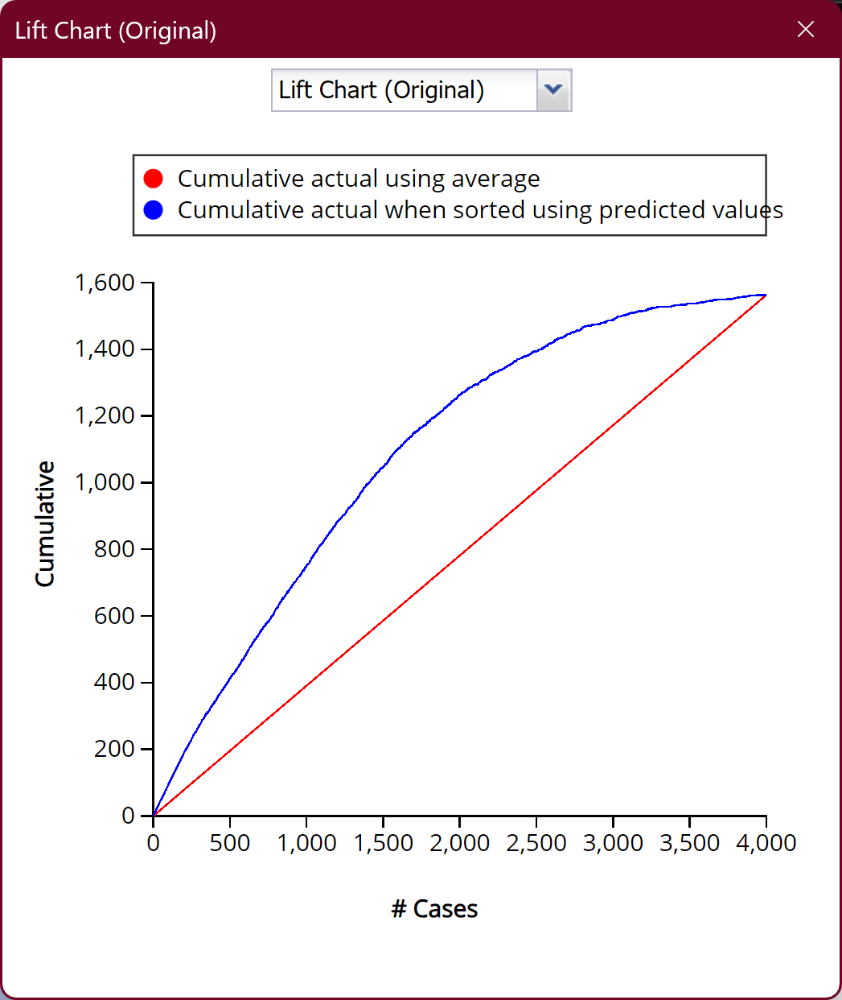
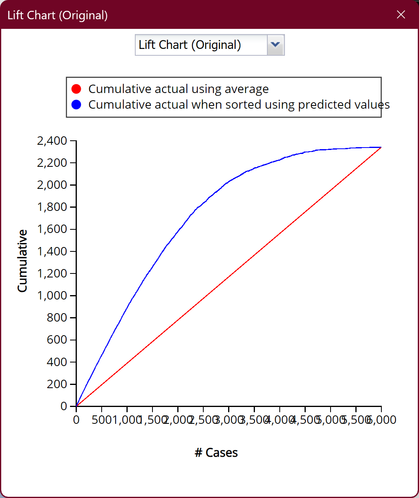

---
aliases:
  - COMP 1942 Project Phase 3 Final Report
  - Final Report
tags:
  - by/self
  - date/2024/04/15/from
  - date/2024/04/16/to
  - language/in/English
---

# Final Report

COMP 1942 Project Phase 3

- Authors: Group 69, xxsuoaa, yslaiaf

## Preprocessing

First, we open the workbook containing the data with headers.

Then, we format both the training data and the test data as a table using the Excel function "Format as Table".

1. Select the entire training data table, including the headers.
2. Find and press "Format as Table", then select any colors.
3. Check "My table contains headers" if it is not checked initially, then click "OK".
4. Do the same for the entire test data table.

Next, one of the discrete variable, `native-country`, has more than 30 distinct values. In particular, the training table has 41 distinct values while the test table has 40 distinct values. This is too many categories for our version of XLMiner to process.

From here on, do not touch the test table.

Before we reduce the number of categories, we need to sort the training table by `native-country` in ascending order. This is so that the frequency of the distinct values are somewhat randomized. We also need to record the original distinct values:

1. Create a new sheet named `native-country`.
2. Set value in `A1` as `key`, set value in `B1` as `value`.
3. Set formula in `A2` as `=UNIQUE(training!$M$2:$M$10001)`.
4. Copy `A2:A42`, and then paste (hover over "paste special" and click "values") at the same range. Afterwards, the range should not have any formulas.
5. Format `A1:B42` as a table using "Format as Table".

We need to use the "Reduce Categories" function of XLMiner. However, this function is also limited to 30 distinct values, so instead we need to do 2 passes for the training table. For each pass, perform the following steps:

1. Press on "Reduce Categories".
2. Configure the settings as in Figure 1. In particular, the settings needs to be changed are:
    - Data Range: `A2:N1056` for the 1st pass, `A1057:N10001` for the 2nd pass
    - First row contains headers: `false`
    - Category Variable: Ignore the option values. Choose the 13th option in the dropdown.
    - Limit number of categories to: `15`
    - Others: Check that the number of distinct values in the "Category Variables" table is 21 for the 1st pass and 20 for the 2nd pass.
3. Press on "Apply", and then "OK".
4. A summary sheet will be generated. Copy and paste (paste options: values) the transformed `native-country` column back into the `training` sheet at `O(start row):O(end row)`. Do not copy the meaningless headers.
5. For the 2nd pass of the training table, we additionally need to increment each `native-country` value by 15. This makes the processed `native-country` values unique from that of the 1st pass. This can be done by:
    1. Set `P(start row)` to `=$O(start row)+15`.
    2. Extend `P(start row)` to `P(start row):P(end row)`.
    3. Copy `P(start row):P(end row)`.
    4. Paste (paste options: values) at `O(start row):O(end row)`.
    5. Clear `P(start row):P(end row)`.

> 
>
> __Figure 1__

After that, we need to fill in the `native-country` string-to-number mappings in the `native-country` sheet.training table, fill in the mappings. We can do so easily:

1. Set `B2` to `=VLOOKUP($A2,training!$M$2:$O$10001,3,TRUE)`.
2. Extend `B2` to `B2:B42`.
3. Copy `B2:B42`, and then paste (paste options: values) at the same range. Afterwards, the range should not have any formulas.

For reference, our mapping is:

| key                        | value |
|----------------------------|-------|
| Cambodia                   | 15    |
| Canada                     | 3     |
| China                      | 7     |
| Columbia                   | 9     |
| Cuba                       | 5     |
| Dominican-Republic         | 10    |
| Ecuador                    | 14    |
| El-Salvador                | 4     |
| England                    | 6     |
| France                     | 15    |
| Germany                    | 1     |
| Greece                     | 13    |
| Guatemala                  | 8     |
| Haiti                      | 11    |
| Holand-Netherlands         | 15    |
| Honduras                   | 15    |
| Hong                       | 15    |
| Hungary                    | 15    |
| India                      | 2     |
| Iran                       | 12    |
| Ireland                    | 15    |
| Italy                      | 22    |
| Jamaica                    | 21    |
| Japan                      | 23    |
| Laos                       | 30    |
| Mexico                     | 17    |
| Nicaragua                  | 29    |
| Outlying-US(Guam-USVI-etc) | 30    |
| Peru                       | 28    |
| Philippines                | 18    |
| Poland                     | 25    |
| Portugal                   | 26    |
| Puerto-Rico                | 19    |
| Scotland                   | 30    |
| South                      | 20    |
| Taiwan                     | 27    |
| Thailand                   | 30    |
| Trinadad&Tobago            | 30    |
| United-States              | 16    |
| Vietnam                    | 24    |
| Yugoslavia                 | 30    |

Afterwards, in the `training` sheet, cut and paste `O2:O10001` to `M2:M10001`.

Now we can finally touch the test table. Map the `native-country` column of the test table. To do so:

1. Set `N2` to `=VLOOKUP($M2,'native-country'!$A$2:$B$42,2,TRUE)`.
2. Extend `N2` to `N2:N8001`.
3. Copy `N2:N8001`, and then paste (paste options: values) at `M2:M8001`.
4. Clear `N2:N8001`.

Finally, sort both tables by all columns, left columns first. This can be done by starting with the rightmost column and sort by ascending. Then, go to the column on the immediate left and sort by ascending. Repeat this until the leftmost column is reached and sorted by ascending. Save the resulting workbook as `preprocessed.xlsx`.

For reference, see `preprocessed.xlsx`.

## Models

We will be testing 5 models. All models below use `preprocessed.xlsx` as the source workbook. For reference, the trained models are available as `model1.xlsx`, `model2.xlsx`, etc.

### Model 1: _k_-Nearest Neighbors

Note that we only use continuous variables here. This is because _k_-nearest neighbors uses distance for classification, and distance cannot be meaningfully defined for discrete variables.

Press on "Data Science > Classify > _k_-Nearest Neighbors". Then, configure the model as follows:

| Data                             |                   |
|----------------------------------|-------------------|
| Workbook                         | model1.xlsx       |
| Worksheet                        | training          |
| Data Range                       | \$A\$1:\$N\$10001 |
| Partitioning Method              | Random Partition  |
| Seed Value                       | 12345             |
| # Records in the training data   | 6000              |
| # Records in the validation data | 4000              |

| Variables             |                                                                |
|-----------------------|----------------------------------------------------------------|
| # Variables           | 5                                                              |
| Scale Variables       | age, education-num, capital-gain, capital-loss, hours-per-week |
| Output Variable       | income                                                         |

| Rescaling: Fitting Parameters |                 |
|-------------------------------|-----------------|
| Rescale Data?                 | TRUE            |
| Technique                     | STANDARDIZATION |

| Nearest-Neighbors: Fitting Parameters |    |
|---------------------------------------|----|
| # Nearest neighbors (K)               | 10 |

| Nearest-Neighbors Classification: Fitting Parameters |           |
|------------------------------------------------------|-----------|
| Prior Probability Calculation                        | EMPIRICAL |

| Nearest-Neighbors Classification: Model Parameters |      |
|----------------------------------------------------|------|
| # Classes                                          | 2    |
| Success Class                                      | >50k |
| Success Probability                                | 0.5  |

| Nearest-Neighbors: Reporting Parameters |       |
|-----------------------------------------|-------|
| Search for best K?                      | FALSE |

| Output Options                                |
|-----------------------------------------------|
| Summary report of scoring on training data    |
| Detailed report of scoring on training data   |
| Lift charts on training data                  |
| Frequency chart on training data              |
| Summary report of scoring on validation data  |
| Detailed report of scoring on validation data |
| Lift charts on validation data                |
| Frequency chart on validation data            |

### Model 2: Classification Tree

Before we can use the classification tree model, note that the model in XLMiner requires distinct variables to have 15 or fewer distinct values. Unfortunately, the `native-country` column has 30 distinct values. To fix this, we need to use the "Reduce Categories" function of XLMiner:

1. Press on "Reduce Categories".
2. Configure the settings as in Figure 1. In particular, the settings needs to be changed are:
    - Data Range: `A1:N10001`
    - First row contains headers: `true`
    - Category Variable: `native-country`
    - Limit number of categories to: `15`
3. Press on "Apply", and then "OK".
4. A summary sheet will be generated. Copy and paste (paste options: values) the transformed table back into the `training` sheet at `A2:N10001`. Do not copy the headers.

After doing so, we can finally use the classification tree model.

Note that we do not use the `education` column because `education-num` is the continuous version of `education`, so we only need to choose one of them.

Press on "Data Science > Classify > Classification Tree". Then, configure the model as follows:

| Data                             |                   |
|----------------------------------|-------------------|
| Workbook                         | model2.xlsx       |
| Worksheet                        | training          |
| Data Range                       | \$A\$1:\$N\$10001 |
| Partitioning Method              | Random Partition  |
| Seed Value                       | 12345             |
| # Records in the training data   | 6000              |
| # Records in the validation data | 4000              |

| Variables             |                                                                                |
|-----------------------|--------------------------------------------------------------------------------|
| # Variables           | 12                                                                             |
| Scale Variables       | age, education-num, capital-gain, capital-loss, hours-per-week                 |
| Categorical Variables | workclass, marital-status, occupation, relationship, race, sex, native-country |
| Output Variable       | income                                                                         |

| Rescaling: Fitting Parameters |                 |
|-------------------------------|-----------------|
| Rescale Data?                 | TRUE            |
| Technique                     | STANDARDIZATION |

| Decision Tree Classification: Fitting Parameters |           |
|--------------------------------------------------|-----------|
| Prior Probability Calculation                    | EMPIRICAL |

| Decision Tree: Model Parameters |             |
|---------------------------------|-------------|
| Prune?                          | TRUE        |
| Scoring tree type               | Best pruned |

| Decision Tree Classification: Model Parameters |      |
|------------------------------------------------|------|
| # Classes                                      | 2    |
| Success Class                                  | >50k |
| Success Probability                            | 0.5  |

| Decision Tree: Reporting Parameters |                                     |
|-------------------------------------|-------------------------------------|
| Trees to draw                       | Fully grown, Best pruned, Min error |
| # Max level to display              | 7                                   |
| Show feature importance?            | TRUE                                |

| Output Options                                |
|-----------------------------------------------|
| Summary report of scoring on training data    |
| Detailed report of scoring on training data   |
| Lift charts on training data                  |
| Frequency chart on training data              |
| Summary report of scoring on validation data  |
| Detailed report of scoring on validation data |
| Lift charts on validation data                |
| Frequency chart on validation data            |

### Model 3: Naive Bayes

Note that we do not use the `education` column because `education-num` is the continuous version of `education`, so we only need to choose one of them.

Also note that naive bayes classifiers require each distinct value to appear at least once in the training data. Therefore, we do not partition the training–validation data into training data and validation data. The entire training–validation data is not large enough to ensure all possible distinct values appear in the training data at least once.

For the same reason as above, the columns `capital-gain`, `capital-loss`, and `hours-per-week` are not used, as the continuous variables have too many possible distinct values. Unfortunately, while naive bayes can handle continuous variables using Gaussian naive bayes, this is not implemented in XLMiner. The continuous variable `age` is still used because the training data is comprehensive enough to cover all possible distinct values in the test data, save for 1 distinct value, which is 88. There is only one test data point, the 7986th test data point, with the age 88. Thus, for that one data point, we will replace the `#N/A` prediction value with `<=50k`, as `<=50k` is the majority in the training data.

Press on "Data Science > Classify > Naive Bayes". Then, configure the model as follows:

| Data       |                   |
|------------|-------------------|
| Workbook   | model3.xlsx       |
| Worksheet  | training          |
| Data Range | \$A\$1:\$N\$10001 |
| # Records  | 10000             |

| Variables       |                                                                                                    |
|-----------------|----------------------------------------------------------------------------------------------------|
| # Variables     | 9                                                                                                  |
| Scale Variables | age, workclass, education-num, martial-status, occupation, relationship, race, sex, native-country |
| Output Variable | income                                                                                             |

| Naive Bayes: Fitting Parameters |           |
|---------------------------------|-----------|
| Laplace smoothing               | TRUE      |
| Smoothing alpha                 | 1         |
| Prior Probability Calculation   | EMPIRICAL |

| Naive Bayes: Model Parameters |      |
|-------------------------------|------|
| # Classes                     | 2    |
| Success Classes               | >50k |
| Success Probability           | 0.5  |

| Naive Bayes: Reporting Parameters   |      |
|-------------------------------------|------|
| Show prior conditional probability  | TRUE |
| Show log-density                    | TRUE |

| Output Options                              |
|---------------------------------------------|
| Summary report of scoring on training data  |
| Detailed report of scoring on training data |
| Lift charts on training data                |
| Frequency chart on training data            |

### Model 4: Neural Network

Note that we do not use the `education` column because `education-num` is the continuous version of `education`, so we only need to choose one of them.

Press on "Data Science > Classify > Neural Network > Manual Network". Then, configure the model as follows:

| Data                             |                   |
|----------------------------------|-------------------|
| Workbook                         | model4.xlsx       |
| Worksheet                        | training          |
| Data Range                       | \$A\$1:\$N\$10001 |
| Partitioning Method              | Random Partition  |
| Seed Value                       | 12345             |
| # Records in the training data   | 6000              |
| # Records in the validation data | 4000              |

| Variables             |                                                                    |
|-----------------------|--------------------------------------------------------------------|
| # Variables           | 12                                                                 |
| Scale Variables       | age, education-num, capital-gain, capital-loss, hours-per-week     |
| Categorical Variables | workclass, martial-status, relationship, race, sex, native-country |
| Output Variable       | income                                                             |

| Rescaling: Fitting Parameters |                 |
|-------------------------------|-----------------|
| Rescale Data?                 | TRUE            |
| Technique                     | STANDARDIZATION |

| Neural Network: Fitting Parameters                      |               |
|---------------------------------------------------------|---------------|
| Random seed for initial weights                         | 12345         |
| # Hidden Layers                                         | 0             |
| Learning rate                                           | 0.1           |
| Weight change momentum                                  | 0.6           |
| Error tolerance                                         | 0.01          |
| Weight decay                                            | 0             |
| Cost function                                           | Cross Entropy |
| Hidden layer activation function                        | ReLU          |
| Output layer activation function                        | SOFTMAX       |
| Learning order                                          | Random        |
| Learning order: random seed                             | 12345         |
| Response correction                                     | 0.01          |
| Data for error computation                              | TRAINING ONLY |
| Maximum number of epochs                                | 1000          |
| Maximum number of epochs without improvement            | 5             |
| Maximum training time                                   | 3600          |
| Minimum relative change in error                        | 0.0001        |
| Minimum relative change in error compared to null model | 0.001         |

| Neural Network Classification: Fitting Parameters |           |
|---------------------------------------------------|-----------|
| Prior Probability Calculation                     | EMPIRICAL |

| Neural Network Classification: Model Parameters |      |
|-------------------------------------------------|------|
| # Classes                                       | 2    |
| Success Class                                   | >50k |
| Success Probability                             | 0.5  |

| Neural Network: Reporting Parameters |       |
|--------------------------------------|-------|
| Search for best architecture         | FALSE |
| Show neural network weights?         | TRUE  |

| Output Options                                |
|-----------------------------------------------|
| Summary report of scoring on training data    |
| Detailed report of scoring on training data   |
| Lift charts on training data                  |
| Frequency chart on training data              |
| Summary report of scoring on validation data  |
| Detailed report of scoring on validation data |
| Lift charts on validation data                |
| Frequency chart on validation data            |

### Model 5: Neural Network

The difference between this model and [model 4](#Model%204%20Neural%20Network) is that this model has an additional hidden layer of 64 neurons. We want to see if the hidden layer can improve the accuracy of the model.

Note that we do not use the `education` column because `education-num` is the continuous version of `education`, so we only need to choose one of them.

Press on "Data Science > Classify > Neural Network > Manual Network". Then, configure the model as follows:

| Data                             |                   |
|----------------------------------|-------------------|
| Workbook                         | model5.xlsx       |
| Worksheet                        | training          |
| Data Range                       | \$A\$1:\$N\$10001 |
| Partitioning Method              | Random Partition  |
| Seed Value                       | 12345             |
| # Records in the training data   | 6000              |
| # Records in the validation data | 4000              |

| Variables             |                                                                    |
|-----------------------|--------------------------------------------------------------------|
| # Variables           | 12                                                                 |
| Scale Variables       | age, education-num, capital-gain, capital-loss, hours-per-week     |
| Categorical Variables | workclass, martial-status, relationship, race, sex, native-country |
| Output Variable       | income                                                             |

| Rescaling: Fitting Parameters |                 |
|-------------------------------|-----------------|
| Rescale Data?                 | TRUE            |
| Technique                     | STANDARDIZATION |

| Neural Network: Fitting Parameters                      |               |
|---------------------------------------------------------|---------------|
| Random seed for initial weights                         | 12345         |
| # Hidden Layers                                         | 1             |
| # Nodes in Hidden Layer 1                               | 64            |
| Learning rate                                           | 0.1           |
| Weight change momentum                                  | 0.6           |
| Error tolerance                                         | 0.01          |
| Weight decay                                            | 0             |
| Cost function                                           | Cross Entropy |
| Hidden layer activation function                        | ReLU          |
| Output layer activation function                        | SOFTMAX       |
| Learning order                                          | Random        |
| Learning order: random seed                             | 12345         |
| Response correction                                     | 0.01          |
| Data for error computation                              | TRAINING ONLY |
| Maximum number of epochs                                | 1000          |
| Maximum number of epochs without improvement            | 5             |
| Maximum training time                                   | 3600          |
| Minimum relative change in error                        | 0.0001        |
| Minimum relative change in error compared to null model | 0.001         |

| Neural Network Classification: Fitting Parameters |           |
|---------------------------------------------------|-----------|
| Prior Probability Calculation                     | EMPIRICAL |

| Neural Network Classification: Model Parameters |      |
|-------------------------------------------------|------|
| # Classes                                       | 2    |
| Success Class                                   | >50k |
| Success Probability                             | 0.5  |

| Neural Network: Reporting Parameters |       |
|--------------------------------------|-------|
| Search for best architecture         | FALSE |
| Show neural network weights?         | TRUE  |

| Output Options                                |
|-----------------------------------------------|
| Summary report of scoring on training data    |
| Detailed report of scoring on training data   |
| Lift charts on training data                  |
| Frequency chart on training data              |
| Summary report of scoring on validation data  |
| Detailed report of scoring on validation data |
| Lift charts on validation data                |
| Frequency chart on validation data            |

## Results

After training the models above, we can validate the model by checking its performance on both the training dataset and the validation dataset. For all models except for model 3, the validation dataset is obtained from randomly selecting 40% of the initial training–validation dataset.

For reference, the trained models and results are available as `model1.xlsx`, `model2.xlsx`, etc.

### Model 1

The training–validation dataset (10000 data) is randomly split into a training dataset (6000 data) and a validation dataset (4000 data).

#### Model 1: Training

These are the results of the model on the training dataset.

How to interpret the results below? The confusion matrix shows that number of data falling into the 4 possible combinations of actual income/predicted income: `<=50k`/`<=50k`, `<=50k`/`>50k`, `>50k`/`<=50k`, `>50k`/`>50k`. The error reports shows, for each actual income, the total number of data points, how many data points are predicted wrongly, and the percentage error of the data predicted wrongly. The metrics show the several ways to measure the performance of this model. The accuracy is simply how many data points are predicted correctly. The accuracy percentage is the portion of data points predicted correctly. The specificity is the portion of correctly predicted `<=50k` data points over data points that are actually `<=50k`. The sensitivity is the portion of correctly predicted `>50k` data points over data points that are actually `>50k`. The precision is the portion of data points that are correctly predicted `>50k` over data points that are correctly or incorrectly predicted `50k`. The F1 score is defined as $2 \frac {\text{precision} \cdot \text{recall} } {\text{precision} + \text{recall} }$ and describes both the precision and recall in one metric, making it a more comprehensive measurement of model performance than simply using precision or recall alone. The success class is simply which income is treated as the "positive" condition, which is `>50k`. The success probability is the minimum confidence (inclusive) of being `>50k` required to predict `>50k` for that data point. Both the lift chart and the decile-wise lift chart describe the model performance compared to the baseline model, i.e. the average model. For the lift chart, the higher the (signed) area between the two curves is, the better. For the decile-wise lift chart, the more abrupt the transition from the 1st decile to the 10th decile is, the better.

Confusion matrix is as follows:

| __Actual\Predicted__ | __<=50k__ | __>50k__ |
| -------------------- | --------- | -------- |
| __<=50k__            | 3037      | 621      |
| __>50k__             | 637       | 1705     |

Error report is as follows:

| __Class__   | __# Cases__ | __# Errors__ | __% Error__ |
| ----------- | ----------- | ------------ | ----------- |
| __<=50k__   | 3658        | 621          | 16.97648989 |
| __>50k__    | 2342        | 637          | 27.19897523 |
| __Overall__ | 6000        | 1258         | 20.96666667 |

Metrics are as follows:

| __Metric__               | __Value__   |
| ------------------------ | ----------- |
| __Accuracy (#correct)__  | 4742        |
| __Accuracy (%correct)__  | 79.03333333 |
| __Specificity__          | 0.830235101 |
| __Sensitivity (Recall)__ | 0.728010248 |
| __Precision__            | 0.733018057 |
| __F1 score__             | 0.73050557  |
| __Success Class__        | >50k        |
| __Success Probability__  | 0.5         |

The lift charts are as follows:

| __Lift Chart__                                                       | __Decile-wise Lift Chart__                                                         |
| -------------------------------------------------------------------- | ---------------------------------------------------------------------------------- |
|  |  |

#### Model 1: Validation

These are the results of the model on the validation dataset.

How to interpret the results below? The confusion matrix shows that number of data falling into the 4 possible combinations of actual income/predicted income: `<=50k`/`<=50k`, `<=50k`/`>50k`, `>50k`/`<=50k`, `>50k`/`>50k`. The error reports shows, for each actual income, the total number of data points, how many data points are predicted wrongly, and the percentage error of the data predicted wrongly. The metrics show the several ways to measure the performance of this model. The accuracy is simply how many data points are predicted correctly. The accuracy percentage is the portion of data points predicted correctly. The specificity is the portion of correctly predicted `<=50k` data points over data points that are actually `<=50k`. The sensitivity is the portion of correctly predicted `>50k` data points over data points that are actually `>50k`. The precision is the portion of data points that are correctly predicted `>50k` over data points that are correctly or incorrectly predicted `50k`. The F1 score is defined as $2 \frac {\text{precision} \cdot \text{recall} } {\text{precision} + \text{recall} }$ and describes both the precision and recall in one metric, making it a more comprehensive measurement of model performance than simply using precision or recall alone. The success class is simply which income is treated as the "positive" condition, which is `>50k`. The success probability is the minimum confidence (inclusive) of being `>50k` required to predict `>50k` for that data point. Both the lift chart and the decile-wise lift chart describe the model performance compared to the baseline model, i.e. the average model. For the lift chart, the higher the (signed) area between the two curves is, the better. For the decile-wise lift chart, the more abrupt the transition from the 1st decile to the 10th decile is, the better.

Confusion matrix is as follows:

| __Actual\Predicted__ | __<=50k__ | __>50k__ |
| -------------------- | --------- | -------- |
| __<=50k__            | 1963      | 474      |
| __>50k__             | 486       | 1077     |

Error report is as follows:

| __Class__   | __# Cases__ | __# Errors__ | __% Error__ |
| ----------- | ----------- | ------------ | ----------- |
| __<=50k__   | 2437        | 474          | 19.45014362 |
| __>50k__    | 1563        | 486          | 31.0940499  |
| __Overall__ | 4000        | 960          | 24          |

Metrics are as follows:

| __Metric__               | __Value__   |
| ------------------------ | ----------- |
| __Accuracy (#correct)__  | 3040        |
| __Accuracy (%correct)__  | 76          |
| __Specificity__          | 0.805498564 |
| __Sensitivity (Recall)__ | 0.689059501 |
| __Precision__            | 0.694390716 |
| __F1 score__             | 0.691714836 |
| __Success Class__        | >50k        |
| __Success Probability__  | 0.5         |

The lift charts are as follows:

| __Lift Chart__                                                           | __Decile-wise Lift Chart__                                                             |
| ------------------------------------------------------------------------ | -------------------------------------------------------------------------------------- |
|  |  |

#### Model 1: Test

These are the results of the model on the validation dataset.

The predicted frequencies are as follows:

| __Predicted__ | __Frequency__ |
| ------------- | ------------- |
| __<=50k__     | 5246          |
| __>50k__      | 2754          |

The prediction results are available as `predicted1.txt`. `0` represents `<=50k` while `1` represents `>50k`.

#### Model 1: Examples

As _k_-nearest neighbor is based on measuring distances to data in the training dataset, interpreting the model is best done by looking at some examples.

Take 2 examples, one from each possible `income`, from the validation dataset (values in parentheses are the values after standardization):

| no.            | 2578              | 6197               |
| -------------- | ----------------- | ------------------ |
| age            | 31 (-0.768137983) | 43 (0.236883583)   |
| workclass      | Private           | Private            |
| education      | Some-college      | Masters            |
| education-num  | 10 (-0.098751615) | 14 (1.284324222)   |
| martial-status | Divorced          | Married-civ-spouse |
| occupation     | Adm-clerical      | Prof-specialty     |
| relationship   | Unmarried         | Husband            |
| race           | Black             | White              |
| sex            | Female            | Male               |
| capital-gain   | 0 (-0.185244089)  | 5178 (0.455297692) |
| capital-loss   | 0 (-0.295045917)  | 0 (-0.295045917)   |
| hours-per-week | 40 (-0.472349883) | 40 (-0.472349883)  |
| native-country | 23                | 16                 |
| income         | <=50k             | >50k               |

Our model results for the 2 examples are as follows:

| no.  | income | prediction: income | posterior probability: <=50k | posterior probability: >50k |
| ---- | ------ | ------------------ | ---------------------------- | --------------------------- |
| 2578 | <=50k  | <=50k              | 0.533333333                  | 0.466666667                 |
| 6197 | >50k   | >50k               | 0.3                          | 0.7                         |

To predict the income given some data, we just need to find the _k_-nearest data points in the training dataset. _k_ is 10 in this case. Using the examples:

For the 1st example, there are actually 15 data points in the training dataset that has a squared Euclidean distance of 0. The tie-breaking rule of XLMiner says that those 15 data points will all be considered. So, the 15 nearest data points in the training dataset are given as below. Note that only input variables used in the model are shown, the continuous variable values are standardized, and distance is the squared Euclidean distance:

| no.  | distance | age          | education-num | capital-gain | capital-loss | hours-per-week | income |
| ---- | -------- | ------------ | ------------- | ------------ | ------------ | -------------- | ------ |
| 2374 | 0        | -0.764748212 | -0.121896628  | -0.183882933 | -0.293671746 | -0.462585038   | >50k   |
| 2375 | 0        | -0.764748212 | -0.121896628  | -0.183882933 | -0.293671746 | -0.462585038   | >50k   |
| 2587 | 0        | -0.764748212 | -0.121896628  | -0.183882933 | -0.293671746 | -0.462585038   | >50k   |
| 2588 | 0        | -0.764748212 | -0.121896628  | -0.183882933 | -0.293671746 | -0.462585038   | <=50k  |
| 2594 | 0        | -0.764748212 | -0.121896628  | -0.183882933 | -0.293671746 | -0.462585038   | >50k   |
| 2597 | 0        | -0.764748212 | -0.121896628  | -0.183882933 | -0.293671746 | -0.462585038   | <=50k  |
| 2599 | 0        | -0.764748212 | -0.121896628  | -0.183882933 | -0.293671746 | -0.462585038   | <=50k  |
| 2609 | 0        | -0.764748212 | -0.121896628  | -0.183882933 | -0.293671746 | -0.462585038   | >50k   |
| 2612 | 0        | -0.764748212 | -0.121896628  | -0.183882933 | -0.293671746 | -0.462585038   | <=50k  |
| 2614 | 0        | -0.764748212 | -0.121896628  | -0.183882933 | -0.293671746 | -0.462585038   | <=50k  |
| 2615 | 0        | -0.764748212 | -0.121896628  | -0.183882933 | -0.293671746 | -0.462585038   | <=50k  |
| 2617 | 0        | -0.764748212 | -0.121896628  | -0.183882933 | -0.293671746 | -0.462585038   | >50k   |
| 2626 | 0        | -0.764748212 | -0.121896628  | -0.183882933 | -0.293671746 | -0.462585038   | <=50k  |
| 2627 | 0        | -0.764748212 | -0.121896628  | -0.183882933 | -0.293671746 | -0.462585038   | <=50k  |
| 2668 | 0        | -0.764748212 | -0.121896628  | -0.183882933 | -0.293671746 | -0.462585038   | >50k   |

To predict the 1st example, we count the number of neighbors that has income `<=50k` and `>50k` separately, and then find the majority income in the neighbors. We have 8 `<=50k` and 7 `>50k`. As `<=50k` has more neighbors, we predict the example to have an income of `<=50k`. This matches the actual income.

For the 2nd example, the 10 nearest data points in the training dataset are given as below. Note that only input variables used in the model are shown, the continuous variable values are standardized, and distance is the squared Euclidean distance:

| no.  | distance    | age          | education-num | capital-gain | capital-loss | hours-per-week | income |
| ---- | ----------- | ------------ | ------------- | ------------ | ------------ | -------------- | ------ |
| 6468 | 0.007051835 | 0.326929476  | 1.286634461   | 0.451945117  | -0.293671746 | -0.462585038   | >50k   |
| 5914 | 0.011255452 | 0.158979062  | 1.286634461   | 0.387109812  | -0.293671746 | -0.462585038   | <=50k  |
| 6747 | 0.037665479 | 0.410904683  | 1.286634461   | 0.354692159  | -0.293671746 | -0.462585038   | <=50k  |
| 5349 | 0.063466518 | -0.008971351 | 1.286634461   | 0.451945117  | -0.293671746 | -0.462585038   | >50k   |
| 6472 | 0.074820199 | 0.326929476  | 1.286634461   | 0.712268691  | -0.293671746 | -0.462585038   | >50k   |
| 6585 | 0.095975705 | 0.410904683  | 1.286634461   | 0.712268691  | -0.293671746 | -0.462585038   | >50k   |
| 5910 | 0.102047266 | 0.158979062  | 1.286634461   | 0.760158405  | -0.293671746 | -0.462585038   | >50k   |
| 5359 | 0.11523985  | -0.008971351 | 1.286634461   | 0.224407578  | -0.293671746 | -0.462585038   | <=50k  |
| 5770 | 0.131049325 | 0.158979062  | 0.934501689   | 0.451945117  | -0.293671746 | -0.462585038   | >50k   |
| 6400 | 0.131049325 | 0.326929476  | 0.934501689   | 0.451945117  | -0.293671746 | -0.462585038   | >50k   |

To predict the 2nd example, we count the number of neighbors that has income `<=50k` and `>50k` separately, and then find the majority income in the neighbors. We have 3 `<=50k` and 7 `>50k`. As `>50k` has more neighbors, we predict the example to have an income of `>50k`. This matches the actual income.

#### Model 1: Conclusion

First, for the model interpretation, comparing the nearest neighbors of example 1 and example 2, we can see having higher age, education, and capital gain is correlated with having `>50k` income, and vice versa for `<=50k`. The effect of capital loss and hours per week is not apparent from the 2 examples above, as they are the same for neighbors of both examples.

Another obvious thing from example 1 is that even if all the 5 input variables are the same, the income might still be different. This might be caused by differences in other discrete variables, which are not supported by _k_-nearest neighbors.

Next, for the model performance, the accuracy drops from 79.0% in the training dataset to 76% in the validation dataset, a 3% point decrease. This is a rather significant drop compared to other models, as we will see later. The validation accuracy is also significantly lower than other models.

Specifically, we can observe both its specificity (83.0% to 80.5%) and sensitivity (72.8% to 68.9%) drops significantly. This shows _k_-nearest neighbors is inferior at predicting both `<=50k` and `>50k` for unseen data.

The above makes sense if you consider that _k_-nearest neighbors does prediction by looking at the _k_-nearest data points in the training dataset. If a data point is new, it might be very far away from any data points in the training dataset, so predicting such a data point would be inaccurate. So it makes sense that _k_-nearest neighbors is inferior at predicting new data.

To conclude, for predicting the test dataset, we should not use this model. The accuracy on seen data is not high compared to other models, and the test dataset is unseen data, so the accuracy would be even lower.

### Model 2

The training–validation dataset (10000 data) is randomly split into a training dataset (6000 data) and a validation dataset (4000 data).

#### Model 2: Training

These are the results of the model on the training dataset.

How to interpret the results below? The confusion matrix shows that number of data falling into the 4 possible combinations of actual income/predicted income: `<=50k`/`<=50k`, `<=50k`/`>50k`, `>50k`/`<=50k`, `>50k`/`>50k`. The error reports shows, for each actual income, the total number of data points, how many data points are predicted wrongly, and the percentage error of the data predicted wrongly. The metrics show the several ways to measure the performance of this model. The accuracy is simply how many data points are predicted correctly. The accuracy percentage is the portion of data points predicted correctly. The specificity is the portion of correctly predicted `<=50k` data points over data points that are actually `<=50k`. The sensitivity is the portion of correctly predicted `>50k` data points over data points that are actually `>50k`. The precision is the portion of data points that are correctly predicted `>50k` over data points that are correctly or incorrectly predicted `50k`. The F1 score is defined as $2 \frac {\text{precision} \cdot \text{recall} } {\text{precision} + \text{recall} }$ and describes both the precision and recall in one metric, making it a more comprehensive measurement of model performance than simply using precision or recall alone. The success class is simply which income is treated as the "positive" condition, which is `>50k`. The success probability is the minimum confidence (inclusive) of being `>50k` required to predict `>50k` for that data point. Both the lift chart and the decile-wise lift chart describe the model performance compared to the baseline model, i.e. the average model. For the lift chart, the higher the (signed) area between the two curves is, the better. For the decile-wise lift chart, the more abrupt the transition from the 1st decile to the 10th decile is, the better.

Confusion matrix is as follows:

| __Actual\Predicted__ | __<=50k__ | __>50k__ |
| -------------------- | --------- | -------- |
| __<=50k__            | 3296      | 362      |
| __>50k__             | 706       | 1636     |

Error report is as follows:

| __Class__   | __# Cases__ | __# Errors__ | __% Error__ |
| ----------- | ----------- | ------------ | ----------- |
| __<=50k__   | 3658        | 362          | 9.896118097 |
| __>50k__    | 2342        | 706          | 30.14517506 |
| __Overall__ | 6000        | 1068         | 17.8        |

Metrics are as follows:

| __Metric__               | __Value__   |
| ------------------------ | ----------- |
| __Accuracy (#correct)__  | 4932        |
| __Accuracy (%correct)__  | 82.2        |
| __Specificity__          | 0.901038819 |
| __Sensitivity (Recall)__ | 0.698548249 |
| __Precision__            | 0.818818819 |
| __F1 score__             | 0.753917051 |
| __Success Class__        | >50k        |
| __Success Probability__  | 0.5         |

The lift charts are as follows:

| __Lift Chart__                                                       | __Decile-wise Lift Chart__                                                         |
| -------------------------------------------------------------------- | ---------------------------------------------------------------------------------- |
|  |  |

#### Model 2: Validation

These are the results of the model on the validation dataset.

How to interpret the results below? The confusion matrix shows that number of data falling into the 4 possible combinations of actual income/predicted income: `<=50k`/`<=50k`, `<=50k`/`>50k`, `>50k`/`<=50k`, `>50k`/`>50k`. The error reports shows, for each actual income, the total number of data points, how many data points are predicted wrongly, and the percentage error of the data predicted wrongly. The metrics show the several ways to measure the performance of this model. The accuracy is simply how many data points are predicted correctly. The accuracy percentage is the portion of data points predicted correctly. The specificity is the portion of correctly predicted `<=50k` data points over data points that are actually `<=50k`. The sensitivity is the portion of correctly predicted `>50k` data points over data points that are actually `>50k`. The precision is the portion of data points that are correctly predicted `>50k` over data points that are correctly or incorrectly predicted `50k`. The F1 score is defined as $2 \frac {\text{precision} \cdot \text{recall} } {\text{precision} + \text{recall} }$ and describes both the precision and recall in one metric, making it a more comprehensive measurement of model performance than simply using precision or recall alone. The success class is simply which income is treated as the "positive" condition, which is `>50k`. The success probability is the minimum confidence (inclusive) of being `>50k` required to predict `>50k` for that data point. Both the lift chart and the decile-wise lift chart describe the model performance compared to the baseline model, i.e. the average model. For the lift chart, the higher the (signed) area between the two curves is, the better. For the decile-wise lift chart, the more abrupt the transition from the 1st decile to the 10th decile is, the better.

Confusion matrix is as follows:

| __Actual\Predicted__ | __<=50k__ | __>50k__ |
| -------------------- | --------- | -------- |
| __<=50k__            | 2186      | 251      |
| __>50k__             | 519       | 1044     |

Error report is as follows:

| __Class__   | __# Cases__ | __# Errors__ | __% Error__ |
| ----------- | ----------- | ------------ | ----------- |
| __<=50k__   | 2437        | 251          | 10.29954863 |
| __>50k__    | 1563        | 519          | 33.20537428 |
| __Overall__ | 4000        | 770          | 19.25       |

Metrics are as follows:

| __Metric__               | __Value__   |
| ------------------------ | ----------- |
| __Accuracy (#correct)__  | 3230        |
| __Accuracy (%correct)__  | 80.75       |
| __Specificity__          | 0.897004514 |
| __Sensitivity (Recall)__ | 0.667946257 |
| __Precision__            | 0.806177606 |
| __F1 score__             | 0.730580826 |
| __Success Class__        | >50k        |
| __Success Probability__  | 0.5         |

The lift charts are as follows:

| __Lift Chart__                                                           | __Decile-wise Lift Chart__                                                             |
| ------------------------------------------------------------------------ | -------------------------------------------------------------------------------------- |
|  |  |

#### Model 2: Test

These are the results of the model on the validation dataset.

The predicted frequencies are as follows:

| __Predicted__ | __Frequency__ |
| ------------- | ------------- |
| __<=50k__     | 5401          |
| __>50k__      | 2599          |

The prediction results are available as `predicted2.txt`. `0` represents `<=50k` while `1` represents `>50k`.

#### Model 2: Examples

In this model, we are using the best pruned tree. This makes the decision tree small enough so we can explain it very easily. Below is the decision tree:

> 
>
> __Model 2: Decision Tree__
>
> - Decision nodes with numbers: Go left if the attribute is smaller than the value, otherwise go right.
> - `relationship` (root): Go left if in {Not-in-family, Other-relative, Own-child, Unmarried}; otherwise go right.
> - `occupation` (root->right): Go left if in {Adm-clerical, Armed-Forces, Exec-managerial, Prof-specialty, Protective-serv, Sales, Tech-support}; otherwise go right.
> - `native country` (root->right->left->right): Go left if in {1 (Germany), 3 (Canada), 14 (Ecuador)}; otherwise go right.
> - `native country` (root->right->left->left->left): Go left if in {1 (Germany), 10 (Dominican-Republic), 12 (Iran), 8 (Guatemala)}; otherwise go right.
>
> Note that the attribute values are standardized, i.e. replaced by their standard deviation scores, so the threshold numbers of the decision nodes are in terms of the standard deviation scores.
>
> 
>
> __Model 2: Decision Tree: Drawn__
>
> Same as above, just a differently-styled decision tree.
>
> - Text in picture: Note that all numeric continuous attributes must be standardized first! You can standardize a continuous attribute by finding the mean and the standard deviation of the entire attribute column, then find the standard scores for all data points.

Take the below 2 examples, one from each possible `income`, from the validation dataset (values in parentheses are the values after standardization):

| no.            | 2578              | 9473               |
| -------------- | ----------------- | ------------------ |
| age            | 31 (-0.768137983) | 61 (1.744415932)   |
| workclass      | Private           | Private            |
| education      | Some-college      | 7th-8th            |
| education-num  | 10 (-0.098751615) | 4 (-2.173365369)   |
| martial-status | Divorced          | Married-civ-spouse |
| occupation     | Adm-clerical      | Craft-repair       |
| relationship   | Unmarried         | Husband            |
| race           | Black             | White              |
| sex            | Female            | Male               |
| capital-gain   | 0 (-0.185244089)  | 7688 (0.765795929) |
| capital-loss   | 0 (-0.295045917)  | 0 (-0.295045917)   |
| hours-per-week | 40 (-0.472349883) | 40 (-0.472349883)  |
| native-country | 15                | 15                 |
| income         | <=50k             | >50k               |

Our model results for the 2 examples are as follows:

| no.  | income | prediction: income | posterior probability: <=50k | posterior probability: >50k |
| ---- | ------ | ------------------ | ---------------------------- | --------------------------- |
| 2578 | <=50k  | <=50k              | 0.888135593                  | 0.111864407                 |
| 9473 | >50k   | >50k               | 0.024096386                  | 0.975903614                 |

To predict the income given some data, we just need to start from the topmost (root) node, and follow the decision tree. Using the examples:

For the 1st example, we predict the person to have `<=50k` income. Start from the topmost (root) node. The `relationship` value is `Unmarried`, which is in the set, so we go left. Then the standardized `capital-gain` is `-0.185244089`, which is lower than the threshold `0.68`, so we go left. Finally, we predict the person to have `<=50k` income. This matches the actual income.

For the 2nd example, we predict the person to have `>50k` income. Start from the topmost (root) node. The `relationship` is `Husband`, which is not in the set, so we go right. Then the `occupation` is `Craft-repair`, which is not in the set, so we go right. Then the standardized `capital-gain` is `0.765795929`, which is higher than or equal to the threshold `0.44`, so we go right. Finally, we predict the person to have `>50k` income. This matches the actual income.

#### Model 2: Conclusion

First, for the model interpretation, the examples clearly show that higher capital gain correlates with having high income. Apart from that, from the decision tree above, we can infer that having higher education level and lower working hours per week correlate with having high income.

Additionally, if the relationship requires the person to be mostly independent, then their capital gain becomes the determining factor of income.

Lastly, the decision made based on native country does not make much sense. It is likely an artifact of overfitting on the training data, or that the native country is not necessarily the place a person is living right now.

Next, for the model performance, the accuracy drops from 82.2% in the training dataset to 80.75% in the validation dataset, a 1.45% point decrease. This drop is mediocre compared to other better models, as we will see in later models. One interesting thing is that the training accuracy is the highest among all 5 models, but the validation accuracy is lower than the best models.

The above shows that decision tree is prone to overfitting to the training data. That is, the model "memorizes" the training dataset rather than "generalizing" it.

The above makes sense if you consider that decision nodes classifies the dataset abruptly. For example, an attribute value very near a decision node threshold is forced into one of the decision node children, rather than smoothly interpolating between the multiple node children. This non-smooth classification makes the model more likely to classify the dataset such that it fits the training data. It also does not generalize well, as generalization generally wants smooth boundaries.

Also, comparing specificity and sensitivity, we can see that specificity is much higher than sensitivity. This means the model is better at predicting `<=50k` correctly than predicting `>50k` correctly. This is good if the model application prefers identifying `<=50k` correctly more, such as a model for identifying low-income people for social welfare. In our case though, both are equally important.

The one advantage is that decision tree models are very explainable. This is good if we are trying to convince someone else who does not know a lot about classification models, like a company executive, to use our models.

Additionally, the decision tree model does not require much computation. A human can run the classifier manually confidently.

To conclude, if we only consider accuracy, we prefer to use other models for predicting the test dataset, as there are other models that generalize better. However, if we are to convince someone else, such as a company executive, to use our models, the decision tree model is a good backup model. Also, if we need humans to run the classifier manually, then this is a good model too as it is computationally cheap.

### Model 3

The training–validation dataset (10000 data) is not split. That means the dataset is used simultaneously for training and validation. The rationale is already explained in [§ Model 3 Naive Bayes](#Model%203%20Naive%20Bayes).

#### Model 3: Training–Validation

These are the results of the model on the training–validation dataset.

How to interpret the results below? The confusion matrix shows that number of data falling into the 4 possible combinations of actual income/predicted income: `<=50k`/`<=50k`, `<=50k`/`>50k`, `>50k`/`<=50k`, `>50k`/`>50k`. The error reports shows, for each actual income, the total number of data points, how many data points are predicted wrongly, and the percentage error of the data predicted wrongly. The metrics show the several ways to measure the performance of this model. The accuracy is simply how many data points are predicted correctly. The accuracy percentage is the portion of data points predicted correctly. The specificity is the portion of correctly predicted `<=50k` data points over data points that are actually `<=50k`. The sensitivity is the portion of correctly predicted `>50k` data points over data points that are actually `>50k`. The precision is the portion of data points that are correctly predicted `>50k` over data points that are correctly or incorrectly predicted `50k`. The F1 score is defined as $2 \frac {\text{precision} \cdot \text{recall} } {\text{precision} + \text{recall} }$ and describes both the precision and recall in one metric, making it a more comprehensive measurement of model performance than simply using precision or recall alone. The success class is simply which income is treated as the "positive" condition, which is `>50k`. The success probability is the minimum confidence (inclusive) of being `>50k` required to predict `>50k` for that data point. Both the lift chart and the decile-wise lift chart describe the model performance compared to the baseline model, i.e. the average model. For the lift chart, the higher the (signed) area between the two curves is, the better. For the decile-wise lift chart, the more abrupt the transition from the 1st decile to the 10th decile is, the better.

Confusion matrix is as follows:

| __Actual\Predicted__ | __<=50k__ | __>50k__ |
| -------------------- | --------- | -------- |
| __<=50k__            | 4653      | 1442     |
| __>50k__             | 818       | 3087     |

Error report is as follows:

| __Class__   | __# Cases__ | __# Errors__ | __% Error__ |
| ----------- | ----------- | ------------ | ----------- |
| __<=50k__   | 6095        | 1442         | 23.65873667 |
| __>50k__    | 3905        | 818          | 20.9475032  |
| __Overall__ | 10000       | 2260         | 22.6        |

Metrics are as follows:

| __Metric__               | __Value__   |
| ------------------------ | ----------- |
| __Accuracy (#correct)__  | 7740        |
| __Accuracy (%correct)__  | 77.4        |
| __Specificity__          | 0.763412633 |
| __Sensitivity (Recall)__ | 0.790524968 |
| __Precision__            | 0.681607419 |
| __F1 score__             | 0.732036993 |
| __Success Class__        | >50k        |
| __Success Probability__  | 0.5         |

The lift charts are as follows:

| __Lift Chart__                                                                             | __Decile-wise Lift Chart__                                                                               |
| ------------------------------------------------------------------------------------------ | -------------------------------------------------------------------------------------------------------- |
|  |  |

#### Model 3: Test

These are the results of the model on the validation dataset.

The predicted frequencies are as follows:

| __Predicted__ | __Frequency__ |
| ------------- | ------------- |
| __<=50k__     | 4551          |
| __>50k__      | 3449          |

The prediction results are available as `predicted3.txt`. `0` represents `<=50k` while `1` represents `>50k`.

#### Model 3: Examples

These are the prior probabilities of the possible `income` values:

| Class | Probability |
| ----- | ----------- |
| <=50k | 0.6095      |
| >50k  | 0.3905      |

These are the prior conditional probabilities of input variables in the model:

<!-- markdownlint-disable-next-line MD036 -->
__age__

| Value/Class | <=50k       | >50k        |
| ----------- | ----------- | ----------- |
| 17          | 0.003568532 | 0.000251572 |
| 18          | 0.005190592 | 0.000251572 |
| 19          | 0.01216545  | 0.000251572 |
| 20          | 0.014111922 | 0.000251572 |
| 21          | 0.015896188 | 0.000754717 |
| 22          | 0.020437956 | 0.001257862 |
| 23          | 0.025304136 | 0.002012579 |
| 24          | 0.025628548 | 0.003522013 |
| 25          | 0.034225466 | 0.008301887 |
| 26          | 0.03163017  | 0.007295597 |
| 27          | 0.036009732 | 0.011572327 |
| 28          | 0.03568532  | 0.018867925 |
| 29          | 0.0324412   | 0.020628931 |
| 30          | 0.031305758 | 0.020880503 |
| 31          | 0.035360908 | 0.026163522 |
| 32          | 0.03163017  | 0.023899371 |
| 33          | 0.034712084 | 0.022893082 |
| 34          | 0.029845904 | 0.031446541 |
| 35          | 0.034387672 | 0.030188679 |
| 36          | 0.029845904 | 0.036477987 |
| 37          | 0.02838605  | 0.039245283 |
| 38          | 0.029521492 | 0.03245283  |
| 39          | 0.02514193  | 0.036226415 |
| 40          | 0.026277372 | 0.03572327  |
| 41          | 0.024979724 | 0.035471698 |
| 42          | 0.021735604 | 0.034465409 |
| 43          | 0.022384428 | 0.038238994 |
| 44          | 0.021735604 | 0.033962264 |
| 45          | 0.020113544 | 0.036226415 |
| 46          | 0.019789132 | 0.038490566 |
| 47          | 0.020113544 | 0.034716981 |
| 48          | 0.017680454 | 0.025157233 |
| 49          | 0.016869424 | 0.024654088 |
| 50          | 0.013463098 | 0.03245283  |
| 51          | 0.01459854  | 0.029937107 |
| 52          | 0.013463098 | 0.022138365 |
| 53          | 0.016058394 | 0.026666667 |
| 54          | 0.011841038 | 0.021132075 |
| 55          | 0.012003244 | 0.01509434  |
| 56          | 0.010218978 | 0.018113208 |
| 57          | 0.009245742 | 0.014842767 |
| 58          | 0.011192214 | 0.015597484 |
| 59          | 0.009894566 | 0.012830189 |
| 60          | 0.008596918 | 0.01509434  |
| 61          | 0.007461476 | 0.011069182 |
| 62          | 0.006326034 | 0.007044025 |
| 63          | 0.00486618  | 0.004528302 |
| 64          | 0.006163828 | 0.004528302 |
| 65          | 0.003406326 | 0.004779874 |
| 66          | 0.003730738 | 0.006037736 |
| 67          | 0.003406326 | 0.00427673  |
| 68          | 0.00324412  | 0.00327044  |
| 69          | 0.001297648 | 0.003018868 |
| 70          | 0.002757502 | 0.001006289 |
| 71          | 0.001459854 | 0.002264151 |
| 72          | 0.001946472 | 0.000754717 |
| 73          | 0.001784266 | 0.001509434 |
| 74          | 0.000648824 | 0.001509434 |
| 75          | 0.000648824 | 0.000754717 |
| 76          | 0.000648824 | 0.000251572 |
| 77          | 0.00081103  | 0.001257862 |
| 78          | 0.000486618 | 0.001257862 |
| 79          | 0.000324412 | 0.000754717 |
| 80          | 0.000162206 | 0.000503145 |
| 81          | 0.000973236 | 0.000754717 |
| 82          | 0.000648824 | 0.000251572 |
| 83          | 0.000324412 | 0.000251572 |
| 84          | 0.000324412 | 0.000251572 |
| 85          | 0.000324412 | 0.000251572 |
| 90          | 0.001135442 | 0.001761006 |

<!-- markdownlint-disable-next-line MD036 -->
__workclass__

| Value/Class      | <=50k       | >50k        |
| ---------------- | ----------- | ----------- |
| Federal-gov      | 0.018518519 | 0.049591002 |
| Local-gov        | 0.05670272  | 0.084100204 |
| Private          | 0.745493281 | 0.672801636 |
| Self-emp-inc     | 0.033267781 | 0.068762781 |
| Self-emp-not-inc | 0.114552606 | 0.077198364 |
| State-gov        | 0.030481809 | 0.047034765 |
| Without-pay      | 0.000983284 | 0.000511247 |

<!-- markdownlint-disable-next-line MD036 -->
__education-num__

| Value/Class | <=50k       | >50k        |
| ----------- | ----------- | ----------- |
| 1           | 0.006381934 | 0.000255037 |
| 2           | 0.018491245 | 0.001530222 |
| 3           | 0.033218786 | 0.003315481 |
| 4           | 0.03207331  | 0.004845703 |
| 5           | 0.025855016 | 0.003060444 |
| 6           | 0.027655048 | 0.007396072 |
| 7           | 0.033873343 | 0.007906146 |
| 8           | 0.013091147 | 0.004590666 |
| 9           | 0.340369825 | 0.198673808 |
| 10          | 0.190312551 | 0.188217292 |
| 11          | 0.038782523 | 0.047181841 |
| 12          | 0.033546064 | 0.03800051  |
| 13          | 0.148093602 | 0.312165264 |
| 14          | 0.043037146 | 0.114766641 |
| 15          | 0.008345606 | 0.036980362 |
| 16          | 0.006872852 | 0.031114512 |

<!-- markdownlint-disable-next-line MD036 -->
__martial-status__

| Value/Class           | <=50k       | >50k        |
| --------------------- | ----------- | ----------- |
| Divorced              | 0.154211734 | 0.060838446 |
| Married-AF-spouse     | 0.000491642 | 0.002300613 |
| Married-civ-spouse    | 0.435431006 | 0.847392638 |
| Married-spouse-absent | 0.025565388 | 0.004856851 |
| Never-married         | 0.326614225 | 0.065439673 |
| Separated             | 0.034414946 | 0.009969325 |
| Widowed               | 0.023271059 | 0.009202454 |

<!-- markdownlint-disable-next-line MD036 -->
__occupation__

| Value/Class       | <=50k       | >50k        |
| ----------------- | ----------- | ----------- |
| Adm-clerical      | 0.0854477   | 0.0729778   |
| Armed-Forces      | 0.000163693 | 0.000765501 |
| Craft-repair      | 0.137338353 | 0.104108191 |
| Exec-managerial   | 0.128335243 | 0.22174024  |
| Farming-fishing   | 0.091504338 | 0.009441184 |
| Handlers-cleaners | 0.046161401 | 0.010206685 |
| Machine-op-inspct | 0.075953511 | 0.033682062 |
| Other-service     | 0.10116222  | 0.015310028 |
| Priv-house-serv   | 0.010640039 | 0.000255167 |
| Prof-specialty    | 0.108528401 | 0.24751212  |
| Protective-serv   | 0.017842527 | 0.035978566 |
| Sales             | 0.111965952 | 0.144679765 |
| Tech-support      | 0.023899165 | 0.055371268 |
| Transport-moving  | 0.061057456 | 0.047971421 |

<!-- markdownlint-disable-next-line MD036 -->
__relationship__

| Value/Class    | <=50k       | >50k        |
| -------------- | ----------- | ----------- |
| Husband        | 0.396984101 | 0.742265405 |
| Not-in-family  | 0.312243894 | 0.113270263 |
| Other-relative | 0.049827897 | 0.003835336 |
| Own-child      | 0.098180626 | 0.011506009 |
| Unmarried      | 0.114571382 | 0.026847354 |
| Wife           | 0.0281921   | 0.102275633 |

<!-- markdownlint-disable-next-line MD036 -->
__race__

| Value/Class        | <=50k       | >50k        |
| ------------------ | ----------- | ----------- |
| Amer-Indian-Eskimo | 0.006885246 | 0.006649616 |
| Asian-Pac-Islander | 0.068688525 | 0.055754476 |
| Black              | 0.062459016 | 0.059079284 |
| Other              | 0.018852459 | 0.006649616 |
| White              | 0.843114754 | 0.871867008 |

<!-- markdownlint-disable-next-line MD036 -->
__sex__

| Value/Class | <=50k       | >50k        |
| ----------- | ----------- | ----------- |
| Female      | 0.269760577 | 0.162743091 |
| Male        | 0.729911446 | 0.837001024 |
| auto        | 0.000327976 | 0.000255885 |

<!-- markdownlint-disable-next-line MD036 -->
__native-country__

| Value/Class | <=50k       | >50k        |
| ----------- | ----------- | ----------- |
| 1           | 0.013387755 | 0.009402795 |
| 2           | 0.009795918 | 0.012198221 |
| 3           | 0.011265306 | 0.009148666 |
| 4           | 0.014530612 | 0.001778907 |
| 5           | 0.009306122 | 0.005844981 |
| 6           | 0.007183673 | 0.008894536 |
| 7           | 0.007346939 | 0.005590851 |
| 8           | 0.010122449 | 0.00025413  |
| 9           | 0.009306122 | 0.001016518 |
| 10          | 0.008816327 | 0.000762389 |
| 11          | 0.006367347 | 0.001778907 |
| 12          | 0.004081633 | 0.003049555 |
| 13          | 0.002938776 | 0.003049555 |
| 14          | 0.004081633 | 0.001016518 |
| 15          | 0.011755102 | 0.009148666 |
| 16          | 0.666612245 | 0.867344346 |
| 17          | 0.090285714 | 0.008386277 |
| 18          | 0.02155102  | 0.013977128 |
| 19          | 0.016653061 | 0.004066074 |
| 20          | 0.008653061 | 0.004320203 |
| 21          | 0.009306122 | 0.002541296 |
| 22          | 0.007020408 | 0.005590851 |
| 23          | 0.006367347 | 0.004828463 |
| 24          | 0.007836735 | 0.000762389 |
| 25          | 0.006040816 | 0.003049555 |
| 26          | 0.004734694 | 0.002033037 |
| 27          | 0.003102041 | 0.004320203 |
| 28          | 0.004571429 | 0.000762389 |
| 29          | 0.004244898 | 0.001016518 |
| 30          | 0.012734694 | 0.004066074 |

Consider 2 examples, one for each possible `income`, from the training–validation dataset (values in parentheses are the values after standardization):

| no.            | 1                  | 640                |
| -------------- | ------------------ | ------------------ |
| age            | 17 (-1.940663143)  | 24 (-1.354400563)  |
| workclass      | Federal-gov        | Private            |
| education      | 11th               | Assoc-voc          |
| education-num  | 7 (-1.136058492)   | 11 (0.247017344)   |
| martial-status | Never-married      | Married-civ-spouse |
| occupation     | Adm-clerical       | Prof-specialty     |
| relationship   | Not-in-family      | Husband            |
| race           | Black              | White              |
| sex            | Female             | Male               |
| capital-gain   | 0 (-0.185244089)   | 0 (-0.185244089)   |
| capital-loss   | 1602 (2.758553238) | 0  (-0.295045917)  |
| hours-per-week | 40  (-0.472349883) | 40 (-0.472349883)  |
| native-country | 16                 | 16                 |
| income         | <=50k              | >50k               |

Our model results for the 2 examples are as follows:

| no. | income | prediction: income | posterior probability: <=50k | posterior probability: >50k |
| --- | ------ | ------------------ | ---------------------------- | --------------------------- |
| 1   | <=50k  | <=50k              | 0.998700548                  | 0.001299452                 |
| 640 | >50k   | >50k               | 0.446874278                  | 0.553125722                 |

To predict the income given some data, we need to find the (posterior) probability of the income being `<=50k` and `>50k`, then choose the larger one. To find the probability of the income being a specific value, start with the prior probability of that income value, and then multiply it by the corresponding prior conditional probability for each input feature. Using the 2 examples:

For the 1st example, we predict the person to have `<=50k` income. This matches the actual income. Tabulating the probabilities:

| feature\income                 | <=50k                    | >50k                     |
| ------------------------------ | ------------------------ | ------------------------ |
| (prior)                        | 0.6095                   | 0.3905                   |
| age (17)                       | 0.003568532              | 0.000251572              |
| workclass (Federal-gov)        | 0.018518519              | 0.049591002              |
| education-num (7)              | 0.033873343              | 0.007906146              |
| martial-status (Never-married) | 0.326614225              | 0.065439673              |
| occupation (Adm-clerical)      | 0.0854477                | 0.0729778                |
| relationship (Not-in-family)   | 0.312243894              | 0.113270263              |
| race (Black)                   | 0.062459016              | 0.059079284              |
| sex (Female)                   | 0.269760577              | 0.162743091              |
| native-country (16)            | 0.666612245              | 0.867344346              |
| __(posterior)__                | 1.33538×10-10 | 1.73751×10-13 |
| __(normalized posterior)__     | 0.998701                 | 0.00129945               |

The posterior probabilities match those given by our model. As the posterior probability for `<=50k` is larger than `>50k`, so we predict the person to have an income of `<=50k`. This matches the actual income.

For the 2nd example, we predict the person to have `>50k` income. This matches the actual income. Tabulating the probabilities:

| feature\income                      | <=50k                   | >50k                    |
| ----------------------------------- | ----------------------- | ----------------------- |
| (prior)                             | 0.6095                  | 0.3905                  |
| age (24)                            | 0.025628548             | 0.003522013             |
| workclass (Private)                 | 0.745493281             | 0.672801636             |
| education-num (11)                  | 0.038782523             | 0.047181841             |
| martial-status (Married-civ-spouse) | 0.435431006             | 0.847392638             |
| occupation (Prof-specialty)         | 0.108528401             | 0.24751212              |
| relationship (Husband)              | 0.396984101             | 0.742265405             |
| race (White)                        | 0.843114754             | 0.871867008             |
| sex (Male)                          | 0.729911446             | 0.837001024             |
| native-country (16)                 | 0.666612245             | 0.867344346             |
| __(posterior)__                     | 3.47571×10-6 | 4.30212×10-6 |
| __(normalized posterior)__          | 0.446874                | 0.553126                |

The posterior probabilities match those given by our model. As the posterior probability for `>50k` is larger than `<=50k`, so we predict the person to have an income of `>50k`. This matches the actual income.

#### Model 3: Conclusion

First, for the model interpretation, we can compare the examples above. The most significant factors are the martial status and relationship. Being never married makes one's income more likely to be `<=50k`, while being married does the opposite. Same as for relationship, being in a relationship that requires independence, e.g. not in a family, makes one's income more likely to be `<=50k`, while having a family, e.g. being a husband, makes one's income more likely to be `>50k`.

By comparing the ratio of prior conditional probabilities, we can infer additional correlations. For example, males are more likely to have income of `>50k` them females. White is the only race that is more likely to have an income of `>50k` than `<=50k`.

The above conclusions do make sense. Having a family or relationship could make one more richer as one can focus on work, leading to higher income. That males and whites are more likely to be richer is a well-known fact in the United States.

Next, for the model performance, the accuracy of the model is 77.4% on the whole training–validation dataset, which is significantly lower than the training accuracy of other models. So if the model is applied to a new unseen dataset, the accuracy is likely to be worse.

Furthermore, the naive Bayesian classifier, as implemented in XLMiner, requires each attribute value to appear at least once. even for continuous variables. This means there are likely data in the test dataset that has attributes with never-seen-before values, making the classifier unable to classify the data. In fact, our model is unable to classify 1 data in the test dataset, as mentioned in the model setup above, and we have to manually set its prediction to the majority outcome `<=50k`.

To conclude, we will definitely not use this model, as it cannot handle unseen values and its accuracy is very low compared to other models.

### Model 4

The training–validation dataset (10000 data) is randomly split into a training dataset (6000 data) and a validation dataset (4000 data).

#### Model 4: Training

These are the results of the model on the training dataset.

How to interpret the results below? The confusion matrix shows that number of data falling into the 4 possible combinations of actual income/predicted income: `<=50k`/`<=50k`, `<=50k`/`>50k`, `>50k`/`<=50k`, `>50k`/`>50k`. The error reports shows, for each actual income, the total number of data points, how many data points are predicted wrongly, and the percentage error of the data predicted wrongly. The metrics show the several ways to measure the performance of this model. The accuracy is simply how many data points are predicted correctly. The accuracy percentage is the portion of data points predicted correctly. The specificity is the portion of correctly predicted `<=50k` data points over data points that are actually `<=50k`. The sensitivity is the portion of correctly predicted `>50k` data points over data points that are actually `>50k`. The precision is the portion of data points that are correctly predicted `>50k` over data points that are correctly or incorrectly predicted `50k`. The F1 score is defined as $2 \frac {\text{precision} \cdot \text{recall} } {\text{precision} + \text{recall} }$ and describes both the precision and recall in one metric, making it a more comprehensive measurement of model performance than simply using precision or recall alone. The success class is simply which income is treated as the "positive" condition, which is `>50k`. The success probability is the minimum confidence (inclusive) of being `>50k` required to predict `>50k` for that data point. Both the lift chart and the decile-wise lift chart describe the model performance compared to the baseline model, i.e. the average model. For the lift chart, the higher the (signed) area between the two curves is, the better. For the decile-wise lift chart, the more abrupt the transition from the 1st decile to the 10th decile is, the better. For training error, it describes how far the neural network is from perfectly predicting the data perfectly, so the lower the better.

Confusion matrix is as follows:

| __Actual\Predicted__ | __<=50k__ | __>50k__ |
| -------------------- | --------- | -------- |
| __<=50k__            | 3144      | 514      |
| __>50k__             | 625       | 1717     |

Error report is as follows:

| __Class__   | __# Cases__ | __# Errors__ | __% Error__ |
| ----------- | ----------- | ------------ | ----------- |
| __<=50k__   | 3658        | 514          | 14.0513942  |
| __>50k__    | 2342        | 625          | 26.68659266 |
| __Overall__ | 6000        | 1139         | 18.98333333 |

Metrics are as follows:

| __Metric__               | __Value__   |
| ------------------------ | ----------- |
| __Accuracy (#correct)__  | 4861        |
| __Accuracy (%correct)__  | 81.01666667 |
| __Specificity__          | 0.859486058 |
| __Sensitivity (Recall)__ | 0.733134073 |
| __Precision__            | 0.76961004  |
| __F1 score__             | 0.750929368 |
| __Success Class__        | >50k        |
| __Success Probability__  | 0.5         |

The lift charts are as follows:

| __Lift Chart__                                                       | __Decile-wise Lift Chart__                                                         |
| -------------------------------------------------------------------- | ---------------------------------------------------------------------------------- |
|  |  |

387 epochs are used to train the neural network to reach a network error of 0.421959513 and data error of 0.189833333. The training error graph is as follows:

#### Model 4: Validation

These are the results of the model on the validation dataset.

How to interpret the results below? The confusion matrix shows that number of data falling into the 4 possible combinations of actual income/predicted income: `<=50k`/`<=50k`, `<=50k`/`>50k`, `>50k`/`<=50k`, `>50k`/`>50k`. The error reports shows, for each actual income, the total number of data points, how many data points are predicted wrongly, and the percentage error of the data predicted wrongly. The metrics show the several ways to measure the performance of this model. The accuracy is simply how many data points are predicted correctly. The accuracy percentage is the portion of data points predicted correctly. The specificity is the portion of correctly predicted `<=50k` data points over data points that are actually `<=50k`. The sensitivity is the portion of correctly predicted `>50k` data points over data points that are actually `>50k`. The precision is the portion of data points that are correctly predicted `>50k` over data points that are correctly or incorrectly predicted `50k`. The F1 score is defined as $2 \frac {\text{precision} \cdot \text{recall} } {\text{precision} + \text{recall} }$ and describes both the precision and recall in one metric, making it a more comprehensive measurement of model performance than simply using precision or recall alone. The success class is simply which income is treated as the "positive" condition, which is `>50k`. The success probability is the minimum confidence (inclusive) of being `>50k` required to predict `>50k` for that data point. Both the lift chart and the decile-wise lift chart describe the model performance compared to the baseline model, i.e. the average model. For the lift chart, the higher the (signed) area between the two curves is, the better. For the decile-wise lift chart, the more abrupt the transition from the 1st decile to the 10th decile is, the better.

Confusion matrix is as follows:

| __Actual\Predicted__ | __<=50k__ | __>50k__ |
| -------------------- | --------- | -------- |
| __<=50k__            | 2088      | 349      |
| __>50k__             | 414       | 1149     |

Error report is as follows:

| __Class__   | __# Cases__ | __# Errors__ | __% Error__ |
| ----------- | ----------- | ------------ | ----------- |
| __<=50k__   | 2437        | 349          | 14.32088634 |
| __>50k__    | 1563        | 414          | 26.48752399 |
| __Overall__ | 4000        | 763          | 19.075      |

Metrics are as follows:

| __Metric__               | __Value__   |
| ------------------------ | ----------- |
| __Accuracy (#correct)__  | 3237        |
| __Accuracy (%correct)__  | 80.925      |
| __Specificity__          | 0.856791137 |
| __Sensitivity (Recall)__ | 0.73512476  |
| __Precision__            | 0.767022697 |
| __F1 score__             | 0.750735054 |
| __Success Class__        | >50k        |
| __Success Probability__  | 0.5         |

The lift charts are as follows:

| __Lift Chart__                                                           | __Decile-wise Lift Chart__                                                             |
| ------------------------------------------------------------------------ | -------------------------------------------------------------------------------------- |
|  |  |

#### Model 4: Test

These are the results of the model on the validation dataset.

The predicted frequencies are as follows:

| __Predicted__ | __Frequency__ |
| ------------- | ------------- |
| __<=50k__     | 5258          |
| __>50k__      | 2742          |

The prediction results are available as `predicted4.txt`. `0` represents `<=50k` while `1` represents `>50k`.

#### Model 4: Examples

For neural networks, we will not show the model parameters here as it would take too much space. You can use XLMiner to train the neural network yourself to get the parameters instead. We will still explain how the neural network computes the output though using 2 examples.

Take 2 examples, one from each possible `income`, from the validation dataset (values in parentheses are the values after standardization):

| no.            | 2578              | 6197               |
| -------------- | ----------------- | ------------------ |
| age            | 31 (-0.768137983) | 43 (0.236883583)   |
| workclass      | Private           | Private            |
| education      | Some-college      | Masters            |
| education-num  | 10 (-0.098751615) | 14 (1.284324222)   |
| martial-status | Divorced          | Married-civ-spouse |
| occupation     | Adm-clerical      | Prof-specialty     |
| relationship   | Unmarried         | Husband            |
| race           | Black             | White              |
| sex            | Female            | Male               |
| capital-gain   | 0 (-0.185244089)  | 5178 (0.455297692) |
| capital-loss   | 0 (-0.295045917)  | 0 (-0.295045917)   |
| hours-per-week | 40 (-0.472349883) | 40 (-0.472349883)  |
| native-country | 23                | 16                 |
| income         | <=50k             | >50k               |

Our model results for the 2 examples are as follows:

| no.  | income | prediction: income | posterior probability: <=50k | posterior probability: >50k |
| ---- | ------ | ------------------ | ---------------------------- | --------------------------- |
| 2578 | <=50k  | <=50k              | 0.933338702                  | 0.066661298                 |
| 6197 | >50k   | >50k               | 0.073078258                  | 0.926921742                 |

How does the neural network compute the above results? For this model, there are only 2 layers: the input layer and the output layer.

For the input layer, we need to set the neurons using the input variables of a data point. For each continuous variable, there is a corresponding neuron. We set the neuron value to the standardized value of the input variable. For each discrete variable, there is a neuron for each possible distinct value of the input variable. We set the neuron corresponding to the data point's input variable value to 1, and all others neurons to 0. This is also known as one-hot encoding.

Then for the output layer, we have 2 neurons. One corresponds to income `<=50k`, and the other one corresponds to `>50k`. Each output layer neuron is connected to every input layer neuron, and each connection has a numeric property called _weight_. Also, each output layer neuron itself has a numeric property called _bias_. You can find the weights and the biases in the output spreadsheet after training the model using XLMiner. To compute the value of an output layer neuron, we use the following formula:

$$\begin{aligned}
& \phantom{=} \text{raw output neuron value} \\
& = \text{input neuron 1 value} \times \text{input neuron 1 weight} \\
& + \text{input neuron 2 value} \times \text{input neuron 2 weight} \\
& + \text{input neuron 3 value} \times \text{input neuron 3 weight} \\
& + \cdots \text{(calculate for all input neurons)} \\
& + \text{output neuron bias}
\end{aligned}$$

After calculating the raw output neuron values for the 2 output neurons, we still have one more step: Compute the actual output neuron values from the raw output neuron value using a function called the _activation function_. For the output layer in this model, we use a function called the _softmax_ function, where $e \approx 2.71828$ is Euler's number:

$$\begin{aligned}
& \phantom{=} \text{output neuron }n\text{ value} \\
& = \frac {e^{\text{raw output neuron }n\text{ value} } } {e^{\text{raw output neuron 1 value} } + e^{\text{raw output neuron 2 value} } + \cdots \text{(calculate for all output neurons)} }
\end{aligned}$$

In our case of 2 output neurons, it is simply:

$$\begin{aligned}
& \phantom{=} \text{output neuron }n\text{ value} \\
& = \frac {e^{\text{raw output neuron }n\text{ value} } } {e^\text{raw output neuron 1 value} + e^\text{raw output neuron 2 value} }
\end{aligned}$$

After doing so, the neuron output values should be the same as the corresponding posterior probabilities in the model 4 results table above. Then the income with the higher posterior probability is the predicted income. In this case, the predicted incomes match the actual incomes for both examples.

#### Model 4: Conclusion

First, for the model interpretation, it is better to inspect the neuron weights. Below is an excerpt of the model weights of some continuous variables:

| Neurons | age          | education-num | capital-gain | capital-loss | hours-per-week |
| ------- | ------------ | ------------- | ------------ | ------------ | -------------- |
| <=50k   | -0.059852273 | -0.389898315  | -0.744215156 | 0.025939536  | 0.33353513     |
| >50k    | 0.23559292   | 0.467407413   | 0.50751397   | 0.141311773  | -0.071915669   |

As seen from above, higher age, higher education level, and more capital gain is correlated with having higher income. Also, capital gain is the most correlated with having higher income. This is inline with our intuition. For hours per week, lower is correlated with having higher income. This might be because work with lower wages have longer working hours due to their laborious nature.

For capital loss, the effect is only slightly correlated with having higher income. This is likely because those without any capital loss does not have high income in the first place, but having capital loss leads to lower income.

Below is an excerpt of the model weights of some discrete variables:

| Neurons | race: Amer-Indian-Eskimo | race: Asian-Pac-Islander | race: Black  | race: Other  | race: White  | sex: Female  | sex: Male    |
| ------- | ------------------------ | ------------------------ | ------------ | ------------ | ------------ | ------------ | ------------ |
| <=50k   | -0.084469431             | 0.205841695              | -0.127755709 | -0.049210954 | 0.182961375  | 0.12704553   | 0.075367632  |
| >50k    | 0.002062304              | -0.186163566             | -0.148790342 | -0.083863942 | -0.123100166 | -0.427805761 | -0.316222817 |

As seen from above, the weights of `<=50k` is higher than the weights of `>50k` for all input neurons (the column headers) except for `Amer-Indian-Eskimo`. This simply reflects that there are people with `<=50k` income than people with `>50k`.

Instead, we should compare the weight difference between different output neurons (the row headers) for the same input neuron (the column header). If we do so, then we can find that being `Asian-Pac-Islander` is the least likely to be high income, as the weight `-0.186163566` is much lower than the weight `0.205841695`. Being `Amer-Indian-Eskimo` is the most likely to be high income, as the weight `0.002062304` is higher than the weight `-0.084469431`. For sex, being male is more likely to be high income than being female, as the weight difference for male is less than that for female.

Next, for the model performance, the accuracy of the model is 81.0% on the training dataset and 80.9% on the validation dataset. The accuracy itself is on the high-end compared to other models. The accuracy drop, 0.1%, is the lowest among the 5 models, showing that neural network models can generalize to unseen new data well.

Furthermore, while neural network models are unexplainable in general, this model does not have any hidden layers, making it somewhat explainable.

To conclude, we are likely to use this model, as it can handle unseen values well and its accuracy is comparatively high compared to other models. That we can also somewhat explain its decision adds to its advantage.

### Model 5

The training–validation dataset (10000 data) is randomly split into a training dataset (6000 data) and a validation dataset (4000 data).

#### Model 5: Training

These are the results of the model on the training dataset.

How to interpret the results below? The confusion matrix shows that number of data falling into the 4 possible combinations of actual income/predicted income: `<=50k`/`<=50k`, `<=50k`/`>50k`, `>50k`/`<=50k`, `>50k`/`>50k`. The error reports shows, for each actual income, the total number of data points, how many data points are predicted wrongly, and the percentage error of the data predicted wrongly. The metrics show the several ways to measure the performance of this model. The accuracy is simply how many data points are predicted correctly. The accuracy percentage is the portion of data points predicted correctly. The specificity is the portion of correctly predicted `<=50k` data points over data points that are actually `<=50k`. The sensitivity is the portion of correctly predicted `>50k` data points over data points that are actually `>50k`. The precision is the portion of data points that are correctly predicted `>50k` over data points that are correctly or incorrectly predicted `50k`. The F1 score is defined as $2 \frac {\text{precision} \cdot \text{recall} } {\text{precision} + \text{recall} }$ and describes both the precision and recall in one metric, making it a more comprehensive measurement of model performance than simply using precision or recall alone. The success class is simply which income is treated as the "positive" condition, which is `>50k`. The success probability is the minimum confidence (inclusive) of being `>50k` required to predict `>50k` for that data point. Both the lift chart and the decile-wise lift chart describe the model performance compared to the baseline model, i.e. the average model. For the lift chart, the higher the (signed) area between the two curves is, the better. For the decile-wise lift chart, the more abrupt the transition from the 1st decile to the 10th decile is, the better. For training error, it describes how far the neural network is from perfectly predicting the data perfectly, so the lower the better.

Confusion matrix is as follows:

| __Actual\Predicted__ | __<=50k__ | __>50k__ |
| -------------------- | --------- | -------- |
| __<=50k__            | 3151      | 507      |
| __>50k__             | 574       | 1768     |

Error report is as follows:

| __Class__   | __# Cases__ | __# Errors__ | __% Error__ |
| ----------- | ----------- | ------------ | ----------- |
| __<=50k__   | 3658        | 507          | 13.8600328  |
| __>50k__    | 2342        | 574          | 24.5089667  |
| __Overall__ | 6000        | 1081         | 18.01666667 |

Metrics are as follows:

| __Metric__               | __Value__   |
| ------------------------ | ----------- |
| __Accuracy (#correct)__  | 4919        |
| __Accuracy (%correct)__  | 81.98333333 |
| __Specificity__          | 0.861399672 |
| __Sensitivity (Recall)__ | 0.754910333 |
| __Precision__            | 0.777142857 |
| __F1 score__             | 0.76586528  |
| __Success Class__        | >50k        |
| __Success Probability__  | 0.5         |

The lift charts are as follows:

| __Lift Chart__                                                       | __Decile-wise Lift Chart__                                                         |
| -------------------------------------------------------------------- | ---------------------------------------------------------------------------------- |
|  |  |

#### Model 5: Validation

These are the results of the model on the validation dataset.

How to interpret the results below? The confusion matrix shows that number of data falling into the 4 possible combinations of actual income/predicted income: `<=50k`/`<=50k`, `<=50k`/`>50k`, `>50k`/`<=50k`, `>50k`/`>50k`. The error reports shows, for each actual income, the total number of data points, how many data points are predicted wrongly, and the percentage error of the data predicted wrongly. The metrics show the several ways to measure the performance of this model. The accuracy is simply how many data points are predicted correctly. The accuracy percentage is the portion of data points predicted correctly. The specificity is the portion of correctly predicted `<=50k` data points over data points that are actually `<=50k`. The sensitivity is the portion of correctly predicted `>50k` data points over data points that are actually `>50k`. The precision is the portion of data points that are correctly predicted `>50k` over data points that are correctly or incorrectly predicted `50k`. The F1 score is defined as $2 \frac {\text{precision} \cdot \text{recall} } {\text{precision} + \text{recall} }$ and describes both the precision and recall in one metric, making it a more comprehensive measurement of model performance than simply using precision or recall alone. The success class is simply which income is treated as the "positive" condition, which is `>50k`. The success probability is the minimum confidence (inclusive) of being `>50k` required to predict `>50k` for that data point. Both the lift chart and the decile-wise lift chart describe the model performance compared to the baseline model, i.e. the average model. For the lift chart, the higher the (signed) area between the two curves is, the better. For the decile-wise lift chart, the more abrupt the transition from the 1st decile to the 10th decile is, the better.

Confusion matrix is as follows:

| __Actual\Predicted__ | __<=50k__ | __>50k__ |
| -------------------- | --------- | -------- |
| __<=50k__            | 2105      | 332      |
| __>50k__             | 400       | 1163     |

Error report is as follows:

| __Class__   | __# Cases__ | __# Errors__ | __% Error__ |
| ----------- | ----------- | ------------ | ----------- |
| __<=50k__   | 2437        | 332          | 13.62330735 |
| __>50k__    | 1563        | 400          | 25.59181062 |
| __Overall__ | 4000        | 732          | 18.3        |

Metrics are as follows:

| __Metric__               | __Value__   |
| ------------------------ | ----------- |
| __Accuracy (#correct)__  | 3268        |
| __Accuracy (%correct)__  | 81.7        |
| __Specificity__          | 0.863766927 |
| __Sensitivity (Recall)__ | 0.744081894 |
| __Precision__            | 0.777926421 |
| __F1 score__             | 0.760627861 |
| __Success Class__        | >50k        |
| __Success Probability__  | 0.5         |

The lift charts are as follows:

| __Lift Chart__                                                           | __Decile-wise Lift Chart__                                                             |
| ------------------------------------------------------------------------ | -------------------------------------------------------------------------------------- |
|  |  |

596 epochs are used to train the neural network to reach a network error of 0.391787034 and data error of 0.180166667. The training error graph is as follows:

#### Model 5: Test

These are the results of the model on the validation dataset.

The predicted frequencies are as follows:

| __Predicted__ | __Frequency__ |
| ------------- | ------------- |
| __<=50k__     | 5258          |
| __>50k__      | 2742          |

The prediction results are available as `predicted5.txt`. `0` represents `<=50k` while `1` represents `>50k`.

#### Model 5: Examples

Same as model 4, for neural networks, we will not show the model parameters here as it would take too much space. You can use XLMiner to train the neural network yourself to get the parameters instead. We will still explain how the neural network computes the output though using 2 examples.

Take the same 2 examples as that in model 4, one from each possible `income`, from the validation dataset (values in parentheses are the values after standardization):

| no.            | 2578              | 6197               |
| -------------- | ----------------- | ------------------ |
| age            | 31 (-0.768137983) | 43 (0.236883583)   |
| workclass      | Private           | Private            |
| education      | Some-college      | Masters            |
| education-num  | 10 (-0.098751615) | 14 (1.284324222)   |
| martial-status | Divorced          | Married-civ-spouse |
| occupation     | Adm-clerical      | Prof-specialty     |
| relationship   | Unmarried         | Husband            |
| race           | Black             | White              |
| sex            | Female            | Male               |
| capital-gain   | 0 (-0.185244089)  | 5178 (0.455297692) |
| capital-loss   | 0 (-0.295045917)  | 0 (-0.295045917)   |
| hours-per-week | 40 (-0.472349883) | 40 (-0.472349883)  |
| native-country | 23                | 16                 |
| income         | <=50k             | >50k               |

We are using the same examples so that we can compare the 2 neural network models.

Our model results for the 2 examples are as follows:

| no.  | income | prediction: income | posterior probability: <=50k | posterior probability: >50k |
| ---- | ------ | ------------------ | ---------------------------- | --------------------------- |
| 2578 | <=50k  | <=50k              | 0.973058066                  | 0.026941934                 |
| 6197 | >50k   | >50k               | 0.033392265                  | 0.966607735                 |

The steps to predict the income of an example are mostly the same as that in [§ Model 4 Examples](#Model%204%20Examples). There are slight differences though, due to the presence of an extra layer in the middle between the input layer and the output layer.

First difference is that the steps described needs to be run twice. For the first run, treat the input layer as the input and the extra layer as the output. For the second run, treat the extra layer as the input and the output layer as the output.

Second difference is that the activation function used is different. For the second run, we are still using the softmax activation function. However, for the first run, the activation function used is the _ReLu_ function:

$$\begin{aligned}
& \phantom{=} \text{output neuron }n\text{ value} \\
& = \begin{cases} \text{raw output neuron }n\text{ value}, & \text{if raw output neuron }n\text{ value} \ge 0 \\
0, & \text{otherwise} \end{cases}
\end{aligned}$$

For example, if the raw output neuron value is 2, then the output neuron value is 2. If the raw output neuron value is -1, then the output neuron value is 0.

After doing the above steps, the neuron output values in the output layer should be the same as the corresponding posterior probabilities in the model 5 results table above. Then the income with the higher posterior probability is the predicted income. In this case, the predicted incomes match the actual incomes for both examples.

Comparing model 4 results and model 5 results using the same examples, we can see that while the predicted incomes are still the same, the posterior probabilities are not. In particular, the probabilities of the correct incomes for model 5 is higher than that of model 4. This shows that model 5 is more confident at its prediction than model 4.

#### Model 5: Conclusion

First, for the model interpretation, it is better to inspect the neuron weights. However, the difference between this and model 4 is that we have an extra layer, which makes the relationship between the input layer and the output layer much more complicated. Adding an extra layer already makes it too complicated to be explained here easily.

We can only try to explain the model by comparing the examples, but 2 examples is insufficient to make any good conclusions. If we try anyway, the most we could say is that the classification makes sense, considering the one example with predicted higher income has higher education level, capital gain, and has a family.

Next, for the model performance, the accuracy of the model is 82.0% on the training dataset and 81.7% on the validation dataset, a 0.3% accuracy drop. The validation accuracy is the highest among the 5 models. The accuracy drop, 0.3%, is very low compared to other models, showing that neural network models can generalize to unseen new data well.

Unfortunately, neural network models with hidden layers are unexplainable in general. This might make it difficult to convince someone else less knowledgeable about technology to use this model.

To conclude, we are also likely to use this model, as it can handle unseen values well and its accuracy is the highest among the 5 models. However, if we need to convince someone who is less knowledgeable about technology, then we would prefer the more explainable model 4 over this model.

## Conclusion

Gathering the 5 conclusions we made for each model, we prefer to use model 2, model 4, and model 5.

We found that model 1 has very low accuracy (79.0% for training, 76% for validation) compared to other models. Also, it can only consider continuous variables. This further makes it less accurate, and unable to discriminate data with the same continuous variable values but different discrete variable values.

As for model 3, it has similar issue as model 1, as the model accuracy is low (77.4%) compared to other models. We also observed that the naive Bayes classifier in XLMiner requires each the attribute values to appear at least once in the training dataset, even for continuous attributes. This might make it unable to predict new data with unseen attribute values.

If we are simply aiming for the highest accuracy, we would simply use model 5. If we are trying to convince the general public, however, then model 5 is out of the question, and model 2 or model 4 is used instead, depending on which model the person understands better. And if the classifier is meant to be used by a human manually instead of being calculated by machines, then model 2 is the only option, as it is the model that could be interpreted by a layman, and its accuracy is still reasonably well compared to other models.

## End of Report
