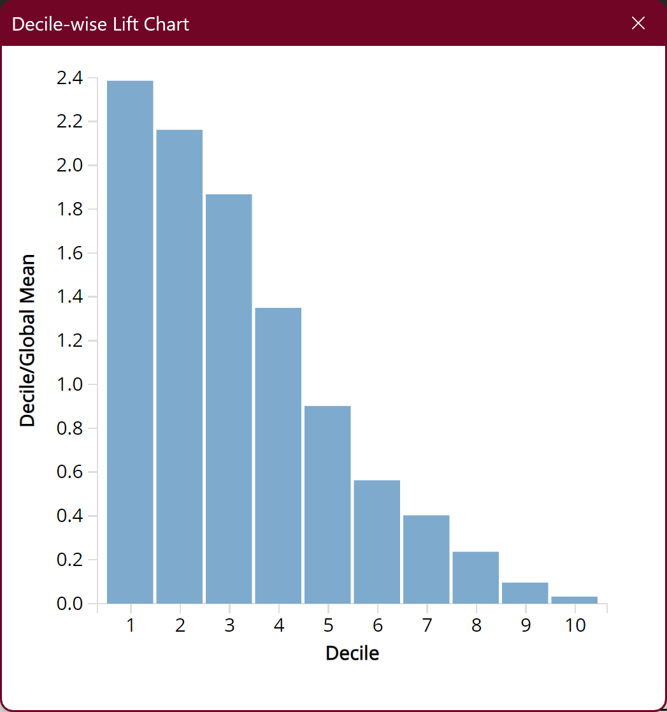

---
aliases:
  - COMP 1942 Project Phase 3 Final Report
  - Final Report
tags:
  - by/self
  - date/2024/04/15/from
  - date/2024/04/16/to
  - functional/text
  - language/in/English
---

# Final Report

COMP 1942 Project Phase 3

- Authors: Group 69, xxsuoaa, yslaiaf

## Preprocessing

First, we open the workbook containing the data with headers.

Then, we format both the training data and the test data as a table using the Excel function "Format as Table".

1. Select the entire training data table, including the headers.
2. Find and press "Format as Table", then select any colors.
3. Check "My table contains headers" if it is not checked initially, then click "OK".
4. Do the same for the entire test data table.

Next, one of the discrete variable, `native-country`, has more than 30 distinct values. In particular, the training table has 41 distinct values while the test table has 40 distinct values. This is too many categories for our version of XLMiner to process.

From here on, do not touch the test table.

Before we reduce the number of categories, we need to sort the training table by `native-country` in ascending order. This is so that the frequency of the distinct values are somewhat randomized. We also need to record the original distinct values:

1. Create a new sheet named `native-country`.
2. Set value in `A1` as `key`, set value in `B1` as `value`.
3. Set formula in `A2` as `=UNIQUE(training!$M$2:$M$10001)`.
4. Copy `A2:A42`, and then paste (hover over "paste special" and click "values") at the same range. Afterwards, the range should not have any formulas.
5. Format `A1:B42` as a table using "Format as Table".

We need to use the "Reduce Categories" function of XLMiner. However, this function is also limited to 30 distinct values, so instead we need to do 2 passes for the training table. For each pass, perform the following steps:

1. Press on "Reduce Categories".
2. Configure the settings as in Figure 1. In particular, the settings needs to be changed are:
    - Data Range: `A2:N1056` for the 1st pass, `A1057:N10001` for the 2nd pass
    - First row contains headers: `false`
    - Category Variable: Ignore the option values. Choose the 13th option in the dropdown.
    - Limit number of categories to: `15`
    - Others: Check that the number of distinct values in the "Category Variables" table is 21 for the 1st pass and 20 for the 2nd pass.
3. Press on "Apply", and then "OK".
4. A summary sheet will be generated. Copy and paste (paste options: values) the transformed `native-country` column back into the `training` sheet at `O(start row):O(end row)`. Do not copy the meaningless headers.
5. For the 2nd pass of the training table, we additionally need to increment each `native-country` value by 15. This makes the processed `native-country` values unique from that of the 1st pass. This can be done by:
    1. Set `P(start row)` to `=$O(start row)+15`.
    2. Extend `P(start row)` to `P(start row):P(end row)`.
    3. Copy `P(start row):P(end row)`.
    4. Paste (paste options: values) at `O(start row):O(end row)`.
    5. Clear `P(start row):P(end row)`.

> 
>
> __Figure 1__

After that, we need to fill in the `native-country` string-to-number mappings in the `native-country` sheet.training table, fill in the mappings. We can do so easily:

1. Set `B2` to `=VLOOKUP($A2,training!$M$2:$O$10001,3,TRUE)`.
2. Extend `B2` to `B2:B42`.
3. Copy `B2:B42`, and then paste (paste options: values) at the same range. Afterwards, the range should not have any formulas.

For reference, our mapping is:

| key                        | value |
|----------------------------|-------|
| Cambodia                   | 15    |
| Canada                     | 3     |
| China                      | 7     |
| Columbia                   | 9     |
| Cuba                       | 5     |
| Dominican-Republic         | 10    |
| Ecuador                    | 14    |
| El-Salvador                | 4     |
| England                    | 6     |
| France                     | 15    |
| Germany                    | 1     |
| Greece                     | 13    |
| Guatemala                  | 8     |
| Haiti                      | 11    |
| Holand-Netherlands         | 15    |
| Honduras                   | 15    |
| Hong                       | 15    |
| Hungary                    | 15    |
| India                      | 2     |
| Iran                       | 12    |
| Ireland                    | 15    |
| Italy                      | 22    |
| Jamaica                    | 21    |
| Japan                      | 23    |
| Laos                       | 30    |
| Mexico                     | 17    |
| Nicaragua                  | 29    |
| Outlying-US(Guam-USVI-etc) | 30    |
| Peru                       | 28    |
| Philippines                | 18    |
| Poland                     | 25    |
| Portugal                   | 26    |
| Puerto-Rico                | 19    |
| Scotland                   | 30    |
| South                      | 20    |
| Taiwan                     | 27    |
| Thailand                   | 30    |
| Trinadad&Tobago            | 30    |
| United-States              | 16    |
| Vietnam                    | 24    |
| Yugoslavia                 | 30    |

Afterwards, in the `training` sheet, cut and paste `O2:O10001` to `M2:M10001`.

Now we can finally touch the test table. Map the `native-country` column of the test table. To do so:

1. Set `N2` to `=VLOOKUP($M2,'native-country'!$A$2:$B$42,2,TRUE)`.
2. Extend `N2` to `N2:N8001`.
3. Copy `N2:N8001`, and then paste (paste options: values) at `M2:M8001`.
4. Clear `N2:N8001`.

Finally, sort both tables by all columns, left columns first. This can be done by starting with the rightmost column and sort by ascending. Then, go to the column on the immediate left and sort by ascending. Repeat this until the leftmost column is reached and sorted by ascending. Save the resulting workbook as `preprocessed.xlsx`.

For reference, see `preprocessed.xlsx`.

## Models

We will be testing 5 models. All models below use `preprocessed.xlsx` as the source workbook. For reference, the trained models are available as `model1.xlsx`, `model2.xlsx`, etc.

### Model 1: _k_-Nearest Neighbors

Note that we only use continuous variables here. This is because _k_-nearest neighbors uses distance for classification, and distance cannot be meaningfully defined for discrete variables.

Press on "Data Science > Classify > _k_-Nearest Neighbors". Then, configure the model as follows:

| Data                             |                   |
|----------------------------------|-------------------|
| Workbook                         | model1.xlsx       |
| Worksheet                        | training          |
| Data Range                       | \$A\$1:\$N\$10001 |
| Partitioning Method              | Random Partition  |
| Seed Value                       | 12345             |
| # Records in the training data   | 6000              |
| # Records in the validation data | 4000              |

| Variables             |                                                                |
|-----------------------|----------------------------------------------------------------|
| # Variables           | 6                                                              |
| Scale Variables       | age, education-num, capital-gain, capital-loss, hours-per-week |
| Output Variable       | income                                                         |

| Rescaling: Fitting Parameters |                 |
|-------------------------------|-----------------|
| Rescale Data?                 | TRUE            |
| Technique                     | STANDARDIZATION |

| Nearest-Neighbors: Fitting Parameters |    |
|---------------------------------------|----|
| # Nearest neighbors (K)               | 10 |

| Nearest-Neighbors Classification: Fitting Parameters |           |
|------------------------------------------------------|-----------|
| Prior Probability Calculation                        | EMPIRICAL |

| Nearest-Neighbors Classification: Model Parameters |      |
|----------------------------------------------------|------|
| # Classes                                          | 2    |
| Success Class                                      | >50K |
| Success Probability                                | 0.5  |

| Nearest-Neighbors: Reporting Parameters |       |
|-----------------------------------------|-------|
| Search for best K?                      | FALSE |

| Output Options                                |
|-----------------------------------------------|
| Summary report of scoring on training data    |
| Detailed report of scoring on training data   |
| Lift charts on training data                  |
| Frequency chart on training data              |
| Summary report of scoring on validation data  |
| Detailed report of scoring on validation data |
| Lift charts on validation data                |
| Frequency chart on validation data            |

### Model 2: Classification Tree

Before we can use the classification tree model, note that the model in XLMiner requires distinct variables to have 15 or fewer distinct values. Unfortunately, the `native-country` column has 30 distinct values. To fix this, we need to use the "Reduce Categories" function of XLMiner:

1. Press on "Reduce Categories".
2. Configure the settings as in Figure 1. In particular, the settings needs to be changed are:
    - Data Range: `A1:N10001`
    - First row contains headers: `true`
    - Category Variable: `native-country`
    - Limit number of categories to: `15`
3. Press on "Apply", and then "OK".
4. A summary sheet will be generated. Copy and paste (paste options: values) the transformed table back into the `training` sheet at `A2:N10001`. Do not copy the headers.

After doing so, we can finally use the classification tree model.

Note that we do not use the `education` column because `education-num` is the continuous version of `education`, so we only need to choose one of them.

Press on "Data Science > Classify > Classification Tree". Then, configure the model as follows:

| Data                             |                   |
|----------------------------------|-------------------|
| Workbook                         | model2.xlsx       |
| Worksheet                        | training          |
| Data Range                       | \$A\$1:\$N\$10001 |
| Partitioning Method              | Random Partition  |
| Seed Value                       | 12345             |
| # Records in the training data   | 6000              |
| # Records in the validation data | 4000              |

| Variables             |                                                                                |
|-----------------------|--------------------------------------------------------------------------------|
| # Variables           | 12                                                                             |
| Scale Variables       | age, education-num, capital-gain, capital-loss, hours-per-week                 |
| Categorical Variables | workclass, marital-status, occupation, relationship, race, sex, native-country |
| Output Variable       | income                                                                         |

| Rescaling: Fitting Parameters |                 |
|-------------------------------|-----------------|
| Rescale Data?                 | TRUE            |
| Technique                     | STANDARDIZATION |

| Decision Tree Classification: Fitting Parameters |           |
|--------------------------------------------------|-----------|
| Prior Probability Calculation                    | EMPIRICAL |

| Decision Tree: Model Parameters |             |
|---------------------------------|-------------|
| Prune?                          | TRUE        |
| Scoring tree type               | Best pruned |

| Decision Tree Classification: Model Parameters |      |
|------------------------------------------------|------|
| # Classes                                      | 2    |
| Success Class                                  | >50K |
| Success Probability                            | 0.5  |

| Decision Tree: Reporting Parameters |                                     |
|-------------------------------------|-------------------------------------|
| Trees to draw                       | Fully grown, Best pruned, Min error |
| # Max level to display              | 7                                   |
| Show feature importance?            | TRUE                                |

| Output Options                                |
|-----------------------------------------------|
| Summary report of scoring on training data    |
| Detailed report of scoring on training data   |
| Lift charts on training data                  |
| Frequency chart on training data              |
| Summary report of scoring on validation data  |
| Detailed report of scoring on validation data |
| Lift charts on validation data                |
| Frequency chart on validation data            |

### Model 3: Naive Bayes

Note that we do not use the `education` column because `education-num` is the continuous version of `education`, so we only need to choose one of them.

Also note that naive bayes classifiers require each distinct value to appear at least once in the training data. Therefore, we do not partition the training–validation data into training data and validation data. The entire training–validation data is not large enough to ensure all possible distinct values appear in the training data at least once.

For the same reason as above, the columns `capital-gain`, `capital-loss`, and `hours-per-week` are not used, as the continuous variables have too many possible distinct values. Unfortunately, while naive bayes can handle continuous variables using Gaussian naive bayes, this is not implemented in XLMiner. The continuous variable `age` is still used because the training data is comprehensive enough to cover all possible distinct values in the test data, save for 1 distinct value, which is 88. There is only one test data point, the 7986th test data point, with the age 88. Thus, for that one data point, we will replace the `#N/A` prediction value with `<=50k`, as `<=50k` is the majority in the training data.

Press on "Data Science > Classify > Naive Bayes". Then, configure the model as follows:

| Data       |                   |
|------------|-------------------|
| Workbook   | model3.xlsx       |
| Worksheet  | training          |
| Data Range | \$A\$1:\$N\$10001 |
| # Records  | 10000             |

| Variables       |                                                                                                    |
|-----------------|----------------------------------------------------------------------------------------------------|
| # Variables     | 9                                                                                                  |
| Scale Variables | age, workclass, education-num, martial-status, occupation, relationship, race, sex, native-country |
| Output Variable | income                                                                                             |

| Naive Bayes: Fitting Parameters |           |
|---------------------------------|-----------|
| Laplace smoothing               | TRUE      |
| Smoothing alpha                 | 1         |
| Prior Probability Calculation   | EMPIRICAL |

| Naive Bayes: Model Parameters |      |
|-------------------------------|------|
| # Classes                     | 2    |
| Success Classes               | >50K |
| Success Probability           | 0.5  |

| Naive Bayes: Reporting Parameters   |      |
|-------------------------------------|------|
| Show prior conditional probability  | TRUE |
| Show log-density                    | TRUE |  

| Output Options                              |
|---------------------------------------------|
| Summary report of scoring on training data  |
| Detailed report of scoring on training data |
| Lift charts on training data                |
| Frequency chart on training data            |

### Model 4: Neural Network

Note that we do not use the `education` column because `education-num` is the continuous version of `education`, so we only need to choose one of them.

Press on "Data Science > Classify > Neural Network > Manual Network". Then, configure the model as follows:

| Data                             |                   |
|----------------------------------|-------------------|
| Workbook                         | model4.xlsx       |
| Worksheet                        | training          |
| Data Range                       | \$A\$1:\$N\$10001 |
| Partitioning Method              | Random Partition  |
| Seed Value                       | 12345             |
| # Records in the training data   | 6000              |
| # Records in the validation data | 4000              |

| Variables             |                                                                    |
|-----------------------|--------------------------------------------------------------------|
| # Variables           | 12                                                                 |
| Scale Variables       | age, education-num, capital-gain, capital-loss, hours-per-week     |
| Categorical Variables | workclass, martial-status, relationship, race, sex, native-country |
| Output Variable       | income                                                             |

| Rescaling: Fitting Parameters |                 |
|-------------------------------|-----------------|
| Rescale Data?                 | TRUE            |
| Technique                     | STANDARDIZATION |

| Neural Network: Fitting Parameters                      |               |
|---------------------------------------------------------|---------------|
| Random seed for initial weights                         | 12345         |
| # Hidden Layers                                         | 0             |
| Learning rate                                           | 0.1           |
| Weight change momentum                                  | 0.6           |
| Error tolerance                                         | 0.01          |
| Weight decay                                            | 0             |
| Cost function                                           | Cross Entropy |
| Hidden layer activation function                        | ReLU          |
| Output layer activation function                        | SOFTMAX       |
| Learning order                                          | Random        |
| Learning order: random seed                             | 12345         |
| Response correction                                     | 0.01          |
| Data for error computation                              | TRAINING ONLY |
| Maximum number of epochs                                | 1000          |
| Maximum number of epochs without improvement            | 5             |
| Maximum training time                                   | 3600          |
| Minimum relative change in error                        | 0.0001        |
| Minimum relative change in error compared to null model | 0.001         |

| Neural Network Classification: Fitting Parameters |           |
|---------------------------------------------------|-----------|
| Prior Probability Calculation                     | EMPIRICAL |

| Neural Network Classification: Model Parameters |      |
|-------------------------------------------------|------|
| # Classes                                       | 2    |
| Success Class                                   | >50K |
| Success Probability                             | 0.5  |

| Neural Network: Reporting Parameters |       |
|--------------------------------------|-------|
| Search for best architecture         | FALSE |
| Show neural network weights?         | TRUE  |

| Output Options                                |
|-----------------------------------------------|
| Summary report of scoring on training data    |
| Detailed report of scoring on training data   |
| Lift charts on training data                  |
| Frequency chart on training data              |
| Summary report of scoring on validation data  |
| Detailed report of scoring on validation data |
| Lift charts on validation data                |
| Frequency chart on validation data            |

### Model 5: Neural Network

The difference between this model and [model 4](#Model%204%20Neural%20Network) is that this model has an additional hidden layer of 64 neurons. We want to see if the hidden layer can improve the accuracy of the model.

Note that we do not use the `education` column because `education-num` is the continuous version of `education`, so we only need to choose one of them.

Press on "Data Science > Classify > Neural Network > Manual Network". Then, configure the model as follows:

| Data                             |                   |
|----------------------------------|-------------------|
| Workbook                         | model5.xlsx       |
| Worksheet                        | training          |
| Data Range                       | \$A\$1:\$N\$10001 |
| Partitioning Method              | Random Partition  |
| Seed Value                       | 12345             |
| # Records in the training data   | 6000              |
| # Records in the validation data | 4000              |

| Variables             |                                                                    |
|-----------------------|--------------------------------------------------------------------|
| # Variables           | 12                                                                 |
| Scale Variables       | age, education-num, capital-gain, capital-loss, hours-per-week     |
| Categorical Variables | workclass, martial-status, relationship, race, sex, native-country |
| Output Variable       | income                                                             |

| Rescaling: Fitting Parameters |                 |
|-------------------------------|-----------------|
| Rescale Data?                 | TRUE            |
| Technique                     | STANDARDIZATION |

| Neural Network: Fitting Parameters                      |               |
|---------------------------------------------------------|---------------|
| Random seed for initial weights                         | 12345         |
| # Hidden Layers                                         | 1             |
| # Nodes in Hidden Layer 1                               | 64            |
| Learning rate                                           | 0.1           |
| Weight change momentum                                  | 0.6           |
| Error tolerance                                         | 0.01          |
| Weight decay                                            | 0             |
| Cost function                                           | Cross Entropy |
| Hidden layer activation function                        | ReLU          |
| Output layer activation function                        | SOFTMAX       |
| Learning order                                          | Random        |
| Learning order: random seed                             | 12345         |
| Response correction                                     | 0.01          |
| Data for error computation                              | TRAINING ONLY |
| Maximum number of epochs                                | 1000          |
| Maximum number of epochs without improvement            | 5             |
| Maximum training time                                   | 3600          |
| Minimum relative change in error                        | 0.0001        |
| Minimum relative change in error compared to null model | 0.001         |

| Neural Network Classification: Fitting Parameters |           |
|---------------------------------------------------|-----------|
| Prior Probability Calculation                     | EMPIRICAL |

| Neural Network Classification: Model Parameters |      |
|-------------------------------------------------|------|
| # Classes                                       | 2    |
| Success Class                                   | >50K |
| Success Probability                             | 0.5  |

| Neural Network: Reporting Parameters |       |
|--------------------------------------|-------|
| Search for best architecture         | FALSE |
| Show neural network weights?         | TRUE  |

| Output Options                                |
|-----------------------------------------------|
| Summary report of scoring on training data    |
| Detailed report of scoring on training data   |
| Lift charts on training data                  |
| Frequency chart on training data              |
| Summary report of scoring on validation data  |
| Detailed report of scoring on validation data |
| Lift charts on validation data                |
| Frequency chart on validation data            |

## Results

After training the models above, we can validate the model by checking its performance on both the training dataset and the validation dataset. For all models except for model 3, the validation dataset is obtained from randomly selecting 40% of the initial training–validation dataset.

For reference, the trained models and results are available as `model1.xlsx`, `model2.xlsx`, etc.

### Model 1

The training–validation dataset (10000 data) is randomly split into a training dataset (6000 data) and a validation dataset (4000 data).

#### Model 1: Training

These are the results of the model on the training dataset.

Confusion matrix is as follows:

| __Actual\Predicted__ | __<=50K__ | __>50K__ |
| -------------------- | --------- | -------- |
| __<=50K__            | 3088      | 570      |
| __>50K__             | 551       | 1791     |

Error report is as follows:

| __Class__   | __# Cases__ | __# Errors__ | __% Error__ |
| ----------- | ----------- | ------------ | ----------- |
| __<=50K__   | 3658        | 570          | 15.5822854  |
| __>50K__    | 2342        | 551          | 23.52690009 |
| __Overall__ | 6000        | 1121         | 18.68333333 |

Metrics are as follows:

| __Metric__               | __Value__   |
| ------------------------ | ----------- |
| __Accuracy (#correct)__  | 4879        |
| __Accuracy (%correct)__  | 81.31666667 |
| __Specificity__          | 0.844177146 |
| __Sensitivity (Recall)__ | 0.764730999 |
| __Precision__            | 0.758576874 |
| __F1 score__             | 0.761641505 |
| __Success Class__        | >50K        |
| __Success Probability__  | 0.5         |

The lift charts are as follows:

| __Lift Chart__                                                       | __Decile-wise Lift Chart__                                                         |
| -------------------------------------------------------------------- | ---------------------------------------------------------------------------------- |
|  |  |

#### Model 1: Validation

These are the results of the model on the validation dataset.

Confusion matrix is as follows:

| __Actual\Predicted__ | __<=50K__ | __>50K__ |
| -------------------- | --------- | -------- |
| __<=50K__            | 1996      | 441      |
| __>50K__             | 469       | 1094     |

Error report is as follows:

| __Class__   | __# Cases__ | __# Errors__ | __% Error__ |
| ----------- | ----------- | ------------ | ----------- |
| __<=50K__   | 2437        | 441          | 18.0960197  |
| __>50K__    | 1563        | 469          | 30.00639795 |
| __Overall__ | 4000        | 910          | 22.75       |

Metrics are as follows:

| __Metric__               | __Value__   |
| ------------------------ | ----------- |
| __Accuracy (#correct)__  | 3090        |
| __Accuracy (%correct)__  | 77.25       |
| __Specificity__          | 0.819039803 |
| __Sensitivity (Recall)__ | 0.69993602  |
| __Precision__            | 0.712703583 |
| __F1 score__             | 0.706262105 |
| __Success Class__        | >50K        |
| __Success Probability__  | 0.5         |

The lift charts are as follows:

| __Lift Chart__                                                           | __Decile-wise Lift Chart__                                                             |
| ------------------------------------------------------------------------ | -------------------------------------------------------------------------------------- |
|  |  |

#### Model 1: Importance

TODO

#### Model 1: Conclusion

The accuracy drops from 81.3% in the training dataset to 77.25% in the validation dataset. This is rather significant compared to other models, as we will see later. It shows that _k_-nearest neighbors is inferior at generalizing to new data.

Specifically, we can observe both its specificity (84.4% to 81.9%) and sensitivity (76.4% to 70.0%) drops significantly. This shows _k_-nearest neighbors is inferior at predicting both `<=50k` and `>50k` for unseen data.

The above makes sense if you consider that _k_-nearest neighbors does prediction by looking at the _k_-nearest data points in the training dataset. If a data point is new, it might be very far away from any data points in the training dataset, so predicting such a data point would be inaccurate. So it makes sense that _k_-nearest neighbors is inferior at predicting new data.

### Model 2

The training–validation dataset (10000 data) is randomly split into a training dataset (6000 data) and a validation dataset (4000 data).

#### Model 2: Training

These are the results of the model on the training dataset.

Confusion matrix is as follows:

| __Actual\Predicted__ | __<=50K__ | __>50K__ |
| -------------------- | --------- | -------- |
| __<=50K__            | 3296      | 362      |
| __>50K__             | 706       | 1636     |

Error report is as follows:

| __Class__   | __# Cases__ | __# Errors__ | __% Error__ |
| ----------- | ----------- | ------------ | ----------- |
| __<=50K__   | 3658        | 362          | 9.896118097 |
| __>50K__    | 2342        | 706          | 30.14517506 |
| __Overall__ | 6000        | 1068         | 17.8        |

Metrics are as follows:

| __Metric__               | __Value__   |
| ------------------------ | ----------- |
| __Accuracy (#correct)__  | 4932        |
| __Accuracy (%correct)__  | 82.2        |
| __Specificity__          | 0.901038819 |
| __Sensitivity (Recall)__ | 0.698548249 |
| __Precision__            | 0.818818819 |
| __F1 score__             | 0.753917051 |
| __Success Class__        | >50K        |
| __Success Probability__  | 0.5         |

The lift charts are as follows:

| __Lift Chart__                                                       | __Decile-wise Lift Chart__                                                         |
| -------------------------------------------------------------------- | ---------------------------------------------------------------------------------- |
|  |  |

#### Model 2: Validation

These are the results of the model on the validation dataset.

Confusion matrix is as follows:

| __Actual\Predicted__ | __<=50K__ | __>50K__ |
| -------------------- | --------- | -------- |
| __<=50K__            | 2186      | 251      |
| __>50K__             | 519       | 1044     |

Error report is as follows:

| __Class__   | __# Cases__ | __# Errors__ | __% Error__ |
| ----------- | ----------- | ------------ | ----------- |
| __<=50K__   | 2437        | 251          | 10.29954863 |
| __>50K__    | 1563        | 519          | 33.20537428 |
| __Overall__ | 4000        | 770          | 19.25       |

Metrics are as follows:

| __Metric__               | __Value__   |
| ------------------------ | ----------- |
| __Accuracy (#correct)__  | 3230        |
| __Accuracy (%correct)__  | 80.75       |
| __Specificity__          | 0.897004514 |
| __Sensitivity (Recall)__ | 0.667946257 |
| __Precision__            | 0.806177606 |
| __F1 score__             | 0.730580826 |
| __Success Class__        | >50K        |
| __Success Probability__  | 0.5         |

The lift charts are as follows:

| __Lift Chart__                                                           | __Decile-wise Lift Chart__                                                             |
| ------------------------------------------------------------------------ | -------------------------------------------------------------------------------------- |
|  |  |

#### Model 2: Importance

In this model, we are using the best pruned tree. This makes the decision tree small enough so we can explain it very easily. Below is the decision tree:

> 
>
> __Model 2: Decision Tree__
>
> - Decision nodes with numbers: Go left if the attribute is smaller than the value, otherwise go right.
> - `relationship` (root): Go left if in {Not-in-family, Other-relative, Own-child, Unmarried}; otherwise go right.
> - `occupation` (root->right): Go left if in {Adm-clerical, Armed-Forces, Exec-managerial, Prof-specialty, Protective-serv, Sales, Tech-support}; otherwise go right.
> - `native country` (root->right->left->right): Go left if in {1, 3, 14}; otherwise go right.
> - `native country` (root->right->left->left->left): Go left if in {1, 10, 12, 8}; otherwise go right.

TODO

#### Model 2: Conclusion

TODO

### Model 3

The training–validation dataset (10000 data) is not split. That means the dataset is used simultaneously for training and validation. The rationale is already explained in [§ Model 3 Naive Bayes](#Model%203%20Naive%20Bayes).

#### Model 3: Training–Validation

These are the results of the model on the training–validation dataset.

Confusion matrix is as follows:

| __Actual\Predicted__ | __<=50K__ | __>50K__ |
| -------------------- | --------- | -------- |
| __<=50K__            | 4653      | 1442     |
| __>50K__             | 818       | 3087     |

Error report is as follows:

| __Class__   | __# Cases__ | __# Errors__ | __% Error__ |
| ----------- | ----------- | ------------ | ----------- |
| __<=50K__   | 6095        | 1442         | 23.65873667 |
| __>50K__    | 3905        | 818          | 20.9475032  |
| __Overall__ | 10000       | 2260         | 22.6        |

Metrics are as follows:

| __Metric__               | __Value__   |
| ------------------------ | ----------- |
| __Accuracy (#correct)__  | 7740        |
| __Accuracy (%correct)__  | 77.4        |
| __Specificity__          | 0.763412633 |
| __Sensitivity (Recall)__ | 0.790524968 |
| __Precision__            | 0.681607419 |
| __F1 score__             | 0.732036993 |
| __Success Class__        | >50K        |
| __Success Probability__  | 0.5         |

The lift charts are as follows:

| __Lift Chart__                                                                             | __Decile-wise Lift Chart__                                                                               |
| ------------------------------------------------------------------------------------------ | -------------------------------------------------------------------------------------------------------- |
|  |  |

#### Model 3: Importance

TODO

#### Model 3: Conclusion

TODO

### Model 4

The training–validation dataset (10000 data) is randomly split into a training dataset (6000 data) and a validation dataset (4000 data).

#### Model 4: Training

These are the results of the model on the training dataset.

Confusion matrix is as follows:

| __Actual\Predicted__ | __<=50K__ | __>50K__ |
| -------------------- | --------- | -------- |
| __<=50K__            | 3144      | 514      |
| __>50K__             | 625       | 1717     |

Error report is as follows:

| __Class__   | __# Cases__ | __# Errors__ | __% Error__ |
| ----------- | ----------- | ------------ | ----------- |
| __<=50K__   | 3658        | 514          | 14.0513942  |
| __>50K__    | 2342        | 625          | 26.68659266 |
| __Overall__ | 6000        | 1139         | 18.98333333 |

Metrics are as follows:

| __Metric__               | __Value__   |
| ------------------------ | ----------- |
| __Accuracy (#correct)__  | 4861        |
| __Accuracy (%correct)__  | 81.01666667 |
| __Specificity__          | 0.859486058 |
| __Sensitivity (Recall)__ | 0.733134073 |
| __Precision__            | 0.76961004  |
| __F1 score__             | 0.750929368 |
| __Success Class__        | >50K        |
| __Success Probability__  | 0.5         |

The lift charts are as follows:

| __Lift Chart__                                                          | __Decile-wise Lift Chart__                                                            |
| ----------------------------------------------------------------------- | ------------------------------------------------------------------------------------- |
|  |  |

#### Model 4: Validation

These are the results of the model on the validation dataset.

Confusion matrix is as follows:

| __Actual\Predicted__ | __<=50K__ | __>50K__ |
| -------------------- | --------- | -------- |
| __<=50K__            | 2088      | 349      |
| __>50K__             | 414       | 1149     |

Error report is as follows:

| __Class__   | __# Cases__ | __# Errors__ | __% Error__ |
| ----------- | ----------- | ------------ | ----------- |
| __<=50K__   | 2437        | 349          | 14.32088634 |
| __>50K__    | 1563        | 414          | 26.48752399 |
| __Overall__ | 4000        | 763          | 19.075      |

Metrics are as follows:

| __Metric__               | __Value__   |
| ------------------------ | ----------- |
| __Accuracy (#correct)__  | 3237        |
| __Accuracy (%correct)__  | 80.925      |
| __Specificity__          | 0.856791137 |
| __Sensitivity (Recall)__ | 0.73512476  |
| __Precision__            | 0.767022697 |
| __F1 score__             | 0.750735054 |
| __Success Class__        | >50K        |
| __Success Probability__  | 0.5         |

The lift charts are as follows:

| __Lift Chart__                                                           | __Decile-wise Lift Chart__                                                             |
| ------------------------------------------------------------------------ | -------------------------------------------------------------------------------------- |
|  |  |

#### Model 4: Importance

TODO

#### Model 4: Conclusion

TODO

### Model 5

The training–validation dataset (10000 data) is randomly split into a training dataset (6000 data) and a validation dataset (4000 data).

#### Model 5: Training

These are the results of the model on the training dataset.

Confusion matrix is as follows:

| __Actual\Predicted__ | __<=50K__ | __>50K__ |
| -------------------- | --------- | -------- |
| __<=50K__            | 3151      | 507      |
| __>50K__             | 574       | 1768     |

Error report is as follows:

| __Class__   | __# Cases__ | __# Errors__ | __% Error__ |
| ----------- | ----------- | ------------ | ----------- |
| __<=50K__   | 3658        | 507          | 13.8600328  |
| __>50K__    | 2342        | 574          | 24.5089667  |
| __Overall__ | 6000        | 1081         | 18.01666667 |

Metrics are as follows:

| __Metric__               | __Value__   |
| ------------------------ | ----------- |
| __Accuracy (#correct)__  | 4919        |
| __Accuracy (%correct)__  | 81.98333333 |
| __Specificity__          | 0.861399672 |
| __Sensitivity (Recall)__ | 0.754910333 |
| __Precision__            | 0.777142857 |
| __F1 score__             | 0.76586528  |
| __Success Class__        | >50K        |
| __Success Probability__  | 0.5         |

The lift charts are as follows:

| __Lift Chart__                                                       | __Decile-wise Lift Chart__                                                         |
| -------------------------------------------------------------------- | ---------------------------------------------------------------------------------- |
|  |  |

#### Model 5: Validation

These are the results of the model on the validation dataset.

Confusion matrix is as follows:

| __Actual\Predicted__ | __<=50K__ | __>50K__ |
| -------------------- | --------- | -------- |
| __<=50K__            | 2105      | 332      |
| __>50K__             | 400       | 1163     |

Error report is as follows:

| __Class__   | __# Cases__ | __# Errors__ | __% Error__ |
| ----------- | ----------- | ------------ | ----------- |
| __<=50K__   | 2437        | 332          | 13.62330735 |
| __>50K__    | 1563        | 400          | 25.59181062 |
| __Overall__ | 4000        | 732          | 18.3        |

Metrics are as follows:

| __Metric__               | __Value__   |
| ------------------------ | ----------- |
| __Accuracy (#correct)__  | 3268        |
| __Accuracy (%correct)__  | 81.7        |
| __Specificity__          | 0.863766927 |
| __Sensitivity (Recall)__ | 0.744081894 |
| __Precision__            | 0.777926421 |
| __F1 score__             | 0.760627861 |
| __Success Class__        | >50K        |
| __Success Probability__  | 0.5         |

The lift charts are as follows:

| __Lift Chart__                                                           | __Decile-wise Lift Chart__                                                             |
| ------------------------------------------------------------------------ | -------------------------------------------------------------------------------------- |
|  |  |

#### Model 5: Importance

TODO

#### Model 5: Conclusion

TODO

## Conclusion

TODO

## End of Report
