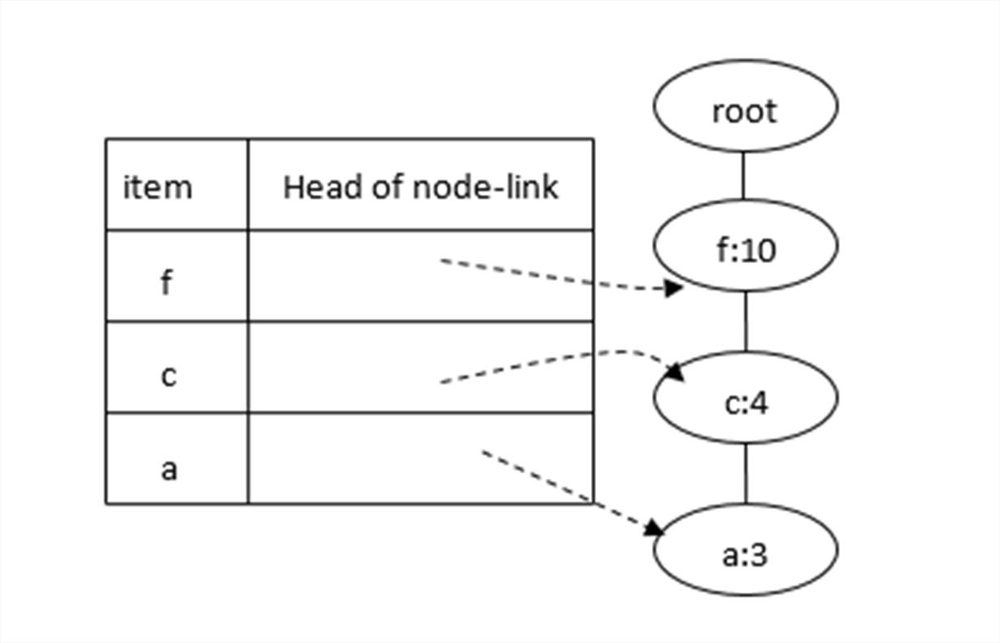
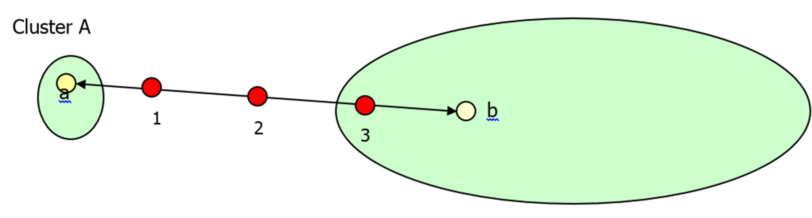

---
aliases:
  - COMP 1942
  - COMP 1942 question
  - COMP 1942 questions
  - COMP1942
  - COMP1942 question
  - COMP1942 questions
  - HKUST COMP 1942
  - HKUST COMP 1942 question
  - HKUST COMP 1942 questions
  - HKUST COMP1942
  - HKUST COMP1942 question
  - HKUST COMP1942 questions
tags:
  - flashcard/active/special/academia/HKUST/COMP_1942/questions
  - language/in/English
---

# questions

- HKUST COMP 1942

## 2024-02-05

> Q1. Is the following statement correct?
>
> The support of rule “{A, B}→ C” is defined to be the total number of transactions containing A, B or C.
>
> 1. Yes
> 2. No
>
> - solution: {@{2}@} <!--SR:!2025-05-02,261,330-->

## 2024-02-07

> Q1. If supp({B, C}) >= 3, then is it true that “supp({B}) >= 3”?
>
> 1. Yes
> 2. No
>
> - solution: {@{1}@} <!--SR:!2025-04-04,239,330-->

## 2024-02-14

> Q1. Suppose that we know that L4 = { {A, B, C, D}, {A, B, C, E}, {A, B, C, F}, … }.  
> Consider that we want to generate frequent 5-itemsets in Apriori approach.  
> In the join step, is it true that {A, B, C, D, E} is in C4?
>
> 1. Yes
> 2. No
>
> - solution: {@{1}@} <!--SR:!2025-03-02,197,310-->

## 2024-02-19

> Q1.Is it true that the total number of non-root nodes in the FP-tree is smaller than or equal to the total number of occurrences of frequent items in the dataset?
>
> 1. Yes
> 2. No
>
> - solution: {@{1}@} <!--SR:!2025-06-02,251,290-->

## 2024-02-21

> Q1. Suppose that we are given the following conditional FP-tree on item “b”. We are also given a support threshold = 2 and the support of “b” is 15. In the lecture notes, we perform Step 1 and Step 2 to generate frequent patterns. According to these 2 steps, how many frequent itemsets (including item “b”) can we generate?
>
> 
>
> 1. 3
> 2. 4
> 3. 5
> 4. 7
> 5. 8
>
> - solution: {@{5}@} <!--SR:!2025-04-18,249,330-->

## 2024-02-26

> Q1. In our lecture, we learnt that we could use the “average distance between a point and its closest mean” as a good measurement to determine whether we can find a “good” clustering result?  
> Do you think that the “sum of the squares of the distances between a point and its closest mean” is another good measurement to determine whether we can find a “good” clustering result?
>
> 1. Yes
> 2. No
>
> - solution: {@{1}@} <!--SR:!2025-04-20,251,330-->

## 2024-02-28

> Q1.  Suppose that Raymond used XLMiner to run the k-means clustering method with some clustering setting (e.g., number of clusters is set to 2) but the seed is set to 1942 and the number of starts is set to 1.
>
> Suppose that you used XLMiner to run the k-means clustering method with the same clustering setting and you also set the seed to 1942 and the number of starts to 1.
>
> Is it always true that the clustering result from Raymond is exactly the same as the clustering result from you?
>
> 1. Yes
> 2. No
>
> - solution: {@{1}@} <!--SR:!2025-05-29,282,330-->

## 2024-03-04

> Q1. Consider Cluster A contains 10 points and Cluster B contains 100,000 points. Let a be the mean of Cluster A and b be the mean of Cluster B. When these two clusters are merged to form one cluster, what is the mean of the merged cluster (based on the centroid linkage distance measurement)?
>
> 
>
> 1. Point 1
> 2. Point 2
> 3. Point 3
>
> - solution: {@{3}@} <!--SR:!2025-05-01,260,330-->

## 2024-03-06

> Q1. When you toss a red coin, what do you expect for the outcome of this toss?
>
> 1. Head
> 2. Tail
>
> - solution: {@{1}@} <!--SR:!2025-01-06,158,310-->

<!-- markdownlint MD028 -->

> Q2. When you toss a blue coin, what do you expect for the outcome of this toss?
>
> 1. Head
> 2. Tail
>
> - solution: {@{1 or 2}@} <!--SR:!2025-05-06,265,330-->

<!-- markdownlint MD028 -->

> Q3. Now, you want to play a game to predict the outcome of a coin toss.  
> Suppose that you want to win the game. You could choose a red coin or a blue coin for the game.  
> Which coin do you want to choose for this game?
>
> 1. A red coin
> 2. A blue coin
>
> - solution: {@{1}@} <!--SR:!2026-09-12,634,330-->

## 2024-03-11

> Q1. Consider a decision tree. We measured it and gave the error report of this decision tree.  
> Is it possible to construct the confusion matrix of this decision tree based on this error report only?
>
> 1. Yes
> 2. No
>
> - solution: {@{1}@} <!--SR:!2025-05-24,278,330-->

## 2024-03-13

> Q1. Suppose that we are given a decision tree T generated by XLMiner together with the original table.  
> We also know that the mapping between the original categorial value and the transformed numeric value in each input attribute.  
> Is it possible to draw the decision tree in the lecture notes format according to T?
>
> 1. Yes
> 2. No
>
> - solution: {@{1}@} <!--SR:!2025-03-09,199,310-->

## 2024-03-18

> Q1. On Slide 15 of "10-classification-NaiveBayes.ppt", we predict that the new person will buy an insurance policy without calculating the value of "P(Yes | Race = white, Income=high, Child = no)".  
> Is it possible that we could calculate the value of "P(Yes | Race = white, Income=high, Child = no)"?
>
> 1. Yes
> 2. No
>
> - solution: {@{1}@} <!--SR:!2025-02-27,194,310-->

## 2024-03-20

> Q1. Please read the in-class Exercise 6.
>
> What is the answer of this exercise (i.e., what is the target attribute of this point (5, 2))?
>
> Show Chart
>
> 1. Yes
> 2. No
>
> - solution: {@{1}@} <!--SR:!2025-08-10,312,290-->

## 2024-04-08

> Q1.  What is the name of the instructor of this course?
>
> - solution: {@{(open answer, e.g. "Raymond Wong")}@} <!--SR:!2025-04-27,256,330-->

## 2024-04-10

> Q1. In XLMiner, when we use “Neural Network”, we could set a set X of parameters (e.g., “Number of Epochs = 1000”).  
> In our project, we set parameters of this “Neural Network” with some values (e.g., “Number of Epochs = 1000”). We call this network with these parameter values as M1.  
> We set the same parameters of this “Neural Network” except only one parameter where this time, we set parameter “Number of Epochs” differently (e.g., “Number of Epochs = 2000”).  
> We call this network with these parameter values as M2.  
> In our project, based on the project specification, could we say the following?  
> M1 is one possible data mining model and M2 is another possible data mining model.
>
> 1. Yes
> 2. No
>
> - solution: {@{1}@} <!--SR:!2025-03-24,231,330-->

<!-- markdownlint MD028 -->

> Q2. Consider the following table recording the HK weather over consecutive 4 days.
>
> | Day No. | Sunny? | Humid? | Hot |
> |:------- |:------ |:------ |:--- |
> | 1       | Yes    | Yes    | Yes |
> | 2       | No     | Yes    | Yes |
> | 3       | No     | No     | No  |
> | 4       | No     | Yes    | No  |
>
> Do you think that the above records are dependent on previous records?
>
> 1. Yes
> 2. No
>
> - solution: {@{1}@} <!--SR:!2026-06-01,550,310-->

## 2024-04-15

> Q1. Is it always true that we can calculate the accuracy of a classifier after we know the following?
>
> 1. no. of true positivees,
> 2. no. of true negatives,
> 3. no. of false positives,
> 4. no. of false negatives
>
> <!-- markdownlint MD029 -->
>
> 1. Yes
> 2. No
>
> - solution: {@{1}@} <!--SR:!2025-04-19,250,330-->

## 2024-04-17

> Q1. Suppose that we have 4 points with two dimensions, namely X1 and X2, as follows.
>
> (4.24, 0), (1.41, 0), (-1.41, 0), (1.41, 0)
>
> Suppose that we want to keep only one dimension. Which dimension should we keep?
>
> 1. Dimension X1
> 2. Dimension X2
>
> - choice: {@{1}@} <!--SR:!2025-03-29,235,330-->

<!-- markdownlint MD028 -->

> Q2. Suppose that we have 4 points with two dimensions, namely Y1 and Y2, as follows.
>
> (4.24, 0), (1.41, 1.41), (-1.41, 0), (1.41, -1.41)
>
> Suppose that we want to keep only one dimension. Which dimension should we keep?
>
> 1. Dimension Y1
> 2. Dimension Y2
>
> - solution: {@{1}@} <!--SR:!2026-08-25,620,330-->

## 2024-04-22

> Q1. Consider a table (part, supplier, customer, SP)
>
> Is it possible that we can derive the answer of query (customer) (i.e., the sum of the selling sales for each possible combination of (customer)) from only the answer of query (part, customer) (i.e., the sum of the selling sales for each possible combination of (part, customer))?
>
> 1. Yes
> 2. No
>
> - solution: {@{1}@} <!--SR:!2025-06-14,295,330-->

<!-- markdownlint MD028 -->

> Q2. Consider a table (part, supplier, customer, SP).
>
> Is it possible that we can derive the answer of query (customer) (i.e., the average selling sales for each possible combination of (customer)) from only the answer of query (part, customer) (i.e., the average selling sales for each possible combination of (part, customer))?
>
> 1. Yes
> 2. No
>
> - solution: {@{2}@} <!--SR:!2025-05-19,223,270-->

## 2024-04-24

> Q1. Is it a must that the sum of the values in the final vector in the PageRank algorithm is the number of elements?
>
> 1. Yes
> 2. No
>
> - solution: {@{1}@} <!--SR:!2025-04-08,243,330-->

## 2024-04-29

> Q1. Consider three nodes, namely A, C1 and C2.  
> Node C1 and node C2 are two child nodes of node A in the Bayesian Belief Network.
>
> Is the following true?
>
> P( C1 and C2 | A ) = P( C1 | A ) x P( C2 | A )
>
> 1. Yes
> 2. No
>
> - solution: {@{1}@} <!--SR:!2025-03-22,212,310-->

## 2024-05-06

> Q1. On Slide 17 of “19-otherTopic.ppt”, what is our final decision?
>
> 1. Yes
> 2. No
>
> - solution: {@{1}@} <!--SR:!2025-02-25,193,310-->
