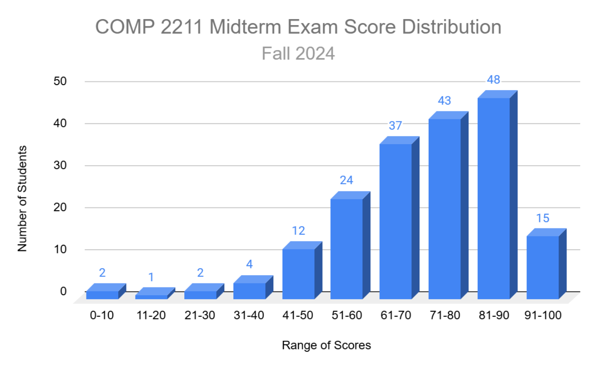
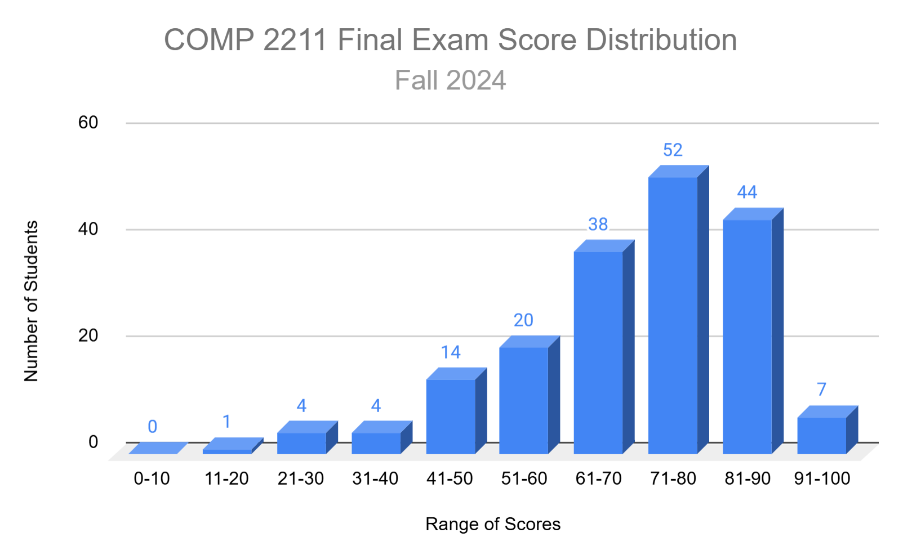

---
aliases:
  - COMP 2211
  - COMP 2211 index
  - COMP2211
  - COMP2211 index
  - Exploring Artificial Intelligence
  - Exploring Artificial Intelligence index
  - HKUST COMP 2211
  - HKUST COMP 2211 index
  - HKUST COMP2211
  - HKUST COMP2211 index
tags:
  - flashcard/active/special/academia/HKUST/COMP_2211/index
  - function/index
  - language/in/English
---

# index

- HKUST COMP 2211
- name: Exploring Artificial Intelligence

The content is in teaching order.

- course logistics
  - labs
    - No labs for the first 2 weeks. Labs start at week 3.
    - format: 60 minute tutorial, 50 minute Q&A session
    - attendance: first 20 minutes
  - marking scheme: 100%
    - coursework: 40%
      - 10 lab exercises: 10%
        - formula: (attendance points + best 4 lab scores from ZINC) / 49 \* 10
      - 2 individual programming assignments: 30%
    - examination: 60%
      - midterm examination: 20%
      - final examination: 40%
  - midterm examination
    - datetime: 2024-10-31T20:00:00+08:00/2024-10-31T22:00:00+08:00, PT2H
    - venue: Lecture Theater A
    - scope
      - introduction to artificial intelligence
      - advanced Python for artificial intelligence
      - naive Bayes classifier
      - k-nearest neighbors
      - k-means clustering
      - artificial neural network - perceptron
      - artificial neural network - multi-layer perceptron (P.16)
  - final examination
- objectives ::@:: gentle introduction to artificial intelligence (AI), technical aspects, historical aspects, social implications, ethical implications, potentials, and limitations of AI <!--SR:!2025-03-22,101,292!2025-05-28,144,292-->
- topics
  - brief history of artificial intelligence
  - search and problem solving
  - knowledge representation
  - probabilistic reasoning
  - machine learning
  - computer vision and image processing
  - speech and language processing
  - robotics
  - social and ethical implications of AI
  - potential and limitations
  - naive Bayes
  - k-nearest neighbour
  - k-means clustering
  - perceptron and multi-layer perceptron
  - fundamentals of image processing
  - convolutional neural networks
  - minimax and alpha-beta pruning
  - artificial intelligence ethics
  - reinforcement learning (self-study)
- other materials
  - 12 self-tests
  - past exam papers: 2022 spring/midterm exam, 2022 spring/final exam

## children

- [questions](questions.md)

## week 1 lecture

- datetime: 2024-09-04T13:30:00+08:00/2024-09-04T14:50:00+08:00
- course logistics
- [artificial intelligence](../../../../general/artificial%20intelligence.md) (AI)  
  - artificial intelligence / definition ::@:: no widely accepted definition <!--SR:!2025-12-18,321,350!2025-10-31,283,350-->
    - artificial intelligence / definition / Alan Turing ::@:: AI is the __science and engineering__ of __making intelligent machines__, especially intelligent computer programs. <!--SR:!2025-12-30,333,350!2025-09-07,225,330-->
  - artificial intelligence / characteristics ::@:: AI borrows characteristics from human intelligence and applies them as algorithms in a computer-friendly way. <!--SR:!2026-01-16,346,350!2026-01-09,340,350-->
  - artificial intelligence / reasons for studying ::@:: AI is versatile (skillful), brighter career, skill of the century <!--SR:!2025-12-25,328,350!2025-09-23,252,332-->
  - artificial intelligence / academic disciplines ::@:: philosophy and cognition science, mathematics, neuroscience, psychology, computer science, linguistics, ... (many, remember some) <!--SR:!2025-08-20,210,330!2025-10-02,259,332-->
  - artificial intelligence / importance ::@:: air transport, banking and finance, computer vision, e-commerce, expert systems (for decision making), gaming and entertainment, healthcare, hiring, logistics, natural language processing, speech recognition, ... (many, remember some) <!--SR:!2025-07-27,203,330!2025-04-27,131,310-->
  - artificial intelligence / commonly confused terms ::@:: artificial intelligence, deep learning, machine learning, neural network <!--SR:!2025-08-11,215,330!2025-10-22,275,350-->
    - machine learning ::@:: a subfield of _artificial intelligence_ that provides systems with the ability to automatically learn and improve from experience without being explicitly programmed <!--SR:!2025-09-07,238,332!2026-01-12,343,350-->
    - neural network ::@:: an _algorithm_ in _machine learning_ to solve problems <!--SR:!2025-09-30,257,332!2026-01-08,339,350-->
    - deep learning ::@:: (considered within _neural network_) a subfield of _machine learning_ that uses _neural networks_ to analyze different factors with a structure similar to the human neural system <!--SR:!2025-07-28,206,330!2025-09-29,241,330-->

## week 1 lab

- datetime: 2024-09-05T16:30:00+08:00/2024-09-05T18:20:00+08:00
- status: unscheduled, no lab

## week 1 lecture 2

- datetime: 2024-09-06T13:30:00+08:00/2024-09-06T14:50:00+08:00
- status: online: typhoon signal 8
- artificial intelligence
  - artificial intelligence / advantages ::@:: available always, digital assistance, faster decisions, innovation (new inventions), reduction in human errors, repetitive work helping, taking risks instead of humans <!--SR:!2025-07-05,171,310!2025-08-17,208,330-->
  - artificial intelligence / disadvantages ::@:: high cost of creation and maintenance, lack out-of-the-box thinking, make humans lazy, unemotional, unemployment <!--SR:!2025-04-28,132,310!2025-11-09,292,350-->
  - artificial intelligence / prerequisites ::@:: algorithms, data analysis, mathematics, programming, will to learn <!--SR:!2026-01-07,339,350!2025-09-27,255,332-->
  - artificial intelligence / periods
    - artificial intelligence / periods / 1950–1956 ::@:: birth of artificial intelligence <!--SR:!2025-04-13,110,290!2025-04-22,116,292-->
    - artificial intelligence / periods / 1956–1974 ::@:: symbolic AI <!--SR:!2025-03-26,99,310!2025-04-30,111,270-->
    - artificial intelligence / periods / 1974–1980 ::@:: the first AI winter <!--SR:!2025-05-11,141,310!2025-04-07,107,292-->
    - artificial intelligence / periods / 1980–1987 ::@:: AI boom <!--SR:!2025-04-14,111,290!2025-04-16,113,290-->
    - artificial intelligence / periods / 1987–1993 ::@:: the second AI winter <!--SR:!2025-04-27,119,292!2025-05-24,115,252-->
    - artificial intelligence / periods / 1993–2011 ::@:: AI finally achieved some of its oldest goals, beginning to be adopted throughout the technology industry due to increasing computing power <!--SR:!2025-04-24,117,292!2025-05-31,146,292-->
    - artificial intelligence / periods / 2011–present (2024) ::@:: artificial general intelligence, big data, deep learning <!--SR:!2025-08-20,221,330!2025-07-13,171,290-->
  - artificial intelligence / history
    - artificial intelligence / history / 1950 ::@:: English mathematician and computer scientist Alan Turing: __Can machines think?__ (_Computing Machinery and Intelligence_) __How would we know if we have succeeded?__ <p> He also predicted by 2000, a machine might have a 30% of fooling a layman for 5 minutes. <!--SR:!2025-05-27,143,310!2025-09-25,238,330-->
      - Turing test ::@:: A test to empirically determine whether a computer has achieved intelligence. A human questioner questions two respondents, one human, the other a computer function, whose identities are unknown to the human questioner. Using a specified format and context, the questioner interrogates the two respondents within a specific subject area. After a preset length of time or number of questions, the questioner is then asked to decide which respondent is human and which is a computer. <!--SR:!2026-01-05,337,350!2025-08-19,220,330-->
    - artificial intelligence / history / 1956 ::@:: John McCarthy coined the term "__artificial intelligence__" as the topic of the Dartmouth Conference, the first conference devoted to the subject. <!--SR:!2025-07-10,177,312!2025-09-23,220,290-->
    - artificial intelligence / history / 1959 ::@:: Arthur Samuel coined the term "__machine learning__", reporting on programming a computer "so that it will learn to play a better game of checkers than can be played by the person who wrote the program". <!--SR:!2025-04-30,122,292!2025-06-20,160,310-->
    - artificial intelligence / history / 1965 ::@:: The _first natural language processing computer program_, __ELIZA__, was created. <!--SR:!2025-08-21,211,330!2025-03-05,31,270-->
    - artificial intelligence / history / 1980s ::@:: Edward Albert Feigenbaum developed the _first expert system in artificial intelligence_. <!--SR:!2025-04-04,103,290!2025-06-19,159,310-->
    - artificial intelligence / history / 1990s ::@:: Cynthia Breazeal, a pioneer of _social robotics_ and _human–robot interaction_, created the robot __Kismet__ at MIT in 1990s. Kismet was designed to engage in social interaction with humans, marking a significant step forward in the field of human-robot interaction. Breazeal's work has opened up new possibilities for how humans and robots can interact and coexist. <!--SR:!2025-05-24,124,252!2025-03-03,49,232-->
    - artificial intelligence / history / 1997 ::@:: An IBM computer called __IBM Deep Blue__ _beat the world chess champion_, Garry Kasparov, after a six-game match: two wins for IBM, one for the champion and three draws. <!--SR:!2025-05-21,121,252!2025-03-23,102,292-->
    - artificial intelligence / history / 2002 ::@:: iRobot launched __Roomba__, an _autonomous vacuum cleaner that avoids obstacles_. <!--SR:!2025-07-03,172,312!2025-05-07,125,292-->
    - artificial intelligence / history / 2009 ::@:: Google built the _first self-driving car_ to handle urban conditions. <!--SR:!2025-12-19,322,350!2025-12-29,306,310-->
    - artificial intelligence / history / 2011 ::@:: IBM's __Watson__ supercomputer _defeated humans in the final Jeopardy match_. <!--SR:!2025-05-20,150,312!2025-03-11,57,250-->
    - artificial intelligence / history / 2011–2014 ::@:: _Personal assistants_ like Siri, Google Now, Cortana use _speech recognition_ to answer questions and perform simple tasks. <!--SR:!2025-04-15,112,290!2025-07-02,171,312-->
    - artificial intelligence / history / 2014 ::@:: Ian Goodfellow comes up with __Generative Adversarial Network__ (__GAN__). <!--SR:!2025-08-10,214,330!2025-09-30,242,330-->
    - artificial intelligence / history / 2016 ::@:: __AlphaGo__ _beats professional Go player_ Lee Sedol 4-1. <!--SR:!2025-08-08,198,290!2025-04-10,107,290-->
    - artificial intelligence / history / 2018 ::@:: Most universities _have courses in artificial intelligence_, including HKUST. (shameless self-plug) <!--SR:!2025-10-06,244,330!2025-09-04,235,332-->
    - artificial intelligence / history / 2022 ::@:: The release of __ChatGPT__ (__Chat Generative Pre-trained Transformer__), a _large language model trained by OpenAI_, demonstrated the enormous potential of AI for transforming the way we communicate and interact with machines. <p> ChatGPT is an AI-powered language model developed by OpenAI, capable of _generating human-like text based on context and past conversations_. <!--SR:!2025-12-07,294,346!2025-12-12,298,346-->
    - artificial intelligence / history / 2023 ::@:: The release of __Bard__. Bard is an experimental conversational AI chat service developed by Google. It operates in a similar manner to ChatGPT, but with a notable distinction: Bard _retrieves information directly from the web as a source of knowledge_. <!--SR:!2025-10-06,246,330!2025-04-23,127,310-->
  - artificial intelligence / libraries ::@:: Keras, PyTorch, TensorFlow, scikit-learn <!--SR:!2025-09-29,256,332!2026-01-01,334,350-->
    - Keras ::@:: (moderately customizable and flexible; moderate difficulty; good for beginners) It is a high-level application programming interface (API) built on top of TensorFlow. It is incredibly user-friendly and easy to pick up. It is good for fast experimentation. <!--SR:!2026-01-10,341,350!2025-03-21,104,310-->
    - PyTorch ::@:: (very customizable and flexible; high difficulty; bad documentation) It is TensorFlow's direct competitor developed by Facebook, and is widely used in research projects. It allows almost unlimited customization and is well adapted to running tensor operations on GPUs. <!--SR:!2025-05-25,142,310!2025-04-26,119,292-->
    - TensorFlow ::@:: (most customizable and flexible; highest difficultly; good documentation) It is a machine learning framework from Google. It is a fast, flexible, and scalable open-source machine learning library for research and production. With TensorFlow 2.0 and newer versions, more efficiency and convenience was brought to the game. <!--SR:!2025-04-13,110,290!2025-06-23,173,312-->
    - scikit-learn ::@:: (least customizable and flexible; low difficulty; good for beginners) It is another user-friendly framework that contains a great variety of useful tools: classification, regressions and clustering models, as well as pre-processing, dimensionality reduction and evaluation tools. <!--SR:!2025-09-08,236,330!2025-08-08,212,330-->
  - artificial intelligence / Python ::@:: Many artificial intelligence projects are written using mostly Python. <!--SR:!2025-09-23,252,332!2025-12-26,328,350-->
    - artificial intelligence / Python / advantages ::@:: easy to integrate with other programming languages; easy to learn and read; popular and large community; vast AI ecosystem of libraries, tools, and examples <!--SR:!2025-12-24,327,350!2025-08-05,210,330-->
    - artificial intelligence / Python / disadvantages ::@:: design limitations; unsuitable for mobile and game development; speed limitations (addressed by interfacing native code with Python) <!--SR:!2025-08-16,207,330!2025-07-21,186,312-->
- [Python](../../../../general/Python%20(programming%20language).md)
  - Python / version ::@:: We use Python 3.10.2. Check your version via `print(sys.version)` after `import sys`. <!--SR:!2025-11-06,289,350!2025-11-05,288,350-->
  - advanced Python
    - advanced Python / `type(value)` ::@:: Returns the type of `value`. When the type is printed, it produces, for example, `<class 'int'>`. <!--SR:!2025-12-25,328,350!2025-09-22,251,332-->
    - advanced Python / list comprehension ::@:: `[<expression> for <element> in <iterable> if <condition>]` <p> `if <condition>` is optional. It produces a `list` consisting of elements after evaluating `<expression>` on each `<element>` in `<iterable>`. If `<condition>` is present and returns false for an `<element>`, `<expression>` is not evaluated and not added to the `list`. <!--SR:!2025-12-24,326,350!2026-01-14,344,350-->

## week 2 lecture

- datetime: 2024-09-11T13:30:00+08:00/2024-09-11T14:50:00+08:00
- Python
  - advanced Python
    - advanced Python / dictionary comprehension ::@:: `{<key expression>: <value expression> for <element> in <iterable> if <condition>}` <p> `if <condition>` is optional. It produces a `dict` consisting of the key-value pairs after evaluating `<key expression>: <value expression>` on each `<element>` in `<iterable>`. If `<condition>` is present and returns false for an `<element>`, `<key expression>: <value expression>` is not evaluated and not added to the `dict`. <!--SR:!2025-09-24,236,330!2025-11-01,284,350-->
    - advanced Python / set comprehension ::@:: `{<expression> for <element> in <iterable> if <condition>}` <p> `if <condition>` is optional. It produces a `set` consisting of elements after evaluating `<expression>` on each `<element>` in `<iterable>`. If `<condition>` is present and returns false for an `<element>`, `<expression>` is not evaluated and not added to the `set`. <p> Note that a `set` cannot contain duplicate elements and is unordered (order may change randomly after performing operations on it). <!--SR:!2025-12-13,318,350!2025-10-02,259,332-->
    - advanced Python / `list` vs `tuple` ::@:: Both can store a ordered sequence of elements of any or mixed types. However, `list` is mutable (modifiable) while `tuple` is immutable (unmodifiable). <p> `list` can neither be used as `dict` keys (values are fine) nor stored inside a `set`. `tuple` can be used as `dict` keys and stored inside a `set`. <!--SR:!2026-01-08,339,350!2025-08-30,228,330-->
    - advanced Python / `zip(iterables...)` ::@:: `zip` takes one or more iterables, and returns an iterator. Every time you extract an element from the iterator, each of the passed iterables has an element extracted in the order of being passed into `zip`, and then the elements are zipped together into a `tuple`. <p> The iterable with the least number of elements determines how many elements you  can extract from the iterator. <p> Example: `for fruit, color in zip(fruits, colors): ...`. <!--SR:!2025-11-28,307,350!2026-01-21,350,350-->
    - advanced Python / variable (positional) arguments ::@:: One can accept a variable number of (positional) arguments by adding a parameter `*<parameter name>` at the end. Any extra (positional) arguments will go into `<parameter name>` as a `tuple`. <p> Example: `def haha(a_parameter, *extra_parameters_as_a_tuple): ...`. <!--SR:!2025-09-29,241,330!2025-09-03,221,330-->
    - advanced Python / variable keyword arguments ::@:: One can accept a variable number of _keyword_ arguments by adding a parameter `**<parameter name>` at the end. Any extra _keyword_ arguments will go into `<parameter name>` as a `dict`. <p> Example: `def haha(a_parameter, **extra_keyword_parameters_as_a_dict): ...`. <!--SR:!2025-12-20,322,350!2025-05-25,142,310-->
    - advanced Python / object-oriented programming (OOP) ::@:: __Object-oriented programming__ structures programs by bundling related properties (instance variables) and behaviors (methods) into individual objects. Fundamental concepts include _class_ and _object_. <!--SR:!2025-12-30,333,350!2025-09-06,237,332-->
    - advanced Python / class ::@:: A __class__ is a user-defined type, created using the keyword `class`. It bundles data (instance variables) and functionalities (methods) together. <p> __Instance variables__ are variables that belong to an object, accessed using the dot `.` operator. <p> __Methods__ are functions that operate on a particular class of an object. They have an extra first parameter `self` (though it could be any other name). We do not need to give a value to this parameter, and Python automatically assigns `self` the object we are operating on (calling the dot `.` operator on). <p> __Constructors__ in Python is a method named `__init__`. It can be used to initialize instance variables of an new object. <!--SR:!2025-09-22,251,332!2025-12-22,325,350-->
      - advanced Python / class / syntax ::@:: See [Python class syntax](#^Python-class-syntax). <!--SR:!2025-09-24,252,332!2025-12-27,330,350-->
      - advanced Python / class / example ::@:: See [Python class example](#^Python-class-example). <!--SR:!2025-12-26,329,350!2025-09-28,256,332-->

__Python class syntax__ <a id="^Python-class-syntax"></a> ^Python-class-syntax

```Python
class <class-name>:
  # __init__ is a constructor
  def __init__(self, <arguments0>):
    self.<instance-variable1> = <value1>
    self.<instance-variable2> = <value2>
    ...
  def <method1-name>(self, <arguments1>):
    <statement1>
    <statement2>
    ...
  def <method2-name>(self, <arguments2>):
    <statement1>
    <statement2>
    ...

<object-name> = <class-name>(<arguments>)        # Create an object
<object-name>.<method-name>(<arguments>)         # Call a method
<object-name>.<instance-variable-name> = <value> # Modify an instance variable
```

__Python class example__ <a id="^Python-class-example"></a> ^Python-class-example

```Python
import math                                            # Import math library

class Circle:                                          # Define a new type Circle
  def __init__(self, radius):                          # Define a constructor with parameter, radius
    self.radius = radius                               # Define an instance variable radius
                                                         # and assign it with parameter radius

  def area(self):                                      # Define the method: area
    return math.pi * self.radius**2                    # Compute the area of circle

  def circumference(self):                             # Define the method: circumference
    return 2 * math.pi * self.radius                   # Compute the circumference of circle

circle_object = Circle(10)                             # Define an object of Circle named circle_object
circle_object.radius = 100                             # Modify circle_object's radius to 100
print("Area:", circle_object.area())                   # Call area()
print("Circumference:", circle_object.circumference()) # Call circumference()
```

```text
Area: 31415.926535897932
Circumference: 628.3185307179587
```

## week 2 lab

- datetime: 2024-09-12T16:30:00+08:00/2024-09-12T18:20:00+08:00
- status: unscheduled, no lab

## week 2 additional lecture

- datetime: 2024-09-12T19:00:00+08:00/2024-09-12T21:00:00+08:00
- hybrid
- Python
  - advanced Python
    - advanced Python / public, protected, private ::@:: There is little accessibility control in Python. Instead, it is usually enforced by convention. <p> Members in a class are by default __public__. Any code can access them. <p> __Protected__ members are accessible from within the class and its subclass. The prefix `_` (single underscore) is prepended before the member name to denote it. This is enforced only by convention. <p> __Private__ members are accessible from within the class only. The prefix `__` (double underscores) is prepended before the member name to denote it. This is enforced by convention and also name mangling. <!--SR:!2025-08-31,219,330!2025-10-18,271,332-->
      - advanced Python / private / name mangling ::@:: Private members with names starting with `__` (double underscores) have their names mangled. That is, their names and references to them _within the class_ are _changed when the code is actually run_. <p> So if you try to reference them _outside the class_, as said references do not have their names changed, they are not referring to the private member. If you try to read from it outside the class, an `AttributeError` is raised. If you try to write to it outside the class, a property with the _unmangled_ name is created, which is unrelated to the actual private property with the _mangled_ name. <!--SR:!2025-09-22,251,332!2025-09-22,251,332-->
        - advanced Python / private / name mangling / example ::@:: See [Python private member name mangling example](#^Python-private-member-name-mangling-example). <!--SR:!2025-11-22,303,350!2025-06-30,169,312-->
  - advanced Python / accessor, mutator ::@:: __Accessors__ and __mutators__ are _public_ methods used to respectively read from and write to _protected_ and _private_ instance variables of a class. <p> (This is rather un-Pythonic... we should be using `@property` instead...) <!--SR:!2025-09-21,250,332!2026-01-11,342,350-->
    - advanced Python / accessor, mutator / example ::@:: See [Python accessor and mutator example](#^Python-accessor-and-mutator-example). <!--SR:!2025-12-27,329,350!2025-11-23,300,332-->
  - advanced Python / class variable ::@:: __Class variable__ is a variable to belongs to a _class_, not any _object_ of that class (or alternatively, shared by all _objects_ of that class). They are defined within a class but not inside any method of the class. They can be initialized within the class or outside the class (after the class). They are accessed using the class name, the dot `.` operator, and then the class variable name. <!--SR:!2025-10-01,243,330!2026-01-20,349,350-->
    - advanced Python / class variable / example ::@:: See [Python class variable example](#^Python-class-variable-example). <!--SR:!2025-11-23,300,332!2025-12-22,325,350-->
  - advanced Python / inheritance ::@:: __Inheritance__ is a mechanism to define new classes based on existing classes. The existing classes' attributes (instance and class variables) and methods are inherited by the new class. <p> The existing classes are called __base classes__/__parent classes__/__superclasses__. The new class is called a __child class__/__derived class__/__subclass__. <!--SR:!2025-11-18,299,350!2025-09-30,242,330-->
    - advanced Python / inheritance / syntax ::@:: See [Python inheritance syntax](#^Python-inheritance-syntax). <!--SR:!2025-12-23,326,350!2026-01-11,342,350-->
    - advanced Python / inheritance / example ::@:: See [Python inheritance example](#^Python-inheritance-example). <!--SR:!2026-01-01,335,350!2025-07-06,189,330-->
  - advanced Python / module ::@:: A __module__ is a bunch of related code in a Python (`.py`) file. <!--SR:!2025-12-23,326,350!2025-09-27,255,332-->
  - advanced Python / package ::@:: A __package__ is a directory of _modules_. <!--SR:!2025-12-14,319,350!2025-11-02,285,350-->
  - advanced Python / library ::@:: A __library__ is a collection of _packages_. <!--SR:!2025-09-23,252,332!2025-11-26,306,350-->
  - advanced Python / `import` ::@:: The `import` keyword  can be used to import external modules. <!--SR:!2025-12-21,323,350!2025-11-07,290,350-->
    - advanced Python / `import` directly ::@:: `import <module> [as <name>]` <br/> `import <package>.<module> [as <name>]` <p> The module is accessible as `<module>` or `<package>.<module>`. If `as <name>` is present, then it is accessible as `<name>`. <!--SR:!2025-12-28,331,350!2025-10-19,272,332-->
    - advanced Python / `import` some ::@:: `from <module> import <entity> [as <name>]` <br/> `from <package>.<module> import <entity> [as <name>]` <p> The named entity is accessible as `<entity>`. If `as <name>` is present, then it is accessible as `<name>`. <!--SR:!2025-09-14,229,330!2025-10-30,282,350-->
    - advanced Python / `import` all ::@:: `from <module> import *` <br/> `from <package>.<module> import *` <p> All named entities inside the module are accessible with their names preserved. It is not recommended to use this as it may result in ambiguity. <!--SR:!2026-01-02,335,350!2026-01-06,338,350-->

__Python private member name mangling example__ <a id="^Python-private-member-name-mangling-example"></a> ^Python-private-member-name-mangling-example

```Python
class Person:
  def __init__(self, name="Tom", age=18, gender='M'):
    # private instance
    # variable __name
    self.__name = name
    # private instance
    # variable __age
    self.__age = age
    # private instance
    # variable __gender
    self.__gender = gender

  def print(self):
    print('--- Print Person ---')
    print('Name: ' + self.__name)
    print('Age: ' + str(self.__age))
    print('Gender: ' + self.__gender)

desmond = Person('Haha', 18, 'M')

print('Name: ' + desmond.__name)     # Error
print('Age: ' + str(desmond.__age))  # Error
print('Gender: ' + desmond.__gender) # Error
# Okay, but do not change desmond.__name
desmond.__name = 'Desmond'
# Okay, but do not change desmond.__age
desmond.__age = 19
desmond.print() # Okay
```

__Python accessor and mutator example__ <a id="^Python-accessor-and-mutator-example"></a> ^Python-accessor-and-mutator-example

```Python
class Person:
  def __init__(self, name='Tom', age=18, gender='M'):
    self.__name = name
    self.__age = age
    self.__gender = gender

  def get_name(self): # Accessor
    return self.__name

  def get_age(self): # Accessor
    return self.__age

  def get_gender(self): # Accessor
    return self.__gender

  def set_name(self, name): # Mutator
    self.__name = name

  def set_age(self, age): # Mutator
    self.__age = age

  def set_gender(self, gender): # Mutator
    self.__gender = gender

  def print(self):
    print('--- Print Person ---')
    print('Name: ' + self.__name)
    print('Age: ' + str(self.__age))
    print('Gender: ' + self.__gender)

desmond = Person('Haha', 18, 'M')
print('Name: ' + desmond.get_name())
print('Age: ' + str(desmond.get_age()))
print('Gender: ' + desmond.get_gender())
desmond.set_name('Desmond')
desmond.set_age(19)
desmond.print()
```

__Python class variable example__ <a id="^Python-class-variable-example"></a> ^Python-class-variable-example

```Python
class Person:
  num_person = 0 # Class variable
  def __init__(self, name="Tom", age=18, gender='M'):
    self.__name = name
    self.__age = age
    self.__gender = gender
    Person.num_person = Person.num_person + 1

  def print(self):
    print('--- Print Person ---')
    print('Name: ' + self.__name)
    print('Age: ' + str(self.__age))
    print('Gender: ' + self.__gender)

desmond = Person('Desmond', 18, 'M')
pearl = Person('Pearl', 17, 'F')
desmond.print()
pearl.print()
print("Total number of objects:", Person.num_person)
```

```text
--- Print Person ---
Name: Desmond
Age: 18
Gender: M
--- Print Person ---
Name: Pearl
Age: 17
Gender: F
Total number of objects: 2
```

__Python inheritance syntax__ <a id="^Python-inheritance-syntax"></a> ^Python-inheritance-syntax

```Python
class <subclass-name>(<superclass-name>):
  # __init__ is a constructor
  def __init__(self, <arguments0>):
    super().__init__(<attributes>)
    self.<instance-variable1> = <value1>
    self.<instance-variable2> = <value2>
    ...
  def <method1-name>(self, <arguments1>):
    <statement1>
    <statement2>
    ...
```

__Python inheritance example__ <a id="^Python-inheritance-example"></a> ^Python-inheritance-example

```Python
class Person:
  def __init__(self, name='Tom', age=18, gender='M'):
    self.__name = name
    self.__age = age
    self.__gender = gender

  def get_name(self): # Accessor
    return self.__name

  def get_age(self): # Accessor
    return self.__age

  def get_gender(self): # Accessor
    return self.__gender

  def set_name(self, name): # Mutator
    self.__name = name

  def set_age(self, age): # Mutator
    self.__age = age

  def set_gender(self, gender): # Mutator
    self.__gender = gender

  def print(self):
    print('--- Print Person ---')
    print('Name: ' + self.__name)
    print('Age: ' + str(self.__age))
    print('Gender: ' + self.__gender)

# Define a new type Student that inherits Person class
class Student(Person):
  def __init__(self, name="Tom", age=18, gender='M', id="12345678"): # Constructor
    super().__init__(name, age, gender) # Invoke superclass' constructor
    self.__id = id # Define an instance variable id and assign it with parameter id

  def get_id(self): return self.__id # Accessor

  def set_id(self, id): self.__id = id # Mutator

  def print(self): # Override print method
    super().print() # Invoke superclass' print method
    print('ID: ' + self.__id) # Print ID

tony = Student('Lala', 18, 'M', "23456789") # Define an object of Student named tony
tony.print() # Print tony
```

```text
--- Print Person ---
Name: Lala
Age: 18
Gender: M
ID: 23456789
```

## week 2 lecture 2

- datetime: 2024-09-13T13:30:00+08:00/2024-09-13T14:50:00+08:00
- Python
  - Python / importing data ::@:: Data can come in many forms. We will only teach reading comma-separated values (CSV, `.csv`), which is a common file format for storing tabular data. <!--SR:!2025-10-01,258,332!2025-07-17,183,312-->
    - Python / importing data / `google.colab.drive.mount(<local directory>)` ::@:: This makes your Google Drive accessible from the directory named `<local directory>`. <!--SR:!2025-11-11,294,350!2025-11-08,291,350-->
    - Python / importing data / `pandas.read_csv(<file>, index_col=<False, int, str>)` ::@:: This uses `pandas` to read a CSV file `<file>`. The 1st row of the file is treated as the column names, by default. <p> If `index_col` is `False`, then a new column counting up from 0 is inserted at the start and is used as the index column. If `index_col` is an `int`, the column of the specified (0-based) index in the file is used as the index column. If `index_col` is a `str`, the column of the specified name (as determined by the 1st row) is used as the index column. <!--SR:!2025-10-20,257,330!2025-07-22,187,312-->
  - Python / exporting data ::@:: Data can be expressed in many forms. We will only teach exporting comma-separated values (CSV, `.csv`), which is a common file format for storing tabular data. <!--SR:!2025-06-03,158,312!2025-10-23,276,350-->
    - Python / exporting data / `pandas.DataFrame(<data>)` ::@:: Convert `<data>` into `DataFrame`. <p> There are many forms of `<data>` accepted. One common form is: `{'column1': numpy.array([0, 1, ...]), 'column2': numpy.array([2, 3, ...]), ...}`. <!--SR:!2025-10-04,242,330!2025-10-21,273,332-->
    - Python / exporting data / `pandas.DataFrame.to_csv(self, <file>)` ::@:: Use `pandas` to export the `DataFrame` as a CSV file `<file>`. <!--SR:!2026-01-22,351,350!2025-10-05,244,330-->
- [NumPy](../../../../general/NumPy.md) ::@:: __NumPy__ (__Numerical Python__, but no one uses this...) is a Python library supporting _high-performance, large, multi-dimensional arrays and matrices_, along with high-level mathematical functions to operate on these arrays. It is used for _numeric and scientific computing_. <!--SR:!2026-01-01,335,350!2025-12-24,327,350-->
  - NumPy / array ::@:: A __NumPy array__ is a grid of values, all of the _same type_, and is indexed by _a tuple of non-negative integers_. The _number of dimensions_ is the __rank__ of the array. The __shape__ of an array is a _tuple of integers giving the size of the array along each dimensions_. <p> We can initialize NumPy arrays from _nested Python lists_, and access elements using _square brackets_. <!--SR:!2025-12-19,323,350!2025-09-25,253,332-->
    - [NumPy § array creation](../../../NumPy/user%20guide/fundamentals/array%20creation.md)
  - NumPy / indexing ::@:: NumPy arrays can be indexed, sliced, integer-indexed, or boolean-indexed. The former two are also called __simple indexing__. The latter two are also called __advanced indexing__. <p> If _any advanced indexing is involved_, the resulting array is a _copy_ of the original array. Otherwise, it is a _view_ of the original array. <!--SR:!2025-06-19,159,310!2025-09-28,256,332--> However, if the array is on the left hand side of an assignment operator, i.e. `array[(simple or advanced indexing)] = ...`, then it will still write to the original array. This is because strictly speaking, you are _not_ requesting a copy or a view of the array, but writing to it. Technically, this is because the example code above calls `array.__setitem__` instead of `array.__getitem__`, and only the latter exhibits the above behavior.F
    - NumPy / indexing / `a[i]` ::@:: a[i] Select element at index i, where i is an integer (start counting from 0). <!--SR:!2026-01-07,339,350!2025-11-22,299,332-->
    - NumPy / indexing / `a[-i]` ::@:: Select the i-th element from the end of the list, where n is an integer. The last element in the list is addressed as -1, the second to last element as -2, and so on. <!--SR:!2026-01-16,346,350!2025-12-29,331,350-->
    - NumPy / indexing / `a[i:j]` ::@:: Select elements with indexing starting at i and ending at j-1. <!--SR:!2025-12-28,330,350!2025-12-19,322,350-->
    - NumPy / indexing / `a[:]` or `a[0:]` ::@:: Select all elements in the given axis. <!--SR:!2025-11-03,286,350!2025-10-04,261,332-->
    - NumPy / indexing / `a[:i]` ::@:: Select elements starting with index 0 and going up to index i - 1. <!--SR:!2025-10-25,278,350!2025-10-24,277,350-->
    - NumPy / indexing / `a[i:]` ::@:: Select elements starting with index i and going up to the last element in the array. <!--SR:!2025-11-22,303,350!2025-12-31,333,350-->
    - NumPy / indexing / `a[i:j:n]` ::@:: Select elements with index i through j (exclusive), with _nonzero_ increment n (element with index i is always included if it produces an nonempty array). For _negative_ increment n, producing an nonempty array requires i > j. <!--SR:!2025-11-04,287,350!2025-09-25,237,330-->
    - NumPy / indexing / `a[::-1]` ::@:: Select all the elements, in reverse order. <!--SR:!2025-10-03,260,332!2025-10-24,276,332-->
    - NumPy / indexing / integer indexing ::@:: Integer arrays can be used to index another array. Let's call said arrays __indexing arrays__. The shapes of all indexing arrays are broadcasted together. The resulting shape is the shape of the output array. Each of the indexing arrays is made into the resulting shape. Then, each element of the resulting array is determined by `result[i_1, ..., i_M] == x[ind_1[i_1, ..., i_M], ind_2[i_1, ..., i_M], ..., ind_N[i_1, ..., i_M]]`. <!--SR:!2026-01-03,335,350!2025-06-21,161,310-->
    - NumPy / indexing / boolean indexing ::@:: Boolean arrays can be used to index another array. Practically, for a boolean array `b`, `x[b]` is identical to `x[b.nonzero()]`, where `b.nonzero()` returns a tuple (of length `obj.ndim`) of 1D integer index arrays showing the `True` elements of obj. This turns the boolean indexing into integer indexing. If mixed with other indexing, then, for example, `x[ind_1, b, ind_2]` is equivalent to `x[(ind_1,) + b.nonzero() + (ind_2,)]`. <!--SR:!2025-05-26,143,310!2025-07-16,194,330-->
    - [NumPy § indexing on `ndarrays`](../../../NumPy/user%20guide/fundamentals/indexing%20on%20ndarrays.md)
  - NumPy / data types ::@:: A NumPy array have elements all of the same type. NumPy provides a large set of numeric data types (e.g. `np.float64`, `np.int64`) and some other types. <p> NumPy tries to guess the data type when you create an array, but you can control this using the `dtype` optional parameter. <!--SR:!2026-01-13,344,350!2025-10-01,243,330-->
    - [NumPy § data types](../../../NumPy/user%20guide/fundamentals/data%20types.md)
  - NumPy / element-wise operations ::@:: `+`, `-`, `*`, `/`, `np.sqrt`, and many other Numpy functions operates element-wise on arrays (with broadcasting, to be mentioned later). <!--SR:!2025-09-25,253,332!2025-09-29,256,332-->
  - NumPy / vector ::@:: 1-dimensional array of numbers (in general, elements of a field) <!--SR:!2025-11-05,288,350!2025-08-24,214,330-->
  - NumPy / matrix ::@:: 2-dimensional array of numbers (in general, elements of a field) <!--SR:!2026-01-06,338,350!2026-01-07,339,350-->
  - NumPy / tensor ::@:: _N_-dimensional array of numbers (in general, elements of a field) for _N_ ≥ 0 <!--SR:!2025-08-03,195,312!2025-08-18,219,330-->
  - NumPy / [dot product](../../../../general/dot%20product.md) ::@:: The __dot product__ of two same-sized _vectors_ is the sum of products of corresponding values in the two vectors. <p> Complex conjugation is ignored for this course. <!--SR:!2025-08-11,215,330!2025-10-03,260,332-->
  - NumPy / [matrix multiplication](../../../../general/matrix%20multiplication.md) ::@:: The __matrix multiplication__ of `(n, k)` matrix on the left and `(k, m)` matrix on the right is a `(n, m)` matrix, with each element being the _dot product_ of the corresponding row of the matrix on the left and the corresponding column of the matrix on the right. <!--SR:!2026-01-19,348,350!2025-09-05,236,332-->
    - [NumPy § `numpy.dot`](../../../NumPy/API%20reference/generated/numpy.dot.md) ::@:: `numpy.dot(a, b, out=None)` <p> `np.dot` is also available as an array instance method. <p> If both `a` and `b` are 1-D arrays, it is inner product of vectors (without complex conjugation). <br/> If both `a` and `b` are 2-D arrays, it is matrix multiplication, but using `numpy.matmul(a, b)` or `a @ b` is preferred. <br/> If either `a` or `b` is 0-D (scalar), it is equivalent to multiply and using `numpy.multiply(a, b)` or `a * b` is preferred. <br/> If `a` is an N-D array and `b` is a 1-D array, it is a sum product over the last axis of a and b. <br/> If `a` is an N-D array and `b` is an M-D array (where `M>=2`), it is a sum product over the last axis of `a` and the second-to-last axis of `b`: `numpy.dot(a, b)[i,j,k,m] = numpy.sum(a[i,j,:] * b[k,:,m])`. <!--SR:!2025-06-20,131,272!2025-03-24,93,272-->
    - [NumPy § `numpy.matmul`](../../../NumPy/API%20reference/generated/numpy.matmul.md), `@` ::@:: `numpy.matmul(x1, x2)` <p> `x1 @ x2`, since Python 3.5, is equivalent to `numpy.matmul(x1, x2)`. <p> If both `x1` and `x2` are 2-D they are multiplied like conventional matrices. <br/> If either `x1` or `x2` is N-D, N > 2, it is treated as a stack of matrices residing in the last two indexes and broadcast accordingly. <br/> If `x1` is 1-D, it is promoted to a matrix by prepending a 1 to its dimensions. After matrix multiplication the prepended 1 is removed. (`x1` is treated as a row vector.) <br/> If `x2` is 1-D, it is promoted to a matrix by appending a 1 to its dimensions. After matrix multiplication the appended 1 is removed. (`x2` is treated as a column vector.) <!--SR:!2025-05-01,123,292!2025-11-27,307,350-->
    - [NumPy § `numpy.dot`](../../../NumPy/API%20reference/generated/numpy.dot.md) vs. [NumPy § `numpy.matmul`](../../../NumPy/API%20reference/generated/numpy.matmul.md) ::@:: `numpy.matmul` differs from `numpy.dot` in two important ways: <p> Multiplication by scalars is not allowed, use `*` instead. <br/> Stacks of matrices are broadcast together as if the matrices were elements, respecting the signature `(n,k),(k,m)->(n,m)`. <br/> (Additional: `np.dot` is also available as an array instance method, but not for the other.) <!--SR:!2025-10-01,243,330!2025-08-01,206,330-->
  - [NumPy § `numpy.sum`](../../../NumPy/API%20reference/generated/numpy.sum.md) ::@:: `numpy.sum(a, axis=None, keepdims=<no value>)` <p> Sum of array elements over the given one or more axes. If `axis` is `None`, it sums all array elements. If `keepdims` is `True`, the axes which are reduced are left in the result as dimensions with size one. <!--SR:!2025-12-21,324,350!2026-01-03,335,350-->
  
## week 3 additional lecture

- datetime: 2024-09-16T19:00:00+08:00/2024-09-16T21:00:00+08:00
- hybrid
- [NumPy](../../../../general/NumPy.md)
  - [NumPy § `numpy.transpose`](../../../NumPy/API%20reference/generated/numpy.transpose.md) ::@:: `numpy.transpose(a, axes=None)` <p> A view is returned if possible; otherwise, a copy is returned. `np.transpose` is also available as an array instance method, which _additionally_ allows passing a `tuple` of `axes` as separate arguments. <p> If `axes` is specified, it must be a `tuple` or `list` which contains a permutation of [0, 1, ..., N-1] where N is the number of axes of `a`. The i-th axis of the returned array will correspond to the axis numbered `axes[i]` of the input. If not specified (`axes is None`), defaults to `range(a.ndim)[::-1]`, which reverses the order of the axes. This implies `transpose(a).shape == a.shape[::-1]`. <!--SR:!2025-09-30,257,332!2025-04-04,39,252-->
  - [NumPy § `numpy.reshape`](../../../NumPy/API%20reference/generated/numpy.reshape.md) ::@:: `numpy.reshape(a, /, shape=None)` <p> A view is returned if possible; otherwise, a copy is returned. It is also available as an array instance method, which _additionally_ allows passing a `tuple` of `shape` as separate arguments. (Note that in this course, we are using the old version of NumPy, which has the parameter `newshape` instead of `shape`.) <p> The new `shape` should be compatible with the original shape. If an integer, then the result will be a 1-D array of that length. One shape dimension can be -1. In this case, the value is inferred from the length of the array and remaining dimensions. <!--SR:!2025-10-07,246,330!2025-05-26,143,310-->
  - [NumPy § `numpy.newaxis`](../../../NumPy/API%20reference/constants.md#numpy.newaxis), `None` ::@:: A convenient alias for `None`, useful for indexing arrays: `numpy.newaxis is None`. Note that this is considered _simple indexing_, and as thus returns a view if there are no other _advanced indices_. <p> Each `numpy.newaxis` object in the selection tuple serves to expand the dimensions of the resulting selection by one unit-length dimension. The added dimension is the position of the `numpy.newaxis` object in the selection tuple. <!--SR:!2025-09-28,256,332!2025-08-31,232,330-->
  - [NumPy § `numpy.expand_dims`](../../../NumPy/API%20reference/generated/numpy.expand_dims.md) ::@:: `numpy.expand_dims(a, axis)` <p> A view is returned. `np.expand_dims` is also available as an array instance method, which _additionally_ allows passing a `tuple` of `axis` as separate arguments. <p> `axis` is an `int` or a `tuple` of `int`s specifying the position in the expanded axes where the new axis (or axes) is placed. (annotation: The new axis is inserted after the specified position, similar to `list.insert`.) <!--SR:!2025-04-28,120,292!2025-10-07,247,330-->

## week 3 lecture

- datetime: 2024-09-18T13:30:00+08:00/2024-09-18T14:50:00+08:00
- status: unscheduled, public holiday: Day after Mid-Autumn Festival

## week 3 lab

- datetime: 2024-09-19T16:30:00+08:00/2024-09-19T18:20:00+08:00
- [assignments/lab 1](assignments/lab%201/)
- [NumPy](../../../../general/NumPy.md)

## week 3 lecture 2

- datetime: 2024-09-20T13:30:00+08:00/2024-09-20T14:50:00+08:00
- [NumPy](../../../../general/NumPy.md)
  - NumPy / broadcasting ::@:: Allows operations between arrays of shapes that differ in a "reasonable" way by replicating the smaller array along the mismatched dimensions. <!--SR:!2025-07-15,181,312!2025-08-08,199,312-->
    - NumPy / broadcasting / rules ::@::  When operating on two arrays, NumPy compares their shapes element-wise. It _starts with the trailing (i.e. rightmost) dimension and works its way left_ (Not the other way around!). Two dimensions are compatible when _they are equal_, or _one of them is 1_. <p> If these conditions are not met, a `ValueError: operands could not be broadcast together` exception is thrown, indicating that the arrays have incompatible shapes. <p> Input arrays do not need to have the same number of dimensions. The resulting array will have the same number of dimensions as the input array with the greatest number of dimensions, where the size of each dimension is the largest size of the corresponding dimension among the input arrays. Note that missing dimensions are assumed to have size one. <!--SR:!2025-07-15,193,330!2025-07-03,172,312-->
    - [NumPy § broadcasting](../../../NumPy/user%20guide/fundamentals/broadcasting.md)
    - NumPy / broadcasting / examples ::@:: calculating pairwise distances, centering an array (subtracting its means) <!--SR:!2026-01-05,337,350!2026-01-13,344,350-->
  - NumPy / array advantages ::@:: consume less memory than Python lists (Python lists store pointers to objects), faster than Python lists, more convenient (but also harder) to use <!--SR:!2025-07-17,195,330!2026-01-07,339,350-->

## week 3 makeup lecture

- datetime: 2024-09-20T15:00:00+08:00/2024-09-20T16:20:00+08:00 (probably, unsure)
- makeup lecture for public holiday: Day after Mid-Autumn Festival
- [machine learning](../../../../general/machine%20learning.md) ::@:: __Machine learning__ is the science and engineering of _getting computers to act without being explicitly programmed_. <p> Common types include supervised learning, unsupervised learning, reinforcement learning (not covered in this course), and more. <!--SR:!2025-08-01,193,312!2026-01-01,334,350-->
- [supervised learning](../../../../general/supervised%20learning.md) ::@:: __Supervised learning__ (__SL__) is a paradigm in _machine learning_ where input objects (for example, a vector of predictor variables) and a desired output value (also known as a _human-labeled supervisory signal_) train a model. <p> Training time is usually _shorter_. Accuracy is usually _higher_. Optimal strategy _depends on the data and learning algorithm_. <!--SR:!2026-01-10,341,350!2025-07-18,184,312-->
  - supervised learning / types ::@:: __classification__: predict categories/classes; __regression__: predict a continuous value <!--SR:!2025-09-28,256,332!2026-01-07,339,350-->
  - supervised learning / examples ::@:: image classification, signature recognition, spam detection, visual recognition, weather forecasting <!--SR:!2025-04-21,115,292!2025-08-25,214,330-->
- [unsupervised learning](../../../../general/unsupervised%20learning.md) ::@:: __Unsupervised learning__ is a framework in _machine learning_ where, in contrast to supervised learning, algorithms learn patterns exclusively from _unlabeled data_. <p> Training time is usually _longer_. Accuracy is usually _lower_. Optimal strategy _depends on the data_. <!--SR:!2025-08-08,212,330!2025-06-21,161,310-->
  - unsupervised learning / types ::@:: __association__: rule-based machine learning to discover probability of co-occurrence of items in a collection; __clustering__: group similar data and separate dissimilar data into clusters <!--SR:!2026-01-02,335,350!2025-07-06,183,312-->
  - unsupervised learning / examples ::@:: identifying accident-prone areas, semantic clustering (audios, images, videos, words) <!--SR:!2025-07-11,178,312!2025-09-17,231,330-->
- [conditional probability](../../../../general/conditional%20probability.md) ::@:: The __conditional probability__ of an event _A_ given that an event _B_, where _P_(_B_) > 0, has happened is: $$P(A \mid B) = \frac {P(A \cap B)} {P(B)} \,.$$ A property: $P(A \mid B) \ge P(A \cap B)$. <!--SR:!2025-12-28,331,350!2025-12-23,325,350-->
  - conditional probability / multiplicative rule ::@:: If _P_(_B_) > 0, then $$P(A \cap B) = P(A \mid B) P(B) \,.$$ <!--SR:!2025-12-30,332,350!2025-11-10,292,350-->
- [law of total probability](../../../../general/law%20of%20total%20probability.md#statement) ::@:: If $$\left\{ B_n : n = 1, 2, 3, \ldots \right\}$$ is a _finite or countably infinite_ set of _mutually exclusive_ and _collectively exhaustive_ events $$P(A)=\sum_n P(A\mid B_n)P(B_n) \,,$$ where, for any $n$, if $P(B_n) = 0$, then these terms are simply omitted from the summation since $P(A\mid B_n)$ is finite. <p> The set of $B_n$ is also known as a __partition__ of the sample space. <!--SR:!2025-11-19,300,350!2025-09-28,240,330-->
- [Bayes' theorem](../../../../general/Bayes'%20theorem.md#statement%20of%20the%20theorem) ::@:: __Bayes' theorem__ relates _P_(_A_|_B_) to _P_(_B_|_A_). It states $$P(A \mid B) = \frac {P(B \mid A) P(A)} {P(B)} \qquad P(B) \ne 0 \,.$$ Sometimes the theorem is stated in the form where the denominator is replaced using the _law of total probability_. <!--SR:!2026-01-06,338,350!2025-12-31,334,350-->
  - Bayes' theorem / names ::@:: `B`: belief/class, `E`: evidence/feature <p> posterior `P(B|E)` = likelihood `P(E|B)` × prior `P(B)` ÷ marginal probability `P(E)` <!--SR:!2025-07-22,199,312!2025-09-30,242,330-->

## week 4 lecture

- datetime: 2024-09-25T13:30:00+08:00/2024-09-25T14:50:00+08:00
- [Bayes' theorem](../../../../general/Bayes'%20theorem.md#statement%20of%20the%20theorem)
  - Bayes' theorem / slight generalizations ::@:: As mentioned before, if there are multiple beliefs/classes, the _law of total probability_ may be used. <p> If we have multiple evidences, we treat the multiple evidences as one evidence. <!--SR:!2026-01-09,340,350!2025-11-08,290,350-->
  - Bayes' theorem / continuous features ::@:: It works with continuous features, which are described by probability distribution functions (PDFs) instead of probability mass functions (PMFs). Intuitively, this is because the infinitesimals cancel out. <!--SR:!2025-03-24,80,369!2025-04-08,87,369-->
- [naive Bayes classifier](../../../../general/naive%20Bayes%20classifier.md) ::@:: __Naive Bayes classifiers__ are a family of linear "probabilistic classifiers" which assumes that the features are conditionally independent, given the target class. The strength (naivety) of this assumption is what gives the classifier its name. <!--SR:!2025-07-26,202,330!2026-01-10,341,350-->
  - naive Bayes classifier / assumption ::@:: _Features_ (but not _beliefs_!) are conditionally mutually independent, given the target class. <p> This assumption is incorrect in general, but works well in practice. <!--SR:!2025-10-19,256,330!2025-07-09,176,312-->
  - naive Bayes classifier / details ::@:: We only care about the relative probabilities of the possible beliefs given the same evidence, since we are trying to classify a piece of evidence. So the probability of the evidence is a constant in this scenario. <p> $$\begin{aligned} & \phantom = P(B_i \mid (e_1, \ldots, e_d)) \\ & = \frac {P(B_i) P((e_1, \ldots, e_d) \mid B_i)} {P((e_1, \ldots, e_d))} && \text{Bayes' theorem} \\ & \propto P(B_i) P((e_1, \ldots, e_d) \mid B_i) && \text{only care about relative probabilities} \\ & = P(B_i) P(e_1 | B_i) \cdots P(e_d | B_i) && \text{mutual independence} \end{aligned}$$ <p> Then our classifier simply chooses the belief with the highest relative probability given the same piece of evidence. <!--SR:!2025-10-03,242,330!2025-06-02,157,312-->
  - naive Bayes classifier / [additive smoothing](../../../../general/additive%20smoothing.md) ::@:: __Additive smoothing__ is also called __(_α_-)Laplace smoothing__ or __(_α_-)Lidstone smoothing__. In the context of naive Bayes classifier, this is $$P(e = v_e | B = v_b) = \frac {\alpha + \text{count of }e = v_e\text{ and }B = v_b} {N \alpha + \text{count of }B = v_0}\,, $$ where _α_ is a real number called the __pseudocount__, and _N_ is the number of possible values for the evidence _e_. The pseudocount is usually 1. <p> This eliminates problems with zero probabilities wiping any chance of a belief being selected if a combination of individual evidence and belief has never been seen in the training data set (__zero frequency problem__). <p> An interpretation of the _pseudocount_ is that even if we have no data, we assume that we have seen a belief and a evidence for each possible values of an evidence together for _pseudocount_ number of times. <!--SR:!2025-10-01,242,330!2025-10-07,247,330-->
  - naive Bayes classifier / scikit-learn ::@:: `sklearn.naive_bayes.CategoricalNB(alpha=<additive smoothing parameter>)` → `fit(training_x, training_y)` → `predict(new_x)` or `predict_proba(new_x)` <!--SR:!2025-06-08,152,310!2025-08-21,194,272-->

## week 4 lab

- datetime: 2024-09-26T16:30:00+08:00/2024-09-26T18:20:00+08:00
- [assignments/lab 2](assignments/lab%202/)
- [naive Bayes classifier](../../../../general/naive%20Bayes%20classifier.md)
- true positive (TP)
- true negative (TN)
- false positive (FP)
- false negative (FN)
- [accuracy](../../../../general/accuracy%20and%20precision.md)
- [precision](../../../../general/accuracy%20and%20precision.md)
- [recall](../../../../general/precision%20and%20recall.md)
- [F1-score](../../../../general/F-score.md)

## week 4 lecture 2

- datetime: 2024-09-27T13:30:00+08:00/2024-09-27T14:50:00+08:00
- [normal distribution](../../../../general/normal%20distribution.md) ::@:: The __normal distribution__ or __Gaussian distribution__ is important in statistics and is often used in the natural and social sciences to represent real-valued random variables whose distributions are not known. Their importance is partly due to the central limit theorem. It is denoted $\mathcal N(\mu, \sigma^2)$, where $\mu \in \mathbb R$ is the mean and $\sigma^2 \in \mathbb R_{> 0}$ is the variance. <!--SR:!2025-10-04,261,332!2025-10-02,259,332-->
  - normal distribution / probability _density_ function ::@:: For $X \sim \mathcal N(\mu, \sigma^2) \,,$ $$f(x) = \frac 1 {\sqrt{2\pi \sigma^2} } \exp\left(-\frac {(x - \mu)^2} {2 \sigma^2} \right) \,.$$ <!--SR:!2025-05-30,146,310!2025-09-20,207,272-->
- [naive Bayes classifier](../../../../general/naive%20Bayes%20classifier.md)
  - naive Bayes classifier / continuous feature ::@:: We usually assume the continuous feature follows a normal distribution (but it could be other distributions). <p> To calculate its _relative_ probability (_relative_ because it is continuous random variable, and is sufficient for our purposes because naive Bayes classifier only requires _relative_ probabilities), we find its sample mean and _corrected_ (divide by _n − 1_ instead of _n_) variance or standard deviation. Then evaluate the _probability density function_ of the resulting normal distribution. <p> Note: The _probability density function_ may return a number larger than 1, and the resulting relative probability of a belief may also be larger than 1 due to this. <!--SR:!2025-06-22,161,310!2025-09-23,252,332-->
  - naive Bayes classifier / floating-point underflow ::@:: In a naive Bayes classifier, we are multiplying many probabilities together, so the probabilities get really really small. <p> In mathematics, this is not a problem. But in practice, we are using floating-point numbers, which are susceptible to __floating-point underflow__, that is if the probability is so small that the representing floating-point number is zero. <p> A simple way to fix this is calculating the logarithm of probabilities instead. Multiplication of probabilities turns into addition of logarithms of probabilities. Importantly, logarithm is a monotonic function, so the highest relative probability is still the highest after applying logarithm. <!--SR:!2026-01-06,338,350!2025-08-30,218,330-->
  - naive Bayes classifier / applications ::@:: multi-class prediction, recommendation system, real-time prediction (fast algorithm), text classification (good at this; sentient analysis, spam filtering) <!--SR:!2025-05-25,122,270!2025-09-19,206,272-->
  - naive Bayes classifier / advantages ::@:: computationally efficient, easy to implement, natural language processing (text classification), supports multiple categories, works well on a _large data set_ <!--SR:!2025-06-21,149,270!2025-06-24,174,312-->
  - naive Bayes classifier / disadvantages ::@:: very biased _predicted probabilities_ (rather than simply asking to classify), hardly true assumption of feature independence, low _precision_ on a _small data set_, zero frequency problem (mitigated by additive smoothening) <!--SR:!2025-09-25,221,290!2026-01-11,342,350-->

## week 5 lecture

- datetime: 2024-10-02T13:30:00+08:00/2024-10-02T14:50:00+08:00
- [_k_-nearest neighbors algorithm](../../../../general/k-nearest%20neighbors%20algorithm.md) ::@:: ___k_-nearest neighbors algorithm__ is a _lazy_ (generalization of the training data is delayed until a query to the algorithm) learning algorithm. It is also _non-parametric_ as it does not make any assumptions on the data being studied (e.g. the distribution of the data). Note that _k_ is a _hyperparameter_, not a _parameter_. <!--SR:!2025-09-23,235,330!2025-08-10,201,312-->
  - [_k_-nearest neighbors algorithm § algorithm](../../../../general/k-nearest%20neighbors%20algorithm.md#algorithm) ::@:: Prepare training data and test data. Choose the hyperparameter _k_. Choose a _distance function_. Choose a _tie-breaking_ method. Compute the _k_ nearest _training_ data to the _test_ data. Use the _majority vote_ and then the tie-breaking method, if needed, to classify the test data. <!--SR:!2025-06-23,162,310!2025-07-19,185,312-->
  - _k_-nearest neighbors algorithm / scikit-learn ::@:: `sklearn.neighbors.KNeighborsClassifier(n_neighbors=<number of nearest neighbors>)` → `fit(training_x, training_y)` → `predict(new_x)` <p> encode labels: `sklearn.preprocessing.LabelEncoder().fit_transform(training_y)` <br/> decode labels: `inverse_transform(predicted_y)` <!--SR:!2025-06-22,149,270!2025-04-03,102,290-->
  - _k_-nearest neighbors algorithm / standardization ::@:: When features of the training data is measured in different units or scales, we should standardize the data. Imagine a feature that ranges from 0 to 1 and another feature that ranges from 0 to 100&nbsp;000. <p> To standardize the data, replace the feature values with their z-scores (which is unitless) using the _corrected_ standard deviation: $$X_{\text{new} } = \frac {X - \text{mean} } {\text{corrected standard deviation} } \,.$$ <!--SR:!2025-10-04,261,332!2025-12-20,323,350-->
- [NumPy](../../../../general/NumPy.md)
  - [NumPy § `numpy.mean`](../../../NumPy/API%20reference/generated/numpy.mean.md) ::@:: `numpy.mean(a, axis=None, keepdims=<no value>)` <p> Mean of array elements over the given one or more axes. If `axis` is `None`, it sums all array elements. If `keepdims` is `True`, the axes which are reduced are left in the result as dimensions with size one. <!--SR:!2026-01-24,353,350!2025-08-22,207,312-->
  - [NumPy § `numpy.std`](../../../NumPy/API%20reference/generated/numpy.std.md) ::@:: `numpy.std(a, axis=None, ddof=0, keepdims=<no value>)` <p> Standard deviation of array elements over the given one or more axes. If `axis` is `None`, it sums all array elements. If `keepdims` is `True`, the axes which are reduced are left in the result as dimensions with size one. `ddof` is an `int` or `float` specifying the _means delta degrees of freedom_. The divisor used in calculations is `N - ddof`, where `N` represents the number of elements. For the _corrected_ standard deviation, set `ddof` to `1`. <!--SR:!2025-03-30,98,272!2025-08-23,223,330-->
- [_k_-nearest neighbors algorithm](../../../../general/k-nearest%20neighbors%20algorithm.md)
  - _k_-nearest neighbors algorithm / distance functions ::@:: Euclidean distance (the distance we are most familiar with), Hamming distance, Manhattan distance (city block distance, taxicab distance), cosine distance <!--SR:!2025-05-08,126,292!2025-09-26,254,332-->

## week 5 lab

- datetime: 2024-10-03T16:30:00+08:00/2024-10-03T18:20:00+08:00
- [assignments/lab 3](assignments/lab%203/)
- [_k_-nearest neighbors algorithm](../../../../general/k-nearest%20neighbors%20algorithm.md)
- [Pandas](../../../../general/Pandas%20(software).md) ::@:: It is an open-source library, which provides high-performance, fast, easy-to-use data structures, and data analysis tools for manipulating numeric data and time series. In Pandas, we can import data from various file formats like _JSON_, _SQL_, _Microsoft Excel_, etc. <!--SR:!2025-04-16,94,369!2025-04-10,89,369-->
  - Pandas vs. NumPy ::@:: The powerful tools of the former are __data frames and series__, whereas the powerful tool of the latter are _arrays_. <p> The basic idea of choice between them is that: When we work on _tabular data_, we prefer the former. When we work on _numerical data_, we prefer the latter. <!--SR:!2025-04-16,94,369!2025-05-18,126,389-->
- [standard score](../../../../general/standard%20score.md) ::@:: $$z = \frac {x - \overline x} {S} \,,$$ where $z$ is the _z_ score of a sample, $x$ is the sample, $\overline x$ is the _sample mean_, and $S$ is the _sample standard deviation_ (its equation divides by $n - 1$ instead of $n$). <!--SR:!2025-04-07,86,369!2025-05-09,118,389-->

## week 5 lecture 2

- datetime: 2024-10-04T13:30:00+08:00/2024-10-04T14:50:00+08:00
- Euclidean distance ::@:: $$d(\mathbf x, \mathbf y) = \sqrt{ \sum_{k = 1}^n (x_k - y_k)^2 }$$ <p> Sometimes, the _squared Euclidean distance_ is used instead if we only care about relative distances, which omits the square root. <!--SR:!2025-09-27,255,332!2025-08-27,212,312-->
- Manhattan distance ::@:: $$d(\mathbf x, \mathbf y) = \sum_{k = 1}^n \lvert x_k - y_k \rvert$$ <!--SR:!2025-09-23,252,332!2025-11-06,289,350-->
- cosine distance ::@:: $$d(\mathbf x, \mathbf y) = 1 - \frac {\langle \mathbf x, \mathbf y \rangle} {\lVert \mathbf x \rVert_2 \lVert \mathbf y \rVert_2} \,,$$ where $\langle \mathbf x, \mathbf y \rangle$ is the dot product of __x__ and __y__, and $\lVert \mathbf x \rVert_2$ is the length/magnitude (2-norm) of __x__. <p> Ranges from 0 (100% similar, same direction) to 2 (absolutely different, opposite direction). (We disregard complex conjugation here.) <!--SR:!2025-11-01,284,350!2025-06-07,161,312-->
- Hamming distance ::@:: Suppose there are two data with _n_ binary (true or false, 1 or 0) variables. Their __Hamming distance__ is the number of binary variables that differs between them. It ranges from 0 to _n_. <o> This distance function may be used if the variables are discrete instead of continuous. <!--SR:!2025-10-01,243,330!2025-07-14,192,330-->
- [_k_-nearest neighbors algorithm](../../../../general/k-nearest%20neighbors%20algorithm.md)
  - _k_-nearest neighbors algorithm / tie-breaking ::@:: Decrease _k_ by 1 until we break the tie. <p> Or, put more weight for training points that are closer, such as weighing by 1/_d_, where _d_ is the distance between the training point and the test point. <!--SR:!2026-01-06,338,350!2025-10-04,243,330-->
  - _k_-nearest neighbors algorithm / choosing _k_ ::@:: _k_ should not be too large or too small. Larger _k_ reduces effect of the noise on the classification, but make boundaries between classes less distinct, and vice versa. <p> A good rule of thumb is setting _k_ to $\sqrt N$, where _N_ is the _number of training samples_.  This obtains consistency but few "if any" users will want to blindly use such recipes. Instead, a healthy dose of feedback from the data is preferable. <!--SR:!2026-01-09,340,350!2026-01-12,343,350-->
- [cross-validation](../../../../general/cross-validation%20(statistics).md) ::@:: __Cross-validation__, sometimes called __rotation estimation__ or __out-of-sample testing__, is any of various similar model validation techniques for assessing how the results of a statistical analysis will generalize to an independent data set. Cross-validation includes resampling and sample splitting methods that use different portions of the data to test and train a model on different iterations. It is often used in settings where the goal is prediction, and one wants to estimate how accurately a predictive model will perform in practice. It can also be used to assess the quality of a fitted model and the stability of its parameters. <!--SR:!2025-06-03,147,310!2025-06-12,158,310-->
  - [§ _k_-fold cross-validation](../../../../general/cross-validation%20(statistics).md#_k_-fold%20cross-validation) ::@:: (The course uses _d_ instead of _k_ instead, to distinguish it from the hyperparameter _k_ of _k_-NN.) <p> First, shuffle the data and split it into _k_ groups or folds of (approximately) equal size. Train the model _k_ times to obtain _k_ models. Each time, a different fold is selected as the validation set, and the rest are used to train the model. Calculate the error using an _error measurement_, such as mean absolute error (MAE), mean square error (MSE), mean absolute percentage error (MAPE), etc. <!--SR:!2025-06-06,150,310!2025-09-28,256,332-->
    - [§ _k_-fold cross-validation](../../../../general/cross-validation%20(statistics).md#_k_-fold%20cross-validation) / choosing _k_ in _k_-NN ::@:: To use _d_-fold cross-validation (renamed from _k_) for choosing _k_ in _k_-NN, run _d_-fold cross-validation for each choice _k_. After each run, find the mean error across the _d_ validation set for each fixed _k_. Choose the _k_ with the lowest mean error.  <p> Note that there are _d_ _k_-NN models built, and _d_ \* _k_ errors measured. (This is __tested__ in the midterm examination.) <!--SR:!2025-10-02,243,330!2025-06-20,160,310-->
    - [§ _k_-fold cross-validation](../../../../general/cross-validation%20(statistics).md#_k_-fold%20cross-validation) / advantage ::@:: The advantage of this method over repeated random sub-sampling is that all observations are used for both training and validation, and each observation is used for validation exactly once. 10-fold cross-validation is commonly used, but in general _k_ remains an unfixed parameter. <!--SR:!2025-08-07,211,330!2025-07-01,170,312-->
- error measurement ::@:: F1-score error, mean absolute error (MAE), mean square error (MSE), mean absolute percentage error (MAPE) <!--SR:!2025-12-11,317,350!2025-08-10,214,330-->
  - mean absolute error (MAE) ::@:: $$\text{MAE} = \frac 1 n \sum_{k = 1}^n \lvert p_k - a_k \rvert \,,$$ where $p_k$ are predicted values and $a_k$ are actual values (ground truths) <!--SR:!2025-09-01,232,332!2025-09-22,251,332-->
  - mean square error (MSE) ::@:: $$\text{MSE} = \frac 1 n \sum_{k = 1}^n (p_k - a_k)^2 \,,$$ where $p_k$ are predicted values and $a_k$ are actual values (ground truths) <!--SR:!2026-01-02,335,350!2026-01-17,347,350-->
  - mean absolute percentage error (MAPE) ::@:: $$\text{MAPE} = \frac 1 n \sum_{k = 1}^n \left\lvert \frac {p_k - a_k} {a_k} \right\rvert \,,$$ where $p_k$ are predicted values and $a_k$ are actual values (ground truths) <!--SR:!2025-12-29,332,350!2025-12-31,333,350-->
  - [F1-score](../../../../general/F-score.md) error ::@:: $$\text{F1-score error} = 1 - \frac {2\text{TP} } {2\text{TP} + \text{FP} + \text{FN} } \,,$$ where TP are true positives, FP are false positives, and FN are false negatives. <!--SR:!2025-04-26,118,292!2025-08-21,222,330-->
- [_k_-nearest neighbors algorithm](../../../../general/k-nearest%20neighbors%20algorithm.md)
  - _k_-nearest neighbors algorithm / advantages ::@:: applicable to classification and regression, easy to understand, multi-class problems, no assumptions about data <!--SR:!2025-04-12,109,290!2025-08-04,196,312-->
  - _k_-nearest neighbors algorithm / classification, regression ::@:: For classification, we use the majority vote of the _k_ nearest neighbors and a tie-breaking method. For regression, we take the average of outputs of the _k_ nearest neighbors. <!--SR:!2025-04-16,113,290!2025-09-27,255,332-->
  - _k_-nearest neighbors algorithm / disadvantages ::@:: bad with categorical features (distances not well-defined), bad with many attributes (curse of dimensionality), computationally expensive, memory intensive <!--SR:!2025-04-29,121,292!2025-06-11,154,310-->
  - _k_-nearest neighbors algorithm / optimizations ::@:: parallelize distance calculations, reduce data dimension (e.g. using principle component analysis (PCA)), use good data structure to store the data (e.g. KD-tree) <!--SR:!2025-04-23,116,292!2025-10-06,245,330-->
  - _k_-nearest neighbors algorithm / applications ::@:: fast content-based image retrieval, fault detection for semiconductor manufacturing processes, handwritten character classification, intrusion detection <!--SR:!2025-06-12,155,310!2025-05-14,136,310-->
- supplementary notes
  - [confusion matrix](../../../../general/confusion%20matrix.md)
  - true positive (TP) ::@:: It refers to the number of predictions where the classifier correctly predicts the positive class as positive. <!--SR:!2025-05-20,128,389!2025-04-17,95,369-->
  - true negative (TN) ::@:: It refers to the number of predictions where the classifier correctly predicts the negative class as negative. <!--SR:!2025-05-10,119,389!2025-05-16,124,389-->
  - false positive (FP) ::@:: It refers to the number of predictions where the classifier incorrectly predicts the negative class as positive. <!--SR:!2025-03-24,80,369!2025-05-16,124,389-->
  - false negative (FN) ::@:: It refers to the number of predictions where the classifier incorrectly predicts the positive class as negative. <!--SR:!2025-05-15,123,389!2025-05-20,128,389-->
  - [accuracy](../../../../general/accuracy%20and%20precision.md) ::@:: $$\frac {\text{TP} + \text{TN} } {\text{\#} } = 1 - \text{error}$$ <!--SR:!2025-05-12,121,389!2025-05-21,129,389-->
    - error ::@:: $$\frac {\text{FP} + \text{FN} } {\text{\#} } = 1 - \text{accuracy}$$ <!--SR:!2025-05-15,123,389!2025-05-11,120,389-->
  - [precision](../../../../general/accuracy%20and%20precision.md) ::@:: $$\frac {\text{TP} } {\text{TP} + \text{FP} }$$ <!--SR:!2025-05-12,121,389!2025-05-13,122,389-->
  - [recall](../../../../general/precision%20and%20recall.md) ::@:: $$\frac {\text{TP} } {\text{TP} + \text{FN} }$$ <!--SR:!2025-05-09,118,389!2025-04-09,88,369-->
  - [F1-score](../../../../general/F-score.md) ::@:: $$\frac {2 \times \text{precision} \times \text{recall} } {\text{precision} + \text{recall} } = \frac {2\text{TP} } {2\text{TP} + \text{FP} + \text{FN} }$$ <p> In a perfect world, we want a model that has a precision of 1 and a recall of 1. That means a F1-score of 1, i.e., a 100% accuracy which is often not the case for a machine learning model. <!--SR:!2025-04-10,89,369!2025-05-19,127,389-->
    - micro F1 ::@:: It is calculated by considering the total TP, total FP and total FN of the model. In this case, (it) = accuracy = precision = recall, since total FP = total FN. <!--SR:!2025-03-22,26,329!2025-04-13,92,369-->
    - macro F1 ::@:: It calculates metrics for each class individually and then take unweighted mean of the measures. <!--SR:!2025-05-11,120,389!2025-03-01,57,349-->
    - weighted F1 ::@:: It calculates metrics for each class individually and then take weighted mean of the measures, weighted by numbers of samples of each class. <!--SR:!2025-04-11,90,369!2025-04-13,92,369-->
    - [Matthews correlation coefficient](../../../../general/phi%20coefficient.md) (MCC) ::@:: $$\frac {\text{TP} \times \text{TN} - \text{FP} \times \text{FN} } {\sqrt{(\text{TP} + \text{FP}) (\text{TP} + \text{FN}) (\text{TN} + \text{FP}) (\text{TN} + \text{FN})} }$$ <!--SR:!2025-09-02,190,349!2025-03-24,80,369-->
      - Matthews correlation coefficient / interpretation ::@:: It is a _best single-value classification metric_ which helps to _summarize_ a confusion matrix or error matrix. <p> It ranges between +1 and -1 as, where +1 is the best agreement between the predicted and actual values; 0 is no agreement, meaning that prediction is random according to the actual values; and -1 means the predicted values are always opposite of the actual values. <!--SR:!2025-04-10,89,369!2025-05-15,123,389-->

## week 6 lecture

- datetime: 2024-10-09T13:30:00+08:00/2024-10-09T14:50:00+08:00
- [cluster analysis](../../../../general/cluster%20analysis.md) ::@:: __Cluster analysis__ or __clustering__ is the task of grouping a set of objects in such a way that objects in the same group (called a __cluster__) are more similar (in some specific sense defined by the analyst) to each other than to those in other groups (clusters). <!--SR:!2026-01-04,336,350!2025-07-12,179,312-->
  - cluster analysis / motivations ::@:: finding features useful later for categorization, labeling a large data set may be costly <!--SR:!2025-09-23,252,332!2025-11-09,291,350-->
  - cluster analysis / applications ::@:: group people of similar body size, organize text documents by their content similarities, segment customers in marketing, segment image into regions (image segmentation) <!--SR:!2025-04-04,103,290!2025-08-09,213,330-->
- [_k_-means clustering](../../../../general/k-means%20clustering.md) ::@:: ___k_-means clustering__ is a method of vector quantization, originally from signal processing, that aims to partition _n_ observations into _k_ clusters in which each observation belongs to the cluster with the nearest mean (cluster centers or cluster centroid), serving as a prototype of the cluster. <!--SR:!2025-05-07,125,292!2025-12-18,322,350-->
  - _k_-means clustering / characteristics ::@:: does not require data to be labeled, hyperparameter _k_, parametric (centroid locations), unsupervised <!--SR:!2025-06-27,164,310!2025-05-26,143,310-->
  - _k_-means clustering / algorithm ::@:: Choose _k_ initial centroids. They are usually data points in the training dataset. <p> Find distances (using a distance function) of training data to the centroids. Assign each data point to the closest centroid (a tie-breaking method may be required). Re-compute the centroids using the centroid memberships (_k_-means use the mean, _k_-medians use the median, _k_-modes use the mode, _k_-medoids use an actual training point). If a _stopping criterion_ is not met, repeat the above steps again. <!--SR:!2025-08-03,208,330!2025-07-13,180,312-->
  - _k_-means clustering / scikit-learn ::@:: `sklearn.cluster.KMeans(n_clusters=<number of clusters>, init=<initial centroids>, n_init=<number of times to initialize centroids>, max_iter=<maximum number of iterations>)` → `fit(training_data)` → `cluster_centers_`, `predict(new_data)` <!--SR:!2025-04-09,106,290!2025-09-02,220,330-->

## week 6 lab

- datetime: 2024-10-10T16:30:00+08:00/2024-10-10T18:20:00+08:00
- [assignments/lab 4](assignments/lab%204/)
- [_k_-means clustering](../../../../general/k-means%20clustering.md)
  - _k_-means clustering / variation ::@:: Another way to determine _k_ automatically is using a split–merge procedure. It works like normal KMC, but clusters are automatically merged or split based on conditions. <p> Possible conditions include centroid distances, cluster sizes, intracluster variances, etc. <!--SR:!2025-05-18,126,389!2025-04-11,90,369-->

## week 6 lecture 2

- datetime: 2024-10-11T13:30:00+08:00/2024-10-11T14:50:00+08:00
- status: unscheduled, public holiday: Chung Yeung Festival

## week 7 lecture

- datetime: 2024-10-16T13:30:00+08:00/2024-10-16T14:50:00+08:00
- [_k_-means clustering](../../../../general/k-means%20clustering.md)
  - _k_-means clustering / stopping criterion ::@:: minimum decrease in sum of squared error (SSE), no or minimum change of centroids, no or minimum reassignment of membership <!--SR:!2025-05-29,145,310!2025-05-25,142,310-->
    - sum of squared error (SSE) ::@:: $$\text{SSE} = \sum_{j = 1}^k \sum_{\mathbf x \in C_j} (\operatorname{distance}(\mathbf m_j, \mathbf x))^2 \,,$$ where $C_j$ are the clusters and $\mathbf m_j$ are the centroids. <!--SR:!2026-01-15,345,350!2025-08-02,207,330-->
  - _k_-means clustering / choosing _k_ ::@:: elbow method, silhouette method <!--SR:!2026-01-19,348,350!2025-12-20,323,350-->
  - _k_-means clustering / [elbow method](../../../../general/elbow%20method%20(clustering).md) ::@:: The __elbow method__ is a heuristic used in determining the number of clusters in a data set. The method consists of plotting the explained variation (sum of squared error is used in this case) as a function of the number of clusters and picking the elbow of the curve as the number of clusters to use. <!--SR:!2025-07-21,198,330!2025-10-05,243,330-->
  - _k_-means clustering / [silhouette method](../../../../general/silhouette%20(clustering).md) ::@:: __Silhouette__ is a method of interpretation and validation of consistency within clusters of data. The technique provides a succinct graphical representation of how well each object has been classified. <p> The silhouette value is a measure of how similar an object is to its own cluster (cohesion) compared to other clusters (separation). The silhouette ranges from −1 to +1, where a high value indicates that the object is well matched to its own cluster and poorly matched to neighboring clusters. If most objects have a high value, then the clustering configuration is appropriate. If many points have a low or negative value, then the clustering configuration may have too many or too few clusters. A clustering with an average silhouette width of over 0.7 is considered to be "strong", a value over 0.5 "reasonable" and over 0.25 "weak", but with increasing dimensionality of the data, it becomes difficult to achieve such high values because of the curse of dimensionality, as the distances become more similar. <p> The silhouette score is specialized for measuring cluster quality when the clusters are convex-shaped, and may not perform well if the data clusters have irregular shapes or are of varying sizes. The silhouette can be calculated with any distance metric, such as the Euclidean distance or the Manhattan distance. <!--SR:!2025-06-04,148,310!2025-03-12,81,290-->
  - _k_-means clustering / distance function ::@:: Similar to _k_-nearest neighbors, there are many choices of distance functions, which depends on the data used. <p> Euclidean distance is most frequently used. However, using a different distance function other than (squared) Euclidean distance may prevent the algorithm from converging. (In this course, we assume we only use Euclidean distance, so the algorithm always converges.) <!--SR:!2025-08-05,210,330!2026-01-20,349,350-->
  - _k_-means clustering / standardization ::@:: Similar to _k_-nearest neighbors, it is usually a good idea to standardize the dataset. <!--SR:!2026-01-04,336,350!2025-07-05,188,330-->
  - _k_-means clustering / cluster quality ::@:: maximizes inter-cluster distances, minimizes intra-cluster distances <!--SR:!2025-08-06,211,330!2026-01-07,339,350-->
  - _k_-means clustering / outlier ::@:: _k_-means clustering is sensitive to outliers. A cluster may, in an attempt to accommodate an outlier, has its centroid far away from the non-outlier points. <p> Ideally, we would like _k_-means clustering to ignore outliers. Two possible ways (but there can be more) are removing outliers that are much further away from the centroids than other data points, and performing random sampling so that the chance of selecting an outlier is very small. <!--SR:!2025-08-09,213,330!2025-09-26,238,330-->
  - _k_-means clustering / initial centroid ::@:: The result of _k_-means clustering is sensitive to initial centroids. <!--SR:!2025-11-26,306,350!2025-12-25,327,350-->
  - _k_-means clustering / advantages ::@:: easy to understand and implement, efficient given _k_ and the number of iterations are small <!--SR:!2025-10-03,260,332!2025-10-11,228,290-->
  - _k_-means clustering / disadvantages ::@:: applicable only if a mean is defined (_k_-modes may be used for categorical data), _k_ is arbitrary, sensitive to initial centroids, sensitive to outliers, unsuitable for non-hyper-ellipsoids (hyper-spheres) clusters <!--SR:!2025-05-22,122,252!2025-03-20,93,290-->
- [principal component analysis](../../../../general/principal%20component%20analysis.md) (PCA) ::@:: __Principal component analysis__ (__PCA__) is a linear dimensionality reduction technique with applications in exploratory data analysis, visualization and data preprocessing. <p> The data is linearly transformed onto a new coordinate system such that the directions (principal components) capturing the largest variation in the data can be easily identified. <!--SR:!2025-12-22,324,350!2025-10-03,260,332-->
  - principal component analysis / _k_-means clustering ::@:: It is common to apply PCA before performing _k_-means clustering. It may improve the clustering results via noise reduction. <!--SR:!2025-08-06,211,330!2025-12-26,329,350-->
- classification
  - classification / examples ::@:: email spam detection: not spam, spam (2 classes); handwritten digit recognition: 0 to 9 (10 classes); image classification: cat, dog, none of them (3 classes) <!--SR:!2026-01-23,352,350!2025-12-29,332,350-->
  - image classification
    - image classification / motivations ::@:: subdomain of __computer vision__: face recognition, labelling objects in an image, medical imaging, robotics <!--SR:!2025-04-05,104,290!2026-01-18,348,350-->
- supplementary notes
  - _k_-means clustering
    - _k_-means clustering / convergence ::@:: It always converges to a _local optimum_. (This is assuming an Euclidean distance function, but ignore this for this course...) <p> Using the sum of square error (SSE) as a loss function, we can mathematically prove the above by showing that both reassignment of data points and recomputing of centroids decreases the loss function monotonically. <!--SR:!2025-04-16,94,369!2025-04-09,88,369-->
  - [principal component analysis](../../../../general/principal%20component%20analysis.md)
- [neural network](../../../../general/neural%20network%20(machine%20learning).md) ::@:: __(Artificial) neural network__ (__(A)NN__) is one of the most powerful artificial intelligence and machine learning algorithms. It can approximate any [function](../../../../general/function%20(mathematics).md) from a certain [function space](../../../../general/function%20space.md), i.e. an _universal approximator_, by the [universal approximation theorem](../../../../general/universal%20approximation%20theorem.md). <p> As the name suggests, it draws inspiration from neurons in our brain and the way they are connected. <!--SR:!2025-12-21,324,350!2025-12-24,327,350-->
  - [§ artificial neurons](../../../../general/neural%20network%20(machine%20learning).md#artificial%20neurons)
- [artificial neuron](../../../../general/artificial%20neuron.md)
  - [§ basic structure](../../../../general/artificial%20neuron.md#basic%20structure)

## week 7 makeup lecture

- datetime: 2024-10-16T15:00:00+08:00/2024-10-16T16:20:00+08:00 (probably, unsure)
- makeup lecture for public holiday: Chung Yeung Festival
- [neural network](../../../../general/neural%20network%20(machine%20learning).md)
  - [§ artificial neurons](../../../../general/neural%20network%20(machine%20learning).md#artificial%20neurons)
- [artificial neuron](../../../../general/artificial%20neuron.md)
  - artificial neuron vs. biological neuron ::@:: inputs: dendrites; node/computation unit: cell nucleus; outputs: axons; weights: synapses <!--SR:!2025-08-09,201,330!2025-06-22,161,310-->
  - [§ basic structure](../../../../general/artificial%20neuron.md#basic%20structure)
- [perceptron](../../../../general/perceptron.md) ::@:: A __perceptron__ is a simple biological neuron model in an artificial neural network. It performs certain calculations to detect input data capabilities. It is also the name of an early algorithm for supervised learning of binary classifiers (i.e., only two classes). <!--SR:!2025-08-04,209,330!2025-10-04,261,332-->
  - perceptron / history ::@:: Frank Rosenblatt invented perceptron in 1957, what he described as the first machine "capable of having an original idea". <!--SR:!2025-06-05,149,310!2025-07-16,194,330-->
  - [perceptron § steps](../../../../general/perceptron.md#steps)
    - [perceptron § steps](../../../../general/perceptron.md#steps) / initialization ::@:: Initialize the weights arbitrarily. Weights may be initialized to 0 or small random values. <!--SR:!2025-04-25,117,292!2026-01-15,345,350-->
    - [perceptron § steps](../../../../general/perceptron.md#steps) / training ::@:: For each sample $j$ in the training dataset, perform the following steps over the input $\mathbf{x}_j$ and the desired output $d_j$: <!--SR:!2025-06-18,158,310!2025-10-23,275,332-->
      - [perceptron § steps](../../../../general/perceptron.md#steps) / training / forward ::@:: Calculate the actual output: $$y_j(t) = f(\mathbf{w}(t) \cdot \mathbf{x}_j) = f(w_0(t) x_{j, 0} + w_1(t) x_{j, 1} + \cdots + w_n(t) x_{j, n})$$. <!--SR:!2026-01-08,339,350!2025-10-22,274,332-->
      - [perceptron § steps](../../../../general/perceptron.md#steps) / training / backward ::@:: Update the weights: $$w_i(t + 1) = w_i(t) + r (d_j - y_j(t)) x_{j, i}$$ for all features $0 \le i \le n$. $r$ is the [learning rate](learning%20rate.md). <p> Since $x_{j, 0} = 1$ always, $w_0$ is effectively the bias $b$. Thus the above algorithm already includes updating the bias: $$b(t + 1) = b(t) + r(d_j - y_j(t)) \,.$$ <!--SR:!2025-05-26,143,310!2025-10-02,243,330-->
    - [perceptron § steps](../../../../general/perceptron.md#steps) / termination ::@:: For [offline training](offline%20training.md), the second step may be repeated until the batch or iteration error $\frac 1 s \sum_{j = 1}^s \lvert d_j - y_j(t) \rvert$ is less than a user-defined threshold $\gamma$, or a predetermined number of batches or iterations have been completed. $s$ is the batch or iteration (not to be confused with epoch) size. <!--SR:!2025-09-27,239,330!2025-04-27,120,292-->
- [artificial neuron](../../../../general/artificial%20neuron.md)
  - [§ types of activation functions](../../../../general/artificial%20neuron.md#types%20of%20activation%20function) ::@:: step function, sigmoid, linear combination, rectifier, ... <!--SR:!2026-02-19,375,363!2026-03-03,383,363-->
  - [artificial neuron § step function](../../../../general/artificial%20neuron.md#step%20function) ::@:: $$y = \begin{cases} 1 & \text{if }u > \theta \\ 0 & \text{if }u \le \theta \end{cases}$$ <p> Usually, the threshold _θ_ is chosen to be 0. (For some reason, if _u_ = _θ_, the step function returns 0 instead of 1 in this course.) <!--SR:!2025-12-03,291,343!2026-02-11,368,363-->
  - [artificial neuron § rectifier](../../../../general/artificial%20neuron.md#rectifier) ::@:: $$y = u^+ = \max(0, u) = \frac {u + \lvert u \rvert} 2 = \begin{cases} u & \text{if }u > 0 \\ 0 & \text{otherwise} \end{cases}$$ <!--SR:!2026-02-22,377,363!2026-01-25,355,363-->
  - [artificial neuron § sigmoid](../../../../general/artificial%20neuron.md#sigmoid) ::@:: [logistic function](../../../../general/logistic%20function.md) with _L_ = 1, _k = 1_, and _x_<sub>0</sub> = 0: $$y = \frac L {1 + e^{-k(u - x_0)} } = \frac 1 {1 + e^{-u} }$$ <p> [hyperbolic tangent](../../../../general/hyperbolic%20functions.md) ($\tanh$): $$y = \frac {\sinh u} {\cosh u} = \frac {e^u - e^{-u} } {e^u + e^{-u} } = \frac {e^{2u} - 1} {e^{2u} + 1}$$ <!--SR:!2025-03-31,100,303!2025-05-16,146,323-->

## week 7 lab

- datetime: 2024-10-17T16:30:00+08:00/2024-10-17T18:20:00+08:00
- [assignments/lab 5](assignments/lab%205/)
- [perceptron](../../../../general/perceptron.md)
  - [perceptron](../../../../general/perceptron.md) / linear algebra ::@:: Given a data vector $\mathbf x$; and weights $\mathbf w$, the bias $\theta$, and the activation function $f$ of a perceptron, the result is computed by: $$y = f(\mathbf x \cdot \mathbf w + \theta) \,.$$ <p> Given $n$ row data vectors vertically stacked as a matrix $\mathbf X$, the $n$ results as a column vector is computed by: $$\mathbf y = f\left(\mathbf X \mathbf w + \mathbf 1 \theta \right) \,.$$ <!--SR:!2025-05-17,125,389!2025-05-14,123,389-->

## week 7 lecture 2

- datetime: 2024-10-18T13:30:00+08:00/2024-10-18T14:50:00+08:00
- [perceptron](../../../../general/perceptron.md)
  - perceptron / scikit-learn ::@:: `sklearn.linear_model.Perceptron(eta0=<learning rate>)` → `fit(training_x, training_y)` → `coef_`, `intercept_`, `predict(new_x)` <!--SR:!2025-06-05,154,323!2026-02-13,370,363-->
  - perceptron / stopping condition ::@:: We can limit the maximum training time, maximum number of training cycles/epochs, or require minimum accuracy. <!--SR:!2025-11-22,282,343!2025-12-01,289,343-->
  - perceptron / error trends ::@:: Generally, the error decreases, increasingly slowly. Eventually, the error stops decreasing. <!--SR:!2025-08-09,218,343!2026-01-24,354,363-->
  - perceptron / terminologies ::@:: __learning__: process of updating weights; __epoch__: one cycle through the full training dataset (not simply one _iteration_) <!--SR:!2025-10-30,265,343!2025-12-02,290,343-->
  - perceptron / [decision boundary](../../../../general/decision%20boundary.md) ::@:: For example: $$y = \begin{cases} 0 & \text{if }0.5x_1 + 0.5x_2 - 0.8 \le 0 \\ 1 & \text{otherwise} \end{cases}$$ <!--SR:!2026-03-04,384,363!2026-03-02,383,363-->
  - [perceptron § convergence of one perceptron on a linearly separable dataset](../../../../general/perceptron.md#convergence%20of%20one%20perceptron%20on%20a%20linearly%20separable%20dataset) ::@:: A single perceptron is a linear classifier. It only converges (reaches a stable state) if the training samples are linearly separable, i.e. can always be classified correctly by a linear classifier. <p> For example, a single perceptron cannot learn the XOR gate. A multi-layer perceptron with a nonlinear activation function is required. <!--SR:!2025-09-18,246,343!2026-01-26,356,363-->
- [multilayer perceptron](../../../../general/multilayer%20perceptron.md) (MLP) ::@:: A __multilayer perceptron__ (__MLP__) is a name for a modern _feedforward artificial neural network_ (_feedforward_ means do not form a cycle), consisting of _fully connected neurons_ with a _nonlinear activation function_, organized in at least three layers, notable for being able to _distinguish data that is not linearly separable_. <!--SR:!2026-03-08,387,363!2025-11-08,272,343-->
  - multilayer perceptron / motivations ::@:: Perceptron is a simple biological neuron model. It can only represent a limited set of functions, and distinguish linearly separable inputs. <p> A multilayer perception remedies this by connecting the output of perceptron to more perceptrons. <!--SR:!2026-02-12,369,363!2025-08-10,219,343-->
  - multilayer perceptron / initialization ::@:: Initialize the weights and biases to some small random values. <!--SR:!2025-06-23,163,323!2025-12-04,292,343-->
  - multilayer perceptron / training ::@:: Calculate the outputs given some inputs (__forward propagation__). Calculate the error/loss function, i.e. the difference between the calculated outputs and the target outputs. Starting from the output layer to the input layer, update the weights and biases between two layers using __gradient descent__ (__backward propagation__). Repeat until a _stopping condition_ is reached. <p> Note that training can be very slow in networks with multiple hidden layers! <!--SR:!2025-07-14,178,323!2025-10-24,260,343-->
  - multilayer perceptron / stopping condition ::@:: We can limit the maximum training time, maximum number of training cycles/epochs, or require training or validation error to fall below a threshold. <p> They are basically the same as that for a single perceptron. <!--SR:!2026-03-07,386,363!2026-02-23,378,363-->
- [gradient descent](../../../../general/gradient%20descent.md) ::@:: __Gradient descent__ is a method for unconstrained mathematical optimization. It is a first-order iterative algorithm for minimizing a differentiable multivariate function. <!--SR:!2026-01-28,356,363!2026-03-05,385,363-->
  - gradient descent / specific algorithm for dummies ::@:: Assume the activation function is the sigmoid function, $$\sigma(x) = \frac 1 {1 + e^{-x} } \,,$$  and the error function is one half the sum of squared error: $$E = \frac 1 2 \sum_{k = 1}^n \left(O_k - T_k \right)^2 \,,$$ where _T<sub>k</sub>_ are the _n_ target outputs and _O<sub>k</sub>_ are the _k_ actual outputs. <!--SR:!2025-11-27,286,343!2025-07-25,205,343-->
    - gradient descent / specific algorithm for dummies / compute gradient ::@:: Compute the gradient of neuron _y_ with respect to its total input _h_<sub>_y_</sub> (i.e. before activation function): $$\delta w_y = \frac {\partial E} {\partial h_y } = \begin{cases} O_y (1 - O_y) (O_y - T_y) & \text{if }y\text{ is in the output layer,} \\ O_y (1 - O_y) \sum_{z} w_{y \rightarrow z} \delta w_z & \text{otherwise,} \end{cases}$$ where _O<sub>y</sub>_ is the output (after activation function) of _y_. <p> Notice that if we are using the sigmoid activation function, we can effectively ignore _h_<sub>_y_</sub>. This is thanks to some mathematical trick. This may not be the case for other activation functions. <p> _Backpropagation_ may be used to speed up the above calculation for _all layers_ by calculating the gradients starting from the output layer to the input layer, while saving and reusing $\delta w_y$. <p> Note that we compute all gradients before updating the weights and biases, so when computing gradients, we always use the old values for weights. <!--SR:!2025-04-01,101,303!2025-09-19,209,283-->
      - gradient descent / specific algorithm for dummies / compute gradient / mathematical trick ::@:: Where does $O_y(1 - O_y)$ come from? It is the derivative of the _sigmoid_ activation function. We can check this by letting $f(h_y) := O_y$: $$\begin{aligned} f(h_y) & := \frac 1 {1 - e^{-h_y} } \\ & = \frac {e^{h_y} } {e^{h_y} - 1} \\ f'(h_y) & = \frac {e^{h_y} \left(e^{h_y} - 1\right) - e^{2h_y} } {\left(e^{h_y} - 1\right)^2} \\ & = \frac {e^{h_y} } {e^{h_y} - 1} - \left(\frac {e^{h_y} } {e^{h_y} - 1} \right)^2 \\ & = f(h_y) - (f(h_y))^2 \\ & = f(h_y) (1 - f(h_y)) \,. \end{aligned}$$ This explains the expression $O_y (1 - O_y)$. <!--SR:!2025-06-01,150,323!2025-08-27,227,343-->
    - gradient descent / specific algorithm for dummies / update weights and biases ::@:: After computing the gradient, update the weights (and biases, by treating them as "neurons" that always output 1) according to a real number called the _learning rate_ $\eta$. <p> For a weight $w_{x \rightarrow y}$ from neuron _x_ (for biases, the "input neuron" always output 1) to neuron _y_ with the total input gradient $\delta w_y = \frac {\partial E} {h_y}$, update the weight as follows: $$w_{x \rightarrow y} \gets w_{x \rightarrow y} - \eta O_x \delta w_y \,,$$, where _O<sub>x</sub>_ is the output (after activation function) of _x_. Remember to update the biases as well. <p> The multiplication by $O_x$ is explained by $$\frac {\partial E} {\partial w_{x \to y} } = \frac {\partial h_y} {\partial w_{x \to y} } \frac {\partial E} {\partial h_y} = O_x \delta w_y \,.$$ <!--SR:!2025-03-30,99,303!2025-03-29,100,303-->
  - [delta rule](../../../../general/delta%20rule.md)

## week 8 lecture

- datetime: 2024-10-23T13:30:00+08:00/2024-10-23T14:50:00+08:00
- [gradient descent](../../../../general/gradient%20descent.md)
  - gradient descent / intuition ::@:: Let $f(x)$ be the error function of a perceptron with only a parameter (e.g. weight) given a fixed input. <p> You can try to _assume_ $f(x)$. You do not know what the $f(x)$ looks like, but you assume it is continuous, differentiable, and has one or more local minima. Your goal is to minimize the error, i.e. $f(x)$ is minimum. <p> Gradient descent is computing its derivative $f'(x)$ to find the error function $f(x)$<!-- LaTeX separator -->'s slope. Then you change the perceptron parameter (e.g. weight) $x$ to _go down said slope a bit_ to try to make $f(x)$ smaller, but not too much that you _overshoot_. Repeating this enough times will result a $x$ that is one of the local minima of $f(x)$. <p> This is simplified. In multilayer perceptron, there are many parameters, i.e. weights and biases, so the error function is actually a multivariable function, making it hard or impossible to graph. Also, we cannot know the minima of said error function beforehand, so that is why we use _gradient descent_. <!--SR:!2025-11-23,283,343!2025-07-24,204,343-->
  - gradient descent / multiple local minima ::@:: Note that the error function can (and often) has multiple local minima. Given different starting points, a different local minima may be reached. <!--SR:!2026-02-08,366,363!2026-02-28,381,363-->
  - gradient descent / overshooting ::@:: If the learning rate $\eta$ is too high, __overshooting__ can occur. This is very similar to a ball rolling down a hill in between the two hills. If the ball is moving too fast, the ball does not stop in between the two hills, but instead goes up the other hill for a bit. This causes it to take longer for the ball to settle down in between the two hills.  If the ball moves fast enough, it may go to a different minimum (that may be lower or higher than the current minimum) altogether. <!--SR:!2026-02-18,374,363!2025-09-25,251,343-->
  - gradient descent / motivations ::@:: Why do we use gradient descent? For _most nonlinear regression problems_, there is no closed form solution to minimize the error function, so we cannot just "find the minimum of the error function" directly. Even if _there is a closed form solution_, gradient descent is _computationally cheaper_ (faster). <!--SR:!2025-10-29,264,343!2025-10-21,259,343-->
  - gradient descent / activation function
    - gradient descent / activation function / requirements ::@:: Since gradient descent finds the local derivative of the error function, the activation function should be continuous and differentiable almost everywhere (not differentiable in only some points). <p> For example, sigmoid is differentiable everywhere. ReLU is differentiable almost everywhere (not differentiable at _x_ = 0), so we often assign a fixed value (e.g. 0, 0.5, 1, ...) to be its "derivative" if _x_ happens to be 0 during calculation. <!--SR:!2026-01-23,353,363!2026-03-01,382,363-->

## week 8 lab

- datetime: 2024-10-24T16:30:00+08:00/2024-10-24T18:20:00+08:00
- [assignments/lab 6](assignments/lab%206/)
- [multilayer perceptron](../../../../general/multilayer%20perceptron.md) (MLP)
- [TensorFlow](../../../../general/TensorFlow.md) ::@:: It is a software library for machine learning and artificial intelligence. It can be used across a range of tasks, but is used mainly for training and inference of neural networks. <!--SR:!2025-05-16,124,389!2025-05-17,125,389-->
  - TensorFlow / dataset ::@:: Given a Pandas dataframe `x` (without the labels) and a Pandas column `y` (containing the labels), you probably want to do `tf.data.Dataset.from_tensor_slices((dict(x), y))` to make a TensorFlow dataset. <!--SR:!2025-05-17,125,389!2025-04-12,91,369-->
- Keras
  - Keras / `from_logits` ::@:: The cross entropy loss functions additionally accept `from_logits=False/True`. <p> Setting it to `False` does what you think it does. Setting it to `True` effectively pushes the softmax activation into the loss function, so you do not need to use a sigmoid or softmax activation function (i.e. no activation function) in the output layer. <p> This has the advantage of significantly simplifying the loss computation and making it more numerically stable. <!--SR:!2025-04-17,95,369!2025-04-12,91,369-->

## week 8 lecture 2

- datetime: 2024-10-25T13:30:00+08:00/2024-10-25T14:50:00+08:00
- implementing backpropagation from scratch in Python ::@:: Remember to use vectorization. <p> The one they have shown on the lecture slide is very primitive and is not very flexible... <!--SR:!2025-04-02,88,381!2025-04-09,94,382-->
- [multilayer perceptron](../../../../general/multilayer%20perceptron.md)
  - multilayer perceptron / training data ::@:: The data the multilayer perceptron learns from. <!--SR:!2025-04-06,92,385!2025-04-19,103,385-->
  - multilayer perceptron / testing data ::@:: The data that is kept secret from the multilayer perceptron before it has finished learning. Then it can be used to evaluate the model. <!--SR:!2025-04-17,101,378!2025-04-09,94,381-->
  - multilayer perceptron / loss function ::@:: A function used to quantify how accurate the multilayer perceptron's prediction were. <!--SR:!2025-04-02,88,379!2025-04-06,92,385-->
    - [loss function](../../../../general/loss%20function.md)
    - [loss functions for classification](../../../../general/loss%20functions%20for%20classification.md)
  - multilayer perceptron / optimization algorithm ::@:: It controls exactly how the weights of the multilayer perceptron are adjusted during training. <p> (Actually, this basically means [stochastic gradient descent](../../../../general/stochastic%20gradient%20descent.md) in practice...) <!--SR:!2025-04-02,88,379!2025-03-14,69,366-->
    - [stochastic gradient descent](../../../../general/stochastic%20gradient%20descent.md)
- [MNIST database](../../../../general/MNIST%20database.md) ::@:: The __MNIST database__ \(_Modified [National Institute of Standards and Technology](National%20Institute%20of%20Standards%20and%20Technology.md) database_\) is a large [database](database.md) of handwritten digits that is commonly used for [training](training,%20validation,%20and%20test%20data%20sets.md) various [image processing](digital%20image%20processing.md) systems. The database is also widely used for training and testing in the field of [machine learning](machine%20learning.md). <!--SR:!2025-03-18,72,362!2025-04-19,103,386-->
  - MINST database / dimensionality ::@:: The MNIST database contains 60&nbsp;000 training images and 10&nbsp;000 testing images. The images are 28×28 in pixel size. <!--SR:!2025-04-06,92,382!2025-04-18,102,379-->

## week 9 lecture

- datetime: 2024-10-30T13:30:00+08:00/2024-10-30T14:50:00+08:00
- Keras
  - Keras / procedures ::@:: import the required libraries and define a global variable → load the data → explore the data → build the model → compile the model → train the model → evaluate the model accuracy → save the model → use the model → plot the confusion matrix <!--SR:!2025-03-18,72,361!2025-03-31,86,379-->
    - Keras / procedures / import the required libraries and define a global variable ::@:: For example, import `keras`, `matplotlib.pyplot` (as `plt`), `numpy` (as `np`), `pandas` (as `pd`), `seaborn` (as `sn`), `tensorflow` as (`tf`), etc. <!--SR:!2025-04-01,87,379!2025-04-19,103,386-->
    - Keras / procedures / load the data ::@:: For example, use `(x_train, y_train), (x_test, y_test) = keras.datasets.mnist.load_data()`. <!--SR:!2025-04-12,97,379!2025-04-11,96,386-->
    - Keras / procedures / explore the data ::@:: For example, use `pd.DataFrame(data)`, `plt.figure(figsize=(<width in inches>, <height in inches>))`, `plt.imshow(image[, cmap=<cmap; e.g. plt.cm.binary>])`, and `plt.show()`. <!--SR:!2025-04-12,97,382!2025-07-17,153,339-->
    - Keras / procedures / build the model ::@:: Start your model with `model = keras.model.Sequential()`. Add layers to it using `model.add(layer)`. <p> Layers include `Dense(units=<units>[, activation=<activation; e.g. 'relu', 'softmax'>][, kernel_regularizer=<regularizer; e.g. keras.regularizers.l2(l2=<factor>)])`, `Flatten()`, etc. Most of these also accept `input_shape=<shape>`, which specifies the shape of a data point (not a data batch, however). <p> Print the model summary using `model.summary()` or `keras.utils.plot_model(model, show_shapes=True, show_layer_names=True)`. <!--SR:!2025-05-07,100,322!2025-08-07,169,342-->
      - Keras / procedures / build the model / `model.summary` example ::@::  <!--SR:!2025-03-16,74,362!2025-04-09,94,382-->
      - Keras / procedures / build the model / `keras.utils.plot_model` example ::@::  <!--SR:!2025-03-23,76,366!2025-04-04,90,385-->
    - Keras / procedures / compile the model ::@:: Use an optimizer, such as `Adam(learning_rate=<learning rate>)`. Compile: `model.compile(optimizer=<optimizer>, loss=<loss function; e.g. keras.losses.binary_crossentropy, keras.losses.categorical_crossentropy, keras.losses.sparse_categorical_crossentropy>, metrics=<list of metrics; e.g. ['accuracy']>)`. <!--SR:!2025-07-23,157,339!2025-03-12,67,365-->
      - Keras / `binary_crossentropy` ::@:: Use this cross-entropy loss for binary (0 or 1) classification applications. <!--SR:!2025-03-31,86,379!2025-04-05,91,385-->
      - Keras / `categorical_crossentropy` ::@:: Use this cross-entropy loss function when there are two or more label classes. We expect labels to be provided in a one-hot representation. If you want to provide labels as integers, please use `sparse_categorical_crossentropy` loss. <!--SR:!2025-04-07,93,386!2025-04-01,87,379-->
      - Keras / `sparse_categorical_crossentropy` ::@:: Use this cross-entropy loss function when there are two or more label classes. We expect labels to be provided as integers. If you want to provide labels using one-hot representation, please use `categorical_crossentropy` loss. <!--SR:!2025-04-01,87,381!2025-04-08,93,382-->
    - Keras / procedures / train the model ::@:: Optionally, use TensorBoard. It is a visualization tool, enabling us to track metrics like loss and accuracy, visualize the model graph, view histograms of weights, etc.: `tensorboard_callback = TensorBoard(log_dir=<log dir>, historgram_freq=<frequency in epochs>)`. Then, train the model: `model.fit(x_train, y_train, epochs=<epochs>, validation_data=(x_test, y_test)[, callbacks=[tensorboard_callback]])`. <!--SR:!2025-07-29,164,346!2025-07-31,165,345-->
    - Keras / procedures / evaluate the model accuracy ::@:: Use `validation_loss, validation_accuracy = model.evaluate(x_test, y_test)`. <!--SR:!2025-04-18,102,382!2025-04-16,100,382-->
    - Keras / procedures / save the model ::@:: Save the model to a HDFS (Hadoop Distributed File System) file (`.h5` extension): `model.save(<model name>, save_format="h5")`. The model can then be loaded using `model = load_model(<model name>)`. <!--SR:!2025-07-16,152,338!2025-03-15,73,362-->
      - HDFS ::@:: Hadoop Distributed File System <!--SR:!2025-03-31,86,382!2025-04-09,94,382-->
    - Keras / procedures / use the model ::@:: Use the model using `predictions = model.predict([x_test])`. <p>  In this example, it returns a `(10000, 10)` Numpy array. Each row in this array is a probability distribution (sums up to 1 due to `softmax`). Choose the label with the highest probability as the prediction using `prediction_results = np.argmax(predictions, axis=1)`. <!--SR:!2025-08-11,188,362!2025-04-09,94,382-->
    - Keras / procedures / plot the confusion matrix ::@:: The confusion matrix shows what numbers are recognized well by the model and what numbers the model usually confuses to recognize correctly. <p> For example, use `cm = tensorflow.math.confusion_matrix(y_test, prediction_results)` and `sn.heatmap(cm, annot=True, linewidths=.5, fmt="d", square=True, ax=plt.subplots(figsize=(9, 9))[1])`, etc. <!--SR:!2025-04-04,90,382!2025-08-02,165,339-->

## week 9 lab

- datetime: 2024-10-31T16:30:00+08:00/2024-10-31T18:20:00+08:00

> Dear all,
>
> Please note that the lab sessions next week (October 31) will be for Q&A, allowing your TAs to answer your questions about the course materials. This means that attendance will __NOT__ be taken.
>
> Please feel free to join the sessions and ask any questions. You will also take your midterm exam on that day.
>
> Thank you, and good luck with your midterms, including those for your other courses.
>
> Best, <br/>
> \(redacted\)

## midterm examination

- datetime: 2024-10-31T20:00:00+08:00/2024-10-31T22:00:00+08:00, PT2H
- venue: Lecture Theater A
- scope
  - introduction to artificial intelligence
  - advanced Python for artificial intelligence
  - naive Bayes classifier
  - k-nearest neighbors
  - k-means clustering
  - artificial neural network - perceptron
  - artificial neural network - multi-layer perceptron (P.16)
- format: closed book, calculator, no cheatsheet
- grades: 89.8/100
  - statistics
    - timestamps: (release) → 2024-12-28T20:49:00+08:00
    - mean: ? (provided: 71.39) → 71.21
    - standard deviation: ? (provided: 15.61) → ?
    - low: 0 → 0
    - lower quartile: 61.33 → 61.45
    - median: ? (provided: 73.45) → 73.5
    - upper quartile: 84.55 → 84.6
    - high: 95.5 → 95.5
    - distribution:  → ?
- report
  - provided answer space (-1) ::@:: The provided answer space may not fit the correct answer... what the fuck? Also, be more certain of yourself on slicing with negative increment. <!--SR:!2025-03-04,84,366!2025-03-01,81,366-->
  - D-fold validation error (-3) ::@:: If a validation error can either be 9/10 or 10/10, then it is better than a validation error of always 10/10. <!--SR:!2025-03-13,92,366!2025-03-14,93,366-->
    - What should you do if you see a time-wasting question? ::@:: De-prioritize it. Do it last. And do not spend time to check it afterwards unless you have checked everything else carefully. <!--SR:!2026-04-17,417,383!2025-03-05,92,363-->
  - When applying machine learning on large data sets, it is good practice to test which algorithms work best on a small subset of the data before running the best model on the whole data set, since the same algorithms that work best on small data sets almost always also work best on big sets of the same data. True or false? (-1) ::@:: False. Carefully read "... before running the best model on the whole data set". <!--SR:!2025-03-14,93,366!2025-03-14,93,366-->
  - calculating recall (-4.2) ::@:: Do not calculate recall wrongly. Also, prioritize checking cascading questions (questions that depend on the answer of previous questions). <!--SR:!2025-03-12,91,366!2025-03-13,92,366-->
  - identity of models (-1) ::@:: Two models are considered different if their parameters (but not hyperparameters) are the same. For example, two _k_-NN model on the same training data but with different _k_ are considered the same model. However, if the hyperparameters also affect the parameters, e.g. training hyperparameters, then in said cases, different hyperparameters usually implies different parameters. <!--SR:!2025-03-02,82,366!2025-10-20,244,346-->
  - time limit ::@:: It was sufficient to finish all questions (about 40 minutes left) and check some questions thoroughly. <!--SR:!2025-03-21,72,380!2025-03-26,76,380-->
- check
  - datetime: 2024-11-07T19:30:00+08:00/2024-11-07T21:00:00+08:00, PT1H30M
  - venue: Lecture Theater B

## week 9 lecture 2

- datetime: 2024-11-01T13:30:00+08:00/2024-11-01T14:50:00+08:00
- [vanishing gradient problem](../../../../general/vanishing%20gradient%20problem.md) ::@:: The problem is encountered when training neural networks with gradient-based learning methods and backpropagation. In such methods, during each training iteration, each neural network weight receives an update proportional to the partial derivative of the loss function with respect to the current weight. <!--SR:!2025-03-13,68,366!2025-03-22,75,361-->
  - vanishing gradient problem / the problem ::@:: The problem is that as the network depth or sequence length increases, the gradient magnitude typically is expected to decrease (or grow uncontrollably), slowing the training process. In the worst case, this may completely stop the neural network from further learning. <!--SR:!2025-08-01,180,358!2025-03-15,73,361-->
  - vanishing gradient problem / example ::@:: As one example of this problem, traditional activation functions such as the hyperbolic tangent function have gradients in the range \[-1,1\], and backpropagation computes gradients using the chain rule. This has the effect of multiplying _n_ of these small numbers to compute gradients of the early layers in an _n_-layer network, meaning that the gradient (error signal) decreases exponentially with _n_ while the early layers train very slowly. <!--SR:!2025-04-16,100,379!2025-03-14,69,366-->
  - vanishing gradient problem / symptoms ::@:: During training, the model weights may become zero. <p> The model learns slowly, and after a few cycles, the training may become stagnant. <!--SR:!2025-03-10,65,362!2025-04-19,103,385-->
  - exploding gradient problem ::@:: When activation functions are used whose derivatives can take on larger values, one risk is encountering this related problem. <!--SR:!2025-04-18,102,382!2025-04-05,91,386-->
    - exploding gradient problem / symptoms ::@:: During training, the model weights may become NaN. <p> The model goes through an avalanche learning process. <!--SR:!2025-04-02,88,381!2025-04-08,93,382-->
- [overfitting](../../../../general/overfitting.md) ::@:: Such a model is a mathematical model that contains more parameters than can be justified by the data. In a mathematical sense, these parameters represent the degree of a polynomial. The essence of it is to have unknowingly extracted some of the residual variation (i.e., the noise) as if that variation represented underlying model structure. <!--SR:!2025-03-03,63,366!2025-03-03,63,359-->
  - underfitting ::@:: Such a model is a model where some parameters or terms that would appear in a correctly specified model are missing. It would occur, for example, when fitting a linear model to nonlinear data. Such a model will tend to have poor predictive performance. <!--SR:!2025-03-16,74,365!2025-04-09,94,386-->
  - overfitting / reason ::@:: The possibility of it exists because the criterion used for selecting the model is not the same as the criterion used to judge the suitability of a model. For example, a model might be selected by maximizing its performance on some set of training data, and yet its suitability might be determined by its ability to perform well on unseen data; the above occurs when a model begins to "memorize" training data rather than "learning" to generalize from a trend. <!--SR:!2025-04-19,103,386!2025-03-09,64,359-->
- multilayer perceptron
  - multilayer perceptron / input layer ::@:: \# of layers: 1 <br/> \# of neurons: \# of features in our data <!--SR:!2025-04-04,90,386!2025-04-18,102,386-->
  - multilayer perceptron / output layer ::@:: \# of layers: 1 <br/> \# of neurons: 1 for binary classification (usually used with sigmoid activation function), otherwise \# of labels (usually used with softmax activation function) <!--SR:!2025-03-31,86,382!2025-03-30,85,378-->
  - multilayer perceptron / hidden layers ::@:: We suggest the following algorithms in the subitems for the \# of layers and \# of neurons. <p> Note the algorithms are only a general use case, and they can be moulded according to the use case. Sometimes the number of nodes in hidden layers can also increase in subsequent layers, and the number of hidden layers can also be more than the ideal case. This depends on the use case and problem statement that we are dealing with. <!--SR:!2025-04-18,102,382!2025-03-15,73,359-->
    - multilayer perceptron / hidden layers / \# of layers ::@:: If linearly separable, 0. If data is simple and has few features, 1 to 2 would likely work. Otherwise, 3 to 5 would likely work. <!--SR:!2025-04-06,92,386!2025-03-10,65,365-->
    - multilayer perceptron / hidden layers / \# of neurons ::@:: The number of hidden neurons should keep decreasing in subsequent layers (including input and output layer) to get closer to pattern and feature extraction and identify the target class. <p> A good approximation is $$\sqrt{\text{input layer nodes} × \text{output layer nodes} }\,.$$ <!--SR:!2025-04-15,99,382!2025-04-06,92,386-->
    - multilayer perceptron / hidden layers / example ::@:: Consider a two-input XOR. It is not linearly separable, so it needs a hidden layer. A decision boundary requires two straight lines to be represented. So the hidden layer has two neurons. <!--SR:!2025-03-16,70,361!2025-04-02,88,379-->
  - multilayer perceptron / weight ::@:: They are the real values associated with each feature which tells the importance of that feature in predicting the final value. <p> It controls the steepness of the activation function with respect to the unweighted input. <!--SR:!2025-04-17,101,385!2025-03-23,76,366-->
  - multilayer perceptron / bias ::@:: It shifts the activation function towards the left (if positive) or right (if negative) with respect to the unweighted input. <!--SR:!2025-04-10,95,386!2025-04-13,98,385-->
- [activation function](../../../../general/activation%20function.md) ::@:: In the context of an artificial neural network, it is a function that calculates the output of the node based on its individual inputs and their weights. Nontrivial problems can be solved using only a few nodes if the above is nonlinear. <!--SR:!2025-03-16,74,365!2025-03-20,73,361-->
  - activation function / effect ::@:: It has a large impact on the capability and performance of a neural network. <!--SR:!2025-04-05,91,386!2025-03-15,73,359-->
  - activation function / use ::@:: All hidden layers typically use the same activation function. The output layer will typically use a different activation function from the hidden layers and is dependent upon the type of prediction required by the model. <p> Typically, a _differentiable_ (or _differentiable almost everywhere_) and _non-linear_ activation function is used in the hidden layers of a neural network. This allows the model to learn more complex functions. <!--SR:!2025-04-07,92,379!2025-04-02,88,382-->
  - activation function / examples ::@:: ReLU (rectified linear unit), logistic (sigmoid), hyperbolic tangent (tanh) <!--SR:!2025-03-16,74,365!2025-04-02,88,382-->
- [ReLU](../../../../general/rectifier%20(neural%20networks).md) ::@:: $$f(x) = \max(0, x)$$ <!--SR:!2025-04-01,87,379!2025-04-03,89,381-->
  - ReLU / features ::@:: It is the most common function used for hidden layers. It is simple to implement and effectively overcome the limitations of other previously popular activation functions, such as sigmoid and tanh. Specifically, it is less susceptible to vanishing gradients. <!--SR:!2025-04-08,93,382!2025-03-16,74,365-->
  - ReLU / initialization ::@:: Good to scale input data to \[0, 1\] before training \(as the range of the activation function is \[0, +∞\)\). Good to use "He Normal" or "He Uniform" weight initialization. <p> Code: `kernel_initializer=tf.keras.initializers.HeNormal()`, `kernel_initializer=tf.keras.initializers.HeUniform()`. <!--SR:!2025-03-23,76,366!2025-03-12,67,362-->
    - `tf.keras.initializers.HeNormal()` ::@:: It draws samples from a truncated normal distribution centered on 0 with `stddev = sqrt(2 / fan_in)` where `fan_in` is the number of input units in the weight tensor. <!--SR:!2025-03-03,62,359!2025-08-03,166,339-->
    - `tf.keras.initializers.HeUniform()` ::@:: Draws samples from a uniform distribution within `[-limit, limit]`, where `limit = sqrt(6 / fan_in)` (`fan_in` is the number of input units in the weight tensor). <!--SR:!2025-05-30,117,326!2025-05-26,123,339-->
  - ReLU / use ::@:: For hidden layers: multilayer perceptron (MLP), convolutional neural network (CNN). <!--SR:!2025-04-07,93,386!2025-04-17,101,386-->
  - ReLU / properties ::@:: continuous, linear, piecewise, differentiable almost everywhere <p> (The first 3 properties were the official solution to a question in the final examination. Please answer the first 3 properties to avoid losing marks. Also see the final examination report below.) <!--SR:!2025-06-15,134,402!2025-05-10,98,382-->
- [sigmoid](../../../../general/logistic%20function.md) ::@:: $$f(x) = \frac 1 {1 + e^{-x} }$$ <!--SR:!2025-04-11,96,386!2025-04-12,97,386-->
  - sigmoid / initialization ::@:: Good to scale input data to \[0, 1\] before training \(as the range of the activation function is \(0, 1\)\). Good to use a "Glorot Normal" or "Glorot Uniform" weight initialization (also called Xavier). <p> Code: `kernel_initializer=tf.keras.initializers.GlorotNormal()`, `kernel_initializer=tf.keras.initializers.GlorotUniform()` <!--SR:!2025-04-06,52,298!2025-03-11,66,366-->
    - `tf.keras.initializers.GlorotNormal()` ::@:: Draws samples from a truncated normal distribution centered on 0 with `stddev = sqrt(2 / (fan_in + fan_out))` where `fan_in` is the number of input units in the weight tensor and `fan_out` is the number of output units in the weight tensor. <!--SR:!2025-03-22,75,362!2025-08-26,183,345-->
    - `tf.keras.initializers.GlorotUniform()` ::@:: Draws samples from a uniform distribution within `[-limit, limit]`, where `limit = sqrt(6 / (fan_in + fan_out))` (`fan_in` is the number of input units in the weight tensor and `fan_out` is the number of output units). <!--SR:!2025-04-07,93,385!2025-04-19,103,386-->
  - sigmoid / use ::@:: For hidden layers: recurrent neural network (RNN). <p> For output layers, target labels used to train a model with such an activation function in the output layer will have the values 0 or 1. Useful for _multilabel classification_ (zero or more membership), where there is _one_ node per class. Also useful for _binary classification_, where there is one node with 0 representing a class and 1 representing the other class. <!--SR:!2025-06-10,136,342!2025-06-26,141,341-->
- [hyperbolic tangent](../../../../general/hyperbolic%20functions.md) ::@:: $$f(x) = \frac {e^{x} - e^{-x} } {e^x + e^{-x} } = \frac {e^{2x} - 1} {e^{2x} + 1}$$ <!--SR:!2025-08-06,169,346!2025-04-17,101,385-->
  - hyperbolic tangent / initialization ::@:: Good to scale input data to \[-1, 1\] before training \(as the range of the activation function is \(-1, 1\)\). Good to use a "Glorot Normal" or "Glorot Uniform" weight initialization (also called Xavier). <p> Code: `kernel_initializer=tf.keras.initializers.GlorotNormal()`, `kernel_initializer=tf.keras.initializers.GlorotUniform()` <!--SR:!2025-08-06,169,342!2025-03-11,66,365-->
  - hyperbolic tangent / use ::@:: For hidden layers: recurrent neural network (RNN). <!--SR:!2025-03-19,73,366!2025-07-26,160,339-->
- [identity (activation)](../../../../general/identity%20function.md) ::@:: $$f(x) = x$$ <!--SR:!2025-04-12,97,386!2025-04-06,92,386-->
  - identity (activation) / use ::@:: For output layers, target values used to train a model with such an activation function in the output layer are typically scaled before modeling using normalization or standardization transforms. Useful for _regression problems_. <!--SR:!2025-08-19,177,342!2025-05-26,108,346-->
- [softmax](../../../../general/softmax%20function.md) ::@:: Formally, the standard \(unit\) softmax function $\sigma \colon \mathbb {R} ^{K}\to (0,1)^{K}$, where $K>1$, takes a vector $\mathbf {z} =(z_{1},\dotsc ,z_{K})\in \mathbb {R} ^{K}$ and computes each component of vector $\sigma (\mathbf {z} )\in (0,1)^{K}$ with $$\sigma (\mathbf {z} )_{i}={\frac {e^{z_{i} } }{\sum _{j=1}^{K}e^{z_{j} } } }\,.$$ <p> In words, the softmax applies the standard [exponential function](../../../../general/exponential%20function.md) to each element $z_{i}$ of the input vector $\mathbf {z}$ \(consisting of $K$ real numbers\), and normalizes these values by dividing by the sum of all these exponentials. The normalization ensures that the sum of the components of the output vector $\sigma (\mathbf {z} )$ is 1 (a _probability distribution_). <!--SR:!2025-04-06,91,382!2025-04-07,93,386-->
  - softmax / example ::@:: For example, the standard softmax of $(1,2,8)$ is approximately $(0.001,0.002,0.997)$, which amounts to assigning almost all of the total unit weight in the result to the position of the vector's maximal element \(of 8\). <!--SR:!2025-04-02,88,382!2025-04-16,100,382-->
  - softmax / use ::@:: For output layers, it is used as the activation function for multi-class classification problems where _exactly_ one class membership is required on more than two class labels. Useful for _multiclass classification_ (_exactly_ one membership), where there is _one_ node per class. <!--SR:!2025-04-17,101,382!2025-08-20,178,342-->
- multilayer perceptron
  - multilayer perceptron / use ::@:: They are suitable for _classification prediction problems_ where inputs are assigned a class or label. <p> They are also suitable for _regression prediction problems_ where _a real-valued quantity is predicted given a set of inputs_. (Data is often provided in a tabular format, such as we would see in a CSV file or a spreadsheet.) <!--SR:!2025-07-14,154,342!2025-04-08,93,378-->
- supplementary notes
  - [backpropagation](../../../../general/backpropagation.md)
    - [backpropagation](../../../../general/backpropagation.md) / mathematics ::@:: The gradient computed for a weight parameter $w$ above can be obtained by evaluating $\frac {\partial E} {\partial w}$, the partial derivative of the error/loss function with respect to the weight. <p> Take biases as "nodes" that always output 1. <!--SR:!2025-04-13,92,369!2025-05-19,127,389-->

## week 10 lecture

- datetime: 2024-11-06T13:30:00+08:00/2024-11-06T14:50:00+08:00
- [convolutional neural network](../../../../general/convolutional%20neural%20network.md) ::@:: It is a regularized type of feed-forward neural network that learns features by itself via filter (or kernel) optimization. This type of deep learning network has been applied to process and make predictions from _many different types of data including text, images and audio_. <p> Research has demonstrated that preprocessing images before feeding them to CNN would _significantly improve the classification/recognition accuracy_. <!--SR:!2025-03-08,63,366!2025-08-08,170,342-->
- [digital image processing](../../../../general/digital%20image%20processing.md) ::@:: It refers to processing an image so that the resulting image is _more suitable than the original_ for a specific application. It is a method to manipulate a digital image to either _enhance the quality_ or _extract relevant information_. <p> A preprocessing method that works well for one application may not be the best method for another application. <!--SR:!2025-08-10,175,346!2025-07-18,153,339-->
  - digital image processing / examples ::@:: contrast enhancement, de-blurring, de-noising, shading correction <!--SR:!2025-04-04,90,386!2025-09-18,216,362-->
- [digital image](../../../../general/digital%20image.md)
  - digital image / digital image ::@:: A _two-dimensional grid of intensity values_, represented by I(x,y), where x and y are coordinates, and the value of I at coordinates (x,y) is called intensity. <!--SR:!2025-04-18,102,385!2025-04-12,97,382-->
  - digital image / pixel ::@:: Short for _picture element_. A pixel is _a single point (dot)_ in an image. <!--SR:!2025-04-04,90,386!2025-03-31,86,382-->
  - digital image / dimension ::@:: Specified by the width and then the height of the image. <!--SR:!2025-04-13,98,386!2025-04-06,92,379-->
  - digital image / image coordinate system ::@:: Each pixel has a coordinate \(_x_, _y_\), where _x_ is increasing from 0 on the left to width − 1 on the right, and _y_ is increasing from 0 at the top to height − 1 at the bottom. <!--SR:!2025-04-18,102,386!2025-04-16,100,382-->
  - digital image / grayscale image ::@:: Each pixel is represented by a 8-bit unsigned integer, where 0 is black and 255 is white. One way to convert it to RGB is by duplicating the integer thrice, i.e. \(127,\) becomes \(127, 127, 127\) (but there are other smarter ways). <p> The Numpy array shape would usually be `(height, width)` or `(height, width, 1)`; or `(width, height)`, or less commonly `(width, height, 1)`. <!--SR:!2025-04-19,103,386!2025-03-23,76,365-->
  - digital image / RGB(A) image ::@:: Each pixel is represented by 3 8-bit unsigned integers if RGB or 4 if RGBA. For colors (red, green, blue; RGB), 0 is zero intensity and 255 is max intensity. For alpha, 0 is transparent and 255 is opaque (not transparent). <p> The Numpy array shape would usually be `(height, width, 3 or 4)`, or less commonly `(width, height, 3 or 4)`. <!--SR:!2025-04-03,89,382!2025-04-08,93,379-->
  - digital image / accessing images in Google Drive ::@:: `google.colab.drive.mount('/content/drive'); os.chdir('/content/drive/My Drive/images'); sys.path.append('/content/drive/My Drive/images')` <p> Yes, you can use `os.chdir` and `sys.path` together to manipulate what directories to search. <!--SR:!2025-03-03,62,359!2025-03-10,69,366-->
  - `matplotlib.image.imread(fname, format=None)` ::@:: __`fname`__: The image file to read: a filename or a file-like object opened in read-binary mode. <p> __`format`__: The image file format assumed for reading the data. If format is not given, the format is deduced from the filename. If nothing can be deduced, PNG is tried. <p> __Return value__: `numpy.array`: (M,N) for grayscale images, (M,N,3) for RGB images, (M,N,4) for RGBA images. M is height (or number of rows) and N is width (or number of columns). <br/> PNG images are returned as float arrays (0-1). All other formats are returned as int arrays, with a bit depth determined by the file's contents. <!--SR:!2025-03-04,64,361!2025-04-12,97,386-->
  - `matplotlib.pyplot.imshow(X, cmap=None, vmin=None, vmax=None)` ::@:: __`X`__: The image data. Supported array shapes are: (M,N): an image with scalar data. The values are mapped to colors using normalization and a colormap. (M,N,3): an image with RGB values (0-1 float or 0-255 int). (M,N,4): an image with RGBA values (0-1 float or 0-255 int), i.e., including transparency. <br/> The first two dimensions (M,N) define the rows and columns of the image <p> __`cmap`__: `str` (e.g., `'gray'`) or `Colormap`. The `Colormap` instance or registered colormap name used to map scalar data to colors. This parameter is ignored for RGB(A) data. <p> __`vmin`__, __`vmax`__: By default, `imshow` scales elements of the numpy array so that the smallest element becomes 0, the largest becomes 1, and intermediate values are mapped to the interval \[0,1\] by a linear function. <br/> Optionally, `imshow` can be called with arguments, `vmin` and `vmax`. In such case all elements of the array smaller or equal to `vmin` are mapped to 0, all elements greater or equal to `vmax` are sent to 1, and the elements between `vmin` and `vmax` are mapped in a linear fashion into the interval \[0,1\]. These parameters are ignored for RGB(A) data. <p> __Returns__: `AxesImage`: `AxesImage` is an image attached to an `Axes`. <!--SR:!2025-08-15,179,346!2025-04-29,95,318-->
  - `matplotlib.image.imsave(fname, arr)` ::@:: __`fname`__: a path or a file-like object to store the image in. <p> __`arr`__: The image data. The shape can be one of M×N (luminance), M × N × 3 (RGB) or M × N × 4 (RGBA). The first two dimensions (M,N) define the rows (height) and columns (width) of the image. <!--SR:!2025-03-23,76,365!2025-05-16,99,341-->
- [OpenCV](../../../../general/OpenCV.md) ::@:: It is an open source computer vision and machine learning software library, built to provide a common infrastructure for computer vision applications and to accelerate the use of machine perception in the commercial products. <p> The library has more than 2500 optimized algorithms, which includes a comprehensive set of both classic and state-of-the-art computer vision and machine learning algorithms, in a wide variety of programming languages such as Python, C++, Java, etc. <!--SR:!2025-04-17,101,378!2025-04-04,90,386-->
- color to grayscale ::@:: One way is using $$V = 0.299 \times R + 0.587 \times G + 0.114 \times B \,.$$ (Human eyes are most sensitive to green and least sensitive to blue.) <!--SR:!2025-05-08,101,321!2025-03-12,67,366-->
  - color to grayscale / use ::@:: In certain problem, you will find it useful to _lose unnecessary information_ from your images to _reduce space and computational complexity_. <p> Converting colored images to grayscale images is an example. This is done, as color is not necessary to recognize and interpret an image. <p> Color images can add unnecessary complexity and take up more space in memory. <!--SR:!2025-08-13,177,346!2025-03-15,73,359-->
  - `cv2.cvtColor(image, code)` ::@:: __`image`__: Image to be processed in n-dimensional array <p> __`code`__: Conversion code for colorspace. For converting RGB to grayscale, we use `cv2.COLOR_RGB2GRAY`. <br/> Return value: Converted image. <!--SR:!2025-03-04,63,362!2025-04-11,96,386-->

## week 10 lab

- datetime: 2024-11-07T16:30:00+08:00/2024-11-07T18:20:00+08:00
- [assignments/lab 7](assignments/lab%207/)
- [digital image processing](../../../../general/digital%20image%20processing.md)
- [data augmentation](../../../../general/data%20augmentation.md) ::@:: It has become fundamental in image classification, enriching training dataset _diversity_ to improve model _generalization_ and _performance_. The evolution of this practice has introduced a broad spectrum of techniques, including geometric transformations, color space adjustments, and noise injection. <!--SR:!2025-04-17,95,369!2025-03-02,58,349-->
  - data augmentation / techniques ::@:: random cropping, random flipping, random _mixup_, random rotation, random transformation, etc. <!--SR:!2025-03-24,80,369!2025-03-24,80,369-->
  - data augmentation / mixup ::@:: (See <https://arxiv.org/abs/1710.09412>) It is a relatively new technique of data augmentation. It mixes two images to produce a new image in random proportion. The new image's label's one-hot encoding is mixed in the same proportion. <!--SR:!2025-03-24,80,369!2025-03-24,80,369-->

## week 10 lecture 2

- datetime: 2024-11-08T13:30:00+08:00/2024-11-08T14:50:00+08:00
- [affine transformation](../../../../general/affine%20transformation.md) ::@:: In Euclidean geometry, it is is a geometric transformation that _preserves lines (collinearity) and parallelism_, but not necessarily _Euclidean distances and angles_. _Ratios of distances between points lying on a straight line_ are also preserved. <!--SR:!2025-07-25,159,338!2025-04-18,102,379-->
  - affine transformation / examples ::@:: translation, rotation, scaling, shearing <!--SR:!2025-09-24,219,359!2025-04-17,101,379-->
  - affine transformation / transformation matrix ::@:: It can represented by a linear transformation (rotation, scaling, shearing) followed by a vector addition (translation) as follows: $$\begin{bmatrix} x' \\ y' \end{bmatrix} = \begin{bmatrix} a_{00} & a_{01} \\ a_{10} & a_{11} \end{bmatrix} \begin{bmatrix} x \\ y \end{bmatrix} + \begin{bmatrix} b_{00} \\ b_{10} \end{bmatrix} = \begin{bmatrix} a_{00} & a_{01} & b_{00} \\ a_{10} & a_{11} & b_{10} \end{bmatrix} \begin{bmatrix} x \\ y \\ 1 \end{bmatrix} \,.$$ The transformation matrix is $$M = \begin{bmatrix} a_{00} & a_{01} & b_{00} \\ a_{10} & a_{11} & b_{10} \end{bmatrix} \,.$$ <!--SR:!2025-04-04,90,379!2025-04-09,94,385-->
  - `cv2.wrapAffine(src, M, dsize[, flags=cv2.INTER_LINEAR][, borderMode=cv2.BORDER_CONSTANT][, borderValue=0])` ::@:: __`src`__: input image <br/> __`M`__: 2 × 3 transformation matrix (The image is interpreted the same way as in the Numpy convention.) <br/> __`dsize`__: size of the output image, in `(width/rows, height/columns)` (This is the reverse of Numpy convention!!!) <br/> __`flags`__: combination of interpolation methods; by default it is linear interpolation <br/> __`borderMode`__: pixel extrapolation method; by default, it is padding by a constant specified by `borderValue` <br/> __`borderValue`__: value used in case of a constant border; by default, it is 0 <br/> __Return value__: output image that has the size dsize and the same type as src <!--SR:!2025-08-05,168,345!2025-03-16,74,365-->
- [translation](../../../../general/translation%20(geometry).md) ::@:: Translation by $(t_x, t_y)$: $$M = \begin{bmatrix} 1 & 0 & t_x \\ 0 & 1 & t_y \end{bmatrix} \,.$$ <!--SR:!2025-04-12,97,379!2025-04-16,100,385-->
- [reflection](../../../../general/reflection%20(mathematics).md) ::@:: Reflection along the image middle in the _x_ and _y_ direction: $$M = \begin{bmatrix} -1 & 0 & \text{cols} - 1 \\ 0 & -1 & \text{rows} - 1 \end{bmatrix} \,.$$ <p> You can figure out reflection along other axes yourself... <!--SR:!2025-04-03,89,382!2025-03-05,64,358-->
- [rotation](../../../../general/rotation%20(mathematics).md) ::@:: Rotate along $(x_0, y_0)$ by $\theta$ counterclockwise: $$\begin{bmatrix} \cos \theta & \sin \theta & -x_0 \cos \theta - y_0 \sin\theta + x_0 \\ -\sin \theta & \cos \theta & x_0 \sin \theta - y_0 \cos\theta + y_0 \end{bmatrix} \,.$$ <p> You can see some pattern in the above that can help you memorize... <!--SR:!2025-04-09,54,306!2025-05-29,117,326-->
  - [rotation matrix](../../../../general/rotation%20matrix.md) ::@:: Notice in mathematics, the rotation matrix is $$\begin{bmatrix} \cos \theta & -\sin \theta \\ \sin \theta & \cos \theta \end{bmatrix} \,,$$ where $\theta$ is rotation counterclockwise. But out rotation matrix has the sign of $\sin\theta$ reversed. This is because, in mathematics, the _y_-axis increases from bottom to top, but in image processing, the _y_-axis increases from top to bottom. As a result, the coordinate handedness is reversed. <!--SR:!2025-08-23,181,342!2025-04-04,90,386-->
- [image scaling](../../../../general/image%20scaling.md) ::@:: Machine learning models _train faster_ on smaller images. Moreover, many deep learning model architectures _require that our images are the same size_, and our raw collected images may vary in size. <p> Resizing is a common approach to make the input images the same size, and it works well _unless you have a very different aspect ratio from the expected input shape_. <!--SR:!2025-04-12,97,386!2025-04-06,92,386-->
  - `cv2.resize(src, dsize[, dst=None][, fx=0, fy=0][, interpolation=cv2.INTER_LINEAR])` ::@:: Either specify `dst` or both `fx` and `fy`. <p> __`src`__: Input image <br/> __`dsize`__: The size for the output image <br/> __`dst`__ (optional): The output image with size dsize in `(width or cols, height or rows)` (This is the reverse of Numpy convention!!!); if `None`, computed as `dsize = (round(fx * src.cols), round(fy * src.rows))`, where `round` rounds to the nearest integer (Python built-in `round` works differently) <br/> __`fx`__ (optional): The scale factor along the horizontal axis <br/> __`fy`__ (optional): The scale factor along the vertical axis<br/> __`interpolation`__: The algorithm used to reconstruct the new pixels: `cv2.INTER_NEARNEST` (nearest neighbor interpolation), `cv2.INTER_LINEAR` (bilinear interpolation), `cv2.INTER_CUBIC` (bicubic interpolation) <br/> __Returns__ `AxesImage` <!--SR:!2025-03-08,67,362!2025-09-30,224,359-->
- image operations
  - image operations / characteristics ::@:: point, local, global <!--SR:!2025-04-17,101,378!2025-04-10,95,386-->
  - image operations / point ::@:: The output value at a specific coordinate is dependent only on the input value at the _same coordinate_. <!--SR:!2025-04-16,100,378!2025-04-19,103,386-->
  - image operations / local ::@:: The output value at a specific coordinate is dependent on the input values in the _neighborhood_ of that same coordinate. <!--SR:!2025-03-15,73,358!2025-04-05,91,382-->
  - image operations / global ::@:: The output value at a specific coordinate is dependent on _all the values_ in the input image. <!--SR:!2025-04-08,93,382!2025-03-15,73,361-->
- image operations
  - image operations / point
    - image operations / point / examples ::@:: brightness adjustment, contrast stretching, gamma correction, grayscale threshold, histogram equalization <!--SR:!2025-04-09,94,382!2025-03-12,67,366-->
    - brightness adjustment ::@:: Make images brighter or dimmer. (Optional (or is it?)) <!--SR:!2025-04-16,100,378!2025-04-13,98,386-->
      - brightness adjustment / algorithm ::@:: A possible algorithm is simply multiplying the intensity by a factor, clipping in between \[0, 1\] or \[0, 255\] if necessary. <!--SR:!2025-04-12,97,386!2025-04-13,98,386-->
    - contrast stretching ::@:: Adjust the contrast of images. It attempts to improve an image by _stretching the range of intensity values_. <!--SR:!2025-04-07,93,385!2025-04-19,103,386-->
      - contrast stretching / algorithm ::@:: Basically expanding the range of intensity from \[min, max\] to the full \[0, 255\] (or \[0, 1\] or some other ranges): $$I_{\text{new} } = \frac {I - I_{\text{min} } } {I_{\text{max} } - I_{\text{min} } } \times 255 \,.$$ In general, this is known as _normalization_. <!--SR:!2025-04-03,89,385!2025-04-01,87,381-->
        - [normalization](../../../../general/normalization%20(image%20processing).md)
    - [gamma correction](../../../../general/gamma%20correction.md) ::@:: Grayscale non-linear transformation. (Optional (or is it?)) <!--SR:!2025-04-18,102,386!2025-03-22,75,362-->
      - gamma correction / algorithm ::@:: It is, in the simplest cases, defined by the following [power-law](../../../../general/power%20law.md) expression: $$V_{\text{out} }=AV_{\text{in} }^{\gamma } \,,$$ where the non-negative real input value $V_{\text{in} }$ is raised to the power $\gamma$ and multiplied by the constant _A_ to get the output value $V_{\text{out} }$. In the common case of _A_ = 1, inputs and outputs are typically in the range 0–1. <p> A gamma value $\gamma <1$ is sometimes called an _encoding gamma_, and the process of encoding with this compressive power-law nonlinearity is called __gamma compression__; conversely, a gamma value $\gamma >1$ is called a _decoding gamma_, and the application of the expansive power-law nonlinearity is called __gamma expansion__. <!--SR:!2025-03-17,71,359!2025-03-09,64,365-->
    - grayscale [threshold](../../../../general/thresholding%20(image%20processing).md) ::@:: Convert a grayscale image into a black and white binary image. Otsu's method is a common technique. <!--SR:!2025-03-31,86,379!2025-04-18,102,382-->
      - [thresholding](../../../../general/thresholding%20(image%20processing).md)
    - [histogram equalization](../../../../general/histogram%20equalization.md) ::@:: Transformation where an output image has approximately the same number of pixels at each gray level. (Optional (or is it?)) <!--SR:!2025-04-18,102,379!2025-04-05,91,385-->
      - histogram equalization / effect ::@:: This method _usually increases the global contrast_ of many images, especially when the image is represented by a narrow range of intensity values. Through this adjustment, the intensities can be better distributed on the histogram utilizing the full range of intensities evenly. This allows for _areas of lower local contrast to gain a higher contrast_. <!--SR:!2025-07-07,148,342!2025-04-28,94,322-->
      - histogram equalization / advantages & disadvantages ::@:: The method is useful in images with _backgrounds and foregrounds that are both bright or both dark_. In particular, the method can lead to better views of bone structure in X-ray images, and to better detail in photographs that are either over or under-exposed. <p> A key advantage of the method is that it is a fairly _straightforward technique adaptive to the input image_ and an _invertible_ operator. So in theory, if the histogram equalization function is known, then the original histogram can be recovered. The calculation is not _computationally intensive_. <p> A disadvantage of the method is that it is _indiscriminate_. It may increase the contrast of background noise, while decreasing the usable signal. <!--SR:!2025-08-12,174,345!2025-03-04,63,365-->
      - histogram equalization / algorithm ::@:: Consider the image intensities $i \in [0, L - 1]$ of an image $x$ as a discrete probability distribution. Find its CDF $\operatorname{cdf}_x(i)$. Then the CDF itself is the transformation $T(x)$ such that $y = T(x)$ has an equalized histogram. <p> Remember to remap the values back to $[0, L - 1]$ using $y' = y \cdot (L - 1)$. If $y$ is required to consist of integers, then $y' = \operatorname{ceil}(L \cdot y) - 1$. (Note: If $y = 0$, then $y' = -1$. But $y = 0$ does not happen because this means there are no pixels with said value by the nature of the CDF.) <p> For colored images, it can be applied separately on the color channels (may significantly affect color balance), or on an image that is converted to another color space. <!--SR:!2025-08-07,170,346!2025-07-30,164,342-->
        - histogram equalization / algorithm / in practice ::@:: In theory, the resulting histogram of the resulting image is a horizontal line. In practice, this is not the case due to pixel values being integers. The resulting histogram is more like the original histogram stretched out to cover the entire graph. <!--SR:!2025-04-10,95,385!2025-04-11,96,386-->

## week 11 lecture

- datetime: 2024-11-13T13:30:00+08:00/2024-11-13T14:50:00+08:00
- image operations
  - image operations / point
    - grayscale threshold
      - grayscale threshold / use ::@:: It is a simple form of _image segmentation_. It is a way to create a binary image from a grayscale image or full-color image. This is typically done in order to separate "object" or foreground pixels from background pixels to aid in image processing. <!--SR:!2025-03-16,74,362!2025-08-21,179,339-->
      - grayscale threshold / algorithm ::@:: Given a threshold $T$, the formula is $$I_{\text{new} } = \begin{cases} 0 & \text{if }I < T, \\ 255 & \text{otherwise} \,. \end{cases}$$ (You can adapt the values yourself according to the context, right...?) <p> $T$ may be chosen manually by the user, or chosen using an algorithm such as Otsu's method to ensure _reproducible results_. <!--SR:!2025-03-30,85,378!2025-04-11,96,382-->
        - [Otsu's method](../../../../general/Otsu's%20method.md) ::@:: Select an initial estimate of the threshold $T$. A good initial value is the average intensity of the image. Partition the image into two groups, $R_1$, $R_2$, using the threshold $T$. Calculate the mean gray values $\mu_1$ and $\mu_2$ of the partitions, $R_1$, $R_2$. Compute a new threshold $$T = \frac {\mu_1 + \mu_2} 2 \,.$$ Repeat the above steps until the mean values $\mu_1$ and $\mu_2$ in successive iterations do not change. <p> (In practice, we compute the intraclass variance for all possible thresholds and choose the one with the minimum intraclass variance as the threshold. But ignore this for the examinations.) <!--SR:!2025-03-22,75,366!2025-03-23,76,366-->
          - `cv2.threshold(src, thresholdValue, maxVal, thresholdingTechnique)` ::@:: __`source`__: input image array (must be grayscale) <br/> __`thresholdValue`__: value of threshold below and above which pixel values will change accordingly (if `cv2.THRESH_OTSU` or `cv2.THRESH_TRIANGLE` is provided to `thresholdingTechnique`, then this parameter is ignored) <br/> __`maxVal`__: Maximum value that can be assigned to a pixel <br/> __`thresholdingTechnique`__: The type of thresholding to be applied (For Otsu's, we put `cv2.THRESH_BINARY + cv2.THRESH_OTSU`) <br/> __Return values__: The first is the threshold that was used. The second is the thresholded image (i.e., the binary image). <!--SR:!2025-08-02,166,346!2025-05-20,109,322-->
  - image operations / local
    - image operations / local / neighborhood types ::@:: Some of the most common neighborhoods are _4-connected neighborhood_ (looks like a plus sign consisting of 5 pixels) and _8-connected neighborhood_ (3-by-3 square). <!--SR:!2025-04-05,91,386!2025-03-14,69,365-->
    - image operations / local / examples ::@:: edge detection, sharpening, smoothing <!--SR:!2025-04-02,88,386!2025-04-17,101,379-->
    - [edge detection](../../../../general/edge%20detection.md) ::@::  It detects the boundaries (edges) of objects, or regions within an image. <!--SR:!2025-04-05,90,378!2025-04-07,93,385-->
    - [sharpening](../../../../general/deblurring.md) ::@:: It removes blur, enhances details, and dehazes. <!--SR:!2025-03-23,76,366!2025-04-03,89,382-->
    - [smoothing](../../../../general/smoothing.md) ::@:: It removes noise and softens edges and corners of the image. It is also called blurring. <!--SR:!2025-04-07,93,386!2025-04-06,92,386-->
- [kernel](../../../../general/kernel%20(image%20processing).md) ::@:: Given an infinite input image $I$ and an infinite _kernel_ $K$, image convolution is $$O(x, y) = \sum_{m = -\infty}^{+\infty} \sum_{n = -\infty}^{+\infty} K(m, n) I(x - m, y - n) = \sum_{m = -\infty}^{+\infty} \sum_{n = -\infty}^{+\infty} K(x - m, y - n) I(x, y) \,.$$ <!--SR:!2025-04-13,98,386!2025-04-11,96,385-->
  - kernel / finite kernel ::@:: In practice, our kernels are finite and centered on \(0, 0\). For example, for a 3-by-3 kernel centered on \(0, 0\), the equation becomes $$O(x, y) = \sum_{m = -1}^{1} \sum_{n = -1}^{1} K(m, n) I(x - m, y - n) = \sum_{m = -1}^{1} \sum_{n = -1}^{1} K(x - m, y - n) I(x, y) \,.$$ <!--SR:!2025-08-26,183,345!2025-04-17,101,385-->
  - kernel / visual computation ::@:: Assume you have an image and a finite kernel. First, identify the \(0, 0\) of the kernel. Invert (flip) the kernel vertically and horizontally about the \(0, 0\). Slide over the inverted kernel with its \(0, 0\) centered at the interested point of the image. Multiply the inverted kernel with the overlapped image area. Sum and accumulate the output. <!--SR:!2025-03-15,73,358!2025-04-04,90,385-->
  - kernel / edge handling ::@:: When computing an output pixel at the boundary of an image, a portion of the convolution is usually off the edge of the image. <p> We will introduce 5 methods to deal with this: constant padding, extend/replicate, ignore (no padding), reflect, mirror. <!--SR:!2025-04-10,95,382!2025-03-23,76,366-->
    - kernel / edge handling / constant padding ::@:: Pad the image with a constant. If the constant is zero it is also known as zero padding. <!--SR:!2025-04-11,96,382!2025-04-11,96,379-->
    - kernel / edge handling / extend/replicate ::@:: Extend the values on the four edges of an image infinitely far away. <!--SR:!2025-04-08,93,382!2025-03-13,68,366-->
    - kernel / edge handling / ignore (no padding) ::@:: Simply do not compute the convolution if it requires reading a pixel off the image. In this case, the resulting convolution is smaller than the input image. <!--SR:!2025-04-07,92,382!2025-04-18,102,382-->
    - kernel / edge handling / reflect ::@:: Reflect the values across edges of an image. It is slightly different from _mirror_. <p> For example: `...1234554321|12345|5432112345...`. Notice that the mirrors are lines (thin mirror) and is placed on the edges. <!--SR:!2025-04-10,95,378!2025-03-09,64,358-->
    - kernel / edge handling / mirror ::@:: Reflect the values across edge pixels of an image. It is slightly different from _reflect_. <p> For example: `...12345432|12345|43212345...`. Notice that the mirrors are pixels (thick mirror) and is placed on the edge pixels. <!--SR:!2025-04-11,96,386!2025-03-13,68,366-->
  - [convolution](../../../../general/convolution.md)

## week 11 lab

- datetime: 2024-11-14T16:30:00+08:00/2024-11-14T18:20:00+08:00
- [assignments/lab 8](assignments/lab%208/)
- [convolutional neural network](../../../../general/convolutional%20neural%20network.md)

## week 11 lecture 2

- datetime: 2024-11-15T13:30:00+08:00/2024-11-15T14:50:00+08:00
- kernel
  - `cv2.filter2D(src, ddepth, kernel[, dst][, anchor][, delta][, borderType=cv2.BORDER_DEFAULT])` ::@:: __`src`__: input image that you want to convolve <br/> __`ddepth`__: desired depth (bits to represent a pixel) of the destination image. If `ddepth=-1`, the output image will have the same depth as the `src` <br/> __`kernel`__: convolution kernel (or more accurately, cross-correlation kernel), a single-channel floating point matrix; if you want to apply different kernels to different channels, split the image into separate color planes using split and process them individually. <br/> __`dst`__: output image of the same size and the same number of channels as `src`. <br/> __`anchor`__: anchor of the kernel that indicates the relative position of a filtered point within the kernel; the anchor should lie within the kernel; default value `(-1,-1)` means that the anchor is at the kernel center. (The top left of a kernel is `(0, 0)`.) <br/> __`delta`__: optional value added to the filtered pixels before storing them in dst. <br/> borderType: pixel extrapolation method: `cv2.BORDER_CONSTANT`: `iiiiii|abcdefgh|iiiiii` with some specified `i`, `cv2.BORDER_REPLICATE`: `aaaaaa|abcdefgh|hhhhhh`, `cv2.BORDER_REFLECT`: `fedcba|abcdefgh|hgfedc`, `cv2.BORDER_REFLECT_101`: `gfedcb|abcdefgh|gfedcba`, `cv2.BORDER_DEFAULT`: Same as `cv2.BORDER_REFLECT_101` <br/> __Return value__: filtered image <!--SR:!2025-08-24,182,341!2025-07-29,164,346-->
    - `cv2.filter2D(src, ddepth, kernel[, dst][, anchor][, delta][, borderType=cv2.BORDER_DEFAULT])` / convolution ::@:: Actually, since it does not flip the kernel for you, it is actually computing the cross-correlation rather than convolution. You need to flip the kernel yourself first. <!--SR:!2025-04-18,102,379!2025-04-07,93,385-->
      - [cross-correlation](../../../../general/cross-correlation.md)
  - kernel / smoothing ::@:: For a $m \times n$ kernel: $$\frac 1 {mn} \begin{bmatrix} 1 & \cdots & 1 \\ \vdots & \ddots & \vdots \\ 1 & \cdots & 1 \end{bmatrix} \,.$$ (The kernel is symmetric, so it does not matter if it is flipped.) <p> It blurs an image by averaging pixels. It is analogous to integration, and related to sum of pixel intensity values. <!--SR:!2025-04-13,98,386!2025-04-10,95,379-->
  - kernel / sharpening ::@:: For example: $$\begin{bmatrix} 0 & 0 & 0 \\ 0 & 1 & 0 \\ 0 & 0 & 0 \end{bmatrix} + \begin{bmatrix} -1 & -1 & -1 \\ -1 & 8 & -1 \\ -1 & -1 & -1 \end{bmatrix} = \begin{bmatrix} -1 & -1 & -1 \\ -1 & 9 & -1 \\ -1 & -1 & -1 \end{bmatrix} \,.$$ The first kernel is the identity kernel. The second kernel is the edge detection kernel. The final kernel is the sharpening kernel we are after. (The kernel is symmetric, so it does not matter if it is flipped.) <p> It has the opposite effect of blurring, and analogous to differentiation, related to the difference of pixel intensity values. <!--SR:!2025-03-29,83,366!2025-03-14,69,366-->
  - kernel / edge kernels ::@:: Edge kernels can be _roughly_ thought of as: For each direction, differentiate the image $f'(x)$, and then take its absolute value ($\lvert f'(x) \rvert$). Higher values mean it is more edge-like. To combine all directions, use the Euclidean distance: $$\lvert f'_{x, y}(x, y) \rvert = \sqrt{(f'_x(x))^2 + (f'_y(y))^2} \,.$$ <p> There are two kernels that we will learn: Prewitt and Sobel. <p> (Notation: They use $G_x$ and $G_y$ instead of $f'_x(x)$ and $f'_y(y)$, because it is not exactly differentiation...) <!--SR:!2025-04-13,98,386!2025-04-11,96,385-->
    - kernel / edge kernels / Prewitt ::@:: For respectively vertical and horizontal edges: $$\begin{bmatrix} -1 & 0 & 1 \\ -1 & 0 & 1 \\ -1 & 0 & 1 \end{bmatrix} \qquad \begin{bmatrix} -1 & -1 & -1 \\ 0 & 0 & 0 \\ 1 & 1 & 1 \end{bmatrix} \,.$$ But there is an extra step after using the above kernels: take the absolute value, or if you combine all directions, then $\lvert f'_{x, y}(x, y) \rvert = \sqrt{(f'_x(x))^2 + (f'_y(y))^2}$ automatically "takes" the absolute. (The kernels are supposedly flipped. But it does not matter if you take the absolute value afterwards, as then the unflipped and flipped kernels produce the same values.) <!--SR:!2025-03-15,73,366!2025-03-22,75,362-->
    - kernel / edge kernels / Sobel ::@:: For respectively vertical and horizontal edges: $$\begin{bmatrix} -1 & 0 & 1 \\ -2 & 0 & 2 \\ -1 & 0 & 1 \end{bmatrix} \qquad \begin{bmatrix} -1 & -2 & -1 \\ 0 & 0 & 0 \\ 1 & 2 & 1 \end{bmatrix} \,.$$  But there is an extra step after using the above kernels: take the absolute value, or if you combine all directions, then $\lvert f'_{x, y}(x, y) \rvert = \sqrt{(f'_x(x))^2 + (f'_y(y))^2}$ automatically "takes" the absolute. (The kernels are supposedly flipped. But it does not matter if you take the absolute value afterwards, as then the unflipped and flipped kernels produce the same values.) <!--SR:!2025-03-16,74,362!2025-04-19,103,385-->
  - kernel / use ::@:: Clearly, image convolution is _powerful in finding the features_ of an image if we _already know the right kernel_ to use. <p> Kernel design is an art and has been refined over the last few decades to do some pretty amazing things with images. But the important question is, what if we don't know the features we are looking for? Or what if we do know, but we don't know what kernel should look like? <!--SR:!2025-03-16,74,366!2025-11-10,259,365-->
- reference materials: Self-reading, but err... maybe tested?
  - image cropping ::@:: Sometimes, you may want to crop the region of interest (ROI) for further processing. For instance, in a face detection application, you may want to drop a face from an image. <p> Simply use Numpy slicing, keeping in mind that an image is typically represented by `(height, width[, channels])`. <!--SR:!2025-04-01,87,382!2025-04-19,103,386-->
  - image padding ::@:: In OpenCV, you can use `cv2.copyMakeBorder(...)`. <!--SR:!2025-03-13,68,366!2025-04-10,95,378-->
    - `cv2.copyMakeBorder(src, top, bottom, left, right, borderType[, value = 0])` ::@:: For example: `img = cv2.copyMakeBorder(img, 50, 50, 50, 50, cv2.BORDER_CONSTANT, 128)`, `img = cv2.copyMakeBorder(img, 50, 50, 50, 50, cv2.BORDER_REFLECT)`, `img = cv2.copyMakeBorder(img, 50, 50, 50, 50, cv2.BORDER_REPLICATE)`. <!--SR:!2025-03-19,73,366!2025-03-15,73,361-->
  - image histogram ::@:: An image histogram is a graphical representation of _the number of pixels in an image as a function of their intensity_. <p> In OpenCV, you can use `cv2.calcHist(...)`. <!--SR:!2025-04-08,93,378!2025-03-02,62,359-->
    - `cv2.calcHist(images, channels, mask, histSize, ranges[, hist[, accumulate]])` ::@:: For example: `hist = cv2.calcHist([imgUint], [0], None, [256], [0, 256])`. <!--SR:!2025-08-03,167,341!2025-08-25,182,345-->
  - brightness adjustment
    - brightness adjustment / OpenCV ::@:: You can use `cv2.convertScaleAbs(...)`. <!--SR:!2025-04-05,91,386!2025-04-05,91,385-->
      - `cv2.convertScaleAbs(image[, alpha = 1][, beta = 0])` ::@:: $$\operatorname{dst}(I)=\operatorname{saturate\_cast<uchar>}(\lvert \operatorname{src}(I) \times \alpha + \beta \rvert)$$ <!--SR:!2025-10-11,234,362!2025-07-24,160,342-->
  - gamma correction
    - gamma correction / OpenCV ::@:: You can use `cv2.LUT(...)`. <p> The LUT table can be constructed using `[((input / 255) ** (1 / gamma)) * 255 for input in range(256)]`. (Note that in this course, when we say gamma correction, we refer to _undoing_ the effects of gamma, so we use `1 / gamma` instead of `gamma`. This also means $\gamma < 1$ "makes" the image darker, not brighter, and vice versa.) <!--SR:!2025-03-06,65,362!2025-03-13,68,365-->
      - `cv2.LUT(src, lut[, dst])` ::@:: __`src`__: input array of 8-bit elements. <br/> __`lut`__: look-up table of 256 elements; in case of multi-channel input array, the table should either have a single channel (in this case the same table is used for all channels) or the same number of channels as in the input array. <br/> __`dst`__: output array of the same size and number of channels as `src`, and the same depth as `lut`. <!--SR:!2025-08-04,168,346!2025-03-01,61,362-->
  - histogram equalization
    - histogram equalization / OpenCV ::@:: You can use `cv2.LUT(...)`, or the very convenient `cv2.equalizeHist(source)`. <p> The LUT table can be constructed using `np.array(np.cumsum(hist) / np.sum(hist) * 255, np.uint8)`. <!--SR:!2025-03-17,71,365!2025-03-01,61,358-->
      - `cv2.equalizeHist(source)` ::@:: __`source`__: input image array <br/> __Return value__: Equalized image <!--SR:!2025-04-13,98,385!2025-04-16,100,382-->
  - kernel
    - kernel / shift kernels ::@:: For example, the unflipped kernel to translate an image to the left by 1 pixel: $$\begin{bmatrix} 0 & 0 & 0 \\ 1 & 0 & 0 \\ 0 & 0 & 0 \end{bmatrix} \,.$$ <!--SR:!2025-04-18,102,382!2025-04-07,93,386-->
    - kernel / non-linear filters ::@:: They are typically more powerful than linear filters. For example, the _median filter_ can _suppress spikes_ (while _preserving edges_), and _morphological filters_ can _preserve edges_. <!--SR:!2025-04-18,102,386!2025-04-18,102,381-->
    - [median filter](../../../../general/median%20filter.md) ::@:: The median filter is often used to _remove noise_ from an image. It _preserves edges_ while _removing noise_. Also, _no new gray value_ is introduced. <p> Looks at the neighbor of each pixel and replace it with the median value. <p> In OpenCV, one can use `cv2.medianBlur(src, ksize)`. <!--SR:!2025-03-16,74,362!2025-06-30,150,342-->
      - `cv2.medianBlur(src, ksize)` ::@:: It uses `cv2.BORDER_REPLICATE` to pad the borders. <p>  __`src`__: input 1-, 3-, or 4-channel image; when `ksize` is 3 or 5, the image depth should be `CV_8U`, `CV_16U`, or `CV_32F`, for larger aperture sizes, it can only be `CV_8U`. <br/> __`ksize`__: aperture linear size; it must be odd and greater than 1, for example: 3, 5, 7 ... <!--SR:!2025-07-27,162,346!2025-08-01,165,339-->
    - morphological filters ::@:: They are _a set_ of image processing operations where the shapes of the image's object are manipulated. Similar to convolutional kernels, they utilize a _structuring element_ (e.g. plus sign consisting of 5 pixels) to transform each pixel of an image to a value based on its neighbors' value. <p> They are dilation, erosion, opening, and closing. <!--SR:!2025-03-11,66,361!2025-04-08,93,378-->
      - [erosion](../../../../general/erosion%20(morphology).md) ::@:: It is used for _shrinking_ of element in input image by using the structuring element. The pixel values are "on" only when the structuring element has overlapped with the input image at _every_ point. Otherwise, the pixel values are "off". (For the general case, it is taking the minimum pixel value in the structuring element.) <p> Visually, it can be run by sweeping the structuring element while staying inside the input image completely. The area the structuring element _center_ sweeps out is the result. <p> In OpenCV, one can use `cv2.erode(...)` or `cv2.morphologyEx(...)`. <!--SR:!2025-06-26,148,346!2025-05-04,99,326-->
        - `cv2.erode(src, kernel, dst=None, anchor=None, iterations=None, borderType=None, borderValue=None)` ::@:: __`src`__: input image that you want to erode <br/> __`kernel`__: A structuring element used for erosion <br/> __`dst`__: Output image <br/> __`anchor`__: Integer representing anchor point and its default value is `(-1,-1)` which means that the anchor is at the kernel center. (Top left is `(0, 0)`.) <br/> __`borderType`__: `cv2.BORDER_CONSTANT`, `cv2.BORDER_REFLECT`, etc. <br/> __`iterations`__: Number of times erosion is applied. <br/> __`borderValue`__: It is border value in case of a constant border. <br/> __Return value__: filtered image. <!--SR:!2025-08-11,173,345!2025-06-21,138,346-->
        - `cv2.morphologyEx(src, op, kernel, dst=None, anchor=None, iterations=None, borderType=None, borderValue=None)`
      - [dilation](../../../../general/dilation%20(morphology).md) ::@:: It is used for _expanding_ of element in input image by using the structuring element. The pixel values are "on" only when the structuring element has overlapped with the input image at _any_ point. Otherwise, the pixel values are "off". (For the general case, it is taking the maximum pixel value in the structuring element.) <p> Visually, it can be run by sweeping the structuring element with its center on each pixel of the input image. <p> In OpenCV, one can use `cv2.dilate(...)` or `cv2.morphologyEx(...)`. <!--SR:!2025-03-09,64,362!2025-03-22,75,359-->
        - `cv2.dilate(src, kernel, dst=None, anchor=None, iterations=None, borderType=None, borderValue=None)` ::@:: __`src`__: input image that you want to dilate <br/> __`kernel`__: A structuring element used for dilation <br/> __`dst`__: Output image <br/> __`anchor`__: Integer representing anchor point and its default value is `(-1,-1)` which means that the anchor is at the kernel center. (Top left is `(0, 0)`.) <br/> __`borderType`__: `cv2.BORDER_CONSTANT`, `cv2.BORDER_REFLECT`, etc. <br/> __`iterations`__: Number of times dilation is applied. <br/> __`borderValue`__: It is border value in case of a constant border. <br/> __Return value__: filtered image. <!--SR:!2025-07-23,159,342!2025-07-01,151,341-->
        - `cv2.morphologyEx(src, op, kernel, dst=None, anchor=None, iterations=None, borderType=None, borderValue=None)`
      - [opening](../../../../general/opening%20(morphology).md) ::@:: It _removes_ small objects while also _maintaining_ the original shape of the object. It is done by applying erosion first, and then applying dilation. <p> Visually, it can be run by sweeping the structuring element while staying inside the input image completely. The area the structuring element sweeps out is the result. <p> In OpenCV, one can use `cv2.morphologyEx(...)`. <!--SR:!2025-03-04,63,359!2025-07-26,161,345-->
        - `cv2.morphologyEx(src, op, kernel, dst=None, anchor=None, iterations=None, borderType=None, borderValue=None)` ::@:: __`src`__: input image that you want to process <br/> __`op`__: Operations (`cv2.MORPH_ERODE`, `cv2.MORPH_DILATE`, `cv2.MORPH_OPEN`, `cv2.MORPH_CLOSE`) <br/> __`kernel`__: A structuring element used for dilation <br/> __`dst`__: Output image <br/> __`anchor`__: Integer representing anchor point and its default value is `(-1,-1)` which means that the anchor is at the kernel center. (Top left is `(0, 0)`.) <br/> __`iterations`__: Number of times an operation is applied consecutively (e.g. iterations = 2: dilate×2, erode×2; because otherwise, (dilate + erode)×2 would be the same as (dilate + erode)). <br/> __`borderType`__: `cv2.BORDER_CONSTANT`, `cv2.BORDER_REFLECT`, etc. <br/> __`borderValue`__: It is border value in case of a constant border. <br/> __Return value__: filtered image. <!--SR:!2025-07-20,156,341!2025-03-05,64,362-->
      - [closing](../../../../general/closing%20(morphology).md) ::@:: It _removes_ small holes while also _maintaining_ the original shape of the object. It is done by applying dilation first, and then applying erosion. <p> Visually, it can be run by sweeping the structuring element while staying _outside_ the input image completely. The area the structuring element _does not_ sweep over is the result. <p> In OpenCV, one can use `cv2.morphologyEx(...)`. <!--SR:!2025-03-05,64,362!2025-03-07,66,362-->
        - `cv2.morphologyEx(src, op, kernel, dst=None, anchor=None, iterations=None, borderType=None, borderValue=None)`
- [convolutional neural network](../../../../general/convolutional%20neural%20network.md)
  - convolutional neural network / use ::@:: financial time series, image segmentation, medical image analysis, natural language processing, recommendation systems, speech recognition, etc. <!--SR:!2025-07-30,165,345!2025-04-16,100,385-->
  - convolutional neural network / history ::@:: They were developed in the _late 1980s_ and then forgotten about due to _the lack of processing power_. But then we had had graphical processing units (GPUs), and research was given new life!! <!--SR:!2025-03-07,62,361!2025-04-14,98,378-->
  - convolutional neural network / definition (simplified) ::@:: It is a neural network with a convolution operation in _at least_ one of its layers. <!--SR:!2025-04-01,87,382!2025-03-08,63,358-->
  - convolutional neural network / structure ::@:: Each pixel _channel_ in an image is a _feature_, so corresponds to an input node. <p> In a convolutional neural network, there can be multiple kernels of the same size (but with different weights). The weights are the numbers in a kernel. Each kernel may also has a bias. Then weights are learnt as-in a regular neural network. <p> For each kernel, there are width \* height \* depth (depth is channel count for image input or kernel count for convolution input) weights. If there are biases, each kernel has an additional weight for the bias. Finally, a convolutional layer may have multiple kernels, so simply multiply the above number by the number of kernels. <!--SR:!2025-04-23,90,322!2025-03-15,73,365-->
  - convolutional neural network / intuition ::@:: The idea is that a convolutional layer extracts features of an image. Earlier layers extract tiny-scale features while later layers extract large-scale features. <!--SR:!2025-04-06,91,379!2025-03-30,85,378-->
  - convolutional neural network / architecture ::@:: It usually starts with an input layer. <p> Then there are usually several groups, each consisting of one or more convolution layers (each has _activation function_) and then a pooling layer. The convolution layers typically get smaller in size but deeper (more kernels/feature maps). These are used for _feature learning_. <p> Then there is a flatten layer. Finally there are some dense layers and an output layer. These are used for _classification_. <!--SR:!2025-08-29,186,346!2025-04-09,94,386-->
- kernel
  - kernel / stride ::@:: It is the _amount of movement_ between applications of the kernel to the input image. <p> This is `(1, 1)` in the examples above, because the kernel moves through the image one pixel at a time. `(height or rows, width or cols)` (note it is _not_ `(width, height)`) specifies how much to move the kernel per pixel in the output. <!--SR:!2025-03-15,73,366!2025-04-16,100,382-->
    - kernel / stride / Keras ::@:: Many layers accept a `stride=(height or rows, width or cols)` argument. <!--SR:!2025-04-01,87,382!2025-04-17,101,379-->
    - kernel / stride / effects ::@:: Larger strides lead to _less overlaps_ which means _lower output volume_. _Less memory_ is needed for output. It _avoids overfitting_ especially in case of image processing having a large number of attributes. <!--SR:!2025-03-05,64,362!2025-03-23,76,366-->
  - kernel / output size ::@:: $$\frac {\text{size} + 2 \times \text{padding} - \text{kernel size} } {\text{stride} } + 1 \,.$$ <p> In the lecture slides, it said "if the resulting size is not an integer, we cannot apply such a kernel since it does not fit". But in practice (and in exams...), but we may still be able to apply it by ignoring the image portion not covered by the kernel (floor the above number) or by adding uneven padding (ceil the above number)... The former (flooring the above number) is usually done. <!--SR:!2025-05-12,104,326!2025-08-10,172,341-->
  - kernel / edge handling
    - kernel / edge handling / Keras ::@:: Many layers support `padding=valid` and `padding=same`. The former means no padding, while the latter _zero_ pads such that the output size is the same as the input size, _assuming stride is 1_ (even if it is not). <!--SR:!2025-04-19,103,385!2025-03-31,86,378-->
- [convolutional neural network](../../../../general/convolutional%20neural%20network.md)
  - convolutional neural network / activation function ::@:: Convolution is linear. So we add a nonlinear activation function to convolutional layers as well. <p> Rectified linear unit (ReLU) is more popular for convolutional layers since it does not require any expensive computation, and has been shown to speed up the convergence of stochastic gradient descent algorithms. <!--SR:!2025-03-11,66,365!2025-03-15,73,361-->
  - [pooling layer](../../../../general/pooling%20layer.md) ::@:: It _merges pixel regions_ (_downsamples_) in the convolved image together (shrinking the image) before attempting to learn kernels on it, so that subsequence layers can _pick up larger-scale details_ than just edges and curves. It can also _tolerate local distortion and translation_ of interesting patterns and reduce the _computational load, memory usage, and the number of parameters_. <p> In this course, we assume stride equals pool size if _unspecified_, so that pooling will not overlap. In practice, stride also usually equals pool size, and there is no padding. But otherwise, you can handle this in a similar way as with a kernel if stride or padding is specified. <p> Two popular ones: average pooling, max pooling. <!--SR:!2025-08-04,170,342!2025-07-22,158,342-->
    - pooling layer / average pooling ::@:: Apply an average filter to _non-overlapping_ subregions of the initial representation. <!--SR:!2025-04-13,98,386!2025-03-31,86,381-->
    - pooling layer / max pooling ::@:: Apply a maximum filter to _non-overlapping_ subregions of the initial representation. <!--SR:!2025-04-08,93,382!2025-04-05,91,379-->
    - pooling layer / parameters ::@:: There are no _parameters_ in a pooling layer. <!--SR:!2025-04-03,89,382!2025-04-02,88,382-->
  - convolutional neural network / fully-connected (dense) layers ::@:: It is basically like a traditional multilayer perceptron (MLP), and acts like a classifier. <p> The output from the convolutional and pooling layers are extracted high-level features of the input image, which is then fed into several dense layers for classification. The output layer is basically the same as that in a traditional MLP (including activation functions, number of neurons, etc.). <!--SR:!2025-07-21,157,342!2025-05-09,101,326-->
  - convolutional neural network / training process ::@:: It is basically the same as that in a traditional MLP. But we also need to initialize kernel weights with random values. Backpropagation is still used. <!--SR:!2025-03-22,75,362!2025-04-09,94,382-->
- [dropout layer](../../../../general/dilution%20(neural%20networks).md#dropout) ::@:: It is a _regularization method_ to prevent neural networks from _overfitting_. During training (but not validation or prediction), some number of layer outputs are randomly ignored or "dropped out" (set to 0). Usually, other non-ignored neurons have their outputs scaled up to compensate, so that the average total output of the layer remains the same. <!--SR:!2025-03-03,62,359!2025-08-27,184,346-->
  - dropout layer / motivation ::@:: _Large_ neural network trained on _relatively small_ datasets can overfit the training data. This has the effect of the model learning _statistical noise_ in the training data. <!--SR:!2025-04-17,101,382!2025-03-13,68,362-->
  - dropout layer / effect ::@:: It forces nodes within a layer to probabilistically take on more or less responsibility for the inputs. <p> Because the outputs of a layer under dropout are randomly _subsampled_, it has the effect of reducing the capacity or thinning the network during training. As such, a wider network, e.g. more nodes, may be required when using dropout. <!--SR:!2025-04-12,97,386!2025-04-16,100,382-->
  - dropout layer / use ::@:: It is implemented per-layer. It can be used with most types of layers, and may be implemented on any or all hidden layers in the network and the input. It is _not_ used on the output layer. <p> A parameter is introduced that specifies the probability at which the outputs of the layer are dropped out, or inversely, the probability at which outputs of the layer are retained. A common value is 0.5. <!--SR:!2025-08-28,185,345!2025-03-08,63,361-->
  - dropout layer / implementation ::@:: There may be multiple implementations. <p> The Keras (TensorFlow) implementation of dropout is random instead of being proportion-based. So it is theoretically possible for all neurons to be unchanged by dropout of 0.5. (Take note of this for the examinations!) <!--SR:!2025-06-08,126,404!2025-06-07,125,404-->
- [convolutional neural network](../../../../general/convolutional%20neural%20network.md)
  - convolutional neural network / procedures ::@:: Refer to the Keras procedures above. It's basically the same thing... <!--SR:!2025-04-09,94,379!2025-04-16,100,382-->
- [one-hot encoding](../../../../general/one-hot.md) ::@:: It is a group of bits among which the legal combinations of values are only those with a single high (1) bit and all the others low (0). For example, `[0 1 1 2 0]` is converted into `[ [1 0 0] [0 1 0] [0 1 0] [0 0 1] [1 0 0] ]`. <!--SR:!2025-04-11,96,386!2025-04-03,89,379-->
  - one-hot encoding / Keras ::@:: For example, `y_train = keras.utils.to_categorical(y_train, num_classes)`. <p> The resulting labels are to be used with `categorical_crossentropy` as a loss function to compute the loss against the multiple neurons. <p> (Or you can skip one-hot encoding, because `sparse_categorical_crossentropy` automatically does that for you before computing the loss against the multiple neurons.) <!--SR:!2025-04-10,95,385!2025-04-10,95,386-->
  - one-hot encoding / motivation ::@:: Categorical data can be either [nominal](../../../../general/nominal%20number.md) or [ordinal](../../../../general/ordinal%20number.md). <p> _Ordinal_ data has a ranked order for its values and can therefore be converted to numerical data through ordinal encoding. An example of ordinal data would be the ratings on a test ranging from A to F, which could be ranked using numbers from 6 to 1. <p> Since there is no quantitative relationship between _nominal_ variables' individual values, using ordinal encoding can potentially create a fictional ordinal relationship in the data. Therefore, one-hot encoding is often applied to nominal variables, in order to improve the performance of the algorithm. <p> Benefits include that the training data is more usable and expressive, and can be rescaled easily. <!--SR:!2025-03-06,65,358!2025-03-23,76,366-->

## week 12 lecture

- datetime: 2024-11-20T13:30:00+08:00/2024-11-20T14:50:00+08:00
- [convolutional neural network](../../../../general/convolutional%20neural%20network.md)
  - convolutional neural network / architecture
    - convolutional neural network / architecture / optimization ::@:: Instead of using a convolutional layer with a large kernel size (e.g. 9×9 with 81 parameters per channel), it is better to stack two convolutional layers with smaller kernels (e.g. 3×3) with 18 parameters per channel for the two layers together. <p> (Biases are not counted in "parameters per channel" above.) <!--SR:!2025-03-15,69,365!2025-04-04,90,386-->
- [tic-tac-toe](../../../../general/tic-tac-toe.md) ::@:: It is a [paper-and-pencil game](../../../../general/paper-and-pencil%20game.md) for two players who take turns marking the spaces in a three-by-three grid with _X_ or _O_. The player who succeeds in placing three of their marks in a horizontal, vertical, or diagonal row is the winner. It is a [solved game](../../../../general/solved%20game.md), with a forced draw assuming [best play](../../../../general/best%20response.md) from both players. <!--SR:!2025-04-10,95,385!2025-04-11,96,386-->
  - tic-tac-toe / AI agent ::@:: They can make use of _searching strategies_ to optimally play the game. This includes brute-forcing using minimax, or minimax with alpha–beta pruning. <p> Similar methods (not necessarily minimax) can also be applied to other 2-player games, such as Connect Four, chess, checkers, backgammon, etc. <!--SR:!2025-09-17,215,359!2025-03-16,74,366-->
- [game](../../../../game.md) ::@:: They are the _oldest, most well-studied domain_ in artificial intelligence. <!--SR:!2025-04-12,97,381!2025-03-06,65,362-->
  - game / motivation ::@:: They are fun. <br/> Easy to represent, rules are clear. <br/> Possible combination of move can be big, e.g., there are about 10<sup>154</sup> possible moves in chess. <br/> Like the "real world" in that decisions have to be made and time is important. <br/> Easy to determine when a program is doing well. <!--SR:!2025-09-18,214,359!2025-03-04,64,362-->
  - game / characteristics ::@:: (non-)deterministic, perfect information/imperfect information, (non-)zero-sum <!--SR:!2025-04-13,98,385!2025-04-13,98,386-->
    - [perfect information](../../../../general/perfect%20information.md) ::@:: In [game theory](../../../../general/game%20theory.md), a [sequential game](../../../../general/sequential%20game.md) has _this property_ if each player, when making any decision, is perfectly informed of all the events that have previously occurred, including the "initialization event" of the [game](../../../../general/game.md) \(e.g. the starting hands of each player in a card game\). <!--SR:!2025-03-16,74,366!2025-10-23,242,358-->
    - [zero-sum game](../../../../general/zero-sum%20game.md) ::@:: It is a mathematical representation in game theory and economic theory of a situation that involves two competing entities, where the result is an advantage for one side and an equivalent loss for the other. In other words, _player one's gain is equivalent to player two's loss_, with the result that the net improvement in benefit of the game is zero. <!--SR:!2025-04-18,102,385!2025-04-13,98,386-->
    - deterministic game ::@:: It is a game that does not involve random choices. <!--SR:!2025-04-18,102,386!2025-04-07,93,386-->
    - game / characteristics / tic-tac-toe ::@:: deterministic, perfect information, zero-sum <!--SR:!2025-04-12,97,386!2025-04-19,103,386-->
    - game / characteristics / chess ::@:: deterministic, perfect information, zero-sum <!--SR:!2025-04-16,100,378!2025-03-15,73,366-->
    - game / characteristics / Monopoly ::@:: non-deterministic, perfect information, non-zero-sum <!--SR:!2025-04-04,90,386!2025-03-12,67,362-->
    - game / characteristics / poker ::@:: non-deterministic, imperfect information, zero-sum <!--SR:!2025-03-05,65,366!2025-04-14,98,382-->
- [tic-tac-toe](../../../../general/tic-tac-toe.md)
  - tic-tac-toe / AI agent
    - tic-tac-toe / naive approach ::@:: If there is a winning play, play it. If there is play to block the opponent's win, play it. Otherwise, randomly play. <p> Funny non-optimal approach... <!--SR:!2025-04-05,91,385!2025-03-31,86,382-->
    - tic-tac-toe / brute force ::@:: Represent all possible states and all possible moves using a tree. Choose the move using minimax,  a decision rule. <p> A rough calculation would yield 9\! = 986409 states. This is a upper bound, since multiple move sets can lead to the same state, and the game can end before there are no more empty spaces in the board. <!--SR:!2025-04-03,89,379!2025-03-11,66,362-->
- [minimax](../../../../general/minimax.md) ::@:: It is a _recursive algorithm_ which is used to _choose an optimal move_ for a player assuming that _the other player is also playing optimally_. <p> The two players are called _maximizer_ (denoted as MAX) and _minimizer_ (denoted as MIN), and define a scoring method from the standpoint of the MAX player. The maximizer (the _AI_) tries to maximize its score while the minimizer (the _human_) tries to minimize the score of AI. <!--SR:!2025-04-11,96,382!2025-03-06,61,358-->
  - minimax / names ::@:: It is called "minimax" because it helps in _minimizing_ the _loss_ the other players can force us to receive. It may also be called "maxmini" if we want to _maximize_ the _gain_ that others players try to minimize. <!--SR:!2025-04-17,101,382!2025-04-10,95,386-->
  - minimax / steps ::@:: Construct the game tree. The initial node containing the current state is a MAX node if we are the controlling player, and MIN otherwise. The nodes alternate between MAX and MIN in increasing tree depth. MAX nodes are assigned -∞ while MIN nodes are assigned +∞. Evaluate and assign to each terminal state using a utility function (e.g. win (for me, not the controlling player given the terminal state) = +1, lose = -1, draw = 0). The setup is complete. <p> Using depth-first traversal, explore as far as possible, and when backtracking, update the utility of non-terminal nodes according to the MAX or MIN between the value of the current node (the node we have just backtracked to) and the just-explored child (the node we have just backtracked from). <p> Finally, make the decision either using the MAX (this is the usual case) or the MIN (evaluating the optimal decision for other players) rule. <!--SR:!2025-07-31,166,346!2025-04-16,100,386-->
  - minimax / deterministic ::@:: It requires determinism, otherwise we cannot make choices deterministically. <p> (Actually, strictly speaking, if we are not forced to make random choices but others are, we can still use minimax. Even if we are, we can use expected values, i.e. expectiminimax. But ignore this for exams...) <!--SR:!2025-04-09,94,379!2025-04-18,102,382-->
    - [expectiminimax](../../../../general/expectiminimax.md)
  - minimax / perfect information ::@:: It requires perfect information, otherwise we cannot construct the game tree. <p> If a game has probabilistic elements but the results and probabilities are still known, they are still regarded as games of perfect information (but not deterministic). <p> (Of course there are extensions of minimax to imperfect games, but ignore this for exams...) <!--SR:!2025-04-08,93,382!2025-04-15,99,381-->
  - minimax / zero-sum game ::@:: The original version requires zero-sum. In two-player zero-sum games, others minimizing my payoff is the same as maximizing others' own payoff. In a non-zero-sum game, this is not necessarily the case. <p> More information: "Maximin" is a term commonly used for non-zero-sum games to describe the strategy which maximizes one's own minimum payoff. In non-zero-sum games, this is _not generally the same_ as minimizing the opponent's maximum gain, nor the same as the Nash equilibrium strategy. <p> (There are extensions to more complex games, but ignore this for exams...) <!--SR:!2025-04-08,93,382!2025-07-27,161,342-->
  - minimax / number of states ::@:: If the game is deterministic, has perfect information, and is zero-sum, then we can apply minimax to it _theoretically_. But in _practice_, games with too many states are also not suitable (even with alpha–beta pruning). <p> (There are variants that cuts off the decision tree to a practical size, but ignore this for exams...) <!--SR:!2025-03-12,67,366!2025-03-31,86,379-->

## week 12 lab

- datetime: 2024-11-21T16:30:00+08:00/2024-11-21T18:20:00+08:00
- [assignments/lab 9](assignments/lab%209/)
- [minimax](../../../../general/minimax.md)
- [alpha–beta pruning](../../../../general/alpha–beta%20pruning.md)

## week 12 lecture 2

- datetime: 2024-11-22T13:30:00+08:00/2024-11-22T14:50:00+08:00
- minimax
  - minimax / visual execution ::@:: Setup the tree as above. <p> Explore the state tree in in depth-first traversal. In DFS, backtracking is needed. Whenever a backtracking occurs, update the utility of non-terminal nodes according to the MAX or MIN between the value of the current node (the node we have just backtracked to) and the just-explored child (the node we have just backtracked from). Repeat until the entire tree is explored. <p> Finally, make the decision either using the MAX (this is the usual case) or the MIN (evaluating the optimal decision for other players) rule. <!--SR:!2025-04-16,100,379!2025-03-23,76,366-->
  - minimax / non-optimal play ::@:: The definition of optimal play for MAX assumes MIN plays optimally, i.e., maximizes the worst-case outcome for MAX. If _MIN does not play optimally_, MAX, if _playing optimally_, will do the same or even better, i.e. has a equal or higher payoff than that given by the minimax algorithm. <!--SR:!2025-04-07,93,386!2025-04-17,101,379-->

## week 13 lecture

- datetime: 2024-11-27T13:30:00+08:00/2024-11-27T14:50:00+08:00
- minimax
  - minimax / disadvantages ::@:: It has a _huge branching factor_ (the number of children at each node), which makes the process of reaching the goal state slow. Thus, it can take _a long time or practically impossible_ to evaluate an entire game tree, especially for games such as Go or chess, as there are practical _time and space restrictions_. Further, both MIN and MAX players have lots of choices to decide from. <p> Actually, there are nodes or branches that are _unnecessarily searched_ by this algorithm, which degrades overall _performance and efficiency_. This particular disadvantage (but not necessarily others) is addressed by _alpha–beta pruning_. <!--SR:!2025-09-25,220,361!2025-06-27,142,342-->
- [alpha–beta pruning](../../../../general/alpha–beta%20pruning.md) ::@:: It is a _search algorithm_ that seeks to decrease the number of nodes that are evaluated by the minimax algorithm in its search tree. It stops evaluating a move when at least one possibility has been found that proves the move to be _worse than a previously examined move_. Such moves need not be evaluated further. When applied to a standard minimax tree, it returns _the same move as minimax_ would, but prunes away branches that _cannot possibly influence_ the final decision. <!--SR:!2025-04-12,97,386!2025-06-07,133,339-->
  - alpha–beta pruning / idea ::@:: The algorithm maintains two values, alpha and beta, which respectively represent the minimum score that the maximizing player is assured of and the maximum score that the minimizing player is assured of. Initially, alpha is negative infinity and beta is positive infinity, i.e. both players start with their worst possible score. Whenever the maximum score that the minimizing player (i.e. the "beta" player) is assured of becomes less than the minimum score that the maximizing player (i.e., the "alpha" player) is assured of (i.e. beta < alpha), the maximizing player need not consider further descendants of this node, as they will never be reached in the actual play. <p> To summarize, it prevents ourselves from exploring branches of the game tree that are _not worth exploring_, because they will have _no effect on the final outcome_. <!--SR:!2025-07-19,155,339!2025-03-08,63,362-->
    - alpha–beta pruning / idea / example ::@:: To illustrate this with a real-life example, suppose somebody is playing chess, and it is their turn. Move "A" will improve the player's position (_alpha_ = score of Move "A"). The player continues to look for moves to make sure a better one hasn't been missed (exploring a new branch for the _player_). Move "B" is also a good move, but the player then realizes that it will allow the opponent to force checkmate in two moves. Thus, other outcomes from playing move B no longer need to be considered since the opponent can force a win. The maximum score that the opponent could force after move "B" is negative infinity: a loss for the player (_beta_ = score of the move for the _opponent_ checkmating). This is less than the minimum position that was previously found (_alpha_ > _beta_); move "A" does not result in a forced loss in two moves. <!--SR:!2025-08-25,182,345!2025-04-09,94,379-->
  - alpha–beta pruning / alpha ::@:: It represents the _minimum_ score that the _maximizing_ player is assured of. Initially, it is negative infinity (worst possible score). <p> For visual execution on a tree, given a search path from the root to the currently being visited vertex in DFS, it is the _maximum_ score among the _maximizing_ player vertices in the path, assuming the scores are updated dynamically while doing DFS. <!--SR:!2025-04-17,101,382!2025-03-09,68,366-->
  - alpha–beta pruning / beta ::@:: It represents the _maximum_ score that the _minimizing_ player is assured of. Initially, it is positive infinity (worst possible score). <p> For visual execution on a tree, given a search path from the root to the currently being visited vertex in DFS, it is the _minimum_ score among the _minimizing_ player vertices in the path, assuming the scores are updated dynamically while doing DFS. <!--SR:!2025-04-19,103,386!2025-03-06,65,362-->
  - alpha–beta pruning / visual execution ::@:: If you use the above visual interpretations of _alpha_ and _beta_, it will become easier. Then the algorithm works the same way as in minimax, except that every time before you decide to explore a new unexplored branch, evaluate if _alpha_ ≥ _beta_. If no, continue. Otherwise, do not explore said branch and backtrack from the current vertex now, as the remaining branches need no more exploration. <!--SR:!2025-04-16,100,386!2025-03-22,75,366-->
  - alpha–beta pruning / recursive execution ::@:: Assume there is a minimax function that is recurses on children. Add parameters _alpha_ and _beta_ to it. <p> For the root, _alpha_ and _beta_ are their worst possible scores. Otherwise, _alpha_ and _beta_ are copied from the parent. <p> For each child, run the minimax function recursively. When it returns, update _alpha_ to be the larger value between _alpha_ and the return value if the current vertex is _maximizing_, otherwise update _beta_ to be the smaller value between _beta_ and the return value (as the current vertex is _minimizing_). Note that these updates do not update the _alpha_ or _beta_ of the parent vertex. Then check if _alpha_ ≥ _beta_. If so, return from the function now without recursing on the remaining children (this prunes the remaining branches). <!--SR:!2025-07-28,163,346!2025-03-07,66,361-->
  - alpha–beta pruning / advantages ::@:: It _reduces the number of explored nodes_. When one chance or _option is found at the minimum_, it _stops assessing a move_. So it helps to _improve the search procedure_ in an effective way. <!--SR:!2025-04-03,89,382!2025-04-03,89,379-->
  - alpha–beta pruning / disadvantages ::@:: It prunes _a large part_ of search space, but still needs to search all the way to _terminal states_. And this may not prune enough states such that the moves can be _made in a reasonable amount of time_. <!--SR:!2025-04-17,101,386!2025-03-05,64,358-->
  - alpha–beta pruning / extensions ::@:: We could set a _depth limit_, and then use a _heuristic evaluation function_, which estimates desirability or utility of position that _correlates_ with the actual chance of winning. But then the algorithm is _no longer guaranteed_ to find a winning strategy _if one exists_. <!--SR:!2025-03-10,65,362!2025-04-04,90,385-->
- [minimax](../../../../general/minimax.md)
  - [negamax](../../../../general/negamax.md) ::@:: It is a variant form of minimax search that relies on the zero-sum property of a two-player game. <!--SR:!2025-03-10,65,362!2025-04-10,95,385-->

## week 13 lab

- datetime: 2024-11-28T16:30:00+08:00/2024-11-28T18:20:00+08:00

> Dear all,
>
> Please note that tomorrow's lab sessions (i.e., the ones on November 28) will be dedicated to questions and answers to assist you in preparing for the final exams. Of course, you are also welcome to ask any questions regarding Lab 8, Lab 9, and PA 2 during this time. Attendance is not mandatory, so feel free to bring your questions and discuss them with your TAs (\(redacted\) and \(redacted\)).
>
> Thanks.
>
> Best, <br/>
> \(redacted\)

## week 13 lecture 2

- datetime: 2024-11-29T13:30:00+08:00/2024-11-29T14:50:00+08:00
- [ethics of artificial intelligence](../../../../general/ethics%20of%20artificial%20intelligence.md) ::@:: It is a term that refers to the _ethical issues surrounding the use of artificial intelligence (AI) technology_. <p> As the use of AI systems _becomes more prevalent_ across the globe, governments, industry groups and AI-focused executives are grappling with how to _ensure the technology is used ethically_. <!--SR:!2025-04-13,98,386!2025-03-03,62,359-->
  - ethics of artificial intelligence / key questions ::@:: What _AI applications are ethical_ for a given organization? How to ensure AI systems _operate fairly and unbiasedly_? What _processes_ are needed to ensure the above (functioning ethically) _over time_? <!--SR:!2025-08-28,201,359!2025-03-08,67,366-->
  - ethics of artificial intelligence / definition ::@:: The United Kingdom's Alan Turing Institute defines it as a set of _values, principles, and techniques_ that employ widely accepted _standards of "right" and "wrong" to guide the development and use of AI technologies_. <!--SR:!2025-04-16,94,369!2025-05-18,126,389-->
    - ethics of artificial intelligence / definition / in practice ::@:: In practice, this means organizations have the _right AI ethics policies and governance practices_ to ensure the technology is _used for good_ and _does not unintentionally harm people_. <!--SR:!2025-04-16,100,382!2025-03-01,61,359-->
  - ethics of artificial intelligence / harms ::@:: bias or unfairness, privacy invasion, unaccountability, unexplainability, unreliability <!--SR:!2025-03-16,74,365!2025-03-30,85,378-->
    - ethics of artificial intelligence / harms / privacy invasion ::@:: _Invading people's right to privacy_ by processing data without consent or handling it in a way that reveals personal information without an individual’s consent. <!--SR:!2025-04-02,88,385!2025-03-07,62,362-->
    - ethics of artificial intelligence / harms / bias or unfairness ::@:: _Making biased or unfair decisions or recommendations_ about certain populations or demographics. <!--SR:!2025-04-17,101,382!2025-04-01,87,382-->
    - ethics of artificial intelligence / harms / unexplainability ::@:: _Make decisions in a way that can't be explained in plain language_, so it is unclear if their conclusions are fair and unbiased. <!--SR:!2025-04-12,97,382!2025-03-11,70,366-->
    - ethics of artificial intelligence / harms / unreliability ::@:: _Making unreliable decisions or delivering poor quality outcomes_ due to model implementation issues. <!--SR:!2025-04-19,103,386!2025-04-06,92,385-->
    - ethics of artificial intelligence / harms / unaccountability ::@:: _Denying people their right to accountability_ for the decisions AI systems make about them. <!--SR:!2025-04-06,92,386!2025-04-17,101,382-->
  - ethics of artificial intelligence / tool neutrality ::@:: AI technology itself is neither ethical nor unethical. Instead, enterprises must establish _principles or frameworks_ to ensure that they use AI systems ethically and responsibly and guard against AI misuse. The problem is that there is _non-consensus_ about _ethical and moral responsibilities_ for different AI enterprises and their executives. <!--SR:!2025-08-06,168,342!2025-04-16,100,382-->
  - ethics of artificial intelligence / ethical dilemmas ::@:: There are many _ethical dilemmas_ associated with AI use. <p> Examples include deciding whose lives autonomous vehicles should _prioritize saving_ in a multi-person crash situation, and ensuring that credit scoring AIs do not _discriminate against people unfairly_ based on factors such as gender. <!--SR:!2025-03-07,66,362!2025-05-22,111,322-->
  - ethics of artificial intelligence / main areas ::@:: data ethics, model bias, model monitoring and maintenance <!--SR:!2025-03-23,76,365!2025-04-03,89,382-->
  - ethics of artificial intelligence / data ethics ::@:: Ensuring AI models function in a way that is _fair, unbiased and in customers' best interests_. It starts with ensuring the data that feeds into them is _collected, governed, and used ethically_. <p> This means _proper consent_ and _securing privacy_. Further, proactively address _data bias_ and ensure _fair representation_ of the populations. <!--SR:!2025-04-10,95,385!2025-03-10,65,362-->
  - ethics of artificial intelligence / model bias ::@:: Ensuring the data that feeds AI models is _relatively unbiased_. <p> AI and ML ethics requires enterprises to ensure that those models are built in a way that _ensures they make their decisions or recommendation fairly_. <!--SR:!2025-04-10,95,379!2025-04-13,98,385-->
  - ethics of artificial intelligence / model monitoring and maintenance ::@:: Some machine learning models _adjust themselves to improve their accuracy_. Others may see _their accuracy change over time due to changes in the data flowing into them_, in a phenomenon known as _AI model drift_. <p> That means enterprises must also _ensure AI models are effectively monitored and maintained to continue functioning as intended over time_. <!--SR:!2025-03-08,67,366!2025-04-07,93,385-->
  - ethics of artificial intelligence / AI principles ::@:: In the last few years, a number of institutions have published them. <!--SR:!2025-03-02,62,362!2025-04-02,88,382-->
    - ethics of artificial intelligence / AI principles / European Union Principles ::@:: human agency and oversight <br/> technical robustness and safety <br/> privacy and data governance <br/> transparency <br/> diversity, non-discrimination and fairness <br/> societal and environmental well-being <br/> accountability <!--SR:!2025-04-05,67,319!2025-07-29,162,338-->
      - ethics of artificial intelligence / AI principles / European Union Principles / human agency and oversight ::@:: AI systems should empower human beings, allowing them to make informed decisions... <!--SR:!2025-03-06,61,358!2025-08-26,183,346-->
      - ethics of artificial intelligence / AI principles / European Union Principles / technical robustness and safety ::@:: AI systems need to be resilient and secure. They need to be safe, ensuring a fallback plan if something goes wrong... <!--SR:!2025-04-08,93,379!2025-04-09,94,382-->
      - ethics of artificial intelligence / AI principles / European Union Principles / privacy and data governance ::@:: Besides ensuring full respect for privacy and data protection, adequate data governance mechanisms must also be ensured... <!--SR:!2025-03-07,62,362!2025-08-05,169,345-->
      - ethics of artificial intelligence / AI principles / European Union Principles / transparency ::@:: The data, system and AI business models should be transparent... <!--SR:!2025-03-15,73,359!2025-04-19,103,386-->
      - ethics of artificial intelligence / AI principles / European Union Principles / diversity, non-discrimination and fairness ::@:: Unfair bias must be avoided... <!--SR:!2025-03-30,85,378!2025-04-02,88,381-->
      - ethics of artificial intelligence / AI principles / European Union Principles / societal and environmental well-being ::@:: AI systems should benefit all human beings... <!--SR:!2025-04-19,103,386!2025-04-10,95,386-->
      - ethics of artificial intelligence / AI principles / European Union Principles / accountability ::@:: Mechanisms should be implemented to ensure responsibility and accountability for AI systems... <!--SR:!2025-04-01,87,386!2025-04-03,89,379-->
    - ethics of artificial intelligence / AI principles / common grounds ::@:: It seems like most principles can be synthesized into 5 fundamental principles: <p> autonomy <br/> beneficence <br/> non-maleficence <br/> justice <br/> explicability <!--SR:!2025-11-09,258,365!2025-03-07,62,359-->
      - ethics of artificial intelligence / AI principles / common grounds / autonomy ::@:: People should be able to make their own decisions, e.g. human-in-the-loop, privacy protection <!--SR:!2025-03-15,73,361!2025-04-18,102,386-->
      - ethics of artificial intelligence / AI principles / common grounds / beneficence ::@:: Society at large should benefit <!--SR:!2025-04-05,91,382!2025-04-08,93,382-->
      - ethics of artificial intelligence / AI principles / common grounds / non-maleficence ::@:: Harmful consequences should be avoided, e.g. systems should be robust <!--SR:!2025-03-04,63,361!2025-04-19,103,385-->
      - ethics of artificial intelligence / AI principles / common grounds / justice ::@:: Diversity, non-discrimination and fairness <!--SR:!2025-04-05,91,382!2025-04-16,100,378-->
      - ethics of artificial intelligence / AI principles / common grounds / explicability ::@:: Transparency and explainability <!--SR:!2025-04-03,89,381!2025-03-31,86,382-->
    - ethics of artificial intelligence / AI principles / problems ::@:: These principles can create problem due to their _high-levelness_. <p> They can be interpreted in different ways (Are AI soldiers ethical?), conflict with each other in concrete cases (health science: data collection, privacy), and has different priorities in practice (excellent diagnosis is preferable even if unexplainable). <!--SR:!2025-03-16,70,359!2025-04-09,94,382-->
    - ethics of artificial intelligence / AI principles / use ::@:: It is nevertheless good to have such principles as orientation points and to evaluate solutions. <!--SR:!2025-03-16,74,366!2025-04-05,91,386-->
  - ethics of artificial intelligence / fairness ::@:: Why care? What kinds? What causes? What concepts? <!--SR:!2025-04-17,101,386!2025-04-06,92,382-->
    - ethics of artificial intelligence / fairness / why ::@:: Many things become be automated by AIs, e.g. credit rating, employment, justice systems, recommendation systems, etc. If these systems act unfairly, _groups and individuals may suffer_. <!--SR:!2025-03-09,64,366!2025-04-04,90,386-->
    - ethics of artificial intelligence / fairness / examples of unfairness ::@:: Face recognition in Google Photos misclassifies black people. <p> A search query in XING orders less qualified male candidates higher than the more qualified female candidate. <!--SR:!2025-03-30,85,378!2025-04-07,92,382-->
    - ethics of artificial intelligence / fairness / causes ::@:: limited features, sample size disparity, skewed samples, tainted samples <!--SR:!2025-04-19,103,385!2025-03-18,72,366-->
      - ethics of artificial intelligence / fairness / causes / skewed sample ::@:: If some initial bias happens, such bias may compound over time: future observations confirm prediction and fewer opportunities to make observations that contradict prediction. <!--SR:!2025-04-01,87,382!2025-03-16,74,362-->
      - ethics of artificial intelligence / fairness / causes / tainted examples ::@:: For example, word embeddings may lead to gender stereotypes if they are present in the text one learns from. <!--SR:!2025-03-07,66,366!2025-03-09,68,361-->
      - ethics of artificial intelligence / fairness / causes / limited features ::@:: Some features may be less informative for a minority group. <!--SR:!2025-03-14,69,366!2025-03-16,74,362-->
      - ethics of artificial intelligence / fairness / causes / sample size disparity ::@:: Training data from a minority group is sparse. <!--SR:!2025-04-01,87,382!2025-04-06,91,381-->
  - ethics of artificial intelligence / moral decision ::@:: Philosophers usually consider machines as not capable of making _moral decisions_. <p> However, one can try to _find properties such that machines could act morally_: beliefs about the world, moral knowledge, the possibility to compute what consequences one's own action can have, and pro-attitudes (intentions). Then machines may be considered as _moral agents_. <!--SR:!2025-08-08,171,346!2025-03-07,66,362-->
    - ethics of artificial intelligence / moral decision / example ::@:: Self-driving cars will come into situations where they have to _choose between bad alternatives_ (e.g., killing the passenger or a pedestrian). How should such a car choose in such a situation? <p> Note that because of its much _faster reactivity_, a car might be able to make decisions where a human cannot at all (the human has no time (possibility) to compute what consequences one's own action can have). <p> An interesting question to ask others: What should the car should do in such moral dilemmas? <!--SR:!2025-03-15,73,358!2025-04-11,96,386-->
- [questions § ethics of artificial intelligence](questions.md#ethics%20of%20artificial%20intelligence)

## assignments

- [assignments/assignment 1](assignments/assignment%201/)
  - [NumPy](../../../../general/NumPy.md)
- [assignments/assignment 2](assignments/assignment%202/)
  - [anti-spam techniques](../../../../general/anti-spam%20techniques.md) :;@:: rule-based systems → Bayesian classifiers → random forests, support vector machines → convolution neural networks → ??? (future)
    - anti-spam techniques / convolutional neural networks ::@:: First, create a word-to-integer mapping for all words in the training data. Transform all text in the training data by replacing each word with its mapped integer. Then text is represented by a sequence of integers. We can treat this like an image, but one-dimensional, and use convolutional neural networks to classify if it is spam. <!--SR:!2025-04-17,95,369!2025-03-01,57,349-->

## final examination

- datetime: 2024-12-14T08:30:00+08:00/2024-12-14T11:30:00+08:00, PT3H
- venue: \[Seafront\] TST Sports Ctr ARENA
- scope
  - Topic 1: Introduction to Artificial Intelligence
  - Topic 2: Advanced Python for Artificial Intelligence
  - Topic 3: Naïve Bayes Classifier
  - Topic 4: K-Nearest Neighbors
  - Topic 5: K-Means Clustering
  - Topic 6: Artificial Neural Network – Perceptron
  - Topic 7: Artificial Neural Network – Multilayer Perceptron
  - Topic 8: Digital Image Processing Fundamentals
  - Topic 9: Convolutional Neural Network
  - Topic 10: Minimax and Alpha-Beta Pruning
  - Topic 11: Ethics of Artificial Intelligence
- format: closed book, calculator, no cheatsheet
- note: An error with one of the questions was found during the exam. As a result, 5 extra minutes were added.
- grades: 89/100 → 91.5/100
  - statistics
    - timestamps: (release) → (after paper checking) → 2024-12-28T20:50:00+08:00
    - mean: 68.06 (provided: 69.17) → 68.28 → 68.05
    - standard deviation: ? (provided: 15.42) → ? → ?
    - low: 0 → 0 → 0
    - lower quartile: 60.71 → 60.75 → 60.4
    - median: 72 (provided: 72.28) → 72 → 71.65
    - upper quartile: 80.88 → 81.13 → 81.13
    - high: 94.4 (provided: 94.4) → 94.4 → 93.9
    - distribution:  → ? → ?
- report
  - time limit ::@:: It was sufficient to finish all questions (about 30 minutes left) and check some questions thoroughly. <!--SR:!2025-05-23,126,400!2025-05-21,124,400-->
  - perceptron and multilayer perceptron
    - dropout, active neurons (-1) ::@:: The Keras (TensorFlow) implementation of dropout is random instead of being proportion-based. So it is theoretically possible for all neurons to be unchanged by dropout of 0.5. <!--SR:!2025-05-03,101,379!2025-04-25,94,379-->
    - forward propagation, prediction (-2) ::@:: Forward propagation takes more memory than prediction because intermediate values needs to be stored for backward propagation later. <!--SR:!2025-06-06,135,399!2025-06-03,132,399-->
  - DIP, CNN and K-means clustering
    - VGGNet or ResNet for feature extraction (-1.5) ::@:: Since the question is only asking for feature extraction, I thought ResNet also being capable of performing classification means it is not appropriate. But both VGGNet and ResNet are only backbone models, and do not specify the tasks to be done. <p> For reference: <p> ResNet utilizes "skip connections", which allow the model to bypass certain layers during training. This helps prevent issues like vanishing gradients, making it easier to train deeper networks. As a result, ResNet can learn more complex features from images compared to shallower models. <p> By using a pre-trained ResNet model, we can leverage the knowledge it has gained from being trained on a large dataset (like ImageNet). This means it can recognize general features (e.g., edges, textures) that are useful across many different types of images, which enhances our model's ability to classify new images accurately. <!--SR:!2025-06-01,131,399!2025-04-26,95,379-->
  - minimax and alpha–beta pruning
    - alpha–beta pruning (-1) ::@:: I did not check carefully on each exploration of a new branch. <!--SR:!2025-06-07,136,399!2025-06-02,132,399-->
  - AI ethics
    - de-biasing data by removing sensitive features (-2) ::@:: This does not work because the sensitive features are correlated with many other non-sensitive features still in the dataset. <!--SR:!2025-05-30,129,399!2025-06-05,134,399-->
    - ways to identify and resolve model biases (-1) ::@:: I need to write 2 answers. However, I have crossed out one that I had found unsatisfactory but have not added back a new one. Maybe time issue? <!--SR:!2025-06-09,138,399!2025-05-31,130,399-->
  - incident (0) ::@:: They suddenly changed score almost a week after after the total scores had been calculated. <!--SR:!2025-06-13,132,402!2025-06-04,124,402-->
    - incident / question (0) ::@:: The question asked us to write down 3 properties of ReLU. The solution was "continuous, linear, piecewise". <p> They had changed the marking scheme to such that if we did not answer the above 3 properties but gave other reasonable properties, 0.5 marks out of 1.5 marks were deducted. <p> (I don't remember answering the above 3 properties exactly, but probably something like "continuous, differentiable almost everywhere, ???" but somehow didn't have change in my score... Hehe) <!--SR:!2025-06-21,139,402!2025-05-12,99,382-->
- check
  - datetime: 2024-12-18T11:00:00+08:00/2024-12-18T12:30:00+08:00, PT1H30M
  - venue: Lecture Theater D
  - changes
    - advanced Python programming: +2 (TA was mistaken)
    - convolution neural network: +0.5 (padding)

> Dear all,
>
> This is a gentle reminder that your COMP 2211 final examination will be held from __08:30 am -11:30 am on December 14, 2024 (Saturday)__ __in [Seafront] TST Sports Ctr ARENA__ for most of you (except those approved of special arrangements). You will be assigned a random seat in the venue. The exact seating plan will be announced later.
>
> The final exam coverage will include all the materials (lectures, labs, PAs) from the start of this semester. Please refer to the following for details.
>
> - Topic 1: Introduction to Artificial Intelligence
> - Topic 2: Advanced Python for Artificial Intelligence
> - Topic 3: Naïve Bayes Classifier
> - Topic 4: K-Nearest Neighbors
> - Topic 5: K-Means Clustering
> - Topic 6: Artificial Neural Network – Perceptron
> - Topic 7: Artificial Neural Network – Multilayer Perceptron
> - Topic 8: Digital Image Processing Fundamentals
> - Topic 9: Convolutional Neural Network
> - Topic 10: Minimax and Alpha-Beta Pruning
> - Topic 11: Ethics of Artificial Intelligence
>
> The exam is closed-book-closed notes (no cheat sheet is allowed), and the format will be similar to the one in the midterm exam and the past exam samples. You can only use H.K.E.A.A.-approved calculators ([https://www.hkeaa.edu.hk/DocLibrary/IPE/cal/CALc2022.pdf](https://www.hkeaa.edu.hk/DocLibrary/IPE/cal/CALc2022.pdf)); we will provide some blank sheets for your rough work.
>
> As the exam date gets closer, we'll provide more information about the arrangement.
>
> Thanks.
>
> Best, <br/>
> COMP 2211 Teaching Team

<!-- markdownlint MD028 -->

> Dear all,
>
> This is a reminder that the COMP 2211 final exam will take place tomorrow (14 December 2024, Saturday) from 8:30 AM to 11:30 AM in __Seafront TST Sports Ctr ARENA__, except for those with special arrangements. Please check your assigned seat at [https://course.cse.ust.hk/comp2211/final-seating-plan.html](https://course.cse.ust.hk/comp2211/final-seating-plan.html) before coming.
>
> The exam will have __9 questions__:
>
> - 1 True/False (with 10 sub-questions)
> - ~2 programming questions
> - ~6 conceptual questions
>
> The final exam will mainly cover the material we covered after the midterm, but we might still include questions on the topics from before the midterm.
>
> We suggest you take some time to look over all the questions and decide which ones to tackle first. Also, __try not to spend too much time on any single question__ so you have enough time to finish them all.
>
> Here are some Q&A about the midterm:
>
> - Question: Do we need to review lab materials/PAs in addition to lecture notes? <br/> Answer: Yes, all materials—lecture notes, lab exercises, and PAs—are included. Most questions will focus on concepts rather than programming.
> - Question: Can we use a calculator during the exam? <br/> Answer: Yes, you can use a calculator, but only HKEA-approved ones.
> - Question: Can we use blank sheets for draft work? <br/> Answer: Yes, you can use blank sheets for draft work. Some will be attached to the question papers.
> - Question: Can we use cheat sheets? <br/> Answer: __No__, but we will provide references to useful functions for solving problems.
> - Question: Do we need to memorize any formulas? <br/> Answer: No, __except for formulas related to Naïve Bayes__. We will provide any formulas you might need.
>
> If you have any further questions, please let us know.
>
> Thanks, and see you all tomorrow morning.
>
> Best, <br/>
> \(redacted\)

## aftermath

- [reinforcement learning](../../../../general/reinforcement%20learning.md) ::@:: This topic is untaught and optional. <p> Reinforcement learning is one of the [three basic machine learning paradigms](../../../../general/machine%20learning.md#approaches), alongside [supervised learning](../../../../general/supervised%20learning.md) and [unsupervised learning](../../../../general/unsupervised%20learning.md). <p> [Q-learning](../../../../general/Q-learning.md) at its simplest stores data in tables. This approach becomes [infeasible](../../../../general/computational%20complexity%20theory.md) as the number of states/actions increases \(e.g., if the state space or action space were continuous\), as the probability of the agent visiting a particular state and performing a particular action diminishes. <!--SR:!2025-04-09,88,369!2025-03-01,57,349-->
  - [assignments/lab 10](assignments/lab%2010/) (optional)
  - [questions § introduction to reinforcement learning](questions.md#introduction%20to%20reinforcement%20learning)

### total

- grades: 93.06/100
  - statistics
    - timestamps: (release)
    - mean: 77.52
    - standard deviation: ?
    - low: 0.2
    - lower quartile: 72.47
    - median: 81.66
    - upper quartile: 87.45
    - high: 96.3
    - distribution: ?
