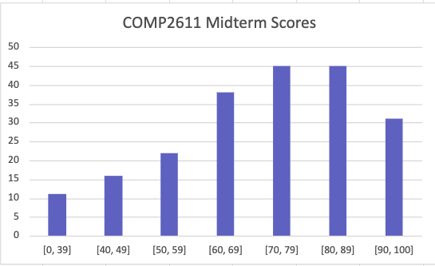

---
aliases:
  - COMP 2611
  - COMP 2611 index
  - COMP2611
  - COMP2611 index
  - Computer Organization
  - Computer Organization index
  - HKUST COMP 2611
  - HKUST COMP 2611 index
  - HKUST COMP2611
  - HKUST COMP2611 index
tags:
  - flashcard/active/special/academia/HKUST/COMP_2611/index
  - function/index
  - language/in/English
---

# index

- HKUST COMP 2611
- name: Computer Organization

The content is in teaching order.

- grading
  - scheme
    - individual written homework ×4: 15%
    - midterm exam: 30%
    - individual programming project: 15%
    - final exam: 40%
- logistics
  - course learning outcomes (CLOs) ::@:: assembly language, digital logic, instruction set architecture (ISA), organizational paradigms, processor & memory
  - topics ::@:: brief digital circuit, data representation and arithmetic, instruction set architecture and assembly, computer architecture
    1. digital logic: combinational, sequential
    2. data representation: integer, fractional, character
    3. instruction set architecture (ISA)
    4. MIPS assembly language
    5. processor: datapath, control; pipeline
    6. memory system: cache, virtual memory

## children

- [MARS](MARS.md)
- [MIPS](MIPS.md)
- [assignments](assignments/index.md)
<!-- - [questions](questions.md) -->

## week 1 lecture

- datetime: 2025-02-03T13:30:00+08:00/2025-02-03T14:50:00+08:00
- topic: course information, introduction
- logistics
- [numeral system](../../../../general/numeral%20system.md) ::@:: a mathematical notation for representing numbers of a given set, using digits or other symbols in a consistent manner
  - numeral system / common examples ::@:: binary (base 2; used by digital computers), octal (base 8), decimal (base 10; used by people), hexadecimal (base 16; concisely expresses a binary sequence), sexagesimal (base 60; used for timekeeping)
- [positional notation](../../../../general/positional%20notation.md) ::@:: (_d__n_<!-- markdown separator -->−1..._d_0)_r_ = _d__n_<!-- markdown separator -->−1 × _r__n_<!-- markdown separator -->−1 + ... + _d_0 × _r_0 , where _d__i_ is the _i_+1-th _least significant digit_ and _r_ is the _base_ or _radix_ 
 An extension to the above includes decimals by extending the positions to beyond the decimal point analogously.
  - positional notation / integral conversion ::@:: To convert from any base _a_ to any other base _b_, the simplest way _for humans_ is to convert it from base _a_ to base 10, and then from base 10 to base _b_. 
 To convert from base _a_ to base 10, use the positional notation definition. 
 To convert from base 10 to base _b_, keep doing round-toward-zero division by _b_ until the number is 0, keeping track of the remainders. Join the remainders to get the number in base _b_. The first remainder is the least significant digit.
- [binary number](../../../../general/binary%20number.md) (base 2) ::@:: a method for representing numbers that uses only two symbols for the natural numbers: typically "0" (zero) and "1" (one)
  - binary number / usage ::@:: It can model series of electrical signals computers use to represent information as a _bit sequence_, where "0" represents no/low voltage or off state and "1" represents presence/high voltage or on state.
- [byte § multiple-byte units](../../../../general/byte.md#multiple-byte%20units) ::@:: powers of 10: 1 B (byte), 1 kB (kilobyte) = 1000 B, 1 MB (megabyte) = 10002 B, 1 GB (gigabyte) = 10003 B, ...   powers of 2: 1 B, 1 kiB (kibibyte) = 1024 B, 1 MiB (mebibyte) = 10242 B, 1 GiB (gibibyte) = 10243 B, ... 
 However, in practice... (very important!)
  - [byte § multiple-byte units](../../../../general/byte.md#multiple-byte%20units) / confusion ::@:: People frequently confuse the units for powers of 10 and powers of 2. In many contexts, the symbol for the units of powers of 10 are used to meant both, and which one it meant depends on the specific context. 
 In this course, when dealing with _size_, we mean the units of powers of 2. When dealing with _frequency_ or _rate_, we mean the units of powers of 10. In both cases, we use the symbol for the units of powers of 10, e.g. always use "kB".
- [classes of computers](../../../../general/classes%20of%20computers.md) ::@:: (in increasing power) embedded computers, personal computers, server computers, supercomputers
  - [personal computer](../../../../general/personal%20computer.md) ::@:: general purpose; many software; subject to cost—performance tradeoff
  - [server computer](../../../../general/server%20(computing).md) ::@:: network-based; high capacity, performance, reliability; ranges from small-sized to building-sized
  - [supercomputer](../../../../general/supercomputer.md) ::@:: high-end computers, often specialized for certain workloads, e.g. engineering, science; highest capabilities but very little market share
  - [embedded computer](../../../../general/embedded%20system.md) ::@:: hidden as components of systems; stringent constraints on cost, performance, power, etc.
- [abstraction layer](../../../../general/abstraction%20layer.md) ::@:: a way of hiding the working details of a subsystem.
  - abstraction layer / common computer layers ::@:: (from top to bottom) user, application, operating system, hardware
  - abstraction layer / application ::@:: written in high-level language
  - abstraction layer / operating system ::@:: compiler: high-level language to machine code; operating system: handle IO, manage memory and storage, manage resources, schedule tasks
  - abstraction layer / hardware ::@:: IO controllers, memory, processor
- [computer program](../../../../general/computer%20program.md) ::@:: a sequence or set of instructions in a programming language for a computer to execute
  - computer program / levels ::@:: (from top to bottom) high-level language, assembly language, machine code
  - computer program / high-level language ::@:: level of abstraction closer to the problem domain, so that you can work productivity and make the program more portable
  - computer program / assembly language ::@:: textual representation of instructions, in symbolic language
  - computer program / machine code ::@:: binary bits, which are encoded data or instructions
- abstraction layer
  - abstraction layer / necessity ::@:: It is impossible to understand computers by looking at every single transistor. Abstraction helps with coping with complexity.
  - abstraction layer / key ideas ::@:: Organize computer software and hardware into hierarchical layers. In a layer, details in the lower layers are hidden to simplify the current layer. Interactions between layers happen between well-defined interfaces. 
 An example is instruction set architecture (ISA), an interface between hardware and software.
- [instruction set architecture](../../../../general/instruction%20set%20architecture.md) (ISA) ::@:: an abstract model that generally defines how software controls the CPU in a computer or a family of computers
  - instruction set architecture / advantages ::@:: Allows your ISA code to run on different implementations of the ISA, e.g. different CPUs.
  - instruction set architecture / examples ::@:: ARM, MIPS, PowerPC, SPARC, x86
- [computer](../../../../general/computer.md) ::@:: a machine that can be programmed to automatically carry out sequences of arithmetic or logical operations (computation)
  - computer / the very first computers ::@:: some uses punch cards as computer programs, very large (can be as large as a building), very low capabilities (compared to nowadays)
- [von Neumann architecture](../../../../general/von%20Neumann%20architecture.md) ::@:: control unit, processing unit, memory, storage, input/output mechanisms 
 in this course, 5 components: input, output, memory, processor (control + datapath)
  - von Neumann architecture / input ::@:: communicate with the computers; transfer data and instructions to the memory
  - von Neumann architecture / output ::@:: communicate with the users; transfer data from the memory
  - von Neumann architecture / memory ::@:: store to keep data and instructions
  - von Neumann architecture / processing unit (datapath) ::@:: unit to process data according to instructions
  - von Neumann architecture / control unit (control) ::@:: unit to control input, output, memory, and processing unit
- [information age](../../../../general/informaion%20age.md) ::@:: the agricultural revolution, then the industrial revolution, then the information revolution (computer revolution); thus we have the information age, and computers are pervasive
  - information age / why ::@:: one of the reasons: Moore's law: the number of transistors in an integrated circuit (IC) doubles about every two years
  - information age / applications ::@:: artificial intelligence, automobile computers, human genome project, search engines, world wide web
  - information age / trend ::@:: electronics technology continues to evolve due to increased capacity and reduced cost, e.g. vacuum tubes (1950s), transistors (1950, 1960s), integrated circuits (1960s, 1970s), very large scale integrated (VLSI) circuits (since 1980s)

## week 1 lab

- datetime: 2025-02-04T15:00:00+08:00/2025-02-04T15:50:00+08:00
- status: unscheduled, no lab

## week 1 tutorial

- datetime: 2025-02-04T18:00:00+08:00/2025-02-04T18:50:00+08:00
- status: unscheduled, no tutorial
- topic: number systems
- [numeral system](../../../../general/numeral%20system.md)
- [positional notation](../../../../general/positional%20notation.md)
  - positional notation / integral conversion
    - positional notation / integral conversion / base 2, base 16 ::@:: 4 base 2 digits can be grouped together, which _directly_ corresponds to 1 base 16 digit, and vice versa. This can help ease conversion between these two bases. 
 Note that you may need to add or remove padding zeros to make the original or resulting base 2 number have digit count that is a multiple of 4.

## week 1 lecture 2

- datetime: 2025-02-07T09:00:00+08:00/2025-02-07T10:20:00+08:00
- topic: logic gates, truth table, logic function, multiplexor
- [analog signal](../../../../general/analog%20signal.md) ::@:: any continuous-time signal representing some other quantity; values vary over a broad range continuously
- [digital signal](../../../../general/digital%20signal.md) ::@:: a signal that represents data as a sequence of discrete values; at any given time it can only take on, at most, one of a finite number of values
  - digital signal / typical voltage ::@:: low/0: 0 V to 0.5 V; high/1: 2.4 V to 2.9 V; illegal: outside of the aforementioned ranges
- [bit](../../../../general/bit.md) ::@:: represents a logical state with one of two possible values
  - bit / applications in computers ::@:: instructions (e.g. operands, operations), number representations (e.g. floats, integers, rationals)
- [truth table](../../../../general/truth%20table.md) ::@:: a mathematical table used in logic—specifically in connection with Boolean algebra, Boolean functions, and propositional calculus—which sets out the functional values of logical expressions on each of their functional arguments, that is, for each combination of values taken by their logical variables; i.e. a table tha shows the _single_ (in this course, can be _multiple_) Boolean output of a function accepting _zero or more_ Boolean inputs
  - truth table / format ::@:: one column for each input and output; one row for each possible combination of inputs
- [Boolean algebra](../../../../general/Boolean%20algebra.md) ::@:: values: 0/true, 1/false; variables: can only take the aforementioned 2 values; operations: AND, NAND, NOR, NOT, OR, XOR
- [logic gate](../../../../general/logic%20gate.md) ::@:: a device that performs a Boolean function, a logical operation performed on one or more binary inputs that produces a single binary output
  - logic gate / basic examples ::@:: AND, NAND, NOR, NOT, OR, XOR
  - logic gate / NOT, inverter ::@:: $0 \mapsto 1; 1 \mapsto 0$   ${\overline {A} }$ or $\neg A$   
  - logic gate / AND, conjunction ::@:: $(0, 0) \mapsto 0; (0, 1) \mapsto 0; (1, 0) \mapsto 0; (1, 1) \mapsto 1$   $A\cdot B$ or $A\land B$   
  - logic gate / OR, disjunction ::@:: $(0, 0) \mapsto 0; (0, 1) \mapsto 1; (1, 0) \mapsto 1; (1, 1) \mapsto 1$   $A+B$ or $A\lor B$   
  - logic gate / NAND, alternative denial ::@:: $(0, 0) \mapsto 1; (0, 1) \mapsto 1; (1, 0) \mapsto 1; (1, 1) \mapsto 0$   ${\overline {A\cdot B} }$ or $A\uparrow B$   
  - logic gate / NOR, joint denial ::@:: $(0, 0) \mapsto 1; (0, 1) \mapsto 0; (1, 0) \mapsto 0; (1, 1) \mapsto 0$   ${\overline {A+B} }$ or $A\downarrow B$   
  - logic gate / XOR, exclusive or ::@:: $(0, 0) \mapsto 0; (0, 1) \mapsto 1; (1, 0) \mapsto 1; (1, 1) \mapsto 0$   $A\oplus B$ or $A\veebar B$   
  - logic gate / logic function ::@:: It is a function on binary variables whose output is also a binary variable. It can be represented by logic gates. AND, NOT, and OR are fundamental to all operations in modern computers.
    - logic gate / logic function / representations ::@:: graphics (e.g. Karnaugh map), logical expressions, truth table
  - logic gate / example ::@:: 1-bit half adder: given _A_ and _B_, outputs _S_ and _C_. _S_ = _A_ XOR _B_, _C_ = _A_ AND _B_. 
 So _S_ is interpreted as the resulting bit after addition, while _C_ is the carry bit (e.g. to be connected to another 1-bit half adder).
  - logic gate / circuit types ::@:: 2 main ones: combinational logic circuit, sequential logic circuit
- [combinational logic](../../../../general/combinational%20logic.md) ::@:: It has no memory. The outputs depend entirely on the _current_ inputs and noting else. It is essentially the same as a logic function, so can be represented by a truth table.
- [sequential logic](../../../../general/sequential%20logic.md) ::@:: It has memory. The outputs depend on the _current_ inputs and the _state_ (value stored in _memory_). That is, the output _additionally_ depends on the input history.
- [combinational logic](../../../../general/combinational%20logic.md)
  - [combinational logic](../../../../general/combinational%20logic.md) / circuits ::@:: e.g. multiplexor/demultiplexor, encoder/decoder, two-level logic, programmable logic array (PLA); these are higher-level basic building blocks that are commonly seen in combinational logic
- [multiplexer](../../../../general/multiplexer.md)/selector, demultiplexer ::@:: (former) a device that selects between several analog or digital input signals and forwards the selected input to a single output line 
 (latter) a device that takes a single input signal and selectively forwards it to one of several output lines
  - multiplexer / 2_n_-to-1 multiplexer ::@:: 2_n_ data inputs, _n_ selection inputs, and 1 output 
 The _n_ selection inputs have 2_n_ possible combinations. Each combination selects 1 data input and forwards it to the output.
    - multiplexer / 2_n_-to-1 multiplexer / implementation ::@:: Use an AND gate for each data input. Connect the data input to its corresponding AND gate. Then connect the _n_ selection inputs to the AND gates, adding NOT gates as needed, such that each unique combination of _n_ selection inputs makes exactly one AND gate possible to be made output 1 iff its corresponding input is 1. Finally, connect all the AND gates into 1 giant OR gate, and that is the output.

## week 2 lecture

- datetime: 2025-02-10T13:30:00+08:00/2025-02-10T14:50:00+08:00
- topic: decoder, two-level logic, programmable logic array
- [binary decoder](../../../../general/binary%20decoder.md), encoder ::@:: (former) a combinational logic circuit that converts binary information from the n coded inputs to a maximum of 2_n_ unique outputs 
 (latter) does the reverse
  - binary decoder / _n_-to-2_n_ decoder ::@:: _n_ data inputs, 2_n_ data outputs 
 Each unique combination of inputs activates exactly one output. For machine learning people: This is just an _one hot_ encoder.
    - binary decoder / _n_-to-2_n_ decoder / implementation ::@:: Use an AND gate for each data output. Connect the data output to its corresponding AND gate. Then connect the _n_ selection inputs to the AND gates, adding NOT gates as needed, such that each unique combination of _n_ selection inputs makes exactly one AND gate output 1.
- [logic gate](../../../../general/logic%20gate.md)
  - logic gate / design process ::@:: problem specification, truth table, logical expression, simplification, implementation
    - logic gate / design process / example ::@:: 3-people majority vote: output 1 if two or more inputs are 1, otherwise 0
- [canonical normal form](../../../../general/canonical%20normal%20form.md) ::@:: Any Boolean function can be expressed as a disjunction (OR) of minterms or a conjunction (AND) of maxterms.
  - [minterm](../../../../general/canonical%20normal%20form.md#minterms) ::@:: For $n$ input variables, it is a product (AND) term in which each of the $n$ variables appears _exactly_ once (either in its complemented or uncomplemented form). 
 If you put this term as the output in a truth table for all possible _n_ inputs, you will see _exactly_ one row outputs 1. This is the key insight to how it works.
    - minterm / indexing ::@:: There are $2^n$ possible minterms. Assign the value 1 to the direct form \($x_{i}$\) and 0 to the complemented form \($x'_{i}$\) (these assignments are reversed for maxterm); the minterm is then $\sum \limits _{i=1}^{n}2^{i-1}\operatorname {value} (x_{i})$. 
 For example, minterm $abc'$ is numbered 1102 = 610 and denoted $m_{6}$.
  - [maxterm](../../../../general/canonical%20normal%20form.md#maxterm) ::@:: For $n$ input variables, it is a sum (OR) term in which each of the $n$ variables appears _exactly_ once (either in its complemented or uncomplemented form). 
 If you put this term as the output in a truth table for all possible _n_ inputs, you will see _exactly_ one row outputs 0. This is the key insight to how it works.
    - maxterm / indexing ::@:: There are $2^n$ possible maxtems. Assign the value 0 to the direct form \($x_{i}$\) and 1 to the complemented form \($x'_{i}$\) (these assignments are reversed for minterm); the maxterm is then $\sum \limits _{i=1}^{n}2^{i-1}\operatorname {value} (x_{i})$. 
 For example, we assign the index 6 to the maxterm $a'+b'+c$ \(110\) and denote that maxterm as _M_6. The complement $(a'+b'+c)'$ is the minterm $abc'=m_{6}$, using [de Morgan's law](../../../../general/De%20Morgan's%20law.md).
  - two-level representation ::@:: A representation where every input is a variable or its complement, one level consists of AND only, and the other level consists of OR only. There are two forms: sum of products (SOP), product of sums (POS).
  - [minterm canonical form](../../../../general/canonical%20normal%20form.md#minterm%20canonical%20form), sum of products (SOP) ::@:: Given the truth table of a logical function, it is possible to write the function as a "sum of products" or "sum of minterms". This is a _two-level representation_. 
 The key insight is that since a minterm is 1 for _exactly_ one input possible combination, adding (OR) minterms appropriately can produce any truth table. This is done by adding (OR) the minterms for which the corresponding row in the given truth table outputs 1.
  - [maxterm canonical form](../../../../general/canonical%20normal%20form.md#maxterm%20canonical%20form), sum of products (SOP) ::@:: Given the truth table of a logical function, it is possible to write the function as a "product of sums" or "product of maxterms". This is a _two-level representation_. 
 The key insight is that since a maxterm is 0 for _exactly_ one input possible combination, multiplying (AND) maxterms appropriately can produce any truth table. This is done by multiplying (AND) the maxterms for which the corresponding row (note the variables are negated) in the given truth table outputs 0.
- [programmable logic array](../../../../general/progammable%20logic%20array.md) (PLA) ::@:: a kind of programmable logic device used to implement combinational logic circuits
  - programmable logic array (PLA) / description ::@:: It has 2N AND gates for N input variables, and for M outputs from the PLA, there should be M OR gates, each with programmable inputs from all of the AND gates. 
 Each AND gate represents a minterm. Each OR gate represents a sum of products. An optimization is that if a minterm will not be used, less AND gates are needed (in the lecture slides, the PLA example has 7 AND gates only for 3 inputs).
  - programmable logic array (PLA) / intuition ::@:: The AND plane consisting of 2N AND gates produce all possible minterms. The OR plane consisting of M gates produces the required M outputs, assembled from all possible minterms from the AND plane.
  - programmable logic array (PLA) / duality ::@:: Theoretically, product of sums (POS) could be used instead, with an OR plane generating all possible maxterms, connected to an AND plane generating the required outputs. 
 However, negations are needed when you convert a truth table to POS, which is more mentally demanding and less intuitive. So that is why this is not often seen in practice.

## week 2 lab

- datetime: 2025-02-11T15:00:00+08:00/2025-02-11T15:50:00+08:00
- status: unscheduled, no lab

## week 2 tutorial

- datetime: 2025-02-11T18:00:00+08:00/2025-02-11T18:50:00+08:00
- status: unscheduled, no tutorial

## week 2 lecture 2

- datetime: 2025-02-14T09:00:00+08:00/2025-02-14T10:20:00+08:00
- topic: logical equivalence, Boolean algebra, K-map
- [logical equivalence](../../../../general/logical%20equivalence.md) ::@:: Two statements are this if they have the same truth value in every model. 
 In the context of combinational logic, this means two Boolean functions have the same output for every combination of inputs.
  - logical equivalence / methods ::@:: logical expression, truth table
  - logical equivalence / truth table ::@:: Very easy to prove equivalence: Check if all rows are the same. However the number of rows grows exponentially: 2_n_.
  - logical equivalence / logical expression ::@:: They give a more concise way to express Boolean functions, especially ones with many input variables. However, it is not always obvious that two different expressions are the same logically, so we need to simplify the expressions using Boolean algebra or Karnaugh map.
- Boolean algebra
  - Boolean algebra / laws ::@:: Translate logical statements into mathematical symbols. Then these laws may be used to simplify the mathematical expression. Then get back simplified logical statements.
    - Boolean algebra / laws / identity laws ::@:: $$\begin{aligned} p \land \top & \equiv p \\ p \lor \bot & \equiv p \end{aligned}$$
    - Boolean algebra / laws / domination laws (null laws) ::@:: $$\begin{aligned} p \lor \top & \equiv \top \\ p \land \bot & \equiv \bot \end{aligned}$$
    - Boolean algebra / laws / idempotent or tautology laws ::@:: $$\begin{aligned} p \lor p & \equiv p \\ p \land p & \equiv p \end{aligned}$$
    - Boolean algebra / laws / negation laws (inverse laws) ::@:: $$\begin{aligned} p \lor \lnot p & \equiv \top \\ p \land \lnot p & \equiv \bot \end{aligned}$$
    - Boolean algebra / laws / [commutative laws](commutative%20property.md) ::@:: $$\begin{aligned} p\vee q & \equiv q\vee p \\ p\wedge q &\equiv q\wedge p \end{aligned}$$
    - Boolean algebra / laws / [associative laws](associative%20property.md) ::@:: $$\begin{aligned} (p \lor q) \lor r & \equiv p \lor (q \lor r) \\ (p \land q) \land r & \equiv p \land (q \land r) \end{aligned}$$
    - Boolean algebra / laws / [distributive laws](distributive%20property.md) ::@:: $$\begin{aligned} p \lor (q \land r) & \equiv (p \lor q) \land (p \lor r) \\ p \land (q \lor r) & \equiv (p \land q) \lor (p \land r) \end{aligned}$$
    - Boolean algebra / laws / [absorption laws](absorption%20law.md) ::@:: $$\begin{aligned} p \lor (p \land q) & \equiv p \\ p \land (p \lor q) & \equiv p \end{aligned}$$
    - Boolean algebra / laws / [De Morgan's laws](De%20Morgan's%20laws.md) ::@:: $$\begin{aligned} \lnot (p \land q) & \equiv \lnot p \lor \lnot q \\ \lnot (p \lor q) & \equiv \lnot p \land \lnot q \end{aligned}$$
    - Boolean algebra / laws / [double negation](double%20negation.md) law ::@:: $$\neg (\neg p)\equiv p$$
- [Karnaugh map](../../../../general/Karnaugh%20map.md) (K-map) ::@:: A diagram that can be used to simplify a Boolean algebra expression. 
 (Note: K-map for 5 variables or more exist.)
  - Karnaugh map / construction ::@:: The row and column indices (shown across the top and down the left side of the Karnaugh map) are ordered in Gray code rather than binary numerical order. Gray code ensures that only one variable changes between each pair of adjacent cells. Each cell of the completed Karnaugh map contains a binary digit representing the function's output for that combination of inputs (i.e. a minterm).
    - Karnaugh map / construction / 2 inputs ::@:: 
    - Karnaugh map / construction / 3 inputs ::@:: 
    - Karnaugh map / construction / 4 inputs ::@:: 
    - Karnaugh map / construction / 5 inputs ::@:: It is possible, but you will need to think in 3D. Stack 2 4×4 Karnaugh map vertically. It gets even harder for 6 inputs or more...
    - Karnaugh map / construction / torus ::@:: You should not use a torus in practice. This is simply to demonstrate how a K-map can be made into a torus: 
  - Karnaugh map / grouping ::@:: Group adjacent 1s in the diagram. The grid is toroidally connected (torus shaped), so _adjacent_ cells include wrapping across the edges of the diagram (left/right edge, top/bottom edge). That means groups can wrap across the edges.
    - Karnaugh map / grouping / rules ::@:: The union of all groups covers all 1s.   Each group has a size that is a power of 2 (i.e. 1, 2, 4, 8, ...).   Each group should be as large as possible, so that the resulting minterm has the least number of variables.   Number of groups should be the fewest, so that the resulting SOP has the least number of minterms.   Groups may overlap: make use of this extensively to make the groups as large as possible and cover all 1s with the least number of groups. 
 Note that the best grouping may not be unique.
  - Karnaugh map / solution ::@:: Each group corresponds to one minterm. It can be found by examining which variables stay the same within each box. Those that stay the same should be included, while those do not should be excluded. Intuitively, each term halves the grouping size. 
 Finally, add the minterms together to get a SOP.
  - Karnaugh map / inverse ::@:: Group adjacent 0s in the diagram instead. This produces a SOP for the inverse. Using De Morgan's laws, we can obtain a POS for the original function.
  - Karnaugh map / don't cares ::@:: Those cells are marked with a X. In that case, we can either cover or not cover them, choosing the one that gives the better grouping.
- [seven-segment display](../../../../general/seven-segment%20display.md) ::@:: It is a form of electronic display device for displaying decimal numerals that is an alternative to the more complex dot matrix displays. 
 Basically a display with a gray 8-shape with sharp corners, which have certain edges of the 8-shape activated (glowing) to show a decimal (0123456789)/hexadecimal (0123456789AbCdEF) digit.

## week 3 lecture

- datetime: 2025-02-17T13:30:00+08:00/2025-02-17T14:50:00+08:00
- topic: sequential logic, S-R latch, D latch, D flip-flop
- [flip-flop](../../../../general/flip-flop%20(electronics).md) ::@:: They are circuits that have two stable states that can store state information – a bistable multivibrator. The circuit can be made to change state by signals applied to one or more control inputs and will output its state (often along with its logical complement too). It is the basic storage element in sequential logic.
  - flip-flop / SR NOR latch ::@:: An unclocked/asynchronous memory element. Its 2 inputs are S (set) and R (reset). Its 2 outputs are Q (stored output) and its complement. It consists of two parallel NOR gates where the output of each NOR is also fanned out into one input of the other NOR.
    - flip-flop / SR NOR latch / symbol, figure ::@:: symbol: %20Flip-flop.svg)   figure: 
    - flip-flop / SR NOR latch / operations ::@:: hold/_quiescent_/latch state: If S and R are both 0, Q and its complement keep their previous outputs.   set: If S is 1 and R is 0, Q becomes 1 and its complement becomes 0.   unset: If S is 0 and R is 1, Q becomes 0 and its complement becomes 1.   _forbidden/race condition_: S and R are not allowed to be both 1, as both outputs are now 0. Then, if S and R both goes to 0 _simultaneously_ afterwards, the outputs are metastable and may eventually lock at either 1 or 0 depending on the propagation time relations between the gates.
- [race condition](../../../../general/race%20condition.md) ::@:: It is the condition of an electronics, software, or other system where the system's substantive behavior is dependent on the sequence or timing of other uncontrollable events, leading to unexpected or inconsistent results. It becomes a bug when one or more of the possible behaviors is undesirable.
  - race condition / in electronics ::@:: A typical example of a race condition may occur when a logic gate combines signals that have traveled along different paths from the same source. The inputs to the gate can change at slightly different times in response to a change in the source signal. The output may, for a brief period, change to an unwanted state before settling back to the designed state.
  - race condition / note ::@:: \(this course: __Important__. It seems like the actual rules for deciding if a state is _forbidden_ is very complicated. It seems like there are three ways this can arise: adjacent 1s or 0s not covered by a contagious grouping, undefined states of SR latch, and shortest paths to latch states passing through undefined states. See the Karnaugh map race hazards example below.\)
- Karnaugh map
  - Karnaugh map / race hazards ::@:: Karnaugh maps are useful for detecting and eliminating race conditions. Race hazards are very easy to spot using a Karnaugh map, because a race condition _may_ exist when moving between any pair of adjacent, but disjoint, regions circumscribed on the map. 
 Whether glitches will actually occur depends on the physical nature of the implementation, and whether we need to worry about it depends on the application. In clocked logic, it is enough that the logic settles on the desired value in time to meet the timing deadline. In our example, we are not considering clocked logic.
    - Karnaugh map / race hazards / SR latch ::@:: Consider the circuit $$\begin{aligned} Q & = \overline{R + \overline{S + Q} } = \overline R (S + Q) = \overline R S + \overline R Q \\ \overline Q & = \overline{S + \overline{R + \overline Q} } = \overline S (R + \overline Q) = R \overline S + \overline S \, \overline Q \,. \end{aligned}$$ 
 Its K-maps are: 
     
 The _latch_ states are also grouped. Take note of the two labeled transitions, each transition making its two states "adjacent". While we can see movement between any adjacent pair of 1s or 0s is covered by a continuous region, there are 2 undefined states. These are also _race hazards_ \(but of a _different kind_ from that described above\).
    - Karnaugh map / race hazards / gated D latch ::@:: \(midterm examination\) Consider the circuit $$Q = DE + DQ + \overline E Q \,.$$ The $\overline Q$ is naturally defined as the inverse of above, so we do not need to care about the 0s. 
 Its K-map is: 
  
 The _latch_ states are also grouped. Take note of the two _transitions_, each transition making its two states "adjacent". One can see there are no _possible_ race conditions, since movement between any adjacent pair of 1s is covered by a continuous region.
    - Karnaugh map / race hazards / complex example ::@:: \(homework 1\) Consider the circuit: 
  
 which can be written as $$\begin{aligned} Q & = \overline R S + \overline R Q \\ \overline Q & = R \overline S + \overline S \, \overline Q \,, \end{aligned}$$ where \(only eliminate subgroupings in the K-map\) $$\begin{aligned} R & = D = A \oplus \overline{BC} = ABC + \overline A \, \overline{BC} = ABC + \overline A \, \overline B + \overline A \, \overline C \\ \overline R & = (\overline A + \overline B + \overline C) (A + B) (A + C) = \overline A B C + A \overline B + A \overline C \\ S & = E = \overline{BC} \oplus C = \overline{BC} \, \overline C + BC = \overline C + BC \\ \overline S & = C (\overline B + \overline C) = \overline B C \,. \end{aligned}$$ Then, \(only eliminate subgroupings in the K-map\) $$\begin{aligned} Q & = A \overline C + \overline A BC + \overline A BCQ + A \overline B Q + A \overline C Q = A \overline C + \overline A B C + A \overline B Q \\ \overline Q & = \overline A \, \overline B C+ \overline B C \overline Q \,. \end{aligned}$$ 
 Its K-maps are: 
     
 The _latch_ states are also grouped. Take note of the two labeled transitions, each transition making its two states "adjacent". While one can see movement between any adjacent pair of 1s or 0s is covered by a continuous region, there are 6 undefined states. These are also _race hazards_ \(but of a _different kind_ from that described above\). Also, the 4 defined cells _not directly adjacent_ to the latch states are also _race hazards_ \(and of a _different kind_ from the above two kinds...\), since there exists _shortest paths_ to the latch state passing through undefined states.
- flip-flop
  - flip-flop / SR NAND latch ::@:: It is also possible to use NAND instead of NOR to make a SR latch. But it is more rare because the inputs' meaning are negated, i.e. the hold state requires both inputs to be 1.
  - flip-flop / SR AND-OR latch ::@:: It may be easier from a teaching point of view. See the figure and try to figure its mechanism yourself: 
  - flip-flop / gated latches ::@:: Latches are designed to be _transparent_. That is, input signal changes cause immediate changes in output. Additional logic can be added to a transparent latch to make it _non-transparent_ or _opaque_ when another input (an "enable" input) is not asserted.
  - flip-flop / gated SR latch ::@:: Literally just an additionally "enable" input E AND-ing with the other 2 inputs. If E is 1, it works exactly as a SR latch. Otherwise, no action (hold state), no matter how the other 2 inputs are.
    - flip-flop / gated SR latch / symbol, figure ::@:: symbol:    figure: %20Flip-flop%20Diagram.svg)
  - flip-flop / gated D latch ::@:: This latch exploits the fact that, in the two active input combinations (01 and 10) of a gated SR latch, R is the complement of S. 
 So what we do is, on top of the gated SR latch, instead of having the inputs S and R, we have one input D (data) only, connecting to the (now internal) S an R inputs. Assuming E is 1. If D is 0, S is 0 and R is 1. Otherwise, S is 1 and R is 0. If E is 0, nothing happens, as in the gated SR latch. 
 When E is 1, it looks like the input D is being "written" into the gate memory, so D is called _data_. The "enable" input E is sometimes also called WE (write enable) instead for the same reason.
    - flip-flop / gated D latch / symbol, figure ::@:: symbol:    figure: .svg)
    - flip-flop / gated D latch / register ::@:: It stores a multi-bit value. A _n_-bit \(_this_\) can be implemented using _n_ gated D latches, all controlled by a common WE. Then when we want to write to the register, set WE to 1 and the _n_ D inputs to the desired data.
- [clock signal](../../../../general/clock%20signal.md) ::@:: It is an electronic logic signal (voltage or current) which oscillates between a high and a low state at a constant frequency and is used like a metronome to synchronize actions of digital circuits.
  - clock signal / synchronization ::@:: In a _synchronous_ logic circuit, the most common type of digital circuit, the clock signal is applied to all storage devices, flip-flops and latches, and causes them all to change state simultaneously, preventing race conditions. 
 In a computer, there are many types of circuits, and each take different time to complete (propagation delay). If we do not clock the circuits, then the outputs of circuits can change unpredictably. 
 A clock-less circuit is known as _asynchronous_ circuit, but it is much harder to design than _synchronous_ ones, and is out-of-scope for this course.
  - clock / terminology ::@:: A _clock_ is is a free-running signal with a fixed _cycle time_ (called _clock period_) or, equivalently, a fixed _clock frequency_ (i.e., inverse of the _cycle time_). _Edge-triggered clocking_ refers to state changes in a circuit on a clock (rising or falling) edge.
- [digital timing diagram](../../../../general/digital%20timing%20diagram.md) ::@:: It represents a set of signals in the time domain. A timing diagram can contain many rows, usually one of them being the clock.
  - digital timing diagram / conventions ::@:: Higher value is a logic one. Lower value is a logic zero. A slot showing a high and low is an either-or (such as on a data line). A Z indicates high impedance. A greyed out slot is a don't-care or indeterminate.
- flip-flop
  - flip-flop / latch vs. flip-flop ::@:: For the former, outputs can change any time the clock is asserted (high). For the latter, outputs can change only on a clock (rising or falling) edge.
  - flip-flop / D flip-flop ::@:: It is widely used, and known as a "data" flip-flop. It captures the value of the D-input at a definite portion of the clock cycle (such as the rising edge of the clock). That captured value becomes the Q output. At other times, the output Q does not change. It can be viewed as a memory cell, a zero-order hold, or a delay line.
    - flip-flop / D flip-flop / S, R inputs ::@:: Most D-type flip-flops in ICs have the capability to be forced to the set or reset state (which ignores the D and clock inputs), much like an SR flip-flop. Usually, the illegal S = R = 1 condition is resolved in D-type flip-flops. Setting S = R = 0 makes the flip-flop behave as described above. 
 In this course, our flip-flops do not have these inputs.
    - flip-flop / D flip-flop / symbol ::@:: 
  - flip-flop / master–slave edge-triggered D flip-flop ::@:: It is created by connecting two gated D latches in series, and inverting the enable input to one of them. It is called master–slave because the master latch controls the slave latch's output value Q and forces the slave latch to hold its value whenever the slave latch is enabled, as the slave latch always copies its new value from the master latch and changes its value only in response to a change in the value of the master latch and clock signal.
    - flip-flop / master–slave edge-triggered D flip-flop / diagrams ::@:: rising/positive edge:    falling/negative edge: 
    - flip-flop / master–slave edge-triggered D flip-flop / intuition ::@:: Using the falling/negative-edge-triggered variant as an example. When the clock is high, the first latch (master) has its WE as 1, so it is writable, while the second latch (slave) has its WE as 0, so its output remains unchanged. When the clock is low, the first latch (master) has its WE as 0, so it is not writeable, while the second latch (slave) has its WE as 1, so its output copies from the first latch (master). 
 We see that first latch (master) is only writable when the clock is high, while the output update takes place when the clock is low. When the clock falls from high to low, this is precisely when the latest input to the first latch (master) is saved and not affected by subsequent changes, while the second latch (slave) copies from the newly saved state of first latch (master). Thus it is falling/negative-edge-triggered.
- sequential logic
  - sequential logic / synchronous ::@:: In a sequential circuit, it remembers its state (a "snapshot"). When it is _additionally_ clocked, i.e. synchronous sequential circuit, we can treat its state as changing _on and only on_ each clock cycle.

## week 3 lab

- datetime: 2025-02-18T15:00:00+08:00/2025-02-18T15:50:00+08:00
- topic: introduction to Logisim, combinational circuits
- Logisim ::@:: It is an interactive graphical interface for designing, simulating digital logic circuit. (Runs on Java 5... ancient software?!?)
  - Logisim / download ::@:: <https://sourceforge.net/projects/circuit/>
  - Logisim / installation
  - Logisim / usage
  - Logisim / save as library

## week 3 tutorial

- datetime: 2025-02-18T18:00:00+08:00/2025-02-18T18:50:00+08:00
- topic: combinational logic circuit
- combinational logic
- sequential logic
- logic gate
  - logic gate / design process
  - logic gate / logic gate to expression: hints ::@:: Work from the output to the input step-by-step. Use extra variables when needed, especially when dealing with an output connected to multiple inputs at different levels.
- Boolean algebra
  - Boolean algebra / simplification: hints ::@:: You may need to think of new terms to add to the expression... And also you can use extra variables to replace variables that always appear together.
- 2-bit comparator ::@:: 4 inputs, grouped into 2 groups of 2 inputs, each group representing a 2-bit unsigned integer. 3 outputs, respectively representing greater than, equal to, and less than.
  - 2-bit comparator / hints ::@:: Consider each output separately. You can always use a truth table and its SOP to write the expression. SOP is especially suitable if given a PLA.
- 8-to-3 encoder ::@:: 8 inputs, in one-hot encoding. 3 outputs, representing an unsigned integer from 0 to 7.
- 4-to-1 multiplexer ::@:: 4 inputs, representing the 4 channels to be muxed. 2 control signals, controlling which channel to output. 1 output.
- multiplexer
  - multiplexer / input bit width ::@:: Its output bit width is the same as its input bit width.
  - multiplexer / control bit width ::@:: Given _n_ control bits, the _maximum_ number of inputs is 2_n_.   Given _n_ inputs, the _minimum_ number of control bits is ceil\(log2\(_n_\)\). 
 (Of course, you can violate these, but then it is not a multiplexer, isn't it?)

## week 3 lecture 2

- datetime: 2025-02-21T09:00:00+08:00/2025-02-21T10:20:00+08:00
- topic: 2's complement, max, min, range
- [computer number format](../../../../general/computer%20number%20format.md) ::@:: It is the internal representation of numeric values in digital device hardware and software, such as in programmable computers and calculators.
  - computer number format / motivation ::@:: This is one of the ways to represent numbers using bits. We may want to know more: how about unsigned integers, fractions, and reals? And what are their representable ranges? And how to do arithmetic operations on them?
  - computer number format / bits ::@:: They are represented by a group of bits, i.e. a bit sequence. They are grouped from the right (least significant bits) to the left (most significant bits).
  - computer number format / unsigned integer ::@:: It is literally positional notation but with base 2.
    - computer number format / unsigned integer / range ::@:: _n_ bits: \[0, 2_n_−1\]
    - computer number format / unsigned integer / max ::@:: It has all bits set to 1.
    - computer number format / unsigned integer / min ::@:: It has all bits set to 0.
- [two's complement](../../../../general/two's%20complement.md) ::@:: It is the most common method of representing signed (positive, negative, and zero) integers on computers, and more generally, fixed point binary values. 
 We can do natural arithmetic on it without using special rules.
  - two's complement / sign bit ::@:: The most significant bit (MSB) is \(_this_\). If 0, then nonnegative \(_not_ just positive\). If 1, then negative.
  - two's complement / nonnegative integers ::@:: Same as that for unsigned integers. Beware of the range though... in particular, the _sign bit_ is always 0. (Or you can use the _sign bit_ anyway; but when it is 1, the result after the whole procedure overflows and becomes a negative integer.)
  - two's complement / negative integers ::@:: Start with the absolute binary representation of the number, with the leading bit being a sign bit. (If the _sign bit_ is 1, the result after the whole procedure overflows (less accurately "underflows") and becomes a positive integer.) Then invert (or flip) all bits – changing every 0 to 1, and every 1 to 0. Finally, add 1 to the entire inverted number, ignoring any overflow. Accounting for overflow will produce the wrong value for the result.
  - two's complement / range ::@:: _n_ bits: \[−2_n_<!-- markdown separator -->−1, 2_n_<!-- markdown separator -->−1−1\]
  - two's complement / max ::@:: It has all bits set to 1 except for the sign bit, which is set to 0.
  - two's complement / min ::@:: It has all bits set to 0 except for the sign bit, which is set to 1.
    - two's complement / min / weirdness ::@:: Notice what happens if we try to negate the minimum integer. It becomes itself instead of actually negating. This is because its corresponding positive integer is not representable.
- [integer overflow](../../../../general/integer%20overflow.md) ::@:: It occurs when an arithmetic operation on integers attempts to create a numeric value that is outside of the range that can be represented with a given number of digits – either higher than the maximum or lower than the minimum representable value. 
 (_Important_: In this course, we also use "integer underflow", see below.)
  - integer overflow / integer underflow ::@:: The above definition of "integer overflow" refers to the ideal result being outside the representable range. 
 An alternative definition uses "integer overflow" to refer to the ideal result being _higher_ than the maximum representable integer, while using "integer underflow" to refer to the ideal result being _lower_ than the minimum representable integer. 
 (_Important_: In this course, we use the latter definition.)

## week 4 lecture

- datetime: 2025-02-24T13:30:00+08:00/2025-02-24T14:50:00+08:00
- topic: signed/unsigned number, floating point, IEEE754 examples
- two's complement
  - two's complement / sign extension ::@:: When turning a two's-complement number with a certain number of bits into one with more bits (e.g., when copying from a one-byte variable to a two-byte variable), the most-significant bit must be repeated in all the extra bits. Other examples include: right shift (but not left shift, the sign bit is shifted out as normal).
- [sign extension](../../../../general/sign%20extension.md) ::@:: the operation, in computer arithmetic, of increasing the number of bits of a binary number while preserving the number's sign (positive/negative) and value
  - sign extension / zero extension ::@:: Fill in the missing most-significant bits with zero, e.g. bitwise logical operations, up-casting unsigned integers, etc.
- [floating-point arithmetic](../../../../general/floating-point%20arithmetic.md)
  - floating-point arithmetic / motivation ::@:: To represent non-integral numbers, which includes fractions, very small numbers, and very large numbers.
  - floating-point arithmetic / representation ::@:: Roughly speaking, just like how we use a decimal point to represent non-integral numbers as decimal representation, computers use binary point to represent non-integral numbers as binary representation.
- [scientific notation](../../../../general/scientific%20notation.md) ::@:: a way of expressing numbers that are too large or too small to be conveniently written in decimal form, since to do so would require writing out an inconveniently long string of digits
  - scientific notation / form ::@:: Nonzero numbers are written in the form 
 _m_ × 10_n_ 
 or _m_ times ten raised to the power of _n_, where _n_ is an [integer](../../../../general/integer.md), and the [coefficient](../../../../general/coefficient.md) _m_ is a nonzero [real number](../../../../general/real%20number.md) \(usually between 1 and 10 in absolute value, and nearly always written as a [terminating decimal](../../../../general/decimal.md)\). The integer _n_ is called the [exponent](../../../../general/exponent.md) and the real number _m_ is called the _[significand](../../../../general/significand.md)_ or _mantissa_ (not to be confused with that of the same name in floating-point arithmetic).
    - scientific notation / form / normalized ::@:: When _m_ is at least 1 and less than (_not_ equal to) 10. 
 For _binary_ representation, this means the leading digit is always 1.
- floating-point arithmetic
  - floating-point arithmetic / name ::@:: It is _floating_ because the binary point is not fixed (affected by the significand).
  - floating-point arithmetic / form ::@:: $$1.xxx \ldots xxx_2 \times 2^{yyy \ldots yyy_2} \,,$$ where $xxx \ldots xxx_2$ is the _significand_ or _mantissa_ (not to be confused with that of the same name in scientific notation) and $yyy \ldots yyy_2$ is the _exponent_. They have a fixed number of digits (bits).
  - floating-point arithmetic / distribution ::@:: Looking at its form, we can see that the distribution of floating-point numbers is not even. The density of representable numbers doubles/halves every time you cross a power of 2.
  - floating-point arithmetic / precision ::@:: The arithmetic is _approximate_ (i.e. not _exact_). Thus we say it has a finite range and _limited_ precision.
- [single-precision floating-point format](../../../../genral/single-precision%20floating-point%20format.md) (`float`) ::@:: 32-bit floating-point format, starting from the left (MSB) to the right (LSB): 1 sign bit, 8 exponent bits, and 23 significand bits (precision is 24 bits).
  - single-precision floating-point format / precision ::@:: about 7 significant _decimal_ digits (6 to 9)
  - single-precision floating-point format / exponent range ::@:: 2−126 ≈ 10−38 to 2+127 ≈ 10+38
  - single-precision floating-point format
- [double-precision floating-point format](../../../../genral/double-precision%20floating-point%20format.md) (`double`) ::@:: 64-bit floating-point format, starting from the left (MSB) to the right (LSB): 1 sign bit, 11 exponent bits, and 52 significand bits (precision is 53 bits).
  - double-precision floating-point format / precision ::@:: about 16 significant _decimal_ digits (15 to 17)
  - double-precision floating-point format / exponent range ::@:: 2−1022 ≈ 10−308 to 2+1023 ≈ 10+308
    - double-precision floating-point format / exponent range / mnemonic ::@:: Compare the exponents with that of single-precision... notice that "0" is inserted as the 2nd digit. Hmm...
- [IEEE 754](../../../../general/IEEE%20754.md) ::@:: a technical standard for floating-point arithmetic originally established in 1985 by the Institute of Electrical and Electronics Engineers \(IEEE\)
  - IEEE 754 / history (brief) ::@:: It was developed in response to divergence of representations, which can cause portability issues for scientific code. Now it is almost universally adopted.
  - IEEE 754 / representations ::@:: single precision (32-bit), double precision (64-bit), ... (there are much more not covered in this course)

## week 4 lab

- datetime: 2025-02-25T15:00:00+08:00/2025-02-25T15:50:00+08:00
- topic: building sequential logics with Logisim
- Logisim
  - Logisim / magnification ::@:: Use magnification to help you connect wires and draw graphics.
  - Logisim / wire color ::@:: Light green means 1. Dark green means 0. Any other color means connection problem.
  - Logisim / auto build ::@:: Given a logical expression, it can build a circuit for you. You can convert a truth table into an expression using SOP (or POS).
- flip-flop
  - flip-flop / SR NOR latch
  - flip-flop / SR NAND latch
  - flip-flop / gated D latch
- clock
- flip-flop
  - flip-flop / master–slave edge-triggered D flip-flop
  - flip-flop / gated D latch
    - flip-flop / gated D latch / register

## week 4 tutorial

- datetime: 2025-02-25T18:00:00+08:00/2025-02-25T18:50:00+08:00
- topic: sequential logic circuit
- combinational logic
- sequential logic
- clock
  - clock / terminology
- flip-flop
  - flip-flop / SR NAND latch
- flip-flop
  - flip-flop / gated D latch
  - flip-flop / master–slave edge-triggered D flip-flop
- [register file](../../../../general/register%20file.md) ::@:: an array of processor registers in a central processing unit (CPU)
  - register file / implementation ::@:: fast static RAMs with multiple ports
- [counter](../../../../general/counter%20(digital).md) ::@:: a device which stores (and sometimes displays) the number of times a particular event or process has occurred, often in relationship to a clock
  - counter / synchronous 2-bit counter ::@:: The counter has 2 gated D latches, each linked to an output. The output cycles through 00, 01, 10, and 11. Its input has the clock only.  
 The 2 required combinational logic gates are the NOT gate and XOR gate.
    - counter / synchronous 2-bit counter / hints ::@:: truth table/transition table → K-map → logic simplification → circuit design

## week 4 lecture 2

- datetime: 2025-02-28T09:00:00+08:00/2025-02-28T10:20:00+08:00
- topic: IEEE754 rational: implicit 1, biased exponent, range, precision, special cases
- IEEE 754
  - IEEE 754 / format ::@:: It is composed of 3 parts, in order from MSB to LSB: a _sign_, an _exponent_, and then a _significand_.
    - IEEE 754 / format / input ::@:: Inputs required to design a IEEE 754 format: a base _b_ that is either 2 or 10 (for simplicity, __we only consider _b_ = 2 henceforth__), a precision _p_, and an exponent range from _emin_ to _emax_ (inclusive) satisfying _emin_ = −(_emax_ − 1) = 1 − _emax_.
    - IEEE 754 / format / number ::@:: We have 3 types of numbers: signed finite numbers (including two signed zeros), two infinities, and two kinds of NaN (not-a-number): a quiet NaN (qNaN) and a signaling NaN (sNaN).
    - IEEE 754 / format / finite numbers ::@:: _s_ = a sign that is either 0 or 1,   _c_ = a _significand_ that is an _integer_ from 0 to _b__p_−1 (at most _p_ base-_b_ digits), and   _q_ = an _exponent_ such that _emin_ ≤ _q_ + _p_ − 1 ≤ _emax_.   The numerical value of such a finite number is \(−1\)_s_ × _c_ × _b__q_. 
 Equivalently, _q_ = an _exponent_ such that _emin_ ≤ _q_ ≤ _emax_.   The numerical value of such a finite number is \(−1\)_s_ × \(_c_ × _b_1 − _p_\) × _b__q_, where \(_c_ × _b_1 − _p_\) can be interpreted as _c_ but the decimal point is right after the first digit. This latter definition more closely matches the actual binary representation. We will __use this latter definition henceforth__.
    - IEEE 754 / format / sign bit ::@:: 0 is nonnegative, 1 is negative. This is obvious.
    - IEEE 754 / format / significand bits ::@:: Given precision _p_ (number of digits), we could just simply have _p_ bits directly corresponding to the _p_ digits of _c_. However, we have a problem: 0 have many different representations, two (due to the sign bit) for each combination of exponent bits. 
 To avoid this, we use the _implicit bit convention_: the first digit of _c_ is always 1, except when representing 0 \(and subnormal numbers\). 0 is represented by the significand bits and exponent bits being all 0s.
      - IEEE 754 / format / significand bits / implicit bit ::@:: This has two advantages: We now only have two representations for 0. And we can represent _p_ digits with only _p_ − 1 bits! The disadvantage is now we have _subnormal numbers_ (the other being named _normal numbers_) when the exponent bits are all 0s but not the significand bits, which has a precision less than _p_ depending on the value (and some other things mentioned below).
    - IEEE 754 / format / exponent bits ::@:: Usually we decide the exponent range from the number of bits instead of the other way around. Given _n_ exponent bits, we have 2_n_ combinations. For _normal numbers_, the exponent bits are not all 0s (_subnormal numbers_) and not all 1s (_infinities_ and _NaNs_). So we only have 2_n_ − 2 combinations left. 
 Then the range is \[−(2_n_ − 1 − 2), 2_n_ − 1 − 1\]. The exponent bits are _biased_.
      - IEEE 754 / format / exponent bits / bias ::@:: An actual exponent of 0 is represented by all bits 1 except for the MSB, which is 0. From this, we derive a _bias_, which is 2_n_ − 1 − 1. 
 This can be interpreted as: interpreting the exponent bits as an _unsigned_ integer, _subtracting_ it by the _bias_ gives the actual exponent; or the exponent bits as an _unsigned_ integer stores the actual exponent _plus_ the _bias_. 
 Its advantage is that floating-point numbers of the _same sign_ can be compared directly as if they are unsigned integers (if the sign bit is 1, the ordering is reversed).
    - IEEE 754 / format / infinity ::@:: The signed infinities are represented by setting the exponent bits to all 1s and the significand bits to all 0s. 
 The sign bit determines if it is positive or negative.
    - IEEE 754 / format / NaN ::@:: NaNs are represented by setting the exponent bits to all 1s and the significand bits to _not_ all 0s. 
 The sign bit is ignored by most applications.
      - IEEE 754 / format / NaN / quiet, signaling ::@:: If the most significant significand bit is 0, it is _signaling_. If it is 1, it is _quiet_. The remaining bits (and rarely the sign bit) is a _payload_ that can store anything. For signaling NaNs, the payload cannot be all 0s or else it becomes an infinity. 
 The above convention (0 is signal, 1 is quiet) means one can silence a signaling NaN into a quiet NaN by simply setting the most significant significand bit to 1. The reverse convention _may_ convert a signaling NaN to an infinity instead if the payload is all 0s.
  - IEEE 754 / conversion from a number ::@:: (for humans) Write the number in terms of _normalized_ scientific notation in base _b_ for the significand. Set the sign bit directly, the exponent bits (remember to add the bias), and the significant bits (discarding the leading implicit 1). Finally, check that the resulting format represents a finite (normal) number instead of special numbers \(may include subnormal numbers depending on the context\). Otherwise, the number to be represented is out of range.
- single-precision floating-point format
  - single-precision floating-point format / range \(zero, normal\) ::@:: in absolute value (i.e. discard sign): 0, \[1×2–126 ≈ 1.2×10–38, (2−2−23)×2+127 ≈ 3.4×10+38\] (figure out the representations yourself)
  - single-precision floating-point format / range \(subnormal\) ::@:: in absolute value (i.e. discard sign): \[2−23×2–126 ≈ 1.4×10–45, (1−2−23)×2–126 ≈ 1.2×10–38\] (figure out the representations yourself)
- double-precision floating-point format
  - double-precision floating-point format / range \(zero, normal\) ::@:: in absolute value (i.e. discard sign): 0, \[1×2–1022 ≈ 2.2×10–308, (2−2−52)×2+1023 ≈ 1.8×10+308\] (figure out the representations yourself)
  - double-precision floating-point format / range \(subnormal\) ::@:: in absolute value (i.e. discard sign): \[2−52×2–1022 ≈ 4.9×10–324, (1−2−52)×2–1022 ≈ 2.2×10–308\] (figure out the representations yourself)
- [arithmetic underflow](../../../../general/arithmetic%20underflow.md) ::@:: It is a condition in a computer program where the result of a calculation is a number of more precise absolute value than the computer can actually represent in memory on its central processing unit (CPU). 
 The exponent becomes too small (slides: negative exponent becomes too large) to fit in the exponent field. This is not the same as a number becoming too negative, which is arithmetic overflow instead.
  - arithmetic underflow / arithmetic overflow ::@:: Similar to integer overflow. The (slides: positive) exponent becomes too large to fit in the exponent field. Equivalently, the number becomes too negative or too positive.
  - arithmetic underflow / integer ::@:: First, see above discussion of "integer underflow" in integer overflow. 
 Unlike "integer underflow", arithmetic underflow is _not_ used like how "integer underflow" is used relative to "integer overflow". That is, arithmetic underflow never refers to a number becoming too negative.
- [normal number](../../../../general/normal%20number%20(computing).md) ::@:: It is a normal number is a non-zero number in a floating-point representation which is within the balanced range supported by a given floating-point format: it is a floating point number that can be represented without leading zeros in its significand.
- [subnormal number](../../../../general/subnormal%20number.md) ::@:: They fill the underflow gap around zero in floating-point arithmetic. Any non-zero number with magnitude smaller than the smallest positive normal number is _subnormal_, while _denormal_ can also refer to numbers outside that range.
  - subnormal number / significand ::@:: Note that the leading _implicit_ bit is now 0 instead of 1. This is the defining characteristic.
  - subnormal number / exponent ::@:: Note that the actual exponent for subnormal numbers is as if the exponent bits has an unsigned value of 1 instead of being all 0s, even though the exponent bits are actually all 0s.
  - subnormal number / issues ::@:: They fill the underflow gap with _evenly_ spaced values, instead of being _logarithmically_ spaced like normal numbers. 
 Some system handle these numbers much more slowly than normal numbers.
- IEEE 754
  - IEEE 754 / format
    - IEEE 754 / format / infinity
      - IEEE 754 / format / infinity / usage ::@:: It can be used in subsequent calculations, which avoids need for checking overflows.
    - IEEE 754 / format / NaN
      - IEEE 754 / format / NaN / usage ::@:: It can be used in subsequent calculations, which avoids need for illegal checking illegal or undefined operations, e.g. dividing 0 by 0.
- [ASCII](../../../../general/ASCII.md) ::@:: It is a character encoding standard for electronic communication, used by most computers today. 
 It is a 7-bit code, so there are 128 code points. Each unsigned integer maps to a character. But most of time we use an unsigned byte, which has 8 bits, to represent a character with the MSB set to 0.
  - ASCII / full name ::@:: American Standard Code for Information Interchange
  - ASCII / patterns ::@:: Some notable patterns:   Alphabets (A to Z, a to z) and numbers (0 to 9) are in order.   groups: NUL (null) → control characters → punctuations → numbers → punctuations → big alphabets → punctuations → small alphabets → punctuations → DEL (a control character)
  - ASCII / note ::@:: How can 128 code points store all characters? This is why we have _Unicode_, but Unicode is much more complicated and involves a variable number of bytes to encode a character. It will not be covered here.

## week 5 lecture

- datetime: 2025-03-03T13:30:00+08:00/2025-03-03T14:50:00+08:00
- topic: basic instructions, register, memory operand
- instruction set architecture
  - instruction set architecture / analogy as a language ::@:: Words are _instructions_. A vocabulary (set of all words\) is an _instruction set_. Programmers write in _assembly language_. After assembly by an _assembler_, it becomes _machine language_, which hardware can understand.
  - instruction set architecture / specifications ::@:: addressing modes, exception handling, external I/O, native data types, instructions, interrupt handling, memory architecture, opcodes \(machine language\), registers
  - instruction set architecture / vs. assembly language ::@:: The former is a public interface to processors implementing this ISA. The latter is simply a programming language. 
 Ideally, a ISA should have a corresponding language. In practice, there are variations. They are defined by the assembler.
  - instruction set architecture / advantages
    - instruction set architecture / advantages / compatibility ::@:: Hardware changes will \(usually\) not impact existing programs: no re-programming is required. Hardware improvement can be made as long as it conforms to the ISA.
  - instruction set architecture / examples
- [reduced instruction set computer](../../../../general/reduced%20instruction%20set%20computer.md) \(RISC\) ::@:: It is a computer architecture designed to simplify the individual instructions given to the computer to accomplish tasks.
  - reduced instruction set computer / comparison ::@:: Compared to the instructions given to a complex instruction set computer (CISC), a RISC computer might require more instructions (more code) in order to accomplish a task because the individual instructions are written in simpler code.
  - reduced instruction set computer / advantages ::@:: Easy to learn and understand. Have a large share of the embedded computers market. Less instructions.
  - reduced instruction set computer / principles ::@:: good compromises, make common cases fast, simplicity favors regularity \(less cases\), smaller is faster
- [MIPS architecture](../../../../general/MIPS%20architecture.md) ::@:: It is the RISC that we will learn here. 
 It was a research project conducted by John L. Hennessy at Stanford University between 1981 and 1984. Then it was commercialized and developed by MIPS Technologies.
  - MIPS architecture / full name ::@:: Microprocessor without Interlocked Pipeline Stages
  - MIPS architecture / reference ::@:: MIPS reference data green card
  - [MIPS](MIPS.md)
    - [§ principles](MIPS.md#principles)
    - [§ arithmetic instructions](MIPS.md#arithmetic%20instructions): `add`, `sub`, `addi`
    - [§ instructions](MIPS.md#instructions)
    - [§ registers](MIPS.md#registers)
    - [§ memory](MIPS.md#memory)
    - [§ data instructions](MIPS.md#data%20instructions): `lw`, `sw`
    - [§ endianness](MIPS.md#endianness)
    - [§ operands](MIPS.md#operands)
    - [§ bitwise instructions](MIPS.md#bitwise%20instructions): `and`, `or`, `nor`, `andi`, `ori`, `sll`, `srl`

## week 5 lab

- datetime: 2025-03-04T15:00:00+08:00/2025-03-04T15:50:00+08:00
- topic: building registers
- [processor register](../../../../general/processor%20register.md) ::@:: a quickly accessible location available to a computer's processor
  - processor register / implementation
    - processor register / implementation / 2-bit register ::@:: Have 2 D flip-flops. Connect the same clock signal to both of them. Split the 2-bit data inputs via a "splitter", and connect each to a D flip-flop. Combine their output as 2-bit data outputs via a "combiner".
      - processor register / implementation / 2-bit register / write enabled ::@:: Add a muxer that selects between the current input and the current output. The 2 D flip-flops inputs are now provided by the muxer instead of the current input. Add a write enabled \(WE\) input that connects to the muxer to select the appropriate muxer input.
- register file
  - register file / implementation ::@:: The idea is that we have several registers, and a register file has an input to select which register to use. 
 Have several registers. Connect the same clock signal to all registers. Add an input that selects a register for both writing and reading. Add a decoder that uses the register selection to write-enable _exactly one_ of the registers. Add a muxer that uses the register selection to select the output of _exactly one_ of the registers.
    - register file / implementation / extensions ::@:: We could separate the register selection for writing and reading. We could also add a write-enable input.

## week 5 tutorial

- datetime: 2025-03-04T18:00:00+08:00/2025-03-04T18:50:00+08:00
- topic: base conversion, integer representation
- positional notation
  - positional notation / integral conversion
    - positional notation / integral conversion / base 2, base 16
- [hexadecimal](../../../../general/hexadecimal.md)
  - hexadecimal / notations ::@:: In mathematics, a subscript is typically used to specify the base. For example, the decimal value 711 would be expressed in hexadecimal as 2C716. \(A rarely seen notation is 2C7hex.\) In programming, several notations denote hexadecimal numbers, usually involving a prefix. The prefix `0x` is used in [C](c%20(programming%20language).md), which would denote this value as `0x2C7`. 
 In writing, we may express it as 2C7(16), so that the base is distinguished from the number even with bad handwriting <small>\(e.g. me\)</small>.
- [signed number representations](../../../../general/signed%20number%20representations.md) ::@:: In mathematics, negative numbers in any base are represented by prefixing them with a minus sign ("−"). However, in RAM or CPU registers, numbers are represented only as sequences of bits, without extra symbols.
  - [sign–magnitude](../../../../general/signed%20number%20representations.md#sign–magnitude) ::@:: The sign bit is 0 if positive, 1 if negative. The magnitude is represented by the remaining bits. 
 examples: IEEE 754 _sign_ bit and _significand_ field together
    - sign–magnitude / addition ::@:: If the signs are the same, add the magnitude. If the signs are different, subtract the larger magnitude from the smaller magnitude. The sign is the same as the number with the larger magnitude.
    - sign–magnitude / disadvantages ::@:: Arithmetic is complex, so are the circuits to implement it.
  - signed number representations / systems ::@:: sign–magnitude, offset binary, one's complement, two's complement, etc.
- [one's complement](../../../../general/one's%20complement.md) ::@:: It of a binary number is the value obtained by inverting (flipping) all the bits in the binary representation of the number. The sign bit is 0 if the number is positive, 1 if negative.
  - one's complement / naming ::@:: The name "ones' complement" refers to the fact that such an inverted value, if added to the original, would always produce an "all ones" number (the term "complement" refers to such pairs of mutually additive inverse numbers, here in respect to a non-0 base number).
  - one's complement / addition ::@:: Adding two values is straightforward. Simply align the values on the least significant bit and add, propagating any carry to the bit one position left. If the carry extends past the end of the word it is said to have "wrapped around", a condition called an "_end-around carry_". When this occurs, the bit must be added back in at the right-most bit. This phenomenon does not occur in two's complement arithmetic.
  - one's complement / subtraction ::@:: Subtraction is similar, except that borrows, rather than carries, are propagated to the left. If the borrow extends past the end of the word it is said to have "wrapped around", a condition called an "_end-around borrow_". When this occurs, the bit must be subtracted from the right-most bit. This phenomenon does not occur in two's complement arithmetic. 
 An alternative is using the [method of complements](../../../../general/method%20of%20complements.md) to implement subtraction. For example, subtracting −5 from 15 is just adding 5 to 15.
  - one's complement / advantages ::@:: Arithmetic is simpler \(slightly more complex than two's complement\), so are the circuits to implement it. Negation is always possible.
  - one's complement / disadvantages ::@:: Zero is signed \(this may be an advantage in some scenarios\). Addition and subtraction requires _end-around_ carrying and _end-around_ borrowing respectively.
- [two's complement](../../../../general/two's%20complement.md)
  - two's complement / addition ::@:: Adding two's complement numbers requires no special processing even if the operands have opposite signs; the sign of the result is determined automatically. Simply align the values on the least significant bit and add, propagating any carry to the bit one position left. If the carry extends past the end of the word, discard it. 
 This actually reflects the [ring](../../../../general/ring%20(mathematics).md) structure on all integers [modulo](../../../../general/modular%20arithmetic.md) [2_N_](../../../../general/power%20of%20two.md): $\mathbb {Z} /2^{N}\mathbb {Z}$.
  - two's complement / subtraction ::@:: Computers usually use the [method of complements](../../../../general/method%20of%20complements.md) to implement subtraction. For example, subtracting −5 from 15 is just adding 5 to 15.
  - two's complement / advantages ::@:: Arithmetic is simpler \(even simpler than one's complement\), so are the circuits to implement it. Zero is unsigned \(this may be an disadvantage in some scenarios\).
  - two's complement / disadvantages ::@:: Negation is not possible for the most negative number.
- integer overflow
  - integer overflow / integer underflow
- [offset binary](../../../../general/offset%20binary.md) ::@:: \(untaught\) It is a method for [signed number representation](signed%20number%20representation.md) where a signed number _n_ is represented by the bit pattern corresponding to the unsigned number _n_+_K_, _K_ being the _biasing value_ or _offset_. 
 examples: IEEE 754 _exponent_ field \(_K_ = 2_n_<!-- markdown separator -->−1 − 1\)
  - offset binary / value of _K_ ::@:: There is no standard for offset binary, but most often the _K_ for an _n_-bit binary word is _K_ = 2_n_<!-- markdown separator -->−1 \(for example, the offset for a four-digit binary number would be 23=8\). This has the consequence that the minimal negative value is represented by all-zeros, the "zero" value is represented by a 1 in the most significant bit and zero in all other bits, and the [maximal positive value](../../../../general/integer%20overflow.md) is represented by all-ones \(conveniently, this is the same as using [two's complement](../../../../general/two's%20complement.md) but with the most significant bit inverted\). 
 For IEEE 754, unusually however, instead of using "excess 2_n_<!-- markdown separator -->−1" it uses "excess 2_n_<!-- markdown separator -->−1 − 1" which means that inverting the leading (high-order) bit of the exponent will not convert the exponent to correct two's complement notation.
  - offset binary / advantages ::@:: In a logical comparison operation, one gets the same result as with a true form numerical comparison operation, whereas, in two's complement notation a logical comparison will agree with true form numerical comparison operation if and only if the numbers being compared have the same sign. Otherwise the sense of the comparison will be inverted, with all negative values being taken as being larger than all positive values.

## week 5 lecture 2

- datetime: 2025-03-07T09:00:00+08:00/2025-03-07T10:20:00+08:00
- topic: first MIPS program, MIPS Control Flow, branch, loop
- MIPS architecture
  - [MIPS](MIPS.md)
    - [§ assembly](MIPS.md#assembly)
    - [§ assembly format](MIPS.md#assembly%20format)
    - [§ assembly directives](MIPS.md#assembly%20directives): `.data`, `.align`, `.ascii`, `.asciiz`, `.byte`, `.word`, `.double`, `.text`, `.globl`
    - [§ pseudo-instructions](MIPS.md#pseudo-instructions): `la`
    - [§ entry point](MIPS.md#entry%20point)
    - [§ control flow](MIPS.md#control%20flow)
    - [§ jump instructions](MIPS.md#jump%20instructions): `beq`, `bne`, `j`

## week 6 lecture

- datetime: 2025-03-10T13:30:00+08:00/2025-03-10T14:50:00+08:00
- topic: `slt`, `jr`
- MIPS architecture
  - [MIPS](MIPS.md)
    - [§ control flow](MIPS.md#control%20flow)
    - [§ comparison instructions](MIPS.md#comparison%20instructions): `slt`, `slti`
    - [§ jump instructions](MIPS.md#jump%20instructions): `jr`

## week 6 lab

- datetime: 2025-03-11T15:00:00+08:00/2025-03-11T15:50:00+08:00
- topic: introduction to MARS, MIPS syscall services
- MARS ::@:: It is a GUI-based MIPS emulator designed for use in education, specifically for use with Hennessy's _Computer Organization and Design_. (Runs on Java 8... slightly less ancient software...)
  - MARS / architecture ::@:: MARS opens an assembly program into its memory. Then the memory is manipulated using a simulated MIPS processor. The processor can additionally interact with a console I/O window through I/O. 
 For debugging, MARS provides data segment window, register window, messages window, and text segment window.
  - MARS / download ::@:: <https://computerscience.missouristate.edu/mars-mips-simulator.htm> <!-- <https://courses.missouristate.edu/KenVollmar/MARS/> --> \(GitHub: <https://github.com/dpetersanderson/MARS/>\)
  - MARS / installation
  - MARS / usage
  - MARS / windows :;@:: console I/O window, data segment window, register window, messages window, text segment window
    - MARS / windows / console I/O window
    - MARS / windows / data segment window ::@:: It shows the data segment in the memory, which stores your data \(`.data`\). By default, it starts from 0x1001&nbsp;000 \(global pointer `$gp`\), goes upward in address. Static data is stored first, and then dynamic data. When more space is needed for dynamic data, it grows upwards in address.
    - MARS / windows / register window
    - MARS / windows / messages window
    - MARS / windows / text segment window ::@:: It shows the text segment in the memory, which stores your program \(`.text`\). By default, it starts from 0x0040&nbsp;0000, and goes upward in address.
- [system call](../../../../general/system%20call.md) ::@:: It is the programmatic way in which a computer program requests a service from the operating system on which it is executed. This may include hardware-related services \(for example, accessing a hard disk drive or accessing the device's camera\), creation and execution of new processes, and communication with integral kernel services such as process scheduling. System calls provide an essential interface between a process and the operating system.
- MARS
  - MARS / system call
  - [MARS](MARS.md)
    - [§ system calls](MIPS.md#system%20calls): `print_int` \(must know\), `print_float`, `print_double`, `print_string` \(must know\), `read_int` \(must know\), `read_float`, `read_double`, `read_string`, `sbrk`, `exit` \(must know\)
- MIPS architecture
  - [MIPS](MIPS.md)
    - [§ pseudo-instructions](MIPS.md#pseudo-instructions): `la`, `li`
  
## week 6 tutorial

- datetime: 2025-03-11T18:00:00+08:00/2025-03-11T18:50:00+08:00
- topic: floating point number representation, character
- single-precision floating-point format
  - single-precision floating-point format / conversion from decimal ::@:: First, write the decimal in scientific notation, with the significand in base 2. Normalize the scientific notation. 
 Write the sign bit, with positive being 0 and negative being 1. Write the exponent bits by adding the bias to the exponent, and representing it as an unsigned integer. Write the significand bits by discarding the leading 1 digit and writing the remaining digits verbatim, zero-padding at the end if necessary. 
 Finally, check if the resulting format represents a finite (normal) number instead of special numbers \(may include subnormal numbers depending on the context\). Otherwise, the decimal is out of range. 
 If the decimal requires too many digits to be written \(more than the number of significand bits, ignoring the implicit leading 1\), then the conversion is inexact. \(this course: we also say such a decimal is not representable\)
- double-precision floating-point format

## week 6 lecture 2

- datetime: 2025-03-14T09:00:00+08:00/2025-03-14T10:20:00+08:00
- topic: machine code
- MIPS architecture
  - [MIPS](MIPS.md)
    - [§ encoding](MIPS.md#encoding)
    - [§ arithmetic instructions](MIPS.md#arithmetic%20instructions): `addu`, `subu`
    - [§ data instructions](MIPS.md#data%20instructions): `lb`, `lbu`, `sb`
    - [§ pseudo-instructions](MIPS.md#pseudo-instructions): `not`
    - [§ bitwise instructions](MIPS.md#bitwise%20instructions): `nor`, `sllv`, `srlv`
- [stored-program computer](../../../../general/stored-program%20computer.md) ::@:: It is a computer that stores program instructions in electronically, electromagnetically, or optically accessible memory. This contrasts with systems that stored the program instructions with plugboards or similar mechanisms. 
 The definition is often extended with the requirement that the treatment of programs and data in memory be interchangeable or uniform.
  - stored-program computer / examples ::@:: Instructions and data are both represented by binary. They can be both stored in memory. Programs can operate on programs. Binary compatibility \(e.g. ISA\) allows programs to work on different computers.

## week 7 lecture

- datetime: 2025-03-17T13:30:00+08:00/2025-03-17T14:50:00+08:00
- topic: procedure, nested procedures with stack
- MIPS architecture
  - [MIPS](MIPS.md)
    - [§ procedures](MIPS.md#procedures)
    - [§ calling conventions](MIPS.md#calling%20conventions)
    - [§ jump instructions](MIPS.md#jump%20instructions): `jal`, `jr`
    - [§ program counter](MIPS.md#program%20counter)
    - [§ O32 calling convention](MIPS.md#O32%20calling%20convention)
    - [§ memory layout](MIPS.md#memory%20layout)
    - [§ pseudo-instructions](MIPS.md#pseudo-instructions): `push`, `pop`
- ASCII
  - ASCII / full name
  - ASCII / common characters ::@:: space: 0x20 \(32\)
- MIPS architecture
  - [MIPS](MIPS.md)
    - [§ data instructions](MIPS.md#data%20instructions): `lb`, `sb`, `lbu`

## week 7 lab

- datetime: 2025-03-18T15:00:00+08:00/2025-03-18T15:50:00+08:00
- topic: MIPS programming
- MARS
  - [MARS](MARS.md)
  - MARS / exercises ::@:: number guessing game \(and enhancing it\), number multiplier, etc.

## week 7 tutorial

- datetime: 2025-03-18T18:00:00+08:00/2025-03-18T18:50:00+08:00
- topic: introduction to MIPS assembly
- instruction set architecture
- MIPS architecture
  - [MIPS](MIPS.md)
    - [§ calling conventions](MIPS.md#calling%20conventions)
    - [§ O32 calling convention](MIPS.md#O32%20calling%20convention)
    - [§ assembly directives](MIPS.md#assembly%20directives): `.space`
    - [§ instructions](MIPS.md#instructions)
    - [§ arithmetic instructions](MIPS.md#arithmetic%20instructions): `addi`, `add`, `sub`
    - [§ bitwise instructions](MIPS.md#bitwise%20instructions): `sll`, `and`, `nor`, `xor`, `srl`, `sra`
    - [§ entry point](MIPS.md#entry%20point)
    - [§ pseudo-instructions](MIPS.md#pseudo-instructions): `not`, `abs`, `blt`, `bgt`, `ble`, `bge`, `neg`, `not`, `li`, `la`, `move`, `sge`, `sgt`
    - [§ data instructions](MIPS.md#data%20instructions): `lb`, `lw`, `sw`
    - [§ memory layout](MIPS.md#memory%20layout)

## week 7 lecture 2

- datetime: 2025-03-21T09:00:00+08:00/2025-03-21T10:20:00+08:00
- topic: 32-bit immediate, addressing mode, jump range, CISC/RISC
- MIPS architecture
  - [MIPS](MIPS.md)
    - [§ data instructions](MIPS.md#data%20instructions): `lui`
    - [§ pseudo-instructions](MIPS.md#pseudo-instructions): `move`, `blt`, `ble`, `bgt`, `bge`
    - [§ addressing modes](MIPS.md#addressing%20modes)
    - [§ jump instructions](MIPS.md#jump%20instructions): `j`, `jr`
- reduced instruction set computer
  - reduced instruction set computer / antonym ::@:: complex instruction set computer \(CISC\) 
 fun fact: CISC was retroactively coined in contrast to RISC.
  - reduced instruction set computer / characteristics ::@:: Since each instruction \(at least tries to\) do one thing, more instructions are needed in a program. However, executing each instruction is usually faster. Hardware design is simple.
    - reduced instruction set computer / characteristics / motivation ::@:: After quantitative measurement, the most useful instructions and addressing modes are chosen.
    - reduced instruction set computer / characteristics / hardware ::@:: Machine code is usually directly executed on the hardware.
    - reduced instruction set computer / characteristics / memory ::@:: Due to simple hardware, more registers and bigger CPU caches can be equipped.
    - reduced instruction set computer / characteristics / use ::@:: Assembly language is harder to write. Compilers are harder to write as well.
- [complex instruction set computer](../../../../general/complex%20instruction%20set%20computer.md) \(CISC\) ::@:: It is a computer architecture in which single instructions can execute several low-level operations (such as a load from memory, an arithmetic operation, and a memory store) or are capable of multi-step operations or addressing modes within single instructions.
  - complex instruction set computer / characteristics ::@:: Since each instruction may do many things, less instructions are needed in a program. However, executing each instruction is usually slower. Hardware design is complex.
    - complex instruction set computer / characteristics / motivation ::@:: Instructions and addressing modes are chosen to make translation of high-level programming language to assembly easier.
    - complex instruction set computer / characteristics / hardware ::@:: Machine code is usually executed in microcode, which sits in between the hardware and the machine code.
    - complex instruction set computer / characteristics / memory ::@:: Due to complex hardware, less registers and smaller CPU caches can be equipped.
    - complex instruction set computer / characteristics / use ::@:: Assembly language is easier to write. Compilers are easier to write as well.

## week 8 lecture

- datetime: 2025-03-24T13:30:00+08:00/2025-03-24T14:50:00+08:00, PT1H20M
- topic: MIPS recursion, computer arithmetic, addition, subtraction, overflow
- two's complement
  - two's complement / addition
  - two's complement / subtraction
- [method of complements](../../../../general/method%20of%20complements.md) ::@:: It is a technique to encode a symmetric range of positive and negative integers in a way that they can use the same algorithm (or mechanism) for addition throughout the whole range.
  - method of complements / binary method ::@:: The method of complements is especially useful in binary \(radix 2\) since the ones' complement is very easily obtained by inverting each bit \(changing '0' to '1' and vice versa\). Adding 1 to get the two's complement can be done by simulating a carry into the least significant bit.
- two's complement
  - two's complement / addition
    - two's complement / addition / overflow ::@:: The last two bits of the carry row \(reading right-to-left\) contain vital information: whether the calculation resulted in an arithmetic overflow, a number too large for the binary system to represent. An overflow condition exists when these last two bits are different from one another.
      - two's complement / addition / overflow / alternative ::@:: When two numbers have the same sign, but the resulting number has a different sign from the first number, then overflow occurs.
  - two's complement / subtraction
    - two's complement / subtraction / overflow ::@:: Overflow is detected the same way as for addition, by examining the two leftmost (most significant) bits of the borrows; overflow has occurred if they are different.
      - two's complement / addition / overflow / alternative ::@:: When two numbers have different signs, but the resulting number has a different sign from the first number, then overflow occurs.
- MIPS architecture
  - [MIPS](MIPS.md)
    - [§ instructions](MIPS.md#data%20instructions): two's complement is used to represent signed integers
    - [§ arithmetic instructions](MIPS.md#arithmetic%20instructions): `addu`, `subu`, `addiu`
    - [§ comparison instructions](MIPS.md#comparison%20instructions): `sltu`, `sltui`
    - [§ data instructions](MIPS.md#data%20instructions): `lhu`, `lbu`
    - [§ interrupt](MIPS.md#interrupt)
- [interrupt](../../../../general/interrupt.md) ::@:: It is a request for the processor to interrupt currently executing code \(when permitted\), so that the event can be processed in a timely manner.
- sign extension
  - sign extension / zero extension

## midterm examination

- datetime: 2025-03-24T19:30:00+08:00/2025-03-24T21:00:00+08:00, PT1H30M
  - actual: 2025-03-24T19:30:00+08:00/2025-03-24T21:10:00+08:00, PT1H40M
- venue: Lecture Theater A; Lecture Theater B
- format
  - calculator: no
  - cheatsheet: no
  - referencing: closed book, closed notes
  - provided: \(none\)
  - questions: multiple choice questions ×8, long questions ×5
- grades: 91/100 → 96/100
  - statistics
    - timestamps: 2025-03-27T15:17+08:00 → 2025-03-29+08:00
    - mean: ? \(provided: 71.56\) → 70.54
    - standard deviation: ? \(provided: 16.41) → ?
    - low: 0 → 0
    - lower quartile: 60 → 60
    - median: 73 \(provided: 73\) → 73
    - upper quartile: 84 → 84
    - high: 97 → 100
    - distribution:  → ?
- report
  - race hazards \(–4\) ::@:: It seems like the rules for deciding if a state is _forbidden_ is more complex than expected. See above.
  - time limit ::@:: Plenty of time left. In fact, the instructor added an extra 10 minutes...
- check
  - datetime: 2025-03-28T19:00:00+08:00 → 2025-03-28T20:30:00+08:00
  - venue: Lecture Theater C
  - report
    - MIPS programming \(+5\) ::@:: I think the TA gave up looking at the very messy organization of the code...

## week 8 lab

- datetime: 2025-03-25T15:00:00+08:00/2025-03-25T15:50:00+08:00, PT50M
- topic: MIPS procedures
- MIPS architecture
  - [MIPS](MIPS.md)
    - [§ procedures](MIPS.md#procedures)
    - [§ memory layout](MIPS.md#memory%20layout): stack
    - [§ pseudo-instructions](MIPS.md#pseudo-instructions): `push`, `pop`
    - [§ calling conventions](MIPS.md#calling%20conventions)
    - [§ O32 calling convention](MIPS.md#O32%20calling%20convention): passing more than 4 arguments

## week 8 tutorial

- datetime: 2025-03-25T18:00:00+08:00/2025-03-25T18:50:00+08:00, PT50M
- topic: MIPS branches, jump instructions
- MARS
  - [MARS](MARS.md)
    - [§ system calls](MARS.md#system%20calls)
    - MARS / generate random numbers ::@:: Usually in C, we use the current system timestamp as the RNG seed. Then we generate random numbers, limiting its range using the modulo operator. 
 We can do the same in MARS using syscalls.
- MIPS architecture
  - [MIPS](MIPS.md)
    - [§ jump instructions](MIPS.md#jump%20instructions): `beq`, `bne`, `j`
    - [§ arithmetic instructions](MIPS.md#arithmetic%20instructions): `addu`, `subu`, `addiu`
    - [§ comparison instructions](MIPS.md#comparison%20instructions): `slt`, `slti`
    - [§ control flow](MIPS.md#control%20flow)

## week 8 lecture 2

- datetime: 2025-03-28T09:00:00+08:00/2025-03-28T10:20:00+08:00, PT1H20M
- topic: arithmetic logic unit \(ALU\)
- [arithmetic logic unit](../../../../general/arithmetic%20logic%20unit.md) \(ALU\) ::@:: It is a combinational digital circuit that performs arithmetic and bitwise operations on integer binary numbers.
  - arithmetic logic unit / processor ::@:: It is an important part of a processor, with the other parts being cache, control unit, and registers.
  - arithmetic logic unit / bitwidth ::@:: It depends on the ISA. For examples, MIPS requires 32-bit ALUs. 
 In theory, we could build an _n_-bit ALU by connecting _n_ 1-bit ALUs together.
  - arithmetic logic unit / functions ::@:: arithmetic, bit shift, bitwise logical, other \(passthrough\)
    - arithmetic logic unit / functions / selection ::@:: An ALU can carry out many functions. An _opcode_ input is passed to a selector/multiplexor to select the correct output.
- [adder](../../../../general/adder%20(electronics).md) ::@:: It is a digital circuit that performs addition of numbers.
  - adder / half adder ::@:: It adds two single binary digits $A$ and $B$. It has two outputs, sum \($S$\) and carry \($C$\). The carry signal represents an [overflow](../../../../general/integer%20overflow.md) into the next digit of a multi-digit addition. The value of the sum is $2C+S$.
    - add / half adder / implementation ::@:: The simplest half-adder design, pictured on the right, incorporates an [XOR gate](../../../../general/XOR%20gate.md) for $S$ and an [AND gate](../../../../general/AND%20gate.md) for $C$. The Boolean logic for the sum \(in this case $S$\) will be $A\oplus B$ whereas for the carry \($C$\) will be $A\cdot B$. With the addition of an [OR gate](../../../../general/OR%20gate.md) to combine their carry outputs, two half adders can be combined to make a full adder.
    - add / half adder / schematic ::@:: [Schematic](../../../../general/schematic.md) of half adder implemented with one [XOR gate](../../../../general/XOR%20gate.md) and one [AND gate](../../../../general/AND%20gate.md): 
 
  - adder / full adder ::@:: It adds binary numbers and accounts for values carried in as well as out. A one-bit full-adder adds three one-bit numbers, often written as $A$, $B$, and $C_{in}$; $A$ and $B$ are the operands, and $C_{in}$ is a bit carried in from the previous less-significant stage. The circuit produces a two-bit output.
    - adder / full adder / implementation ::@:: A full adder can be implemented in many different ways such as with a custom [transistor](../../../../general/transistor.md)-level circuit or composed of other gates. The most common implementation is with: $$\begin{aligned} S & = A\oplus B\oplus C_{in} \\ C_{out} & = (A\cdot B)+(C_{in}\cdot (A\oplus B)) \end{aligned}$$ The above expressions for $S$ and $C_{in}$ can be derived from using a [Karnaugh map](../../../../general/Karnaugh%20map.md) to simplify the truth table.
    - adder / full adder / schematic ::@:: [Schematic](../../../../general/schematic.md) of full adder implemented with two [XOR gates](../../../../general/XOR%20gate.md), two [AND gates](../../../../general/AND%20gate.md), one [OR gate](../../../../general/OR%20gate.md): 
 
  - adder / ripple-carry adder ::@:: It is possible to create a logical circuit using multiple full adders to add _N_-bit numbers. Each full adder inputs a $C_{in}$, which is the $C_{out}$ of the previous adder. This kind of adder is called a __ripple-carry adder__ \(RCA\), since each carry bit "ripples" to the next full adder. The first \(and only the first\) full adder may be replaced by a half adder \(under the assumption that $C_{in}=0$\).
    - adder / ripple-carry adder / characteristics ::@:: The layout of a ripple-carry adder is simple, which allows fast design time; however, the ripple-carry adder is relatively slow, since each full adder must wait for the carry bit to be calculated from the previous full adder.
- method of complements
- arithmetic logic unit
  - arithemtic logic unit / signals ::@:: data, opcode, status \(outputs, inputs)
    - arithmetic logic unit / signals / data ::@:: 2 inputs, 1 output; their bit widths are usually the same, and same as the native ISA
    - arithmetic logic unit / signals / opcode ::@:: It conveys to the ALU an operation selection code, which is an enumerated value that specifies the desired arithmetic or logic operation to be performed by the ALU. 
 Passing it to a multiplexor/selector can be used to choose the right output.
    - arithmetic logic unit / signals / status outputs ::@:: carry-out, zero, negative, overflow, parity, etc.
    - arithmetic logic unit / signals / status inputs ::@:: carry-in, etc.
  - arithmetic logic unit / functions
    - arithmetic logic unit / functions / bitwise operations ::@:: Use the corresponding logic gates.
    - arithmetic logic unit / functions / addition ::@:: Use full-adders. Two common ways to add multiple-bit numbers are _ripple carry_ and _carry lookahead_.
    - arithmetic logic unit / functions / subtraction ::@:: Assuming signed integers are represented using two's complement. 
 The circuit for addition can be reused. However, the second operand \(the _subtrahend_\) needs to be inverted and then added one to get its complement. One way to implement this is to invert the second operand \(by setting an additional input _binvert_ to 1\), and additionally set the carry-in of the LSB full-adder to 1. We could combine these two inputs \(_binvert_ + carry-in of LSB\) as an input _bnegate_.
    - arithmetic logic unit / functions / comparison ::@:: To check if `$s < $t`, we can use `slt $d, $s, $t`. This is equivalent to checking `$s - $t < 0`, i.e. checking if the sign bit \(assuming no oveflow\) of `$s - $t` equals 1. 
 To implement `slt`, we can add a _less_ input to all ALUs, which is passthrough as the output when the opcode is for `slt`. Then, the _less_ input is always zero except for the LSB ALU, which is connected to the _set_ output of the MSB ALU. The _set_ output is simply the subtraction MSB bit. \(this course: The lecture slides do not handle overflows. To handle overflows, detect if a subtraction overflow is possible, i.e. the two operand sign bits are different, and if so, the _set_ output uses the sign bit of the second operand.\) 
 Remember to also set the carry-in bit of the LSB to perform subtraction properly.
    - arithmetic logic unit / functions / equal ::@:: To check if `$s = $t` \(e.g. `beq`\), this is equivalent to checking `$s - $t == 0`. 
 To implement this, it is similar to subtraction, but you additionally add a NOR gate acting on all the output bits. This produces a _zero_ status output, which indicates if the subtraction result is zero. Also in this case, you do not need to worry about oveflow affecting the result \(i.e. it is impossible for two distinct signed integers differing so much that their difference overflows to zero\).
  - arithmetic logic unit / diagram ::@:: An arithmetic logic unit and its associated status register. The stored carry-out is connected to carry-in to facilitate efficient carry propagation: 
 
  - arithmetic logic unit / note ::@:: \(this course: Our 32-bit ALU has an AND gate \(00\), a OR gate \(01\), a full adder \(10\), and _less_ passthrough \(11\). Additionally, it has a _bnegate_ input as the 3rd control signal. Thus we support 5 operations: 000: AND; 001: OR; 010: ADD; 110: SUB; 111: SLT.\)
- adder
  - adder / carry-lookahead adder ::@:: Two signals \($P$ and $G$\) are introduced for each bit position, based on whether a carry is propagated through from a less significant bit position \(at least one input is a 1\), generated in that bit position \(both inputs are 1\), or killed in that bit position \(both inputs are 0\). In most cases, $P$ is simply the sum output of a half adder and $G$ is the carry output of the same adder. After $P$ and $G$ are generated, the carries for every bit position are created. 
 Note: $P = A + B$ \(described in the first sentence\) or $P = A \oplus B$ \(the output of a half-adder\) are both acceptable, since if $A = B = 1$, the next carry bit is generated, so whether the current carry bit is propagated has no effect. \(this course: use $A \oplus B$\)
    - adder / carry-lookahead adder / carry bits ::@:: The _n_-th \(0-based\) carry bit is: $$C_n = G_{n - 1} + G_{n - 2} P_{n - 1} + \cdots + G_0 P_1 \cdots P_{n - 1} + C_0 P_0 \cdots P_{n - 1} \,,$$ where $C_0$ is the LSB carry bit. 
 The above can be intutively understood: A carry bit is generated or propagated from any of the previous/lower carry bits.
    - adder / carry-lookahead adder / characteristics ::@:: Now we can add the two numbers and then the carry bits in parallel without rippling. 
 This is possible because electronic chips are becoming cheaper and denser.

## week 9 lecture

- datetime: 2025-03-31T13:30:00+08:00/2025-03-31T14:50:00+08:00, PT1H20M
- topic: multiplication
- [binary multiplier](../../../../general/binary%20multiplier.md) ::@:: It is an electronic circuit used in digital electronics, such as a computer, to multiply two binary numbers.
  - binary multiplier / binary long multiplication ::@:: The method taught in school for multiplying decimal numbers is based on calculating partial products, shifting them to the left and then adding them together. 
 A binary computer does exactly the same multiplication as decimal numbers do, but with binary numbers. In binary encoding each long number is multiplied by one digit \(either 0 or 1\), and that is much easier than in decimal, as the product by 0 or 1 is just 0 or the same number. Therefore, the multiplication of two binary numbers comes down to calculating partial products \(which are 0 or the first number\), shifting them left, and then adding them together \(a binary addition, of course\).
  - binary multiplier / bit width ::@:: Ignoring the sign bit, multiplying a _n_-bit number with a _m_-bit number yields at most a _n_&nbsp;+&nbsp;_m_-bit number.
  - binary multiplier / binary long multiplication
    - binary multiplier / binary long multiplication / implementation, naive ::@:: We have a _n_-bit _multiplicand_ \(first operand\) and a _n_-bit _multiplier_ \(second operand\). Assume both integers are unsigned. 
 First, zero-extend the multiplicand to 2\*_n_ bits. Have another 2\*_n_-bit register to store the _product_, initialized to all 0s. 
 Perform the following steps _n_ times: Add the multiplicand to the product if the LSB of the multiplier is 1. Then shift the multiplicand left by 1 bit and the multiplier right by 1 bit.
      - binary multiplier / binary long multiplication / implementation, naive / observations ::@:: Only half of the zero-extended multiplicand bits ever contain useful information. Also, using a 2\*_n_-bit ALU is slower than using a _n_-bit ALU. 
 We also note that later additions do not affect the product LSBs. This hints at a better implementation...
    - binary multiplier / binary long multiplication / implementation ::@:: We have a _n_-bit _multiplicand_ \(first operand\) and a _n_-bit _multiplier_ \(second operand\). Assume both integers are unsigned. 
 First, have another 2\*_n_-bit register to store the _product_. 
 Perform the following steps _n_ times: Add the multiplicand to the upper _n_ bits of product if the LSB of the multiplier is 1. Then shift the _product_ and the multiplier right by 1 bit.
      - binary multiplier / binary long multiplication / implementation / observations ::@:: No multiplicand bits are wasted. We can keep using a _n_-bit ALU. 
 We also note that the product contains 1 _more_ bit of useful information and the multiplier contains 1 _less_ bit of useful information per addition. This means we can combine the product and multiplier registers into one 2\*_n_-bit register, where initially the multiplier value is stored into the lower _n_ bits, and then shift them right by 1 bit together per addition.
  - binary multiplier / signed ::@:: The simplest idea is to consider the sign explicitly. Both the multiplicand and the multiplier are forced to become positive. Multiply them to get a positive product. Finally, if the original multiplicand and multiplier signs disagree, negate the product. 
 A more efficient and elegant idea is [Booth's multiplication algorithm](../../../../general/Booth's%20multiplication%20algorithm.md).
- MIPS architecture
  - [MIPS](MIPS.md)
    - [§ instructions](MIPS.md#data%20instructions): two's complement is used to represent signed integers
    - [§ arithmetic instructions](MIPS.md#arithmetic%20instructions): `mult`, `multu`
    - [§ bitwise instructions](MIPS.md#bitwise%20instructions): `srl`, `sra`

## week 9 lab

- datetime: 2025-04-01T15:00:00+08:00/2025-04-01T15:50:00+08:00, PT50M
- status: unscheduled, midterm break

## week 9 tutorial

- datetime: 2025-04-01T18:00:00+08:00/2025-04-01T18:50:00+08:00, PT50M
- status: unscheduled, midterm break

## week 9 lecture makeup

- datetime: 2025-04-02T14:00:00+08:00/2025-04-02T15:30:00+08:00, PT1H30M
- topic: multiplication, division
- status: makeup, online, recorded

> Dear student of COMP2611 L2,
>
> As you may know, we are going to lose quite a number of lectures in the front \(i.e. we will lose 3 classes in April and 1 class in May\). Because of this, we will have 1 less class than the other two COMP2611 sections. That will put our section in an extremely disadvantageous position when it comes to doing HW4 and preparing for the final exam.
>
> Therefore, I decided to hold an online makeup class this Wednesday \(2/4\) from 2:00pm to 3:30pm. This time is carefully chosen - it happens during the mid-semester break and we will do it in the afternoon (so that you don't need to wake up early). The link for the makeup class is at : \[redacted\]
>
> The class will be video recorded and I will send you the video link as soon as I have received it \(likely to be on this Wed or Thur\). During the makeup class, we will do a quick revision of versions 2 and 3 of the multiplication algorithm and finish the division algorithms \(i.e. slides 38-61 of \[redacted\] \).
>
> Moreover, I added some additional slides to the arithmetic note set to explain the multiplication and division algorithms. I am attaching this modified arithmetic note set to the email in case it would be useful. In this modified note set, I added slides 39-42 and slides 57-75.
>
> Hope this helps! I hope you will have plenty of rest in the break and I also hope you will have a happy and fruitful break!
>
> \[redacted\]

## week 9 lecture 2

- datetime: 2025-04-04T09:00:00+08:00/2025-04-04T10:20:00+08:00, PT1H20M
- status: unscheduled, midterm break

## final examination

## aftermath

### total
