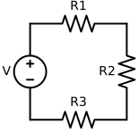
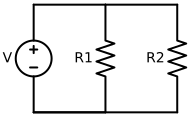
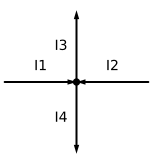
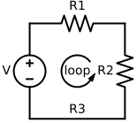
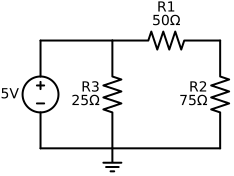
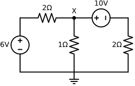

---
aliases:
  - Kirchhoff's circuit laws
tags:
  - flashcard/active/special/academia/HKUST/ELEC_1100/Kirchhoff_s_circuit_laws
  - language/in/English
---

# Kirchhoff's circuit laws

Kirchhoff's circuit laws are two fundamental principles used in the analysis of electrical networks. When a network cannot be reduced by simple series or parallel combination of components, these laws provide a systematic way to obtain the relationships among currents and voltages. The laws are attributed to Gustav Kirchhoff (1824–1887) and are direct consequences of the conservation of charge and energy.

## background

Resistors in series have an equivalent resistance $R_{\text{eq}} = R_1 + R_2 + \cdots$ because the same current flows through each element. 
 

Resistors in parallel obey $1/R_{\text{eq}} = 1/R_1 + 1/R_2 + \cdots$ since the voltage across each branch is equal and their conductances sum. 
 

Many networks consist of interconnections that are neither purely series nor purely parallel; such "complex networks" require a more general analysis. Kirchhoff's laws apply to nodes (junctions) and closed loops in an arbitrary circuit.

---

Flashcards for this section are as follows:

- origin of laws ::@:: Gustav Kirchhoff (1824–1887) formulated the current and voltage laws now bearing his name.
- purpose of laws ::@:: Provide a systematic way to relate currents and voltages when a network cannot be reduced by simple series or parallel combinations.
- series resistance formula 
  ::@:: For resistors in series, $R_{\text{eq}} = R_1 + R_2 + \cdots$ because the same current flows through each element. <!-- check: ignore-line[two_sided_calc_warning]: conceptual -->
- parallel resistance formula 
  ::@:: For resistors in parallel, $1/R_{\text{eq}} = 1/R_1 + 1/R_2 + \cdots$ since each branch has the same voltage and conductances sum. <!-- check: ignore-line[two_sided_calc_warning]: conceptual -->
- complex network definition ::@:: A circuit whose interconnections are neither purely series nor purely parallel, requiring general analysis using Kirchhoff's laws.
- applicability domain ::@:: Kirchhoff's laws apply to any network by writing equations for nodes (junctions) and closed loops.

## Kirchhoff's current law <!-- check: ignore-line[header_style_rule]: proper noun -->

Also known as the *junction rule*, Kirchhoff's current law (KCL) states that at any node in a circuit the algebraic sum of currents is zero. 
 

Equivalently, the sum of currents entering a junction equals the sum leaving it, reflecting that charge does not accumulate at a point. For a node with currents drawn in and out one may write $\sum I_{\text{in}} = \sum I_{\text{out}}$; putting all terms on one side gives relations such as $I_1+I_2-I_3-I_4=0$. The law is a discrete analogue of the continuity equation and follows from charge conservation.

---

Flashcards for this section are as follows:

- KCL alternative name ::@:: Kirchhoff's current law is also called the junction rule.
- KCL statement ::@:: At any node, the algebraic sum of currents is zero. 
 
- KCL entering vs leaving ::@:: The sum of currents entering a junction equals the sum leaving.
- KCL algebraic form ::@:: $\sum I_{\text{in}} = \sum I_{\text{out}}$; bringing all to one side gives equations like $I_1+I_2-I_3-I_4=0$. <!-- check: ignore-line[two_sided_calc_warning]: conceptual -->
- KCL sign convention ::@:: Currents assumed leaving may be taken as negative so a single summation suffices.
- KCL rationale ::@:: It follows from conservation of charge; no net charge accumulates at a point, discrete analogue of the continuity equation.

## Kirchhoff's voltage law <!-- check: ignore-line[header_style_rule]: proper noun -->

The *loop rule* or Kirchhoff's voltage law (KVL) asserts that the algebraic sum of potential differences around any closed path is zero. 
 

Traversing a loop in a chosen direction, voltage drops (positive when taken in the direction of current through a resistor) are added and rises are subtracted; the result is zero because electrostatic fields are conservative and no net work is done in completing a circuit. For a simple loop containing two resistors and a source the relation may appear as $-v + v_1 + v_2 = 0$, or equivalently $v = v_1 + v_2$. More generally $\sum V = 0$ around the loop; the sign convention depends on the assumed current direction and the orientation of the voltage sources.

---

Flashcards for this section are as follows:

- KVL alternative name ::@:: Kirchhoff's voltage law is also known as the loop rule.
- KVL statement ::@:: Around any closed path, the algebraic sum of potential differences is zero. 
 
- KVL traversal rule ::@:: When traversing a loop, add voltage drops (positive in direction of current) and subtract rises; orientation of sources matters.
- KVL example equation ::@:: For a loop with a source and two resistors: $-v + v_1 + v_2 = 0$, giving $v = v_1 + v_2$. <!-- check: ignore-line[two_sided_calc_warning]: conceptual -->
- KVL justification ::@:: Because electrostatic fields are conservative, no net work is done completing a closed circuit.

## circuit analysis using Kirchhoff's laws

A typical procedure for analysing a circuit combines KCL and KVL in a systematic way:

1. **Choose nodes and loops.** Select a reference node (usually ground) and identify a set of independent loops that cover the network without redundancy.
2. **Assign current directions.** Arbitrary arrows are drawn on each branch; a negative value in the solution indicates the actual current flows opposite the assumed direction.
3. **Write KCL equations** at the chosen nodes, expressing each branch current in the selected sign convention and setting the algebraic sum to zero.
4. **Write KVL equations** around each independent loop, summing voltage drops and rises in the traversal direction and equating the total to zero.
5. **Solve the resulting linear system** for the unknowns (currents, voltages, or resistances).

The current-direction freedom is important: any choice leads to a correct system, with negative solutions signalling reversal. Both KCL and KVL may be used interchangeably; a given problem may be easier to handle with one method or the other depending on the circuit topology.

---

Flashcards for this section are as follows:

- analysis overview ::@:: Circuit analysis combines KCL and KVL systematically.
- step 1 choose nodes/loops ::@:: Select a reference node (ground) and identify independent loops covering the network without redundancy.
- step 2 assign directions ::@:: Arbitrary current arrows are drawn; negative solutions indicate actual flow is opposite.
- step 3 write KCL ::@:: Form equations at nodes with chosen sign conventions, set algebraic sum to zero.
- step 4 write KVL ::@:: Form loop equations by summing drops and rises in traversal direction, set to zero.
- step 5 solve system ::@:: Solve the resulting linear equations for unknown currents, voltages, or resistances.
- method flexibility ::@:: Either KCL or KVL may be used preferentially depending on topology; the choice of current directions is immaterial.

## integrated numerical calculations

The numerical examples from the lecture illustrate the application of the procedure.

A node with a $5\,\text{V}$ source connected to three resistors $R_1=50\,\Omega$, $R_2=75\,\Omega$, $R_3=25\,\Omega$ yields, by KCL at node 1, where $I_1$ enters from the left, $I_2$ leaves to the right, and $I_3$ leaves downwards, $I_1 = I_2 + I_3 =  \frac{V}{R_1+R_2} + \frac{V}{R_3} = 0.24\,\text{A}$; hence $I_2=0.04\,\text{A}$ and $I_3=0.20\,\text{A}$.  The same circuit solved by two-loop KVL with loop currents $I_1,I_2$ gives the equations $-5 + 25(I_1 - I_2)=0$ and $(50+75)I_2 + 25(I_2 - I_1)=0$, which also produce $I_1=0.24\,\text{A}$ and $I_2=0.04\,\text{A}$.  The corresponding circuit is shown below. 
 

A more elaborate bridge network with two sources ($6\,\text{V}$ left, $10\,\text{V}$ right) and a central $1\,\Omega$ resistor illustrates the flexibility in choosing loop directions.  The corresponding schematic is shown below. 
 

With clockwise left loop $I_1$ and counterclockwise right loop $I_2$ the KVL system is $-6 + 2I_1 + (I_1+I_2)=0$, $-10 + (I_1+I_2) + 2I_2=0$, yielding $I_1=1\,\text{A}$ and $I_2=3\,\text{A}$ and node voltage $V_X=(I_1+I_2)\times1\,\Omega=4\,\text{V}$. If $I_2$ is instead drawn clockwise the equations become $-6 + 2I_1 + (I_1 - I_2)=0$, $(I_2 - I_1) + 10 + 2I_2=0$, and solving gives $I_1=1\,\text{A}$, $I_2=-3\,\text{A}$; the negative value merely reflects the reversed arrow. The computed voltage $V_X=4\,\text{V}$ is unchanged.

Node analysis of the same configuration labels the currents entering node $X$ from the left source $I_A$, downward through the $1\,\Omega$ resistor $I_B$, and from the right branch $I_C$. Ohm's law produces $I_A=(6-V_X)/2$, $I_B=V_X$, $I_C=(V_X-10)/2$, and KCL $I_A=I_B+I_C$ leads to $V_X=4\,\text{V}$ with branch currents $1\,\text{A}$, $4\,\text{A}$, $-3\,\text{A}$.

---

Flashcards for this section are as follows:

- KCL calculation: for the same 5 V node example, compute $I_1,I_2,I_3$ using $I_1=I_2+I_3$ and Ohm's law. 
 $I_1$ is the current entering the node, $I_2$ is the current leaving to the right, and $I_3$ is the current leaving downwards. 
  ::@:: $I_1 = I_2 + I_3 = V/(R_1+R_2) + V/R_3 = 0.24\,\text{A}$ giving $I_2=0.04\,\text{A}$, $I_3=0.20\,\text{A}$.
- two-loop KVL equations: write the KVL system for the 5 V circuit with two loops carrying currents $I_1,I_2$. 
 $I_1$ is the current in the left loop in clockwise direction, and $I_2$ is the current in the right loop in clockwise direction. 
  ::@:: $-5 + 25(I_1 - I_2)=0$ and $(50+75)I_2 + 25(I_2 - I_1)=0$ yield $I_1=0.24\,\text{A}$, $I_2=0.04\,\text{A}$.
- bridge network currents: for a bridge with left source 6 V, right source 10 V and central 1 Ω resistor, find loop currents $I_1,I_2$ and node voltage $V_X$ for the chosen directions. 
 $I_1$ is the current in the left loop in clockwise direction, and $I_2$ is the current in the right loop in counterclockwise direction. 
  ::@:: With $6\,\text{V}$ left and $10\,\text{V}$ right sources, $I_1=1\,\text{A}$, $I_2=3\,\text{A}$ and $V_X=4\,\text{V}$ using chosen loop directions.
- loop reversal effect: what happens to $I_2$ and $V_X$ if the right loop arrow is reversed in the previous bridge example? 
 $I_1$ is still the current in the left loop in clockwise direction, but $I_2$ is now the current in the right loop in clockwise direction. 
  ::@:: Reversing right loop direction changes sign of $I_2$ to $-3\,\text{A}$ but leaves $V_X=4\,\text{V}$ unchanged.
- node analysis of bridge: using node X with currents $I_A,I_B,I_C$, express them in terms of $V_X$ and solve for $V_X$ and branch currents. 
 $I_A$ is the current entering node X from the left source, $I_B$ is the current downward through the 1 Ω resistor, and $I_C$ is the current from the right branch. 
  ::@:: $I_A=(6-V_X)/2$, $I_B=V_X$, $I_C=(V_X-10)/2$ with KCL yields $V_X=4\,\text{V}$ and branch currents 1 A, 4 A, -3 A.

## equivalence and application

Each application of KCL or KVL produces a linear equation relating unknowns (voltages, currents, or resistances). A sufficient number of independent equations allows the circuit to be solved uniquely. For networks where series and parallel simplification fail—such as bridges—a test source $V$ may be attached across the terminals, the laws applied to determine the total current $I$, and the equivalent resistance computed as $R_{\text{eq}} = V/I$.

---

Flashcards for this section are as follows:

- independence principle ::@:: A sufficient number of independent KCL/KVL equations uniquely determines circuit unknowns.
- when to apply ::@:: Use Kirchhoff's laws when series/parallel simplification fails, as in bridge circuits.
- equivalent resistance technique ::@:: Attach a test voltage source $V$, compute total current $I$ by KCL/KVL, then $R_{\text{eq}} = V/I$. <!-- check: ignore-line[two_sided_calc_warning]: conceptual -->
