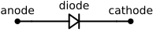
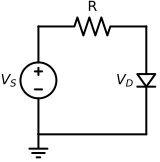

---
aliases:
  - diode
  - pn junction diode
tags:
  - flashcard/active/special/academia/HKUST/ELEC_1100/diode
  - language/in/English
---

# diode

A diode is a two-terminal semiconductor device that allows current to flow primarily in one direction. In this course it is used both as a simple nonlinear element (for rectifying or limiting voltages) and as the building block for more complex devices such as [Zener regulators](voltage%20regulator.md#diode%20and%20zener%20diode%20as%20regulators) and [bipolar junction transistors](transistor.md). 
 

---

Flashcards for this section are as follows:

- diode definition: What does a diode do in terms of current direction? ::@:: A diode is a two-terminal device that allows current to flow primarily in one direction (forward bias) and blocks it in the opposite direction (reverse bias). <!--SR:!2026-06-03,59,310!2026-05-17,43,290-->
- diode course role: Why do we study diodes before transistors and regulation? ::@:: The PN junction diode is the core building block inside BJTs and Zener regulators, so diode I–V and biasing ideas transfer directly to those devices. <!--SR:!2026-06-03,59,310!2026-05-19,44,290-->
- schematic symbol: diode 
  ::@:: Diode symbol showing the one-way conduction element; current is intended to flow from anode to cathode when forward biased. <!--SR:!2026-05-29,55,310!2026-04-06,16,290-->

## pn junction and biasing

A PN junction diode is made by joining P-type and N-type semiconductor regions; at the junction a depletion region forms with a built-in barrier potential of about $0.7\text{ V}$ for silicon. The diode terminals are called anode (P side) and cathode (N side). When the anode is at a higher potential than the cathode (forward bias), the barrier is reduced and current can flow; when the anode is at a lower potential (reverse bias), the barrier increases and only a very small leakage current flows. On the physical diodes used in ELEC 1100, the cathode is marked by a stripe (often black) on the package, so “black strip is negative”; the small-signal diode is a thinner body, while the Zener diode used for regulation is a slightly fatter package but still uses the stripe to mark the cathode.

Biasing refers to how an external voltage source is connected to the diode. In this course, we adopt the conventional current direction from the anode (+) to the cathode (−) when the diode is forward biased. When the diode is reverse biased, we model it as an open circuit (no current).

---

Flashcards for this section are as follows:

- pn junction diode formation: How is a PN junction diode formed? ::@:: It is formed by joining P-type and N-type semiconductor regions; a depletion region forms at the junction. <!--SR:!2026-04-06,16,290!2026-04-06,16,290-->
- silicon barrier potential (about $0.7\text{ V}$): What is the typical built-in barrier potential for a silicon PN junction? ::@:: About $0.7\text{ V}$ (silicon). <!--SR:!2026-04-06,16,290!2026-06-07,63,310-->
- diode terminals: Which side is anode/cathode in a PN diode? ::@:: P side is the anode; N side is the cathode. <!--SR:!2026-05-31,57,310!2026-06-04,60,310-->
- diode forward vs reverse bias: What is forward bias vs reverse bias (in terms of anode/cathode potential)? ::@:: Forward bias means anode at higher potential than cathode (current can flow). Reverse bias means anode at lower potential than cathode (current is blocked except leakage). <!--SR:!2026-05-29,55,310!2026-04-06,16,290-->
- conventional current direction in a diode: In forward bias, what direction does conventional current flow? ::@:: From the anode (+) to the cathode (−) through the diode. <!--SR:!2026-04-06,16,290!2026-05-28,54,310-->
- lab diode orientation: On the lab diodes, which terminal does the black stripe mark, and how do you use it when wiring? ::@:: The black stripe on the package marks the cathode (negative end); in circuits you connect the stripe end to the more negative node, leaving the unmarked end as the anode. <!--SR:!2026-05-31,57,310!2026-06-06,62,310-->

## diode i–v characteristic and models

The exact diode I–V curve is nonlinear, but for introductory circuit analysis we use a simplified piecewise model. In the ideal-diode model, the diode is a short circuit when forward biased and an open circuit when reverse biased. A more realistic model for silicon uses a constant forward drop $V_{\text{on}}\approx0.7\text{ V}$ when conducting: if the diode is on we approximate $V_D\approx0.7\text{ V}$, and if off we take $I_D\approx0$.

Circuit analysis with this model often proceeds by first assuming a diode state (ON or OFF), replacing it with the corresponding equivalent circuit (short with $0.7\text{ V}$ drop or open), solving for currents and voltages using [Kirchhoff's circuit laws](Kirchhoff%27s%20circuit%20laws.md) and Ohm's law, and then checking whether the assumption is self-consistent (e.g. whether the resulting diode voltage and current match the assumed region).

---

Flashcards for this section are as follows:

- ideal diode model ::@:: In the ideal model the diode is a short circuit when forward biased and an open circuit when reverse biased. <!--SR:!2026-04-06,16,290!2026-05-30,56,310-->
- constant-voltage diode model: In the constant-voltage model, what approximate forward drop do we assume for a silicon diode (about $0.7\text{ V}$)? ::@:: We use a constant forward drop of about $0.7\text{ V}$ for a conducting silicon diode. <!--SR:!2026-06-04,60,310!2026-04-06,16,290-->
- diode region assumption method: Step 1 and 2 (assume state + equivalent; ON uses $0.7\text{ V}$ drop): what do you do? ::@:: Assume the diode is ON or OFF, then replace it with the corresponding equivalent circuit (ON: short/short + $0.7\text{ V}$ drop; OFF: open circuit). <!--SR:!2026-04-06,16,290!2026-06-05,61,310-->
- diode region assumption method: Step 3 and 4 (solve + check $V_D$, $I_D$): what do you do? ::@:: Solve for currents/voltages using KVL/Ohm’s law, then check that the resulting $V_D$ and $I_D$ are consistent with the assumed ON/OFF region; if inconsistent, flip the assumption and re-solve. <!--SR:!2026-06-01,58,310!2026-05-28,54,310-->

## simple diode circuit analysis and safety

For a series source–resistor–diode circuit, we can use the constant-drop model to find the current. If the supply voltage $V_S$ is less than about $0.7\text{ V}$, the diode is off and no current flows; the circuit behaves like an open switch. If $V_S$ exceeds $0.7\text{ V}$ and the diode is forward biased, we approximate $V_D\approx0.7\text{ V}$ and find $I_D\approx(V_S-0.7\text{ V})/R$ and $V_R\approx V_S-0.7\text{ V}$. 
 

It is important to include a series resistor (typically around $1\text{ k}\Omega$ in lab circuits) with a diode or LED; otherwise the current can become very large when the diode turns on, potentially damaging the diode, LED, or other components.

---

Flashcards for this section are as follows:

- series diode circuit example: In a series source–resistor–diode circuit with $V_S$, $R$, and a forward-biased diode modelled with $V_D\approx0.7\text{ V}$, what is the approximate current? 
  ::@:: Use $I_D\approx(V_S-0.7\text{ V})/R$ when $V_S>0.7\text{ V}$ and the diode is forward biased. <!--SR:!2026-04-06,16,290!2026-05-16,42,290-->
- diode off condition: In a series source–resistor–diode circuit, when is the diode effectively off ($I_D\approx0$) in the constant-drop model? 
  ::@:: When the applied source $V_S$ is less than about $0.7\text{ V}$ in the forward direction, the diode is off and $I_D\approx0$. <!--SR:!2026-06-01,58,310!2026-06-06,62,310-->
- need for series resistor with diode/LED: Why do we include a series resistor (often about $1\text{ k}\Omega$) with a diode or LED? ::@:: A series resistor (often $\approx1\text{ k}\Omega$) limits current through a forward-biased diode or LED; without it, current can become very large and damage the components. <!--SR:!2026-06-07,63,310!2026-06-05,61,310-->
