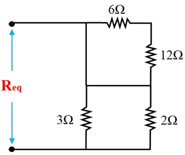

---
aliases:
  - ELEC 1100 tutorial 2 tutorial
  - HKUST ELEC 1100 tutorial 2 quiz content
  - HKUST ELEC 1100 tutorial 2 tutorial
tags:
  - flashcard/active/special/academia/HKUST/ELEC_1100/tutorials/tutorial_2/tutorial
  - language/in/English
---

# tutorial

- HKUST ELEC 1100 tutorial 2
- parent: [tutorial 2](index.md)

---

- title: Quiz 01 (in Tutorial 02)
- points: 2
- grade: 2/2
- submitting: a quiz

---

No additional details were added for this assignment.

## attachments

- [`req_circuit.jpg`](attachments/req_circuit.jpg)

## quiz

> Find the equivalent resistance $R_{\text{eq}}$ for the below circuit (unit: $\Omega$).
>
> 
>
> 1. $1$
> 2. $1.2$
> 3. $2$
> 4. $2.4$
>
> - solution: $2.4$
