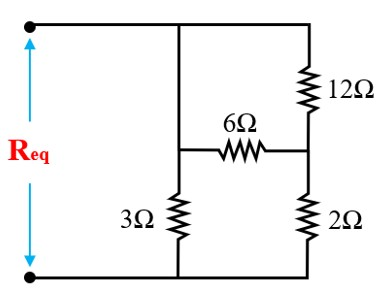

---
aliases:
  - ELEC 1100 tutorial 2 tutorial
  - HKUST ELEC 1100 tutorial 2 quiz content
  - HKUST ELEC 1100 tutorial 2 tutorial
tags:
  - flashcard/active/special/academia/HKUST/ELEC_1100/tutorials/tutorial_2/tutorial
  - language/in/English
---

# tutorial

- HKUST ELEC 1100 tutorial 2
- parent: [tutorial 2](index.md)

---

- title: Quiz 01 (in Tutorial 02)
- points: 2
- grade: 2/2
- submitting: a quiz

---

No additional details were added for this assignment.

## attachments

- [`req_circuit_variant.jpg`](attachments/req_circuit_variant.jpg)
- [`req_circuit_shorted.jpg`](attachments/req_circuit_shorted.jpg)

## quiz

> Find the equivalent resistance $R_{\text{eq}}$ for the below circuit (unit: $\Omega$).
>
> 
>
> 1. $1$
> 2. $1.2$
> 3. $2$
> 4. $2.4$
>
> - solution: {@{$2\text{ Ω}$}@}
> - explanation: {@{The $12\ \Omega$ and $6\ \Omega$}@} are in {@{parallel ($4\ \Omega$)}@}, in {@{series with $2\ \Omega$ ($6\ \Omega$)}@}, then in {@{parallel with $3\ \Omega$}@}: {@{$R_{\text{eq}} = \frac{3 \times 6}{3 + 6} = 2\ \Omega$}@}.

<!-- markdownlint MD028 -->

> Find the equivalent resistance $R_{\text{eq}}$ for the below circuit (unit: $\Omega$).
>
> 
>
> 1. $1$
> 2. $1.2$
> 3. $2$
> 4. $2.4$
>
> - solution: {@{$1.2\text{ Ω}$}@}
> - explanation: {@{The short-circuit line}@} bypasses {@{the $6\ \Omega$ and $12\ \Omega$ resistors}@}. The $3\ \Omega$ and $2\ \Omega$ are {@{in parallel}@}: {@{$R_{\text{eq}} = \frac{3 \times 2}{3 + 2} = 1.2\ \Omega$}@}.
