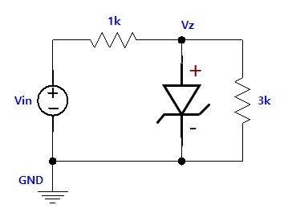

---
aliases:
  - ELEC 1100 tutorial 3 tutorial
  - HKUST ELEC 1100 tutorial 3 quiz content
  - HKUST ELEC 1100 tutorial 3 tutorial
tags:
  - flashcard/active/special/academia/HKUST/ELEC_1100/tutorials/tutorial_3/tutorial
  - language/in/English
---

# tutorial

- HKUST ELEC 1100 tutorial 3
- parent: [tutorial 3](index.md)

---

- title: Quiz 02 (in Tutorial 03)
- points: 2
- grade: 1/2
- submitting: a quiz

---

No additional details were added for this assignment.

## attachments

- [`zener_circuit.jpg`](attachments/zener_circuit.jpg)

## quiz

> Given that $V_{on} = 0.7\text{ V}$, when $V_{in} = 16\text{ V}$, what is the value of $V_{out}$?
>
> 
>
> 1. $0.7\text{ V}$
> 2. $5.7\text{ V}$
> 3. $12\text{ V}$
> 4. $16\text{ V}$
>
> - solution: $12\text{ V}$

<!-- markdownlint MD028 -->

> Given that $V_{on} = 0.7\text{ V}$, $V_{bd} = 5.7\text{ V}$, when $V_{in} = 16\text{ V}$, what is the value of $V_{out}$?
>
> 
>
> 1. $0.7\text{ V}$
> 2. $5.7\text{ V}$
> 3. $12\text{ V}$
> 4. $16\text{ V}$
>
> - solution: $5.7\text{ V}$
> - explanation: The Zener diode clamps the output at its breakdown voltage $V_{bd} = 5.7\text{ V}$ when the input exceeds it.
