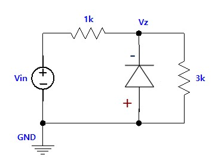

---
aliases:
  - ELEC 1100 tutorial 3 tutorial
  - HKUST ELEC 1100 tutorial 3 quiz content
  - HKUST ELEC 1100 tutorial 3 tutorial
tags:
  - flashcard/active/special/academia/HKUST/ELEC_1100/tutorials/tutorial_3/tutorial
  - language/in/English
---

# tutorial

- HKUST ELEC 1100 tutorial 3
- parent: [tutorial 3](index.md)

---

- title: Quiz 02 (in Tutorial 03)
- points: 2
- grade: 1/2
- submitting: a quiz

---

No additional details were added for this assignment.

## attachments

- [`zener_circuit_q1.jpg`](attachments/zener_circuit_q1.jpg)
- [`zener_circuit_q2.jpg`](attachments/zener_circuit_q2.jpg)

## quiz

> Given that $V_{on} = 0.7\text{ V}$, $V_{bd} = 5.7\text{ V}$, when $V_{in} = 16\text{ V}$, what is the value of $V_Z$?
>
> 
>
> 1. $0.7\text{ V}$
> 2. $5.7\text{ V}$
> 3. $12\text{ V}$
> 4. $16\text{ V}$
>
> - solution: {@{$5.7\text{ V}$}@}
> - explanation: The Zener is {@{reverse-biased (cathode at $V_Z$, anode at ground)}@}. {@{Open-circuit voltage}@}: {@{$V_{Z,\text{open}} = 16 \times \frac{3k}{1k + 3k} = 12\text{ V}$}@}. Since {@{$12\text{ V} > V_{bd} = 5.7\text{ V}$}@}, the Zener clamps at {@{$V_Z = 5.7\text{ V}$}@}. <!--SR:!fsrs,2026-11-02T00:00:00.000Z,8,8.2956,1,2,1,0,0,2026-10-25T00:00:00.000Z!fsrs,2026-11-02T00:00:00.000Z,8,8.2956,1,2,1,0,0,2026-10-25T00:00:00.000Z!fsrs,2026-11-02T00:00:00.000Z,8,8.2956,1,2,1,0,0,2026-10-25T00:00:00.000Z!fsrs,2026-11-02T00:00:00.000Z,8,8.2956,1,2,1,0,0,2026-10-25T00:00:00.000Z!fsrs,2026-11-02T00:00:00.000Z,8,8.2956,1,2,1,0,0,2026-10-25T00:00:00.000Z!fsrs,2026-11-02T00:00:00.000Z,8,8.2956,1,2,1,0,0,2026-10-25T00:00:00.000Z-->

<!-- markdownlint MD028 -->

> Given that $V_{on} = 0.7\text{ V}$, $V_{bd} = 5.7\text{ V}$, when $V_{in} = 16\text{ V}$, what is the value of $V_Z$?
>
> 
>
> 1. $0.7\text{ V}$
> 2. $5.7\text{ V}$
> 3. $12\text{ V}$
> 4. $16\text{ V}$
>
> - solution: {@{$0.7\text{ V}$}@}
> - explanation: The diode is {@{forward-biased (anode at $V_Z$, cathode at ground)}@}. In {@{forward bias}@} it conducts {@{like a standard p-n junction}@}, clamping at {@{$V_Z = V_{on} = 0.7\text{ V}$}@}. <!--SR:!fsrs,2026-11-02T00:00:00.000Z,8,8.2956,1,2,1,0,0,2026-10-25T00:00:00.000Z!fsrs,2026-11-02T00:00:00.000Z,8,8.2956,1,2,1,0,0,2026-10-25T00:00:00.000Z!fsrs,2026-11-02T00:00:00.000Z,8,8.2956,1,2,1,0,0,2026-10-25T00:00:00.000Z!fsrs,2026-11-02T00:00:00.000Z,8,8.2956,1,2,1,0,0,2026-10-25T00:00:00.000Z!fsrs,2026-11-02T00:00:00.000Z,8,8.2956,1,2,1,0,0,2026-10-25T00:00:00.000Z-->
