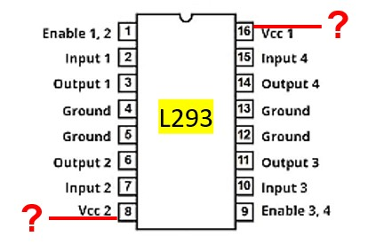

---
aliases:
  - ELEC 1100 tutorial 6 tutorial
  - HKUST ELEC 1100 tutorial 6 quiz content
  - HKUST ELEC 1100 tutorial 6 tutorial
tags:
  - flashcard/active/special/academia/HKUST/ELEC_1100/tutorials/tutorial_6/tutorial
  - language/in/English
---

# tutorial

- HKUST ELEC 1100 tutorial 6
- parent: [tutorial 6](index.md)

---

- title: Quiz 03 (in Tutorial 06)
- points: 2
- grade: 2/2
- submitting: a quiz

---

No additional details were added for this assignment.

## attachments

- [`l293_pinout.jpg`](attachments/l293_pinout.jpg)

## quiz

> For the L293 motor driver, what voltage value should be given to its pin 8 and pin 16?
>
> 
>
> 1. $0\text{ V}$ and $5\text{ V}$
> 2. $0\text{ V}$ and $12\text{ V}$
> 3. $12\text{ V}$ and $0\text{ V}$
> 4. $12\text{ V}$ and $5\text{ V}$
>
> - solution: {@{$12\text{ V}$ (pin 8, VS) and $5\text{ V}$ (pin 16, VCC)}@}
> - explanation: {@{Pin 8 (VS)}@} is {@{the motor supply $12\text{ V}$}@}, {@{pin 16 (VCC)}@} is {@{the logic supply $5\text{ V}$}@}. <!--SR:!fsrs,2026-11-02T00:00:00.000Z,8,8.2956,1,2,1,0,0,2026-10-25T00:00:00.000Z!fsrs,2026-11-02T00:00:00.000Z,8,8.2956,1,2,1,0,0,2026-10-25T00:00:00.000Z!fsrs,2026-11-02T00:00:00.000Z,8,8.2956,1,2,1,0,0,2026-10-25T00:00:00.000Z!fsrs,2026-11-02T00:00:00.000Z,8,8.2956,1,2,1,0,0,2026-10-25T00:00:00.000Z!fsrs,2026-11-02T00:00:00.000Z,8,8.2956,1,2,1,0,0,2026-10-25T00:00:00.000Z-->

<!-- markdownlint MD028 -->

> If you decide to use 3 sensors to do line tracking, how many combinations in a 3-inputs truth table?
>
> 1. $6$
> 2. $8$
> 3. $12$
> 4. $16$
>
> - solution: {@{$8$}@}
> - explanation: {@{A truth table with $n$ inputs}@} has {@{$2^n$ combinations}@}. For {@{$n=3$}@}, {@{$2^3 = 8$}@}. <!--SR:!fsrs,2026-11-02T00:00:00.000Z,8,8.2956,1,2,1,0,0,2026-10-25T00:00:00.000Z!fsrs,2026-11-02T00:00:00.000Z,8,8.2956,1,2,1,0,0,2026-10-25T00:00:00.000Z!fsrs,2026-11-02T00:00:00.000Z,8,8.2956,1,2,1,0,0,2026-10-25T00:00:00.000Z!fsrs,2026-11-02T00:00:00.000Z,8,8.2956,1,2,1,0,0,2026-10-25T00:00:00.000Z-->
