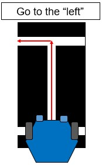

---
aliases:
  - ELEC 1100 tutorial 7 tutorial
  - HKUST ELEC 1100 tutorial 7 quiz content
  - HKUST ELEC 1100 tutorial 7 tutorial
tags:
  - flashcard/active/special/academia/HKUST/ELEC_1100/tutorials/tutorial_7/tutorial
  - language/in/English
---

# tutorial

- HKUST ELEC 1100 tutorial 7
- parent: [tutorial 7](index.md)

---

- title: Quiz 04 (in Tutorial 07)
- points: 2
- grade: 1/2
- submitting: a quiz

---

No additional details were added for this assignment.

## attachments

- [`robot_sensor.jpg`](attachments/robot_sensor.jpg)

## quiz

> At what sensor reading (s), the motors should do "0 1" rotation?
>
> 
>
> 1. $0\;0$
> 2. $0\;1$
> 3. $1\;0$
> 4. $1\;1$
>
> - solution: $0\;1$
> - explanation: A "0 1" motor rotation means left motor off, right motor on, which corresponds to sensor reading $0\;1$.

<!-- markdownlint MD028 -->

> Select the below statement(s) that could turn ON the LED.
>
> 1. `digitalWrite(ledPin, 1);`
> 2. `digitalWrite(ledPin, -5);`
> 3. `digitalWrite(ledPin, 1==5);`
> 4. `digitalWrite(ledPin, 1<5);`
>
> - solution: 1 and 4
> - explanation: `digitalWrite` treats any nonzero value as HIGH. `1` is nonzero (HIGH), `1==5` evaluates to `0` (LOW), `1<5` evaluates to `1` (HIGH). `-5` is nonzero but may behave unexpectedly on some platforms.
