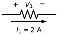
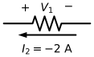
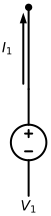
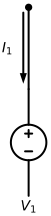

---
aliases:
  - ELEC 2400 tutorial 2 tutorial
  - ELEC2400 tutorial 2 tutorial
  - HKUST ELEC 2400 tutorial 2 tutorial
  - HKUST ELEC2400 tutorial 2 tutorial
tags:
  - flashcard/active/special/academia/HKUST/ELEC_2400/tutorials/tutorial_2/tutorial
  - language/in/English
---

# tutorial

- HKUST ELEC 2400 tutorial 2
- parent: [tutorial 2](index.md)

## sign of Ohm's law under the reference direction

A $4\ \Omega$ resistor marked $+$ on one end and $-$ on the other gives $8\text{ V}$ whichever way the current arrow is drawn. With the arrow running from the $+$ mark to the $-$ mark, $V_1 = +I_1R = +(2\text{ A})(4\ \Omega) = +8\text{ V}$. With the arrow reversed and the value written $I_1 = -2\text{ A}$, $V_1 = -I_1R = -(-2\text{ A})(4\ \Omega) = +8\text{ V}$: the arrow is a reference direction, so reversing it reverses the sign of the current too. 
  

A voltage marked across a plain wire is zero however much current the wire carries: the wire is one node, so its two ends sit at the same potential and $V_2 = 0$.

---

Flashcards for this section are as follows:

- overview ::@:: The sign in $V = IR$ is fixed by the drawn current arrow: $V = +IR$ when the arrow runs from the $+$ mark to the $-$ mark, and $V = -IR$ when it runs the other way. <!-- check: ignore-line[two_sided_calc_warning]: conceptual -->
- arrow with the marks: a $4\ \Omega$ resistor carries $I_1 = 2\text{ A}$ along an arrow running from its $+$ mark to its $-$ mark; what is $V_1$? ::@:: $V_1 = +I_1R = (2\text{ A})(4\ \Omega) = +8\text{ V}$.
- arrow against the marks: the same resistor carries $I_1 = -2\text{ A}$ along an arrow running from its $-$ mark to its $+$ mark; what is $V_1$? ::@:: $V_1 = -I_1R = -(-2\text{ A})(4\ \Omega) = +8\text{ V}$.
- why reversing the arrow changes nothing: why does reversing the current arrow on a resistor leave the voltage across it unchanged? ::@:: The arrow is only a reference direction, so reversing it reverses the sign of the reported current: $+2\text{ A}$ against the marks and $-2\text{ A}$ with them give the same $+8\text{ V}$. <!-- check: ignore-line[two_sided_calc_warning]: conceptual -->
- voltage across a wire: a plain wire carries a current, and a voltage $V_2$ is marked across a section of it; what is $V_2$? ::@:: $V_2 = 0$: the wire is one node, so its two ends sit at the same potential.

## series and parallel connections

Three resistors in a chain share one current and are equivalent to their sum, $R_{\text{eq}} = R_1 + R_2 + R_3$. Three resistors hung between the same two rails share one voltage and are equivalent to a single resistor whose reciprocal is the sum of the reciprocals, $\frac{1}{R_{\text{eq}}} = \frac{1}{R_1} + \frac{1}{R_2} + \frac{1}{R_3}$.

Which rule a pair falls under is settled by the nodes rather than by the drawing. Two elements are in series when they share both terminals and no other element reaches the node between them, and in parallel when they span the same two nodes. Two elements sharing only one terminal are neither, because another element reaching that terminal lets current branch there.

A worked case has to state the nodes, since the pair's verdict is read off them. $R_1$ and $R_2$ meet at a node that reaches nothing else, their far ends being on $P$ and $S$: in series. $R_3$ and $R_4$ both join $P$ to $Q$: in parallel. $R_5$ and $R_6$ share node $P$, and $R_7$ reaches $P$ as well, so the pair is neither.

---

Flashcards for this section are as follows:

- overview ::@:: Resistors in a chain share one current and give $R_{\text{eq}} = R_1 + R_2 + R_3$; resistors spanning the same two nodes share one voltage and give $\frac{1}{R_{\text{eq}}} = \frac{1}{R_1} + \frac{1}{R_2} + \frac{1}{R_3}$. <!-- check: ignore-line[two_sided_calc_warning]: conceptual -->
- series criterion: when are two elements in series? ::@:: When they share both terminals and no other element reaches the node between them, so a single current runs through both.
- parallel criterion: when are two elements in parallel? ::@:: When they span the same two nodes, so both carry the same voltage.
- one shared terminal: two elements share one terminal and a third element also reaches it; are the two in series or in parallel? ::@:: Neither: the third element lets current branch at the shared terminal, so the pair is neither series nor parallel.
- a series case: $R_1$ and $R_2$ meet at one node that reaches nothing else, their far ends being on $P$ and $S$; which? ::@:: In series, since the same current runs through both.
- a parallel case: $R_3$ and $R_4$ both join node $P$ to node $Q$; which? ::@:: In parallel, since they span the same two nodes.
- a neither case: $R_5$ and $R_6$ share node $P$, and $R_7$ reaches $P$ as well; which? ::@:: Neither, since current can branch at $P$ and neither combination rule applies.

## current direction around a source

A $10\text{ V}$ source with its $+$ terminal on top drives a $1\ \Omega$ resistor back to its $-$ terminal. The current leaves the source at the terminal marked $+$ and runs along the top of the loop into the resistor, and that is what makes the source deliver energy while the resistor dissipates it. Taking the $-$ terminal as ground puts the top of the loop at $10\text{ V}$ and the bottom at $0\text{ V}$.

The load settles the direction, not the source, once the load is known. Put a battery charger where the resistor was and the current at the top of the source runs the other way, into the $+$ terminal, so the $10\text{ V}$ source is being charged. Leave the load unspecified and the direction cannot be determined from the source alone.

---

Flashcards for this section are as follows:

- overview ::@:: The load fixes which way the current runs at a source: a resistor load draws current out of the $+$ terminal, a load that is itself a source drives current back into the $+$ terminal, and an unspecified load leaves the direction undetermined. <!-- check: ignore-line[two_sided_calc_warning]: conceptual -->
- resistor load: a $10\text{ V}$ source with its $+$ terminal on top drives a $1\ \Omega$ resistor; which way does the current run along the top of the loop? ::@:: Away from the source, out of its $+$ terminal and into the resistor.
- what the source does: the current leaves the $10\text{ V}$ source at its $+$ terminal; what does the source do? ::@:: It delivers energy to the circuit.
- what the resistor does: the current enters the $1\ \Omega$ resistor; what does the resistor do? ::@:: It absorbs energy and dissipates it as heat.
- battery charger load: the $1\ \Omega$ resistor is replaced by a battery charger; which way does the current at the top of the $10\text{ V}$ source run? ::@:: Into the $+$ terminal, the opposite way, so the source is being charged.
- unspecified load: a $10\text{ V}$ source drives a load that has not been stated; which way does the current leave it? ::@:: It cannot be determined, since the direction follows from the load and the load is unknown.
- node potentials: a $10\text{ V}$ source is grounded at its $-$ terminal and a $1\ \Omega$ resistor closes the loop; what are the potentials at the top and the bottom of the resistor? ::@:: $10\text{ V}$ at the top and $0\text{ V}$ at the bottom.

## absorbing and delivering power

Whether an element absorbs or delivers is not readable from the drawing alone, since it depends on the current: with the current value left out the sign of the product is unknown and no verdict follows. The drawing settles the convention, and the convention settles the sign of the formula. An arrow leaving the terminal marked $+$ makes the current entering that terminal $-I_1$, so the power is written $P_1 = -V_1I_1$; an arrow entering the terminal marked $+$ gives $P_2 = +V_2I_2$. 
  

A positive power means the element absorbs and dissipates, a negative power that it delivers. With $V_1 = 4\text{ V}$ and the arrow leaving the terminal marked $+$, the value $I_1 = -2\text{ A}$ says the real current runs the other way, into that terminal, and $P_1 = -(4\text{ V})(-2\text{ A}) = +8\text{ W}$, so the element absorbs $8\text{ W}$.

---

Flashcards for this section are as follows:

- overview ::@:: The current arrow read against the $+$ mark fixes the sign of the power: $P = -VI$ when the arrow leaves the $+$ terminal, and $P = +VI$ when it enters. <!-- check: ignore-line[two_sided_calc_warning]: conceptual -->
- what the sign means: a positive power over an element means what, and a negative one? ::@:: Positive means the element absorbs and dissipates the power; negative means it delivers power.
- no current value: an element carries a marked voltage and a drawn current arrow but no current value; can it be called absorbing or delivering? ::@:: No: the sign of the product stays unknown, so no verdict follows.
- arrow leaving the plus mark: the current arrow leaves the terminal marked $+$; what sign does the power take? ::@:: $P = -VI$, because the current entering the $+$ terminal is $-I$.
- arrow entering the plus mark: the current arrow enters the terminal marked $+$; what sign does the power take? ::@:: $P = +VI$, as written.
- negative reference current: an element has $V_1 = 4\text{ V}$, its current arrow leaves the $+$ terminal, and $I_1 = -2\text{ A}$; what is its power and what is it doing? ::@:: $P_1 = -(4\text{ V})(-2\text{ A}) = +8\text{ W}$, and it absorbs $8\text{ W}$.

## what an ideal source fixes

An ideal source fixes one terminal quantity and leaves the other to the circuit. A $10\text{ V}$ ideal voltage source holds $V_{ab} = 10\text{ V}$ across its terminals whatever load is attached, while the current through it takes whatever value the load demands, of either sign. A $10\text{ A}$ ideal current source holds $I = 10\text{ A}$ through its terminals whatever load is attached, while the voltage $V_{ab}$ across it takes whatever value the load demands, of either sign.

---

Flashcards for this section are as follows:

- overview ::@:: An ideal source fixes one terminal quantity and leaves the other to the load: a voltage source fixes its terminal voltage, a current source fixes its terminal current.
- ideal voltage source: a $10\text{ V}$ ideal voltage source drives any load; what are $V_{ab}$ and $I$? ::@:: $V_{ab} = 10\text{ V}$ always, while $I$ is undetermined and may take any value, positive or negative, as the load demands.
- ideal current source: a $10\text{ A}$ ideal current source drives any load; what are $I$ and $V_{ab}$? ::@:: $I = 10\text{ A}$ always, while $V_{ab}$ is undetermined and may take any value, positive or negative, as the load demands.

## sign convention at a node

At a node where four branches meet, call the two currents drawn into the node $i_1$ and $i_2$ and the two drawn out $i_3$ and $i_4$. Kirchhoff's current law then reads $\sum I_{\text{in}} = \sum I_{\text{out}}$, that is $i_1 + i_2 = i_3 + i_4$.

Written instead as a single zero sum, each current counts with the sign of the direction its arrow was given. Taking _in_ as positive gives $i_1 + i_2 + (-1)i_3 + (-1)i_4 = 0$; taking _out_ as positive gives $(-1)i_1 + (-1)i_2 + i_3 + i_4 = 0$. The choice of which direction counts as positive is free, and the two forms constrain the node identically.

---

Flashcards for this section are as follows:

- overview ::@:: At a node each current counts with the sign of the direction its arrow was given, so $\sum I = 0$ holds whichever of _in_ and _out_ is taken as positive. <!-- check: ignore-line[two_sided_calc_warning]: conceptual -->
- in as positive: a node has $i_1$ and $i_2$ drawn in and $i_3$ and $i_4$ drawn out; what does the law give with _in_ taken as positive? ::@:: $i_1 + i_2 + (-1)i_3 + (-1)i_4 = 0$.
- out as positive: the same node with _out_ taken as positive instead; what does the law give? ::@:: $(-1)i_1 + (-1)i_2 + i_3 + i_4 = 0$. <!-- check: ignore-line[two_sided_calc_warning]: conceptual -->
- the current-in form: with $i_1$ and $i_2$ drawn in and $i_3$ and $i_4$ drawn out, write the law without signed terms. ::@:: $i_1 + i_2 = i_3 + i_4$.
- choosing the positive direction: the two signed forms of the current law at one node; do they constrain it in the same way? ::@:: Yes: taking _out_ rather than _in_ as positive negates every term, which leaves the constraint unchanged.

### applying the current law at a node

> Four branches meet at a node, and all four current arrows are drawn into it, with values $i_1$, $i_2$, $i_3$, and $i_4$. What does $\sum I = 0$ give for $i_1 + i_2 + i_3 + i_4$?
>
> - solution: {@{ $i_1 + i_2 + i_3 + i_4 = 0$ }@}
> - explanation: {@{ Every arrow points into the node, so no current carries a negative sign for its direction }@} and {@{ the equation is the bare sum of the four values }@}. {@{ A sum of four currents that all run inward can only be zero if some of the values are negative }@}, which means {@{ at least one of the four currents in fact runs outward, against its arrow }@}. The values {@{ $3$, $2$, $-4$, and $-1$ }@} satisfy it as {@{ $(+3) + (+2) + (-4) + (-1) = 0$ }@}, and so do their negations, {@{ $(-3) + (-2) + (+4) + (+1) = 0$ }@}, since {@{ negating all four values negates the sum }@}.

## sign convention round a loop

The sign of each term in a loop equation is settled by the element's marked polarity read against the direction of travel: passing from the $-$ mark to the $+$ mark is a rise and counts positive, passing from $+$ to $-$ is a drop and counts negative.

In a loop of a source and a load $R_L$ whose marks face opposite ways round the loop, the equation is $V_1 + V_2 = 0$, so $V_1$ positive forces $V_2$ negative and $V_1$ negative forces $V_2$ positive. Reverse both marks and the equation becomes $(-1)V_1 + V_2 = 0$, in which $V_1$ negative goes with $V_2$ negative and $V_1$ positive with $V_2$ positive. A longer loop is read the same way, one element at a time, each term taking the sign of its own mark against the direction of travel.

---

Flashcards for this section are as follows:

- overview ::@:: The sign of a term in a loop equation is fixed by the element's marked polarity read against the direction of travel: $-$ to $+$ is a positive rise, $+$ to $-$ a negative drop. <!-- check: ignore-line[two_sided_calc_warning]: conceptual -->
- marks facing opposite ways: a loop holds a source marked $+$ at the top and a load marked $-$ at the top; what equation does the voltage law give? ::@:: $V_1 + V_2 = 0$, so the two always carry opposite signs.
- following from the equation: in that loop $V_1$ is positive; what is $V_2$? ::@:: $V_2$ is negative, because $V_1 + V_2 = 0$.
- reversing both marks: both elements of that loop have their marks reversed; what equation does the voltage law give, and what follows? ::@:: $(-1)V_1 + V_2 = 0$, in which $V_1$ negative goes with $V_2$ negative and $V_1$ positive with $V_2$ positive. <!-- check: ignore-line[two_sided_calc_warning]: conceptual -->
- a longer loop: does the sign of a term depend on how many elements the loop holds? ::@:: No: each term takes the sign of its own mark read against the direction of travel, whatever the loop's length.

### applying the voltage law round a loop

> A $24\text{ V}$ source, a $6\ \Omega$ resistor, and a $2\ \Omega$ resistor form one loop, with the current $I_1$ running through the $6\ \Omega$ and on down through the $2\ \Omega$. Write the loop equation and solve for $I_1$.
>
> - solution: {@{ $V_1 + V_2 + V_3 = 0$ }@}, which gives {@{ $24 = 8I_1$ }@} and so {@{ $I_1 = 3\text{ A}$ }@}
> - explanation: {@{ Taking the $24\text{ V}$ source from $-$ to $+$, the $6\ \Omega$ from $+$ to $-$, and the $2\ \Omega$ from $+$ to $-$ }@} gives {@{ $+(24 - 0) + (-I_1)(6) + (-I_1)(2) = 0$ }@}, so {@{ $24 = 8I_1$ }@} and {@{ $I_1 = 3\text{ A}$ }@}. Reverse the marks on the source and on the $6\ \Omega$ and the equation reads {@{ $(-V_1) + (-V_2) + V_3 = 0$ }@}, which expands to {@{ $+[-(0 - 24)] + [-(I_1)(6)] + (-I_1)(2) = 0$ }@} and gives {@{ the same $I_1 = 3\text{ A}$ }@}, because {@{ reversing every mark in a loop negates the terms without changing the solution }@}.
