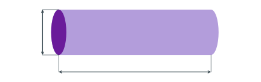

---
aliases:
  - ELEC 3120 network delay
  - ELEC3120 network delay
  - HKUST ELEC 3120 network delay
  - HKUST ELEC3120 network delay
  - latency
  - network delay
  - packet delay
tags:
  - flashcard/active/special/academia/HKUST/ELEC_3120/network_delay
  - language/in/English
---

# network delay

Delay is how long data take to cross a link, and it has two parts: getting the data into the link, which the link's bandwidth sets, and a bit travelling along the link, which the link's length sets. The two are independent, so a short link can be slow to load and a long one fast.

---

Flashcards for this section are as follows:

- overview ::@:: The delay of a link is the time to push the data into it plus the time for a bit to travel along it.
- which two parts does link delay have? ::@:: The transmission delay, set by the bandwidth and the amount of data, and the propagation delay, set by the link's length.
- are the two parts related? ::@:: No: one depends on the link's rate, the other on its length.

## pipe model

A link is pictured as a pipe. Its width is the bandwidth: the bits per second the link carries. Its length is the propagation delay: the time a bit takes to cross it. The picture explains why links are quoted as a pair of numbers, `1 Gbps x 10 ms`, since one says nothing about the other. 
 

---

Flashcards for this section are as follows:

- pipe model: in the pipe picture of a link, what are the pipe's width and its length? 
  ::@:: The width is the bandwidth and the length is the propagation delay.
- draw the pipe model: how is a link drawn, and what does each direction stand for? ::@:: A pipe, wider for more bandwidth and longer for more propagation delay. 
 
- describe a link: how is a link of 1 Gbps with 10 ms of propagation delay written? ::@:: `1 Gbps x 10 ms`, one number for each direction of the pipe.

## transmission delay

Transmission delay is how long it takes to put the data in: the amount of data divided by the bandwidth. It falls as the link gets faster and rises with the size of the packet, and it does not depend on the distance at all, so putting a large file onto a fast link costs the same whether the link is one metre or one ocean long. Two analogies fit it: how long it takes to put all of the marbles into a tube, and how long a morse operator takes to type the word out.

---

Flashcards for this section are as follows:

- transmission delay: for a packet of $N$ bits on a link of rate $R$, what is it? ::@:: $N/R$ seconds, the amount of data divided by the bandwidth.
- what sets transmission delay? ::@:: The packet size and the link's bandwidth.
- what does transmission delay not depend on? ::@:: Distance; the link's length sets the propagation delay instead.
- how long does one bit take to transmit on a 1 Mbps link? ::@:: A millionth of a second, one bit per period of the link's rate.

## propagation delay

Propagation delay is how long a bit takes to cross the link, and in a vacuum it is the distance travelled divided by the speed of light. Real media run below that speed: each has a velocity factor, its slowdown relative to light, so electricity travels slower through copper than light travels through outer space. The marble analogy belongs here, not under transmission delay: pushing marbles in faster does not make one roll to the far end any quicker.

---

Flashcards for this section are as follows:

- propagation delay: for a link of length $d$ over a medium where signals travel at $v$, what is it? ::@:: $d/v$ seconds, which in a vacuum is the distance divided by the speed of light.
- velocity factor: what does a medium's velocity factor state? ::@:: How much slower than the speed of light signals travel through it.
- is copper as fast as free space? ::@:: No: electricity travels slower through copper than light through outer space.
- what sets propagation delay? ::@:: The link's length and the speed of light in its medium.
- what does propagation delay not depend on? ::@:: The amount of data; it is the time for one bit to cross.

## packet delay

Packet delay is the two parts added together, so for a packet of $N$ bits on a link of rate $R$ with link latency $L$ it is $(N/R) + L$, where the link latency is the propagation delay. A packet of 800 B on a 1 Mbps link with 100 ms of latency takes 6.4 ms to push in, and its last bit then needs the full latency to cross, so it reaches the far end 106.4 ms after the first bit started.

The two terms are not always comparable. Sending 1500 B over a datacenter link of 40 Gbps with 10 microseconds of latency costs 0.3 microseconds of transmission and 10.3 microseconds in all, so the latency dominates and the link is fast in both directions. The same 1500 B over a satellite link of 32 kbps with 8 s of latency costs 0.375 s of transmission and 8.375 s in all, so there the transmission time is a rounding error beside the latency.

---

Flashcards for this section are as follows:

- packet delay: for a packet of $N$ bits, a link of rate $R$, and a link latency $L$, what is the packet delay? ::@:: $(N/R) + L$: the transmission delay plus the propagation delay.
- link latency: which part of a link's delay does the latency alone name? ::@:: The propagation delay.
- the first bit against the last: why does the last bit of a packet arrive later than the first by more than the propagation delay? ::@:: The last bit leaves the sender one transmission delay after the first, and both then need the same propagation delay.
- worked case: a 6400-bit packet on a 1 Mbps link with 100 ms of latency, how long does the packet take? ::@:: 6.4 ms to push the bits in plus 100 ms to cross, so 106.4 ms.
- datacenter case: 1500 B on a 40 Gbps link with 10 microseconds of latency, how long does the packet take? ::@:: 12000 bits at 40 Gbps is 0.3 microseconds, plus 10 microseconds, so 10.3 microseconds.
- satellite case: 1500 B on a 32 kbps link with 8 s of latency, how long does the packet take? ::@:: 12000 bits at 32 kbps is 0.375 s, plus 8 s, so 8.375 s.
- which term does the distance affect? ::@:: The propagation delay only.
- which term does the packet size affect? ::@:: The transmission delay only.

## throughput and latency

Which of the two numbers matters more depends on the link, and the same two questions apply to links of every kind. A fiber between two servers in a datacenter, a fiber across the Pacific, a manual telegraph from Hong Kong to Beijing, and a radio link to a satellite far out in the solar system are all pipes; they differ in how wide they are and how long, not in kind. Choosing between a network that sends a lot of data slowly and one that sends a little data quickly is the choice between throughput and latency, and it comes back at every scale, down to whether a supercomputer without a network connection is more useful than a simple cell phone that has one.

---

Flashcards for this section are as follows:

- throughput and latency: what choice does the pair pose? ::@:: Between a network that sends a lot of data slowly and one that sends a small amount of information very quickly.
- throughput and latency: to which links do the two questions apply? ::@:: To links of every kind, from a datacenter fiber to a manual telegraph or a radio link to a distant satellite.
- throughput and latency: how does the same choice look between two machines? ::@:: A supercomputer without a network connection against a simple cell phone with one.
