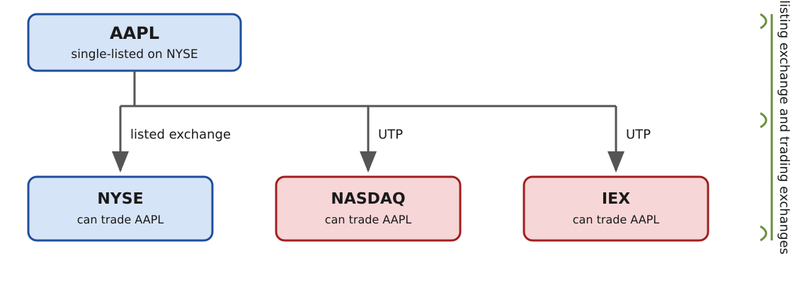

---
aliases:
  - UTP
  - Unlisted Trading Privileges
  - unlisted trading privilege securities
tags:
  - flashcard/active/special/academia/HKUST/FINA_4103/Unlisted_Trading_Privileges
  - language/in/English
---

# Unlisted Trading Privileges

_Unlisted Trading Privileges_ (UTP) let a stock listed on one exchange be traded on all the others. Rule 12(f) of the Securities Exchange Act of 1934 grants them. Listing and trading are two separate decisions: a company nominates one exchange to list on, and any venue may then trade the stock. The listing exchange has no say over where the stock trades. That separation is what lets a fragmented United States market work.

---

Flashcards for this section are as follows:

- overview ::@:: The rule letting a stock listed on one exchange be traded on all the others, so listing and trading are separate decisions.
- which rule grants unlisted trading privileges ::@:: Rule 12(f) of the Securities Exchange Act of 1934.
- what the listing exchange loses once listing and trading are separate ::@:: Any say over where the stock trades.

## listing exchange and trading exchanges

Apple is listed on the New York Stock Exchange and nowhere else, and its shares trade on Nasdaq, on the IEX, and everywhere else. A single listing stays single: the privilege attaches to that one listing, so a company gains nothing by adding a second. The listing exchange holds the listing and the cost of obtaining it. The trading venues hold only the trading, which reaches them without any act of listing. 
 

---

Flashcards for this section are as follows:

- example of a single-listed stock that trades on other venues ::@:: Apple, listed on the New York Stock Exchange and also traded on Nasdaq and the IEX.
- what the listing exchange carries ::@:: The listing itself, and what obtaining it cost.
- what the trading exchanges carry ::@:: The trading, and the stock reaches them without any act of listing.
- how a single-listed stock reaches venues that never listed it ::@:: Through unlisted trading privileges joining the listing exchange to every other venue.

## what the privileges do to listing

Because a stock listed anywhere can be traded anywhere, cross-listed companies are rare in the United States. What decides the listing exchange is the brand the listing carries and the cost of obtaining it.

The privileges blur what an exchange is. A user can trade the same stock on every venue, so the differences between exchanges stop showing up in what its users can trade. BATS and Direct Edge run no listing service at all, and have built large trading businesses all the same. The three exchange families that own most United States venues, and the many venues outside them, are listed in [market structure (finance)](market%20structure%20(finance).md).

---

Flashcards for this section are as follows:

- why cross-listed companies are rare in the United States ::@:: A stock listed anywhere can already be traded anywhere.
- what decides a company's listing exchange once privileges apply ::@:: The brand the listing carries and the cost of obtaining it.
- what happens to the differences between exchanges under the privileges ::@:: They stop showing up in what each venue's users can trade.
- two examples of exchanges that grew without a listing service ::@:: BATS and Direct Edge.

## where the trading happens

The table gives one month of 2016, attributed to BATS, and breaks the volume down by venue for three stocks. Each stock is named for its listing venue: stock A on the New York Stock Exchange, stock B on NYSE Arca, and stock C on Nasdaq.

| Venue | Stock A (NYSE) | Stock B (NYSE Arca) | Stock C (NASDAQ) | Total |
| --- | --- | --- | --- | --- |
| NYSE | 14,912,855,914 | 0 | 0 | 14,912,855,914 |
| NYSE Arca | 4,975,004,832 | 3,498,952,382 | 3,428,196,091 | 11,902,153,305 |
| NYSE MKT | 0 | 412,389,574 | 142,888,272 | 555,277,846 |
| NASDAQ | 7,386,584,488 | 1,942,555,064 | 10,981,664,745 | 20,310,804,297 |
| NASDAQ OMX BX | 1,494,049,002 | 507,233,815 | 892,298,258 | 2,893,581,055 |
| NASDAQ OMX PSX | 194,443,391 | 137,526,114 | 136,091,928 | 468,061,433 |
| BATS BZX | 3,932,602,812 | 1,813,700,923 | 2,681,196,076 | 8,427,499,811 |
| BATS BYX | 2,030,547,580 | 667,503,924 | 1,247,960,469 | 3,946,011,973 |
| Direct Edge EDGX | 3,613,357,678 | 1,225,692,410 | 3,039,249,200 | 7,878,299,288 |
| Direct Edge EDGA | 1,501,833,535 | 588,298,220 | 930,164,212 | 3,020,296,027 |
| CHX | 331,583,340 | 224,721,165 | 108,338,364 | 664,642,869 |
| TRF and ADF | 23,105,465,569 | 6,771,742,571 | 16,688,471,430 | 46,565,679,570 |
| Total | 63,478,328,141 | 17,790,316,162 | 40,276,519,085 | 121,545,163,388 |

One row is off-exchange volume: trade reports filed through FINRA's trade reporting facility and the alternative trading facility. That row is the largest line for every stock. For every stock, the listing exchange trades a smaller share of it than the off-exchange row does. [Market structure (finance)](market%20structure%20(finance).md) records the same market split by venue type rather than by stock. It also has the shares each venue group held in 1998 and in 2015.

---

Flashcards for this section are as follows:

- 2016 monthly share volume of the NYSE-listed stock that traded off-exchange ::@:: 23.1 billion of 63.5 billion shares, through the TRF and the ADF.
- 2016 monthly share volume of the Nasdaq-listed stock traded on Nasdaq ::@:: 11.0 billion of 40.3 billion shares.
- whether a listing exchange trades the largest share of its own listed stock ::@:: No; the off-exchange row is larger for every stock in the breakdown, including the stock each venue lists.
