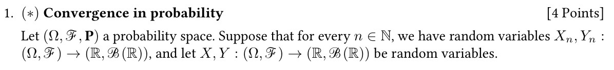
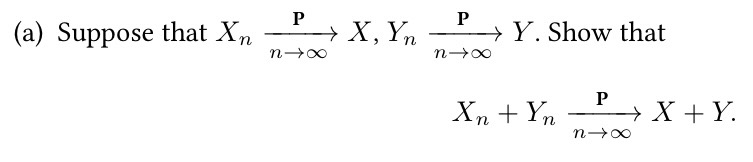
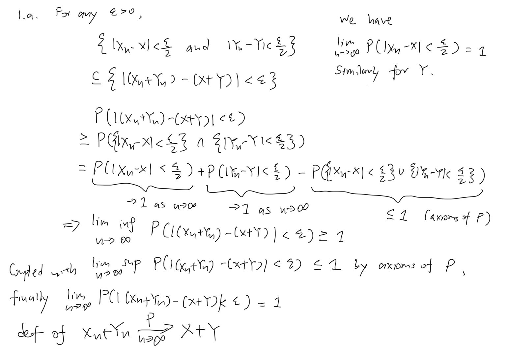
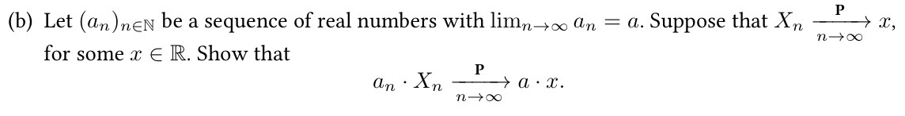
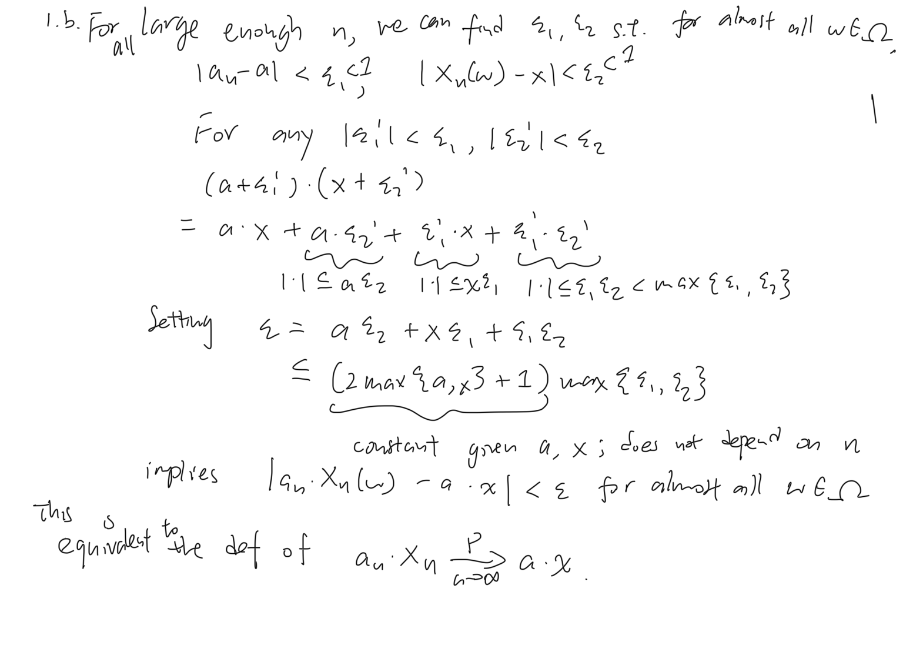
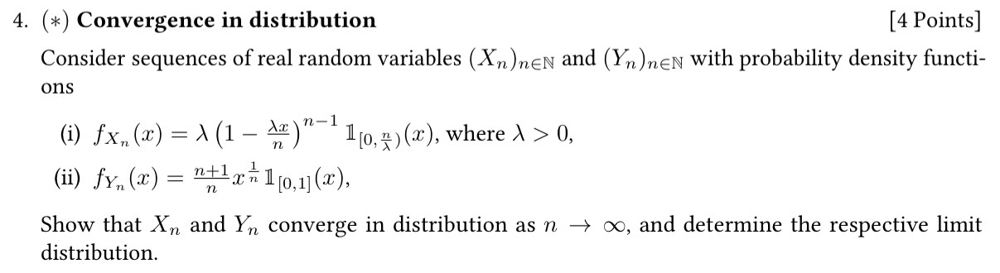
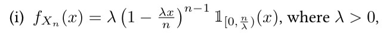
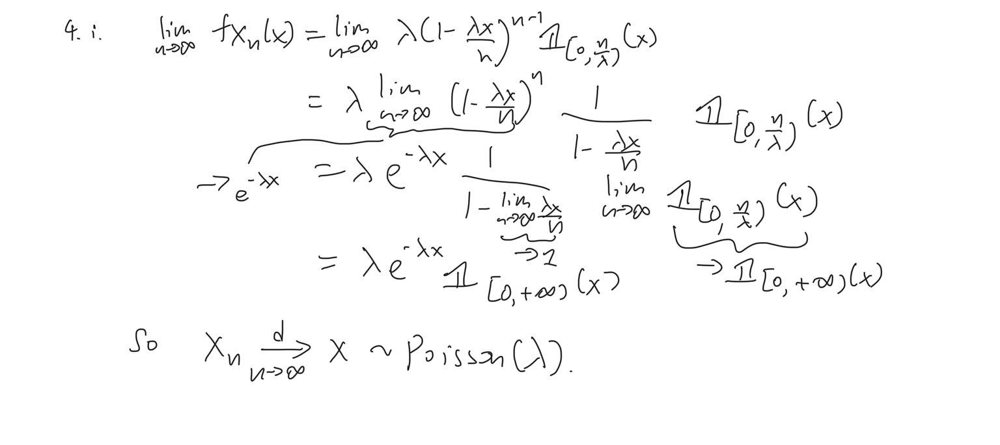
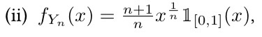
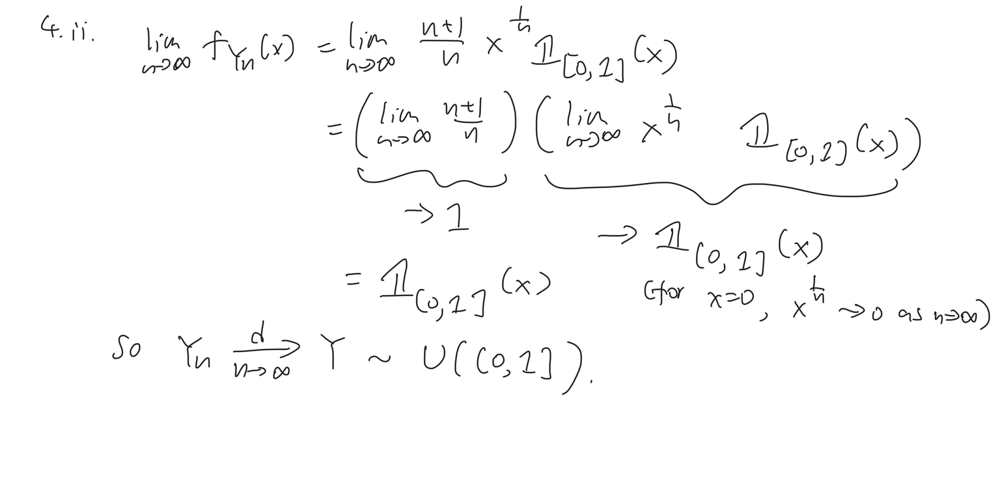

<!-- markdownlint-disable MD003 MD022 MD029 MD032 -->
<!-- check: ignore-file[missing_yaml_frontmatter, metadata_aliases_present, metadata_tags_present, tag_language, header_flashcard_presence, no_smart_double_quotes]: Apple Notes markdown — do not modify -->
# HKUST MATH 2431 - problem set 11
---
1.

---
4.

