<!-- markdownlint-disable MD003 MD022 MD029 MD032 -->
<!-- check: ignore-file[missing_yaml_frontmatter, metadata_aliases_present, metadata_tags_present, tag_language, header_flashcard_presence, no_soft_wrap_list]: Apple Notes markdown — do not modify -->
# HKUST MATH 2431 problem set 2
---
3.
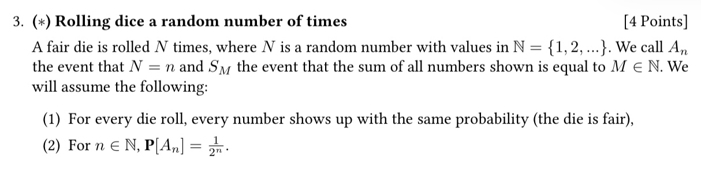
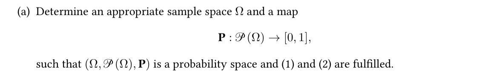
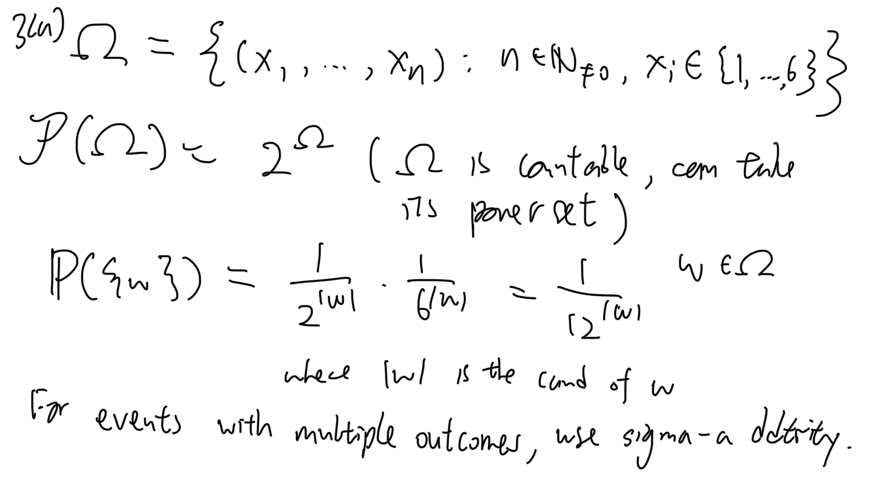
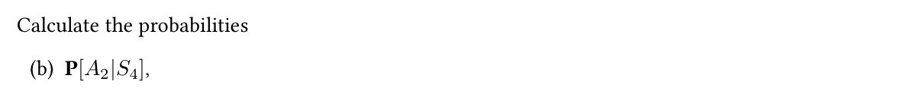
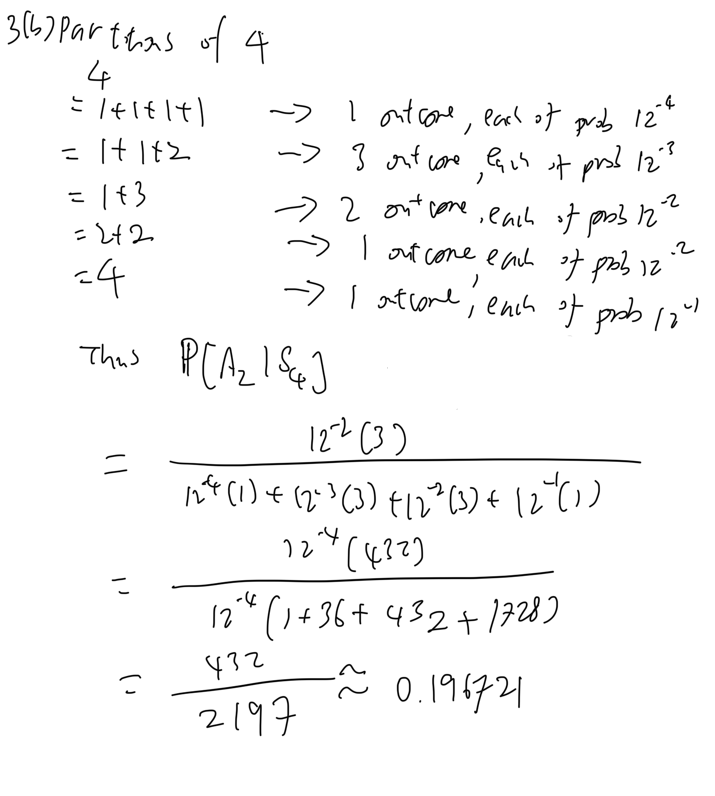
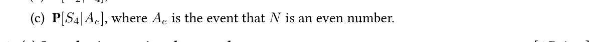
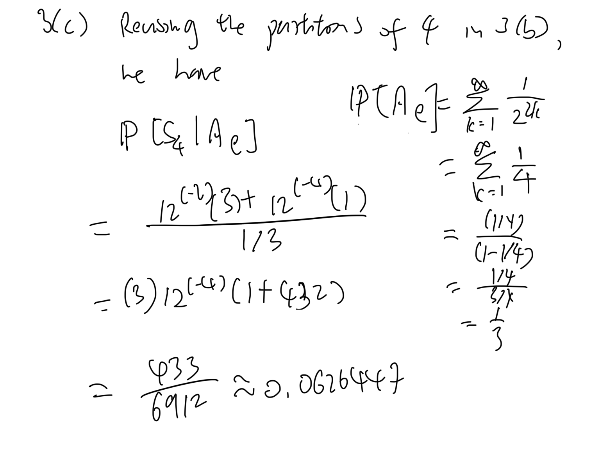
---
4.
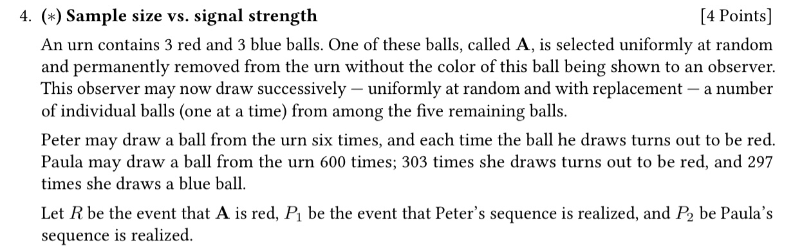
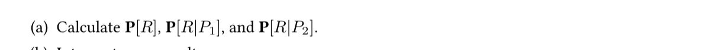
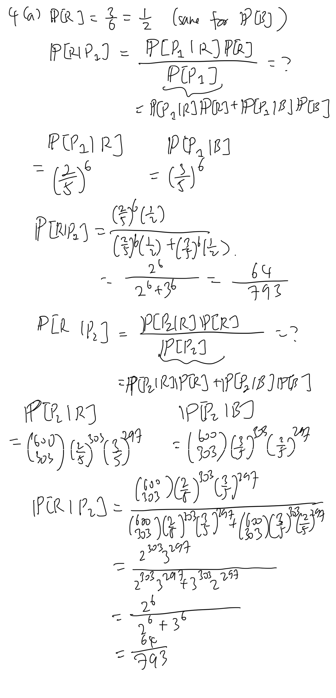
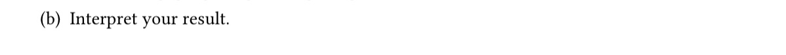
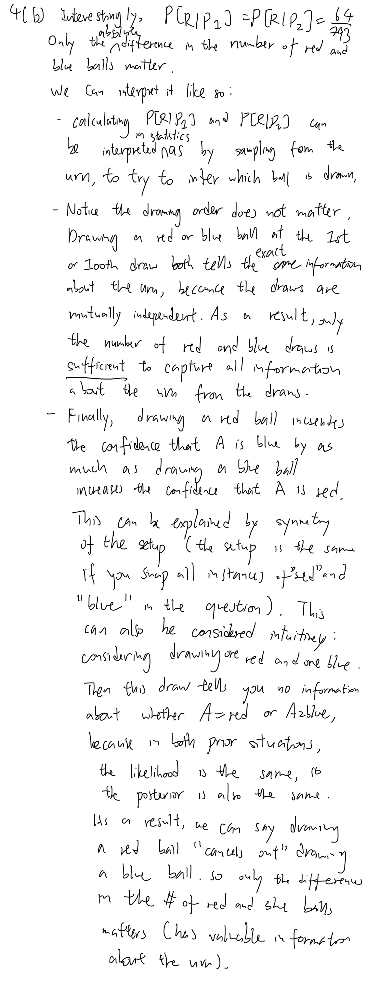
