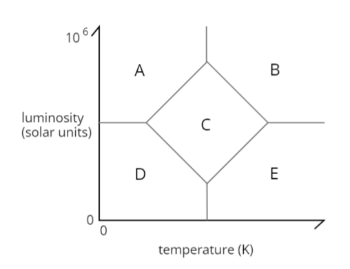

---
aliases:
  - HKUST PHYS 1002 question
  - HKUST PHYS 1002 questions
  - HKUST PHYS1002 question
  - HKUST PHYS1002 questions
  - PHYS 1002 question
  - PHYS 1002 questions
  - PHYS1002 question
  - PHYS1002 questions
tags:
  - flashcard/active/special/academia/HKUST/PHYS_1002/questions
  - language/in/English
---

# questions

- HKUST PHYS 1002

The parenthesized text at the beginning of of each question is {@{the location the question appears in}@}. Questions beginning with `(derived)` are {@{derived from other questions and only appear here}@}. <!--SR:!2027-10-05,916,337!2027-07-31,867,337-->

Marking is done as follows. iPRS and MCQ questions are considered separately. For each type of questions, the best 80% are counted. Then the percentage is linearly scaled onto a 10-mark scale for iPRS and 15-mark scale for MCQ.

## 2024-06-18

> Q1. (lecture) This photo shows the Andromeda Galaxy as it looked about 2.5 million years ago. (HISTORIC Photograph)
>
> Question: When will we be able to see what it looks like __now__?
>
> - solution: {@{_About_ 2.5 million years later. Or less than 2.5 million years later, if you know that the Andromeda is approaching the Milky Way.}@} <!--SR:!2027-06-01,809,330-->

<!-- markdownlint MD028 -->

> Q2. (iPRS) According to our definition, the look-back time of an object is
>
> 1. the age of the Universe when the light received by us now was first emitted from the object
> 2. the age of the Universe now minus the time taken for the light from the object to reach the Earth
> 3. the time elapsed between when we detect the light here on Earth and when it was originally emitted by the source
> 4. smaller for more distant objects
> 5. larger for nearer objects
>
> - solution: {@{3}@} <!--SR:!2027-02-26,739,330-->

<!-- markdownlint MD028 -->

> Q3. (MCQ) If you can count one star per second, how long will it take for you to count all stars in the observable universe?
>
> 1. 3 thousand years
> 2. 3 million years
> 3. 3 billion years
> 4. 3 trillion years
> 5. 3 hundred trillion years
>
> - solution: {@{5}@}
> - explanation: {@{Given there are about 1022 stars, divide it by the number of seconds in a year: $$\frac {10^{22} } {86400 \times 365} \approx 3.17 \times 10^{14}\text{ years}$$ to get about 300 trillion (300 × 1012) years.}@} <!--SR:!2027-09-21,896,330!2028-06-23,1076,310-->

## 2024-06-27

> Q1. (iPRS) At what location(s) on the Earth will one see the stars, the Sun, and the Moon rise and set vertically (viz. perpendicular to the horizon)?
>
> 1. at the North Pole
> 2. at the South Pole
> 3. on the equator
> 4. on the prime meridian
> 5. 1 and 2
>
> - solution: {@{3}@} <!--SR:!2027-06-12,828,337-->

<!-- markdownlint MD028 -->

> Q2. (MCQ) A hypothetical planet has an orbital period around the Sun equal to 6 sidereal days of the planet. The self-rotation and orbital rotation are in the same direction. How long is its solar day?
>
> 1. 7/6 sidereal days
> 2. 6/5 sidereal days
> 3. 5/4 sidereal days
> 4. 4/3 sidereal days
> 5. 3/2 sidereal days
>
> - solution: {@{2}@}
> - explanation: {@{The planet is in prograde motion. Hence, the number of solar days per orbital period is $6 - 1 = 5\text{ solar days}$. Thus each solar day is $\frac {1 / 5} {1 / 6} = \frac 6 5\text{ sidereal days}$.}@} <!--SR:!2026-01-08,380,297!2026-06-16,538,317-->

<!-- markdownlint MD028 -->

> Q3. (derived) At what location(s) on the Earth will one see the stars, the Sun, and the Moon move almost horizontally (viz. almost parallel to the horizon) all the time?
>
> 1. at the North Pole
> 2. at the South Pole
> 3. an the equator
> 4. on the prime meridian
> 5. 1 and 2
>
> - solution: {@{5}@} <!--SR:!2027-05-16,806,337-->

<!-- markdownlint MD028 -->

> Q4. (derived) A hypothetical planet has an orbital period around its parent star equal to 42 solar days of the planet. The self-rotation and orbital rotation are in the opposite direction. How long is its sidereal day?
>
> 1. 43/44 solar days
> 2. 43/42 solar days
> 3. 42/41 solar days
> 4. 42/43 solar days
> 5. 41/42 solar days
> 6. 44/43 solar days
>
> - solution: {@{3}@}
> - explanation: {@{The planet is in retrograde motion. Hence, the number of sidereal days per orbital period is $42 - 1 = 41\text{ sidereal days}$. Thus each sidereal day is $\frac {1 / 41} {1 / 42} = \frac {42} {41}\text{ solar days}$.}@} <!--SR:!2028-09-06,1141,317!2028-01-25,888,297-->

## 2024-07-02

> Q1. (lecture) What would seasons be like for a planet with 90 degree axial tilt?
>
> - solution: {@{There would be no seasons. Instead, every location is daytime for half the orbital period and nighttime for the other half, like the north and south pole on Earth. Likely unliveable.}@} <!--SR:!2025-09-25,343,348-->

<!-- markdownlint MD028 -->

> Q2. (lecture) When will the Sun rise exactly due east and set exactly due west?
>
> - solution: {@{During the equinoxes.}@} <!--SR:!2025-09-27,345,348-->

<!-- markdownlint MD028 -->

> Q3. (iPRS) At the equator, on which day(s) is the Sun's position at noon the highest?
>
> 1. spring equinox
> 2. summer solstice
> 3. fall equinox
> 4. winter solstice
> 5. 1 and 3
>
> - solution: {@{5}@} <!--SR:!2025-09-27,345,350-->

<!-- markdownlint MD028 -->

> Q4. (derived) There is a planet with a satellite orbiting a star. The planet completes an orbit in 420 years relative to distant stars. The satellite completes an orbit in 69 years relative to distant stars. The orbiting direction of the satellite is prograde to that of the planet. What is the synodic orbital period of the satellite relative to the star as viewed from the planet, rounded to the nearest year?
>
> 1. 69 years
> 2. 83 years
> 3. 59 years
> 4. 82 years
> 5. 420 years
> 6. 60 years
>
> - solution: {@{2}@}
> - explanation: {@{Since the relative orbital motion between the planet and the satellite is prograde, apply the equation: $$\frac 1 {T_\text{syn} } = \frac 1 {T_1} - \frac 1 {T_2} \quad T_1 < T_2$$. Thus we have $T_\text{syn} = \frac 1 {\frac 1 {T_1} - \frac 1 {T_2} } = \frac 1 {\frac 1 {69} - \frac 1 {420} } \approx 82.564\,1026 \approx 83\text{ years}$.}@} <!--SR:!2025-12-01,325,270!2025-10-28,302,270-->

<!-- markdownlint MD028 -->

> Q5. (derived) Where on Earth can you enjoy 6 months of continuous daytime?
>
> 1. at the North Pole
> 2. at the South Pole
> 3. on the equator
> 4. on the prime meridian
> 5. 1 and 2
> 6. 3 and 4
>
> - solution: {@{5}@} <!--SR:!2025-09-27,345,350-->

<!-- markdownlint MD028 -->

> Q6. (derived) There are 2 planets orbiting a star. The 1st planet completes an orbit in 7 years relative to the fixed stars. The 2nd planet completes an orbit in 1 year relative to the 1st planet. The orbiting direction of the 2 planets are retrograde to each other. What is the sidereal orbital period of the 2nd planet?
>
> 1. 6/7 years
> 2. 1 year
> 3. 8/7 years
> 4. 7 years
> 5. 7/8 years
> 6. 7/6 years
>
> - solution: {@{6}@}
> - explanation: {@{Since the relative orbital motion between the 2 planets is retrograde, apply the equation: $$\frac 1 {T_\text{syn} } = \frac 1 {T_1} + \frac 1 {T_2}$$. Thus we have $T_2 = \frac 1 {\frac 1 {T_\text{syn} } - \frac 1 {T_1} } = \frac 1 {\frac 1 1 - \frac 1 7} = \frac 7 6\text{ years}$.}@} <!--SR:!2027-04-04,726,310!2026-08-29,592,330-->

## 2024-07-04

> Q1. (MCQ) The Moon rises later everyday by approximately how long?
>
> 1. 1 minute
> 2. 4 minutes
> 3. 1 hour
> 4. 2 hours
> 5. 3 hours
>
> - solution: {@{3}@}
> - explanation: {@{Recall that the moonrise time corresponds to the lunar phase cycle. As the cycle resets every 29.5 days, the moonrise time also resets 29.5 days. A moonrise time "reset" happens when the moon rises later by a cumulative time of 1 day. Thus the answer is: $$\frac {24} {29.5} \approx 0.813\,559\,322 \approx 1\text{ hour}$$.}@} <!--SR:!2026-07-30,565,332!2028-09-03,1162,352-->

<!-- markdownlint MD028 -->

> Q2. (derived) The two (or three) eclipse seasons start earlier every year by approximately how long?
>
> 1. 0 days (does not start earlier every year)
> 2. 365 days
> 3. 30 days
> 4. 20 days
> 5. 366 days
>
> - solution: {@{4}@}
> - explanation: {@{Recall that the eclipse season depends on the line of lunar nodes. Consider that the lunar nodes rotates retrograde (clockwise) once about 18.6 years. The answer is: $$\frac {365.25} {18.6} \approx 19.637\,0967 \approx 20\text{ days}$$.}@} <!--SR:!2028-04-28,1062,352!2025-12-03,322,272-->

## 2024-07-09

> Q1. (iPRS) Assume that the orbits of all planets in the solar system are circular. Then a = r = orbital radius. By Kepler's third law, p2 ~ r3, the orbital speed v is
>
> 1. proportional to 1/r
> 2. proportional to r^(-1/2)
> 3. independent of r
> 4. proportional to r^(1/2)
> 5. proportional to r
>
> - solution: {@{2}@}
> - explanation: {@{The orbital period $p$ is proportional to the inverse of angular orbital velocity $1 / \omega$. Further, linear orbital velocity (speed) $v$ relates to angular orbital velocity by $v = r \omega \implies \omega = v / r$. Therefore, $$p^2 \propto r^3 \implies \omega^{-2} \propto r^3 \implies r^2 / v^2 \propto r^3 \implies r^{-1} \propto v^2 \implies v \propto r^{-1 / 2}$$. Therefore the answer is $v \propto r^{-1 / 2}$.}@} <!--SR:!2026-01-30,395,321!2027-08-08,798,341-->

<!-- markdownlint MD028 -->

> Q2. (derived) Assume orbits are circular, so $a = r$. By Kepler's third law, $T^2 \propto a^3 = r^3$. Then the magnitude of orbital acceleration $A$ ($A$ instead of $a$ to avoid clash of variables) is
>
> 1. proportional to $r^{-2}$
> 2. proportional to $r^{-1}$
> 3. independent of $r$
> 4. proportional to $r$
> 5. proportional to $r^2$
>
> - solution: {@{1}@}
> - explanation: {@{The orbital period $T$ is proportional to the inverse of angular orbital velocity $1 / \omega$. Further, linear orbital acceleration $A$ relates to angular orbital velocity by $A = r \omega^2 \implies \omega^2 = A / r$. Therefore, $$T^2 \propto r^3 \implies \omega^{-2} \propto r^3 \implies r / A \propto r^3 \implies r^{-2} \propto A \implies A \propto r^{-2}$$. Therefore the answer is $A \propto r^{-2}$.}@} <!--SR:!2027-02-26,721,341!2026-12-21,568,281-->

## 2024-07-11

> Q1. (MCQ) <u>First Cosmic Velocity</u>
>
> What is the orbital velocity of a satellite which orbits the Earth at sea-level? It is given that the radius of the Earth is 6400 km and the acceleration due to gravity at sea-level is 9.8 m/s2.
>
> 1. 3.6 km/s
> 2. 5.2 km/s
> 3. 7.9 km/s
> 4. 9.8 km/s
> 5. 11 km/s
>
> - solution: {@{3}@}
> - explanation: {@{Equate circular acceleration to gravitational acceleration: $$a = g \implies \frac {v^2} r = g \implies v^2 = gr \implies v = \sqrt{gr}$$. Plug in the numbers: $$v = \sqrt{\frac {9.8} {1000} \cdot 6400} = \sqrt{62.72} \approx 7.91959595\text{ km/s}$$. Therefore, the answer is 7.9 km/s.}@} <!--SR:!2027-08-29,843,321!2026-05-24,478,321-->

<!-- markdownlint MD028 -->

> Q2. (iPRS) In 2023, China's total installed electric generation capacity was 2.92 TW. How much mass is converted to energy every second to generate the same power? (T = Tera = 1012)
>
> 1. 0.003 g
> 2. 0.03 g
> 3. 0.3 g
> 4. 3 g
> 5. 30 g
>
> - solution: {@{2}@}
> - explanation: {@{Apply Albert Einstein's famous formula: $$E = mc^2 \implies m = \frac E {c^2}$$. Plug in the numbers: $$E = \frac {2.92 \times 10^12} {(3 \times 10^8)^2} \approx 3.24444444 \times 10^{-5}\text{ kg} \approx 0.03\text{ g}$$. Therefore, the answer is 0.03 g.}@} <!--SR:!2027-01-27,697,341!2026-11-26,594,321-->

<!-- markdownlint MD028 -->

> Q3. (derived) What is the orbital velocity of a satellite which orbits the Earth at 400 km above the surface? It is given that the radius of the Earth is 6400 km and the acceleration due to gravity at sea-level is 9.8 m/s2.
>
> 1. 7.5 km/s
> 2. 7.7 km/s
> 3. 7.9 km/s
> 4. 9.8 km/s
> 5. 11 km/s
>
> - solution: {@{2}@}
> - explanation: {@{Recall that the acceleration due to gravity is inversely proportional to the square of distance: $g \propto \frac 1 {r^2}$. Therefore, the acceleration due to gravity 400 km above the surface is: $$g = 9.8 \cdot \frac {6400^2} {6800^2} \approx 8.68096886\text{ m/s}$$. Now, equate circular acceleration to gravitational acceleration: $$a = g \implies \frac {v^2} r = g \implies v^2 = gr \implies v = \sqrt{gr}$$. Plug in the numbers: $$v = \sqrt{\frac {8.68096886} {1000} \cdot 6800} \approx 7.6831366\text{ km/s}$$. Therefore, the answer is 7.7 km/s.}@} <!--SR:!2025-11-23,344,321!2027-11-29,821,301-->

<!-- markdownlint MD028 -->

> Q4. (derived) About 0.1% of the mass of the Sun will be converted into energy over its lifetime. Given that the Sun has a mass of 2 × 1030 kg and emits 3.8 × 1026 joules of energy per second, calculate its lifetime.
>
> 1. 100 million years
> 2. 1 billion years
> 3. 10 billion years
> 4. 100 billion years
> 5. 1 trillion years
>
> - solution: {@{3}@}
> - explanation: {@{Apply Albert Einstein's famous formula: $$E = mc^2$$. Calculate the total emitted energy over the Sun's lifetime: $$E = 2 \times 10^{30} \cdot 0.001 \cdot (3 \times 10^8)^2 = 1.8 \times 10^{44}\text{ J}$$. Then calculate the Sun's lifetime by dividing it by the power of the Sun: $$t = \frac {1.8 \times 10^{44} } {3.8 \times 10^{26} } \approx 4.73684211 \times 10^{17}\text{ s} \approx 1.5010468 \times 10^{10}\text{ yrs} \approx 15\text{ billion years}$$. Therefore, the answer is 10 billion years.}@} <!--SR:!2026-02-10,404,321!2025-09-24,291,301-->

## 2024-07-16

> Q1. (iPRS) Take the visible light wavelengths to be ~380 nm to 700 nm.
>
> A star emits thermal radiation with maximum intensity at 530 nm, which is in the range of green lights (~495 nm – 570 nm). This star is
>
> 1. red in color
> 2. white in color
> 3. green in color
> 4. blue in color
>
> - solution: {@{2}@}
> - explanation: {@{Consider the graph of spectral radiance for that star, which peaks at 530 nm. It should look like a hill with somewhat narrow peak. However, the narrow peak should cover the entire visible spectrum. As the spectral radiance is approximately even around the peak, that means it is approximately even over the entire visible spectrum, so the color is white.}@} <!--SR:!2025-11-09,354,328!2028-02-09,1021,368-->

<!-- markdownlint MD028 -->

> Q2. (derived) Which of the following color is impossible for a star to have, as seen by the human eye?
>
> 1. red
> 2. yellow
> 3. white
> 4. blue
> 5. purple (not violet)
>
> - solution: {@{5}@}
> - explanation: {@{Purple is the combination of red and blue. However, red and blue are on the two opposite ends of the visible spectrum, so the spectral radiance graph would need to have 2 peaks. This is impossible for thermal radiation to produce, as predicted by the Wien approximation. For more, see [Planckian locus](../../../../general/Planckian%20locus.md).}@} <!--SR:!2025-12-27,411,368!2025-12-18,404,368-->

## 2024-07-18

> Q1. (iPRS) From laboratory measurements, we know that a particular spectral line appears at a certain wavelength. The line width is very small and can be ignored. A star is moving with negligible velocity relative to the Earth but self-rotating very fast. Assume that the Earth lies on the equatorial plane of the star. What will be observed of the same spectral line in the spectrum of the star?
>
> 1. Broadened (line width increased) but (the center of line) un-shifted.
> 2. Broadened (line width increased) and (the center of line) red-shifted.
> 3. Broadened (line width increased) and (the center of line) blue-shifted.
> 4. No width broadening and un-shifted.
> 5. No width broadening but red-shifted.
> 6. No width broadening but blue-shifted.
>
> - solution: {@{1}@}
> - explanation: {@{First, the star is not moving, so the spectral line should be unshifted. Now consider the surface of a very fast rotating star. In particular, consider the left and right sides of the rotating star. The surface of one side is approaching us very quickly, and that of the other side is moving away from us very quickly as well. This would mean part of the light from the star is blue-shifted and another part is red-shifted. The result is that the spectral line broadens.}@} <!--SR:!2027-09-11,872,348!2025-12-19,405,368-->

<!-- markdownlint MD028 -->

> Q2. (derived) A binary star system consists of two stars orbiting each other. Assume a binary star system, with circular orbits, is not moving relative to Earth, and its orbital plane is parallel to that of Earth. When the system is dimmer than what it normally is, what are the detected Doppler shifts of the two stars?
>
> 1. red shift for one star, blue shift for the other star
> 2. red shift for one star only, almost no shift for the other star
> 3. blue shift for one star only, almost no shift for the other star
> 4. red shift for both stars
> 5. blue shift for both stars
> 6. almost no shift for both stars
>
> - solution: {@{6}@}
> - explanation: {@{When the system is dimmer than what it normally is, it implies one star is in front of the other star. Consider that both stars are always opposite in their orbits. So the stars must be in the part of the orbit closest to or farthest from Earth (this is true for circular orbits, but gets less true the more elliptic the orbits are). That means both stars are moving mostly transversal to Earth, taking into consideration that the system as a whole is not moving. So there should be almost no Doppler shift.}@} <!--SR:!2027-06-18,805,348!2027-02-24,616,288-->

## 2024-07-23

> Q1. (iPRS) The apparent magnitude of the Sun is −26.832. The apparent magnitude of the full moon is −12.74. The solar constant, measured to be 1370 W/m2, is the power of sunlight per unit area perpendicular to the rays, one astronomical unit from the Sun (roughly the distance from the Sun to the Earth). What is the intensity of moonlight measured in the same way at Earth-Moon distance during full moon?
>
> 1. 0.00134 W/m^2
> 2. 0.00316 W/m^2
> 3. 0.0257 W/m^2
> 4. 0.684 W/m^2
> 5. 4.92 W/m^2
>
> - solution: {@{2}@}
> - explanation: {@{Since both magnitudes are apparent, they are already directly describing the power of light per unit area reaching Earth, so we do not need to consider distance. Calculate the factor of the Moon's intensity over the Sun using the definition: $$f = 100^{-(-12.74 - (-26.832)) / 5} = 100^{-14.092 / 5} = 100^{-2.8184} \approx 2.30780973 \times 10^{-6}$$. Then multiply the solar constant by the factor to get the answer: $$I = 1370 \cdot 2.30780973 \times 10^{-6} \approx 0.0031616993~\mathrm{W/m^2}$$. So the answer is 0.00316 W/m2,}@} <!--SR:!2028-07-23,1148,371!2025-12-17,345,311-->

<!-- markdownlint MD028 -->

> Q2. (MCQ) Various factoids in popular culture claim that the Great Wall is the only work of human hands on the globe visible from the Moon (with the naked eye). The Great Wall is several-meter wide. Let's take it to be 5 m. The human pupil diameter is about 3 mm under bright light conditions. Estimate the shortest distance above the Great Wall that it cannot be resolved by our eyes. The wavelengths of visible lights range from about 380 to about 750 nanometers. Use 500 nm in the estimation.
>
> 1. 2.5 km
> 2. 25 km
> 3. 250 km
> 4. 25&nbsp;000 km
> 5. 2500&nbsp;000 km
>
> - solution: {@{2}@}
> - explanation: {@{Using the Rayleigh criterion, the angular resolution in radians is $$\theta = 1.22 \frac {500 \times 10^{-9} } {3 \times 10^{-3} } \approx 0.000203333333~\mathrm{rad}$$. Setup a trigonometric equation: $$\tan (\theta / 2) = \frac {5 / 2} d$$, where $d$ is the distance to the Great Wall (in meters). Since the angle is small, we can use small angle approximation to save work: $$\theta / 2 \approx \frac {5 / 2} d \implies \theta \approx \frac 5 d \implies d \approx \frac 5 \theta = \frac 5 {0.000203333333} \approx 24590.16~\mathrm{m} \approx 24.6~\mathrm{km}$$. So the answer is 25 km.}@} <!--SR:!2026-01-08,422,371!2026-04-24,435,311-->

<!-- markdownlint MD028 -->

> Q3. (MCQ) Estimate the luminosity of a 100 solar-mass star by the following mass-luminosity relations:
>
> - L/LSun ∝ (M/MSun)a = C(M/MSun)a
> - a = 2.3 for M ≤ 0.43MSun
> - a = 3.5, C = 1 for 0.43MSun ≤ M ≤ 55MSun
> - a = 1 for 55MSun ≤ M
>
> 1. 2 × 10^6 L_Sun
> 2. 4 × 10^6 L_Sun
> 3. 6 × 10^6 L_Sun
> 4. 8 × 10^6 L_Sun
> 5. 10^7 L_Sun
>
> - solution: {@{1}@}
> - explanation: {@{Notice that $C$ is not given for two cases. So the main problem is calculating $C$. The main thing to realize is that w expect for masses in the boundary points between two equations, the two equations should predict the same value, i.e. a continuous function. We only need the $C$ for the third case: $$55^{3.5} = C \cdot 55^1 \implies C = 55^{2.5} \approx 22434.0004$$. Then the rest is a simple matter of applying the formula: $$L = 22434.0004 \cdot 100^1 \approx 2.24 \times 10^6~\mathrm{solar\ luminosity}$$. So the answer is 2×106 LSun.}@} <!--SR:!2028-09-05,1085,351!2025-12-08,378,331-->

<!-- markdownlint MD028 -->

> Q4. (derived) How far should the Sun (apparent magnitude: -26.832) be in order to make it appear as bright as Polaris (apparent magnitude: 1.98), both observed from Earth?
>
> 1. 29 AU
> 2. 3.3×1011 AU
> 3. 5.8×105 AU
> 4. 24 AU
>
> - solution: {@{3}@}
> - explanation: {@{Find the factor the Sun needs to be dimmer to have an apparent magnitude of 1.98: $$f_B = 100^{-\frac {1.98 - (-26.832)} 5} = 100^{-5.7624} \approx 2.98675776 \times 10^{-12}$$. As the apparent brightness is inversely proportional to the square of distance, the factor the Sun needs to be farther away is $$f_d = 1 / \sqrt{2.98675776 \times 10^{-12} } \approx 578628.74$$. As the Sun is 1 AU away, the answer is about 5.8×105 AU.}@} <!--SR:!2026-05-28,414,271!2027-03-22,702,311-->

<!-- markdownlint MD028 -->

> Q5. (derived) Assume a telescope only observes light from the Sun that has a wavelength of 500 nm. What is the minimum aperture required so that the Sun's radius as measured by the telescope has a maximum error of 0.5 km? Ignore any other effects that may affect the result.
>
> 1. 90 m
> 2. 180 m
> 3. 9 m
> 4. 18 m
> 5. 75 m
> 6. 150 m
> 7. 7.5 m
> 8. 1.5 m
>
> - solution: {@{1}@}
> - explanation: {@{To have a maximum error of 0.5 km, the measurement interval is twice that: 1 km (primary school things). Calculate the angular size of 1 km from 1 AU away, using the small angle approximation: $$\theta \approx \frac {1000} {149\,597\,870\,700} \approx 6.68458712 \times 10^{-9}$$. This is the angular resolution required. Calculate the minimum aperture required using the Rayleigh criterion: $$\theta \approx 1.22 \frac \lambda D \implies D \approx 1.22 \frac \lambda \theta = 1.22 \frac {500 \times 10^{-9} } {6.68458712 \times 10^{-9} } \approx 91.254701~\mathrm{m}$$. So the answer is 90 m. That is a giant telescope indeed.}@} <!--SR:!2029-05-16,1383,371!2027-04-29,697,331-->

<!-- markdownlint MD028 -->

> Q6. (derived) An empirical model predicts some types of main sequence stars have a lifetime that is proportional to $M^{-3}$, where $M$ is its mass. Given that the Sun is one of said types of main sequence stars. How massive (referring to mass, not size) a star, also one of said types of main sequence stars, is predicted to be by the empirical model if its luminosity is 2147&nbsp;483&nbsp;647 times the solar luminosity?
>
> 1. 1290 solar masses
> 2. 200 solar masses
> 3. 460 solar masses
> 4. 220 solar masses
> 5. 5400 solar masses
>
> - solution: {@{4}@}
> - explanation: {@{Assuming the fuel burnt is proportional to luminosity. Then, the lifetime of a star is: $$\tau = M / L \propto M^{-3}$$. Derive the proportionality between mass and luminosity: $$M / L \propto M^{-3} \implies M^4 \propto L \implies M \propto L^{0.25}$$. So the star mass is predicted to be: $$(2147\,483\,647)^{0.25} \approx 215.269482~\mathrm{solar\ masses}$$. So the answer is 220 solar masses.}@} <!--SR:!2026-06-22,516,331!2025-12-16,347,311-->

## 2024-07-25

> Q1. (MCQ) Which of these stars will take the SHORTEST time to go from the earliest protostar stage to the main sequence?
>
> 1. A star with 1/10 the mass of our Sun
> 2. A star with 1/2 the mass of our Sun
> 3. A star with equal mass of our Sun
> 4. A star with ten times the mass of our Sun
> 5. All of these stars take the same time to get to the main sequence
>
> - solution: {@{4}@}
> - explanation: {@{A fundamental feature of stellar evolution is that the greater the mass, the faster the evolution.}@} <!--SR:!2025-12-03,391,381!2026-02-11,448,381-->

<!-- markdownlint MD028 -->

> Q2. (iPRS) Intermediate-mass stars differ from low-mass stars in that they
>
> 1. go through all the stages of their lives more slowly
> 2. do not really go through a main sequence stage in their lives
> 3. can fuse elements beyond helium in their hot central regions
> 4. are no longer forming in the Milky Way galaxy; they only formed very early in the Milky Way galaxy's history
> 5. they are significantly less luminous after the main sequence stage is over
>
> - solution: {@{3}@} <!--SR:!2025-12-28,409,381-->

<!-- markdownlint MD028 -->

> Q3. (MCQ) Carbon is present at 2% (by number of atoms) in the Sun. Where does the carbon come from? It is given that the Big Bang produced mainly hydrogen and helium only.
>
> 1. It was produced by the Sun's own fusion inside the core.
> 2. It was produced by chemical reactions outside the core and then diffused into the core.
> 3. It was produced by previous massive stars which expelled some heavy elements during the explosions when they died.
> 4. It was produced by fission of even heavier elements in the Sun.
>
> - solution: {@{3}@} <!--SR:!2025-11-03,367,381-->

## 2024-07-30

> Q1. (MCQ) What is the Schwarzschild radius of a 70-kg person?
>
> G = 6.67 × 10^(-11) m^3 s^(-2) kg^(-1)
>
> 1. 10^(-30) m
> 2. 10^(-25) m
> 3. 10^(-20) m
> 4. 10^(-15) m
> 5. 10^(-10) m
>
> - solution: {@{2}@}
> - explanation: {@{Apply the equation for Schwarzschild radius: $$r_s = \frac {2 \cdot 6.67 \times 10^{-11} \cdot 70} {299\,792\,458^2} \approx 1.03899262 \times 10^{-25}~\mathrm{m}$$. So the answer is 10-25 m.}@} <!--SR:!2028-04-21,1055,365!2026-02-25,397,325-->

<!-- markdownlint MD028 -->

> Q2. (derived) What is the Schwarzschild radius of the observable universe? There are 1053 kg of ordinary (baryonic) matter in the observable universe. Ignore non-baryonic matter.
>
> 1. 1.57×1011 ly
> 2. 1.57×1014 ly
> 3. 1.57×1017 ly
> 4. 7.85×1010 ly
> 5. 7.85×1013 ly
> 6. 7.85×1016 ly
>
> - solution: {@{1}@}
> - explanation: {@{Apply the equation for Schwarzschild radius: $$r_s = \frac {2 \cdot 6.674\,30 \times 10^{-11} \cdot 10^{53} } {299\,792\,458^2} \approx 1.485\,232\,05 \times 10^{27}~\mathrm{m} \approx 1.569\,9251 \times 10^{11}~\mathrm{ly}$$. So the answer is 1.57×1011 ly.}@} <!--SR:!2025-11-17,301,285!2027-07-20,837,365-->

## 2024-08-01

> Q1. (iPRS) Which of the following correctly describes the concept of galactic recycling?
>
> 1. Stars near the center of a galaxy are continually recycled to the outskirts of the disk by their orbital motion.
> 2. New stars are continuously being formed in a galaxy out of gas that has been ejected from a previous generation of stars.
> 3. New galaxies are continuously being formed out of gas ejected from a previous generation of galaxies.
> 4. In the formation of a star, no matter is wasted as all excess material ends up recycled into planets.
> 5. Life is continuously being spread from star to star in a galaxy.
>
> - solution: {@{2}@} <!--SR:!2026-02-26,455,385-->

<!-- markdownlint MD028 -->

> Q2. (iPRS) Where would you look for the youngest stars in the Milky Way galaxy?
>
> 1. In the halo
> 2. At the galactic center
> 3. In the disk
> 4. In the nuclear bulge
> 5. The chances of finding a very young star are the same anywhere in the Milky Way galaxy
>
> - solution: {@{3}@} <!--SR:!2025-10-21,328,365-->

<!-- markdownlint MD028 -->

> Q3. (MCQ) A star in a galaxy is located at a distance of 100000 light years from the galactic center and has an orbital speed of 400 km/s around the center. Estimate the mass of the galaxy located within a distance of 100000 light years from the center.
>
> 1. 10^6 solar masses
> 2. 10^8 solar masses
> 3. 10^10 solar masses
> 4. 10^12 solar masses
> 5. 10^14 solar masses
>
> - solution: {@{4}@}
> - explanation: {@{Apply the orbital velocity equation: $$M = \frac {rv^2} G = \frac {100\,000 \cdot 9460\,730\,472\,580\,800 \cdot \left(400 \times 10^{3} \right)^2 } {\cdot 6.674\,30 \times 10^{-11} } \approx 2.26797848e42~\mathrm{kg} \approx \frac {2.26797848 \times 10^{42} } {1.9885 \times 10^{30} }~\mathrm{solar\ masses} \approx 1.1405474 \times 10^{12}~\mathrm{solar\ masses}$$. So the answer is 10^12 solar masses. Alternatively, one can use the proportionality relation $$M \propto rv^2$$, but one needs to recall that the Sun is ~26&nbsp;000 ly (~8 kpc) away from the center and has a galactic orbital velocity of ~230 km/s.}@} <!--SR:!2026-06-16,478,325!2025-10-29,305,305-->

<!-- markdownlint MD028 -->

> Q4. (MCQ) The typical radius of a white dwarf is several thousand km. The typical radius of a neutron star is about 10 km.
>
> In a Type II supernova, the source of energy is the gravitational energy released when the degenerate iron core (which is an iron white dwarf) collapses to become a neutron star in less than one second.
>
> It is given that the self-gravitational-potential energy of a spherical object with mass M and radius R can be estimated by the formula U ~ -(GM^2)/R.
>
> The energy released by a type II supernova is \_\_\_\_\_\_\_\_ the energy emitted by the Sun during its whole 10-billion-year lifetime.
>
> You may assume that the solar luminosity is always the same and equal to 3.8 × 10^26 W. Take the mass of the neutron star to be 2 solar mass where 1 solar mass = 2 × 10^30 kg. G = 6.67 × 10^(-11) m^3 s^(-2) kg^(-1).
>
> 1. 1000 times
> 2. 10 times
> 3. equal to
> 4. 0.1 times
> 5. 0.001 times
>
> - solution: {@{1}@}
> - explanation: {@{The typical radius of a white dwarf is not given. However, consider the energy exploded: $$E = \frac {GM^2} {10 \times 10^3} - \frac {GM^2} x = GM^2 \left(\frac 1 {10 \times 10^3} - \frac 1 x\right)$$, where $x$ is the typical radius of a white dwarf. One would realize, given that $x \ge 1000 \times 10^3$, since $x \gg 10 \times 10^3$, so $$\frac 1 {10 \times 10^3} - \frac 1 x \approx \frac 1 {10 \times 10^3}$$, which is a good enough approximation for this question. So, using the above approximation, calculate the energy released: $$E = \frac {GM^2} {10 \times 10^3} = \frac {6.674\,30 \times 10^{-11} \cdot \left( 2 \cdot 1.9885 \times 10^{30} \right)^2} {10 \times 10^3} \approx 1.055\,6426 \times 10^{47}~\mathrm{J} \,.$$ Then, calculate the energy released by the Sun over its lifetime: $$E_\odot = (3.828 \times 10^{26}) \cdot (10 \times 10^9) \cdot 365.25 \times 86\,400 \approx 1.208\,024\,93 \times 10^{44}~\mathrm{J} \,.$$ Now divide the first number by the second number to get the answer: $$\frac E {E_\odot} = \frac {1.055\,6426 \times 10^{47} } {1.208\,024\,93 \times 10^{44} } \approx 873.8583 \,.$$ So the answer is 1000 times.}@} <!--SR:!2028-03-15,1018,365!2025-11-04,325,325-->

## 2024-08-06

> Q1. (iPRS) What property of a protogalactic cloud determines if it ends up as a spiral or elliptical galaxy?
>
> 1. its composition
> 2. its angular momentum
> 3. its density
> 4. (1) and (3)
> 5. (2) and (3)
>
> - solution: {@{5}@} <!--SR:!2029-11-17,1541,395-->

<!-- markdownlint MD028 -->

> Q2. (MCQ) The period of a Cepheid variable is 10 days. If its apparent magnitude varies around 8, estimate its distance. It is given that the absolute magnitude of the Sun is 4.83.
>
> 1. 24 pc
> 2. 240 pc
> 3. 2400 pc
> 4. 24000 pc
> 5. 240000 pc
>
> - solution: {@{3}@}
> - explanation: {@{If the period of a Cepheid variable is 10 days, according to the (average) luminosity—period log graph, it has a luminosity of 3000 solar luminosities. Find the absolute magnitude $M$ of the Cepheid variable: $$M = 4.83 - 5 \log_{100} 3000 \approx -3.86280314$$. Then apply the m & M equation to find its distance: $$d = 10^{\frac {m - M + 5} 5} = 10^{\frac {8 - (-3.86280314) + 5} 5} = 10^{3.372560628} \approx 2358.0913~\mathrm{pc}$$. So the answer is 2400 pc.}@} <!--SR:!2025-11-17,359,375!2025-12-14,331,315-->

<!-- markdownlint MD028 -->

> Q3. (MCQ) Measurement of redshift shows that a galaxy is moving away from us at 70% the speed of light. What is the distance of the galaxy from us? Take Hubble's constant H = 64 km s-1 Mpc-1.
>
> 1. 60 pc
> 2. 24 kpc
> 3. 8.5 Mpc
> 4. 3.3 Gpc
> 5. 27 Gpc
>
> - solution: {@{4}@}
> - explanation: {@{70% the speed of light (~300&nbsp;000 km/s) is approximately 210&nbsp;000 km/s. Divide this by the Hubble's constant: $$\frac {210\,000~\mathrm{km/s} } {64~\mathrm{(km/s)/Mpc} } = 3281.25~\mathrm{Mpc} = 3.28125~\mathrm{Gpc}$$. So the answer is 3.3 Gpc.}@} <!--SR:!2027-12-30,880,355!2026-04-11,422,335-->

<!-- markdownlint MD028 -->

> Q4. (iPRS) How are rotation curves of spiral galaxies determined at radii that are larger than the stars at the edge of the galaxy?
>
> 1. by extrapolating orbital velocities of stars measured at smaller radii
> 2. by observations of the 21 cm line of atomic hydrogen
> 3. by measuring redshift and blueshift of the spectral lines of dark matter
> 4. by observations of gravitational lensing
> 5. by measuring spectral broadening of hydrogen emission lines
>
> - solution: {@{2}@}
> - note: Finally, a question that everyone (who answered) got correctly! The teacher gave away the answer. <!--SR:!2028-06-09,1042,375-->

## student-generated questions

> Q1. (sample) Star A is a star with apparent magnitude (mA) of 3. The apparent brightness ratio of Star A over Star B is 15 and assume absolute magnitude (MB) of star B is 1. What is the distance between earth and star B in terms of parsecs?
>
> 1. 10
> 2. 20
> 3. 50
> 4. 97
> 5. 100
>
> - solution: {@{4}@}
> - explanation: {@{Calculate the apparent magnitude of star B: $$m_B = 3 + 5 \log_{100} 15 \approx 5.940\,228\,15$$. Then apply the m & M equation: $$d = 10^{(m_B - M_B + 5) / 5} = 10^{(5.940\,228\,15 - 1 + 5) / 5} = 10^{1.988\,045\,62} \approx 97.28494~\mathrm{pc}$$. So the answer is 97.}@} <!--SR:!2025-11-23,381,387!2028-12-27,1277,387-->

<!-- markdownlint MD028 -->

> Q2. (sample) We are asked to plot various stars on a scatter chart depending on their luminosities and temperatures. Given the chart shown below, where (in which region) would we put the white dwarf star Sirius B?
>
> 
>
> Hint: This graph is not a Hertzsprung-Russell diagram!
>
> 1. A
> 2. B
> 3. C
> 4. D
> 5. E
>
> - solution: {@{5}@}
> - explanation: {@{White dwarfs have very high surface temperature and are very small. So they have low luminosity. E matches this description. So the answer is E. (Note that the graph is similar to a horizontally flipped Hertzsprung-Russell diagram.)}@} <!--SR:!2025-11-11,345,367!2025-11-20,352,367-->

<!-- markdownlint MD028 -->

> Q3. (sample) A hypothetical planet has an orbital period around the Sun equal to 10 sidereal days of the planet. The self-rotation and orbital rotation are in opposite directions. How long is its solar day?
>
> 1. 9/10 sidereal days
> 2. 10/9 sidereal days
> 3. 10/11 sidereal days
> 4. 11/10 sidereal days
> 5. 1 sidereal day
>
> - solution: {@{3}@}
> - explanation: {@{The planet is in retrograde motion. Hence, the number of solar days per orbital period is $10 + 1 = 11~\mathrm{solar\ days}$. Thus each solar day is $\frac {1 / 11} {1 / 10} = \frac {10} {11}~\mathrm{sidereal\ days}$.}@} <!--SR:!2025-09-18,304,370!2028-10-14,1139,370-->

<!-- markdownlint MD028 -->

> Q4. (derived) In the lectures, we have learned about the _axial precession_ of Earth. Earth's rotational axis follows a circle, in the opposite direction as Earth's rotation (and thus, also Earth's orbital motion), over a 26&nbsp;000-year period. This is shown in the figure below:
>
> > 
> >
> > [NASA, Mysid](https://commons.wikimedia.org/wiki/File:Earth_precession.svg), Public domain, via Wikimedia Commons
>
> An important effect of axial precession is that the duration it takes for the Sun to return to the same _solstice_ or _equinox_ (of the same type) is shorter than the _sidereal orbital period_ (or _sidereal year_) of Earth. The shorter duration is called the __tropical year__ or __solar year__.
>
> Assume there is a hypothetical planet similar to Earth. In particular, the directions of its orbital motion, rotation, and _axial precession_ are the same as that of Earth. Its axial tilt is also the same as that of Earth. The planet orbits around the parent star relative to distant stars every 42 days. Its _tropical year_ lasts for 41 days. Calculate the period of its axial precession. Assume its axial precession follows a perfect circle with uniform speed.
>
> 1. 20.75 days
> 2. 1722 days, but the direction of axial precession should be the same as that of rotation instead
> 3. 1722 days
> 4. 20.75 days, but the direction of axial precession should be the same as that of rotation instead
> 5. 26&nbsp;000 years
>
> - solution: {@{3}@}
> - explanation: {@{This is analogous to a planet orbiting a parent star in retrograde motion. To find the answer: $$\frac 1 {T_{\mathrm{orb} } } + \frac 1 {T_{\mathrm{sid} } } = \frac 1 {T_{\mathrm{sol} } } \implies \frac 1 {T_{\mathrm{orb} } } = \frac 1 {T_{\mathrm{sol} } } - \frac 1 {T_{\mathrm{sid} } } \implies \frac 1 T = \frac 1 {41} - \frac 1 {42} \implies T = \frac 1 {\frac 1 {41} - \frac 1 {42} } = \frac 1 {\frac 1 {1722} } = 1722$$. So the answer is 1722 days. For a detailed explanation, see [SGQ on the tropical year § explanation](SGQ%20on%20the%20tropical%20year.md#explanation).}@} <!--SR:!2026-09-26,545,332!2028-11-28,1214,372-->

## strip sequence questions

> Q1. (sample) <s>By putting the correct letters into the brackets under the numbers,</s> place the following lunar phases in a month in the correct chronological sequence.
>
> 1. Waning gibbous
> 2. First quarter
> 3. Full moon
> 4. New moon
> 5. Waning crescent
> 6. Third quarter
> 7. Waxing gibbous
> 8. Waxing crescent
>
> - solution: {@{4 → 8 → 2 → 7 → 3 → 1 → 6 → 5}@}
> - mnemonics: {@{New moon and full moon are easily remembered. Then insert the 2 quarters, first quarter and third quarter, respectively in between new moon and full moon, and in between full moon and next new moon. Finally, in between each of the 4 phases, including between third quarter and next new moon, insert the 4 minor phases. The 4 minor phases is a word combination of waxing or waning, and crescent or gibbous. Waxing means "increasing" while waning means "decreasing". Crescent means "sickle moon" while gibbous means "convex" or "protuberant", so the former is thinner than the latter.}@} <!--SR:!2025-09-24,328,367!2025-12-18,397,387-->

<!-- markdownlint MD028 -->

> Q2. (sample) <s>By putting the correct letters into the brackets under the numbers,</s> place the following stellar spectral types in the correct order from highest to lowest surface temperature.
>
> 1. A
> 2. B
> 3. K
> 4. O
> 5. M
> 6. F
> 7. G
>
> - solution: {@{4 → 2 → 1 → 6 → 7 → 3 → 5}@}
> - mnemonics: {@{<u>O</u>h, <u>B</u>e <u>A</u> <u>F</u>ine <u>G</u>uy/<u>G</u>irl, <u>K</u>iss <u>M</u>e!   <u>O</u>ur <u>B</u>right <u>A</u>stronomers <u>F</u>requently <u>G</u>enerate <u>K</u>iller <u>M</u>nemonics!   <u>O</u>h, <u>B</u>e <u>A</u> <u>F</u>ool <u>G</u>uy, <u>K</u>ill <u>M</u>e!   <u>O</u>h <u>B</u>oy, <u>A</u> <u>F</u> <u>G</u>rade <u>K</u>ills <u>M</u>e!}@} <!--SR:!2028-12-26,1276,387!2028-06-21,1096,367-->
