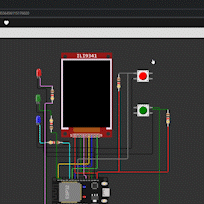

# Classwork

## __Classwork__

### Skeleton code

Remember to add the function prototypes in `main.c` for the declaration of the functions, as follow:

```C
/* main.c */
/* USER CODE BEGIN PFP */
void gpio_classwork(void);
void tft_classwork(void);
/* USER CODE END PFP */
```

### __Task 1__ :GPIO

- When `BTN1` is held, `LED1` should be on. __(@1)__
- When `BTN2` is held, `LED2` should be flashing (toggle in 50ms).__(@1)__
- When both `BTN1` and `BTN2` are held, the following sequence is conducted:__(@2)__
  - `LED1` and `LED3` are on while `LED2` are flashing.
  - After 1 second, `LED1` and `LED3` are flashing while `LED2` are on.
  - After 1 second, repeat from step 1.
- Keyword: Finite State Machine



- LED1 RED
- LED2 GREEN
- LED3 BLUE
- BTN1 RED one
- BTN2 GREEN one
- Order: BTN2 -> BTN1 -> BTN1 & BTN2

### __Task 2__ :TFT

- Print the time elapsed with the format of `mm:ss:sssZ` where `sssZ` means millisecond. e.g. `00:23:109` __(@2)__
- Print a 50px $\times$ 50px square directly under the elapsed time where its color changes when 1 second passed.__(@2)__
- Keywords: `HAL_GetTick`
- Hints:
  - ​$1234\mod10=4$
  - Integer division
    - $\frac{1234}{10}=123$
  - 1 min = 60 second, 1 second = 1000 milliseconds
- ​
  - The actual size of square printed on TFT should be larger than this one

> ⚠ Don't use`__forceinline static void fillRect(int16_t x, int16_t y, int16_t w, int16_t h, uint16_t color)` as it seems to cause error
