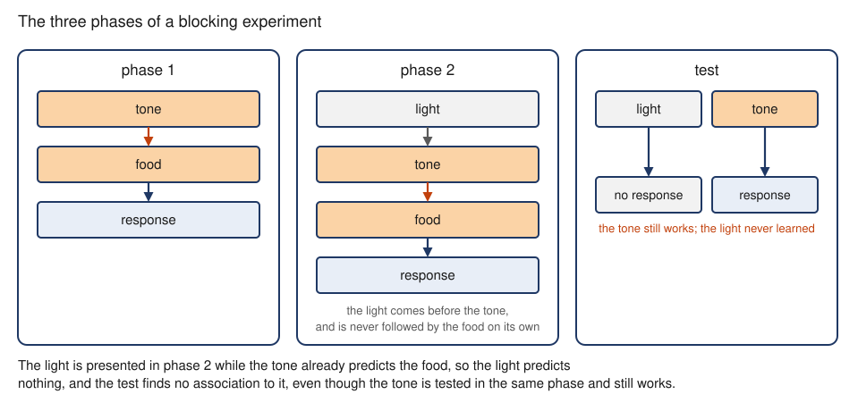

---
aliases:
  - Blocking effect
  - blocking
  - blocking effect
tags:
  - flashcard/active/special/academia/HKUST/SOSC_1960/blocking_effect
  - language/in/English
---

# blocking effect

A cue turns up before an event every time and never becomes a signal for it, because something else already predicted the event. This is blocking.

Interference is a prior association disrupting one that was learned. In blocking, the prior association stops the new one forming.

---

Flashcards for this section are as follows:

- what blocking is ::@:: A cue that turns up before an event every time still acquires no association when something else already predicts the event.
- how blocking differs from interference ::@:: Blocking stops the new association from forming. Interference is a prior association disrupting one that was learned.

## the three phases

A blocking experiment runs in three phases. In the first, a cue is paired with the outcome until the organism responds to it alone, making it a genuine predictor. In the second, that cue still pairs with the outcome. A second, previously neutral cue is presented on its own, just before that pairing. In the third, the test, the second cue is presented alone.

 

The second cue is easy to miss in the second phase, because it is familiar. In the test it draws no response, though it has turned up every time. The food never follows it alone, because the first cue already predicted the outcome. No association formed. The first cue still responds in the same phase, so this is not a failure to remember.

---

Flashcards for this section are as follows:

- overview ::@:: A first cue predicts the event, a second cue is added while the first keeps predicting, and the test finds no association to the second.
- what happens in the first phase ::@:: A first cue is paired with the outcome until the organism responds to that cue alone.
- what happens in the second phase ::@:: The first cue is still paired with the outcome. A second, previously neutral cue is presented on its own, just before the first.
- what happens in the third phase ::@:: The second cue is presented alone. The first cue is tested in the same phase and still produces its response.
-  ::@:: Phase 1, a tone paired with food. Phase 2, a light before that pairing. The test, the light alone producing nothing while the tone still produces a response.
- what makes the second cue easy to miss in the second phase ::@:: It is familiar, and the food never follows it alone.
- why no association forms to the second cue ::@:: The first cue already predicted the outcome every time it appeared, so nothing was predicted to follow the second.

## prediction error and attention

A conditioned stimulus acquires an association only when the outcome might have failed to arrive. That gap is the prediction error: the chance that the conditioned stimulus will not bring the expected outcome. Where the outcome arrives on schedule the error is zero, and there is nothing to attach.

The learner takes in the most valid predictors of significant events and ignores the rest. "Valid" means predictive, not merely frequent. A redundant cue earns nothing for turning up.

Attention is a condition on learning, not a faculty the learner either has or lacks. It decides which cue an association attaches to, in proportion to the surprise that cue generates. [Preparededness](preparedness%20(learning).md) is the boundary case: an association forms on a cue that raises no surprise.

---

Flashcards for this section are as follows:

- what must exist before an association can form ::@:: A prediction error, the chance that the conditioned stimulus will not bring the expected outcome.
- how large the prediction error is when the expected outcome arrives on schedule ::@:: Zero, so there is nothing to attach.
- which predictors a learner takes in ::@:: The most valid predictors of significant events, ignoring the rest.
- what makes a predictor valid in this account ::@:: Its accuracy at predicting, not how often it is present.
- what a redundant cue earns ::@:: Nothing, for turning up.
- how attention is allocated across cues ::@:: In proportion to the surprise each cue generates.
- what shows attention is a condition on learning rather than something the learner has or lacks ::@:: Preparedness, where an association forms on a cue that raises no surprise at all.

## a new manager's first announcement

Jim, a new manager, must tell his staff the company is making pay cuts. The announcement is the unconditioned stimulus, and the staff's displeasure is the unconditioned response. Jim is a neutral cue. Steve has given many unpopular announcements, so staff are upset when they see him. He already predicts the announcement and carries the displeasure. Jim is the second cue, arriving together with Steve.

Pairing the announcement with Jim predicts nothing new. Jim acquires no association, and the staff stay calm at the sight of him. An announcement Jim makes while Steve is absent is a surprise, because nothing in the room predicted it. The displeasure attaches to Jim. Blocking is a claim about which cue is present when the event arrives, not which manager is more senior.

---

Flashcards for this section are as follows:

- overview ::@:: Steve already predicts the pay-cut announcement, so pairing it with Jim blocks any association to Jim. The staff stay calm at the sight of the new manager.
- the unconditioned stimulus in the new-manager example ::@:: The announcement that the company is making pay cuts.
- the unconditioned response in the new-manager example ::@:: The staff's displeasure with the announcement.
- the first conditioned stimulus in the new-manager example ::@:: Steve, who has given many unpopular announcements before.
- the second conditioned stimulus in the new-manager example ::@:: Jim, the new manager, a neutral cue before the announcement.
- the conditioned response in the new-manager example ::@:: Staff becoming upset at the sight of Steve.
- what an announcement Jim makes while Steve is absent predicts ::@:: A surprise, because nothing in the room predicted it. The displeasure attaches to Jim instead.
- what the new-manager example shows blocking is a claim about ::@:: Which cue is present when the event arrives, not which manager is more senior.

## references

- Bouton, M. E. (\[missing\]). [Conditioning and learning](https://nobaproject.com/modules/conditioning-and-learning). In _Noba textbook series: Psychology_. Champaign, IL: DEF Publishers.
    - Source of the material on prediction error and attention as the conditions on which an association forms, and on blocking as the case where a prior association prevents one.
    - Available under the [CC BY-NC-SA 4.0](https://creativecommons.org/licenses/by-nc-sa/4.0/) license.
