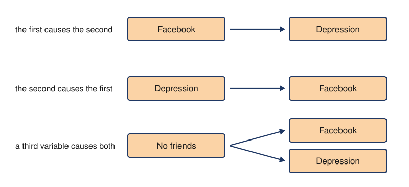

---
aliases:
  - correlation does not imply causation
  - correlation is not causation
tags:
  - flashcard/active/special/academia/HKUST/SOSC_1960/correlation_does_not_imply_causation
  - language/in/English
---

# correlation does not imply causation

A correlation measures how far two variables go together. It leaves the direction of cause open: several causal structures produce the same pattern, and no coefficient tells them apart. A causal claim needs a design that rules the other structures out.

---

Flashcards for this section are as follows:

- what a correlation measures, and what it leaves open ::@:: A correlation measures how far two variables go together and leaves the direction of cause open.
- why the direction of cause is undetermined ::@:: Several causal structures produce the same pattern, and no coefficient tells them apart.
- what turns an association into a causal finding ::@:: A design that rules the other structures out.

## three explanations of one association

Facebook use and depression travel together. Three causal structures produce that same pattern. Facebook use might cause depression. Depression might cause more Facebook use. Having no friends might cause both. The first two name a cause and an effect between the two variables. The third brings in a variable outside them. 
 

Nothing in the correlation itself picks between them. Each structure predicts the same pattern, so a more precise measure would not separate them either. What separates them is a design that can rule two of the three out. [Random assignment](random%20assignment.md) in an [experiment](experiment.md) does that fully. A [quasi-experiment](quasi-experiment.md) rules out only some.

---

Flashcards for this section are as follows:

- which structures produce the same correlation ::@:: One variable causing the other, the other causing the one, and a third variable causing both all produce the same correlation.
- the three structures in the Facebook use and depression case ::@:: Facebook use causing depression, depression causing more Facebook use, and having no friends causing both.
- how the third structure differs from the other two ::@:: Its cause sits outside the two variables, while the other two name a cause and an effect between them.
- which of the three is a causal claim about Facebook use and depression themselves ::@:: Facebook use causing depression.
- which of the three is usually missed ::@:: The third variable causing both, because ruling it out takes a design rather than a better measure.
- what would settle which structure holds ::@:: A design that rules out the other two. Random assignment does that fully; a quasi-experiment only partly.
-  ::@:: One correlation is compatible with all three of these structures.
- draw the three structures a correlation is compatible with ::@:: Two boxes joined by a rightward arrow. The same pair with the arrow reversed. One box with two arrows leaving it, one to each of two other boxes. 
 

## the three requirements for causation

A causal claim has to meet three requirements, whichever of the three structures it proposes.

- the cause has to come before the effect, which is temporal precedence;
- the two have to vary together, which is covariation of cause and effect;
- everything else that could produce the pattern has to be ruled out, which is elimination of alternative explanations.

Meeting two of the three is still not a causal finding.

A correlational design meets none of them. At best it meets covariation, in the form a [confounder](confounding.md) would have produced anyway.

In one study, participants are shown face images, and an area in the inferior temporal lobe becomes active. That shows the region responds to faces. It does not show that the activation produces the perception of a face. Each of the three requirements goes unmet.

- temporal precedence fails because the interval between the activation and the perception is too short to order without specialized tools;
- covariation fails because nothing shows the activation producing the perception;
- elimination of alternatives fails because nothing rules out a third variable.

---

Flashcards for this section are as follows:

- the bar a causal claim has to clear ::@:: A causal claim has to meet three requirements, whatever structure it proposes, and a study can meet two and still show nothing causal.
- the three requirements for causation ::@:: Temporal precedence, covariation of cause and effect, and elimination of alternative explanations.
- temporal precedence ::@:: The cause has to come before the effect.
- covariation of cause and effect ::@:: The two have to vary together.
- elimination of alternative explanations ::@:: Everything else that could produce the pattern has to be ruled out.
- how the requirements differ from the three explanations of one association ::@:: The structures say what data can show, while the requirements say what a claim has to meet.
- which requirement the third-variable structure belongs to ::@:: Elimination of alternative explanations, and the one most often left standing.
- what a correlational design can meet at best ::@:: Covariation, and only in the form a third variable would have produced anyway.
- what a study showing inferior temporal activation establishes ::@:: That the region responds to faces, not that the activation produces the perception of one.
- why temporal precedence fails in the face perception case ::@:: The interval between the activation and the perception is too short to order without specialized tools.
- why covariation fails in the face perception case ::@:: Nothing shows the activation producing the perception.
- why elimination of alternatives fails in the face perception case ::@:: Nothing rules out a third variable.

## claims that outrun their data

A televised health segment reported on a study of people who drank two cans of diet soda a day for ten years. The drinkers gained more around the waist than people who drank none. The segment stated the finding as diet soda causing weight gain.

The same report described a behaviour that accounts for the pattern. People who choose the sugar-free option treat it as saved calories and spend them elsewhere. No cause in that description runs from the soda to the body, so nothing in the comparison separates the soda from the compensation.

The claim stays in circulation rather than becoming a finding until a design can separate the two.

---

Flashcards for this section are as follows:

- how the televised report presented its finding ::@:: A televised report presented a comparison of diet soda drinkers with non-drinkers as evidence that diet soda causes weight gain.
- the comparison the report was based on ::@:: People drinking two cans of diet soda a day for ten years gained more waist circumference than people who drank none.
- the behaviour that could account for the pattern ::@:: Treating the sugar-free choice as saved calories and spending them on other food.
- what that behaviour would be, as a causal structure ::@:: A third variable, dietary compensation, in place of the soda as the cause.
- the status of the claim while no design rules the alternatives out ::@:: A claim in circulation, not a finding.
- why a correlational finding is easy to misreport ::@:: The data do not say which variable came first, and a report's wording can assert a direction the data never carried.

## references

- Scollon, C. N. (2023). Research designs. _Introduction to Psychology_. Noba Project. <https://nobaproject.com/modules/research-designs>
    - Source of the material on the three structures a correlation is compatible with, and on the third-variable case.
    - Available under the [CC BY-NC-SA 4.0](https://creativecommons.org/licenses/by-nc-sa/4.0/) license.
- \[missing\].
    - The source of the material on the three requirements for causation and on their being applied to activation in the inferior temporal lobe during face perception.
- CBS (2012). [Diet soda helping you gain weight?](https://www.youtube.com/watch?v=Io2nWfR_Keo) [Video]. YouTube.
    - Source of the material on the circulating claim that drinking diet soda leads to weight gain, and on the dietary compensation described in the same report.
