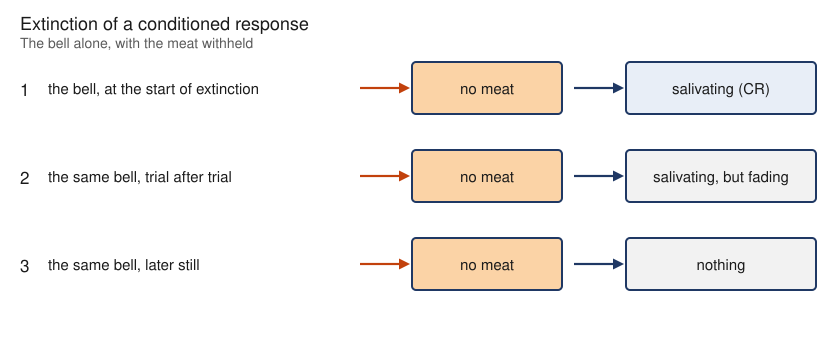

---
aliases:
  - Extinction (psychology)
  - extinction
  - extinction (psychology)
tags:
  - flashcard/active/special/academia/HKUST/SOSC_1960/extinction_(psychology)
  - language/in/English
---

# extinction (psychology)

A cue paired with an outcome comes to predict it. Present the cue again and again without the outcome, and the response fades to nothing.

The cue still predicts the outcome. It has stopped paying off. A new lesson now competes with the original association. The response is inhibited rather than deleted.

Two effects show that competition. One follows a rest with no exposure, and the other follows the cue turning up in a different context.

---

Flashcards for this section are as follows:

- what extinction is ::@:: A cue paired with an outcome comes to predict it. Present the cue again and again without the outcome, and the response fades to nothing.
- what extinction changes about the cue ::@:: Nothing about what it predicts. It has stopped paying off.
- what extinction does to a learned response ::@:: It inhibits the response rather than deleting the learning.
- the two effects that show extinction competing with the original learning ::@:: A rest with no exposure, and the cue turning up in a different context.

## the extinction procedure

A dog that learned to salivate at a bell hears the bell again and again with no meat. The bell produces nothing.

The ringing bell is a conditioned stimulus, the meat an unconditioned stimulus, and the salivation a conditioned response. After extinction the bell is a neutral stimulus again.

Only the response to the cue is suppressed, not the response to the unconditioned stimulus.

The loss is gradual, tracing the same acquisition curve in reverse.

 

---

Flashcards for this section are as follows:

- overview ::@:: A dog that learned to salivate at a bell hears that bell again and again with no meat, until the bell produces nothing.
- the three terms in the dog-and-bell example ::@:: The ringing bell is a conditioned stimulus, the meat an unconditioned stimulus, and the salivation a conditioned response.
- what the bell is called once extinction has run its course ::@:: A neutral stimulus again, and it produces nothing.
- which response extinction suppresses ::@:: The response to the cue, not the response to the unconditioned stimulus.
- the shape of the extinction curve ::@:: The acquisition curve in reverse. The reversal is gradual.
-  ::@:: The bell alone at the start of extinction, still producing salivation. The same bell trial after trial, producing salivation that fades. Later still, producing nothing.

## spontaneous recovery

A rest with no exposure after extinction is enough to bring the response back. The cue is presented again, with no new pairing and no unconditioned stimulus. Every recovery is real and partial, and a second rest brings it back weaker still.

Nothing in that procedure could undo the learning, yet the response came back. Erasure cannot explain that. What went missing was the cue's power to produce the response, not the association that gave the cue its meaning.

---

Flashcards for this section are as follows:

- overview ::@:: After a rest with no exposure to an extinguished conditioned stimulus, presenting it again can bring the conditioned response back with no new pairing.
- what a spontaneous recovery cost the learner ::@:: Nothing: no pairing and no unconditioned stimulus are needed.
- how strong a spontaneous recovery is ::@:: Real but partial. It is weaker than the response that was extinguished, and a second rest brings it back weaker still.
- what the pattern of spontaneous recovery rules out ::@:: Erasure of the association, since nothing was presented to undo the learning.
- what spontaneous recovery shows was removed instead ::@:: The cue's power to produce the response, not the association that gave the cue its meaning.

## renewal of an extinguished response

Change of context is a second route back. An extinguished response can come back when the cue turns up somewhere else. A different room is enough. This is renewal.

Renewal shows that extinction is bound to its context. What was learned is that the cue no longer predicts the event _here_. The context carries the inhibition, and a change of context leaves it behind.

A phobia treated by exposure in a clinic can return in a setting the treatment never covered.

---

Flashcards for this section are as follows:

- overview ::@:: An extinguished conditioned response can return when the cue is presented in a context other than the one in which it was extinguished.
- the contexts in which renewal is observed ::@:: Any context other than the one in which extinction occurred. A different room is the obvious case.
- what a renewal establishes about the scope of extinction ::@:: That it is bound to the context in which it occurred, not general. The context carries the inhibition, so a change of context leaves it behind.
- what extinction in one context amounts to ::@:: Learning that the cue no longer predicts the event here.
- the practical consequence of renewal for a treated phobia ::@:: A phobia treated by exposure in a clinic can return in a setting the treatment never covered.

## references

- Bouton, M. E. (source missing). [Conditioning and learning](https://nobaproject.com/modules/conditioning-and-learning). In _Noba textbook series: Psychology_. Champaign, IL: DEF Publishers.
    - Contributed to: extinction, the extinction procedure.
    - Available under the [CC BY-NC-SA 4.0](https://creativecommons.org/licenses/by-nc-sa/4.0/) license.
- Psychological Harassment Information Association (source missing). [Classical conditioning — Ivan Pavlov](https://www.youtube.com/watch?v=hhqumfpxuzI) [Video]. YouTube.
    - Contributed to: the extinction procedure, spontaneous recovery.
