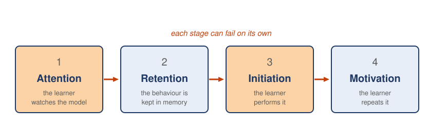

---
aliases:
  - Observational learning
  - Social learning theory
  - observational learning
tags:
  - flashcard/active/special/academia/HKUST/SOSC_1960/observational_learning
  - language/in/English
---

# observational learning

A learner watches someone act, then copies it. The person being watched is the social model, an authority the learner watches and tries to copy. Any reward or punishment lands on the person watched, not the learner, and sometimes nothing follows at all. Bandura's 1977 account, social learning theory, treats the watching itself as the learning. Conditioning and social learning theory differ in one point. The behaviour reinforced has to be the learner's own.

Four stages sit between watching and repeating: attention, retention, initiation, and motivation. Each can break on its own. A learner who cannot do an observed act has failed at one of the four, and each point calls for a different remedy.

---

Flashcards for this section are as follows:

- overview ::@:: A learner watches what other people do, and the consequences can fall on someone else or not appear at all.
- other name for observational learning ::@:: Social learning theory, in Bandura's 1977 account.
- what the two conditionings require ::@:: The behaviour reinforced has to be the learner's own.
- social model ::@:: An authority a learner watches and tries to copy.
- what the four stages being separate buys ::@:: Each stage can break on its own, and each one calls for a different remedy.

## the four stages

Copying a classmate's notes runs through all four. Attention holds while the classmate is similar or a credible high-achieving student. Retention needs the learner to see the notes as help for a quiz. Initiation needs access to the notes. Motivation comes from vicarious reinforcement, a good grade without punishment, or its opposite, a teacher's warning.

The four stages run in order, each one a step closer to repeating what the model did.

 

---

Flashcards for this section are as follows:

- overview ::@:: Four stages run in order, each one a step closer to repeating what the model did.
- observational learning stages:  ::@:: The learner watches the model, keeps the behaviour in memory, performs it, and repeats it.
- draw the four stages of learning from a model: in what order do they run? ::@:: Attention, then retention, then initiation, then motivation. 
 
- attention in the shared-notes example ::@:: It holds while the classmate is similar or a credible high-achieving student. It lapses for a stranger.
- retention in the shared-notes example ::@:: It needs the learner to register that the shared notes will help with a quiz. It lapses when nothing links the notes to a quiz.
- initiation in the shared-notes example ::@:: It needs access to the notes. It lapses when there is none.
- motivation in the shared-notes example ::@:: It comes from vicarious reinforcement, a good grade without punishment, or its opposite, a teacher's warning.

### attention

A learner who is not looking never gets the behaviour in. That is attention. The model matters as much as the learner does. A model like the observer, or of high status, holds attention. A stranger does not, however carefully the stranger acts.

---

Flashcards for this section are as follows:

- overview ::@:: Getting the behaviour in, which depends on the model as much as on the learner.
- what keeps attention on a model ::@:: Similarity to the observer, or high status.
- attention to a stranger who acts carefully ::@:: Nothing. The model matters, not how carefully the stranger acts.

### retention

Retention is what the watching leaves behind. A cooking demonstration leaves the demonstrator's hand placement in memory, not the fact that someone cooked.

---

Flashcards for this section are as follows:

- overview ::@:: Keeping the behaviour in memory after the watching stops.
- what retention keeps ::@:: The detail, not the gist.
- retention of a cooking demonstration ::@:: The demonstrator's hand placement, rather than the fact that someone cooked.

### initiation

Initiation turns what was retained into performance, and it is the first of two stages in which the learner acts alone. Motivation is the other. A learner reproduces a cooking demonstration in small trials, improving on what the watching showed. Doing it is not remembering it.

---

Flashcards for this section are as follows:

- overview ::@:: Turning what the learner retained into performance.
- how a cooking demonstration is reproduced ::@:: A learner tries it in small trials and improves on what the observation showed.
- the two stages in which the learner acts alone ::@:: Initiation and motivation.
- what separates initiation from retention ::@:: Doing it is not remembering it.

### motivation

The first three stages give an ability, not a habit: a learner can watch closely and still never repeat the act. Motivation answers the other question: whether the act is ever performed again. A model supplies the reason when it is admired, rewarded, or similar enough to stand in for the learner. The behaviour itself supplies none.

---

Flashcards for this section are as follows:

- overview ::@:: Deciding whether the learner ever performs the behaviour again.
- what attention, retention, and initiation together produce ::@:: An ability to perform the behaviour, not a habit of performing it.
- what makes a model supply that reason ::@:: Admiration, reward, or similarity strong enough that the model stands in for the learner.
- what the behaviour itself supplies as a reason ::@:: None. The reason comes from the model.

## what arrives with maturity

Age tempers what gets learned. Two things arrive late: the capacity to reflect on what one has seen, and the tendency to identify with other people. That step is empathy, and it keeps an observed act from becoming a habit of one's own. A child who imitates an aggressive act has copied it without the step where the act becomes their own.

---

Flashcards for this section are as follows:

- overview ::@:: Both the capacity to reflect on what one has seen and the tendency to identify with other people arrive with age.
- what a child who has imitated an aggressive act has done without ::@:: The step where the act becomes their own.
- what empathy does ::@:: It keeps an observed act from becoming a habit of one's own.

## references

- Bandura, A. (1977). _Social learning theory_. Prentice-Hall.
    - Source of the material on observational learning as social learning theory, and on the four stages a learner passes through.
- DebateFilms (\[missing\]). [The brain: A secret history — emotions; Bandura Bobo doll experiment](https://www.youtube.com/watch?v=zerCK0lRjp8) [Video]. YouTube.
    - Source of the material on the evidence that a child reproduces an observed act without being rewarded for it, and on reflection, identification, and empathy arriving with maturity.
- \[missing\].
    - The source of the worked example running the four stages through copying a classmate's notes, and of the coffee and cooking examples for each stage.
