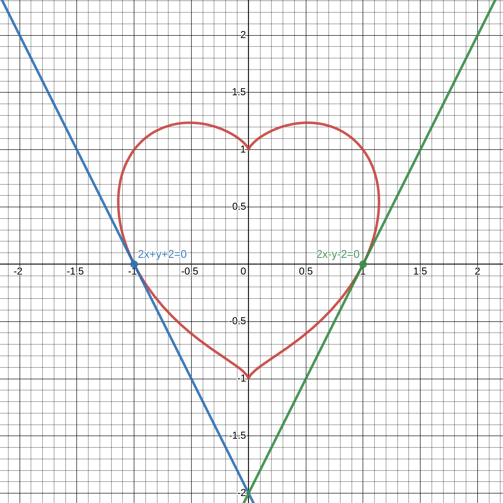

# 2023-12-06T124434.336+0800

Consider the curve $\left(x^2+y^2-1\right)^3=x^2y^3$. Find the equation of the tangent line(s) to the curve at the point where the curve intersects the $y$-axis.

## solution

$$\begin{aligned}
&\begin{aligned}\left(x^2+y^2-1\right)^3&=x^2y^3\\
3\left(x^2+y^2-1\right)^2\left(2x+\frac{\mathrm{d}y}{\mathrm{d}x}2y\right)&=2xy^3+\frac{\mathrm{d}y}{\mathrm{d}x}3x^2y^2\\
\frac{\mathrm{d}y}{\mathrm{d}x}\left(6y\left(x^2+y^2-1\right)^2-3x^2y^2\right)&=2xy^3-6x\left(x^2+y^2-1\right)^2\\
\frac{\mathrm{d}y}{\mathrm{d}x}&=\frac{2xy^3-6x\left(x^2+y^2-1\right)^2}{6y\left(x^{2}+y^{2}-1\right)^2-3x^2y^2}\end{aligned}\\
&\text{Set }y=0\text{.}\\
&\begin{aligned}\left(x^2+0^2-1\right)^3&=x^2(0)^3\\
\left(x^2-1\right)^3&=0\\
(x-1)(x+1)&=0\\
x&=-1\text{ or }1\end{aligned}\\
&\text{The intersection points are }(-1,0)\text{ and }(1,0)\text{.}\\
&\begin{aligned}\frac{\mathrm{d}y}{\mathrm{d}x}\Bigr|_{(-1,0)}&=\frac{2(-1)(0)^3-6(-1)\left((-1)^2+0^2-1\right)^2}{6(0)\left((-1)^2+0^2-1\right)^2-3(-1)^2(0)^2}\\
&=\frac00\\
\frac{\mathrm{d}y}{\mathrm{d}x}\Bigr|_{(1,0)}&=\frac{2(1)(0)^3-6(1)\left((1)^2+0^2-1\right)^2}{6(0)\left((1)^2+0^2-1\right)^2-3(1)^2(0)^2}\\
&=\frac00\end{aligned}\\
&\text{The derivatives are indeterminate forms.}\\
&\text{Parameterize the curve and find the local functions near the points to find the derivatives.}\\
&\text{Consider }(-1,0)\text{. Let }x=-\sqrt{t+1}\text{.}\\
&\begin{aligned}\left(\left(-\sqrt{t+1}\right)^2+y^2-1\right)^3&=\left(-\sqrt{t+1}\right)^2y^3\\
\left(t+y^2\right)^3&=(t+1)y^3\\
t+y^2&=(t+1)^\frac13y\\
y^2-(t+1)^\frac13y+t&=0\\
y&=\frac{(t+1)^\frac13\pm\sqrt{(t+1)^\frac23-4(1)(t)}}2\\
&=\frac{(t+1)^\frac13-\sqrt{(t+1)^\frac23-4(1)(t)}}2\\
&=\frac{(t+1)^\frac13-\sqrt{(t+1)^\frac23-4t}}2 && (\text{discard unwanted solutions})\\
\frac{\mathrm{d}y}{\mathrm{d}t}&=\frac12\left(\frac13(t+1)^{-\frac23}-\frac12\left((t+1)^\frac23-4t\right)^{-\frac12}\left(\frac23(t+1)^{-\frac13}-4\right)\right)\\
\frac{\mathrm{d}y}{\mathrm{d}t}\Bigr|_{(-1,0)}&=\frac12\left(\frac13-\frac12\left(\frac23-4\right)\right)\\
&=\frac12\left(\frac13+\frac53\right)\\
&=1\\
\frac{\mathrm{d}y}{\mathrm{d}x}\Bigr|_{(-1,0)}&=-1\cdot\frac{\mathrm{d}t}{\mathrm{d}x}\Bigr|_{(-1,0)}\\
&=1\cdot\frac1{-\frac12(0+1)^{-\frac12}}\\
&=-2\end{aligned}\\
&\text{Similarly, }\frac{\mathrm{d}y}{\mathrm{d}x}\Bigr|_{(1,0)}=2\text{.}\\
&\therefore\text{The tangents are }\frac{y-0}{x-(-1)}=-2\implies{}2x+y+2=0,\frac{y-0}{x-1}=2\implies{}2x-y-2=0\text{.}
\end{aligned}$$

<!-- markdownlint MD028 -->

## graph

