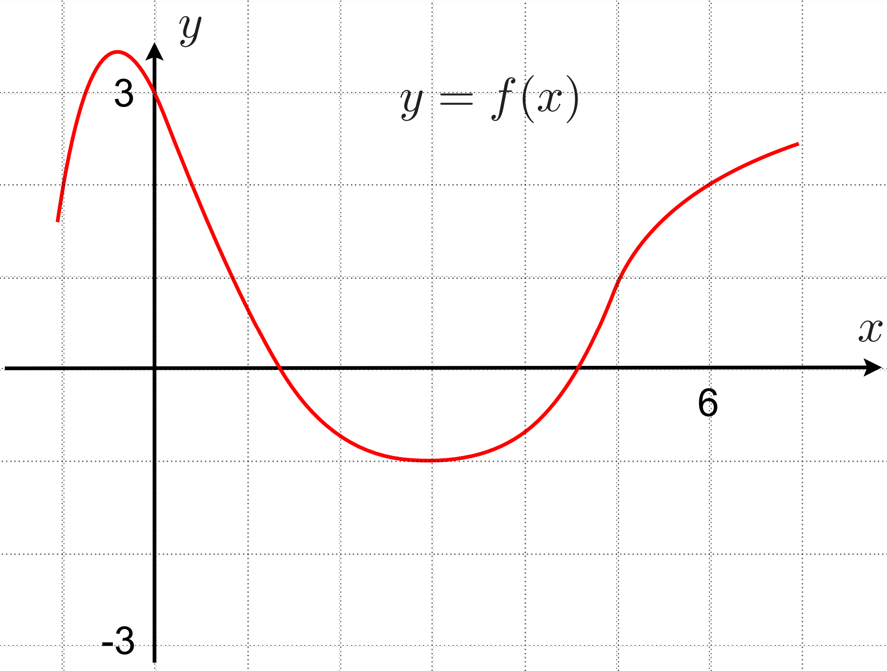

# 2023-12-08T001901.600+0800

The graph of $y = f(x)$ is given below. Find $$\int_0^5 \! \lvert{f'(x)}\rvert (f(x))^2 \, \mathrm{d}x$$.

## strategy

- inspecting "$$\int_0^5 \! \lvert{f'(x)}\rvert (f(x))^2 \, \mathrm{d}x$$" :@: Substitute $u = f(x)$. This removes $f'(x)$ (after handling the absolute operator) and turns $(f(x))^2$ into $u^2$. <!--SR:!2026-06-05,487,310-->

## solution

$$\begin{aligned}
&\text{Notice that } f'(x) < 0 \text{ for } x \in (0,3) \text{ and } f'(x) > 0 \text{ for } x \in (3,5) \text. \\
&\text{Split the integral into } (0,3) \text{ and } (3,5) \text{ to simplify } \lvert{f'(x)}\rvert \text. \\
&\begin{aligned}\int_0^5 \! \lvert{f'(x)}\rvert (f(x))^2 \, \mathrm{d}x & = \int_0^3 \! \lvert{f'(x)}\rvert (f(x))^2 \, \mathrm{d}x + \int_3^5 \! \lvert{f'(x)}\rvert (f(x))^2 \, \mathrm{d}x \\
& = - \int_0^3 \! f'(x)(f(x))^2 \, \mathrm{d}x + \int_3^5 \! f'(x)(f(x))^2 \, \mathrm{d}x\\
& = - \int_{x=0}^{x=3} \! (f(x))^2 \, \mathrm{d}f(x) + \int_{x=3}^{x=5} \! (f(x))^2 \, \mathrm{d}f(x)\\
& = \frac13 \left( - \left[ (f(x))^3 \right]_0^3 + \left[ (f(x))^3 \right]_3^5 \right) \\
& = \frac13 \left( (f(0))^3 - (f(3))^3 + (f(5))^3 - (f(3))^3 \right) \\
& = \frac13 \left( 3^3 - (-1)^3 + 1^3 - (-1)^3 \right) \\
& = \frac13 \cdot 30 \\
& = 10 \end{aligned}
\end{aligned}$$
