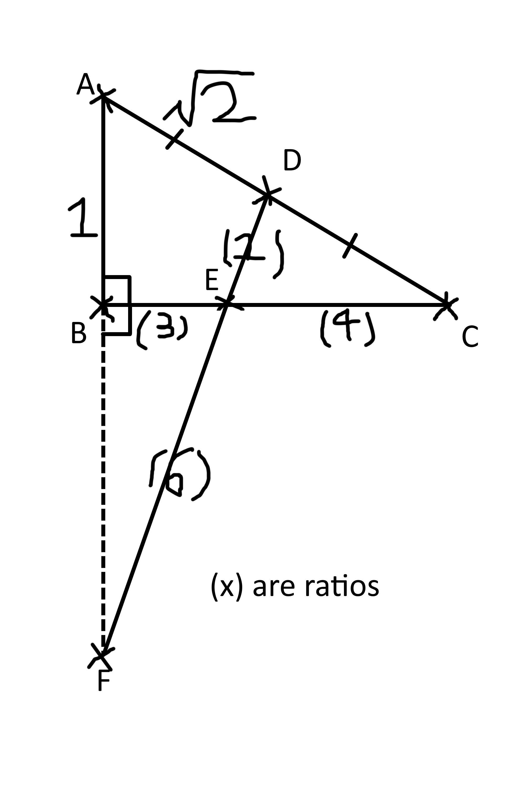

# 2023-12-23T111510.779+0800

$ABC$ is a triangle. $D$ is the midpoint of $AC$. $E$ is a point on $BC$ such that $BE : EC = 1 : t$, where $t > 0$. $F$ is a point produced from $DE$ such that $DE : EF = 1 : 6$. Let $\overrightarrow{AD} = \vec{a}$ and $\overrightarrow{AB} = \vec{b}$.

1. Express $\overrightarrow{AE}$ in terms of $t$, $\vec{a}$, and $\vec{b}$.
2. Express $\overrightarrow{AE}$ in terms of $\vec{a}$ and $\overrightarrow{AF}$.
3. Show that $\overrightarrow{AF} = \frac{8 - 6t}{1 + t} \vec{a} + \frac{7t}{1 + t} \vec{b}$.
4. Henceforth, assume $A$, $B$, and $F$ are collinear. Find the value of $t$.
5. Henceforth, assume $\lvert\vec{a}\rvert = \sqrt2$, $\cos \angle{BAC} = \frac1{2 \sqrt2}$, and $\lvert\overrightarrow{AB}\rvert = 1$. Find $\vec{a} \cdot \vec{b}$.
6. Find $\overrightarrow{AB} \cdot \overrightarrow{BC}$.
7. Does the circle the passes through $B$, $C$, and $D$, and pass through $F$?

## solution

1.  $$\begin{aligned}
\overrightarrow{AD} & = \frac12 \overrightarrow{AC} \\
\overrightarrow{AE} & = \frac{t}{1 + t} \overrightarrow{AB} + \frac{1}{1 + t} \overrightarrow{AC} \\
& = \frac{t}{1 + t} \overrightarrow{AB} + \frac{2}{1 + t} \overrightarrow{AD} \\
& = \frac{t}{1 + t} \vec{b} + \frac{2}{1 + t} \vec{a}
\end{aligned}$$
2.  $$\begin{aligned}
\overrightarrow{AE} & = \frac{6}{1 + 6} \overrightarrow{AD} + \frac{1}{1 + 6} \overrightarrow{AF} \\
& = \frac67 \overrightarrow{AD} + \frac17 \overrightarrow{AF} \\
& = \frac67 \vec{a} + \frac17 \overrightarrow{AF}
\end{aligned}$$
3.  $$\begin{aligned}
\overrightarrow{AE} & = \overrightarrow{AE} \\
\frac{t}{1 + t}\vec{b} + \frac{2}{1 + t}\vec{a} & = \frac67 \vec{a} + \frac17 \overrightarrow{AF} \\
\overrightarrow{AF} + 6 \vec{a} & = \frac{14}{1 + t} \vec{a} + \frac{7t}{1 + t} \vec{b} \\
\overrightarrow{AF} & = \frac{8 - 6t}{1 + t} \vec{a} + \frac{7t}{1 + t} \vec{b}
\end{aligned}$$
4.  $$\begin{aligned}
& \text{Let }\alpha\text{ be a real number.} \\
& \begin{aligned} \overrightarrow{AF} & = \alpha \overrightarrow{AB} && (A, B,\text{ and }F\text{ are collinear}) \\
\frac{8 - 6t}{1 + t} \vec{a} + \frac{7t}{1 + t} \vec{b} & = \alpha \vec{b} \\
8 - 6t & = 0 \\
t &= \frac43 \end{aligned} \\
\end{aligned}$$
5.  $$\begin{aligned}
\vec{a} \cdot \vec{b} & = \lvert\vec{a}\rvert \lvert\vec{b}\rvert \cos\angle{BAD} \\
& = \lvert\vec{a}\rvert \lvert\overrightarrow{AB}\rvert \cos\angle{BAC} \\
& = \left( \sqrt2 \right) (1) \frac1{2 \sqrt2} \\
& = \frac12
\end{aligned}$$
6.  $$\begin{aligned}
\overrightarrow{AB} \cdot \overrightarrow{BC} & = \overrightarrow{AB} \cdot (\overrightarrow{AC} - \overrightarrow{AB}) \\
& = \overrightarrow{AB} \cdot \overrightarrow{AC} - \overrightarrow{AB} \cdot \overrightarrow{AB} \\
& = 2 \overrightarrow{AB} \cdot \overrightarrow{AD} - \overrightarrow{AB} \cdot \overrightarrow{AB} \\
& = 2 \vec{b} \cdot \vec{a} - \lvert\overrightarrow{AB}\rvert^2 \\
& = 2 \cdot \frac12 - 1 \\
& = 0
\end{aligned}$$
7.  $$\begin{aligned}
& \because \overrightarrow{AB} \cdot \overrightarrow{BC} = 0 \\
& \therefore AF \perp BC \implies \angle{CBF} = 90 \degree \\
& \begin{aligned} \overrightarrow{AE} & = \frac47 \overrightarrow{AB} + \frac37 \overrightarrow{AC} \\
& = \frac47 \overrightarrow{AB} + \frac67 \overrightarrow{AD} \\
\overrightarrow{DE} & = \overrightarrow{AE} - \overrightarrow{AD} \\
& = \frac47 \overrightarrow{AB} + \frac67 \overrightarrow{AD} - \overrightarrow{AD} \\
& = \frac47 \overrightarrow{AB} - \frac17 \overrightarrow{AD} \\
\overrightarrow{AD} \cdot \overrightarrow{DE} & = \overrightarrow{AD} \cdot \left(\frac47 \overrightarrow{AB} - \frac17 \overrightarrow{AD}\right) \\
& = \frac47 \overrightarrow{AD} \cdot \overrightarrow{AB} - \frac17 \lvert\overrightarrow{AD}\rvert^2 \\
& = \frac47 \vec{a} \cdot \vec{b} - \frac17 \lvert\vec{a}\rvert^2 \\
& = \frac47 \cdot \frac12 - \frac27 \\
& = 0 \end{aligned} \\
& \because \overrightarrow{AD} \cdot \overrightarrow{DE} = 0 \\
& \therefore AC \perp DE \implies \angle{CDF} = 90 \degree \\
& \because \angle{CBF} = \angle{CDF} = 90 \degree \\
& \therefore BDCF \text{ is concyclic.} \\
& \therefore \text{The required answer is yes.}
\end{aligned}$$

## image

