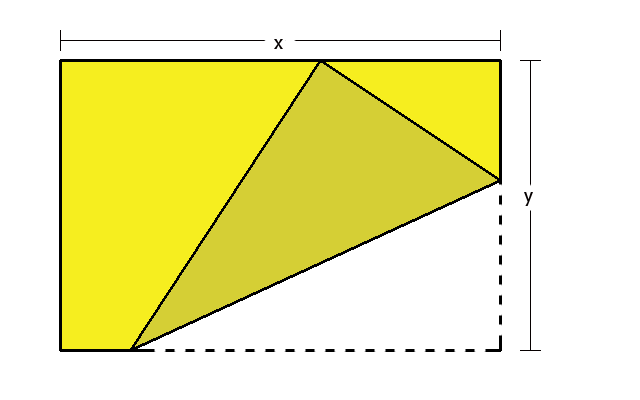

---
aliases:
  - folding@calculus
tags:
  - date/2023/11/08
  - flashcard/active/special/questions/folding_calculus
  - language/in/English
  - question/mathematics/calculus/differential
---

# folding@calculus

- datetime: 2023-11-08T11:23:22.634+08:00

A paper of length $x$ and height $y$ is given. The lower right corner is to be folded to the top edge forming a triangle as shown. Find the maximum and minimum area of the constructed triangle.

## strategy

- inspecting "A paper of length $x$ and height $y$ is given. The lower right corner is to be folded to the top edge forming a triangle as shown. Find the maximum and minimum area of the constructed triangle." :@: Realize that $x > y$, otherwise the folding is impossible. Further, the length of $x$ constrains the folding and needs to be considered. Parameterize the folding by the x-distance of the intersection of the middle horizontal line and the fold line from the right side. <!--SR:!2028-04-17,908,290-->

## solution

$$\begin{aligned}
w&\overset{\mathrm{def} }=\text{x-distance of the intersection of the middle horizontal line and the fold line from the right side}\\
m_1&=-\frac{y}{2w}\\
m_2&=\frac{2w}y\\
h&=\frac{y}2+m_2w\\
&=\frac{y}2+\frac{2w^2}y\\
&=\frac{y^2+4w^2}{2y}\\
b&=w+\frac{y}{2m_2}\\
&=w+\frac{y^2}{4w}\\
&=\frac{4w^2+y^2}{4w}\\
h&\le{}y\\
\frac{y^2+4w^2}{2y}&\le{}y\\
y^2+4w^2&\le2y^2\\
w^2&\le\frac14y^2\\
w&\in\left[-\frac{y}2,\frac{y}2\right]\\
b&\le{}x\\
\frac{4w^2+y^2}{4w}&\le{}x\\
4w^2+y^2&\le{}4wx\\
4w^2-4xw+y^2&\le{}0\\
w&\in\left[\frac{4x-\sqrt{(-4x)^2-4(4)\left(y^2\right)} }{2(4)},\frac{4x+\sqrt{(-4x)^2-4(4)\left(y^2\right)} }{2(4)}\right]\\
&\in\left[\frac{4x-\sqrt{16x^2-16y^2} }8,\frac{4x+\sqrt{16x^2-16y^2} }8\right]\\
&\in\left[\frac12x-\frac12\sqrt{x^2-y^2},\frac12x+\frac12\sqrt{x^2-y^2}\right]\\
w&\in\left[\frac12x-\frac12\sqrt{x^2-y^2},\frac12x+\frac12\sqrt{x^2-y^2}\right]\cap\left[-\frac{y}2,\frac{y}2\right]\cap(0,+\infty)\\
&\in\left[\frac12x-\frac12\sqrt{x^2-y^2},\frac12x+\frac12\sqrt{x^2-y^2}\right]\cap\left(0,\frac{y}2\right]\\
&\in\left[\frac12x-\frac12\sqrt{x^2-y^2},\frac{y}2\right]\setminus\set{0}\qquad\left(\frac12x-\frac12\sqrt{x^2-y^2}\ge0,\frac12x+\frac12\sqrt{x^2-y^2}\ge\frac{y}2\right)\\
A&=\frac12hb\\
&=\frac{\left(y^2+4w^2\right)^2}{16yw}\\
&=\frac{y^4+8y^2w^2+16w^4}{16yw}\\
&=\frac1{16}y^3w^{-1}+\frac12yw+y^{-1}w^3\\
&=y^{-1}w^{-1}\left(\frac1{16}y^4+\frac12y^2w^2+w^4\right)\\
&=y^{-1}w^{-1}\left(w^2+\frac14y^2\right)^2\\
A'&=-\frac1{16}y^3w^{-2}+\frac12y+3y^{-1}w^2\\
&=y^{-1}w^{-2}\left(-\frac1{16}y^4+\frac12y^2w^2+3w^4\right)\\
&=y^{-1}w^{-2}\left(3w^2-\frac14y^2\right)\left(w^2+\frac14y^2\right)\\
\mathrm{When\ }A'&=0,\\
w^2&=\frac{y^2}{12}\mathrm{\ or\ }-\frac{y^2}4\\
w&=\pm\frac{y}{2\sqrt{3} }\\
&=\frac{y}{2\sqrt{3} }\mathrm{\ (reject\ negative)}\\
\mathrm{When\ }A'&>0,\\
3w^2&>\frac14y^2,w^2>-\frac14y^2\mathrm{\ or\ }3w^2<\frac14y^2,w^2<-\frac14y^2\\
w^2&>\frac{y^2}{12}\\
w&>\frac{y}{2\sqrt3}\\
\mathrm{When\ }A'&<0,\\
3w^2&<\frac14y^2,w^2>-\frac14y^2\mathrm{\ or\ }3w^2>\frac14y^2,w^2<-\frac14y^2\\
w^2&<\frac{y^2}{12}\\
w&<\frac{y}{2\sqrt3}\\
\mathrm{When\ }w&=\frac{y}{2\sqrt3},A\text{ is minimum if }\frac{y}{2\sqrt3}\ge\frac12x-\frac12\sqrt{x^2-y^2}\\
\mathrm{When\ }w&=\frac12x-\frac12\sqrt{x^2-y^2},A\text{ is minimum otherwise}\\
\mathrm{When\ }w&=\frac{y}{2\sqrt3},\\
A&=y^{-1}\left(\frac{y}{2\sqrt3}\right)^{-1}\left(\left(\frac{y}{2\sqrt3}\right)^2+\frac14y^2\right)^2\\
&=\left(\frac{2\sqrt3}{y^2}\right)\left(\frac{y^2}{12}+\frac14y^2\right)^2\\
&=\left(\frac{2\sqrt3}{y^2}\right)\left(\frac13y^2\right)^2\\
&=\left(\frac{2\sqrt3}{y^2}\right)\left(\frac19y^4\right)\\
&=\frac{2\sqrt3}9y^2\\
\mathrm{When\ }w&=\frac{y}2,\\
A&=\frac1{16}y^3\left(\frac{y}2\right)^{-1}+\frac12y\left(\frac{y}2\right)+y^{-1}\left(\frac{y}2\right)^3\\
&=\frac18y^2+\frac14y^2+\frac18y^2\\
&=\frac{y^2}2\\
\mathrm{As\ }w&\to0^+,\\
A&\to\frac1{16}y^3\left(0^+\right)^{-1}+\frac12y\left(0^+\right)+y^{-1}\left(0^+\right)^3\\
&\to+\infty\\
\mathrm{When\ }w&=\frac12x-\frac12\sqrt{x^2-y^2},\\
A&=y^{-1}\left(\frac12x-\frac12\sqrt{x^2-y^2}\right)^{-1}\left(\left(\frac12x-\frac12\sqrt{x^2-y^2}\right)^2+\frac14y^2\right)^2\\
&=y^{-1}\left(\frac12x-\frac12\sqrt{x^2-y^2}\right)^{-1}\left(\frac14x^2-\frac12x\sqrt{x^2-y^2}+\frac14x^2-\frac14y^2+\frac14y^2\right)^2\\
&=\frac12x^2y^{-1}\left(x-\sqrt{x^2-y^2}\right)^{-1}\left(x-\sqrt{x^2-y^2}\right)^2\\
&=\frac12x^2y^{-1}\left(x-\sqrt{x^2-y^2}\right)\\
A_\mathrm{min}&=\begin{cases}\frac{2\sqrt3}9y^2,\frac{y}{2\sqrt3}\ge\frac12x-\frac12\sqrt{x^2-y^2}\\\frac12x^2y^{-1}\left(x-\sqrt{x^2-y^2}\right),\frac{y}{2\sqrt3}<\frac12x-\frac12\sqrt{x^2-y^2}\end{cases}\\
A_\mathrm{max}&=\max\left(\frac12y^2,\frac12x^2y^{-1}\left(x-\sqrt{x^2-y^2}\right)\right)
\end{aligned}$$
