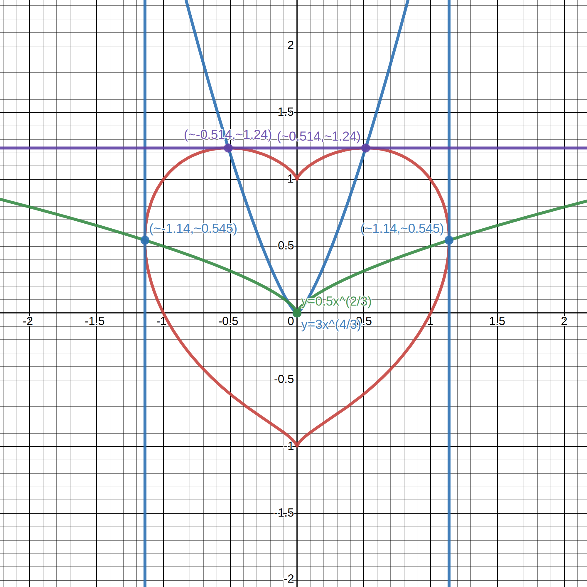

---
aliases:
  - heart tangents
tags:
  - date/2023/12/06
  - flashcard/active/special/questions/heart_tangents
  - language/in/English
  - question/mathematics/calculus/differential
---

# heart tangents

- datetime: 2023-12-06T14:35:21.125+08:00

Consider the curve $\left(x^2+y^2-1\right)^3=x^2y^3$. Find the number of horizontal and vertical tangent lines.

## strategy

- inspecting "Consider the curve $\left(x^2+y^2-1\right)^3=x^2y^3$. Find the number of horizontal and vertical tangent lines." :: First, try using existence theorems if needed, such as intermediate value theorem and monotonic properties, as they are simpler to use. Second, use implicit differentiation. Third, plotting the graph helps a lot. <!--SR:!2025-04-18,183,270-->
- finding horizontal and vertical tangents from the implicit derivative of $\left(x^2+y^2-1\right)^3=x^2y^3$ :: Whenever the numerator is 0, it is a _potential_ horizontal tangent. Whenever the denominator is a _potential_ vertical tangent. Whenever the numerator and denominator are both 0, it _may or may not_ be a tangent. We need to validate whether they are actual tangents though. <!--SR:!2025-04-18,183,270-->
- validating horizontal and vertical tangents at a specific point :: Find the actual derivative at that specific point. Also, consider the symmetry of the figure. <!--SR:!2025-01-31,129,250-->
- resolving the calculated derivative of $\left(x^2+y^2-1\right)^3=x^2y^3$ being $\frac 0 0$ :: Realize the expression is indeterminate. To resolve, consider only a part of the curve by letting $x = -\sqrt{t + 1}$ for the left intersection point and $x = \sqrt{t + 1}$ for the right intersection point to simplify the original equation as much as possible, which may make the derivative more "well-behaved". Then differentiate. <!--SR:!2024-11-15,89,270-->

## solution

$$\begin{aligned}
&\begin{aligned}\left(x^2+y^2-1\right)^3&=x^2y^3\\
3\left(x^2+y^2-1\right)^2\left(2x+\frac{\mathrm{d}y}{\mathrm{d}x}2y\right)&=2xy^3+\frac{\mathrm{d}y}{\mathrm{d}x}3x^2y^2\\
\frac{\mathrm{d}y}{\mathrm{d}x}\left(6y\left(x^2+y^2-1\right)^2-3x^2y^2\right)&=2xy^3-6x\left(x^2+y^2-1\right)^2\\
\frac{\mathrm{d}y}{\mathrm{d}x}&=\frac{2xy^3-6x\left(x^2+y^2-1\right)^2}{6y\left(x^{2}+y^{2}-1\right)^2-3x^2y^2}\end{aligned}\\
\\
&\text{Find potential zeros by setting the numerator to 0.}\\
&\begin{aligned}2xy^3-6x\left(x^2+y^2-1\right)^2&=0\\
2x\left(y^3-3\left(x^2+y^2-1\right)^2\right)&=0\\
2x\left(y^3-3x^\frac43y^2\right)&=0\\
2xy^2\left(y-3x^\frac43\right)&=0\\
x&=0&&\text{or}&y&=0&&\text{or}&y=3x^\frac43\end{aligned}\\
\\
&\text{Find potential poles by setting the denominator to 0.}\\
&\begin{aligned}6y\left(x^2+y^2-1\right)^2-3x^2y^2&=0\\
3y\left(2\left(x^2+y^2-1\right)^2-x^2y\right)&=0\\
3y\left(2x^\frac43y^2-x^2y\right)&=0\\
3x^\frac43y^2\left(2y-x^\frac23\right)&=0\\
x&=0&&\text{or}&y&=0&&\text{or}&y=\frac12x^\frac23\end{aligned}\\
\\
&\text{Find all potential points where the zeros and poles intersect.}\\
&\begin{aligned}3x^\frac43&=\frac12x^\frac23\\
x^\frac23&=\frac16\\
x&=\pm\frac{\sqrt6}{36}\end{aligned}\\
&\text{They may intersect when }x=0\text{ or }y=0\text{ or }x=\pm\frac{\sqrt6}{36}\text.\\
\\
&\text{Put potential zeros and poles into the curve equation.}\\
&\begin{aligned}\left(x^2+y^2-1\right)^3&=x^2y^3\\
\left(0^2+y^2-1\right)^3&=0^2y^3\\
\left(y^2-1\right)^3&=0\\
y&=\pm1 && (x=0)\\
\\
\left(x^2+y^2-1\right)^3&=x^2y^3\\
\left(x^2+0^2-1\right)^3&=x^20^3\\
\left(x^2-1\right)^3&=0\\
x&=\pm1 && (y=0)\\
\\
\left(x^2+y^2-1\right)^3&=x^2y^3\\
\left(x^2+\left(3x^\frac43\right)^2-1\right)^3&=x^2\left(3x^\frac43\right)^3\\
\left(x^2+9x^\frac83-1\right)^3&=27x^6\\
x^2+9x^\frac83-1&=3x^2\\
2x^2-9x^\frac83+1&=0 && \left(y=3x^\frac43\right)\\
\\
\left(x^2+y^2-1\right)^3&=x^2y^3\\
\left(x^2+\left(\frac12x^\frac23\right)^2-1\right)^3&=x^2\left(\frac12x^\frac23\right)^3\\
\left(x^2+\frac14x^\frac43-1\right)^3&=\frac18x^4\\
x^2+\frac14x^\frac43-1&=\frac12x^\frac43\\
x^2-\frac14x^\frac43-1&=0 && \left(y=\frac12x^\frac23\right)\end{aligned}\\
\\
&\text{Find how many real roots the last two equations have using differentiation.}\\
&\begin{aligned}
f(x)&\overset{\text{def} }=2x^2-9x^\frac83+1\\
f'(x)&=4x-24x^\frac53\\
&=4x\left(1-6x^\frac23\right)\\
f'(x)&>0&\text{when }&4x>0,1-6x^\frac23>0\text{ or }4x<0,1-6x^\frac23<0\\
&&\implies&x>0,x^2<\frac1{216}\text{ or }x<0,x^2>\frac1{216}\\
&&\implies&x\in\left(-\infty,-\frac{\sqrt6}{36}\right)\cup\left(0,\frac{\sqrt6}{36}\right)\\
f'(x)&<0&\text{when }&4x>0,1-6x^\frac23<0\text{ or }4x<0,1-6x^\frac23>0\\
&&\implies&x>0,x^2>\frac1{216}\text{ or }x<0,x^2<\frac1{216}\\
&&\implies&x\in\left(-\frac{\sqrt6}{36},0\right)\cup\left(\frac{\sqrt6}{36},+\infty\right)\\
f(0)&=2(0)^2-9(0)^\frac83+1\\
&=1\\
f\left(\frac{\sqrt6}{36}\right)&=2\left(\frac{\sqrt6}{36}\right)^2-9\left(\frac{\sqrt6}{36}\right)^\frac83+1\\
&=\frac1{108}-\frac1{144}+1\\
&=\frac{433}{432}\\
f\left(-\frac{\sqrt6}{36}\right)&=2\left(-\frac{\sqrt6}{36}\right)^2-9\left(-\frac{\sqrt6}{36}\right)^\frac83+1\\
&=\frac1{108}-\frac1{144}+1\\
&=\frac{433}{432}\\
\lim_{x\to\pm\infty}f(x)&=-\infty\end{aligned}\\
&\text{By intermediate value theorem and monotonic properties,}\\
&2x^2-9x^\frac83+1\text{ has two and only two real roots each in }\left(-\infty,-\frac{\sqrt6}{36}\right)\text{ and }\left(\frac{\sqrt6}{36},+\infty\right)\text.\\
&\text{As the zeros found above and potential poles do not intersect,}\\
&\text{there are at least two horizontal tangent lines.}\\
\\
&\begin{aligned}
f(x)&\overset{\text{def} }=x^2-\frac14x^\frac43-1\\
f'(x)&=2x-3x^\frac13\\
&=x^\frac13\left(2x^\frac23-3\right)\\
f'(x)&>0&\text{when }&x^\frac13>0,x^\frac23>\frac32\text{ or }x^\frac13<0,x^\frac23<\frac32\\
&&\implies&x\in\left(-\frac{3\sqrt{6} }4,0\right)\cup\left(\frac{3\sqrt{6} }4,+\infty\right)\\
f'(x)&<0&\text{when }&x^\frac13>0,x^\frac23<\frac32\text{ or }x^\frac13<0,x^\frac23>\frac32\\
&&\implies&x\in\left(-\infty,-\frac{3\sqrt6}4\right)\cup\left(0,\frac{3\sqrt6}4\right)\\
f(0)&=0^2-\frac14(0)^\frac43-1\\
&=-1\\
f\left(\frac{3\sqrt6}4\right)&=\left(\frac{3\sqrt6}4\right)^2-\frac14\left(\frac{3\sqrt6}4\right)^\frac43-1\\
&=\frac{27}{8}-\frac9{16}-1\\
&=\frac{29}{16}\\
f\left(-\frac{3\sqrt6}4\right)&=\left(-\frac{3\sqrt6}4\right)^2-\frac14\left(-\frac{3\sqrt6}4\right)^\frac43-1\\
&=\frac{27}{8}-\frac9{16}-1\\
&=\frac{29}{16}\end{aligned}\\
&\text{By intermediate value theorem and monotonic properties,}\\
&x^2-\frac14x^\frac43-1\text{ has two and only two real roots each in }\left(-\frac{3\sqrt6}4,0\right)\text{ and }\left(0,\frac{3\sqrt6}4\right)\text.\\
&\text{The two real roots are both not at }x = \pm\frac{\sqrt6}{36}\text{ which can be validated by direct calculation.} \\
&\text{As the poles found above and potential zeros do not intersect,}\\
&\text{there are at least two vertical tangent lines.}\\
\\
&\text{There are four points left to check: }(1,0),(0,1),(-1,0),(0,-1)\\
&\text{For }(0,-1),(0,1)\text{, parameterize the curve and find the local functions near the points to find the derivatives.}\\
&\text{Consider }(0,-1)\text{. Let }y=-\sqrt{t+1}\text.\\
&\begin{aligned}\left(x^2+\left(-\sqrt{t+1}\right)^2-1\right)^3&=x^2\left(-\sqrt{t+1}\right)^3\\
\left(x^2+t\right)^3&=-x^2\left(t+1\right)^\frac32\\
x^2+t&=-x^\frac23\sqrt{t+1}\\
\frac{\mathrm{d}x}{\mathrm{d}t}2x&=-\frac{\mathrm{d}x}{\mathrm{d}t}\frac23x^{-\frac13}\sqrt{t+1}-\frac12x^\frac23(t+1)^{-\frac12}\\
\frac{\mathrm{d}x}{\mathrm{d}t}&=-\frac{\frac12x^\frac23(t+1)^{-\frac12} }{2x+\frac23x^{-\frac13}\sqrt{t+1} }\\
&=-\frac{3x}{12x^\frac43\sqrt{t+1}+4(t+1)}\\
\frac{\mathrm{d}x}{\mathrm{d}t}\Bigr|_{(0,-1)}&=\frac{3(0)}{12(0)^\frac43\sqrt{0+1}+4(0+1)}\\
&=0\\
\frac{\mathrm{d}x}{\mathrm{d}y}\Bigr|_{(0,-1)}&=0\cdot\frac{\mathrm{d}t}{\mathrm{d}y}\Bigr|_{(0,-1)}\\
&=0\cdot\frac1{-\frac12\left(0+1\right)^{-\frac12} }\\
&=0\end{aligned}\\
&\text{Similarly, }\frac{\mathrm{d}x}{\mathrm{d}y}\Bigr|_{(0,1)}=0\text{.}\\
&\text{This suggests }(0,-1),(0,1)\text{ have vertical tangent lines.}\\
&\text{However, as the equation depends on }x\text{ in the form of }x^2\text{ only, the curve is symmetric across the }y\text{-axis.}\\
&\text{The symmetry means the isolated poles }(0,-1),(0,1)\text{ can either have undefined or horizontal tangent lines.}\\
&\text{Therefore, }(0,-1),(0,1)\text{ do not have tangent lines.}\\
\\
&\text{For }(-1,0),(1,0)\text{, also parameterize the curve and find the local functions near the points to find the derivatives.}\\
&\text{Consider }(-1,0)\text{. Let }x=-\sqrt{t+1}\text.\\
&\begin{aligned}\left(\left(-\sqrt{t+1}\right)^2+y^2-1\right)^3&=\left(-\sqrt{t+1}\right)^2y^3\\
\left(t+y^2\right)^3&=(t+1)y^3\\
t+y^2&=(t+1)^\frac13y\\
y^2-(t+1)^\frac13y+t&=0\\
y&=\frac{(t+1)^\frac13\pm\sqrt{(t+1)^\frac23-4(1)(t)} }2\\
&=\frac{(t+1)^\frac13-\sqrt{(t+1)^\frac23-4(1)(t)} }2\\
&=\frac{(t+1)^\frac13-\sqrt{(t+1)^\frac23-4t} }2 && (\text{discard unwanted solutions})\\
\frac{\mathrm{d}y}{\mathrm{d}t}&=\frac12\left(\frac13(t+1)^{-\frac23}-\frac12\left((t+1)^\frac23-4t\right)^{-\frac12}\left(\frac23(t+1)^{-\frac13}-4\right)\right)\\
\frac{\mathrm{d}y}{\mathrm{d}t}\Bigr|_{(-1,0)}&=\frac12\left(\frac13-\frac12\left(\frac23-4\right)\right)\\
&=\frac12\left(\frac13+\frac53\right)\\
&=1\\
\frac{\mathrm{d}y}{\mathrm{d}x}\Bigr|_{(-1,0)}&=-1\cdot\frac{\mathrm{d}t}{\mathrm{d}x}\Bigr|_{(-1,0)}\\
&=1\cdot\frac1{-\frac12(0+1)^{-\frac12} }\\
&=-2\end{aligned}\\
&\text{Similarly, }\frac{\mathrm{d}y}{\mathrm{d}x}\Bigr|_{(1,0)}=2\text{.}\\
&\text{Therefore, }(-1,0),(1,0)\text{ do not have either horizontal or vertical tangent lines.}\\
\\
&\text{Therefore, the curve has two horizontal and two vertical tangent lines.}
\end{aligned}$$

## graph

